# 003：隐藏在Android Netlink内核模块中的攻击面

在本课程中，我们将学习Android生态系统中一个深藏的攻击面——Netlink内核模块。我们将从Netlink的基本概念入手，分析其攻击面，探讨真实世界中的漏洞场景，并了解验证和利用这些漏洞的方法，最后为厂商提供安全建议。

## 01：演讲者介绍

我们来自百度AOT安全团队。

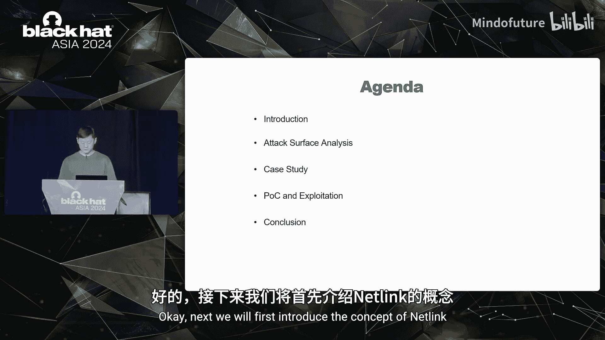

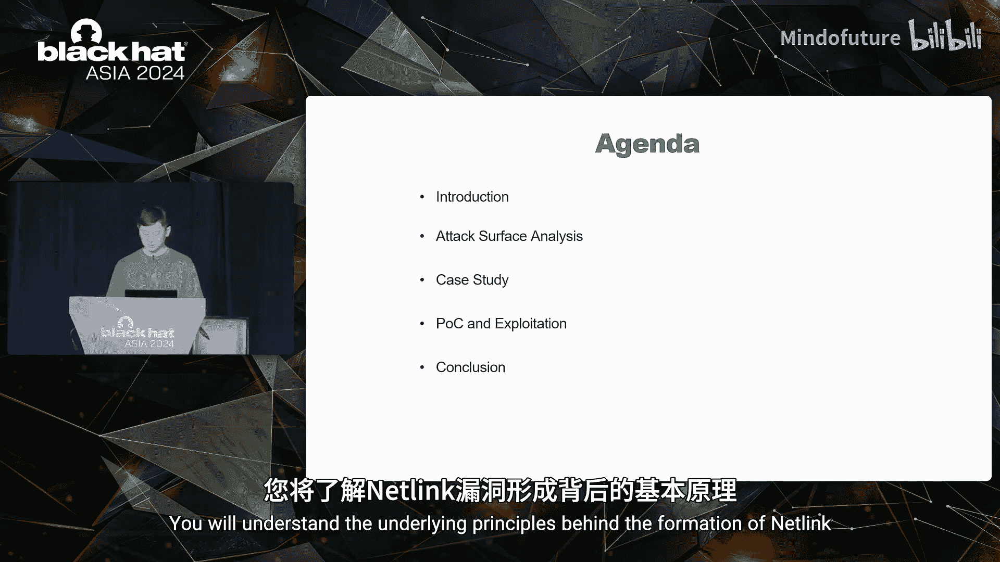

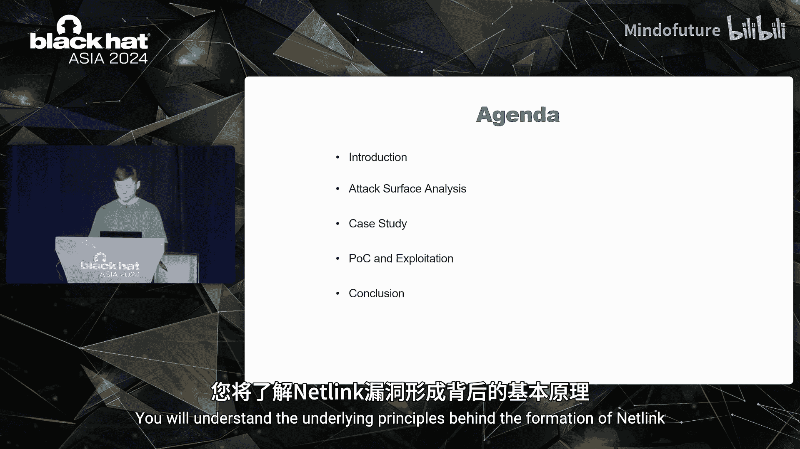

*   **Cha**：专注于Android和Linux漏洞挖掘与利用，在过去八个月中发现了超过100个漏洞，涉及Linux内核、Co、Medium Tech等领域。
*   **Han Yan**：对IT和平台安全更感兴趣，曾是BlackHat USA的演讲者。
*   **Tim Sha**：我们的团队负责人，专注于系统和软件安全解决方案，曾是Pwn2Own和HITB的演讲者。

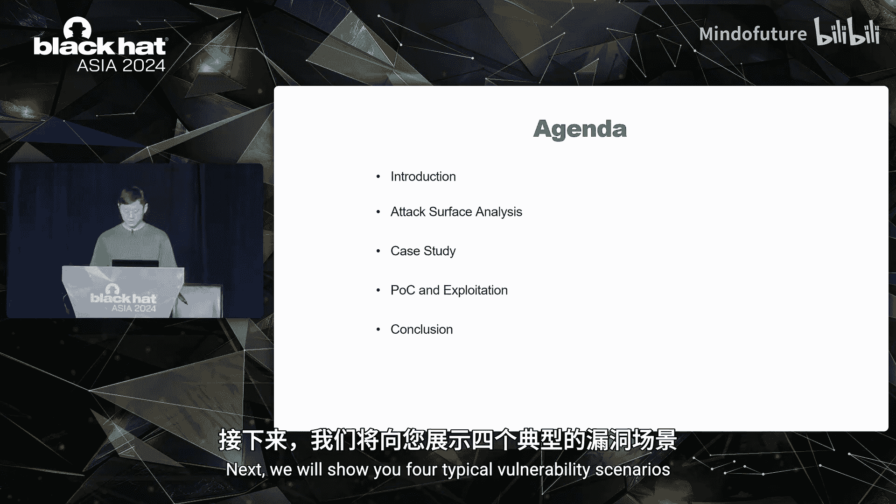

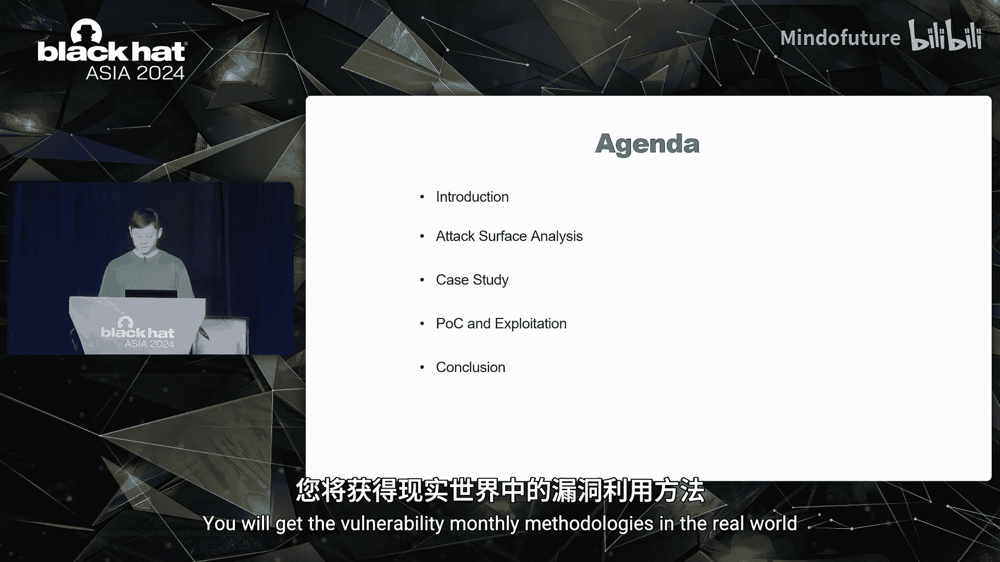

## 02：Netlink概念介绍

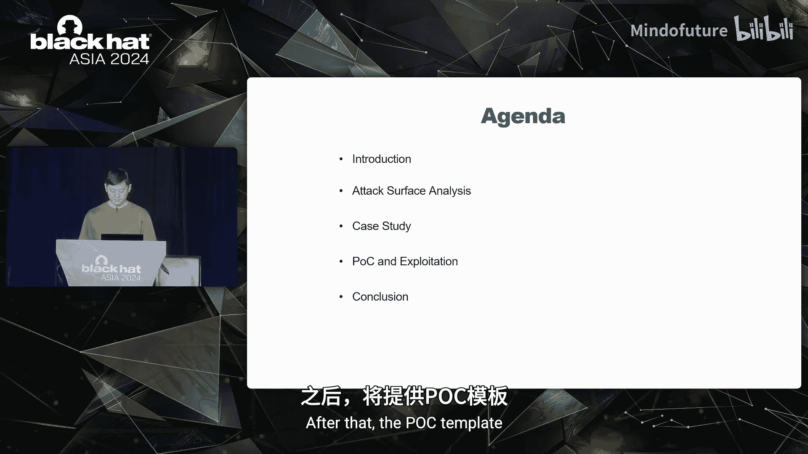

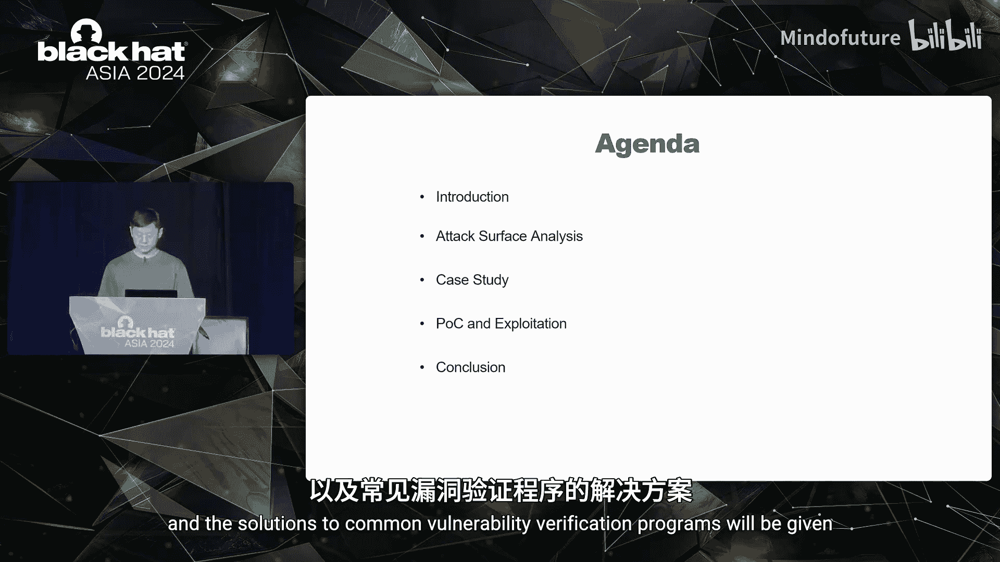

上一节我们介绍了演讲者，本节中我们来看看什么是Netlink。

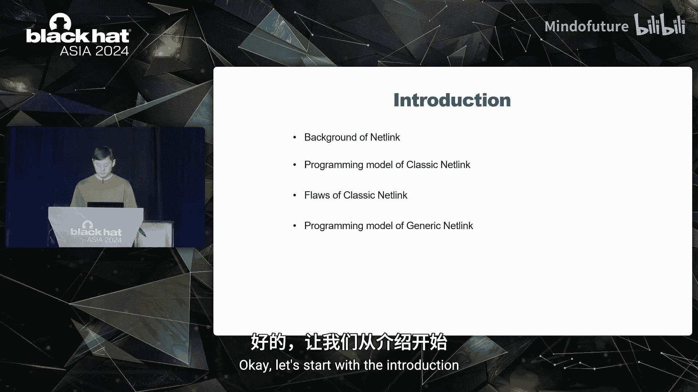

Netlink常被描述为ioctl的替代品，主要用于内核与用户空间进程之间的双向通信。用户空间进程之间的通信也适用。

Netlink具有一些不同于ioctl的特性，例如全双工、异步和组播。

根据其用途，我们将Netlink分为两类：
*   **经典Netlink**：除ID 16以外的Netlink。
*   **通用Netlink**：ID固定为16。

经典Netlink自1999年Linux 2.2起被支持。它是一个套接字族，因此其用户空间编程模型使用Linux Socket API。

由于其全双工通信的特性，Netlink传输消息有两个方向：自上而下（用户空间到内核）和自下而上（内核到用户空间）。

*   内核通过`netlink_kernel_create`函数注册的`input`函数处理来自用户空间的消息，它接收包含Netlink传输消息的`sk_buff`作为输入参数。
*   内核通过`nlmsg_unicast`或`nlmsg_multicast`函数向用户空间发送Netlink消息。

经典Netlink的编程模型看似完善，但为何后来又引入了通用Netlink？让我们看看经典Netlink的内核注册函数`netlink_kernel_create`。

其第二个参数`unit`代表Netlink协议ID。如果我们想自定义一个经典Netlink，需要添加一个新的协议ID。在Linux内核中，协议ID的最大数量是32，内核已经占用了22个，只留下10个供自定义使用。此外，经典Netlink使用起来更复杂，因为它需要我们自己解析Netlink消息。

因此，通用Netlink应运而生。

通用Netlink自2006年Linux 2.6.15起被支持。所有自定义用途可以共享单个协议ID 16。在解析用户空间消息时，我们只需要关注有效载荷（也称为属性）。

*   内核通过`genl_register_family`函数注册`ops`和`small_ops`。两者的区别在于`small_ops`提供了更少的消息处理函数，更简单。两者都包含`doit`函数。
*   `doit`函数用于解析从用户空间接收到的属性，它接收`sk_buff`和`genl_info`作为输入参数，`info`包含用户有效载荷或属性。
*   内核通过`genlmsg_unicast`等函数向用户空间发送Netlink属性。

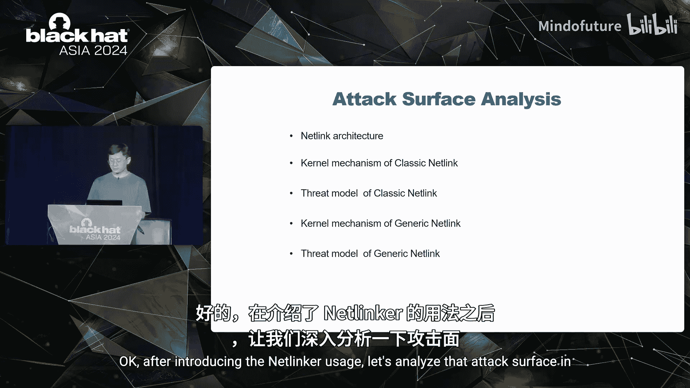

## 03：Netlink攻击面深度分析

在介绍了Netlink的用途后，让我们深入分析其攻击面。

首先，看看用户空间的Netlink架构。应用程序可以直接调用或间接使用Lib NL来调用Linux Socket API，将Netlink消息发送到内核空间。内核收到消息后，会将其路由到Netlink子系统，子系统根据其用途类别进行处理。

接下来，我们将重点关注Linux内核Netlink子系统的消息处理机制。

一个经典Netlink传输消息可能由多个Netlink消息组成。每个消息包含Netlink消息头、有效载荷及其填充。头部大小和有效载荷大小应为4字节对齐。`nlmsghdr`结构包含五个字段：消息长度、类型、标志、序列号和进程端口ID。消息长度是一个Netlink消息的总大小。端口ID通常设置为进程ID。

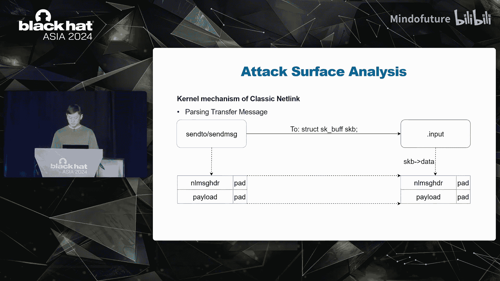

经典Netlink传输消息通过`sendto`或`sendmsg`函数从用户空间发送到内核空间。`sk_buff`将包含传输消息，它是`input`函数的输入参数，该函数由`netlink_kernel_create`注册。我们可以从`skb->data`获取传输消息。

问题是，Linux内核Netlink子系统对传输消息做了哪些检查？

答案是：**不进行任何检查**。这意味着需要开发者自行检查Netlink消息头。将检查工作留给开发者是一种危险的行为。

那么，在不知道攻击方式的情况下，如何安全地解析自上而下的传输消息？我们总结了三种可能的攻击向量：
1.  开发者没有充分理解`skb->len`、`nlmsghdr->nlmsg_len`和`NLMSG_HDRLEN`宏之间的关系，因此根本不进行任何检查。`skb->len`是传输消息的总大小，可能包含多个Netlink消息。`nlmsghdr->nlmsg_len`是一个消息的总大小。`NLMSG_HDRLEN`是一个消息头部的大小，是固定值。一个便捷的方法是使用`nlmsg_ok`宏来进行这些检查。
2.  开发者在解析有效载荷结构时，没有检查有效载荷长度。
3.  开发者没有完全检查有效载荷内容的有效性。

相比之下，我们如何攻击发送到用户空间的经典Netlink消息？我们能想到的是将其与其他内核攻击面（如文件操作、套接字等）结合。我们可以通过经典Netlink消息反向推导来源，然后进行漏洞挖掘。

分析了经典Netlink的攻击面后，让我们继续分析通用Netlink。

通用Netlink的消息格式如下所示。我们可以看到通用Netlink是基于经典Netlink创建的，因为它们的基本消息格式相同。区别在于有效载荷的构成，它包含一个通用Netlink消息头、一个家族头、属性及其填充。每个属性包含一个Netlink属性头、属性有效载荷及其填充。

家族头是可选的且可自定义。因此我们重点关注通用Netlink消息头和属性头。
*   `genlmsghdr`结构包含三个字段：命令、版本和保留。命令字段将指示内核调用哪个`doit`函数。
*   `nlattr`结构包含两个字段：Netlink属性长度和类型，与属性有效载荷一起构成TLV结构。`nlattr->nla_len`是一个属性的总大小，包括Netlink属性头的大小。`nlattr->nla_type`是属性数组的索引。

通用传输消息同样通过`sendto`或`sendmsg`函数从用户空间发送到内核空间。`sk_buff`将包含传输消息，它是`doit`函数的输入参数，该函数由家族注册函数注册。我们可以从`info->attrs`字段获取传输消息。

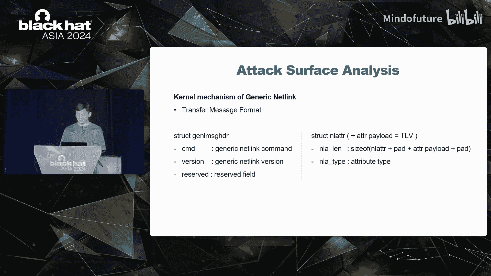

同样的问题是，Linux内核Netlink子系统对属性做了哪些检查？

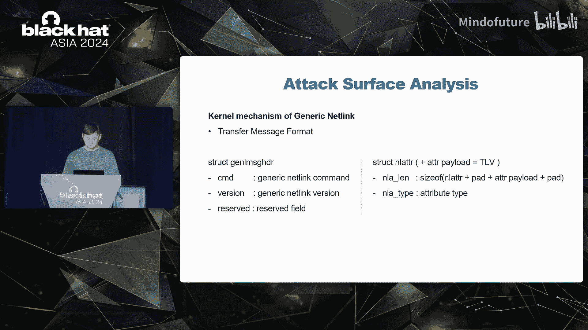

答案是：**通过NLA策略进行检查**。NLA策略，即Netlink属性策略，在`genl_family`结构或`genl_ops`结构中注册。`genl_ops`的策略优先于`genl_family`的策略。

`nla_policy`包含属性类型、长度、联合体等。这里的属性类型是属性有效载荷的数据类型。长度的含义取决于属性类型，例如，如果类型是`NLA_STRING`，长度是属性有效载荷的最大长度。联合体也用于根据验证类型检查有效性。

所有对属性的检查都在`validate_nla`函数中完成。

那么，自上而下的通用Netlink传输消息解析就没有安全问题了吗？当然不是。

让我们看看由于开发者疏忽导致的一些攻击向量：
1.  开发者在策略注册阶段根本没有设置策略，或者设置了不完整的策略。
2.  开发者在属性解析阶段没有检查属性是否存在。
3.  开发者在属性解析阶段没有完全检查属性有效载荷内容的有效性。

相比之下，我们如何攻击发送到用户空间的通用Netlink消息？与经典Netlink相同，我们可以将其与其他内核攻击面（如文件、套接字等）结合。我们可以通过通用Netlink消息反向推导来源，然后进行漏洞挖掘。

## 04：典型漏洞场景分析

从前面的分析我们可以得出结论，经典和通用Netlink都存在一些可能的安全威胁。现在让我们看看现实世界中的一些典型Netlink漏洞场景。

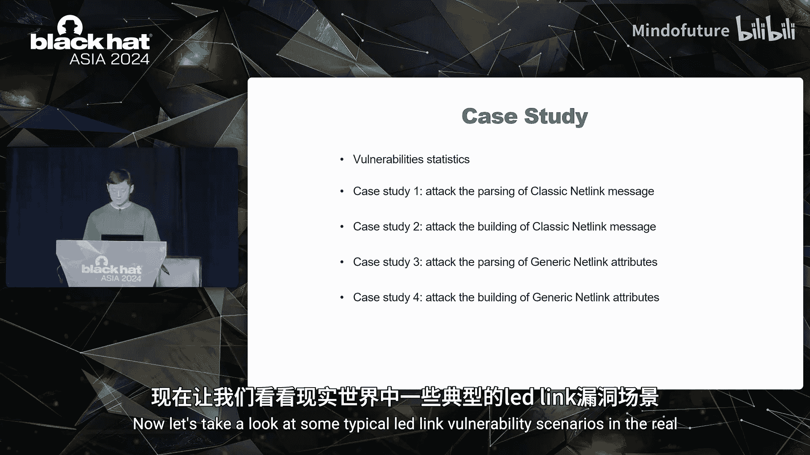

基于攻击面，我们调查了四家知名厂商的Netlink相关代码，发现了38个漏洞并获得了19个CVE。所有漏洞都已被厂商修复。

数据显示，与经典Netlink相关的漏洞更多，严重性也更高。这表明我们应该考虑使用通用Netlink进行自定义，而不是经典Netlink。同时，上游和下游内核都可能存在漏洞，但下游内核更可能产生Netlink相关漏洞。

以下是四个典型案例：

**案例一：攻击经典Netlink消息解析**
在此场景中，经典Netlink消息通过`sendto`/`sendmsg`函数发送到内核空间。内核将调用`input`函数来解析此消息。`mtk_gauge_netlink_handler`函数被注册为`input`函数。当收到消息时，它会调用`mtk_battery_netlink_handler`进行进一步处理。

该函数首先从`skb->data`获取句柄（即`nlmsghdr`），然后从`nlmsghdr`获取用户有效载荷（即`data`）。`data`将被传入`mtk_battery_daemon_handler`函数，该函数会进一步解析有效载荷内容（即`message`），并将`message`的`fgd_data`字段复制到另一个变量。

问题是这里存在多少安全漏洞？根据攻击向量，我们预览发现此案例至少存在两个漏洞：
1.  它在没有检查的情况下访问Netlink头部。
2.  它在没有检查有效载荷长度的情况下访问Netlink有效载荷。
这两个漏洞都会导致越界读取。

所有越界读取的数据都位于接收缓冲区中吗？答案是不一定。有两种方法可能导致读取接收缓冲区之外的数据：
1.  调用`setsockopt`函数来设置最小的接收缓冲区大小。最小接收缓冲区大小通常是几KB。
2.  精心构造恰好填满接收缓冲区的有效载荷。这可能导致越界读取的数据位于接收缓冲区之外。

**案例二：攻击经典Netlink消息发送**
漏洞挖掘方法是跟踪发送到用户空间的消息。我们首先定位消息发送函数`nlmsg_unicast`，然后可以描述此消息的整个生命周期。

首先，用户空间进程通过ioctl函数发送一个DEK加密请求到内核空间。内核收到ioctl请求后，分配一个请求并通过`nlmsg_unicast`函数将其发送到用户空间，然后等待处理结果。用户空间进程收到来自内核的请求后，会处理它并通过经典Netlink将处理结果发送回内核。内核将调用`input`函数来取消等待，然后释放请求。

现在我们理解了整个流程。让我们看看`input`函数的实现。在取消等待之前，它会从全局变量`g_pub_crypto_controller`中找到这个请求，并将处理结果复制到请求中。

问题是这个请求没有任何保护，这意味着即使在另一个线程中它已经被删除和释放，我们仍然可能访问这个请求。最终，触发了一个释放后重用漏洞。

此案例结合了经典Netlink和ioctl函数。根本原因是一个未受保护的全局变量。

**案例三：攻击通用Netlink属性解析**
KSMD是一个Linux内核服务，用于实现共享文件的网络内部空间。在此场景中，输入是一个TCP请求。该请求将由`ksmd_rpc_read`函数处理，该函数会调用`nlmsg_unicast`发送一个请求到用户空间，然后等待响应。用户空间进程接收并处理请求，然后通过通用Netlink将响应发送回内核。内核将调用`doit`函数来取消等待，然后执行内存复制。

现在我们理解了整个处理流程。让我们看看`doit`函数的实现。`doit`函数实现为`handler_generic_event`，它将从`info`变量解析属性有效载荷和有效载荷大小，然后调用`handle_response`函数。`handle_response`函数会将属性有效载荷复制到响应中，然后取消等待。

一旦等待被取消，`ksmd_rpc_read`函数将返回，响应将被传递到IPC响应有效载荷及其大小。然而，IPC响应有效载荷的大小没有被检查，这可能导致在内存复制函数中发生越界读取。

此案例结合了通用Netlink和TCP。根本原因是开发者没有检查属性有效载荷内容的有效性。

**案例四：攻击通用Netlink属性发送**
与经典Netlink类似，漏洞挖掘方法是跟踪发送到用户空间的属性。我们首先定位属性发送函数`genlmsg_unicast`，然后可以描述这些属性的整个生命周期。

首先，用户空间进程通过`write`函数发送一个写请求到内核空间。然后接收函数`flp_write`将处理写请求，并通过`genlmsg_unicast`函数将结果发送到用户空间。

让我们看看请求处理函数`flp_write`。`header`参数从用户空间复制。`get_data_from_mcu`函数没有检查来自`header`的长度的有效性，这可能导致在内存复制期间对`header`进行越界读取。

此案例结合了通用Netlink和`write`函数。根本原因是开发者没有检查写入的有效性。

## 05：漏洞验证、利用与缓解

现在我们已经理解了现实世界中的四种漏洞场景。问题是如何验证和利用这些漏洞。

首先是验证。当我们想要触发风险条件时，经常会遇到源端口占用问题。解决方案很简单：在多进程中使用进程ID作为端口，或者在多线程中尝试一个可用的端口进行绑定。

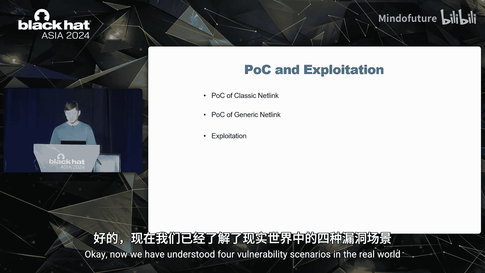

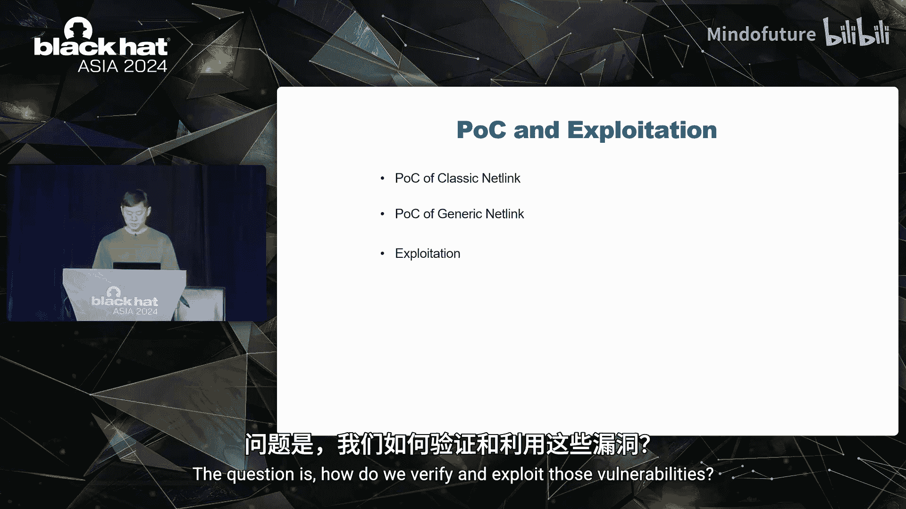

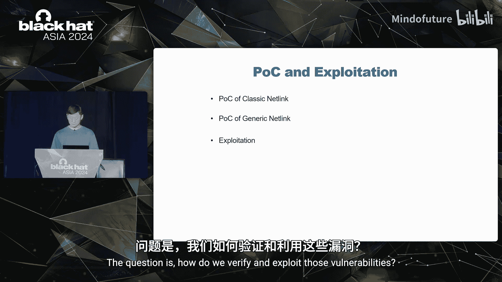

经典Netlink的POC模板如下所示。我们需要自己填充消息头和有效载荷。

对于通用Netlink，为了验证漏洞，首先要解决家族ID获取问题。因为所有自定义的通用Netlink共享协议ID 16，它们通过家族名称区分。我们可以通过发送消息来获取家族ID。

我们需要自己填充消息头、通用Netlink消息头和属性。通用Netlink的POC模板如下所示。需要注意三个函数：`ag_send_message`函数用于构建和发送通用Netlink消息；`nl_get_family_id`函数通过调用`nl_send_message`函数来获取家族ID；`nl_receive_message`函数用于接收通用Netlink消息。

我们如何使用任意读漏洞和任意写漏洞来获得权限提升？利用过程非常简单。首先，我们使用任意读漏洞获取我们可以修改的凭据结构的地址。然后，我们使用任意写漏洞修改该凭据。

最后但同样重要的是，如何缓解Netlink相关漏洞？
*   对于Android系统，我们可以通过SELinux规则设置目标经典Netlink套接字的权限。
*   对于Linux平台，我们可以通过`netlink_capable`函数检查`CAP_NET_ADMIN`权限。

## 06：总结与建议

通过以上分析，我们可以得出结论：Netlink是深藏在Android生态系统中的一个隐藏攻击面。

*   当自定义经典Netlink时，内核不会对消息进行任何检查。
*   当我们自定义通用Netlink时，内核会通过属性策略进行检查。通用Netlink比经典Netlink做得更多，但它也引入了新的安全威胁。

我们也为厂商准备了一些建议：
1.  尽量使用通用Netlink进行自定义，而不是经典Netlink。
2.  在使用Netlink机制之前，先理解它们。

本节课中，我们一起学习了Android Netlink内核模块中隐藏的攻击面。我们从概念入手，分析了攻击向量，探讨了真实漏洞案例，并了解了验证、利用及缓解措施。希望这些知识能帮助你更好地理解这一安全领域。