# 005：TrustZone-M的盲区与MCU的隐痛——经验教训

## 概述

在本节课中，我们将学习Arm TrustZone-M技术在微控制器（MCU）安全实现中存在的系统性缺陷。我们将探讨其CPU中心化的保护模型如何因缺乏系统级内存保护而留下安全漏洞，并通过一个具体的案例研究来展示其潜在风险。

## 引言：物联网时代的安全挑战

我们正处在物联网时代，其核心理念是将每一个设备连接到互联网。过去，嵌入式系统通常与互联网断开连接，但如今，许多行业的趋势是将所有设备联网。例如，当前一个非常热门的应用是AI赋能边缘设备，我们正将AI从云端转移到边缘，以保护AI模型免受外部攻击者的侵害。

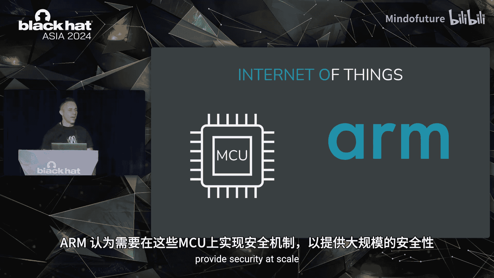

根据Arm的数据，预计到2035年，物联网设备的累计产量将达到1万亿台。这一趋势正在加速。

问题在于，随着物联网设备连接到互联网，我们目睹了越来越多的攻击事件。我们正在离开网络战时代。微控制器单元（MCU）是这些设备的核心，与移动设备中的应用处理器不同。Arm是这些MCU的主要设计者，包括Cortex-M0、M0+、M3、M4和M7系列。

Arm意识到需要在MCU上实现安全机制以提供大规模的安全性，因此决定将已存在二十多年、用于保护移动设备的TrustZone技术，移植到这些嵌入式物联网设备中。

## TrustZone技术简介

Arm TrustZone技术已存在超过二十年，主要用于保护移动设备。例如，如果您使用安卓设备、安卓TV或指纹识别，您每天都在使用TrustZone技术。该技术也用于平板电脑和智能电视。

TrustZone的核心概念是两个保护域或“世界”：安全世界和非安全世界。安全世界用于放置安全关键型应用程序，而非安全世界则用于运行主操作系统。在移动设备上，通常是安卓系统作为富操作系统，而可信执行环境（TEE）则运行安全关键型应用程序。

Arm将TrustZone技术从移动设备转移到了新的Cortex-M系列MCU上，即Armv8-M架构的Cortex-M23和M33，其核心已嵌入该技术。

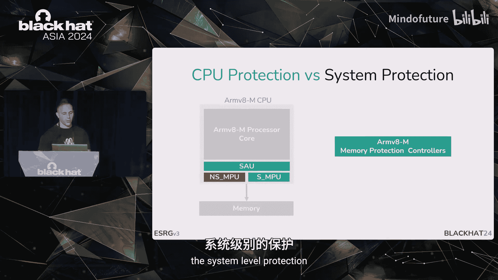

## TrustZone-M架构与保护机制

对于熟悉Armv6-M/v7-M架构（如Cortex-M0、M3、M4）的人来说，通常有两种处理器模式（Handler和Thread）和两种特权级别（特权和非特权）。最终，这形成了三个基本特权级别：特权Handler、特权Thread和非特权Thread。

TrustZone-M所做的，是创建一个正交的世界，基本上将上述状态复制一份。最终，在非安全状态和安全状态下，都有一套完整的特权状态副本。

与Cortex-A的TrustZone实现相比，TrustZone-M优化了上下文切换，以适应资源受限的设备。例如，它不再使用安全监视器来作为非安全状态和安全状态之间的接口。

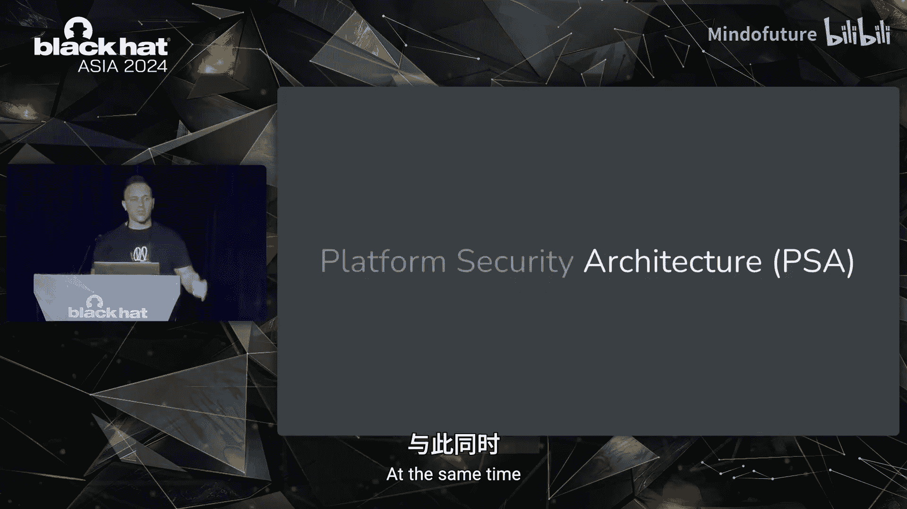

在内存访问控制方面，TrustZone-A通常在平台级别设有TrustZone地址空间控制器或内存控制器。而在Armv8-M上，核心级别有称为安全属性单元（SAU）和实现定义属性单元（IDAU）的控制器，它们作为防火墙的第一层。之后还有第二层，即传统的MPU，它在安全状态和非安全状态下都被复制。

## 系统级保护的缺失

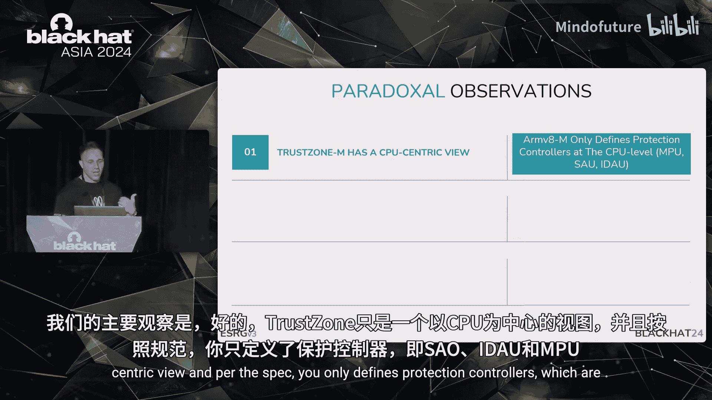

CPU级别的TrustZone保护是在CPU层面的。系统级保护则依赖于这些内存控制器。例如，如果您设置了SAU和MPU的访问策略，规定地址0x100只能由安全且特权的代码访问，那么非安全或非特权的访问将被阻止。

然而，因为这些控制器仅在CPU级别，如果您的平台上有一个支持DMA的设备（这在微控制器上非常常见，通常有大量外设和DMA设备），情况就不同了。一个安全且非特权的应用程序可以被分配一个DMA设备，然后通过DMA直接访问内存，绕过CPU的正常流程。由于DMA访问不受核心相同的内存控制器检查，因此可以访问受保护的内存。

Arm指出，这些系统级控制器并非由TrustZone本身指定，而是留给SoC或MCU的实现者去嵌入和实现。如果系统级别有这些内存保护控制器并强制执行策略，那么DMA设备就无法代表安全应用程序访问内存。

这引出了一个结论：TrustZone主要关注CPU级别的保护，而非系统级的全面保护视图，这可能会带来问题。

## Arm平台安全架构（PSA）

与此同时，Arm发起了平台安全架构（PSA）运动。这是一个由Arm与其他合作伙伴共同发起的倡议，旨在定义一组威胁模型、架构保护级别，并提供安全源代码的参考实现。

根据PSA定义，有三个PSA级别，以不同的能力强制执行保护。
*   **PSA级别1**：仅提供非安全世界与安全世界之间的基本划分。安全世界软件通常包括可信内核和一些属于内核的可信服务，以及希望开发安全关键型应用程序的第三方应用程序。在PSA术语中，有应用信任根（ARoT）和PSA信任根（PRoT），以及内核本身。
*   **PSA级别2**：不仅提供正常世界与安全世界的分离，还将安全世界内部的代码进行隔离。这是微内核的原则：隔离越多，可信计算基（TCB）越小，安全性越好。
*   **PSA级别3**：不仅将ARoT与PRoT和内核隔离，还将不同原始设备制造商（OEM）的不同ARoT彼此隔离。这意味着可以运行多个ARoT，且它们不能相互访问。

## 核心观察与假设

我们的主要观察是：
1.  TrustZone-M仅提供CPU中心化的视图。
2.  PSA仅定义了保护控制器（SAU、IDAU和MPU）。
3.  系统级保护是专有的，由供应商决定和定义。
4.  TrustZone-M与PSA级别之间存在不匹配，因为TrustZone-M不强制执行系统级保护，而某些PSA级别可能需要这种保护。

基于此，我们假设，结合对PSA不同隔离级别理解的缺乏，可能是现代TrustZone-M系统中存在未知安全漏洞的主要催化剂。我们试图寻找证据来支持这一假设。

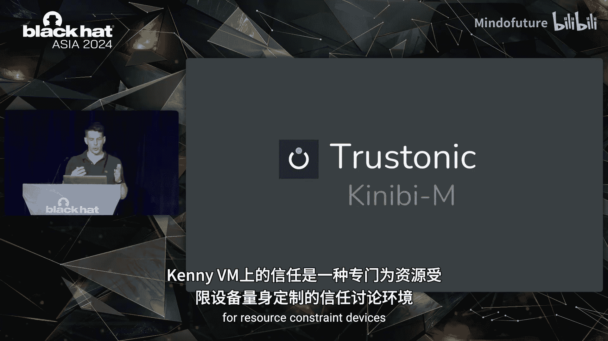

## 案例研究：Microchip SAM L11与Trustonic Kinibi-M

2018年，Microchip与Trustonic合作，为物联网设备发布了一个安全解决方案。这在多个新闻媒体上引起了轰动，并为物联网社区带来了很多期待，因为它为资源受限的设备带来了安全性。

Microchip在此次合作中发布了SAM L11，这是一款基于TrustZone的微控制器，专为资源受限的物联网设备设计。Trustonic则发布了Kinibi-M，这是一个专门在此平台上运行的可信执行环境。

以下是该案例研究的核心发现：

### 硬件层面：Microchip SAM L11的缺失

SAM L11是一款基于Cortex-M33的开发板，被Microchip标榜为强大的安全解决方案，具有许多安全功能，如Arm TrustZone、安全启动、加密、安全密钥存储和芯片级篡改保护。

但我们首先发现其内存保护方面有所缺失。查阅数据手册后，我们发现有内存保护单元（MPU）、TrustZone地址空间控制器（SAU）和IDAU，但没有看到任何内存保护控制器（MPC）。这起初看起来有些奇怪。

进一步查阅数据手册，我们发现了一个称为外设访问控制器（PAC）的安全功能，它是一个基本的PAC，可以将外设分配给安全世界或非安全世界。但我们发现这里也缺少了一些东西：它只说明可以将外设分配给安全或非安全，但没有提及特权与非特权，也没有提及系统级的内存保护。

这令人困惑，因为这是一个标榜为物联网设备安全解决方案的MCU，却没有实现系统级内存保护这一关键部分。在示意图上，这意味着没有MPC。只有一个PAC允许外设分配给非安全或安全世界。

当一个安全但非特权的应用程序想要访问特权内存时，在核心级别可能会被阻止，但它可以使用DMA绕过这一限制。这个PAC本身不是问题，并且SAM L11被认证为PSA级别1是合理的，这意味着硬件可以强制执行非安全与安全世界的分离。

问题始于当我们想要将Kinibi-M加入此解决方案时。Trustonic声称Kinibi-M具有PSA级别2认证，旨在将应用信任根与特权软件分离。鉴于这种硬件配置，我们发现很难强制执行这一点，因为没有MPC。我们认为，缺乏MPC可能会在试图实现PSA级别2时打开未知的安全漏洞。我们向Microchip报告了此问题以提高认识，但Microchip将我们指向了Trustonic。

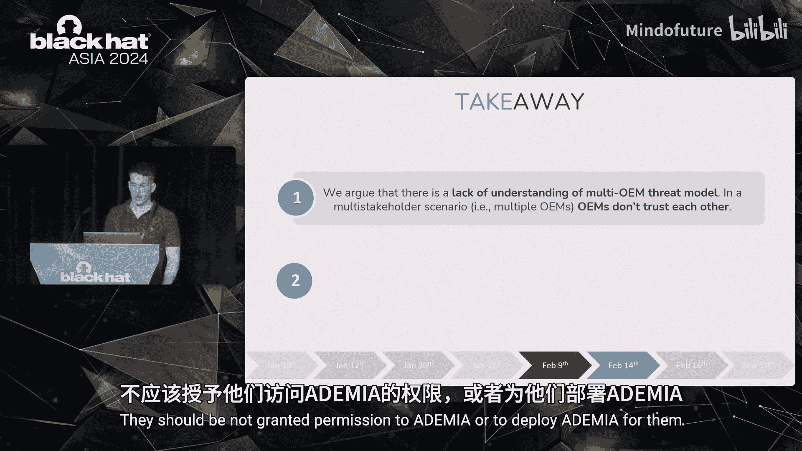

### 软件层面：Trustonic Kinibi-M的混淆

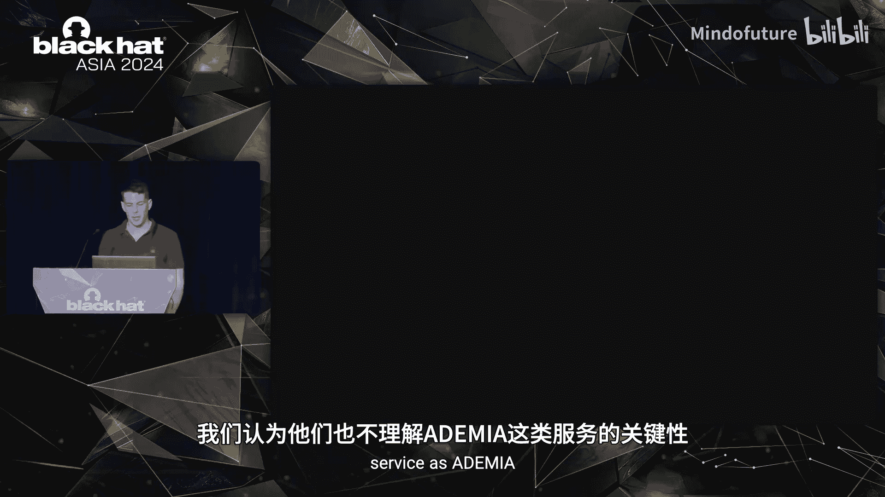

Trustonic Kinibi-M是一个为资源受限设备定制的可信执行环境。他们官方声称可以达到PSA级别2。

让我们尝试将其映射到我们对PSA级别2的理解上。他们有运行非信任软件的非安全软件。在安全世界内部，他们有称为Kinibi OS的内核、作为PSA信任根（PRoT）的安全服务，以及作为类似于PSA级别中ARoT的第三方应用信任根（ARoT）。

但他们说，安全模式都在特权模式下运行。这意味着PSA信任根服务与应用程序信任根并排运行。我们开始发现很难将其映射到PSA级别2。此外，他们还说他们使用内存保护单元（MPU），并且一个安全模式不能读取其他安全模式的代码或数据。这看起来更像PSA级别3。

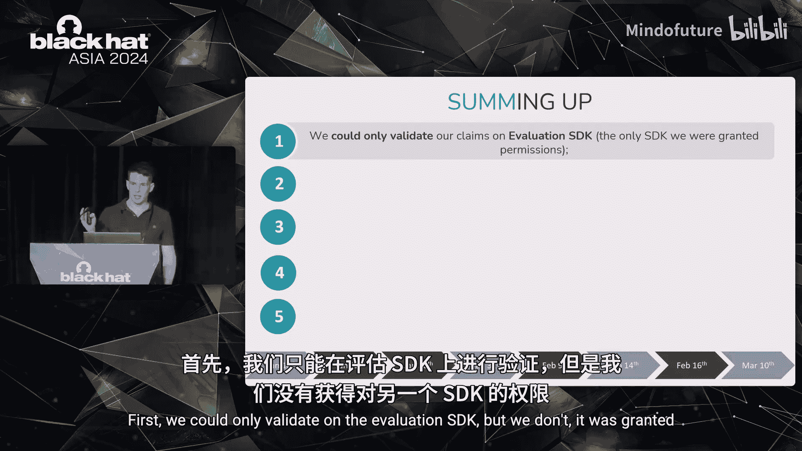

因此，Kinibi-M似乎超出了PSA级别2，因为它将安全服务置于与应用程序信任根相同的级别，并试图实现硬件无法强制执行的隔离。当我们将其与Microchip SAM L11仅支持PSA级别1且没有MPC的事实结合起来时，我们认为这是一个随时可能爆炸的定时炸弹。

这引出了我们的第一个观察：一个被授予DMA设备访问权限的应用程序信任根或安全模式，可以轻易绕过Kinibi-M的所有强制执行策略，并获得完全的读写能力。我们将此报告给了Trustonic。

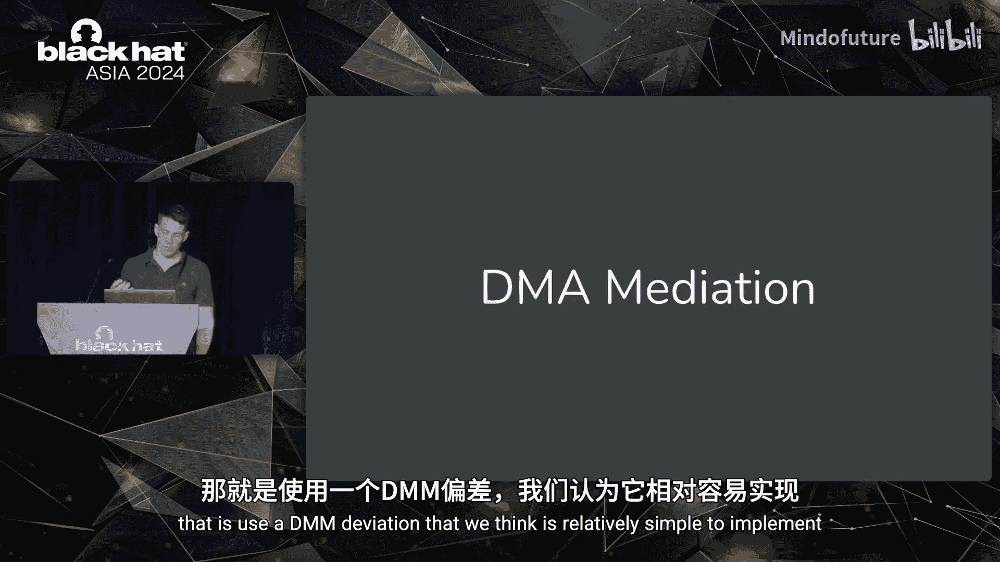

## 负责任的漏洞披露过程

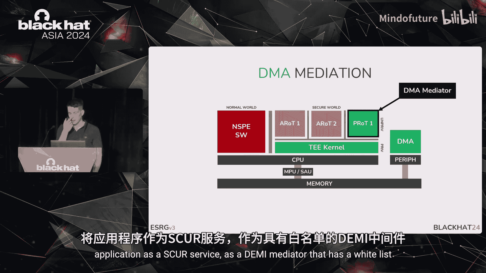

我们的负责任披露过程始于1月10日，1月12日收到了第一份确认。第一次反馈在1月30日，我们次日回复。然后在2月9日至14日期间进行了另一轮沟通，最后一次与Trustonic的迭代在2月16日。我们于3月10日结束了整个披露过程。

以下是沟通中的一些要点：
1.  **关于评估版与商业版**：Trustonic指出我们使用的是Kinibi-M评估版，而商业版有许多我们无法访问的安全功能。我们回应称，商业版可能仍存在相同问题，因为底层硬件相同，且商业版SDK运行在没有内存保护控制单元的同一控制器上。
2.  **关于认证**：Trustonic表示评估版SDK不支持认证，而商业版需要成为信任方并签名才能运行代码。我们认为认证是正交的问题，即使代码经过签名和验证，除非有形式化验证，否则仍应预期存在漏洞。
3.  **关于DMA**：Trustonic同意我们的观点，即拥有DMA访问权限的安全模式可以绕过内存保护并访问整个系统，但他们不认为这是一个敞开的漏洞。我们觉得这有些矛盾。
4.  **关于DMA锁定与仲裁**：Trustonic表示在商业版SDK中DMA被锁定。我们认为不应该只是授予访问权限，而应该进行仲裁。责任应在Kinibi-M一方，提供某种模块来在软件层面强制执行仲裁。我们还提出了实现该仲裁的机制。

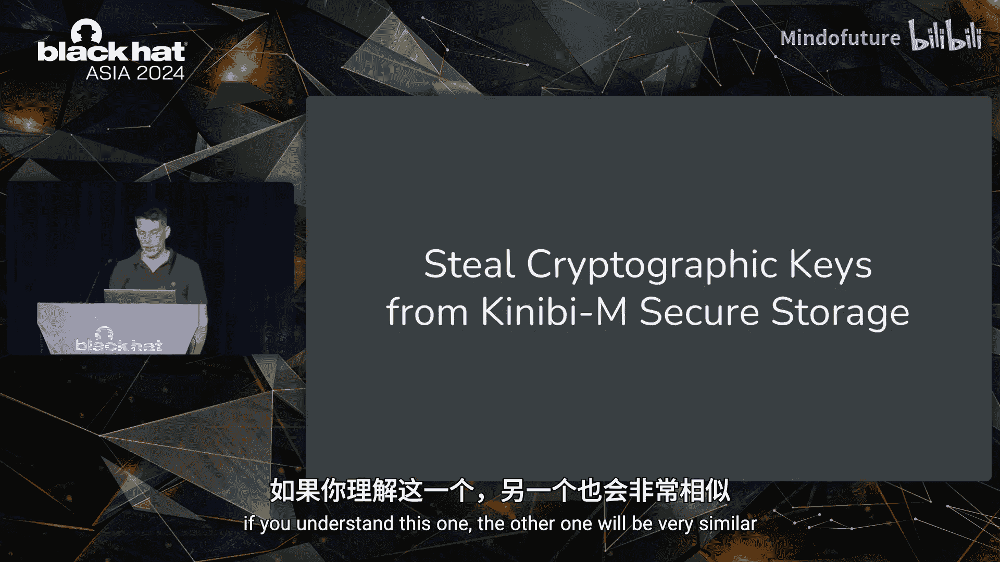

### 关键要点

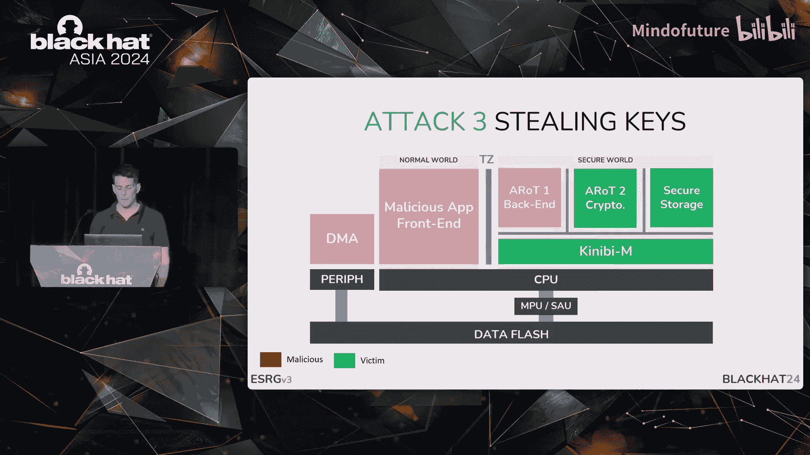

从披露过程中，我们得出以下关键要点：
*   **对开发者的风险**：即使TrustZone-M开发者没有恶意意图，也可能引入可被他人利用的漏洞。
*   **对硬件限制的理解不足**：缺乏对硬件能做什么、不能做什么以及在软件层面应做什么来强制执行策略的理解。
*   **多OEM威胁模型理解不足**：多个OEM在同一设备上时，彼此不信任，不应被授予DMA权限或允许按需部署DMA。
*   **对关键服务严重性认识不足**：对DMA等关键服务的严重性认识不足。
*   **PSA级别对应关系模糊**：Kinibi-M早于PSA标准，在某些方面做得更多，在某些方面做得更少，与PSA级别没有一一对应的关系。
*   **DMA仲裁责任归属**：Trustonic认为DMA访问应由系统模式仲裁，但这应由OEM提供。我们强烈认为这不是正确的做法，也不是良好的安全实践。不提供仲裁一方面限制了系统能力，另一方面留下了威胁载体。

## 漏洞利用演示

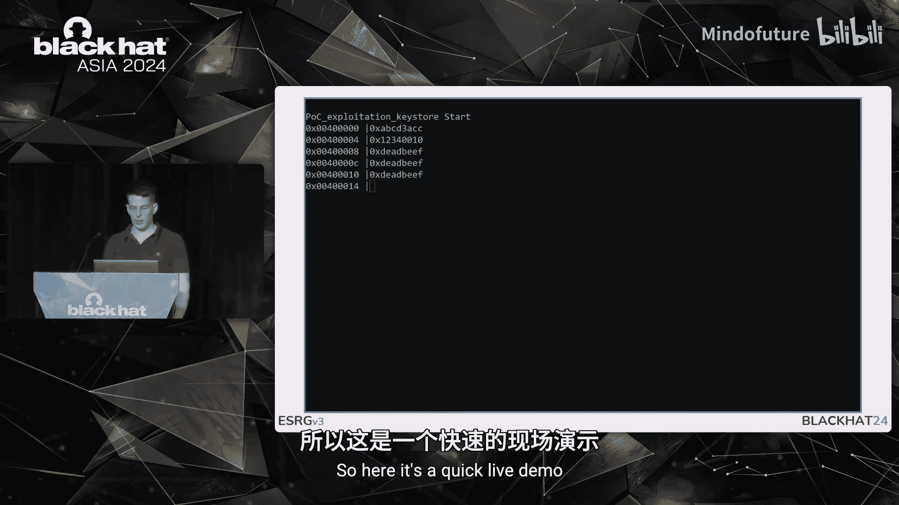

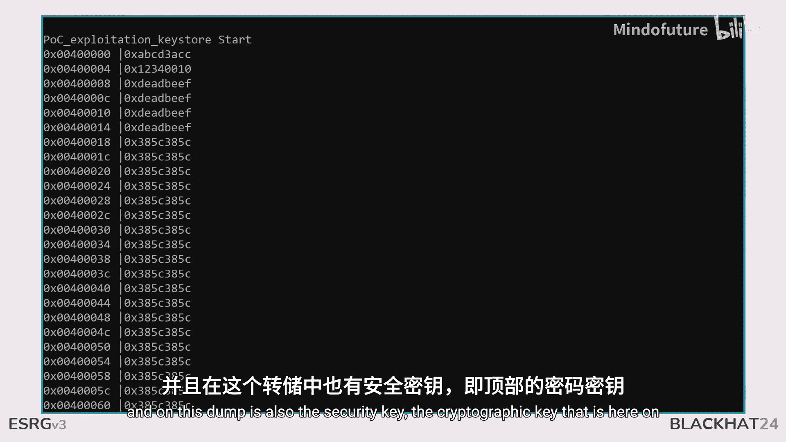

我们实现了三个漏洞利用来证明后果：
1.  演示如何获得安全特权并篡改Kinibi-M。
2.  演示如何从其他安全分区窃取代码（它们本应被隔离）。
3.  演示如何访问本无权限访问的密钥。

由于时间有限，我们重点看第三个。攻击涉及两个部分：一个具有前端和后端的恶意应用程序。后端是一个拥有DMA访问权限的第三方应用程序信任根。另一个应用程序信任根执行加密计算。我们修改了这个应用程序并硬编码了密钥，以方便演示概念验证攻击来窃取密钥。

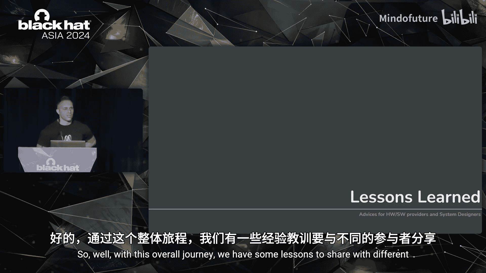

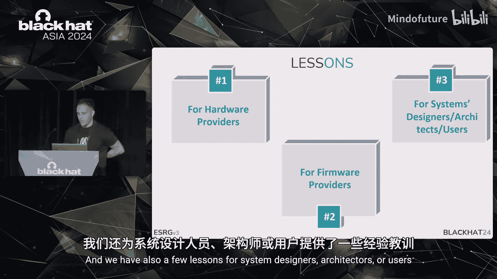

攻击步骤如下：
1.  应用程序请求安全存储来存储密钥 `0xDEADBEEF`。
2.  恶意应用程序想要窃取这个密钥。
3.  Kinibi-M规范说安全模式不能读取其他模式的内存。我们利用展示的保护缺口，使用DMA绕过所有MPU和SAU保护，成功检索到了安全密钥。

在演示中，我们从一个本不应有访问权限的安全非特权应用程序转储安全内存。在转储中，我们看到了位于顶部的加密密钥 `0xDEADBEEF`，从而绕过了所有保护。

## 经验教训与建议

基于整个历程，我们有一些经验教训要与不同的参与者分享。

### 对硬件提供商的建议

硬件提供商应在系统级别实现保护。他们应实现内存控制器，不仅强制执行安全与非安全之间的权限，还要考虑特权与非特权模式。一个好的例子是NXP LPC5500 Cortex-M33，它有一系列MPC，可以强制执行安全与非安全以及特权与非特权。而不太好的例子就是我们讨论的Microchip SAM L11，因为它存在我们指出的局限性。

### 对固件提供商的建议

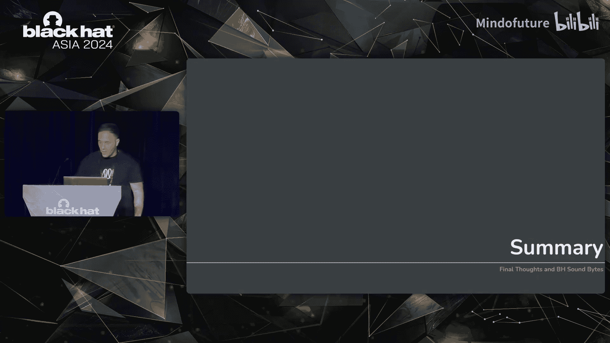

固件提供商需要努力遵循PSA标准的语言，并通过提供手段和便利来强制执行所需的隔离，以方便参与构建系统的各方。例如，为资源受限设备设计的微内核，如Trustonic所说，将DMA仲裁能力留给OEM或客户决定，如果历史重演，可能会导致不同产品中出现安全漏洞。

### 对系统设计师和架构师的建议

系统设计师和架构师应真正了解所使用的平台和软件，并且两者的组合应具有系统级的视图。应注意访问控制策略的设置方式。最后，关于PSA级别，正如我们所见，Kinibi-M使用类似微内核的架构，不仅将内核与应用程序信任根隔离，还将额外的可信服务从特权移到非特权安全状态，然后在它们之间强制执行隔离。我们相信这是正确的发展方向。当然，微内核架构会带来一些性能下降，但如果做得好，影响不会太大。

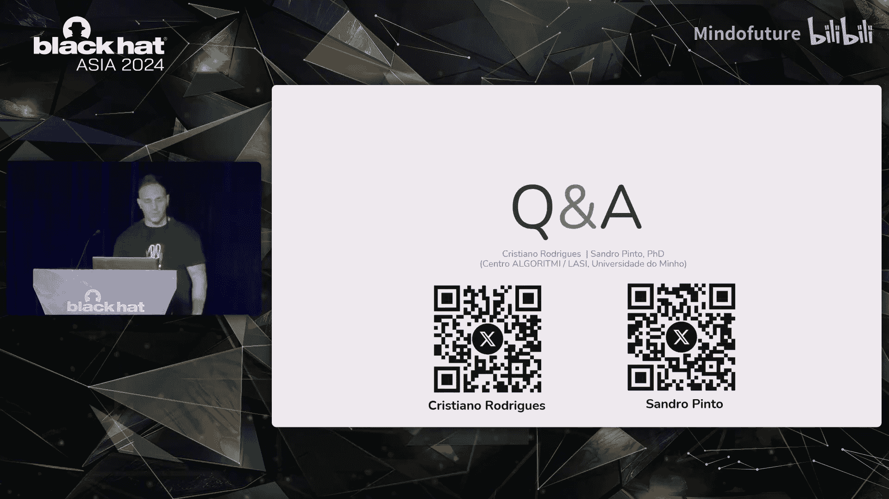

## 总结

在本节课中，我们一起学习了评估基于TrustZone-M的MCU安全性的全过程，特别是针对SAM L11平台上的Kinibi-M。

我们演示了缺乏系统级视图所带来的问题，并解释了在缺乏硬件能力时可以实施的软件解决方案。但我们强调，最好具备硬件能力，因为这极大地方便了上层软件的构建。

我们分享了一些如果不实施此类机制就可能发起的潜在攻击，这些攻击可以绕过系统的完整隔离边界。希望通过此课程提高大家的安全意识。

---
**总结**：本节课的核心在于揭示了TrustZone-M技术因其CPU中心化设计而存在的系统性安全短板。当缺乏系统级内存保护控制器（MPC）时，拥有DMA访问权限的安全非特权应用可绕过所有核心级保护，导致隔离失效。硬件厂商、固件提供商和系统架构师必须协同工作，通过硬件实现或严格的软件仲裁来填补这一保护缺口，才能真正实现PSA标准所要求的安全隔离目标。