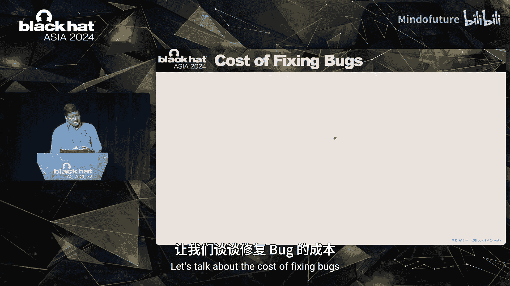
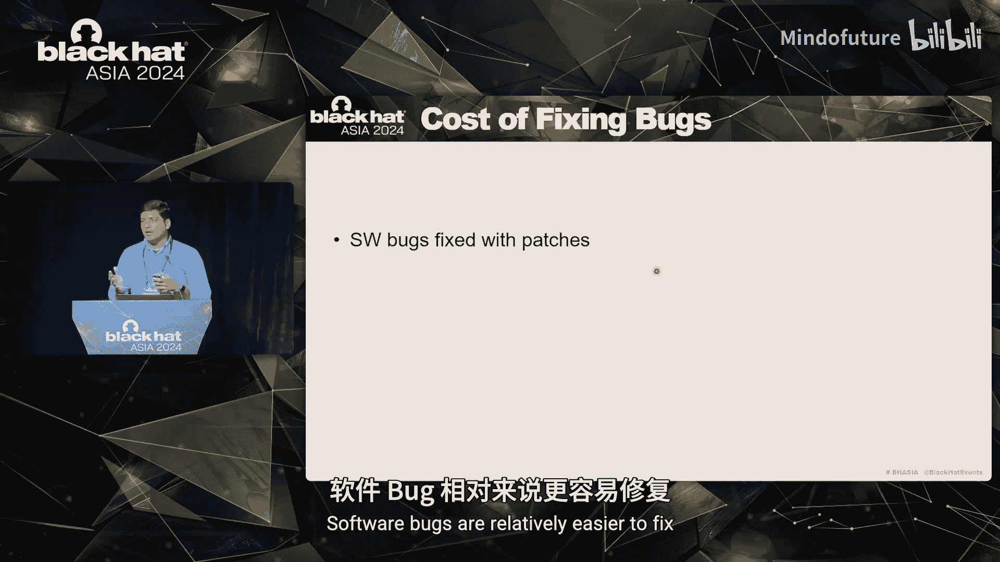
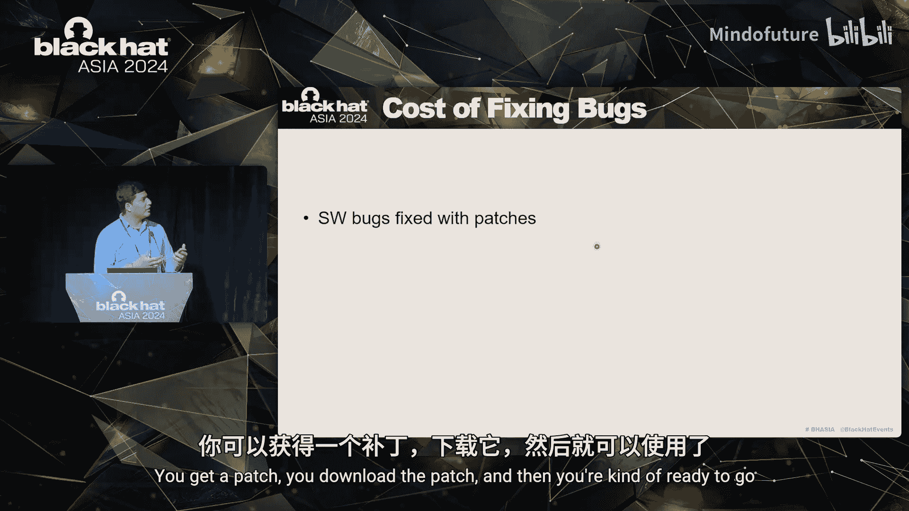

# 006：从HackDAC看世界最大硬件黑客竞赛的启示 🛡️

在本教程中，我们将学习如何组织一场成功的硬件安全竞赛。我们将以HackDAC——世界上最大的硬件黑客竞赛——为例，探讨其背后的动机、组织过程、面临的挑战以及为学术界和工业界带来的核心价值。通过本教程，你将理解硬件安全的重要性，以及如何通过竞赛形式培养安全思维和推动工具创新。

---

## 挑战与动机：为何要创办硬件黑客竞赛？🤔

上一节我们介绍了本教程的概述，本节中我们来看看创办HackDAC竞赛的三大核心挑战与动机。

我们的团队在英特尔的产品安全保证职业生涯中，观察到了三个主要挑战。

**挑战一：硬件安全弱点认知有限。**
软件和固件层面的攻击已屡见不鲜。近年来，随着微架构攻击的出现，攻击者已开始侵入硬件领域。我们在2019年EIC安全会议上发表了一篇名为《硬件安全》的论文。该论文指出，软件实际上可以利用硬件中的漏洞。论文发表后，我们收到了大量反馈。许多人表示，他们此前并不知道根植于硬件的此类问题能被软件利用。这让我们意识到，对硬件安全弱点的认知非常有限。

**挑战二：缺乏安全感知的设计自动化工具。**
在软件或固件安全领域，存在许多工具，例如代码扫描器、二进制扫描器、逆向工程工具、协议检查器、配置检查器等。但在硬件层面，特别是在寄存器传输级用于实现或检查硬件的工具却屈指可数。

硬件安全属性示例：
*   **属性A（防泄漏）：** 存储在芯片内部寄存器中的密钥，不应泄露到任何攻击者可观察的接口。
*   **属性B（安全擦除）：** 在某些条件下（如FIPS合规性），芯片中的密钥需要被清零。需要确保密钥不仅从其主存储区域被清除，也从其流经的所有中间结构中被清除。

目前，能够进行此类测试的工具非常有限，对于某些场景甚至没有工具。因此，**迫切需要安全感知的设计自动化工具**。

**挑战三：修复漏洞的成本高昂。**
软件漏洞相对容易修复，通常只需下载并安装补丁。硬件漏洞的修复则更为复杂、耗时、昂贵，并可能对所有相关方（芯片设计商、原始设备制造商等）造成品牌损害。

为了理解原因，让我们看看硬件设计流程：
1.  **RTL设计阶段：** 根据微架构设计，开始使用RTL编写芯片代码。
2.  **物理设计阶段：** RTL被转换为门级电路，进而形成布局。
3.  **流片前阶段：** 完成物理设计后，开始进行时序和其他功能正确性验证。
4.  **制造阶段：** 将设计发送到晶圆厂进行制造。
5.  **流片后阶段：** 芯片制造完成后，再次运行大量测试。
6.  **客户阶段：** 测试通过后，芯片交付给客户使用。

漏洞可能在任何阶段被发现。在RTL设计阶段修复漏洞的成本最低。随着阶段推进，修复漏洞的成本呈指数级增长。如果在客户阶段发现漏洞，将造成最大的品牌损害。因此，我们需要培养一种 **“左移”思维**，鼓励各方尽可能在RTL设计阶段就检测和缓解漏洞。

**总结：** 三大挑战分别是：提高硬件安全保证意识、需要更多安全设计自动化工具、以及采用“左移”思维在RTL设计阶段早期发现和修复漏洞。

---

## 竞赛的价值：对学术界与工业界的意义 🎯

上一节我们探讨了创办竞赛的挑战，本节中我们来看看组织此类硬件夺旗竞赛的广泛价值。

夺旗竞赛通常是极佳的社区建设活动。它们将充满热情的人们聚集在一起。团队通常由来自不同组织的成员组成，他们拥有不同的专业经验，例如设计、验证和安全背景。这些不同领域的经验交叉融合，有时能产生出色的成果。竞赛也是学习、分享最佳实践和黑客技术的有趣方式。

硬件夺旗竞赛有助于提高对硬件安全保证的整体认识。攻击者和防御者之间持续进行着向底层技术栈深入的竞赛。攻击者试图从更底层获取更多信息，而防御者则试图从攻击者手中保护它。目前看来，攻击者似乎更占优势，因为他们拥有无限的时间，而防御者必须在产品时间线的约束下工作。硬件夺旗竞赛是培养对常见弱点类型认识的好方法，同时也能让参与者在芯片设计团队通常面临的约束条件下进行思考。

**那么，学术界和工业界为何要参与？**

在英特尔，我们资助了许多学术研究，尤其是在安全领域。我们经常收到的一个请求是：“能否获取一些英特尔设计的访问权限？”这通常不可行。他们需要的是最接近商用芯片设计的东西。

如果工业界能获得一个存在漏洞的片上系统框架，该框架具有现实的安全特性、威胁模型以及商用芯片设计中可见的安全目标，会怎样？如果这个存在漏洞的SoC包含的并非玩具漏洞，而是受真实世界CVE和安全公告启发的漏洞，会怎样？如果它还附带开源工具支持以及芯片设计行业使用的商业工具支持，又会怎样？

这正是我们提供的：一个存在漏洞的片上系统。该框架可用于推动硬件安全保证领域的创新，也可作为开发和测试新硬件工具的基准。这是目前最接近商用芯片设计的可用资源。

**对于人才培养：**
公司需要参与者获得硬件安全保证经验，培养黑客思维。许多公司没有预算雇佣大量安全研究人员。最好的方法是培训那些已经在从事功能验证工作的人员，让他们提升技能，开始从事更多的安全保证工作。此外，许多来自相邻领域（如固件）的研究人员希望更多地了解硬件。固件要正常工作，硬件需要提供许多保证。他们不知道硬件如何做到这一点，并希望了解其实现方式。硬件通常是封闭的。如果能有机会深入了解所依赖的安全特性在RTL层面的实现，对相邻研究领域将大有裨益。硬件夺旗竞赛可以为来自相邻领域的人们提供一个轻松的起点。

---

## HackDAC的独特性：开放盒与设计者中心 🧩

上一节我们讨论了竞赛的广泛价值，本节中我们来看看HackDAC与其他竞赛和培训的独特之处。

存在许多流行的硬件夺旗竞赛，我们称之为 **“封闭盒”** 竞赛。这意味着它们不提供芯片实现细节的洞察，而是直接给出最终芯片，并说：“给你，攻击它吧。”参与者通过探测芯片、输入/输出端口、进行物理攻击（如拆焊、逆向工程、侧信道攻击、故障注入攻击等）来完成任务。这些都不涉及芯片的RTL，目标只是攻破它。这无法解决“左移”挑战，因为你面对的是最终芯片。请注意，这并非不重要，它是一个非常重要的研究领域，但我们的目标是能够早期发现漏洞。

这就是HackDAC的切入点。它是一个 **“开放盒”** 夺旗竞赛。参与者会获得一个存在漏洞的片上系统设计，其中包含我们讨论过的各种高级安全特性。它提供了更细粒度的视角，让参与者查看这些安全特性在RTL中是如何实际实现的。然后，参与者通过现有的设计验证技术（如RTL仿真、模拟、形式验证、静态分析，甚至时间允许时的手动代码审查）来攻破这些安全特性。我们称之为 **“设计者中心”** 方法。这类似于红队/蓝队方法：蓝队设计芯片，非常了解芯片的功能和实现方式；而具有类似背景的红队则开始查看源代码，试图识别其中的弱点或漏洞。这就是我们的独特之处。

---

## 竞赛组织流程：从设计到决赛 🏗️

上一节我们了解了HackDAC的独特定位，本节中我们将深入探讨其具体的组织流程。

我们将团队分为两部分：**设计团队** 和 **裁判团队**。

**设计团队** 以一个开源片上系统为起点。我们挑选一个开源设计，然后开始为其添加安全特性，定义威胁模型。我们查阅不同的CVE和安全公告，创建一个我们希望插入该设计的漏洞列表。我们生成存在漏洞的RTL代码，更新设计规范，并更新工具集（包括开源工具和商业工具）以支持该芯片设计。准备就绪后，我们开始宣传，参与者开始注册，竞赛第一阶段随之开始。

**第一阶段（线上预赛）：**
通常有50至60支队伍注册。他们获得设计文件，开始寻找漏洞并提交。我们开始对漏洞进行评分和评估，并在网站上公布实时积分榜。这一阶段持续约两个月。第一阶段的前10名队伍将被邀请参加在会议现场举行的第二阶段决赛。

**第二阶段（现场决赛）：**
由于参与者较少，我们可以提供更好的功能和支持。我们增加基于FPGA的支持，提供关于如何在FPGA上运行漏洞设计的指导。我们的云合作伙伴Synopsys将其全套工具部署在云上，我们将漏洞设计移植到云端，确保一切正常运行。我们为参与者提供培训，然后再次进行漏洞提交、评估和积分榜更新。决赛持续33小时不间断。比赛结束后，获奖者将在会议颁奖典礼上获得表彰，并有机会在会议的特设环节展示他们的研究成果。获奖者还有机会在顶级期刊（如ITP设计与测试）的特刊上发表论文。

以下是各阶段的详细步骤：

**1. 目标选择**
我们需要挑选一个开源设计。我们调查各种开源设计，选择一个能提供全功能片上系统、没有固有漏洞的设计。我们优先考虑那些自带仿真或开源工具支持的设计，以及那些运行稳定、不会崩溃的设计。

在所有竞赛版本中，我们都选择了开源RISC-V架构及基于RISC-V的SoC，包括PicoRV32、OpenPiton（来自普林斯顿大学）和OpenTitan（谷歌的开源硬件安全模块）。

**2. 添加安全特性与威胁建模**
一旦下载了开源设计，我们就开始为其添加安全特性。例如，添加加密模块（HMAC、SHA、AES等）、用于存储密钥等秘密信息的熔丝模块、用于将数据从内存复制到各种IP的DMA模块、基于密码的检查（确保正确的实体解锁芯片进行调试）等。围绕核心，我们添加了一个代理内核，以支持虚拟内存到物理内存的转换以及所有加密引擎的自测试等功能。

添加所有安全特性后，我们进行威胁建模，并列出该芯片的安全目标清单。

**3. 插入漏洞**
如前所述，我们查阅CVE和安全公告，并结合我们检查众多英特尔产品类别的经验，开始在整个芯片中插入漏洞。完成后，存在漏洞的RTL代码就准备好了，我们开始宣传并号召参与，人们开始注册，第一阶段开始。

**4. 漏洞提交与评估（第一阶段）**
第一阶段是线上进行的。参与者有两个多月的时间来分析各种攻击入口点，识别系统中的不同资产，开发安全测试用例以攻破安全特性。他们还可以开发自定义工具来检测这些漏洞，最后通过Web界面提交所有漏洞供裁判评估。

一个典型的漏洞提交包括以下部分：
*   **被绕过的安全特性及描述**
*   **漏洞代码位置**（RTL中的具体行号）
*   **所采用的方法论**（仿真、形式验证、自定义工具等）
*   **安全影响**（绕过该特性会导致完全机密性丧失、完整性绕过等）
*   **缓解措施描述**（正确的代码应如何）
*   **CVSS评分细节**

我们根据以下因素进行评分：
*   **问题的有效性**（是否真的是漏洞）
*   **所采用方法的新颖性**
*   **安全影响、评分和所提缓解措施的正确性**
*   **会议主题加分**（例如，在设计自动化会议上，创建自定义工具检测某类漏洞可获得加分）
*   **特别奖项**（用于表彰我们发现的有趣漏洞）

**5. 决赛与后续**
决赛阶段，我们与Synopsys合作，将工具和设计部署在云端，并为参与者提供商业工具使用的培训。比赛结束后，获奖者获得奖金，展示研究成果，并可能将工作发表在学术期刊上。

迄今为止，HackDAC已运行超过七年，扩展到其他安全会议，有来自全球的300多支队伍参与，覆盖各大洲。过去的获奖者现在已在顶级硬件设计公司担任硬件安全职位。

---

## 影响与启示：关键要点总结 📈

上一节我们走完了竞赛的组织流程，本节中我们来总结HackDAC带来的影响以及对各利益相关方的关键启示。

让我们回顾最初旨在解决的三大挑战：提高对硬件安全弱点的认识、需要更多安全感知的设计自动化工具、以及培养“左移”思维早期发现漏洞。

**对于挑战一（提高认识）：**
我们与MITRE合作，于2019年左右启动了**MITRE硬件CWE**项目。现在，硬件CWE数据库中包含许多弱点类型，涵盖核心与计算、内存与存储、外设、片上互连等领域。每个条目都包含问题描述、扩展描述、易受攻击的代码示例以及已修复的代码片段。这是一个巨大的进步，因为芯片设计公司通常对其产品中的安全问题（尤其是硬件问题）非常保密。现在，有了110多种不同的条目，展示了硬件可能出错的方式，其中75个来自英特尔，许多条目都填充了来自HackDAC框架的易受攻击代码示例。

**对于挑战二和挑战三（工具与漏洞检测）：**
过去七八年间，我们提供给参与者的框架已被用于开发众多工具、流程和方法论。许多顶级会议和期刊上出现了相关论文，主题包括：使用大语言模型自动生成安全测试用例、在RTL级别自动修复漏洞、形式验证、用于扫描代码寻找已知CWE类型的静态分析工具、混合执行测试以及硬件信息流跟踪等。所有这些工作都在RTL级别进行，无需等待芯片制造。

**对学术界的关键启示：**
*   该框架已被用作推动硬件安全保证研究的载体。
*   由于最接近商用芯片设计，它也被用于创建新工具。
*   许多团队用它来发现MITRE CWE数据库中尚未收录的新漏洞类别，并已联系MITRE添加新的硬件弱点类型。
*   学生参与者获得了宝贵的硬件安全保证技能，并在此过程中培养了黑客思维。

**对工业界的关键启示：**
*   通过接触这些新型弱点及其表现形式，改进了内部安全保证最佳实践。
*   开始规划**可生存性特性**，即为硬件漏洞预留补丁空间，以便能够修复硬件问题。
*   芯片设计公司的功能验证团队更容易通过参加HackDAC等培训或竞赛，学习安全保证知识，然后在公司内提升技能，从事更多硬件安全保证工作。
*   一些公司正在创建新工具来识别弱点类别，甚至发布了关于其安全工具如何检测多类硬件CWE的指南。
*   现有的用于功能验证或设计验证的工具，可以通过插件增加安全功能，新一代工具正越来越多地包含这些特性。

总体而言，HackDAC获得了媒体和新闻界的广泛关注和喜爱，这主要得益于来自世界各地的众多热情学生和研究人员的参与。

---

## 总结 🎓

在本教程中，我们一起学习了如何从组织世界最大硬件黑客竞赛HackDAC的经验中汲取启示。我们探讨了创办竞赛的三大核心挑战：硬件安全认知有限、工具缺乏以及修复成本高昂。我们分析了此类竞赛对学术界和工业界的多重价值，包括推动研究、培养人才和促进工具创新。我们深入了解了HackDAC独特的“开放盒”与“设计者中心”模式，并逐步拆解了从目标选择、威胁建模、漏洞插入到线上预赛和现场决赛的完整组织流程。最后，我们总结了竞赛带来的深远影响：通过MITRE硬件CWE提高了行业认知，通过开源框架催生了大量RTL级安全工具创新，并成功培养了参与者的硬件安全黑客思维。HackDAC的成功证明，通过精心设计的竞赛，可以有效应对硬件安全领域的核心挑战，并为整个生态系统的进步做出贡献。