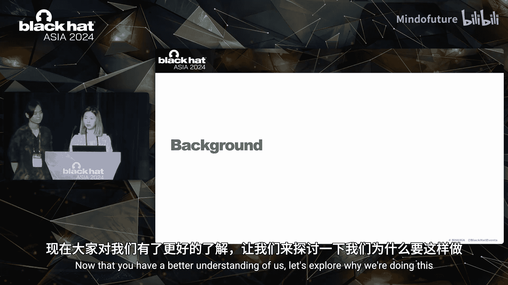
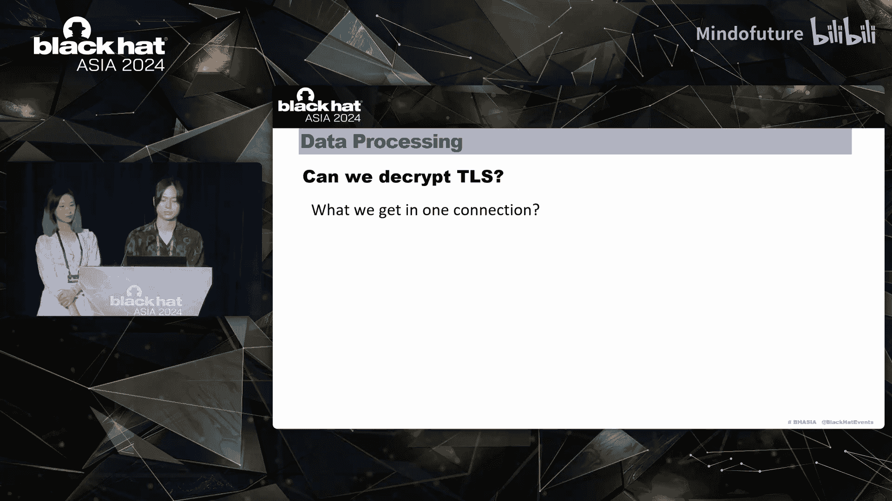
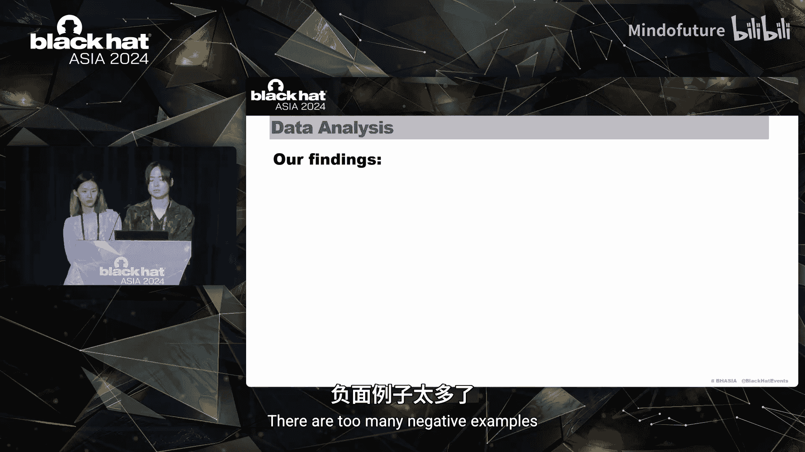
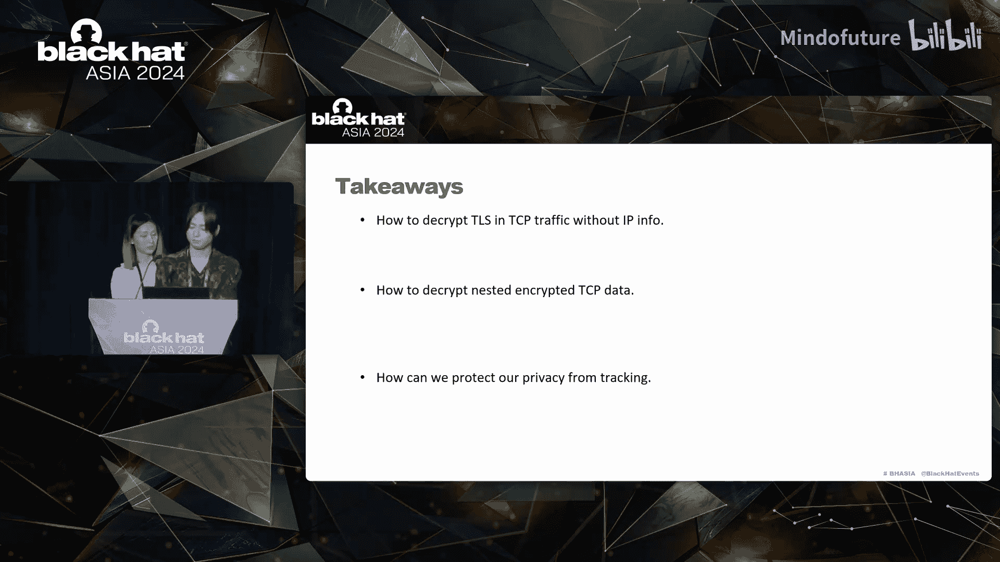
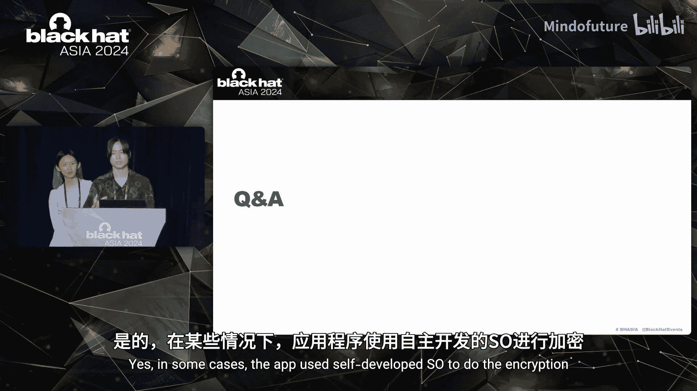
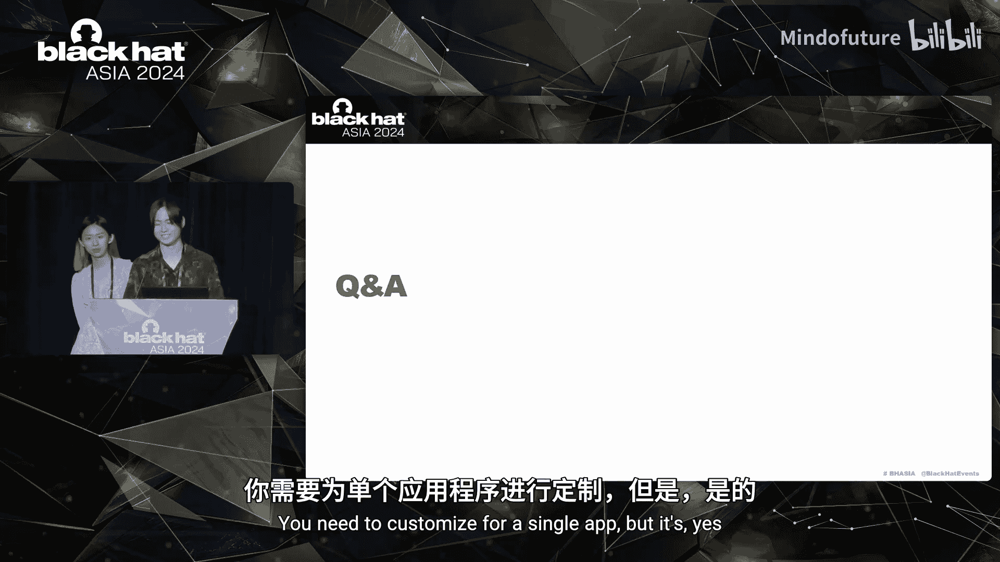
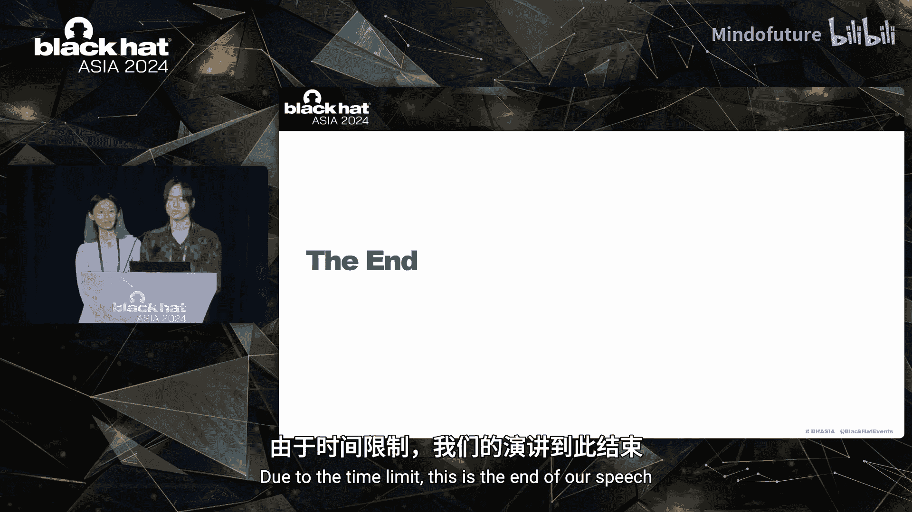

# 007：Privacy Detective - 嗅探Android数据泄露

在本教程中，我们将学习一个名为“Privacy Detective”的动态隐私分析工具。该工具基于Frida框架，专为Android设备设计，旨在捕获和分析网络传输中的数据，以检测潜在的隐私泄露和GDPR合规性问题。我们将从工具的开发背景、架构、核心功能实现，到实际应用和发现，进行系统性的讲解。

## 概述：我们为何需要Privacy Detective？

随着全球数据保护法规（如GDPR）的日益严格，企业面临巨大的合规压力。GDPR违规可能导致高达2000万欧元或全球年营业额4%的巨额罚款。同时，用户也日益担忧个人隐私，例如应用程序未经同意获取对话内容并推送相关广告。因此，开发一个能够动态分析网络流量、解密多层加密数据并检测违规行为的工具变得至关重要。

Privacy Detective正是为此而生。它能够帮助安全研究人员和企业发现应用在数据传输过程中的隐私泄露风险。



## 团队介绍


本工具由多位安全研究人员共同开发：
*   **演讲者A**：专注于逆向工程、Linux和系统安全，对移动安全与隐私有长期兴趣。
*   **Maggie**：Oppo的安全研究员，擅长安全认证与合规，在本工具开发中扮演了重要角色。
*   **其他贡献者**：包括来自华中科技大学网络空间安全学院的硕士生Warnie Wang、拥有CVE贡献记录的网络安全专家Xian L Wu，以及拥有超过10年安全经验的Daniel Chen。

## 第一部分：动机与法规背景

上一节我们认识了开发团队，本节中我们来看看驱动这项研究的具体原因。

我们的动机主要来自两个方面：公司战略与个人好奇心。

**1. 公司面临的合规挑战**
GDPR等法规对数据保护提出了严格要求。截至2023年3月，全球约83%的国家已颁布数据隐私法，其中许多都深受欧盟GDPR的影响。不合规的后果非常严重。

以下是GDPR罚款的关键点：
*   **罚款公式**：`罚款金额 = MAX(2000万欧元， 公司全球年营业额的4%)`
*   **趋势**：罚款数量和总额都在急剧增长。
*   **范围**：受处罚的不仅是电信公司，还包括各行各业，甚至有一家工厂因数据保护违规被罚款超过300万欧元。

因此，我们必须严肃对待GDPR，在所有业务中优先考虑个人数据的隐私与安全。

**2. 用户的隐私担忧**
从用户角度看，我们经常遇到令人不安的场景。例如，刚和朋友聊过去新加坡，机票应用就推送了新加坡的机票促销信息。这让人感觉被“监视”了。

根据普华永道2023年6月的全球消费者洞察调查，近一半的消费者在使用社交媒体时对隐私表示极度或非常担忧。

综上所述，本研究的动机既源于公司的全球化合规战略，也源于我们对应用程序如何实现精准推送的好奇心。

## 第二部分：工具架构与数据收集

在了解了“为什么”要做之后，本节我们深入探讨“怎么做”。我们将介绍Privacy Detective的功能、架构以及数据收集层的工作原理。

以下是Privacy Detective的简化架构图，数据流从Android系统流向我们的工具：
```
[Android System]
      |
      | (通过Frida挂钩)
      v
[数据收集层] -> [数据处理层] -> [数据分析层]
      |               |               |
  获取TCP流       解密TLS         扫描明文
  获取TLS流       解密嵌套加密     生成报告
  获取加密块      解码HTTP/2头部
```

工具的核心功能（解密TLS、解密嵌套加密、解码HTTP/2头部）主要在**数据处理层**实现。

**准备工作**
在开始之前，你需要准备：
*   已Root的Android设备或模拟器。
*   安装Frida。
*   Python 3环境。
*   （最重要的）一位情绪稳定的安全研究员。

现在，让我们按照数据流顺序，从数据收集开始。

### 数据收集：捕获原始流量

我们的目标是捕获完整的TCP流量和其中的加密数据。

**1. 挂钩TCP流**
为了获取完整的TCP流量数据，我们在Android运行时（Java层）挂钩了`SocketOutputStream`和`SocketInputStream`。

我们调用以下方法来获取TCP信息（如IP和端口）：
```java
// 示例钩子代码逻辑
socket.getInputStream().read(buffer);
socket.getOutputStream().write(buffer);
```
通过钩子，我们可以记录源/目标IP、端口以及一个关键的**线程ID（Thread ID）**。

捕获到的TCP数据包中，最后一行`TAG_STR`的值通常是加密数据（TLS负载）。

**2. 挂钩TLS流**
接下来，我们通过挂钩本地库（如`libssl.so`）中的`SSL_read`和`SSL_write`函数来获取TLS数据。

我们同样获取了SSL序列号、TLS版本和**线程ID**。记住，为了符合GDPR，我们需要检测所有使用版本低于TLS 1.2的传输。

捕获到的TLS数据包中，`TAG_STR`的值是明文（前提是TLS会话已建立）。

**3. 挂钩加密操作（用于嵌套加密）**
GDPR建议对个人数据进行双重加密传输。这意味着在TLS内部可能还存在嵌套加密。

为了获取这些嵌套加密的明文，我们挂钩了`Cipher`类的`update`和`doFinal`方法。此外，我们还挂钩了`chooseProvider`以获取安全参数。
*   `update`：用于加密数据块。
*   `doFinal`：对最后一个数据块应用所需的填充。

**一个重要技巧**：处理`ByteBuffer`。
`Cipher`类可能使用`ByteBuffer`。`ByteBuffer`有一个关键属性`position`（下一个要读取元素的索引）。挂钩后，如果我们直接读取`ByteBuffer`，会改变其`position`，导致原始代码处理错误的数据。因此，**在钩子中读取数据后，必须将`position`重置回原始值**。

在收集到所有加密块后，我们将它们拼接起来，得到完整的密文及其匹配的明文。

至此，数据收集阶段完成。我们获得了：
*   TCP流（含IP、端口、线程ID）。
*   TLS流（含序列号、TLS版本、线程ID）。
*   分割的加密块及其匹配的明文。

## 第三部分：核心创新——TLS解密算法



在上一节，我们收集了所有需要的数据。本节中，我们将揭示本工具的核心创新：如何在没有IP和端口信息的情况下，解密Android上的TLS流量。

我们面对的是一个混乱的、包含多个并发连接的数据序列。目标是将其重组并解密。

### 挑战：关联TCP与TLS数据

在一个单一的TCP-TLS连接中，数据包遵循固定的组合顺序：
1.  客户端准备明文 -> `SSL_write` -> 生成密文 -> `TCP send`。
2.  服务器响应 -> `TCP receive` -> `SSL_read` -> 解密得到明文。

因此，在时间序列上，一个`TCP send`后跟随一个或多个`SSL_write`，一个或多个`SSL_read`前必然有一个`TCP receive`。

理论上，我们可以利用IP和端口唯一标识一个TCP连接，从而将数据分割到各个连接中。然而，**在实践中，Android的OpenSSL实现并未向`SSL_read/SSL_write`暴露IP和端口信息**。我们尝试获取socket描述符等方式均告失败。

### 解决方案：利用线程ID（Thread ID）

既然IP/端口此路不通，我们换个思路。我们思考：为什么需要IP/端口？是为了区分不同的TCP连接。如果存在另一个能关联TLS数据的东西呢？

我们假设：**在同一个线程内，通常只发生一个TCP连接**。通过实验验证，线程ID确实能够将杂乱的TCP数据流分割成不同的连接段。

因此，我们创新的TLS解密算法基于以下步骤：
1.  **按线程ID分割**：将所有捕获的TCP和TLS数据包按它们的线程ID进行分组。
2.  **组内排序与配对**：在每个线程ID组内，按照数据包的时间戳和序列号进行排序。
3.  **应用组合逻辑**：利用前面提到的TCP/TLS数据包组合逻辑（如`TCP send`后找`SSL_write`），将TLS密文与TCP数据流正确关联起来。
4.  **解密**：成功关联后，即可获得TLS连接内的明文数据。

**请注意**：这个假设在大多数情况下成立，但并非绝对（一个线程内可能发生多个TCP连接，但实践中较少见）。工具在此假设下工作良好。

### 处理HTTP/2头部压缩

解密TLS后，我们有时会发现一些“乱码”数据。分析上下文后，确认这些是HTTP/2连接的头部，经过了HPACK压缩。

为了方便研究人员，我们集成了HTTP/2头部解压缩功能。我们并不建议自己实现RFC 7540定义的算法（这需要情绪非常稳定的研究员）。我们选择使用现有的`h2`库。

由于我们是反向分析（已有完整数据流），需要将一个连接的数据模拟成客户端和服务器两部分，以利用`h2`库进行正确的解压缩。

解压缩后，我们就能看到明文的HTTP/2头部信息。

## 第四部分：数据分析与研究发现

到目前为止，我们已经获得了TCP明文数据（已解密TLS和嵌套加密）以及解压后的HTTP/2头部。本节我们将对这些数据进行分析，并分享一些有趣的发现。

面对海量数据，我们使用自研的基于正则表达式的脚本来扫描明文。扫描模式包括：
*   身份证号、GPS坐标、URL、IP地址、密钥等敏感信息模式。

我们强烈建议研究人员根据自身需求定制扫描规则。

### 研究发现

以下是我们发现的一些典型案例（敏感信息已隐藏）：

**1. 应用列表检测与反分析**
某些应用会传输一个经过双重加密的已安装应用列表。如果你的设备安装了列表中的特定应用（尤其是像XPrivacy这类隐私保护或安全分析工具），该应用可能会采取不同的行为（如隐藏恶意代码），以规避分析。

**2. 不安全的SQL命令传输**
一些应用直接传输明文或简单加密的SQL命令。开发者可能认为经过嵌套加密的传输是安全的。但这仍然存在SQL注入攻击的风险。我们建议开发者使用参数化查询。



**3. 过度收集设备标识符**
某个应用试图收集大量设备标识符，如Android ID、广告ID、MAC地址等。尽管Android 14的隐私政策限制了对某些跟踪标识符的访问，但该应用仍在努力获取可用的信息。所幸，这些数据在发送前进行了双重加密。

**4. 正面示例：天气应用**
这是一个相对较好的例子。一个天气应用使用密钥交换算法实现了嵌套加密。它没有过度收集其他可用于跟踪的信息，只收集了必要的定位数据（GPS坐标）来提供天气服务。当然，我们的工具依然可以解密并发现这些坐标。

## 第五部分：工具部署与未来计划

本节将介绍如何快速部署Privacy Detective，并了解其未来的发展方向。

我们提供了自动部署脚本，实现一键安装、一键推送（脚本到设备）和一键运行。为了稳定性，脚本会自动禁用SELinux等特性。



**未来计划**：
1.  **支持UDP**：目前仅支持TCP协议。
2.  **增加浏览器支持**：添加对Chrome和Firefox网络流量的分析支持。
3.  **增强输出格式**：支持PCAP格式文件输出，便于使用Wireshark等工具进行深度分析。
4.  **提高稳定性**：开发更稳定的公开版本。

## 总结与建议

本节课中，我们一起学习了Privacy Detective工具的全貌。以下是三个主要要点：

**1. 创新的TLS解密方法**
我们利用**线程ID**和数据包**序列号**作为特征，将混乱的TCP数据分割到单个连接中，从而在没有IP和端口信息的情况下解密Android上的TLS流量。


**2. 嵌套加密的解密技巧**
通过挂钩`Cipher`类的大多数实现，我们能够获取所有关于加密的数据，并还原双重加密的内容。务必小心处理`ByteBuffer`的`position`属性。




**3. 给用户的隐私保护建议**
*   **使用最新系统**：几乎每个Android大版本更新都增强了隐私保护。
*   **遵循最小权限原则**：
    *   尽量使用一次性权限。
    *   关闭不必要的权限，如“附近设备”、“身体传感器”。
    *   如果可能，提供粗略位置信息而非精确定位。





Privacy Detective是一个强大的工具，它揭示了移动应用数据传输中的隐私风险。我们希望它的思路和实现能启发更多关于移动隐私保护的研究。





---
（教程结束）