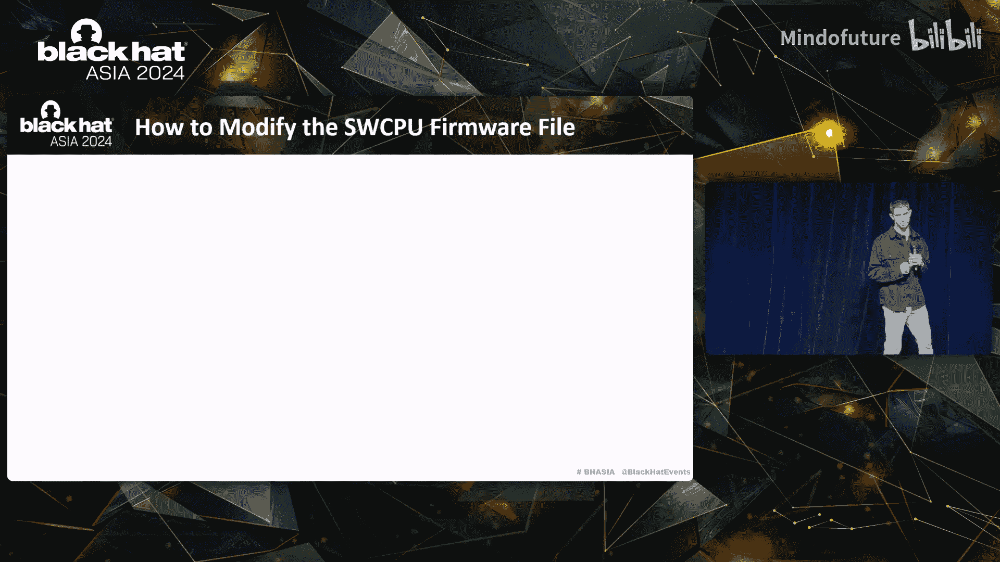
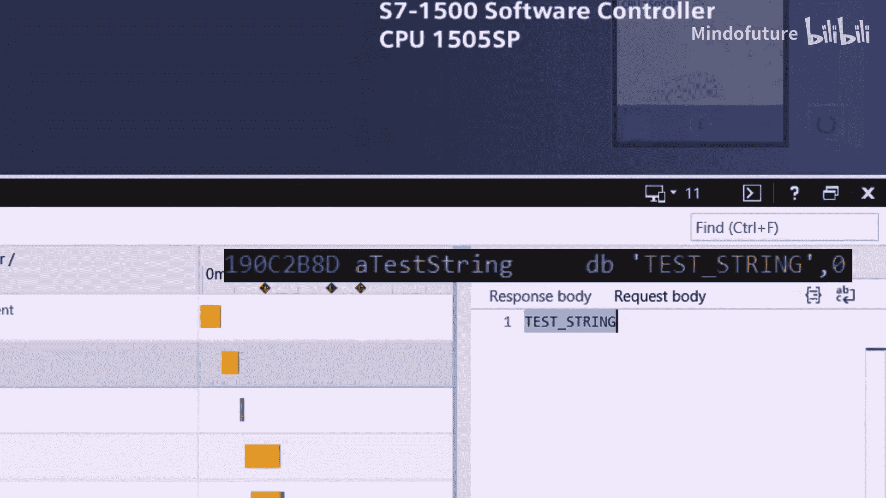
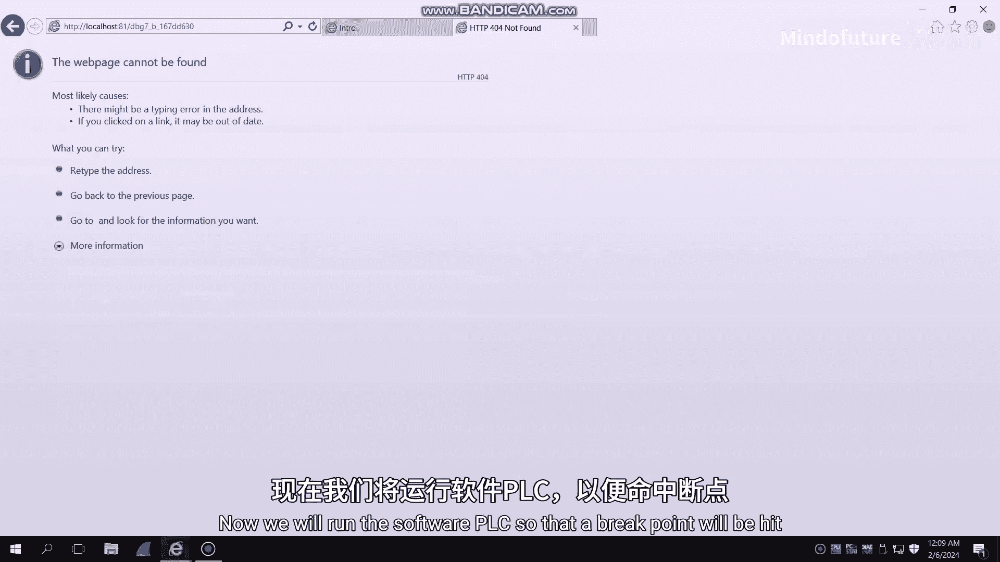
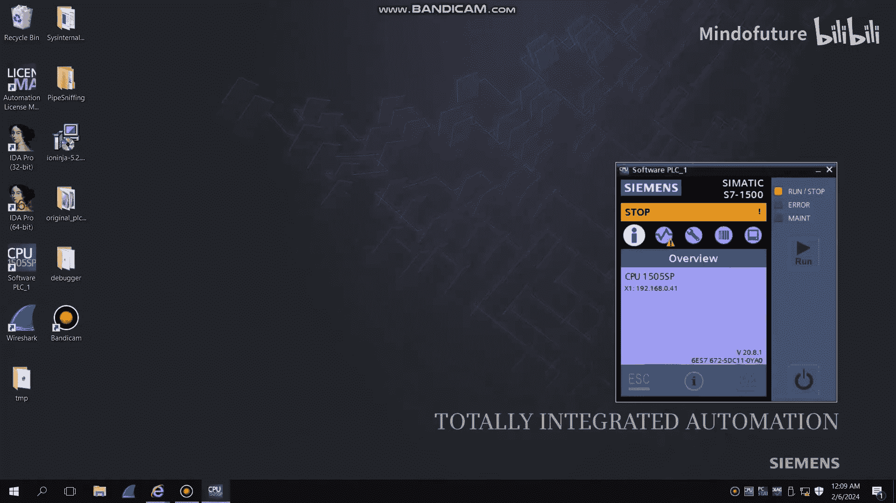
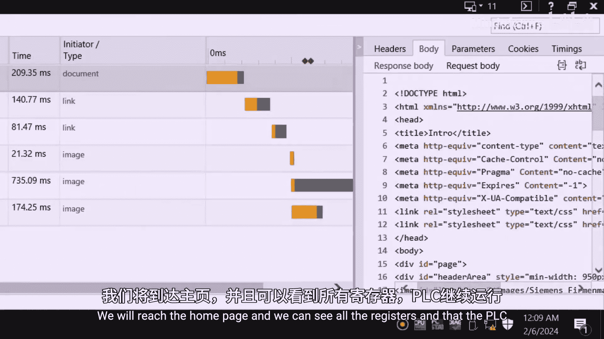

# 008：西门子S7 PLC固件修改攻击与远程调试器开发 🛡️

在本节课中，我们将要学习如何利用西门子S7 PLC（可编程逻辑控制器）中的一个固件修改漏洞，开发一个远程调试器。我们将从背景知识开始，逐步深入到漏洞发现、利用过程，并最终展示一个功能完整的远程调试工具。整个过程将揭示工业控制系统面临的安全风险。

## 背景与动机

上一节我们介绍了课程概述，本节中我们来看看工业控制系统的重要性及其面临的风险。

我们的生活离不开水、交通、食物乃至网购快递。如今，这些必需品都依赖于高度自动化的工业控制系统。这些系统包括净化饮用水的污水处理厂、管理交通的复杂信号系统、使用自动灌溉系统的农场，以及管理在线订单的自动化仓库。

这些智能控制系统集成了大量物联网设备，涉及广泛的云通信和智能自动化。然而，所有这些酷炫的功能都伴随着巨大的风险。针对关键基础设施的网络攻击可能造成毁灭性后果。例如，Triton恶意软件专门设计用于禁用安全系统，而这些系统本可以防止工业事故。它首次在沙特阿拉伯的一家石化工厂被发现，试想一下此类攻击可能造成的致命后果。

因此，我们有巨大的责任来保护这些系统。PLC是工业自动化中使用的一种非常坚固的计算机，是工业控制系统的核心组件。它从传感器等现场设备读取输入数据，然后根据预编程的代码触发输出。你可以将其视为虚拟世界和物理世界之间的桥梁。

## 西门子S7 PLC与先前研究

上一节我们了解了PLC的重要性，本节中我们来看看我们的研究对象——西门子S7 PLC，以及相关的前人研究。

我们来自以色列，那里天气非常炎热。你可以想象在夏天，湿度100%，每个人都在出汗，非常粘腻，所以我们喜欢冰淇淋。但问题是冰淇淋总是很快吃完。因此，在很小的时候，我们就明白冰淇淋工厂是必须保护的关键基础设施。

以下是一个冰淇淋工厂中工业控制系统如何工作的示例：
*   工厂有制备冰淇淋的工业桶。
*   每个桶都连接到一个PLC。
*   PLC在运行时从桶收集数据，例如其温度。
*   基于这些数据，它可以改变桶的行为，例如告诉搅拌器开始搅拌。
*   此外，桶的状态可以在工程工作站上远程查看，并且PLC的自定义控制逻辑可以从该工作站远程更新。

关于西门子PLC，有一些非常重要且相关的前人研究：
*   **Theori的研究**：发现了西门子S7-1200 PLC引导加载程序的一个特殊访问功能，该功能通过UR接口暴露。利用此功能，他们能够直接将固件上传到固件闪存，从而绕过所有完整性检查。
*   **Rogue7团队的研究**：发现所有相同型号的西门子S7 PLC共享一个硬编码的私钥用于通信。这促使Claroty团队发现了这些密钥。一旦他们发现，西门子就更新了他们的通信协议TLS。
*   **Colin Think和Tom Doman的研究**：表明即使在Stuxnet事件过去十年以及随之而来的所有安全改进之后，西门子S7 PLC仍然是攻击者的天堂，我们稍后会展示原因。

## 研究目标：西门子ET 200 SP开放式控制器

上一节我们回顾了前人的工作，本节中我们来看看我们选择的具体研究目标及其特点。

由于PLC是攻击关键基础设施的主要目标，我们专注于最大的PLC供应商——西门子。同时，也因为他们在保护产品安全方面投入最多。更具体地说，我们专注于**西门子ET 200 SP开放式控制器**，这是一款下一代PLC。

它专为满足工业4.0不断增长的需求而设计，并作为现代软件应用的平台。它进行了一些重大的设计更改，这为新的攻击向量和方法打开了大门。它还在标准硬件上运行（本例中是在英特尔Atom四核CPU上），并且是市场上的领先PLC之一。它还包括一个内置的软件PLC，称为S7-1500软件控制器，基本上它是一个模拟传统硬件PLC功能的软件应用程序。为了简洁起见，在整个演讲中，我们将其称为**SW CPU**。

多年来，西门子一直对其S7 PLC的固件保密，并投入大量资源保护其知识产权。例如：
*   西门子S7-1200 PLC如果看门狗发现通过JTAG接口暂停了其中一个核心，则会自毁。这首先由Thomas Weburn在2019年发现，并由Ali Abassi在2020年复现。
*   我们之前讨论的软件PLC在开放式控制器上是加密的。这由So 17团队在2022年发现。

现在，我们为这些西门子S7 PLC的研究带来了一场革命。在S7 PLC历史上，我们首次突破了这些PLC的层层模糊处理。我们引入了一个强大的远程工具来动态分析其固件，并且可以轻松地暴露多年来一直保密的秘密。作为这一切的副产品，我们成功地在PLC上安装了可以与远程命令控制服务器通信的持久性恶意软件。

## 系统架构与引导过程

上一节我们确定了研究目标，本节中我们来看看该开放式控制器的系统架构和启动流程。

在该PLC的最底层，有一个裸机管理程序。它启动两个客户操作系统：
1.  **第一个操作系统是软件PLC**：其主要职责是与现场设备通信，例如我们示例中的工业桶。
2.  **第二个操作系统是Windows嵌入式操作系统**：其主要职责是与工程工作站通信。

自然地，这两个操作系统使用操作系统间通信相互通信。虚拟化提供的这两个操作系统之间的隔离是一个非常重要的安全层，这是因为如果Windows操作系统被攻破，我们仍然希望由软件PLC控制的现场设备保持安全。

这个开放式控制器的引导过程相当简单：
1.  我们有BIOS，它加载板载引导加载程序。
2.  引导加载程序加载VMM第一阶段，这是管理程序的第一部分，主要负责设置不同的配置。
3.  VMM第一阶段加载VMM第二阶段，这是管理程序的核心。
4.  它加载Windows嵌入式操作系统，同时也解密加密的软件PLC并将其加载到内存中。

## 研究起点：So 17团队的发现

上一节我们了解了系统架构，本节中我们来看看我们研究的起点——So 17团队的关键发现。

我们的研究在So 17团队的研究结束的地方继续，也就是Laout USA 22。还记得在上一张幻灯片中，我们展示了管理程序解密加密的软件PLC并将其加载到内存中。So 17团队成功提取了明文的软件PLC文件。因此，我们现在可以开始研究它的汇编代码了。

此外，但同样非常令人惊讶的是，他们发现管理程序和软件PLC固件文件可以轻松地从Windows文件系统访问。这意味着这两个操作系统并没有那么隔离，如果其中一个的文件可以从另一个访问。通过简单的拖放操作，我们可以轻松替换这些文件。顺便说一句，替换管理程序比替换软件PLC更容易，但我们稍后会详细讨论。现在，只是一个我们如何替换管理程序的视频演示。

在这里，左边我们可以看到修改后的管理程序，右边是原始版本。如你所见，通过简单的拖放操作并授予管理员权限，我们可以轻松替换原始管理程序。当PLC重新启动时，加载的将是修改后的管理程序。

他们利用这个新功能来使管理程序崩溃和调试。我的意思是，例如，他们如何知道谁调用了某个函数？他们首先用`int 3`指令覆盖管理程序中的一条指令。在我们的例子中，他们覆盖了函数的第一条指令为`int 3`。然后，他们使用我们在上一张幻灯片中展示的拖放方法替换了原始管理程序。最后，当`int 3`执行时，会产生一个崩溃转储。这有点像PLC的一个隐藏功能。如果我们看顶部，我们看到PLC，底部我们看到崩溃转储。如果我们放大崩溃转储，可以看到管理程序的寄存器和堆栈信息。如果我们查看堆栈顶部，可以看到函数的返回地址。这就是他们发现谁调用了这个函数的方法。

## 我们的贡献概述

在继续演讲的其余部分之前，我们先快速回顾一下。So 17的研究使我们能够：
1.  研究软件PLC的汇编代码。
2.  通过Windows文件系统轻松修改管理程序。
3.  使管理程序崩溃。

接下来，我们将展示我们的贡献。我们将向您展示：
*   恶意行为者（或国家支持的行为者）如何在PLC上持久安装恶意软件。
*   如何与远程C2服务器建立通信。
*   如何远程动态地向软件PLC注入命令。
*   如何从软件PLC中窃取数据。

如果您是像我们一样的研究人员，我们将向您展示：
*   如何从软件PLC读取运行时信息。
*   如何更好地理解代码流程。
*   最终，这将使您的研究过程呈指数级加速。

我们的研究过程有点像抢劫银行，因为它有很多步骤和挑战，所以我们采用了游戏化的方法来完成它。这就是为什么我们开发了一个名为“银行劫案”的游戏，我们将在整个演讲过程中进行游戏。希望你喜欢。现在，我们可以开始讨论软件PLC的运行时操纵，这引出了我们游戏的第一关。

## 第一关：收集情报与研究固件

上一节我们概述了目标，本节中我们进入游戏第一关：收集关于银行（即固件）的情报。

但我们遇到了一个小障碍。记得之前我们展示过，So 17团队能够轻松修改管理程序并运行它。我们想对软件PLC做同样的事情。但问题是，软件PLC在开放式控制器上是加密的。而So 17团队没有发现解密方法或密钥。因此，在我们修改了明文软件PLC之后，我们不知道如何重新加密它以匹配管理程序的解密器。如果我们只是用明文版本替换加密的软件PLC，它应该会崩溃，对吧？

所以我们所做的就是，首先对管理程序中加载软件PLC的代码进行逆向工程。我们发现管理程序可以加载任意ELF文件作为软件PLC，这太疯狂了。它看起来就像是代码中的一个后门。让我们看一下。

在底部，我们可以看到加载加密软件PLC文件的if子句，它只是检查文件开头是否有特定的魔数。但在顶部，我们可以看到有漏洞的else子句，它允许加载任何ELF文件，只检查文件开头是否有ELF魔数。当然，这不应该发生。

让我们直观地看一下。Windows操作系统上的任何管理员都可以使用我们开始时展示的拖放方法，轻松地将原始软件PLC文件替换为修改后的版本。当PLC重新启动时，管理程序将加载修改后的版本，而无需检查真实性。这破坏了虚拟化的关键优势之一，即隔离性。如果攻击者获得了Windows操作系统的管理员权限，则可以远程完成此操作。并且这些更改是持久的，因此可以承受断电。

顺便说一下，我们拥有我们正在研究的PLC的所有权，因此显然我们有一个管理员用户，可以用来运行所有需要管理员权限的实验。这就是我们获得游戏第一分的方式，这非常令人兴奋，这是我们发现的第一个漏洞，我们准备好继续了。

## 第二关：泄露运行时信息

上一节我们获得了修改固件的能力，本节中我们来看看如何利用这个能力来获取软件PLC的运行时信息。

既然我们可以修改这个“十亿美元”（指软件PLC），我们让它做什么呢？我喜欢钱，我想让它挖比特币。但我的兄弟Ael更道德一些，他想修改它以更好地理解内部逻辑。不幸的是，他的方法更复杂。为了更好地理解软件PLC在运行时的行为，我们需要基本的运行时信息，比如它的寄存器和堆栈。但我们怎么做呢？

我们从一个非常天真和简单的方法开始，并在整个研究过程中不断改进和构建。记得之前我们展示过，So 17团队能够通过向管理程序注入`int 3`命令来轻松生成崩溃。如果我们能对软件PLC做同样的事情呢？如果通过简单地向其代码中注入`int 3`命令，我们就能生成崩溃，那样我们就能看到它的寄存器和堆栈了。但显然，这行不通。事情总是很难。但这是一个很好的起点。

我们寻找改进此方法的方法。提醒一下，管理程序启动软件PLC，在运行时，控制权在它们之间来回切换，存在许多上下文切换。我们开始问自己，当`int 3`命令在软件PLC中执行时，它实际上做了什么？在上一张幻灯片中，我们认为它会产生崩溃。但显然，那是错的。但经过大量研究，我们实际上发现它**将控制权切换回管理程序**。

那时我们问了自己以下基本问题：**我们能否将软件PLC的运行时信息泄露到管理程序的崩溃转储中？** 以下是一个直观的解释：
1.  在软件PLC内运行时，使用`int 3`命令将控制权切换回管理程序。
2.  上下文切换后，管理程序的寄存器将与软件PLC的寄存器相同。这是因为管理程序是裸机管理程序，这意味着它与所有客户操作系统共享其物理寄存器。
3.  之后，我们将使用另一个`int 3`命令使管理程序崩溃。
4.  崩溃转储中的寄存器将与软件PLC的寄存器相同。

这就是我们找到的一种很酷的方法，可以将运行时信息从软件PLC泄露到管理程序的崩溃转储中。让我们深入了解一下为实现这一点而注入的代码。

让我们先看一下软件PLC代码的一个片段。😡 当查看这段代码时，我们问自己：这里调用了什么函数？这基本上意味着RAX的值是什么？这里没人知道它是什么，因为它只在运行时确定，所以我们无法真正跟踪代码的流程。我们能做的就是注入这些命令：
*   `mov edx, 0xdeadbeef`：`0xdeadbeef`是我们选择的一个魔数，用来告诉管理程序现在是时候崩溃了。
*   `int 3`：将控制权切换回管理程序，就像我们之前解释的那样。

在`int 3`执行并且控制权切换回管理程序后，我们最终会执行这行代码。这是我们注入的代码。基本上，我们做的是：
1.  首先检查EDX是否等于`0xdeadbeef`（与我们之前放置的相同）。
2.  如果是，我们将使用另一个`int 3`命令使管理程序崩溃。
3.  否则，我们将恢复正常流程。

这就是我们如何在崩溃转储中实际发现RAX的值，正如我们在左边看到的那样。现在，这对我们来说是一个巨大的突破，因为在我们研究过程中，可能也是这个软件PLC的所有研究过程中，首次😊能够真正看到运行时内部发生了什么。直到这一点，我们所能做的只是静态地逆向工程汇编代码。但这非常令人沮丧，因为出于某种原因，它在代码的某些部分停止工作，比如可能在这里工作，在那里工作，在随机的地方停止工作。

所以我们试图精确定位故障点，看看它在哪里停止工作。使用二分搜索法，我们试图使软件PLC崩溃，直到我们真正找到故障点。故障点原来是这条`lidt`命令，它修改了IDT（中断描述符表）。IDT到底是什么？它是一个内核结构，由IDTR寄存器指向。每个条目指向不同的中断处理程序。在我们的例子中，当`int 3`执行时，`int 3`处理程序将控制权从软件PLC切换回管理程序。但如果IDT被更改，并且处理程序被更改，可能会阻止控制权切换回来。

我们通过将`int 3`指令替换为`vmcall`指令来克服这个问题。基本上，`vmcall`做同样的事情，它将控制权切换回管理程序，但无需经过IDT。因此，在我们修改之前，我们的断点看起来像这样（就像我们展示的例子），而我们将其改为使用`vmcall`而不是`int 3`。

这就是我们如何在游戏中获得另一分并实际升级，我们准备好继续研究的下一部分。但在继续之前，快速回顾一下我们到目前为止所做的事情：
1.  首先，我们发现了管理程序中的一个漏洞，使我们能够使用开始时展示的拖放方法轻松修改软件PLC。
2.  😡 通过修改管理程序和软件PLC，我们能够从软件PLC泄露运行时信息。这大大加速了我们研究的下一部分。

## 第三关：利用运行时信息加速研究

上一节我们实现了信息泄露，本节中我们来看看这些运行时信息如何实际加速我们的研究。

你可能会想，这些运行时信息如何实际加速我们的研究？在我们的研究过程中，我们发现静态分析并不总是足够的。例如，在某个时刻，我们想看看运行时打开了哪些文件。我们确实使用了静态分析来查找混淆的C库调用表并映射出它的几个函数，但仅通过汇编代码很难看出哪些文件总是被打开。

所以我们所做的是，挂钩`open` C库调用，使得文件名被复制到寄存器，然后启动崩溃转储。正如你在这里的例子中看到的，这个文件名是ASCII编码的，并保存在图片中的寄存器里。这就是我们如何提取被打开的文件名。对于未来的研究人员，这里是我们找到的混淆的C库调用表，以及我们映射出的几个函数。

现在是非常艰难的时期，因为每个这样的崩溃都需要大约五到六分钟来复现，它们极易出错且非常繁琐，但它们对于我们构建调试器时调试调试器本身至关重要。现在，我们将进入调试器的实际实现。

## 第四关：构建调试器——C2服务器

上一节我们利用泄露的信息推进了研究，本节中我们进入核心环节：构建远程调试器。

为了构建调试器，我们需要几样东西。首先，我们需要能够向软件PLC发送调试命令。然后，我们还需要能够从软件PLC获取调试信息。现在，你们很多人可能在想，这听起来很像一个C2服务器。你是对的，这正是我们要做的。我们要构建一个C2服务器。

这引出了我们游戏的第二关，即**突破金库**或**向软件PLC注入数据**。像大多数人一样，我们尽力避免艰苦的工作。但开发一个C2服务器极其困难，需要更多的研究和开发，比如在C库调用表中找到更多的C库调用。

但如果我告诉你，PLC自带一个预装的C2服务器呢？那将为我们节省大量的开发时间，它甚至带有一个漂亮的GUI。让我向你介绍PLC的**Web服务器**。PLC通过软件PLC暴露了一个Web服务器，这很有道理并且有合法的目的，例如，调试人员可以在维护期间通过手机连接到它。

但我们如何利用它来向软件PLC注入数据呢？我们在这里展示一下，顶部是我们的Web客户端，底部是PLC。Web客户端可以向Web服务器请求任何文件，包括不存在的页面，例如`DBG7_hello`，这显然不是一个真实的文件。但当该请求发送到Web服务器时，Web服务器将尝试打开这个所谓的文件。当这种情况发生时，就会触发我们的`open`钩子。我们的`open`钩子将检查所谓的文件名是否以`DBG7_`前缀开头，如果是，我们将其保存在内存中供以后使用。否则，我们将继续正常的`open`流程并保留其原始功能。

这可能看起来很容易，但我们刚刚获得了一分并升级了，并且有史以来第一次，我们现在可以向软件PLC注入数据了，我们基本上已经完成了一半的C2服务器实现。这引出了第三关。

## 第五关：数据窃取与调试器完成

上一节我们实现了命令注入，本节中我们来实现数据的回传，完成C2服务器的闭环。

第三关是**逃离银行而不被抓**，或者说**从软件PLC窃取数据**。再一次，我们在顶部有Web客户端，底部有PLC。现在，Web客户端将请求主页，这是一个合法的页面，当这种情况发生时，几个CSS文件也将被读取。这就是`read` C库调用的钩子发挥作用的地方。

我们的钩子将检查正在读取的文件是否是`minweb.css`文件。如果是，我们将返回我们之前保存到内存中的数据，而不是返回其原始内容。然后，在此之后，这个修改后的CSS文件将被发送到Web客户端。就像之前一样，如果它不是`minweb.css`文件，就返回其原始内容以保留原始功能。

以下是结果：在左边我们可以看到`minweb.css`文件在浏览器中打开，在右边我们可以看到它的内容，是`DBG7_hello`，这显然不是它的原始内容。所以我们刚刚升级了，我们又得了一分。我们刚刚为PLC构建了一个C2服务器。但我们还没有完成，因为我们需要完成游戏的最后一关，即**击败BOSS**。我们需要构建我们的调试器。现在我们将进入实现部分。

## 调试器实现细节

上一节我们完成了C2通信，本节中我们深入调试器内部的具体实现。

首先，为了构建调试器，我们需要能够添加我们自己的代码和数据而不中断正常流程。以下是任何ELF文件的基本布局，包括软件PLC的ELF文件。我们所做的是向它添加一个全新的恶意部分。我们称这个部分为`hooks`，并赋予它读、写和执行权限。所以现在我们可以添加自己的代码和数据，并在运行时管理我们自己的内存。😊

我们还希望给`.text`部分写权限，以便我们可以在运行时添加断点，但幸运的是，`.text`部分已经是可写的，这显然是一个巨大的安全漏洞。

现在我们将进入调试器的实现和架构。再一次，我们在顶部有Web客户端，底部有PLC。这次Web客户端将请求这个看起来古怪的文件名，这显然不是一个真实的文件，它是一个调试命令。当这个调试命令发送到PLC时，它将触发我们的`open`钩子。

我们的`open`钩子将获取这个调试命令并将其发送到我们的命令解析器。命令解析器将识别这是一个调试命令，这要归功于`DBG7_`前缀。它通过类型字符识别命令的类型，在本例中是大写字母`R`，表示读取字符串命令。现在，读取字符串命令只有一个参数，即要从中读取字符串的地址。因此，多亏了类型，适当的处理程序将被调用并传入参数。在本例中，读取处理程序将从该地址读取字符串，并将其保存到我们添加的新部分中供以后使用。

然后，在此之后，Web客户端将请求主页，就像之前一样，我们将通过CSS文件将该信息泄露给Web客户端。这基本上就是我们的调试器的工作原理。写入处理程序的操作方式与读取处理程序非常相似，而断点处理程序只是将所有寄存器以及您可能想要的任何其他信息复制到CSS文件，将其发送到Web客户端，然后继续正常流程。

## 视频演示

现在我们将向您展示我们的调试器的视频演示。

（视频演示部分描述了操作过程：通过Web界面发送读取、写入和设置断点命令，并成功在CSS文件中看到返回的寄存器数据和内存内容，证明了调试器的有效性。）

## 影响与缓解措施

上一节我们见证了调试器的强大功能，本节中我们来看看其现实影响以及如何防御。

最后，经过大量的工作和努力，以及一点点的“射击”（指调试），我们终于击败了BOSS，赢得了我们的小游戏，并最终开发了我们的调试器。但这个小游戏对现实世界有真正的影响，必须加以缓解。那么，为了缓解我们今天在这里展示的内容，可以做些什么呢？

首先，应该实施一些常见的安全缓解措施，例如使用地址空间布局随机化，并且不允许`.text`部分可写。此外，管理程序应该是两个客户操作系统之间的一道铁壁。西门子给了我们一个优雅的后门，允许我们通过Windows操作系统修改软件PLC。这个所谓的特性必须被移除。事实上，西门子确实试图移除它。他们所做的是发布了一个新版本的管理程序，不允许任何未加密的ELF文件作为软件PLC运行，而只允许加密的。但唯一的问题是，我们可以使用我们之前展示的相同的拖放方法来对管理程序执行降级攻击，并使用我们在此示例中使用的管理程序。这意味着，实际上，这并不能真正阻止任何攻击。

这引出了我们的下一点。**必须有一个安全的引导链**，因为安全的引导链是防止PLC上固件修改攻击的唯一真正方法。

## 对未来的影响与总结

本节课中我们一起学习了如何利用西门子S7 PLC的固件漏洞构建远程调试器。最后，我们来看看这项研究对未来的影响。

那么，对未来研究人员的影响是什么？你可能没有注意到，但我们刚刚进入了一个PLC研究的新时代，并且有史以来第一次，软件PLC可以被动态调试，研究人员可以彻底检查和调查软件PLC的固件。但这还不是全部，因为西门子所有的S7产品线都共享大部分代码，这意味着西门子所有最新和最新的PLC现在都更加脆弱。

我们今天在这里展示的安全影响是什么？我们展示了如何通过市场上领先的PLC之一开发一个持久性的特洛伊木马。这个恶意软件是持久的，可以承受重启，并且不容易被检测到。我们知道一个事实，像Triton攻击中的行为者这样的恶意行为者一直在寻求这类能力，我们现在知道这是可能的。行业未能妥善保护PLC的时间越长，风险就越大。已经有许多在野外运行的PLC容易受到我们今天在这里展示的攻击，但它们无法更新，因为它们运行着关键基础设施，无法承受任何停机时间。

所以你可能想问自己：你感觉有多安全？你应该感到安全吗？你应该做的是要求安全的产品，并确保我们的现代世界保持安全和可靠。

感谢大家的时间，如果您有任何进一步的问题，请随时联系我们或到麦克风前来。谢谢。