# 009：最终章 - 绕过macOS隐私机制的无限可能 🛡️

在本节课中，我们将深入探讨macOS的隐私保护核心机制——透明度、同意与控制（TCC），并回顾过去几年中发现的一系列绕过该机制的方法。我们将从TCC的基础知识开始，逐步分析多种信息泄露和权限绕过技术，最后讨论macOS在安全方面的改进以及未来可能的研究方向。

## 隐私基础回顾 🔍

上一节我们介绍了课程的整体框架，本节中我们来快速回顾一下macOS的隐私基础机制。

在macOS中，最关键的保护机制是默认开启的系统完整性保护（SIP）。SIP基于沙盒和内核扩展，是一个底层的安全机制。即使您拥有`root`权限，当SIP开启时，您也无法执行所有操作，因为它限制了对许多目录和文件的访问，并阻止了对Apple签名进程的调试或代码注入。其核心目标是保护系统完整性。

当SIP开启时，TCC便开始发挥作用。TCC的全称是“透明度、同意与控制”，其主要职责是保护用户隐私。由于SIP保护着存储所有权限的TCC数据库，即使是`root`用户也不应能在未经用户点击“允许”按钮的情况下，批准应用程序访问隐私敏感资源。如果您能找到方法在不触发提示的情况下访问这些资源，那么您很可能发现了一个零日漏洞。

从macOS Ventura开始，TCC还保护沙盒化应用程序的容器，这是一个新引入的功能。如今，TCC保护的隐私资源种类繁多，并且在持续增加，这使得其攻击面也随之扩大。

## TCC绕过技术剖析 🚀

在了解了TCC的基础之后，本节我们将深入探讨几种具体的绕过技术。这些方法展示了即使有严格保护，系统仍可能存在可利用的弱点。

### 信息泄露漏洞

我们的探索始于信息泄露。最初，我阅读了一篇关于macOS数据库的博客文章，该数据库包含大量私人数据。虽然您可能认为联系人信息等隐私数据只存在于受TCC保护的`AddressBook`目录中，但事实证明，您的联系信息在系统其他至少五个地方也有缓存，而Apple并未考虑到这一点。

以下是我们在文件系统中发现的一些显著信息泄露案例：

*   **键值服务数据库**：包含了电子邮件地址和已知的Wi-Fi热点信息。
*   **Game Center缓存数据库**：当您启动Game Center时，它会复制您所有联系人的详细信息，只需访问该数据库即可获取完整的联系人信息。
*   **`par`守护进程**：这个进程会创建非常短暂的缓存文件（仅存在几分钟），其中记录了您的GPS位置，并且还在Safari中进行了键盘记录。
*   **地图应用日志**：如果您使用特定坐标启动Apple Maps，它会记录从您当前位置到该坐标的距离。通过使用多个坐标，可以进行三角测量或其他计算，从而精确定位用户。

除了文件系统，系统日志也是信息泄露的重灾区。Apple试图过滤日志中的隐私数据，并将其标记为“私有”进行编辑。虽然可以通过安装用户配置文件来重新启用这些日志，但安装配置文件需要大量用户交互，攻击者通常难以做到。然而，我们发现，如果在后台安装特定配置文件，系统实际上只是启用了日志记录偏好设置中的一个选项，重启日志服务后，所有私有数据便会在日志中可见。

我们还发现了两个具体的日志泄露漏洞：

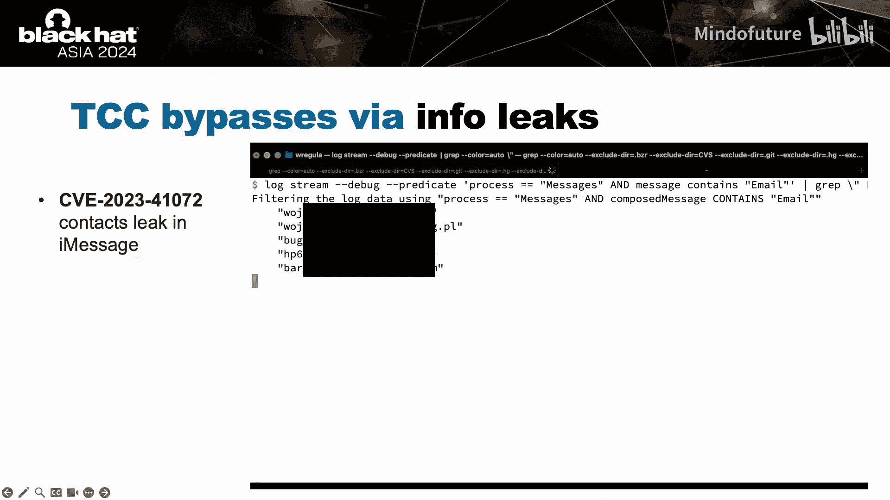

1.  **天气应用位置泄露**：天气应用需要知道您的位置来提供预报。当网络连接中断时，完整的HTTP请求错误会被记录到日志中，而这个请求包含了您的位置信息。因此，通过故意中断网络连接，可以在不获取位置权限的情况下泄露用户位置。
2.  **信息应用联系人泄露**：每当您打开信息应用时，所有您聊天过的联系人的电子邮件地址都会被记录到日志中。

### 通用TCC绕过方法

接下来，我们看看一些更通用的TCC绕过技术。

**方法一：利用自定义用户和TCC数据库**

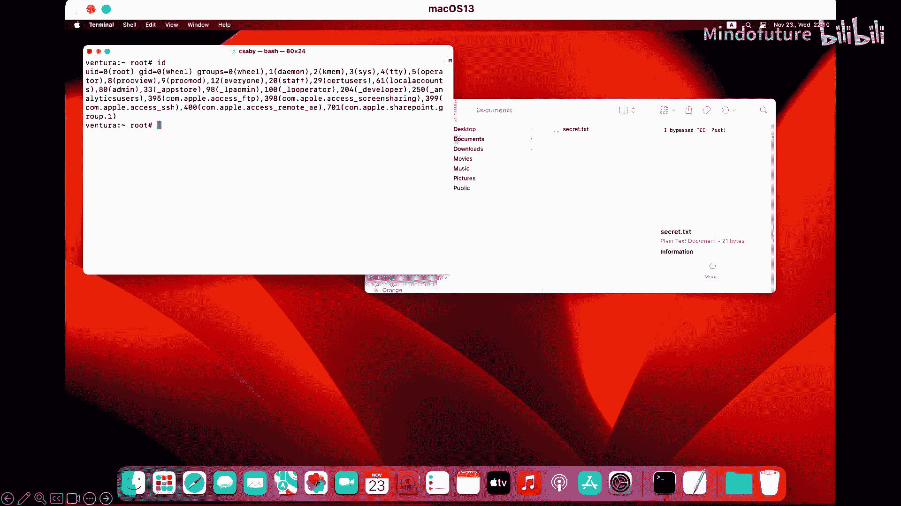

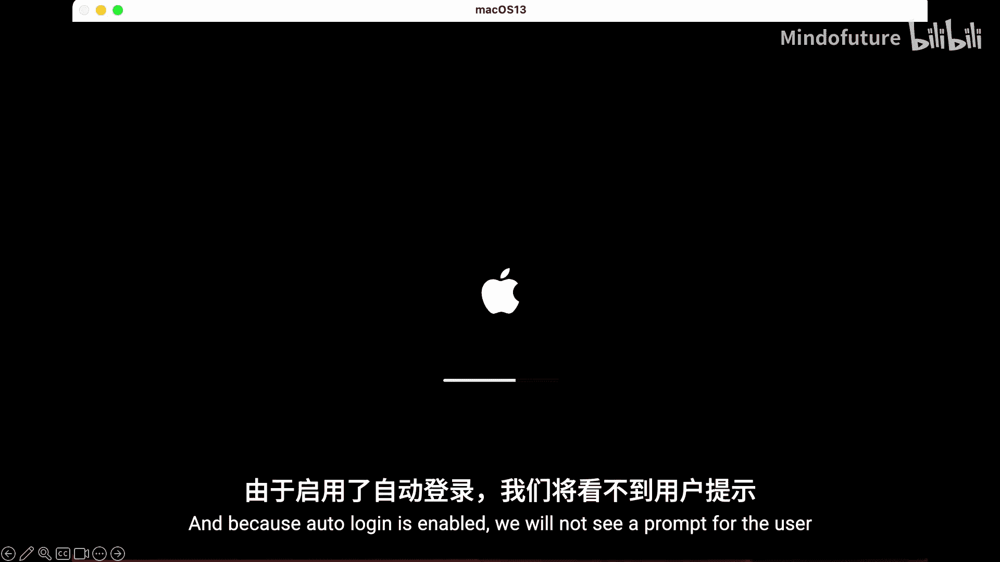

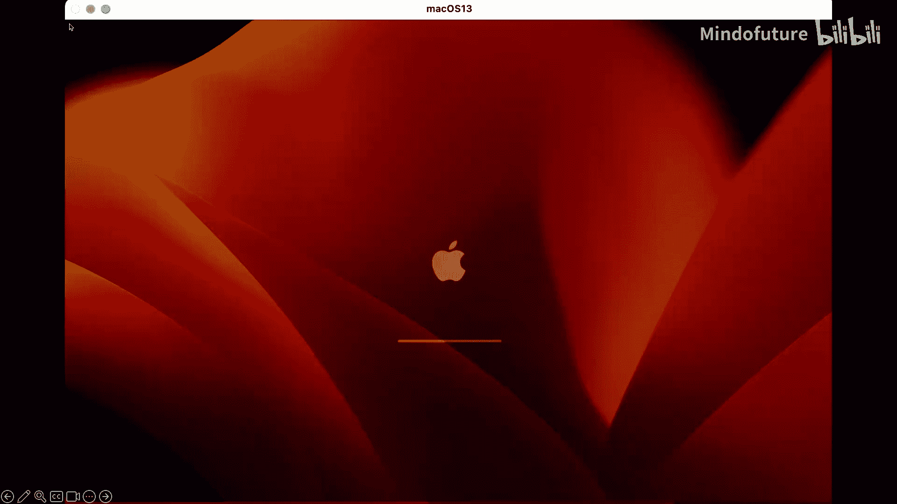

过去，一种常见的技术是通过自定义TCC数据库来更改用户的主目录。虽然Apple已经很大程度上堵住了这个漏洞，但仍存在一个被忽视的点：我们仍然可以在macOS上创建一个具有自定义主文件夹的新用户，并植入自定义的TCC数据库。

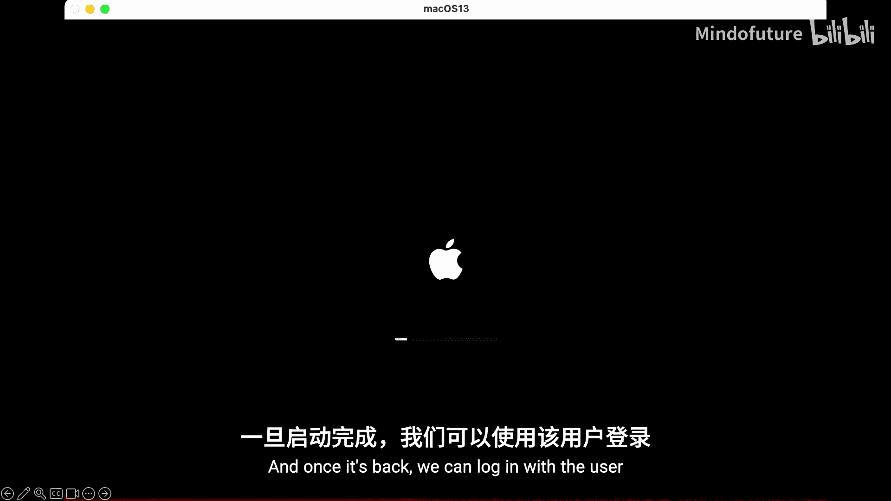

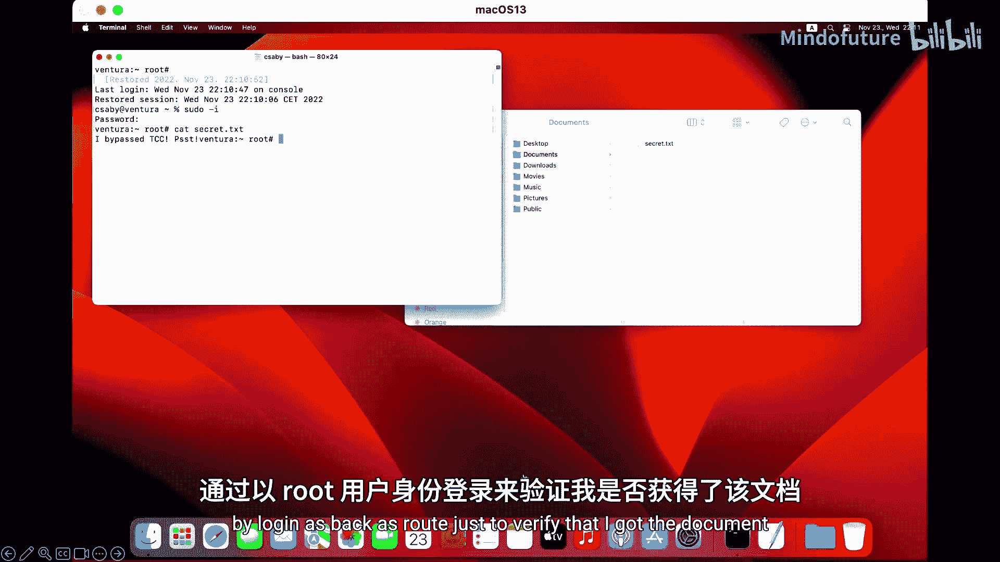

在macOS Ventura中，即使用户TCC数据库中的条目也具有一定的全局性。例如，如果您授予终端访问“文档”的权限，那么当您同时是`root`用户时，终端也能访问其他用户的文档。在Sonoma中，这一行为有所改变，但利用步骤依然可行。

以下是利用步骤：
1.  创建一个包含自定义TCC数据库的新用户（或启用默认禁用的`root`用户）。
2.  以新用户身份登录。
3.  窃取所需信息。
4.  重启系统。

这个过程可以完全自动化。在演示中，我们启用了带有自定义TCC数据库的`root`用户，安装了自动运行脚本以窃取其他用户的文档，并启用了自动登录。这样，系统启动后`root`用户会自动登录、窃取数据、清除痕迹并重启，最终用户毫无察觉地回到自己的账户。

**方法二：利用Safari沙盒进程**

Safari沙盒代理进程负责解压通过Safari下载的ZIP文件，并且它拥有“完全磁盘访问”权限。这意味着它可以访问您所有的隐私数据。

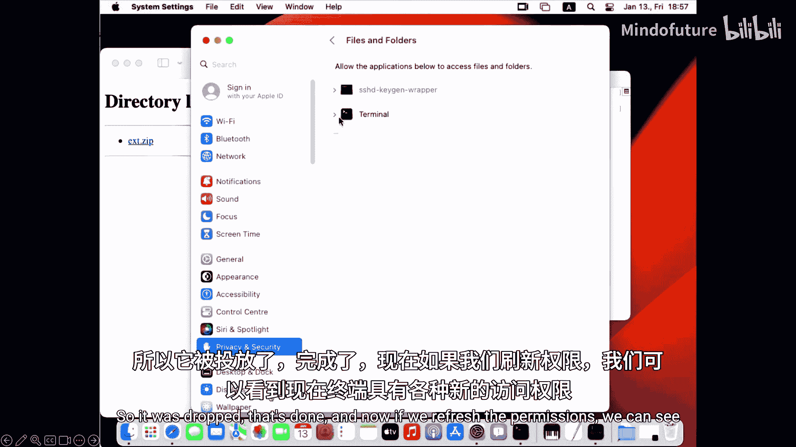

该进程的解压流程如下：
1.  在“下载”文件夹中创建一个名为`[文件名].zip.download`的目录来下载ZIP文件。
2.  创建一个具有6个字符随机名称的目录，并将内容解压到该目录中。

我们可以通过以下步骤利用此进程：
1.  创建一个非常大的ZIP文件（以减慢解压速度），并将我们的自定义TCC数据库放入其中。
2.  当用户下载ZIP文件时，快速用我们的恶意ZIP文件覆盖它。
3.  在Safari创建随机目录时，将该目录替换为指向TCC数据库文件夹的符号链接。

第三步存在竞争条件，但通过使用包含大文件的大型ZIP文件，我们可以轻易赢得竞争。解压完成后，我们的TCC数据库就会覆盖原数据库，从而授予我们终端新的访问权限。

**方法三：利用安装程序**

`Installer`是macOS的安装程序。由系统安装程序进程运行的已签名安装程序包具有“绕过SIP”的权限，并且其子进程会继承此权限。安装包中通常包含安装后脚本，这些脚本会以绕过SIP的权限运行。

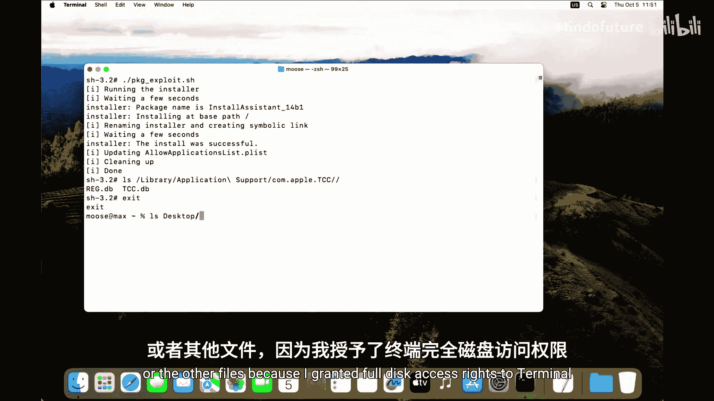

我们发现，许多安装包中都包含一个名为`InstallSharedSupport.sh`的脚本，这个大约15行的脚本包含了三个不同的漏洞。其中两个关键漏洞是：
1.  `ln`命令创建硬链接：它获取我们可控的安装包路径，并将其硬链接到共享支持目录。我们可以将安装包替换为指向SIP保护文件的符号链接，从而创建指向该保护文件的硬链接。由于SIP保护基于文件路径，我们可以通过新的硬链接修改或覆盖该文件。
2.  移除限制标志：脚本的最后一行移除了文件的限制标志，这相当于完全移除了SIP保护。

我们可以选择攻击TCC数据库，或者像演示中那样，选择攻击`/Library/Application Support`目录下的plist文件（这是一种plist格式的TCC数据库）。通过利用此漏洞，我们可以为终端授予完全磁盘访问权限。

### 命令行工具与框架漏洞

除了上述方法，一些系统自带的命令行工具和框架也暗藏玄机。

**`CPLDiagnostics` 工具**

`CPLDiagnostics`是一个诊断iCloud相关服务的命令行工具。它拥有大量私有Apple权限，甚至包括一个名为`com.apple.private.tcc.allow`的权限，这看起来是一个值得逆向分析的目标。该工具需要`root`权限才能执行，但在SIP和TCC开启的情况下，即使是`root`也不应能访问用户敏感数据。

该工具的输出警告明确说明，其诊断信息可能包含大量个人敏感信息，如位置、IP地址、iCloud账户信息、照片元数据、联系人详情、Apple Music活动记录等。虽然有一个需要按回车键继续的保护措施，但只需使用`echo |`管道命令即可轻松绕过。通过一个简单的Bash脚本，就可以提取所有这些敏感数据。

**Quartz Core框架漏洞**

Quartz Core是macOS中用于处理和渲染图形数据的底层框架，几乎所有带有图形用户界面的应用程序都会加载它。该框架有许多环境变量可以控制其行为。

我们发现了三个有趣的环境变量：
1.  `QUARTZ_CORE_LOG_FILE` 或 `XC_LOG_FILE`：当设置为文件名时，会使图形应用程序开始记录渲染窗口期间的Quartz Core事件。
2.  `XC_LOG_FILE_OPEN`：当设置为1时，在应用程序关闭后会自动用默认文本编辑器打开日志文件。

漏洞在于，有一个字符串拼接操作被传递给了`system()`命令。这意味着在所有带有图形界面的macOS应用程序中都存在命令注入漏洞。通过`system()`函数产生的子进程会继承父进程（即拥有TCC权限的应用程序）的权限。

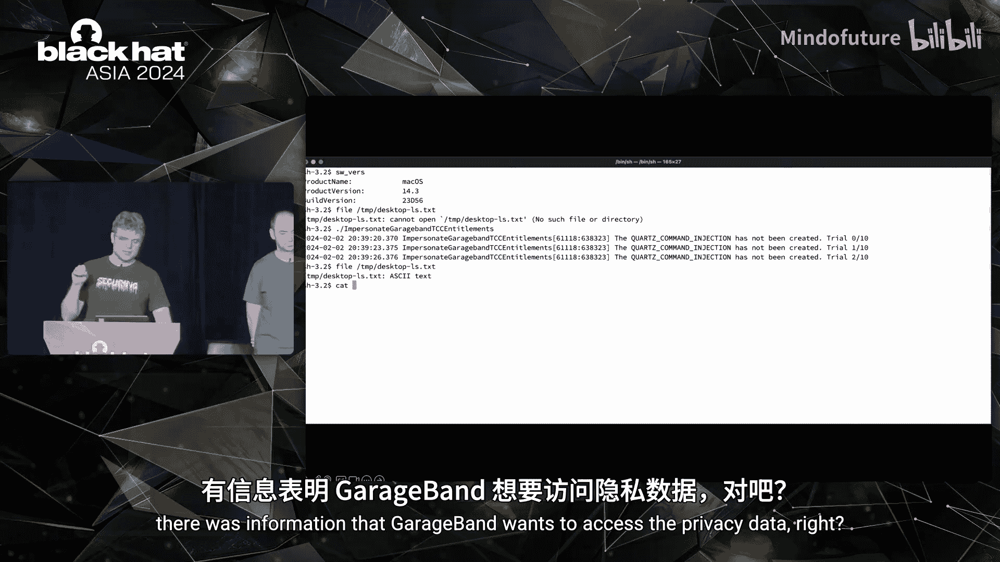

例如，我们可以通过GarageBand应用程序注入命令，并利用其权限访问本应受保护的数据。

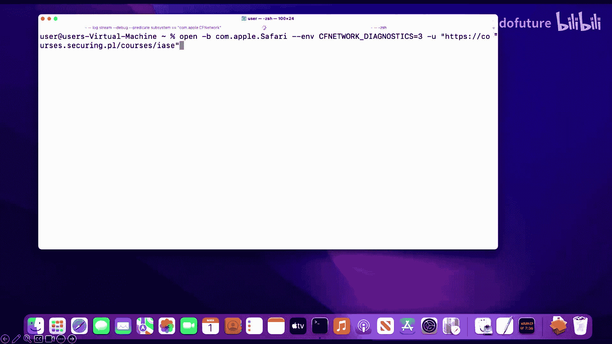

**Core Foundation网络框架漏洞**

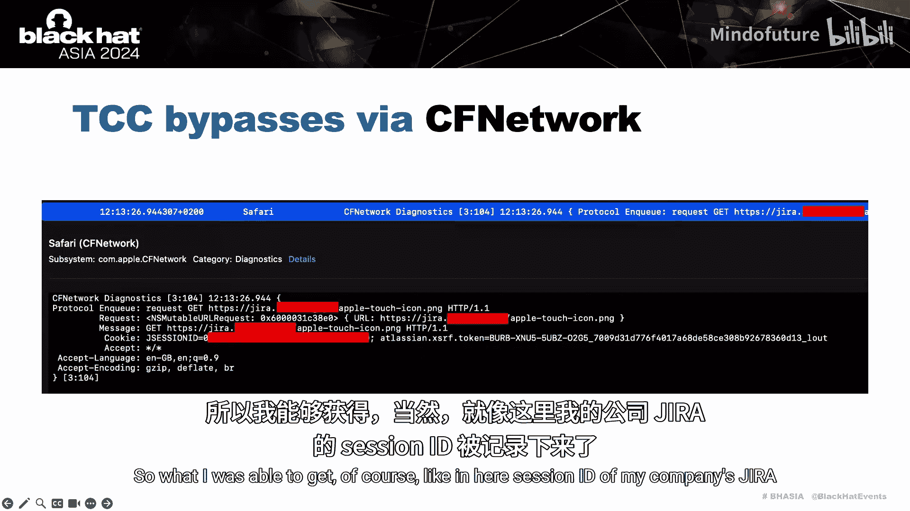

Core Foundation网络框架被macOS广泛用于网络通信。环境变量`CFNETWORK_DIAGNOSTICS`在设置后，会使进程记录每个HTTP和HTTPS请求。这个信息甚至可以在Apple的官方文档中找到，无需逆向工程。

大多数使用标准macOS网络API的Apple内部应用程序都受此影响。通过此漏洞，我们可以在Safari中泄露公司Jira的ID，在地图中泄露用户位置，在“查找我的”中泄露iCloud令牌。这个iCloud令牌尤其危险，因为它可以用来获取同步到iCloud的TCC保护数据，如“查找我的”联系人、日历、提醒事项、备忘录、照片、信息等。

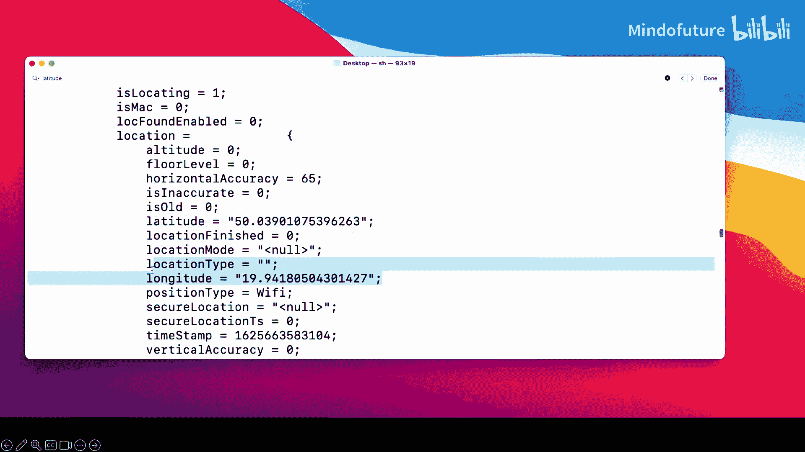

我们开发了一个工具，可以获取位置信息并传递iCloud令牌，从而直接从iCloud刷新并获取用户的实时位置。

### 一个未修复的漏洞

出于对用户和Apple的公平性，我们不会在此披露任何未修复的零日漏洞。然而，我们在2023年1月向Apple报告了一个严重的TCC漏洞，截至当时（演讲时间）仍未修复。我们已告知Apple不会在2023年11月之前披露此漏洞，希望他们有足够的时间来修复这个重大的macOS隐私漏洞。或许在下次演讲中，我们会将其公之于众。

## TCC的改进与“消亡”的技术 📈

在探讨了多种绕过技术后，我们来看看TCC在过去几年中的改进，以及哪些旧技术已经或正在“消亡”。

一些过去常用的技术现在已基本失效：
*   **目录挂载覆盖**：Apple保护了许多文件不被覆盖、读取或修改，但过去可以通过挂载覆盖目录来让系统写入文件或放置新配置文件。现在这已基本被阻止。
*   **高权限命令行工具**：许多拥有强大权限的`/usr/bin`工具已被加固或从系统中移除。
*   **插件注入技术**：通过向GarageBand、Image Capture等应用注入插件来获取其权限的方法，由于macOS Ventura引入的“启动约束”功能而基本失效。应用程序现在使用硬运行时签名，并且插件加载被移到了没有权限的外部XPC服务中。
*   **信息泄露**：文件系统漏洞和信息泄露如今已很难发现，日志泄露也在减少。
*   **应用程序数据保护**：使得访问可能包含私有数据的应用程序容器变得更加困难。
*   **安装程序脚本漏洞**：由于新的安装程序脚本操作和突变保护，这类漏洞正在减少。

主要的改进包括：
*   **启动约束**：这不是TCC特有的缓解措施，但它控制着谁能启动应用程序、如何启动以及从哪里启动。例如，过去常见的将应用程序复制到临时文件夹并注入插件后启动的方法不再有效。这大大增加了攻击难度。
*   **应用程序捆绑包和数据保护**：这可能是自Monterey以来最具影响力的TCC保护措施。它在文件系统层面保护应用程序及其数据，尽管目前仍存在一些绕过方法，但总体上是强有力的改进。
*   **新增TCC类别**：在Monterey中，新增了大约16个TCC保护类别，保护更加细化。

## 总结与展望 🎬

本节课中，我们一起深入学习了macOS的TCC隐私保护机制及其多种绕过技术。

TCC是Apple保护私人数据的一次重要尝试，这在Linux或Windows环境中并不常见。过去五年，TCC经历了巨大发展，变得越来越复杂，发现漏洞的难度也越来越高。尽管如此，仅我们两人就为三场会议提供了足够的TCC漏洞内容，而且还有其他研究人员在不断发现新问题。

我们将本次演讲称为“最终章”，因为这已经是一个不错的三部曲研究。但三部曲之后是什么？是续集！我们很高兴地介绍“重返TCC大陆”，目前正在紧张开发中，希望明年能再次为大家呈现绕过一切的新内容。

**本节课中我们一起学习了：**
1.  macOS隐私保护的基础：SIP和TCC。
2.  多种信息泄露漏洞，包括文件系统和日志泄露。
3.  几种通用的TCC绕过方法，涉及用户创建、Safari进程和安装程序。
4.  通过系统工具（如`CPLDiagnostics`）和核心框架（如Quartz Core、Core Foundation网络）实现的权限提升和漏洞利用。
5.  macOS在TCC和安全方面的持续改进，以及一些已“消亡”的旧技术。
6.  对TCC未来研究和安全挑战的展望。

感谢大家的聆听，我们明年续集再见！