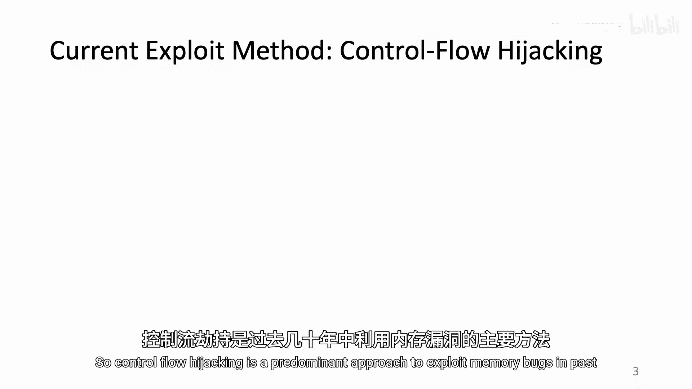
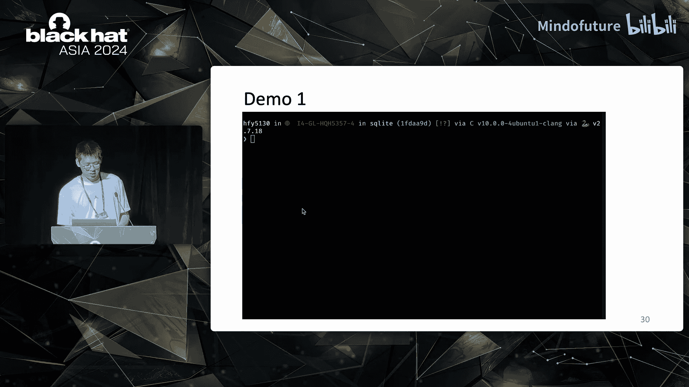
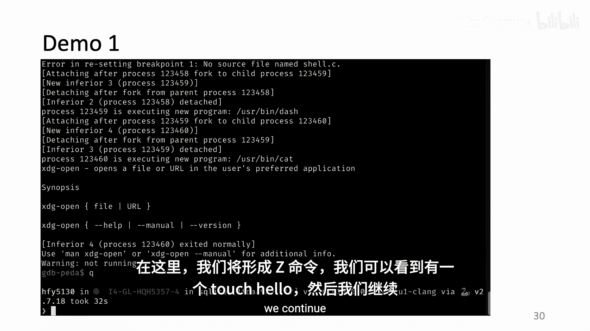
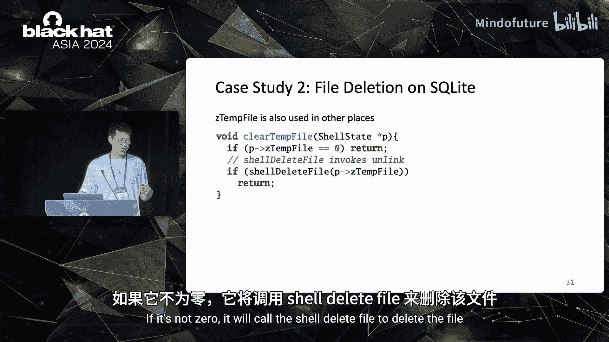
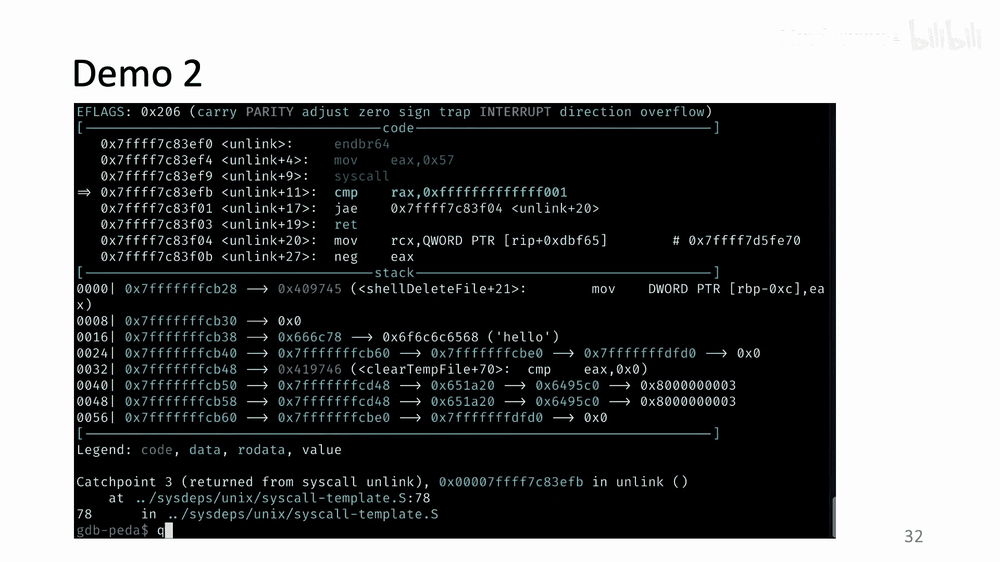
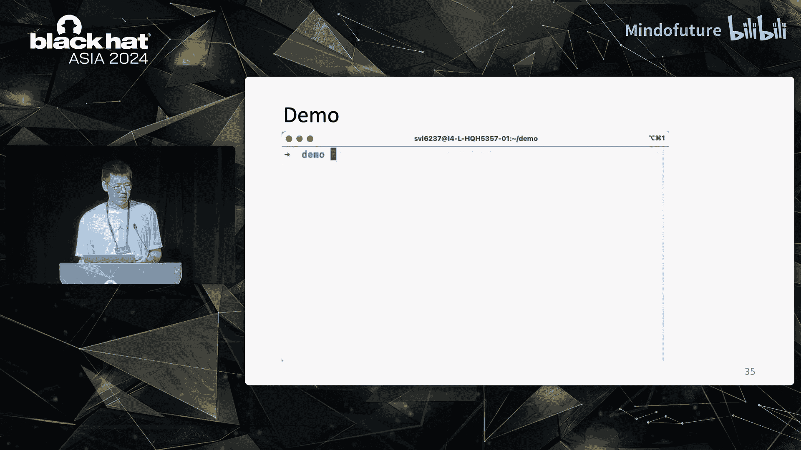
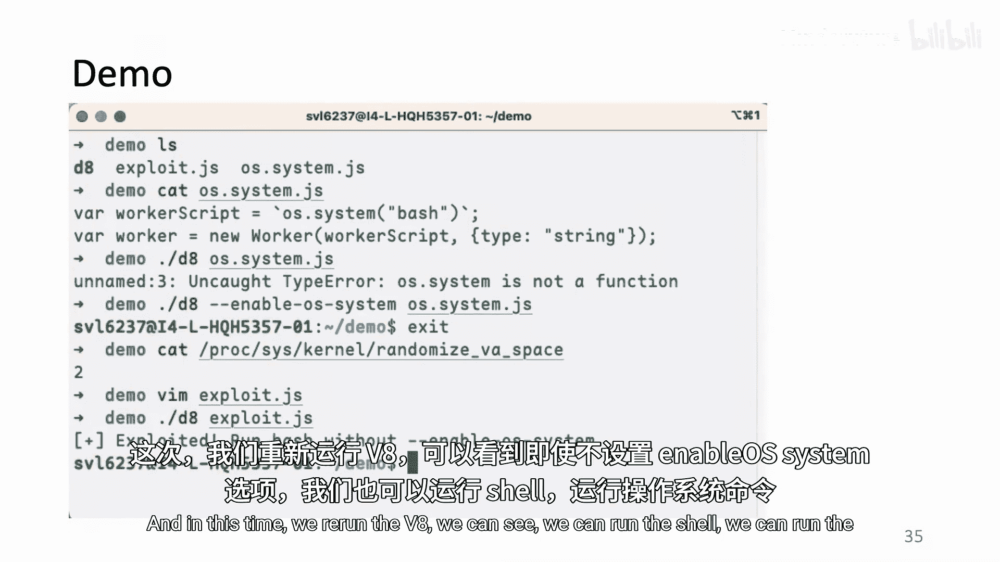

# 010：一次翻转足矣——识别系统调用守卫变量

在本节课中，我们将学习如何识别用于生成数据导向攻击的关键数据。我们将探讨一种名为“分支强制翻转”的技术，并了解如何利用它来自动化地发现那些被称为“系统调用守卫变量”的关键数据。

大家好，我是何楷烨，来自宾夕法尼亚州立大学的博士生。今天我将介绍如何识别用于数据导向攻击的关键数据。

我们的团队是来自宾夕法尼亚州立大学的系统安全研究员，研究方向包括漏洞检测、利用和防御。团队成员包括我和宋哲昌两位博士生，以及我们的导师洪虎教授。

## 控制流劫持与数据导向攻击

在过去的几十年里，控制流劫持是利用内存漏洞的主要方法。

在控制流劫持攻击中，攻击者首先利用内存漏洞来获取内存读写原语，例如任意读或任意写。然后，他们利用这些原语来篡改控制数据，如返回地址或函数指针，从而改变程序的控制流，最终实现恶意目标，如任意代码执行。

过去几年，攻击者可以构建代码注入攻击或代码复用攻击。然而，研究人员提出了许多不同的解决方案来防止此类攻击。例如，代码指针完整性可以保护控制数据，而控制流完整性可以防止异常控制流被执行。因此，如今要劫持控制流已经变得相当困难。

与此同时，数据导向攻击显示出成为下一代攻击方法的巨大潜力。与控制流劫持依赖控制数据不同，数据导向攻击只需要篡改非控制数据，就能实现类似的恶意目标，如任意代码执行。先前的研究，如数据导向编程和块导向编程，已经证明了数据导向攻击的可行性，并且可以实现自动化。这种攻击方式非常强大。

## 数据导向攻击实例

让我们从一个经典的数据导向攻击开始，该攻击需要篡改Apache HTTP服务器中的CGI-BIN配置字符串。

这个攻击相当简单直接。以下是正常CGI请求的工作流程示例。

在服务器初始化期间，它会首先从配置文件中加载CGI配置。这里的配置文件指定了CGI-BIN的路径，例如 `/usr/local/httpd/cgi-bin`。CGI，即通用网关接口，是一种在服务器端运行可执行程序以处理数据的标准。CGI配置是一个包含所有有效可执行文件的目录字符串。

在这种情况下，客户端会发送一个POST请求，其中包含一个字符串，如 `cgi-bin/calculator`。当服务器收到此请求时，它会首先解析这个字符串，获取第一部分 `cgi-bin`，从而知道这是一个CGI请求。然后，它会解析后面的部分以获取可执行文件名，在这个例子中是 `calculator`。服务器会在预加载的CGI-BIN配置中搜索 `calculator`，如果找到，就会为客户端运行计算器程序。

我们可以看到，配置字符串非常重要，因为它决定了客户端可以执行哪些可执行文件。

那么，如果配置字符串被破坏会发生什么呢？这正是攻击者所做的。在这个攻击中，攻击者首先利用一个堆溢出漏洞，将 `cgi-bin` 覆盖为 `/bin`。然后，他们仍然会发送一个CGI-BIN请求。在这个例子中，他们会尝试运行 `sh` 命令，并附带一个删除名为 `root_private_file` 文件的命令。

服务器收到此请求后，会识别出这是一个CGI-BIN请求，并识别出客户端想要运行 `sh`。它会在 `/bin` 目录中搜索 `sh`，而不是预加载的目录，然后赋予客户端 `sh` 的权限并删除文件。

实际上，还有许多其他强大的数据导向攻击。例如，在WU-FTPD服务器中，通过篡改 `seteuid` 的参数来获取root权限。在Black Hat USA 2014上，杨宇提出了一种攻击，只需要篡改一个名为 `SafeMode` 的变量，就可以在IE浏览器中开启“上帝模式”，该模式允许运行不安全的ActiveX控件，这等同于任意代码执行。还有其他攻击，如绕过Windows中的EMET和绕过Windows中的控制流防护。

从之前的例子中，我们可以看到，与控制流劫持需要构建复杂的攻击链（如ROP）来绕过防御机制不同，数据导向攻击通常非常简单直接。在大多数情况下，攻击者只需要破坏一个变量，有时甚至只需要改变一个比特位，攻击就完成了。

## 识别关键数据的挑战

既然数据导向攻击如此强大，为什么它现在还没有像控制流劫持攻击那样普遍呢？我们认为最重要的原因是，非控制数据（即关键数据）难以被自动识别。

现在的问题是，我们如何自动识别安全关键的非控制数据（简称关键数据）以构建数据导向攻击？

识别关键数据具有挑战性。与控制数据具有共同的低级属性（如特定的数据类型或内存位置）不同，关键数据是根据其高级语义来定义的。然而，对大型应用程序进行通用分析以推断高级语义是不切实际的。

在先前的工作中，研究人员试图通过手动检查代码库来识别关键数据，这种方法繁琐、需要大量人力且不可扩展。FlowStitch等工具可以识别与显式系统调用（如 `execve` 的参数）相关的关键数据，但这显然只能识别与Linux内核中系统调用相关的关键数据。

## 我们的贡献：系统调用守卫变量

我们在本文中的贡献是，首先识别出一类重要的关键数据，称为“系统调用守卫变量”。我们设计了“分支强制翻转”技术来识别它们。我们还评估了它们的可利用性，因为在先前的工作中，他们只是假设存在任意内存原语，但我们希望评估其可利用性，以确认这些变量是否确实可以被破坏。

我们实现了一个名为 **Viper** 的框架。我们从13个程序中识别出34个先前未知的系统调用守卫变量，并在SQLite和V8上构建了四个新的数据导向攻击。我们已经将工具开源。

让我们从一个经典的数据导向攻击开始，这也是我们的动机示例。这段代码用于OpenSSH服务器对用户进行身份验证。

我们可以看到有一个名为 `authenticated` 的标志，默认值为0。有一个 `while` 循环不断获取用户名和密码并进行验证。如果密码正确，则跳出循环，将 `authenticated` 设置为1，并允许登录。然而，实际上，函数 `packet_read` 中存在一个内存漏洞，可以提供内存写原语，攻击者可以利用它将 `authenticated` 设置为1。在这种情况下，即使提供了错误的密码，攻击者仍然可以登录服务器。

我们认为 `authenticated` 是关键数据。问题是如何自动识别 `authenticated`。

## 识别方法：分支强制翻转

我们首先检查了先前的数据导向攻击，得到了两个观察结果。

第一，大多数数据导向攻击依赖于安全相关的系统调用。在这个例子中，一旦跳出循环允许登录，服务器最终会为攻击者执行代码。

第二，安全相关的系统调用通常由安全检查（实际上是条件分支的形式）所守卫。我们将在该分支中的变量称为系统调用守卫变量。

我们实现了Viper来自动识别系统调用守卫变量。在深入之前，我们想知道系统调用守卫变量在数据导向攻击中是否真的重要。我们检查了现有的17个数据导向攻击，发现其中11个攻击的目标变量是系统调用守卫变量或系统调用参数，而其他6个是守卫变量。

然而，识别系统调用守卫变量仍然具有挑战性。第一个挑战是如何识别每个变量的独立贡献。符号执行可以识别触发系统调用的完整路径，但它无法告诉我们哪些变量相比其他变量更为关键。第二个挑战是如何使分析高效且可扩展。静态分析可以提供帮助，但它在处理间接调用和执行过程间分析方面存在一些限制。

为了高效定位系统调用守卫分支，我们设计了分支强制翻转。其核心思想是：在执行过程中翻转每一个分支，同时挂钩系统调用，观察是否有新的安全相关系统调用被触发。如果是，我们认为被翻转的分支是一个系统调用守卫分支。

为了说明，假设我们有一个程序和一个输入。我们首先用该输入运行程序，并记录所有触发的分支和系统调用。然后，我们用相同的输入重新运行程序，但这次我们会强制翻转执行过程中的第一个分支，并再次记录所有触发的系统调用。如果有新的系统调用被触发，我们认为这个分支是系统调用守卫分支。

我们翻转执行过程中的每一个分支，得到一堆潜在的系统调用守卫分支。

## 评估变量可利用性

通过分支强制翻转，我们可以获得一堆潜在的系统调用守卫分支。然而，我们不知道它们在现实场景中是否真的可以被翻转。这就是为什么我们要研究这些分支中的变量。

实际上，我们对这些分支中的每个变量执行向后数据流分析，并生成数据流图，以评估这些系统调用守卫变量的可利用性。

在我们的评估中，有两个指标。第一个指标是内存位置，我们认为全局变量比堆变量和栈变量更容易被破坏。第二个指标是在变量生命周期内内存写指令的数量。我们假设每条内存写指令都可能被滥用。因此，如果在生命周期内有更多的内存写指令，我们认为它被破坏的可能性更高。

以下是Viper的工作流程：给定一个程序和输入，分支强制翻转首先在程序上运行，收集触发的系统调用和分支。然后，在重新执行时翻转每个分支，并识别潜在的系统调用守卫分支。我们只翻转那些由新系统调用触发的唯一分支，并使用分叉服务器来加速重新执行。在获得分支、系统调用和输入后，我们将它们提供给变量评估器。评估器首先在LLVM IR级别记录这些输入的执行轨迹，然后基于记录的轨迹模拟执行并进行向后数据流分析。最后，Viper会报告具有高可利用性的系统调用守卫变量。

## 评估结果与新攻击

我们在20个程序上评估了Viper。其中包括13个已知存在数据导向攻击的程序（如OpenSSH），以及7个来自FuzzBench的程序（包括SQLite），还有四个其他经过充分测试的程序，如JavaScript引擎V8。

我们意识到，一个重要的因素是希望输入能够实现更高的覆盖率，因为只有当我们的输入能够触发某个分支时，我们才有机会在动态执行期间翻转它。这实际上与模糊测试非常相似。因此，我们首先尝试在源代码仓库中搜索测试用例。如果在源代码中找不到，我们会在线搜索是否有现成的语料库，如FuzzBench的数据集。如果通过前两种方法都找不到，我们会使用AFL++对程序进行模糊测试，以尝试获得相对健壮的语料库。

我们总共从14个程序中识别出36个系统调用守卫变量。图表显示了系统调用的分布：15个变量与 `unlink` 相关，可以删除或覆盖文件；10个变量与 `execute` 相关，可以执行任意代码；其他变量与更改文件权限、更改根目录、更改符号链接、设置组ID、设置真实用户ID和导入保护等相关。

我们还调查了可解释性。首先，我们在GDB中模拟内存原语，以确认所有36个系统调用守卫变量确实可以触发安全相关的系统调用。然后，我们进行了CVE调查，搜索历史漏洞，并确认对于其中16个变量，确实曾经存在可以提供任意内存写原语来破坏它们的CVE。最后，我们构建了四个数据导向攻击。

以下是时间成本。对于大多数程序，Viper可以在五分钟内完成分析。我们还将Viper与FlowStitch（一个用于数据导向攻击的漏洞利用生成工具）进行了比较，可以看到时间成本处于同一水平，因此我们可以将Viper与其他工具结合用于自动漏洞利用生成。

## 新攻击案例展示

在接下来的内容中，我将展示我们构建的三个数据导向攻击，其中两个针对SQLite，一个针对V8。

SQLite是Android、iOS、Chrome和Safari中最广泛部署的数据库引擎。我们使用Viper测试了SQLite。Viper报告了SQLite中的7个系统调用守卫变量。我们基于前三个系统调用守卫变量构建了三个新的数据导向攻击。

第一个变量是 `doXdgOpen`。通过将 `doXdgOpen` 设置为1，我们可以实现任意命令执行，稍后将展示一个演示。第二个变量是 `zTempFile`，它可以实现任意文件删除。最后一个变量是 `delete`，它也可以实现任意文件删除。

关于我们的第一个攻击，有一点背景知识：当SQLite处理查询时，它有多种方式来呈现或处理输出结果。它可以将结果输出到标准输出，也可以将结果保存到文件中。然而，有时你可能希望在将结果保存到文件系统之前对其进行编辑。没问题，SQLite也有这个功能。例如，使用 `.once -e` 命令会将输出发送到系统文本编辑器，而使用 `-x` 则会发送到电子表格程序。

相关代码显示了SQLite如何在名为 `output_reset` 的函数中打开系统文本编辑器。我们可以看到有一个 `if` 语句会检查 `doXdgOpen` 的值。只要该值不为0，它就会基于 `zTempFile` 构建命令字符串，并调用 `system` 来运行该命令。

我们是如何识别 `doXdgOpen` 的呢？分支强制翻转翻转了 `if` 语句并捕获了 `execve` 系统调用。变量评估器为 `doXdgOpen` 和 `zTempFile` 生成了数据流图，并发现它们确实具有很高的可利用性。

这是变量评估器生成的第一个图，即 `doXdgOpen` 的数据流图。我们可以看到，尽管它是一个栈变量，但它有大量的内存写指令。我们检查代码发现，`doXdgOpen` 是存储在 `main` 函数栈上的一个变量，它在最开始被赋值，但只在这里被使用。因此，我们认为有很大的机会破坏它。这是 `zTempFile` 的数据流图，我们可以看到 `zTempFile` 也存储在 `main` 函数的栈上，并且具有很长的生命周期。

在识别出这两个有趣的关键数据后，我们需要一个内存漏洞来构建攻击。通过CVE调查，我们发现了Black Hat USA 2017上由Kun Yang提出的一个类型混淆漏洞。利用这个漏洞，我们可以获得任意写原语，并且它也表明绕过ASLR是可行的。

在第一个攻击中，`zTempFile` 只是系统调用的参数，主要部分是 `doXdgOpen`。但我们也识别了 `zTempFile` 在大型数据库代码库中的另一个用途。如代码所示，有另一个名为 `clearTempFile` 的函数。它会首先检查 `zTempFile` 的值，如果不为0，就会调用 `unlink` 来删除文件。

我们通过翻转 `if` 语句并捕获 `unlink` 被触发来发现这一点。在这种情况下，系统调用守卫变量和系统调用参数都是 `zTempFile`。因此，与先前的工作攻击需要利用漏洞两次不同，在这个攻击中，我们只需要破坏 `zTempFile`，这就是一次性的漏洞利用。

第三个攻击是针对JavaScript引擎V8的。V8用于许多流行的应用程序，如Chrome、Edge和Node.js。它有一个非常大的代码库，最新版本超过330万行代码。Viper也可以测试V8，结果显示有两个潜在的系统调用守卫变量，其中一个具有很高的可利用性。这个变量是一个全局变量，并且有非常大量的内存写指令。

以下是关于这个变量的代码。该变量名为 `enable_system`。我们可以看到，只有当它的值不为0时，它才能生成一个shell。我们使用一个旧的CVE来绕过ASLR，然后重用该CVE将 `enable_system` 选项设置为1，以运行shell并执行任意命令。

## 总结

在本节课中，我们一起学习了数据导向攻击的基本概念，以及识别其中关键数据——系统调用守卫变量的挑战与方法。

我们介绍了Viper框架，它能够自动发现用于数据导向攻击的系统调用守卫变量。我们设计了分支强制翻转技术，并评估了这些变量的可利用性。我们总共识别出34个先前未知的系统调用守卫变量，并在SQLite和V8上构建了四个新的数据导向攻击。我们的工具和攻击代码均已开源。

通过本节课的学习，我们了解到，尽管数据导向攻击强大而直接，但自动化识别其依赖的关键数据仍然是一个活跃的研究领域。Viper框架为我们提供了一种高效且可扩展的方法来应对这一挑战。