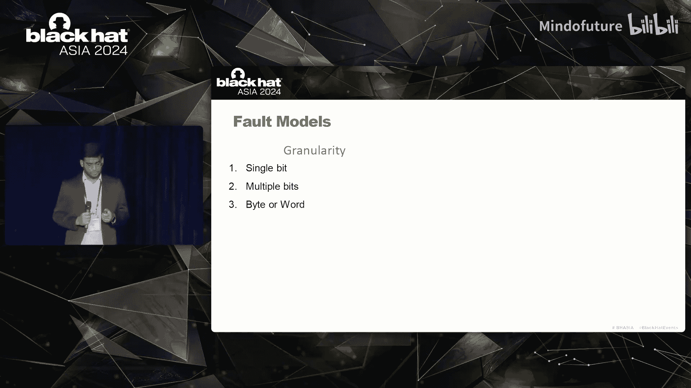
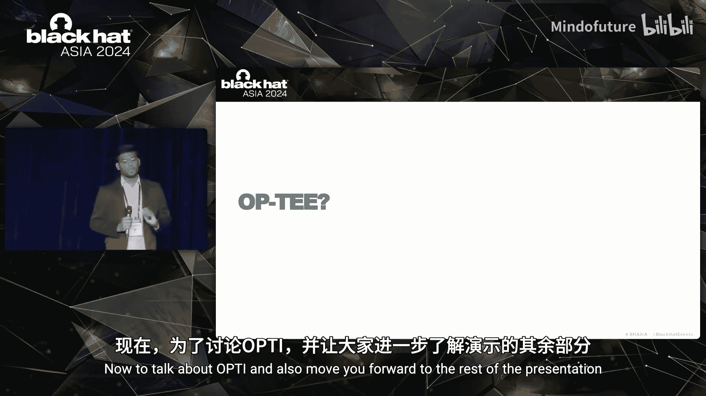
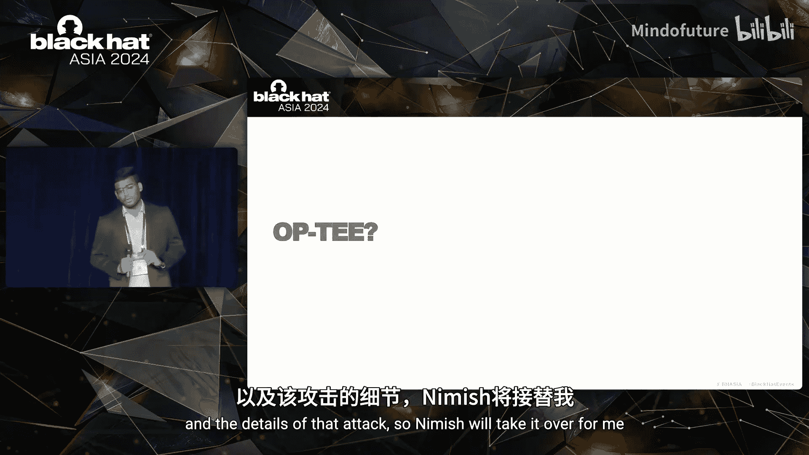
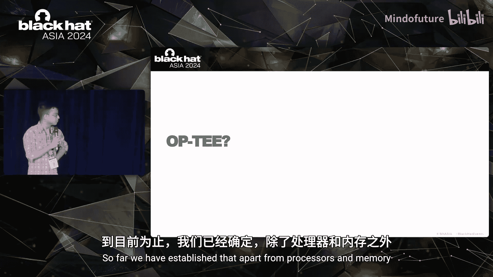
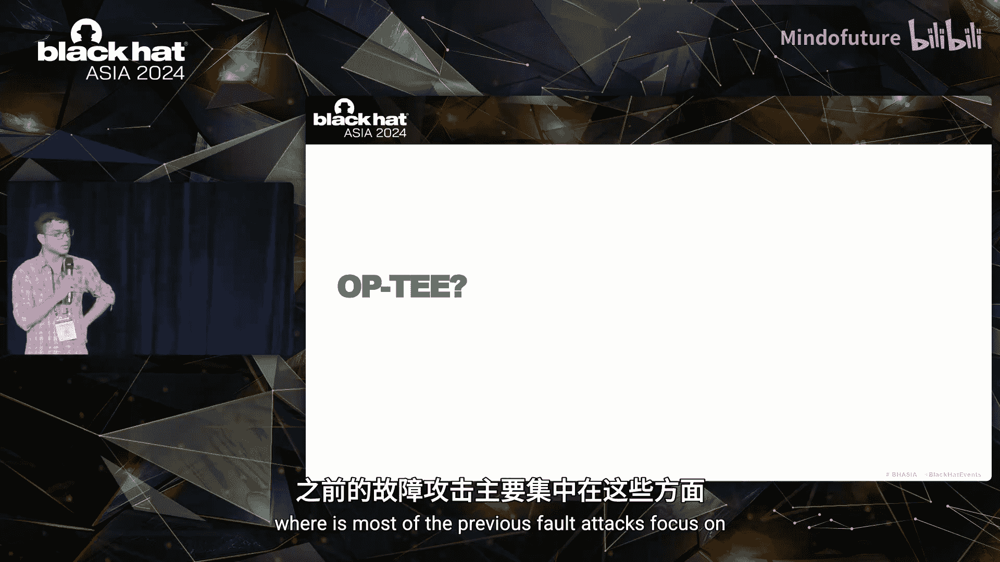

# 011：总线故障攻击与可信执行环境破解

在本教程中，我们将学习一种新颖的硬件故障攻击方法——总线故障攻击。我们将探讨如何利用这种攻击来破坏基于Arm TrustZone技术的可信执行环境（TEE）的安全性，特别是针对OP-TEE实现。课程将从故障攻击的基础知识开始，逐步深入到具体的攻击原理、实施步骤及其安全影响。

## 故障攻击概述

故障是指攻击者主动干扰系统数据、控制流或系统本身，通过引发错误响应来获取信息或访问权限的系统错误。

在数字系统中，故障虽然罕见且通常由意外导致，但如果能被有目的地控制和诱发，这些故障可能导致错误，进而被利用以劫持系统或泄露秘密信息。

故障攻击若与其他攻击原语（如侧信道攻击）结合，可能导致更强大的攻击效果。

## 故障攻击的分类与研究

故障攻击的研究已有约25年历史，文献相当丰富。故障攻击可大致分为两个子类：
*   **故障注入技术**：关注如何在硬件上实际诱发故障。
*   **故障利用或故障分析**：发生在成功注入故障之后，其分析技术取决于攻击目标（例如RSA或AES算法）。

本教程主要聚焦于故障注入技术。

## 传统的故障注入方法

攻击者诱导故障有多种方式，本教程主要关注电磁故障注入。

我们使用一种特殊的探头。当电流沿此探头流动时，会在其周围产生磁场。根据基础的物理电磁学原理，变化的磁场会产生感应电流。如果将这种探头靠近正在执行计算的片上系统或嵌入式系统，感应电流会干扰电路或流经电路的电流，从而可能引发故障。

例如，对于某些计算，在没有电磁脉冲时，执行正常。但在引入电磁脉冲后，其行为可能变得异常，并导致位翻转。

## 故障模型类型

故障模型可根据不同角度进行分类。

从粒度来看，故障可以是单比特翻转、多比特翻转，甚至是整个字（word）的故障。在故障研究领域，传统观点认为要控制整个64位寄存器的故障是困难的，但本项工作实现了对整个64位寄存器的故障注入。

从故障类型来看，可以是固定型故障（某位固定为0或1），也可以是随机位翻转（0变为1或反之），甚至是完全随机的故障。

从攻击者控制能力来看，故障可以是精确的（如使用激光注入）或非精确的（如使用电磁辐射）。

此外，故障还取决于其持续时间，是暂时性的、每次会话刷新，还是持续存在于设备的整个生命周期。

## 传统故障攻击点

观察现有文献中关于片上系统和嵌入式系统的常见故障攻击点，主要集中于两个方面：处理器本身和内存。

从处理器角度看，可以通过外部接口诱发故障，例如改变电压、引入时钟毛刺。从软件层面，可以改变动态电压频率缩放，通过改变频率和电压导致处理器内部竞争条件，从而可能引发故障。

从内存角度看，存在Rowhammer攻击，通过快速访问内存导致因电荷泄漏而引发的位翻转。此外，电磁和激光攻击也可以诱发内存中的位翻转。

然而，从攻击者的视角来看，在片上系统中可能无法利用外部接口。动态电压频率缩放本身是特权操作。对于内存，内存本身有时受到多种错误纠正码的保护，并且其上方可能有封装，这需要侵入性的开盖，而开盖过程可能会损坏芯片。

## 发现新的故障点：系统总线

我们提出了一个问题：是否存在尚未部署已知防护措施的、可利用的架构层面进行故障攻击？

答案是肯定的。我们发现了一个片上系统上的新故障点：**系统总线**。

观察一个商用片上系统（如树莓派3B+），可以看到系统总线本身完全未封装，暴露在印刷电路板表面，可以从PCB顶部直接观察到。这一点很重要，因为它涉及所有加载和存储类指令，内存地址和数据始终在处理器和内存之间流动。

这是我们的实际实验设置，探头被放置在树莓派板旁边。

现在以一个加载指令为例，该指令将数据从内存地址加载到目标寄存器。其工作原理是：首先，处理器将内存地址发送到系统总线上，然后内存将该特定位置的数据发送回处理器。然而，如果在系统总线传输数据时注入故障，内存中的原始数据不受影响，但传输中的数据被故障干扰。因此，虽然注入了故障，但故障本身没有留下痕迹，而使用故障数据进行的计算会受到影响。

由于我们针对的是系统总线，可能产生两种类型的故障：
1.  **数据总线故障**：导致数据不正确。
2.  **地址总线故障**：由于位变化导致访问了不存在的或无权限的内存位置，从而引发段错误。

需要特别注意的一个关键发现是：在**35%** 的情况下，我们实际上得到了寄存器中**全零**的数据故障。这在之前的文献中未曾报道，并且被认为是不可能实现的。

我们称之为**寄存器清零故障模型**，它清空了加载寄存器的整个值。

## 从完整性到安全性：攻击OP-TEE

问题在于，这看起来像是一个完整性问题，数据不正确。但完整性问题如何导致安全事件呢？

我们展示了寄存器清零事件实际上可以导致对开放便携式可信执行环境（OP-TEE）的端到端攻击，从而破坏Arm TrustZone的安全性。

接下来，我们将讨论OP-TEE并详细介绍攻击细节。

## OP-TEE与可信执行环境简介

OP-TEE是一个用于嵌入式系统的可信执行环境，紧密遵循GlobalPlatform API规范，由Linaro维护，并得到谷歌、Arm、恩智浦等众多利益相关方的支持。

与任何可信执行环境一样，它将应用程序划分为两个世界：
*   **普通世界**：运行大多数应用程序和内核。
*   **安全世界**：运行最关键的安全应用程序，例如加密API。

可信执行环境具有某些特性，如内存存储加密、外设安全隔离和安全上下文，以确保即使普通世界被攻击者完全控制，安全世界中运行的内容仍然保持隔离和安全。可信执行环境的核心理念是在普通世界内核被攻破的情况下仍能提供安全性。

需要指出的是，任何在TEE中运行的代码都由原始设备制造商进行编码和加载，并有完整性检查确保用户无法在TEE中运行自己的代码。TEE会暴露其API，用户最多只能在普通世界编写应用程序来调用这些API。

从攻击者的角度来看，如果能够将自己的代码加载到可信执行环境中，就相当于在TEE中实现了代码执行，从而破坏了TrustZone提供的安全保证。

## 攻击目标与约束

我们将攻击目标具体化：
1.  **攻击必须在线进行**：我们不希望设备在任何时间点离线。在现代物联网网络中，存在监控系统确保设备可用性。这意味着我们不能攻击安全启动，因为那会使设备离线，并且相关漏洞已被修补。因此，我们选择攻击TEE中可信应用程序的加载过程。
2.  **需要精确的故障触发时机**：故障攻击需要在执行的特定时刻改变设备的物理环境。通常，人们使用基于代码的触发器来通知何时注入故障。但在我们的案例中，我们想要注入故障的脆弱点深埋在TEE内部，无法注入自己的代码来触发故障。因此，我们提出了一种结合被动信息与主动攻击的组合式攻击者模型，以构建完全非侵入性的故障注入方式。
3.  **攻击必须是非侵入性的**：我们不应给设备造成任何不可逆的损坏（如对处理器进行开盖），这主要是为了规避检测并确保设备不被永久损坏。这意味着像跳过指令这样的简单攻击在我们的场景中无效。而这正是我们之前讨论的新故障模型——在系统总线运行时将寄存器的整个值清零——可以发挥作用的地方。

## OP-TEE中的攻击点

这是我们所处理的可信执行环境的抽象视图。

执行从普通世界的异常级别0开始，通过一系列系统调用，到达最底层的安全监控器层（最高特权层），该层执行安全上下文切换到安全世界侧，然后通过一系列调用返回到左上角，即加载可信应用程序的地方。

当这些可信应用程序需要安全世界侧异常级别1的更多帮助时（例如调用加密库），它们可以再次使用这些API端点。一旦TEE需要完成的任务结束，就可以沿相反路径返回数据到普通世界。这就是两个世界之间的通信方式。

我们的攻击焦点在于可信应用程序的加载过程。如前所述，只有原始设备制造商可以在TEE中运行其代码，因此会执行完整性检查（即签名验证）。如果二进制文件验证成功，则返回零退出码；否则，引发错误并中止执行。

如果我们想将自己的可信应用程序加载到TEE中，就需要设法绕过这个签名验证。像跳过验证或污染执行结果这样的传统故障攻击在树莓派等片上系统上不可用。此外，签名密钥并不存储在设备上，因此不存在窃取密钥并签署自己应用程序的问题。

然而，我们发现，如果签名验证失败，我们之前讨论的故障模型——故障系统总线本身——可以用来将非零值转换为零，从而完全绕过完整性检查。请注意，这不是指令跳过，我们没有跳过检查，而是将非零退出码更改为零。按照标准的Linux惯例，零表示成功。

## 端到端攻击链

攻击过程如下：我们有一个RSA验证函数，其后是一个存储指令，将退出码存储在堆栈上的某个地址。随后，这个相同的地址被加载回w0寄存器，并与立即数零进行比较。如果匹配，则正常继续执行；否则，程序中止。

我们在执行中的这个特定点发起攻击。有时没有效果，有时是部分成功（值改变了但未变为零），但有时我们确实观察到寄存器值w0完全变为零。这使我们能够发起端到端攻击，即通过故障将恶意的TA加载到TEE中。

然后，将原本指向其他TA的通信重定向到我们恶意加载的TA，并进行解密。这意味着系统中任何其他TA的加密通信现在都对攻击者可用。

## 结合侧信道确定故障时机

第一阶段，我们需要确切知道何时注入故障。由于无法在OP-TEE内核中使用任何显式的代码触发器来通知故障注入，我们附加了一套单独的仪器来观察目标嵌入式系统的功耗。

这帮助我们识别RSA签名验证在何时执行。这是示波器的输出结果。

这使我们能够为故障注入提供时机信息。解读如下：顶部第一个信号的第二个峰值是指令执行发生的地方。最后一个信号（第三个信号）是故障注入信号。可以看到第一个信号的第二个峰值与最后一个信号大致对齐，最后一个信号是一系列脉冲串，相当于故障注入。

我们提出，如果使用左侧的功耗侧信道，就可以利用它来通知并对齐我们的故障注入与特定的移动、存储或加载指令。

这是相同的示意图。通过故障注入，我们将一个非零值更改为零，该值随后被加载并用于签名验证的比较，从而使其“成功”，并将恶意TA加载到TrustZone中。

这就是我们讨论的整个组合式攻击者模型：我们同时使用功耗侧信道分析和故障注入将TA加载到系统中。

这导致了我们在TEE中的代码执行，在某种意义上相当于权限提升。

## 利用代码执行破坏通信

现在我们在TEE中有了代码执行能力，我们希望利用它来破坏指向系统中其他TA的通信。具体做法如下：

普通世界如果希望从安全世界获得某些帮助（如加密操作），它会调用一个由UUID唯一标识的特定TA。该TA被加载到TEE中并执行其任务。

OP-TEE和许多其他嵌入式系统TEE所遵循的API规范，将选择TA唯一标识符的责任交给了设备制造商。这里有一个非常重要的假设：回想一下，在TEE中，只有设备制造商可以加载自己的代码。因此，设备制造商自然会选择不会相互冲突的唯一标识符。

因此，当两个TA共享相同标识符时，系统的行为是未定义的。在我们的实验中，我们发现如果确实出现这种情况，**非持久性**的TA会被优先执行，而不是持久性TA（持久性类似于服务器-客户端场景，指在客户端会话结束后是否保留服务器资源）。

我们在这里改变了攻击向量：
1.  从第一个攻击向量，我们将一个TA加载到系统中，使其成为非持久性的。
2.  使其标识符与系统中另一个TA的标识符冲突，从而将指向其他TA的通信重定向到我们自己的TA。

但必须提醒，即使我们已经能够重定向通信，该通信仍然是加密的。因此，现在的问题是如何解密它。

## 解密通信：利用地址故障

存在用于保护此通信的第三方扩展，它们进行对称密钥管理。这些扩展不允许添加调试器或直接读取密钥，也不允许未经授权访问保存密钥的数据页。其工作流程是：当需要密钥时，向扩展发送密钥传输请求，密钥被传输。操作完成后，进行密钥交还，之后应用程序可以继续将加密和签名的通信发送到所需位置。

然而，我们观察到，这种保护**不扩展到段错误**。回想我们讨论的攻击，有时通过总线故障，当被访问的内存地址被错误地故障时，我们能够处理段错误信号。

事实证明，如果在密钥交还之前诱发这种情况，那么在随后的代码中，我们可以实现完整的密钥读取。由于通信通道受对称密钥管理保护，在攻击者控制内核的普通世界侧执行此操作也会危及安全世界侧的密钥。

## 完整攻击链总结

整个攻击由三个步骤串联而成：
1.  **第一步（最左侧）**：利用故障攻击，将自己的TA加载到TEE中，并在其中获得代码执行能力。
2.  **第二步（中间）**：确保已加载TA的标识符与受害者TA的标识符冲突，从而实现通信重定向。
3.  **第三步**：在密钥交还之前诱发段错误，以获取签名密钥、加密和解密密钥。之后，就可以简单地解密通信，如果需要，还可以重新签名并转发。

这就是三个攻击如何链接在一起，破坏了遵循GlobalPlatform API规范的OP-TEE的安全保证。我们发现，任何遵循该规范的可信执行环境同样容易受到此类攻击。

## 影响与应对措施

我们联系了目前维护OP-TEE的Linaro，并获得了CVE编号。我们还与他们合作，在OP-TEE内核中部署了相应的防护措施。

这是联合开发的防护措施的截图。请注意最后一个函数调用，它本质上是一个缓解措施：`set_check_result_not_zero`。

这是针对我们引入的故障模型的响应。其思想是维护一些状态信息，并在错误代码或某些操作结果不应为零时检查其是否非零。这正是我们试图利用的环节。

## 其他影响与启示

关于系统总线故障在嵌入式系统背景下的其他影响：
*   我们还能重新启用针对采用T-table实现的AES算法的攻击。这些攻击自从针对处理器和内存的故障攻击防御出现后，在某种意义上已被阻止。
*   我们还能利用地址总线故障（即段错误攻击，第三个攻击）来破坏后量子密码实现，如已获NIST标准化的Kyber等。尽管算法本身没问题，但在实现时，我们将密钥的所有份额存储在类似C/C++的结构体中。一次故障就能泄露该结构体的所有成员，从而获得所有份额，组合后即可直接泄露密钥。

## 总结与启示

在本节课中，我们一起学习了总线故障攻击的原理与实践，以及如何利用它破坏Arm TrustZone可信执行环境的安全性。

**主要启示如下：**
1.  **系统设计需考虑执行环境**：在设计系统时，不仅要考虑系统本身，还要考虑其伴随的执行环境。这对于本应无需人工监督即可保持安全的嵌入式系统尤为重要，因为物理攻击者、侧信道和故障等攻击向量是真实存在的。
2.  **关注系统总线这一新攻击面**：我们提出的系统总线新故障模型表明，除了处理器和内存，系统总线也是可以被故障攻击的。这一点需要在安全设计中予以考虑。我们在OP-TEE上实现了攻击，这只是TEE规范的一种实现，那么在其他运行于类似嵌入式设备上的系统中，其影响如何？
3.  **API规范需在新型攻击下重新审视**：我们建议，鉴于能够进行侧信道和故障攻击的对手存在，API规范需要被重新思考。我们能够发起第二次攻击，是因为API规范假设只有设备制造商可以将自己的代码加载到TEE中，并将标识符冲突的责任留给了设备制造商。但如果由于此类攻击而使该假设失效，那么基于该假设的任何安全性都将不复存在。

最后，这是我们用于整个工作的实验设置，其能力包括侧信道分析（功耗和电磁）、故障攻击、故障分析，以及一定程度的微架构攻击分析。

**本节课中，我们一起学习了：**
*   故障攻击的基本概念与分类。
*   电磁故障注入的原理。
*   片上系统上传统故障攻击点的局限性。
*   系统总线作为新故障攻击点的发现与寄存器清零故障模型。
*   Arm TrustZone与OP-TEE可信执行环境的基本原理。
*   如何结合侧信道分析确定故障注入时机。
*   利用总线故障绕过TEE完整性检查并加载恶意TA的完整攻击链。
*   通过标识符冲突和段错误攻击实现通信重定向与密钥窃取。
*   该研究的影响、已部署的防护措施以及更广泛的安全启示。

通过学习，我们认识到硬件安全是一个多层次、多方面的领域，需要从芯片设计、系统架构到软件实现进行全方位的考量，以应对日益复杂的物理攻击威胁。