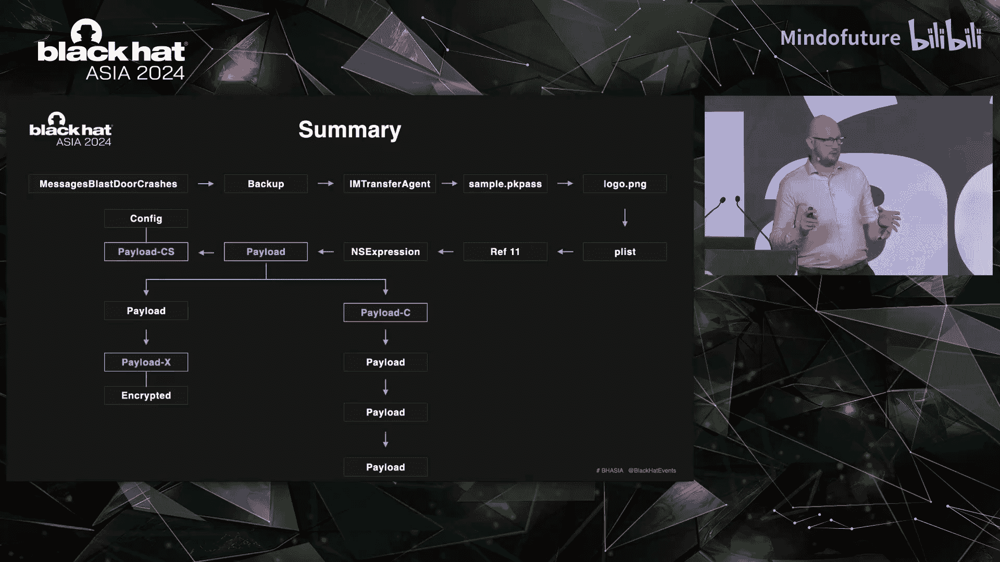

# 012：剖析NSO间谍软件样本

在本教程中，我们将跟随研究员Mattias Friedensstoff在Black Hat Asia 2024上的演讲，学习如何通过取证分析，一步步揭露一个NSO Pegasus间谍软件样本的最终载荷。我们将从崩溃日志入手，逐步分析iMessage附件，最终深入到复杂的NSExpression载荷结构。

## 概述

本节课我们将学习如何对一个疑似被NSO Pegasus间谍软件感染的iOS设备进行取证分析。我们将从获取的崩溃日志、iTunes备份和遥测数据开始，识别可疑活动，定位恶意样本，并逐步剖析其多层嵌套的载荷结构，最终提取出可用于检测的入侵指标。

## 从数据源开始调查

上一节我们介绍了分析背景，本节中我们来看看如何利用现有的数据源开始调查。当客户报告设备可能被入侵时，我们通常会获得以下数据源：
*   **崩溃日志**
*   **iTunes备份**
*   **一些遥测数据**

对于这些数据源，我们使用不同的工具进行分析：
*   对于崩溃日志，通常使用手动脚本，因为目前没有广为人知的现成工具。
*   对于iTunes备份，可以借助由Amnesty International开发的移动验证工具包（Mobile Verification Toolkit, MVT），这是分析iTunes备份是否存在入侵事实上的标准工具。
*   对于遥测数据，同样需要依赖脚本。

## 寻找可疑活动迹象

我们利用这些数据源，本质上是在寻找可疑活动的迹象。以下是一些关键指标：
*   从私有或临时目录启动的进程。
*   进行网络调用的进程。
*   以高权限（如root）运行的进程。
*   写入磁盘的可疑文件。
*   反复崩溃的进程。

调查的第一步通常是快速浏览可用的崩溃日志列表。在本案例中，一个模式非常明显：首先出现了大约25次`homed`进程崩溃，短暂间隔后，又出现了35次`messagesblastor`服务崩溃。

`messagesblastor`服务引起了我们的特别关注，因为Citizen Lab关于BLASTPASS漏洞的报告指出，该服务负责解包和安全渲染iMessage附件。因此，这些崩溃非常可疑，值得深入调查。

## 深入分析崩溃日志

如果我们查看第一次`homed`崩溃，可以看到设备运行的是iOS 16.6，这个版本仍然易受BLASTPASS攻击。当时，我们认为这次崩溃可能不属于这个漏洞利用链，而是另一个名为“PoC homed”的旧漏洞利用链的一部分，该链在iOS 16.1.2之前有效。这似乎表明攻击者最初尝试使用旧漏洞失败后，才切换到了更新的漏洞。

接下来查看`messagesblastor`服务崩溃。其异常类型更为严重，显示为“错误访问”和特定内存地址的“内核保护失败”，这表明确实出了问题。查看崩溃的线程，可以看到从第67行开始，有一个`NSKeyedArchiver`正在解码多个对象，并且这一过程一直持续到第510行。这意味着存在一个非常庞大的归档数据，或者样本本身仍有问题。这同样非常可疑。

我们有一系列在特定时间框架内发生的崩溃，这是进一步分析iTunes备份的完美起点。快速检查该时间点的备份，我们还发现了一个名为`IAmTransferAgent`的进程进行了多次网络调用。这个进程负责下载iMessage附件，这与我们在`messagesblastor`崩溃前有进程下载附件的情况相符。

## 在备份中发现恶意样本

关键问题是：我们能否在数据中看到那个特定的附件？答案是肯定的。我们发现一个`.pkpass`文件被下载了八次。可能是同一个样本，也可能是不同的样本，目前尚不清楚。但我们在三个地方都看到了这个文件的记录，这非常可疑。

那么，这些文件是否真的存在于备份中呢？是的，它们确实存在。至此，我们基本完成了初步的取证分析阶段，因为我们已经找到了一个值得深入研究的特定样本。

## 剖析.pkpass文件

接下来，我们尝试弄清楚这个`.pkpass`文件到底是什么。我们可以求助一个自去年以来一直可用的“专家”——ChatGPT。它告诉我们，`.pkpass`文件本质上是一个ZIP压缩包，包含一些JSON文件。当然，我们总是需要验证。使用`file`命令检查，确认它确实是一个约175KB的ZIP压缩包。

解压后，我们发现了预测中的JSON文件，但还有一个名为`logo.png`的文件格外显眼。这不仅因为它的名字，更因为它有5.8MB之大，对于一个logo来说太大了。再次使用`file`命令检查，发现这个`logo.png`实际上是一个`VP8`文件。这非常有趣，因为它将我们带回了演讲开头提到的VP8漏洞。关于这个漏洞的细节，今天不再赘述，但值得注意的是，即将有演讲会深入探讨此漏洞。

## 分析VP8文件内容

现在，让我们更仔细地查看这个样本。进行二进制分析时，最明显的工具当然是`strings`。但对其运行`strings`命令，只得到一堆`A`字符，这没什么帮助。也许我们应该从文件开头看起。在文件开头的字符串中，有两样东西立刻引起了我的注意：一个是嵌入在这个文件中的**二进制属性列表**，另一个是底部的一系列`functionfunctionfunction`字符串。此外，还有一些像`NSClass`、`dlopen`、`memcpy`这样的字符串，这些是你绝不会在PNG或VP8文件中期望看到的内容。

显然，我们需要进一步调查。在这个阶段，我有多种选择，可以深入研究VP8漏洞的构造，但我更感兴趣的是找到NSExpression并处理那个二进制属性列表文件。

## 提取并解析二进制属性列表

让我们提取这个二进制属性列表文件。经过一些尝试和错误，我成功地用`dd`命令将其提取出来。那么，什么是二进制属性列表，我们如何读取它？ChatGPT再次提供了很好的帮助，我们也有合适的工具。首先使用`plutil -p`命令查看。从文件开头开始，我们再次看到大量`A`字符。翻到底部，可以看到这个特定的属性列表有大约13000个条目，这对分析没有直接帮助。

使用`plistlib`查看，可以看到属性列表中包含一些字典和错误对象，但也有大量不可打印的数据。文件底部还有更多此类数据。这仍然没有帮助我们理解内容。

我们需要更好地理解它。二进制属性列表通常是一种称为`NSKeyedArchiver`的序列化格式，这在iOS和macOS中非常常用。在`NSKeyedArchiver`中，总是从一个根对象开始，根对象下方依次排列着一系列对象。这些对象可以是数组、字典、整数、字符串或任何其他复杂的对象结构。这些对象本身又可以包含其他数组、字典或对象，但所有对象本质上都回引到我们第一行中的那些顶层对象。

## 使用Python解析归档结构

这使得我们的分析变得简单，因为我们只需要关心那些顶层对象。是时候施展一些Python魔法了。我们本质上需要做的是：导入处理`NSKeyedArchiver`的库，读取并理解它，设置断点，然后用我们的顶层键替换数组和字典对象，并不再递归遍历文件。最后，打印结果。

这样做之后，我们得到的是一个看起来像这样的结构。我们可以看到一系列对象。翻到最后，我们已经看到对象引用到了63，所以我们只剩下264个需要分析的独立对象，之后我们就可以理清结构了。

## 识别关键载荷对象

让我们看看其中一些对象。第一个特别令人感兴趣的是对象引用8。它以引用9开始，然后有大量重复的引用10，接着是15次对象引用11，然后是10、11、10、11，最后以0结尾。所以，11似乎很重要，让我们仔细看看。

在对象11内部，我们实际上再次看到了我们的NSExpression字符串`functionfunctionfunctionfunction`。很好，这基本上就是我们的最终载荷。

查看其他一些有趣的对象，我们可以看到另一个对象引用包含大量`A`字符，还有一个包含少一些但依然很多的`A`字符。这很有趣，因为在所有基础的漏洞利用课程中，当你试图利用缓冲区溢出时，你会用`A`字符填充，直到你知道可以控制栈指针或返回指针，从而知道自己在内存中的位置。所以，看起来构建这个漏洞的NSO人员仍然在使用这种原始的方法。他们本可以使用任何随机字符串，却仍然用了`A`。因此，如果你解包样本并查找15、20、25甚至250个连续的`A`，就可能检测到这个样本。而且，很可能在未来的武器化漏洞利用中，我们还会看到这种情况。

对象引用259也包含了同样的载荷。总结一下，我们的载荷11被对象8和259使用了两次，而259又被242引用，然后回引到顶层。太好了，现在我们只需要关注对象11。

## 检查载荷结构

让我们检查这个载荷。载荷本身是有结构的，我在这里简化一下。它的结构是：开头有一些二进制数据（几个字节），然后是一些字节，接着是我们已经看到的嵌入字符串，后面是NSExpression，再之后是一些字节和一些字符串，最后以大量空字节结尾。然后，后半部分完全重复前半部分。

当然，剩下的问题是：所有这些部分实际上是做什么的？我在这里再次聚焦于NSExpression。

## 理解NSExpression

我们已经揭露了载荷直到特定示例，当然我们可以走不同的分支，我选择了只查看NSExpression的分支。但NSExpression本身是什么？查看苹果的文档，可以看到苹果将其设计为一种函数，允许你过滤数组、搜索或排序。更广泛的类别称为`NSPredicate`，这些谓词可以包含NSExpression，允许你执行特定的逻辑操作。本质上，你有一个函数调用，然后有一个接收器、一个选择器名称和一个参数。例如，你可以有一个字符串`developer/tools/test`，然后有一个名为`lastPathComponent`的选择器，这应该解析为`test`，即该字符串的最后一个路径组件。NSExpression基本上就是这样构建的。

查看这个载荷的结构（抱歉这部分内容较小），我们可以看到一些强制转换，转换为`NSThread`和`NSRunLoop`类。然后有一些对字典的引用，其中存储了载荷的不同部分，我称它们为`payload_cs`、`payload_c`和`payload_x`，因为它们存储在字典的键`cs`、`c`和`x`中。在最底部，有一个更大的载荷，这是最先执行的。

但我们需要回答第一个问题：为什么这仍然是可能的？在iOS 15.1中，苹果引入了一个缓解措施，本应阻止任何此类对像`NSThread`这样的类进行强制转换并执行。Ian Beer在一次关于NSExpression的演讲中介绍过，这些缓解措施仅通过内存中设置为`false`的特定标志实现。这意味着，如果NSO找到了通过内存破坏在内存中将此标志设置回`true`的方法，他们就可以再次执行这些类。不过，我还没有在这个漏洞样本中找到任何具体的证据。正如我所说，我没有深入研究具体的破坏细节。

## 分析第一段可执行载荷

让我们回到正题，讨论这个最先执行的载荷，并更详细地查看它。我们在这里看到的结构是，这本质上是一个很大的Base64编码字符串。为什么不天真地尝试解码它呢？但这行不通。为什么？因为我忽略了样本使用了一些压缩方法。所以我们需要先进行解压缩，并理解其工作原理，然后才能实际解码它。

让我们再次求助我们的“专家”。我们已经用它处理了几件事，为什么不再次尝试用NSExpression呢？有趣的是，因为大语言模型非常擅长将语言翻译成其他结构化语言，这是一个很好的机会来测试它们是否真的能将NSExpression转换回Objective-C代码。我基本上剪切了载荷，将NSExpression放入ChatGPT，并要求它进行转换。是的，它的第一次响应就相当不错，虽然不是完美的。唯一剩下的问题是：它有效吗？是的，有效。

## 处理嵌套的压缩载荷

查看这个解压缩后的字符串，我们得到的是另一个非常庞大的NSExpression。它太大了，以至于直接阅读并不容易。所以，是时候再次施展一些Python魔法了。这样做之后，我们得到了一个格式良好的NSExpression，可以开始逐步分析。这个表达式实际上有2530行格式化代码。这将很有趣。

让我们看看这里的前几行。这个NSExpression首先做的几件事之一是加载另一个框架，它加载的是`OfficeImport`框架。这个框架包含一个非常特殊的对象，叫做`OCCMapper`。这个`OCCMapper`有一个很好的功能，因为它总是为当前线程提供一个映射。这意味着，如果你仍在同一个线程中执行，这个对象将始终相同。如果你想在NSExpression中存储某些东西并使用变量，这非常完美。NSExpression本身不允许你使用任何变量进行计算，但如果你有一个可以随时引用的字典，你可以将某些东西作为键存储在其中，然后取回它，并对其进行计算。我们将在特定的NSExpression的每个部分看到这一点。

你可以在最底部看到存储值，并且可以看到这在接下来的几行中被再次用于计算，以便能够进行加法或减法运算。它们将使用一些被称为“算术实用程序”的东西，允许进行一些非常基础的计算。紧接着在接下来的几行中，我们已经可以看到它们开始解码我们在第一张幻灯片上看到的一些其他载荷。

这个似乎又是一个Base64编码的字符串。然后它们将其存储在字典的另一个变量中。之后，它们使用属性列表反序列化来获取解包的部分。好的，所以这也意味着`payload_cs`是一个属性列表。这很有趣。让我们再次尝试解码它。但这没有成功。我们忘了些什么。

如果你回头看整体的结构，在`payload_cs`之后，我们可以看到这个载荷是Base64解码的，但它也有一种叫做“cutdi”压缩的东西，然后再次使用一些“AAF”Base64解码。我不知道这是什么。那么，什么是“AAF”Base64编码数据？这次我没有求助于ChatGPT，而是想看看Google是否知道任何相关信息。它们不知道。第二次尝试，关于“cut”解压缩数据呢？也许我们这次更幸运一些，我们确实是。

我们已经可以看到GitHub上Core Foundation框架中有一个特定的头文件。好的，这很好。为什么我们不再次尝试这个，并在GitHub上也搜索一下“AAF”Base64解码数据呢？如果我们这样做，会得到更多结果，这些结果再次指向另一个被使用的框架。

在这一点上，我本可以让我的生活轻松得多，因为想想看：特定的NSExpression是在一个进程中执行的。这意味着特定的NSExpression只能执行该进程中可用的函数。所以，如果我直接获取`messagesblastor`服务进程样本，并查看所有可能加载到其中的库，我本可以很容易地找到可能存在此功能的潜在库之一，并直接检查它们。

但是，如果有困难的路可走，为什么要走简单的路呢？现在，让我们导入这些框架，然后再试一次。然后我们得到了二进制属性列表，已经可以看到里面有一些文本，这很好。然后我们可以非常仔细地查看特定的属性列表文件。如果我们进行属性列表反序列化，我们会得到一个结构良好的字典，实际上可以看到里面有iPhone型号、一些引用，以及一些带有整数值的变量。这些整数值看起来像是用于计算或可能是内存偏移量。

这里一些有趣的事情是，没有任何对iPad的引用。所以，要么这个漏洞利用根本不适用于iPad，要么它们有一个完全不同的漏洞利用。而且它只在iOS 16.4.1到16.6之间有效，所以任何更新的版本实际上都不在这个配置文件中。这很好。

## 继续剖析其他载荷

现在，我们已经完成了两个载荷的分析，还有两个要进行。让我们寻找`payload_c`。我们可以看到`payload_c`在我们初始载荷的第99到115行被提及。它使用了一种稍微不同的压缩格式，并且再次使用了属性列表序列化。所以这应该很容易解码。我们还可以在开头的整体结构中看到，它使用了与之前样本载荷相同的“AAF”和“cut”解压缩方法。

如果我们解码这个，会得到另一个属性列表。这个属性列表包含另一个NSExpression。而这个NSExpression内部有另一个载荷，它位于`payload_c`内部。好的，所以我们有一个压缩载荷，它位于压缩载荷`payload_c`内部。如果我们解压缩这个位于压缩载荷`payload_c`内部的压缩载荷，我们会进入位于压缩载荷内部的压缩载荷，而这个压缩载荷又位于压缩载荷`payload_c`内部。如果我们再做一次，我们会进入位于压缩载荷内部的压缩载荷，而这个压缩载荷又位于压缩载荷内部，依此类推，最终位于`payload_c`内部。但实际上它停止了。在我们解压缩最后一个之后，我们实际上到达了一个非常深的层级，只剩下一个NSExpression。

三个完成了，还有一个。但是，无论在载荷中，还是在`payload_c`及其后续载荷中，都没有提到`payload_x`。我们可能忘了什么。我们忘记的是，在我们的初始载荷文件的最后，最底部还有另一个载荷。压缩格式是我们已经知道的，所以我们只是有更多的载荷要处理，但希望这个能简单一点。确实，如果我们解压缩这个，我们只得到一个结构良好的NSExpression。我们可以看到在它的最底部提到了`payload_x`。

很好，这很完美。但不幸的是，一点也不。因为这个特定的载荷是AES加密的，尽管字典中有一个变量作为密钥条目，但如果你尝试在整个NSExpression中跟踪这个变量，我们没有看到任何明确的密钥，所以密钥没有以明文形式出现。可能密钥在这个整个载荷的其他地方，或者密钥是从互联网下载的，我目前还不知道。

## 分析总结与入侵指标

这使我们到达了一个阶段，我们已经完成了一部分载荷分析，但到达了一个无法进一步推进的点。NSO给我们设置了路障。这是结束吗？也许。因为这个特定样本还有更多内容有待发现。我们仍然有`homed`崩溃，我最初的假设是这是另一个漏洞利用链。但Amnesty International在对该样本的取证调查中也发现了一个呼叫邀请，所以也许这是漏洞链的第一部分。我们还有一些其他事情没有完全弄清楚。那么，NSExpression绕过在哪里？是否有另一个沙箱逃逸？所有这些中是否有持久化绕过？我们加密的结构真的是植入程序吗？或者是否有我们尚未发现的命令与控制结构的任何其他提及？

我可以告诉你的是，这个样本的故事还没有结束，而且将继续下去。

让我们总结一下今天所做的工作。我们从一系列`messagesblastor`服务崩溃开始。这些引导我们调查备份。在备份中，我们发现在这个特定时间点，有一个`IAmTransferAgent`进程正在下载一些iMessage附件，这些附件是`.pkpass`文件样本。

我们调查了`.pkpass`文件样本，发现`logo.png`实际上是一个VP8文件，而不是PNG文件。这个文件包含一个二进制属性列表，而这个二进制属性列表在解归档后，包含一个对象引用11，其中包含一个NSExpression。这个NSExpression又包含几个不同的载荷。在第一个载荷中，我们有一个对`payload_cs`的引用，其中包含一个配置文件。还有另一个对`payload_c`的引用，其中包含另一个后续载荷，我们已经将其解压缩。然后它包含另一个载荷，而这个载荷最终包含对`payload_x`的引用，也就是我们加密的样本。

这已经是一个很好的起点。当然，分析还没有完成。但好处是，我们现在有几个非常有趣的样本点，可以基于此提取一些入侵指标。

以下是基于此分析的一些入侵指标：
*   **重复的`messagesblastor`服务崩溃**：绝对是一个有趣的迹象，非常可疑。虽然不是针对该样本的明确入侵指标，但总是值得调查。
*   **特定的`.pkpass`文件样本**：绝对是你可以用MVT轻松检查并自动告警的入侵指标。
*   **文件扩展名与实际类型不匹配**：攻击者多次使用文件扩展名，但实际文件类型并不匹配。同样，这不是一个完美的指标，但却是调查的良好起点。
*   **属性列表中的连续`A`字符**：如果你查看属性列表内部，你会看到所有这些`A`字符。这也是一个非常清晰的指标。因此，即使只是查找这些`A`字符，也可能是进一步调查此特定文件的好起点。
*   **`functionfunctionfunctionfunction`字符串**：如果你发现一个应该是图片的iMessage附件，其中包含一系列名为`functionfunctionfunctionfunction`的字符串，这很可能是恶意的。我还没有见过一个这种情况不是真实的案例。
*   **明文字符串载荷**：当然，我们也看到了这些特定的载荷，它们在样本中也非常明显且是明文，甚至只需对样本运行`strings`命令就能看到，这些都是非常清晰的入侵指标。

## 结论与思考

本节课中我们一起学习了如何通过取证分析逐步揭露一个复杂的iOS间谍软件样本。我想让你们记住的是：
1.  **iOS取证调查是有效的**，但我们需要更大规模地进行。我们对特定示例进行的取证调查太少，这对攻击者有利。
2.  **漏洞缓解措施可能被绕过**：例如iOS 15.1中的缓解措施，只是被更多的漏洞绕过。我不完全确定这种方法是否总是应对雇佣间谍软件特定问题的最佳方案。
3.  **攻击模式可能被重用**：间谍软件供应商倾向于重复使用非常复杂的漏洞利用框架。开发这些框架的前期成本很高，但如果你能随着时间的推移重复使用它们，这使整个漏洞利用过程对他们来说容易得多，但对我们防御者来说也更好。因为如果我们能再次发现相同的行为模式，例如，如果我们只是搜索iMessage附件中的每个NSExpression，我们就有了一个非常好的分析起点。

---

**附：问答环节摘要**

*   **样本是否成功执行？** 无法确定。尝试在自有设备上执行样本，观察到至少导致了一些类似的崩溃，也观察到设备上的一些行为，但由于可能错过了为NSExpression正确设置环境的第一阶段漏洞利用，因此无法确定样本是否正确执行。
*   **解压缩这些NSExpression花了多长时间？** 第一个障碍是“cut”解压缩，花了好几天才弄清楚。然后可能花了整整两到三周来初步理解这个样本。之后不得不停止，但调查仍在继续。
*   **是否需要开发自动化分析工具？** 绝对需要。已经开始自己做一些工作，也许是时候发布其中一些，并尝试以更通用的方法进行。也知道Ian Beer可能已经做了类似工作，或许可以联系他看是否能公开此类工具或开源。
*   **触发NSExpression执行的机制是什么？** 这仍然是一个悬而未决的问题，但非常希望Ian在即将到来的演讲中披露更多相关信息。
*   **为何需要如此多层压缩和编码？** 原因尚不清楚。可能是在每一层级链式组合不同的组件，构建一个漏洞利用框架；或者它们只是想增加漏洞研究人员的分析难度。看起来这是一个非常模块化的方法，有加载配置文件的阶段，检查配置是否存在的阶段，以及加载额外加密载荷的阶段。还观察到它们甚至与其他进程进行XPC通信，尽管尚未完全弄清楚。