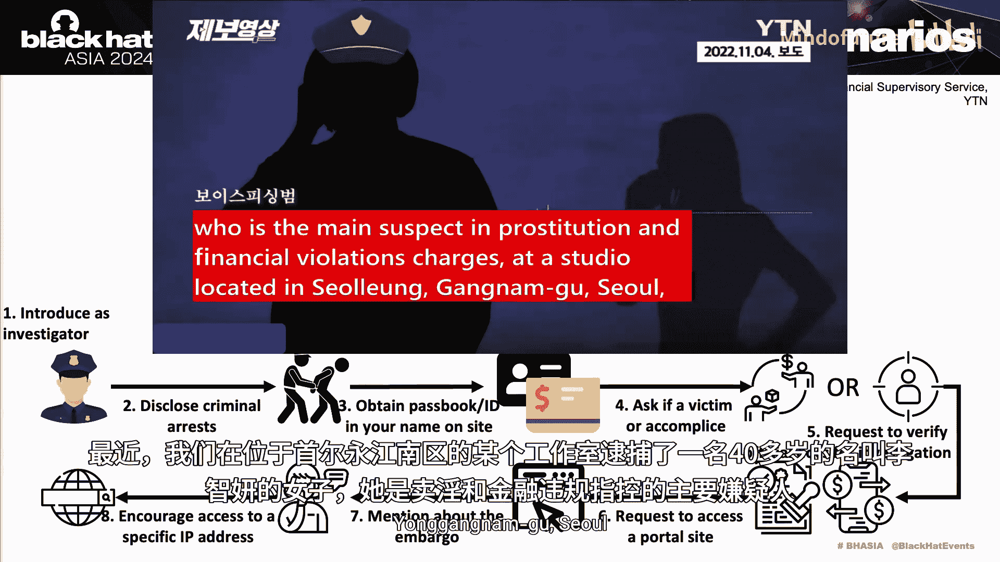
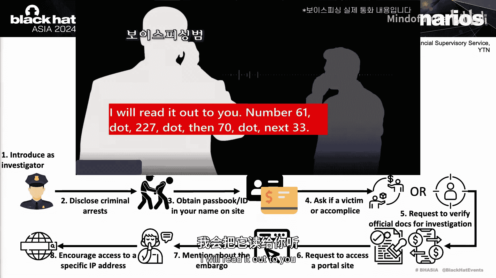

# 013：揭秘“秘密通话”恶意应用

在本教程中，我们将深入探讨语音钓鱼犯罪团伙的运作模式，并重点分析一个名为“秘密通话”的恶意应用程序。我们将了解其技术细节、攻击流程以及如何进行分析。

## 概述

语音钓鱼是一种通过电话进行的金融诈骗。攻击者冒充官方机构，诱导受害者转账或泄露敏感信息。自2006年在韩国首次出现以来，这类犯罪持续发生，并随着技术发展不断演变。本节课，我们将聚焦于犯罪团伙使用的恶意应用“秘密通话”，并学习如何分析此类威胁。

## 语音钓鱼现状与团伙结构

上一节我们介绍了语音钓鱼的基本概念。本节中，我们来看看其在韩国的现状以及犯罪团伙的组织结构。

根据统计数据，2019年语音钓鱼造成的损失和受害者数量达到峰值，随后因新冠疫情对线下聚集的打击以及执法部门的积极调查而显著下降。然而，在疫情结束后，去年损失金额再次上升。受害者数量减少而总损失金额增加，意味着**人均损失金额**上升了。这表明，犯罪团伙正通过各种手段（例如诱导受害者申请额外贷款）从每个受害者身上榨取最大利益。

在韩国，语音钓鱼主要分为三类：
*   **即时通讯钓鱼**：通过即时通讯软件发起诈骗。
*   **还款贷款诈骗**：诱导受害者申请所谓的“政府支持贷款”并支付手续费。
*   **机构冒充诈骗**：冒充执法或监管机构，完全控制受害者的心理。

其中，机构冒充类攻击呈上升趋势，因为冒充执法者能让攻击者完全掌控受害者。

语音钓鱼团伙的结构比想象中更复杂。头目通常身处海外，其下有在韩国境内运作的独立分支。以2022年被捕的“Miningjas”团伙为例，其结构包括：
*   **呼叫中心**：负责拨打诈骗电话的一线人员。
*   **行政部门**：负责招募和管理人员。
*   **提款组**：负责从目标账户提取赃款。
*   **换钱组**：负责管理银行账户，并将赃款洗白为礼品卡、奢侈品或游戏币等。

此外，这些团伙可能与外部团队合作，例如：
*   **IT部门/SIMBOX运营商**：负责将国际号码转换为韩国本地号码。
*   **信息获取团队**：负责从数据库获取个人信息。
*   **恶意软件开发团队**：负责开发恶意应用和构建网络电话系统。

## 攻击场景与流程分析

了解了团伙结构后，我们来看看他们具体的攻击手法。以下是几种常见的攻击场景，均以发送钓鱼短信或直接拨打电话开始。

**机构冒充诈骗流程**：
1.  首先，发送伪装成官方机构的短信，附带所谓的“案件文件”，要求受害者联系指定号码。
2.  受害者上钩后，呼叫中心人员开始执行攻击剧本。他们可能冒充警察或检察官，声称受害者的账户涉及犯罪，必须配合调查，否则将面临后果。
3.  为增加可信度，他们会使用伪造的、看起来像官方文件的页面向受害者施压。
4.  最终，以“调查保证金”或“资金保护”等名义勒索现金。

**还款贷款诈骗流程**：
1.  诱导受害者申请虚假的“政府支持贷款”。
2.  随后以各种名义（如手续费、违约金）要求受害者支付费用。

下面的演示展示了一个冒充警察的诈骗电话流程（原为韩语，已用AI转为英文）：
> **诈骗者**：是的，您是XX先生吗？
> **受害者**：是的。
> **诈骗者**：谢谢。我是Gzio警察局侦查科的Hunzhuhan警官。我联系您是关于一起违反《金融交易法》案件的证人询问。您能和我聊一会儿吗？
> **受害者**：好的，请讲。
> **诈骗者**：最近，我们在首尔江南区的一个工作室逮捕了一名40多岁的女性李智Y，她是卖淫和金融违规指控的主要嫌疑人。我想知道您是否认识她。
> ...
> **诈骗者**：在调查过程中，我会向您展示以您名义签发的任何官方文件或所使用的银行账户交易记录。您现在能通过手机查看吗？
> **受害者**：可以。
> **诈骗者**：您知道Naver搜索栏旁边的地址栏吗？请删除里面的所有内容，包括“www”。您听说过“禁运”这个词吗？就像出版禁令？在检察官办公室，我们通常将正在进行的调查称为“禁运”。由于担心同伙逃跑或隐藏犯罪资金，此案也在调查中。因此，我将使用检察官办公室的内部IP通知您。我念给您听：61.227.70.33...

对于不熟悉此类骗局的人来说，攻击者的说辞非常具有迷惑性和胁迫性。

## 恶意基础设施与钓鱼网站

攻击的成功离不开背后的技术支持。本节我们探讨语音钓鱼攻击所使用的基础设施。

恶意基础设施通常由专门的“供应商”提供。犯罪团伙向这些供应商付费以获取钓鱼网站，并获得一个管理面板来控制被恶意应用感染的设备。

我们以冒充“Supreme Prosecutor‘s Office”（韩国大检察厅）的供应商为例。他们建立了与真实网站几乎一模一样的钓鱼网站，目的是诱骗受害者访问，并将其重定向到一个虚假的“案件查询页面”，让受害者相信正在进行真实的调查。

这些网站是攻击场景的一部分。每个供应商分发自己带有呼叫转移功能的恶意应用。我们识别出三个主要供应商（A、B、C），它们有以下特点：

*   **供应商A**：冒充大检察厅和地区检察厅。其钓鱼网站使用的IP大多属于AS3462。他们分发“秘密通话”家族恶意软件。
*   **供应商B**：冒充首尔地区检察厅。基础设施也多属于AS3462，分发“Sincero”家族恶意软件。
*   **供应商C**：与其他不同，其基础设施多属于AS133199。使用大检察厅主题，分发“Micro”家族恶意软件。

受害者在其钓鱼网站输入个人信息后，会看到伪造的官方文件。即使使用的是旧版公章，只要文件中提及案件编号、受害者姓名和事件的严重性，就足以让受害者感到恐慌。供应商B和C还会展示伪造的银行对账单，其中包含受害者无法识别的随机交易记录，以进一步施加压力。供应商B甚至展示“保密协议”文件，防止受害者向他人透露情况。

讽刺的是，这些供应商曾有分发伪装成“语音钓鱼检测应用”（如“警察网络杯”、“钓鱼冰”等）的恶意软件的历史。这些应用看起来与真正的警方防诈骗页面非常相似，却被攻击者逆向利用于诈骗场景中。

## “秘密通话”恶意应用深度分析

以上我们了解了攻击的整体框架和基础设施。现在，我们将由Yong Jiexin为您深入分析犯罪团伙的核心工具——“秘密通话”恶意应用家族。

根据2019年的统计数据，使用恶意APK的金融诈骗活动造成的损失是未使用APK的活动的10倍。这凸显了语音钓鱼团伙对恶意应用的依赖。

在钓鱼活动中使用恶意应用主要有以下原因：
*   **控制手机**：获取手机内存储的照片和个人信息。
*   **监控受害者**：实时监控受害者。
*   **呼叫转移**：将受害者的来电重定向到诈骗呼叫中心，以实现完全的心理控制。

然而，“秘密通话”拥有比典型语音钓鱼应用更高级的功能。

以下是“秘密通话”的显著特征，它们采用各种方法威胁用户或防止其应用被分析：

**1. 反分析技巧**
“秘密通话”的APK文件格式被特殊修改以阻碍分析。
*   **批量压缩**：操纵压缩方法字段，使其超出典型值8。
*   **时间戳操纵**：将时间戳设置为超出正常范围的值，导致某些分析或压缩程序无法处理。
解决方法是通过手动修改值或使用开源工具来修复文件头。

**2. 双层结构**
“秘密通话”包含两层结构：外部加载器和内部核心。我们称之为`Loader`和`Cyclical`。恶意代码位于`Cyclical`内。所有样本都包含加密的类文件以执行恶意活动，以及用于网络钓鱼的资源文件。
其文件结构主要有三种类型：
*   类型一：`Cyclical`扩展名为`.apk`，钓鱼资源被压缩并需要密码（密码是韩语脏话）解压。
*   类型二：`Cyclical`是加密的`.dex`文件，钓鱼资源是加密的`.zip`文件，密码相同。
*   类型三：两者都是原始数据，`Cyclical`以APK形式存在，钓鱼资源在资源区域。

**3. 加密与通信**
*   **加密类文件**：类文件使用AES算法加密，密钥和初始化向量会定期更改。
*   **网络协议**：使用WebSocket和HTTP与C&C服务器通信。请求体包含感染设备状态，并由一个`FID`字段指示请求类型。
*   **请求前缀与路径**：发送数据前有唯一前缀（目前是`A`+时间戳）。C&C服务器的端点路径由请求类型决定，路径最长5个字符，由字母数字混合组成。

**4. 恶意功能**
收到C&C服务器的配置后，“秘密通话”可以执行多种恶意活动：
*   **呼叫转移/拦截**：根据号码列表转移或拦截来电。
*   **伪造来电显示**：当用户使用受感染设备拨打合法电话时，该通话会被取消，并立即向攻击者发起一个新呼叫。用户看到的是伪造的、与原通话相似的界面，但实际上背景中正在接通诈骗呼叫中心。
*   **备用C&C机制**：如果无法连接主C&C服务器，它会尝试从特定的Reddit资料页获取备份配置。
*   **Firebase命令控制**：通常使用Firebase接收来自C&C的命令，触发数据窃取、更改C&C端点等活动。
*   **实时监控**：利用名为`Jung`的商业服务（一种视频音频流软件），攻击者可以实时流式传输受感染设备的摄像头和音频内容，完全暴露受害者隐私。我们发现了攻击者定制的利用`Jung`的监控程序。

## 自动化分析与研究成果

面对海量的“秘密通话”样本，手动分析变得不切实际。我们收集了超过64，000个样本，并将其分为15个以上类别，其中超过50%伪装成执法机构应用，超过20%伪装成银行等金融机构应用。

为了高效分析，我们开发了基于Python的自动化流程。该流程模拟“秘密通话”家族的行为，自动提取以下关键信息：
1.  **静态信息**：如二进制模式、Reddit资料页、原生库、C&C订阅源、电话号码等。
2.  **动态交互**：通过模拟与C&C服务器的通信（我们称之为“通信器”过程）来获取恶意配置。

通过自动化分析，我们实现了：
*   **分析覆盖率**：自动化分析了超过99%的“秘密通话”样本。
*   **基础设施发现**：发现了130多个C&C服务器，大部分位于香港和日本，其他多在亚洲。
*   **资源追踪**：获取了25个以上的Reddit资料页，使我们能持续发现新的C&C服务器。
*   **号码分析**：获得了诈骗团伙使用的电话号码列表，大部分是韩国号码，部分是中国联通号码，暗示攻击者可能与中国有关联。

我们的关键结论是：攻击者主要在韩国活动，但其根源可能在东亚地区。通过持续的研究和自动化追踪，我们旨在消除这些钓鱼活动，并通过信息披露提高公众意识。

## 总结

在本节课中，我们一起学习了：
1.  语音钓鱼在韩国的现状、团伙的复杂组织结构以及主要的攻击场景（如机构冒充和还款贷款诈骗）。
2.  支持这些攻击的恶意基础设施和钓鱼网站如何运作，以及不同的供应商如何提供定制化的恶意服务。
3.  核心恶意应用“秘密通话”的技术细节，包括其反分析技术、双层结构、通信机制以及强大的恶意功能（如呼叫转移和实时监控）。
4.  如何利用自动化分析工具应对海量恶意样本，并从中提取关键威胁情报以追踪犯罪基础设施。

通过理解攻击者的工具和方法，我们可以更好地防御和识别此类复杂的语音钓鱼威胁。