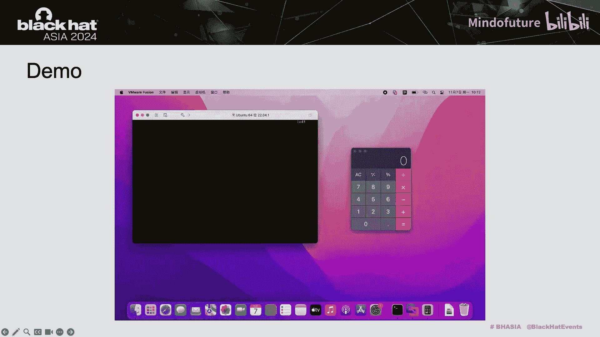
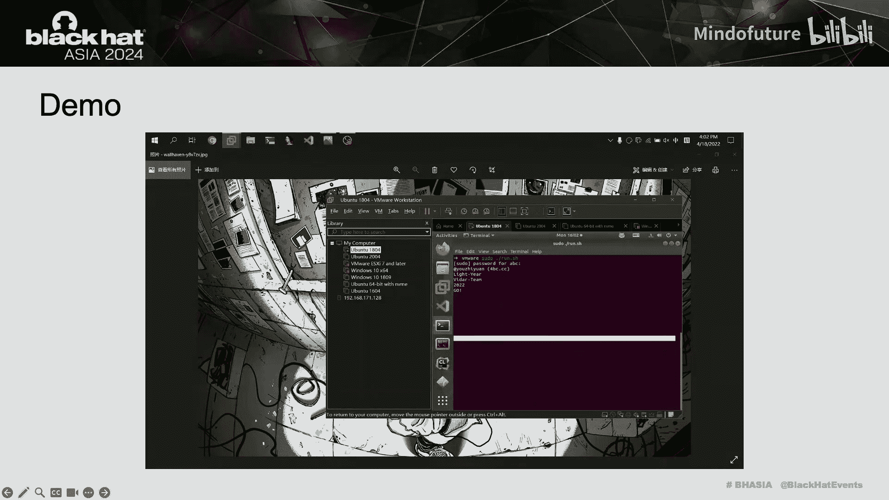

# 014：URB Excalibur - 全新的全平台VMware虚拟机逃逸

## 概述
在本节课中，我们将学习关于VMware虚拟机逃逸的深入技术，特别是围绕URB（USB请求块）对象发现的新漏洞和利用原语。我们将从虚拟机逃逸的基本概念讲起，逐步深入到漏洞发现、利用原语构建以及跨平台（Fusion、Workstation、ESXi）的完整利用链开发。

---

## 第一部分：虚拟机逃逸与VMware架构简介

上一节我们介绍了课程概述，本节中我们来看看什么是虚拟机逃逸以及VMware Hypervisor的基本架构。

**虚拟机逃逸**是指攻击者利用Hypervisor（虚拟机监控器）中的漏洞，从虚拟机内部发起攻击，突破虚拟化隔离并控制宿主机。对于一个云平台而言，一台宿主机可能运行大量虚拟机和服务，因此虚拟机逃逸是云环境中最具灾难性的威胁之一。

下图源自VMware多年前发布的一篇论文，展示了VMware Hypervisor的三个主要组成部分：
*   **VMX**： 运行在宿主机用户态，负责大部分虚拟设备模拟。
*   **VMM**： 运行在宿主机内核态，负责CPU和内存的虚拟化。
*   **VMM驱动**： 辅助组件。

对于我们关注的虚拟设备，其代码主要存在于VMX和VMM中，大部分在VMX里。

以下是VMware Hypervisor的主要攻击面列表，其中几乎所有模块在过去都曾出现过漏洞，甚至导致虚拟机逃逸。

| 模块/组件 | 描述 |
| :--- | :--- |
| **SVGA** | 虚拟显卡设备 |
| **E1000** | 虚拟网卡设备 |
| **EHCI** | USB 2.0控制器 |
| **XHCI** | USB 3.0控制器 |
| **PVSCSI** | 准虚拟化SCSI控制器 |
| **VMCI** | 虚拟机通信接口 |

右侧列出了自2021年至今所有公开披露的VMware虚拟机逃逸案例（不包括今年Pwn2Own上完成的）。可以看出，近年来安全研究者的焦点主要集中在USB相关的攻击面上。

---

## 第二部分：漏洞发现之旅

在分析了VMware的架构、攻击面和历史漏洞后，我们选择了一个有趣且潜在风险较高的攻击面进行深入研究：**EHCI（增强型主机控制器接口）控制器**。

为了开始对VMware Hypervisor进行逆向工程，我们需要一个锚点。在IDA中搜索特定字符串是一种简单有效的方法。通过搜索“EHCI”，我们可以快速定位到EHCI的实现代码。接下来，就是结合EHCI规范、QEMU代码来逆向分析VMware的代码。

首先，我们需要了解EHCI和USB 2.0控制器的基本原理。下图取自EHCI规范，展示了系统软件通过EHCI与USB控制器通信，USB控制器再将数据转换为USB 2.0数据包与USB设备通信的流程。因此，在逆向过程中，我们重点关注VMware代码如何处理EHCI命令和数据包，并将其转换为发送给USB设备的数据包。

本幻灯片介绍了EHCI数据包的基本数据结构及其控制器的状态机。可以说，EHCI数据传输的核心是**QH**（队列头）和**QTD**（传输描述符）。QH构成一个单向链表，每个QH携带一个QTD链表。QTD是EHCI数据传输中最小的结构单元，其`buffer pointer`数组存储了物理内存地址。

从右侧的状态图可以看出，USB控制器首先处理QH，然后传输该QH内的QTD。传输完成后，如果需要回写，则写回QTD，然后移动到下一个QH继续这个过程。

我们还需要了解EHCI数据传输的具体形态。一个USB设备会有多个用于传输的端点，每个端点对应一个唯一的管道。**控制管道**用于配置USB设备，每个USB设备都存在。QTD有三种令牌类型：`SETUP`、`IN`、`OUT`。其中，`SETUP QTD`负责描述整个传输队列。最终，一个传输队列会如右图所示：一个`SETUP QTD`后跟着多个`IN QTD`和`OUT QTD`。

这里展示了QEMU和VMware处理EHCI数据传输的差异。QEMU将每个QTD作为独立单元处理，根据令牌类型（`SETUP`、`IN`、`OUT`）执行相应的`do_token_*`函数。而VMware则将整个EHCI传输队列视为一个整体，将其看作一个**URB**，然后通过`urb_submit`函数提交给USB设备。

数据处理和转换的差异可能导致不同类型的漏洞。例如，著名的QEMU漏洞**CVE-2020-14364**就出现在对每种数据包类型的处理过程中。那么，VMware处理数据的`ehci_control_transfer`函数中是否也存在漏洞？答案是肯定的。我们在这里发现了一个关键漏洞，并通过它完成了一系列有趣的工作。

我们发现的漏洞是**CVE-2022-31705**，这是一个Hypervisor越界写漏洞，影响了VMware ESXi、Workstation和Fusion，即所有VMware Hypervisor产品。VMware为此漏洞分配的CVSS评分为8.3分。

右侧的代码是`ehci_control_transfer`函数。需要说明的是，由于VMware Hypervisor是闭源软件，幻灯片中的所有函数名和符号都是我们自行命名的。在`ehci_control_transfer`函数中，有一个循环遍历QH中的所有QTD，并根据QTD的令牌类型进行处理。

对于标志传输开始的`SETUP QTD`，VMware会分配一个新的URB。URB的大小取决于`SETUP QTD`中的`setup.length`字段，它代表了队列中要传输的数据总长度。

接下来是`OUT QTD`和`IN QTD`的处理。在处理`OUT QTD`时，代码会检查`td.tbytes`是否为非法值。`td.tbytes`表示该QTD携带的数据长度。此处的`setup.length`代表当前URB还能传输的剩余长度。如果`td.tbytes`大于`setup.length`，VMware只会传输`setup.length`长度的数据。最后，`ehci_read_td_buffer_data`从QTD携带的物理地址读取数据，并写入URB的数据缓冲区指针`purb->data_cur`指向的位置。处理完成后，从`setup.length`中减去`td.tbytes`以更新剩余传输长度，然后进入下一个QTD的处理流程。

`IN QTD`的处理类似，但由于`IN QTD`的方向是从USB设备到系统软件，在此阶段USB设备尚未收到并处理该数据包，因此没有数据可供传输。在`ehci_control_transfer`中，它会直接执行`setup.length -= td.tbytes`操作。

那么，漏洞在哪里？我们可以看到，在处理`OUT QTD`时，有对`td.tbytes`的检查，确保`setup.length`减去`td.tbytes`后不会出问题。然而，在处理`IN QTD`时，**没有任何检查**。代码直接执行`setup.length -= td.tbytes`。这意味着如果`setup.length`小于`td.tbytes`，在处理完`IN QTD`后，`setup.length`会变成一个负数，导致整数下溢。

---

## 第三部分：漏洞利用与利用原语构建

既然我们知道了在处理`IN QTD`时存在整数下溢漏洞，那么来看看如何利用它。当`setup.length`变为负数后，它将无法通过后续`OUT QTD`处理时的检查。我们需要让`setup.length`保持为正数，这很容易：我们只需要设置大量`td.tbytes`值为`0x7FFF`的`IN QTD`。下图蓝色部分展示了每个阶段`setup.length`的值变化。最终，我们可以通过连续的减法操作，使`setup.length`变成一个非常大的正整数。

此时，`setup.length`将远大于URB的数据缓冲区大小。我们可以布置一个数据长度大于URB缓冲区大小的`OUT QTD`，它能通过代码检查，从而导致Hypervisor越界写。这就是我们发现的漏洞。

除了CVE-2022-31705，我们还发现了一些其他漏洞，例如越界读、信息泄露等，它们都已被修复。这里举两个例子：

1.  **管道类型混淆导致的越界读漏洞**： 我们可以在处理过程中选择一个控制管道，但代码却将其当作等时管道处理。虽然它们的数据结构相同，但使用方式不同，从而导致问题。从右侧图像可以看出，等时端点的URB传输会有多个数据包，且`purb->data_cur`指针会递增。然而，控制管道URB不会分割成多个数据包。问题在于，控制类型URB的`number_of_packets`始终为1，这意味着相关代码块总会执行，最终导致`purb->data_cur`递增超出URB范围，造成越界读。

2.  **存在于USB音频、视频、RNDIS等多功能虚拟USB设备中的信息泄露漏洞**： 该漏洞的根源在于，当创建一个新的URB时，VMware没有在调用`memset`函数之前使用`calloc`分配URB的`data`数组。这导致`data`数组携带了未初始化的内存信息。许多虚拟设备默认将`writeback_length`设置为`data_length`，从而允许所有这些未初始化信息被泄露回客户端。

---

## 第四部分：漏洞利用开发

接下来是我的同事Dennis分享漏洞利用开发部分。

当我们获得一个新的零日漏洞时，仍然面临许多困难。VMware Hypervisor是闭源的，这给漏洞发现和利用开发都带来了很多挑战。此外，没有公开的利用代码，可利用的公开信息流也非常少。更困难的是，VMware非常重视其软件的安全性，几乎所有公开的利用原语都已被修补，使得沿用历史利用流程变得困难。最后，由于VMware虚拟机软件的性质，只有少数代码路径可以被客户机操作系统完全控制，这大大减少了可能存在利用原语的模块数量。

尽管面临这些挑战，我们进行了进一步研究，发现了一套新的通用原语，帮助我们实现虚拟机逃逸。

在分享这种新的利用方法之前，让我先分享一些过去的利用原语以及VMware是如何修复它们的。这张幻灯片列出了多个历史上的公开利用原语及其修复方式，但由于时间限制，我不展开详述。

在搜索和分析这些历史利用流程后，我们发现没有可以直接使用的利用原语，因此我们必须自己寻找。幸运的是，我们最终找到了一个新的利用对象：**URB**。这个对象就是我们在分析漏洞时提到的那个。

URB是VMware中传输USB数据包的通用对象，被所有虚拟USB控制器使用。由于几乎所有虚拟机配置都包含USB设备，这也意味着围绕它构建的原语具有很高的通用性。

右侧的图表展示了URB及其相关对象的数据结构。根据我们之前对漏洞的介绍，我认为没有必要详细解释每个成员。然而，有两个我们之前未提及的新对象：一个是**VUSB_DEVICE**，当每个USB设备连接时VMware都会创建它，包含了该设备的管道数组；另一个是**DEVICE**对象，它位于程序的数据段，包含相关的函数指针。

因此，我们可以看到URB是一个非常理想的利用对象。首先，它可以被任意分配和释放，其大小也可以由我们任意控制。其成员包括一个可变长度的`data`数组、控制读写长度的成员、指向数据的指针以及指向管道的指针。通过管道指针，我们可以索引到设备对象，进而获取程序空间地址。

接下来，我将详细解释我们如何利用URB和相关对象来构建原语，并逐步构建我们的利用方法。

首先，我们需要将越界写漏洞转化为越界读能力。我们可以按照右侧图表进行内存布局。以下是内存布局方法的步骤介绍：

1.  分配`URB1`和`URB2`，并确保它们不会被完全处理并释放。这一步需要使`URB2`的`writeback_length`有一个值，并且我们不使用`IN QTD`将其读回，这样它就会保留在内存中。
2.  创建一个EHCI控制传输，并在`URB1`前面分配URB。然后利用越界写覆盖`URB1`的`writeback_length`。
3.  一旦`URB1`的`writeback_length`被覆盖，我们就可以使用`URB1`读取更多内容，包括`URB2`中的管道地址和缓冲区地址。

接下来的部分是任意地址读。这非常简单，因为我们已经有了Hypervisor的地址，我们只需将`URB1`的`purb->data_cur`覆盖为任意地址即可。

下一步是任意地址写。最初我在这里遇到了困难。虽然我们可以将URB的`purb->data_cur`修改为任意地址，但一旦URB被创建并发送到USB设备，系统软件就无法再次写入它。如果我们发送一个新的传输队列，自然会创建一个新的URB，而不是获取原来的那个。

那么，如何实现任意地址写呢？我想到了管道。我们可以通过越界写来修改URB的管道指针。是否存在可以通过管道执行的写操作呢？

我在UHCI的`check_and_write_back`函数中找到了这个原语。UHCI是USB 1.1控制器。由于默认配置下会有设备连接到UHCI控制器，因此可以默认触发。`uhci_check_and_write_back`函数的管道参数来自URB指针。我们可以看到，函数中的`frame`来自管道。更有趣的是，该函数将`frame`中`one_pointer`指向的4字节内容，写入`frame`中`another_pointer`指向的位置。由于`frame`和管道都可以被我们伪造，这允许我们执行4字节的任意地址写。右下角的图像显示了这行代码对应的汇编指令。

在实现了任意地址读写之后，下一步就是寻找控制指令指针（IP）的原语。我们通常寻找什么样的目标呢？一个动态分配的、包含可调用函数指针的对象。与URB密切相关的对象就是管道。在`pipe_release`函数（即`cancel_pipe`）中，第一条指令就是调用管道所属的`vusb_device`中的函数指针，并且我们还可以控制第一和第二个参数。这非常理想。

如果我们能伪造一个管道并触发`cancel_pipe`，就能实现任意代码执行。在这方面，我找到了两种利用途径。

途径一：正如我们从`ehci_check_and_write_back`函数的图像中看到的，管道来自URB。在特定条件下，当`ehci_check_and_write_back`返回错误时，它会执行`cancel_pipe`。当我们通过越界写伪造管道时，就可以实现任意地址调用。

有时我们可能无法使用途径一。例如，在VMware Fusion的默认配置中使用了USB视频设备。在我的尝试中，我发现很难保留EHCI的URB，因此不得不寻找其他方法。然而，既然我们可以实现任意地址写，就可以做更有趣的事情。例如，我们可以直接将一个伪造的管道对象写入`vusb_device`，然后通过EHCI寄存器触发端口重置，这将调用`destroy_all_pipes`并最终释放USB设备中的所有管道，包括我们伪造的管道。

最后，我们来谈谈堆内存布局所需的原语。这部分并非完全是我们自己的发现，而是源自Black Hat Europe演讲的内容：利用SVGA模型中的着色器对象可以帮助我们完成堆喷射和布局。它可以被指定为任意大小，并且可以由我们任意分配和释放。

以下是分配和释放着色器对象所需的命令。关于SVGA的更多细节，我也附上了该演讲白皮书的链接。

拥有了足够的原语，我们的利用就变得可行。这里我分享我实际的利用方案，它可能看起来有些复杂，因为我们选择了第二种方法来控制IP，这也要求我们泄露更多信息。好消息是，每次EHCI控制传输完成后，URB会被释放，而下次分配仍然会在这个空闲的位置，因此不需要再次进行堆布局。

---

## 第五部分：应对挑战与跨平台利用

然而，实际的利用并未止步于此。我们仍然面临一个大问题。这个问题来自于macOS本身。macOS的`malloc`使用`magazine`来管理堆块，每个CPU核心都有一个唯一对应的`magazine`。当程序执行`malloc`时，`malloc`会根据进程当前所在的CPU核心找到对应的`magazine`来完成堆块分配。这意味着每次我们分配一个堆块，对应的`magazine`和内存区域都是随机的。这给我们带来了一个非常大的问题。

左下角的图表展示了libmalloc的堆管理方式。因此，我们可以发现每个CPU核心对应的`magazine`的内存区域是不同的，分配的堆块也完全不在一起。右侧的图表展示了我做的一个简单实验：我让程序不断运行`malloc`，然后统计堆块位于哪个`magazine`中。我们可以发现某些规律，例如大多数堆块被分配在索引为偶数的`magazine`中，这暗示了CPU调度对偶数编号核心的优先级。但重点是，几乎所有的`magazine`都会被覆盖到。

我们对libmalloc做了一些研究，然后想出了应对方法。首先，我们可以确保在使用着色器进行堆喷射时，CPU核心不会切换，因为只要我们将命令一次性放入命令池，它们就可以在一个简单的循环中执行。然而，一旦发生线程切换（例如从SVGA切换到EHCI控制器），就无法保证仍然在同一个CPU核心上。因此，如果我们不能确保EHCI控制的URB和我们预先安排的着色器在同一个`magazine`中，越界写就会导致程序崩溃。

那么，如果我们在所有的`magazine`中都进行布局呢？是的，这就是我们想出的应对措施。

1.  重复基本的堆布局，尝试在每个`magazine`中至少有一个完整的布局。
2.  对于后续的每一步操作，尝试大量次数，以确保我们的越界写和需要泄露的信息恰好发生在同一个`magazine`中。
3.  如果它们不在同一个`magazine`中也没关系，因为我们在每个`magazine`中都有布局，不会导致崩溃。我们只需要不断尝试。

此时，我们只剩下最重要的问题：如何确保所有`magazine`都被布局到？我们想了很多方法，例如在每轮分配之间添加`sleep`。我们尝试了各种从小到大的`sleep`时间，但不幸的是，当`sleep`时间超过1秒时，它实际上减少了堆喷射覆盖的`magazine`数量。这是可以理解的，因为从前面的幻灯片我们可以发现，索引为偶数的`magazine`更有可能被调度到。

然后我们尝试增加CPU占用率以提高CPU核心切换频率，希望每个CPU核心能更均匀地切换。不幸的是，这也不起作用。我们推测这可能是因为我们所能做的只是在客户机操作系统中增加CPU负载，这对宿主机操作系统的影响太小。

最后，我们探索了两种提高成功率的方法：
1.  移除`sleep`并加快利用速度。CPU调度的时间间隔在毫秒级别，快速的利用可以减少其他干扰。
2.  使用大量轮次的堆布局。几十甚至几百轮都太少了，我们使用了超过`0x1000`轮的堆布局来确保更全面的`magazine`覆盖。

我们可以直接使用基本的堆布局进行堆喷射，而无需在布局之前分配许多无用的着色器。因为如果是一个索引为偶数的`magazine`，其上的堆块本来就较少，直接进行堆布局就可以成功。

最终，经过长时间的调试，我们将成功运行在MacBook Pro 13上的成功率提高到了18%以上。这可能仍然不完美，但由于`magazine`的随机性，我们对这个结果相当满意。并且我们在Pwn2Own 2022上首次尝试就完成了逃逸。

接下来，让我播放一个演示视频，记录我们对VMware Fusion虚拟机的逃逸攻击。这是在Fusion中。首先，我们检查macOS版本和Fusion版本。客户机是Ubuntu。这是我们的利用程序。我们运行它，它会弹出计算器。是的，就是这样。

然后我们简要分享一下VMware Workstation的利用。需要注意的是，在默认配置下，没有设备连接到EHCI控制器。因此，要触发漏洞，我们需要手动将一个USB设备连接到EHCI控制器。

在Windows上的利用也会面临一些麻烦，例如LFH（低碎片堆）。LFH的存在增加了利用难度，因为它会随机分配堆块。幸运的是，我们使用的原语，包括URB和着色器，其大小可以超过`0x4000`，这是LFH的最大尺寸。这使得对于无法大于`0x4000`的对象，堆布局变得容易得多。我们可以选择一个尚未被LFH启用的尺寸，例如`0x33070`。左下角的图像揭示了我们在Windows下如何完成越界读。最终的利用思路如右下角所示。这是Workstation的演示视频，我们做了同样的事情，运行利用程序，然后弹出计算器。

最后一个利用案例是在VMware ESXi上。和Workstation一样，ESXi控制器上没有默认设备。对于ESXi，它是一个类似于CentOS 7的系统，使用非常旧的glibc 2.17版本。然而，在新的ESXi 8.0.2中，它已更新到与CentOS 8相同的2.28版本。因此，ESXi上的利用思路将与Fusion类似，并且我们不需要面对`magazine`带来的随机性问题，所以在这方面会更容易。另一个区别是，由于ESXi中默认未启用3D图形加速，我们不能使用着色器对象。我们可以改用GMR，尽管它不能像着色器那样大量分配，但仍然具有很高的灵活性。由于演讲时间限制，我将不在此详细介绍相关利用。我们在2023天府杯上完成了VMware ESXi虚拟机逃逸，并最终获得了ESXi的最高权限。希望未来有机会分享更多内容。

---

## 总结

本节课中我们一起学习了VMware虚拟机逃逸的完整技术链条。我们从虚拟机逃逸的基本概念和VMware架构入手，深入分析了在EHCI控制器中发现的关键整数下溢漏洞（CVE-2022-31705）。随后，我们探讨了如何将漏洞转化为越界读写能力，并重点介绍了围绕**URB**对象构建的一套强大、通用的利用原语，包括任意地址读、任意地址写以及控制流劫持。最后，我们了解了在不同平台（macOS/Fusion、Windows/Workstation、ESXi）上实施利用时所面临的独特挑战（如macOS的`magazine`、Windows的LFH）以及相应的解决方案。

主要的收获有以下几点：
1.  在存在类似漏洞的软件模块中，可能隐藏着新的漏洞。
2.  在寻找利用原语时，尝试寻找与漏洞本身相关的对象。我最初在大量其他模块中进行逆向工程，但找不到合适的对象。当我回过头审视漏洞时，发现URB确实非常强大。
3.  虚拟设备，尤其是USB相关设备，目前是一个热门的攻击面。

这就是我们演讲的全部内容。谢谢聆听。