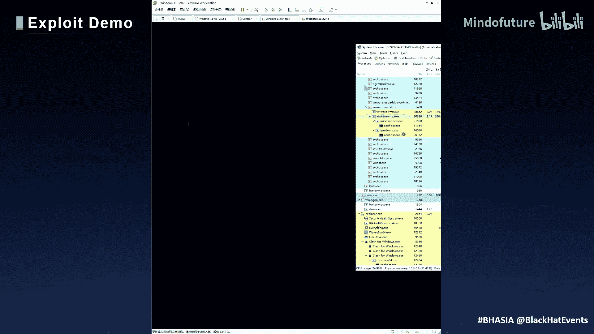
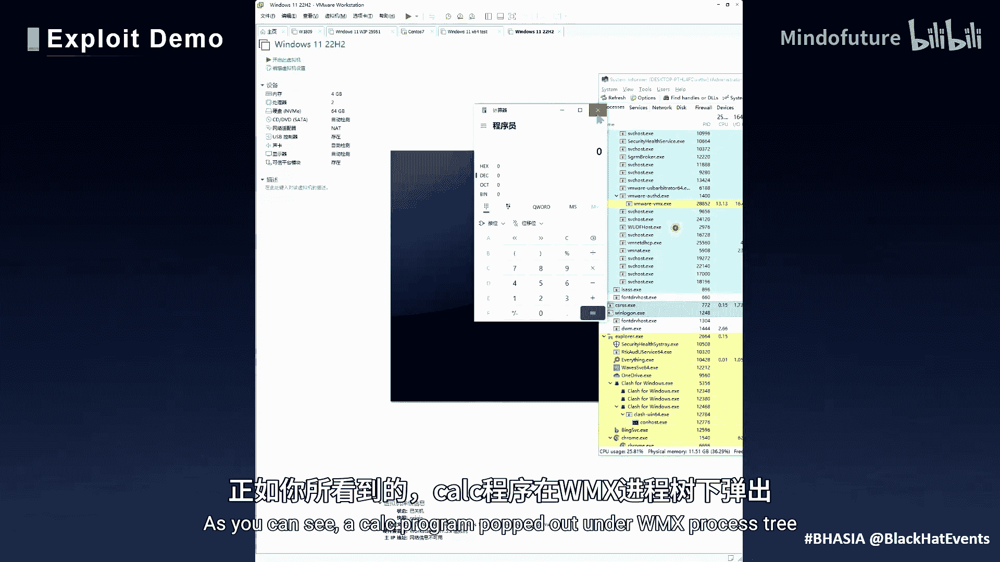

# 015：揭示虚拟化裂缝，掌握宿主机系统 - VMware Workstation 逃逸

在本教程中，我们将跟随研究员 Victor Wei 的演讲，系统性地学习虚拟化逃逸的基础知识、历史漏洞分析以及一个完整的 VMware Workstation 逃逸案例。我们将从虚拟化的基本架构开始，逐步深入到漏洞挖掘与利用技术，旨在让初学者能够理解虚拟化逃逸的核心概念和流程。

## 概述

虚拟化逃逸是指攻击者从虚拟机内部突破隔离，获得对宿主机系统控制权的攻击方式。它与远程代码执行（RCE）有相似之处，但数据传输和利用环境不同。本节课我们将学习虚拟化的基本架构、数据传输机制，并通过分析历史漏洞和一个实战案例，掌握虚拟化逃逸的挖掘与利用思路。

---

## 第一部分：虚拟化基础信息

要理解虚拟化逃逸，首先需要回答三个关键问题：虚拟机如何构建？数据如何在客户机与虚拟设备间传输？什么是虚拟化逃逸？

### 虚拟机如何构建

一个虚拟机通常由一个**管理程序**和多个**虚拟硬件设备**构成。

以 VMware Workstation 为例，其管理程序的一部分运行在内核态，另一部分运行在用户态进程中。大多数虚拟硬件设备都实现在同一个用户态进程中。

下图展示了 VMware Workstation 的软件架构：

```
[客户机操作系统] <-> [管理程序 (部分在内核/部分在用户态)] <-> [虚拟硬件设备 (在用户态进程中)]
```

我们今天讨论的重点是其中的 **USB 控制器**。

### 数据如何传输

数据在客户机系统与虚拟硬件设备之间传输主要有两种方法：

1.  **直接读写客户机物理内存**：整个客户机的物理内存被映射为 VMX 进程虚拟地址空间中的一段。
    *   **客户机虚拟地址**：客户机内程序使用的内存地址。
    *   **客户机物理地址**：GVA 转换后的物理地址。
    *   **宿主机虚拟地址**：VMX 进程中用于访问客户机物理内存的地址。
    *   转换过程 `GVA -> GPA -> HVA` 在 VMX 进程中完成，使得客户机系统和 VMX 进程可以同时访问同一块内存。

2.  **I/O 操作**：几乎所有虚拟硬件设备都在用户态进程中实现，因此客户机与虚拟设备的交互本质上是与 VMX 进程的交互。
    *   **I/O 端口**：使用特定的 CPU 指令进行通信。
    *   **I/O 内存**：可以映射到客户机虚拟地址，供客户机直接读写。
    *   I/O 操作速度快，但传输数据量小。对于大数据传输，通常使用第一种内存映射方式。

### 什么是虚拟化逃逸

我们可以将其与远程代码执行进行对比：

*   **远程代码执行**：攻击者向服务器发送数据，破坏服务器进程结构，通过接收网络消息泄露数据，再次发送数据控制程序流，最终执行代码。
*   **虚拟化逃逸**：最大的不同在于**传输媒介**。消息传输通过客户机物理内存和 I/O 操作完成。因此，要完成一次虚拟化逃逸，通常需要先获得**任意地址读写**的能力。

---

## 第二部分：探索 USB 控制器

在了解了关键问题后，我们开始探索本次研究的重点：USB 控制器。

VMware Workstation 实现了三种 USB 控制器：
*   USB 1.1 系列：**UHCI**
*   USB 2.0 系列：**EHCI**
*   USB 3.x 系列：**xHCI**

未来可能还会看到 USB4 的实现。这些控制器都有公开的漏洞编号，可供深入研究。

以下是在 Linux 虚拟机中查看的 xHCI 和 UHCI 设备信息示例：
*   xHCI 使用 **I/O 内存** 传输数据。
*   UHCI 使用 **I/O 端口**（例如 0x20c0）。

### UHCI 控制器架构

UHCI 控制器默认有两个端口。当设备连接到一个端口时，需要一个**集线器**来扩展新的 USB 设备。

在一个安装了 Windows 10 客户机的默认 VMware Workstation 环境中：
*   一个虚拟蓝牙设备和一个虚拟 USB 集线器挂载在 **UHCI** 下。
*   一个虚拟 USB 鼠标挂载在 **xHCI** 下。
*   EHCI 下默认没有挂载设备。

需要注意的是，虚拟蓝牙需要宿主机启用蓝牙功能。如果在没有蓝牙的台式机上进行研究，可能无法触发后续演示中的某些漏洞。

如果我们在客户机中**移除 xHCI 控制器**，USB 鼠标将会被挂载到 USB 集线器下。

### UHCI 消息结构

设备驱动通过 I/O 操作将**帧列表**的客户机物理地址传递给虚拟设备。

以下是消息结构的传递关系：

```
[设备驱动] -> (通过I/O操作传递GPA) -> [帧列表] -> [队列头结构] -> [传输描述符结构] -> [数据缓冲区]
```

*   **帧列表**：一个内存区域，每个成员存储第一个 **QH 结构**的 GPA。
*   **QH 结构**：包含指向下一个 QH 或 TD 结构的 GPA。
*   **TD 结构**：前 4 字节指向下一个 TD 结构，其余部分包含数据和控制信息（如设备ID、端点ID、数据长度、缓冲区GPA）。

一个简单的 TD 结构初始化代码示例如下：
```c
dma_addr = dma_alloc_coherent(..., &td_gpa); // 分配连续物理内存，返回GVA，并将GPA赋给td_gpa
frame_list[index] = td_gpa | 1; // 存储TD的GPA，并设置最后一位为1表示结束
```

---

## 第三部分：历史漏洞分析与启发

在理解目标架构后，我们通常从分析历史漏洞开始。本节将介绍一个历史漏洞，它启发了研究员发现绕过限制的新方法，并进而发现了更多漏洞。

### 历史漏洞：CVE-2019-5519

这是一个由 **时间检查-时间使用** 引发的漏洞。

在 VMX 进程中，有一个 **DMA 映射结构** 用于存储 TD 结构的 HVA。
1.  UHCI 线程通过 HVA 读取 TD 结构的 `len` 字段，并计算所有 TD 结构的总长度。
2.  然后根据总长度分配 **URB 结构**。
3.  接着再次通过 HVA 读取 TD 结构的 `len` 字段。

同时，VMX 进程中还有一个 **SVGA 线程**（虚拟显卡的实现），它可以同时访问客户机物理内存。

**漏洞利用**：如果我们在 UHCI 线程第一次读取 `len` 之后、第二次读取之前，利用 SVGA 线程修改 TD 结构的 `len` 字段，那么 UHCI 线程第二次读取到的就是被修改后更大的 `len` 值。这将导致在后续操作中发生**堆溢出**。

### 启发与新漏洞挖掘

在分析上述漏洞后，研究员开始复现并更深入地审查 UHCI 代码，并受到启发，发现可以绕过某个限制，创造一个新的漏洞。

关键代码逻辑如下：
```c
while (1) {
    // 循环1
    while (func() != 0) {
        i++;
        // 循环2：处理TD结构，会填充DMA映射区域
        if (index < 4000) {
            // 某些操作
        }
    }
}
```
函数 `func()` 根据帧列表的起始值和索引计算帧索引，并读取 QH 结构的 GPA。

**限制与绕过**：
*   当索引 `index` 达到 4000 时，如果帧列表起始值 `frame_start` 被设置为 `0x3FFF`，计算出的帧索引会重复，导致循环可能无法正常退出，但也不会溢出映射区域。
*   **绕过方法**：如果通过竞争条件修改 `frame_list` 的值，使其在第二次读取时不同，那么 `frame_index` 就不会重复，循环可以继续，从而可能**溢出映射区域**。

基于这种思路，在进一步的漏洞研究中，发现了另一个信息泄露漏洞（原计划用于2022年天府杯，但被他人抢先公开并修复）。

**漏洞原理**：
*   URB 结构通过 `malloc` 分配，其内部的缓冲区未被初始化。
*   如果一系列 TD 结构中，除了第一个是 `SETUP` 类型外，其余都是 `INPUT` 类型，那么后续 URB 的缓冲区将完全不会被初始化。
*   在处理第一个操作时，虚拟蓝牙设备会处理 URB 结构，并将其某个字段的值直接赋给 URB 的 `C` 字段，后续操作不会改变它。
*   因此，客户机可以从 URB 的缓冲区中读取到**未初始化的内存内容**，造成信息泄露。

官方修复时只是简单地在特定条件下将 `C` 字段设为 8，而没有正确初始化缓冲区内存，这为后续利用留下了空间。研究员在虚拟鼠标设备上成功触发了此漏洞，并用于天府杯2023。

---

## 第四部分：UAF漏洞与利用链构建

在发现多个漏洞后，研究员确信该模块存在更多问题。通过尝试在客户机中**移除 xHCI 控制器**，发现了一个新的 **释放后使用** 漏洞。

### UAF 漏洞分析

在一个处理函数中，代码从 UHCI 主结构的链表中取出下一个指针 `next`。
1.  如果 `next` 不是链表的开头，则通过 `next` 减去某个偏移量得到**端点结构**。
2.  然后获取链表的下一个成员。
3.  后续操作会处理控制类型的端点。

**漏洞触发条件**：
*   在虚拟集线器的实现中，可以重置其下挂载的设备。重置操作会**释放**所有已挂载设备的端点结构，并重新申请一个新的控制端点结构。
*   回顾基础架构：当我们移除 xHCI 后，虚拟鼠标会挂载在 USB 集线器下。
*   因此，如果当前处理的端点是虚拟集线器的控制端点，而 `next` 指向的是虚拟鼠标的端点。
*   如果在后续操作中重置了虚拟集线器下的设备，那么鼠标的端点结构将被释放，导致 `next` 变成一个**悬垂指针**，从而引发 UAF。

### 利用技术演进

拥有漏洞后，如何利用它实现逃逸？本节将通过一个实际案例讲解利用技术的演进。

**早期方法（已失效）**：
*   利用 SVG 设备中的 `surface` 和 `mob` 结构。`mob` 结构保存了 GPA 对应的 HVA。
*   通过堆布局，让后端堆和 `mob` 结构位于同一 LFH 堆段。
*   如果发生堆溢出，可能覆盖 `mob` 结构，改变其指向的堆指针，再结合 SVG 命令，就能实现任意地址读写。
*   **现状**：官方修复后将相关结构移至其他进程，此方法失效。

**新方法（在特定版本有效）**：
*   如果 `mob` 的转换大小是 1000 字节，当尝试将 GPA 转换为 HVA 失败时，系统会申请一个大小为 1000 字节的堆块来存放 HVA。
*   同样通过 SVG 命令在 `mob` 间复制数据，可以获得读写能力。
*   通过溢出 `surface` 的 `len` 字段，可以实现越界读写。经过精心布局，可以覆盖更多结构，改变 HVA 值，从而实现任意地址读写。
*   **现状**：在 Workstation 17 中，`mob` 结构不再单独申请堆块，而是被放入一个大的向量中，增加了修改难度。

**当前利用方法**：
研究员最终找到了一个实现任意地址写入的可靠方法。

在 UHCI 从 URB 读取数据的函数中，存在以下代码逻辑：
```c
a2 = endpoint_structure;
urb = get_urb(a2);
ep_from_urb = get_endpoint_from_urb(urb);
ptr = ep_from_urb->some_pointer;
v8 = *ptr;
if (some_condition) {
    *(a4 + offset) = v8; // 可控的写操作
}
```
*   如果能控制一个端点结构或 URB 结构，就可以伪造 `ep_from_urb->some_pointer`，从而在满足条件时，向 `a4 + offset` 指向的地址写入 `v8` 的值。
*   **缺点**：需要知道目标地址的值（因为条件判断）。
*   **好消息**：我们拥有信息泄露漏洞，并且通过 UAF 可以控制端点结构。

---

## 第五部分：实战利用演示

结合上述思路和漏洞，我们开始构建完整的利用链。

### 利用步骤

1.  **信息泄露**：
    *   利用 SVG 着色器结构进行堆喷。
    *   精心布局，在正常的 URB 结构前后留下“空隙”。
    *   释放正常的 URB 和空隙结构，它们会合并。
    *   再次申请鼠标 URB，使其恰好分配到合并后的内存中。
    *   利用信息泄露漏洞，读取鼠标 URB 未初始化的内存，从而**泄露正常 URB 结构的数据**。从中可以获取 URB 堆相关地址和 VMX 进程相关地址。

2.  **控制悬垂指针（UAF）**：
    *   端点结构是悬垂指针，位于 LFH 堆中。
    *   将 LFH 堆段的大小扩展到最大（`0x41FF0`）。
    *   准备尽可能多的虚拟集线器控制命令，每个命令都重置虚拟鼠标的端点结构，以**扩大竞争时间窗口**。
    *   同时，使用 SVG 线程提交命令来分配和释放相同大小的堆块。
    *   这样，当 UHCI 线程访问悬垂指针时，它有很大概率指向我们控制的端点结构，从而实现**任意地址写入**。此步骤失败概率约为 1/40。

3.  **升级任意地址读写**：
    *   利用任意地址写入，修改 URB 结构的 `current_b` 字段，让其指向 **mob 表**（该表存储了 mob 结构的指针）。
    *   再次利用 UAF 漏洞，修改 mob 表，让其指向 **SVG 全局缓冲区**。
    *   现在，我们可以通过 SVG 命令修改 SVG 全局缓冲区的内容，从而**伪造一个 mob 结构**。
    *   最后，利用 mob 结构的能力，实现**完全的任意地址读写**。

4.  **执行任意代码**：
    *   在 VMX 进程中寻找函数指针，并链接 `WinExec` 函数的地址。
    *   使用 `WinExec` 绕过控制流防护，执行任意命令。





### 演示结果

在演示中，攻击者在客户机内运行利用程序，成功在宿主机上弹出了计算器程序，证明了虚拟化逃逸的成功。

---

## 第六部分：总结与防御

最后，让我们总结本节课学到的知识点，并了解如何防御虚拟化逃逸。

### 知识点总结

1.  **漏洞挖掘方向**：
    *   **时间检查-时间使用**：注意 HVA 数据的竞争条件。在进行虚拟化安全研究时，应重点关注这一点。
    *   **释放后使用**：注意“重置”操作。可以查阅类似漏洞 CVE-2020-4004 进行学习。

2.  **利用技术**：
    *   利用 **URB 结构** 泄露所需信息。即使没有现成的信息泄露漏洞，也可以先溢出 URB 结构的第一个字段来制造一个。
    *   利用 **端点结构** 实现任意地址写入。
    *   借助 **mob 结构** 的能力，再次升级为任意地址读写。

### 防御建议

1.  **移除不必要的设备**：例如 USB 控制器、声卡、CD-ROM 等。
2.  **禁用不必要的功能**：例如 SVG 3D 加速。本案例中利用 mob 结构可能需要此功能。
3.  **保持软件更新**：使用最新版本的虚拟化软件。旧版本通常存在更多已知的逃逸漏洞，不要因为觉得“旧版本更安全”而使用它们。

---

本节课中，我们一起学习了虚拟化逃逸的基本概念、架构、历史漏洞分析以及一个完整的利用案例。从理解内存传输机制到挖掘竞争条件漏洞，再到构建复杂的利用链实现代码执行，我们看到了虚拟化安全研究的深度与挑战。希望本教程能为你打开虚拟化安全研究的大门。