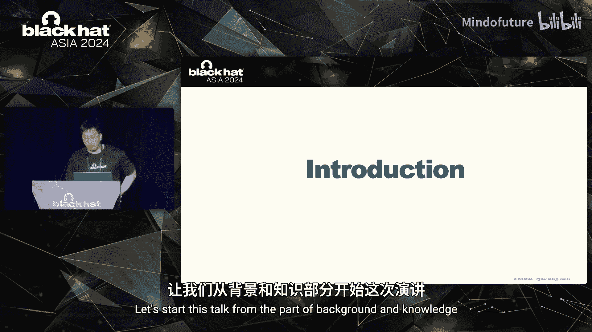
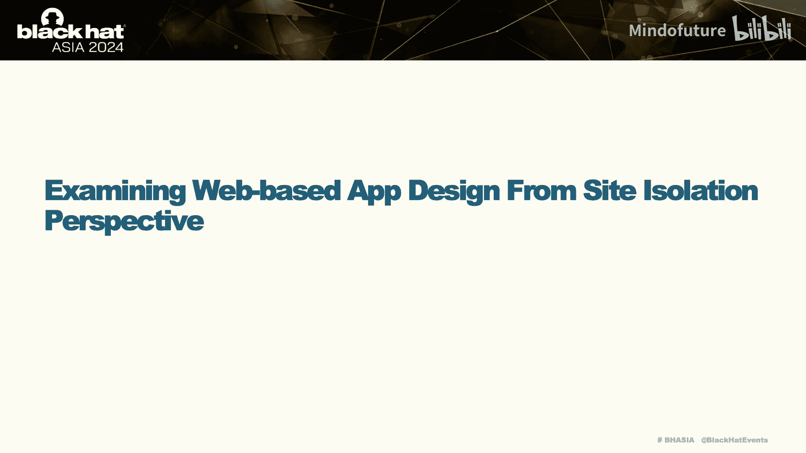
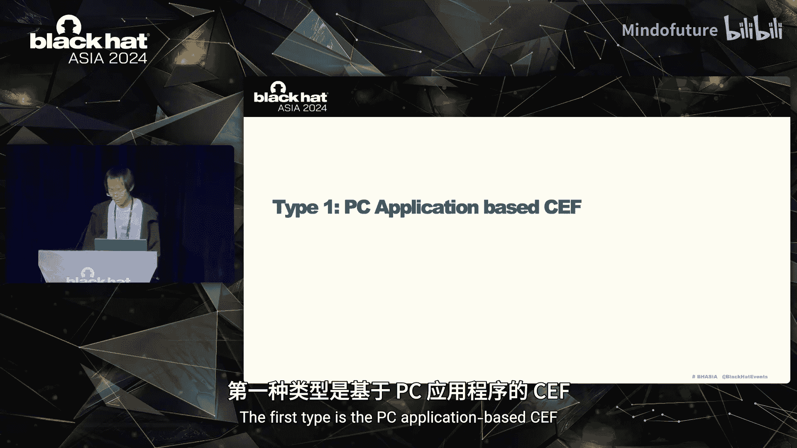
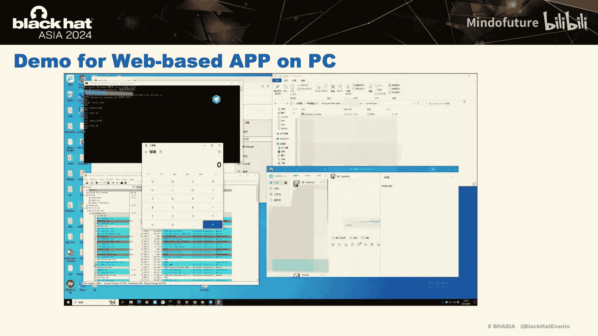
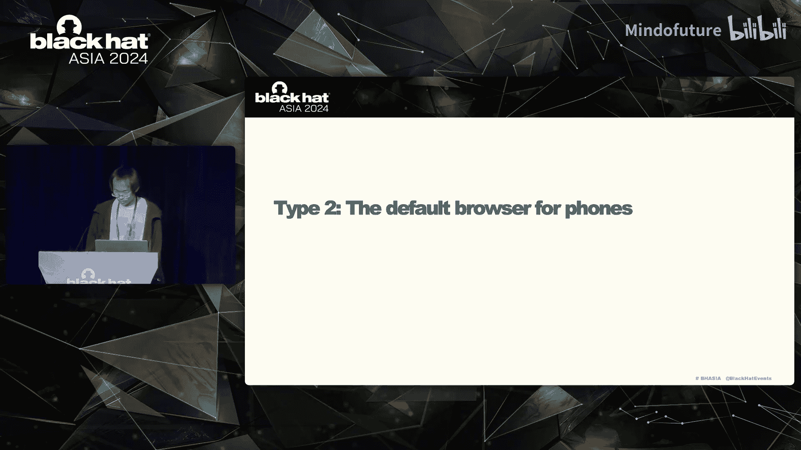
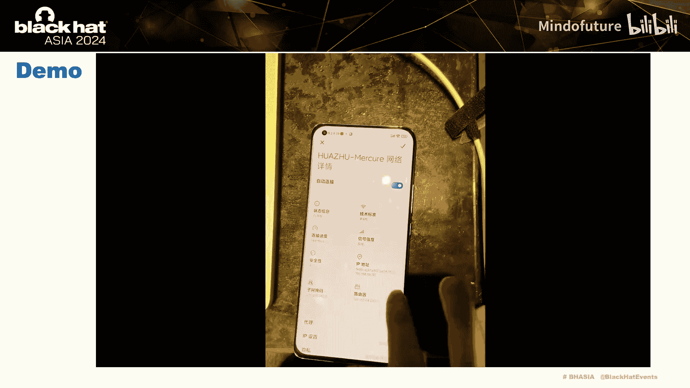
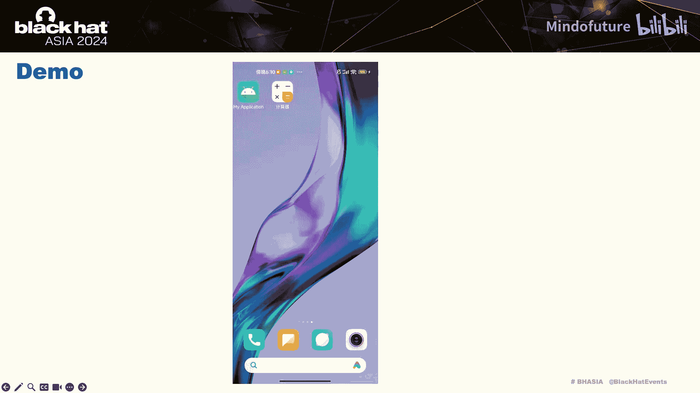
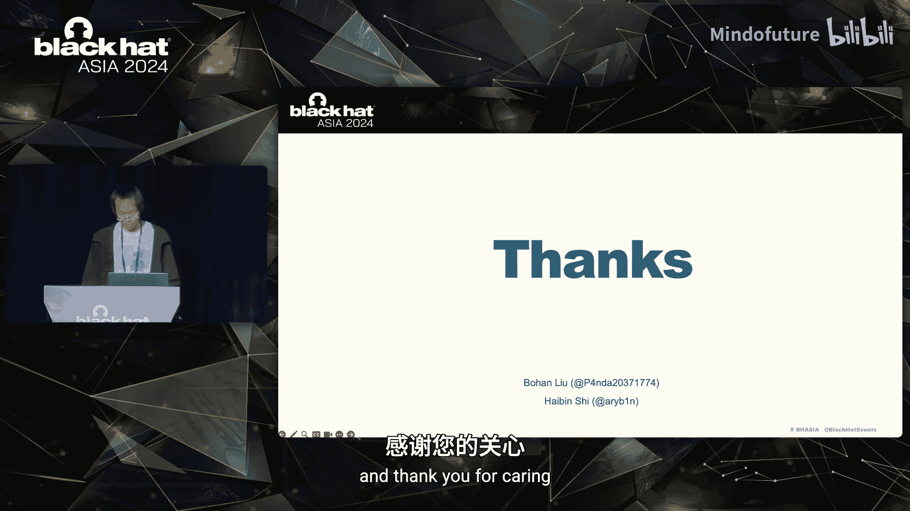

# 017：沙箱中的漏洞——从站点隔离视角逃逸现代Web应用沙箱

在本节课中，我们将学习如何利用渲染器进程的远程代码执行漏洞，结合站点隔离机制的弱点，实现从现代Web应用沙箱中逃逸。我们将从浏览器安全基础开始，逐步深入到具体的攻击手法和真实世界的案例分析。

## 1：背景与基础知识

浏览器，例如Chrome，是一个多进程架构的应用程序。当打开一个网页时，不同的进程负责不同的工作，共同协作以渲染页面。

以下是主要进程及其职责：
*   **浏览器进程**：控制用户可见的交互部分（如地址栏、前进/后退按钮）以及不可见的部分（如网络请求和文件访问）。
*   **渲染器进程**：控制标签页内的所有内容，负责网页的渲染，包括执行JavaScript、解析HTML和CSS等。

由于所有关于网站（如JavaScript）的代码都在渲染器进程中加载和执行，如果此处存在漏洞，攻击者就可能获得渲染器进程的所有权限。因此，Chrome使用沙箱来限制渲染器进程的能力，使攻击者即使控制了渲染器进程也无法造成严重破坏。

沙箱的核心思想是**不重新发明轮子**。它复用操作系统的安全机制，授予渲染器进程较低的权限。例如，在Windows上使用完整性级别，在Linux上使用Seccomp-BPF，在Android上使用SELinux。这使得沙箱遵循了最小权限原则，渲染器进程只能访问有限的资源，并通过进程间通信与浏览器进程或内核交互。

上一节我们介绍了沙箱的基本原理，本节中我们来看看攻击者在获得渲染器进程的远程代码执行后，通常能做些什么。

攻击者获得渲染器远程代码执行后，主要有以下几种能力：
1.  **访问受限的系统调用**：攻击者可以调用沙箱允许的有限系统调用，例如，调用`mprotect`来修改内存页的权限。但他们无法执行真正危险的操作，如下载任意文件或创建新进程。在这种情况下，攻击者可能会尝试在有限的系统调用中寻找系统级漏洞来提升权限。
2.  **发送恶意的IPC调用**：如果浏览器进程在处理IPC消息时存在漏洞，攻击者可以通过发送精心构造的参数，触发漏洞，从而在更高权限的浏览器进程中执行代码，实现权限提升。
3.  **修补渲染器进程内的所有代码和数据**：这是一种特殊的沙箱逃逸案例。攻击者可以修改与某些功能（如V8引擎）相关的数据，从而调用本不应被调用的原生Node.js API，这在某些Electron应用中可能导致沙箱逃逸。

那么，渲染器远程代码执行本身的最大能力是什么？它是否只能作为沙箱逃逸的前提条件？这正是本次演讲的初衷。我们希望探讨，在遵循Chrome漏洞奖励计划的规则下，如何将渲染器远程代码执行本身的能力发挥到极限。

根据漏洞奖励计划，在沙箱逃逸和渲染器远程代码执行之间，还存在一些其他高风险漏洞。我们能否逐步提高渲染器远程代码执行的风险等级，最终实现某种形式的逃逸？

主要有两种途径：
*   利用**GPU或网络进程的远程代码执行**，这些进程拥有中等权限。但这通常也需要另一个权限提升漏洞。
*   尝试实现**通用型跨站脚本攻击**。

## 2：通用型跨站脚本攻击

带着上述问题，让我们进入第二部分。我想在座的各位可能对跨站脚本攻击非常熟悉。那么，什么是通用型跨站脚本攻击呢？

这是一张简单的图片，展示了它们之间的区别：
*   在传统的跨站脚本攻击中，漏洞存在于`victim.com`的服务器端代码中。攻击者诱使用户加载一个包含恶意参数的链接。之后，跨站脚本攻击的有效载荷在服务器端被注入到页面中。当页面在浏览器中加载时，任何JavaScript代码都会在`victim.com`的上下文中执行，攻击者可以窃取用户的Cookie。
*   对于通用型跨站脚本攻击，漏洞存在于浏览器本身。当通用型跨站脚本攻击的代码在受害者的浏览器中加载时，攻击者会利用浏览器漏洞将JavaScript代码注入到`victim.com`的页面中，即使服务器端没有任何漏洞，Cookie仍然可以被窃取。

分析历史数据，这类漏洞早在2006年就已存在。从下图可以看出，从2010年到2024年，Safari、Firefox和Chrome都曾出现过此类漏洞。特别是在2014年至2016年间，Chrome出现了63个通用型跨站脚本漏洞。因此，通用型跨站脚本攻击是一种长期存在并影响众多浏览器的高风险漏洞。

那么，是什么阻止了我们从其他域注入代码呢？我们可以做一个小实验。

我们知道DOM树包含了一个页面的所有代码，我们可以通过`document`对象访问它。首先，我们创建一个新的`<iframe>`，并将其源设置为与父页面不同的域（例如`x.xx.live.tencent.com`）。当我们尝试从父页面读写其DOM树时，发现被浏览器的同源策略阻止了。

**同源策略**是一个关键的安全机制，它限制了文档如何与跨源资源进行交互。它会检查父页面和子页面的“三元组”（协议、域名、端口）是否相同。在我们的案例中，`<iframe>`的域名与父页面不同，因此访问被阻止。

现在的问题是：如何绕过同源策略？这里有一个值得学习的案例，它告诉我们如何在Safari中利用渲染器远程代码执行绕过同源策略。该案例来自BlueHat 2020的一个议题。

攻击者可以在`attacker.com`页面中使用一个`<iframe>`加载`google.com`，然后利用父页面中的一个渲染器远程代码执行漏洞，将JavaScript代码注入到`google.com`的`<iframe>`中。

这次攻击成功需要满足三个条件：
1.  攻击者的页面和受害者的`<iframe>`在同一个渲染器进程中。
2.  同源策略检查是在渲染器进程中进行的，而不是在浏览器进程中。
3.  此检查所使用的域名结构数据也位于渲染器进程中。

因此，攻击者可以修改渲染器进程中的数据来绕过同源策略。具体来说，攻击者可以覆写`<iframe>`的通用可访问性域数据，以绕过自定义域数据访问的检查，从而将任意JavaScript代码注入到`<iframe>`页面中。当然，`X-Frame-Options`头会阻止站点在`<iframe>`中加载。然而，这个检查同样在渲染器进程中进行。因此，攻击者可以使用相同的方法再次绕过这个检查，使得任何站点都能在`<iframe>`中加载。

比较这两点，攻击者在Safari中实现了通用型跨站脚本攻击。这听起来是个好消息，因为Chrome和Safari过去共享同一个渲染引擎。因此，Safari中的这种攻击方法可能也会影响Chrome。

然而，Chrome设计了一系列针对通用型跨站脚本攻击的加固措施：
1.  **Chrome引入了跨进程iframe**：它允许页面的子`<iframe>`由与其父进程不同的进程来渲染。这切断了条件1。
2.  **Chrome引入了进程外导航**：它将跨源安全检查移到了浏览器进程。这消除了条件2和3。
3.  更重要的是，**Chrome在2018年引入了站点隔离**：它限制一个渲染器进程只能加载单个站点。这被称为对抗通用型跨站脚本攻击最有希望的举措。

站点隔离似乎是我们必须面对的问题。

## 3：站点隔离的原理与实现

现在，站点隔离的原理是将每个网站视为一个独立的安全主体，要求使用专用的渲染器进程。根据相关论文，站点隔离主要新增了五个特性。其中，站点主体和专用进程是用来定义站点隔离实现方式的概念。而跨进程导航和跨进程`<iframe>`则是站点隔离生效的场景。

*   在**跨进程`<iframe>`**场景中，当父页面包含一个跨源`<iframe>`或弹出页面时，该`<iframe>`或弹出页面会被加载到一个新的进程中。
*   在**跨进程导航**场景中，当导航目标是跨源时，它也会被加载到一个新的进程中。

现在我们理解了站点隔离的原理，让我们来看看它的实现。我们可以在`StartNavigation`方法中找到它。我们知道，一个`RenderFrameHost`对象在浏览器进程中代表一个渲染帧。因此，在导航期间，新页面将被加载到哪个渲染器中，将基于关联的`RenderFrameHost`的类型标记来决定。

具体来说，它由`GetRenderHostForNavigation`方法中的`use_current_rfh`决定。而这又取决于当前的站点实例是否与目标站点实例兼容。最终我们发现，目标站点实例的生成过程会尝试复用原始的站点实例。如果可能，新页面将被加载到旧的`RenderFrameHost`中；否则，它将被加载到一个新的`RenderFrameHost`中，这意味着会创建一个新的进程。

决定是否复用进程的关键在于`UseDedicatedProcessForAllSites`方法。例如，当严格的站点隔离模式未启用时，新页面将被加载到导航的原始进程中。那么，什么是严格模式？

我们可以从文档中得知，严格模式仅针对桌面平台。因此，在潜在模式下（例如Android版Chrome），进程会被复用。这在所有Android平台（如WebView）上也会发生。

也就是说，在Android上，导航后我们可以复用同一个进程。

## 4：攻击链构建与演示

现在，攻击者基于渲染器远程代码执行，具备了修补所有代码和数据的能力，并且后续页面可以处于攻击者控制的同一个进程中。下一步是找到一种方法将JavaScript代码注入到另一个页面中。从页面渲染的角度来看，有许多时机可以选择。

我选择了JavaScript编译阶段。此时的JavaScript代码是一个字符串。因此，我们需要做的是找到并修改它们。我找到了`CompileScriptInternal`方法，这是Chrome中首先调用的编译函数。它取出JavaScript代码并生成一个V8字符串对象，然后调用脚本编译器的`Compile`方法。这是一个很好的钩子点。

因此，我在这个核心点挂钩，注入一个“特洛伊木马”字符串。这个“特洛伊木马”看起来像一个子程序：当满足某些条件时，`EvilString`将JavaScript代码修改为我们的攻击载荷（如`alert(1)`）；否则，它正常编译以避免出现异常行为。

因此，整个攻击过程如下：
1.  受害者打开攻击者的网站。
2.  攻击者利用漏洞修补代码，在`CompileScriptInternal`中注入一个“特洛伊木马”。
3.  攻击者通过设置`location.href`导航到受害者站点。
4.  当编译受害者页面的JavaScript时，“特洛伊木马”被触发，并将JavaScript修改为攻击者控制的任意代码，从而导致通用型跨站脚本攻击。

好的，我们向前迈进了一步。我们将渲染器远程代码执行转化为了通用型跨站脚本攻击。我在Android 90版本的Chrome上做了一个演示。在这个版本上，我们可以将任意代码注入到一些重要的站点，例如`accounts.google.com`。让我播放视频。

（视频演示：在`accounts.google.com`页面上弹出了`alert(1)`。）

在我与Tianfu Cup的Gong Gang讨论这个方法后，他说这类似于他在Pwn2Own 2016上使用的另一个漏洞。这非常巧合。因此，我也将他的方法列在这里。

然而，在我将此问题提交给Google后，Google标记为“不予修复”，因为他们无法采取太多措施，除非在Android上启用严格的站点隔离。但通常，用户仍然是安全的，因为Google从Chrome 92开始使用启发式方法隔离最需要隔离的站点。这意味着在此之后，我们无法将JavaScript代码注入到像`accounts.google.com`这样的站点中。

那么，哪些是最需要隔离的站点呢？根据Google的说法，它主要保护与用户登录相关的私人数据，例如需要输入密码进行用户登录的站点，或者具有行业标准认证的站点。但其他未受保护但同样危险的站点呢？

从Android Chrome开发者的角度来看，仅保护这些站点可能还不够。但有一类称为**基于Web的应用**，它们使用Chrome等浏览器组件实现。

## 5：基于Web的应用与沙箱逃逸

通常，基于Web的应用具有更复杂的功能。这类应用能否在使用类似保护措施的情况下，在这种攻击下幸存？好的，这是另一个问题。让我把时间交给Habin，他将介绍我们如何利用这种方法逃逸基于Web的应用的沙箱。

大家好，我是Habin。我将向大家展示我们如何在真实世界的软件中逃逸沙箱。首先，让我们从站点隔离的角度分析基于Web的应用。

基于Web的应用使用WebView或其他类似组件（如CEF）来显示Web内容。这些组件通常基于Chromium。如此强大的组件可能比原生应用引发更多问题。

有时，开发者不仅希望显示Web内容，还希望与本地资源进行交互。因此，Web组件也附带JavaScript接口，这赋予了JavaScript调用原生代码的能力。一些JavaScript接口实际上实现了非常强大的功能，例如安装和打开应用程序。如果我们能够调用这些接口，就有可能实现沙箱逃逸的效果。

但开发者也考虑到了这一点，并限制特权应用接口仅能被他们信任的网站使用。以下是一个代码示例。在调用特权应用接口之前，会有一个检查。这看起来非常安全。是否有可能打破这种安全假设呢？

在完美的站点隔离下，确实没有办法做到这一点。然而，经过我们的研究，我们发现由于站点隔离的实现方式，许多基于Web的应用中存在安全问题。许多应用没有实现完整的站点隔离。我们可以使用通用型跨站脚本攻击解决方案来调用任何特权应用接口，从而实现沙箱逃逸的效果。

现在，让我们展示如何从站点隔离的角度逃逸多个基于Web的应用的沙箱。

以下是我们关注的一些软件类型，例如基于CEF的PC应用、默认移动浏览器、应用商店等。

### 5.1：基于CEF的PC应用

这是一种基于Web的应用架构，具有以下特点：
1.  特权应用接口主要实现客户端的通用功能。
2.  许多隐式深度链接被注册在特权域解析中。

对于开发者来说，最重要的是软件的运行速度。因此会有许多优化，特别是在页面加载过程方面。一个案例是：应用打开时创建渲染器进程，并在网站关闭时复用该进程。这破坏了站点隔离。当仅使用一个进程类型时，攻击者可以利用一个渲染器远程代码执行漏洞在特权域中获得通用型跨站脚本攻击能力。

然后，我们在特权应用接口中寻找漏洞。首先，我们在加密应用接口中发现了两个漏洞。我们使用Windows UNC路径来控制输入文件为远程文件。我们还可以在写入文件时绕过路径遍历检查，从而可以将任意值写入任意文件。我们还发现了另一个接口，它可以用硬编码的名称启动一个进程。最终，我们获得了远程代码执行能力。

（此处应有漏洞利用演示视频）

### 5.2：移动浏览器

手机的默认浏览器是预装的，因此它是移动端渗透测试项目的一个技术入口点，可能实现一键远程代码执行。这对安全研究人员来说是一个有吸引力的目标。

每个品牌的手机都会预装其定制浏览器。只有Google Pixel等少数设备搭载原生Android Chrome。移动厂商的定制浏览器基于Android Chrome进行二次开发，这潜在地破坏了站点隔离。因此，我们也可以在此类目标上实现通用型跨站脚本攻击。

然后我们需要找到一些有用的JavaScript接口。这里有一个案例。

目标应用中有一些广告功能，支持静默安装和打开应用。经过分析，我们发现如此强大的功能是通过JavaScript接口实现的。但这个高风险功能只能从特权域调用。

以下是目标接口：
*   第一个是`browser.openApp`，可以根据应用名称字符串打开应用。
*   另一个是`browser.installApp`，可以根据应用名称字符串安装应用，并且可以设置安装应用后的回调。我们可以使用这个回调在安装后打开应用。

但这还不够好。我们发现只有应用商店中的应用才能被安装。这意味着我们需要像近年来大多数渗透测试选手那样，将自己开发的应用通过后门上传到应用商店。然而，这种方法需要更多时间，并且有被审计人员发现的风险，而我们又需要赶时间参加天府杯。是否有其他利用方法呢？

经过分析，我们找到一个可能的解决方案：我们应该通过应用商店中已有的应用来控制设备。并且目标应用需要能够与我们交互，以实现执行任意命令的效果。

然后我们找到了以下类型的应用：终端应用或脚本语言解释器。我们发现有一个这样的应用，可以通过深度链接执行传递的参数作为命令。我们通过下载并运行BusyBox作为Netcat，然后使用此深度链接启动终端，从而获得了一个反向Shell。

为了通过深度链接启动应用，我们需要一个更强大的特权应用接口，我们找到了一个这样的接口：`browser.startActivityWithDeepLink`。与`openApp`接口相比，这种方法可以传递参数，更加灵活。我们可以用它来启动终端应用并传输数据以获取反向Shell。

（此处应有漏洞利用演示视频）

### 5.3：基于Web的Android应用

大多数基于Web的Android应用可以从浏览器启动。但也有一些区别。浏览器可以加载任何网站的内容，但基于Web的应用通常只显示一些与厂商相关的内容。当应用接收到一些不受信任的内容时，它甚至可能跳转到浏览器中打开。

这个案例是关于手机的默认应用商店。目标应用是一个厂商内置的应用商店应用，类似于Google Play应用。应用可以从目标应用静默安装和打开。并且目标应用可以从浏览器启动，这意味着它是可导出的。

总之，目标应用是渗透测试或天府杯的一个好目标。

让我们看看我们发现的第一个Activity。它是可导出的，并注册了深度链接，用于处理Intent并将其分发给不同的基于Web的Activity。

代码如下。Activity 1将链接分为以下三种类型：
1.  **不受信任的网站**：它将跳转到浏览器打开。
2.  **厂商相关站点**：它将在没有特权应用接口的WebView Activity中打开。
3.  **与应用商店业务相关的网站**：它将在具有特权应用接口的WebView Activity中打开。

然后是我们关心的Activity 2，它是一个具有特权应用接口的WebView Activity，但没有办法加载到不受信任的域。代码如下。

然后我们分析有用的特权应用接口。一个是`market.openApp`，可以根据字符串打开应用。另一个是`market.installApp`，可以根据应用包名安装应用，并且可以设置安装应用后的回调。我们可以使用这个回调在安装后打开应用。

但我们没有找到在Activity 2中加载我们自己网站的方法。我们必须先找到一种加载我们HTML页面的方法。经过一些研究，我们找到了目标Activity 3。这是一个没有特权应用接口的WebView Activity，但存在漏洞可以注入任意页面内容。

我们现在拥有的是：
1.  Activity 1：接收浏览器设置的Intent，并启动Activity 1或Activity 2。
2.  Activity 2：拥有用于打开和安装应用的特权应用接口。
3.  Activity 3：可以加载任意网站。

是否有可能通过Activity 3中的WebView攻击Activity 2中的WebView？经过我们的测试，不同应用之间的WebView具有完整的站点隔离，但在同一个应用中，只有一个WebView渲染器进程。这意味着同一个应用中不同WebView之间没有站点隔离。

因此，我们完成了攻击。即从浏览器跳转到Activity 1，然后到Activity 2，再返回到Activity 1，最后跳转到Activity 3，实现沙箱逃逸。

（此处应有漏洞利用演示视频）

## 6：总结与建议

本节课中我们一起学习了如何利用渲染器远程代码执行漏洞，结合站点隔离机制的实现弱点，逐步构建攻击链，最终在多种基于Web的应用中实现沙箱逃逸。我们从浏览器沙箱基础开始，探讨了通用型跨站脚本攻击的原理，分析了站点隔离的绕过条件，并展示了在PC端CEF应用、移动浏览器和Android Web应用中的实际案例。

以下是给应用开发者的安全建议：
1.  **配置站点隔离**：以保护特权域。
2.  **先执行安全检查，再决定是否复用进程**：在决定进程复用时，应将安全检查置于决策逻辑之前。
3.  **限制JavaScript接口的权限**：防止滥用特权。
4.  **尽可能使用不可变代码实现高风险操作**：降低被篡改的风险。
5.  **及时修复供应链漏洞**：修复由Chromium等上游组件引入的漏洞。

**致谢**：我们向对本议题提供过帮助的以下人员表示感谢。谢谢大家的聆听。