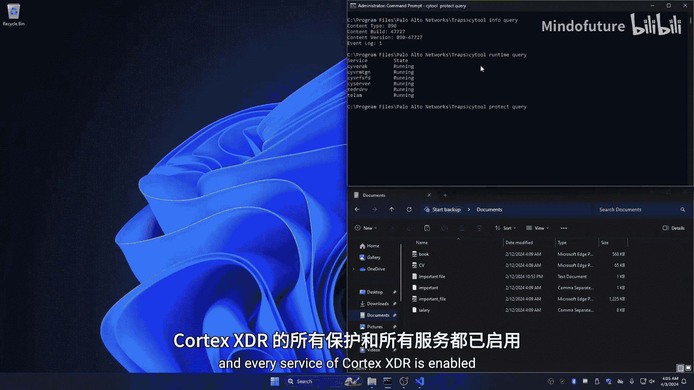
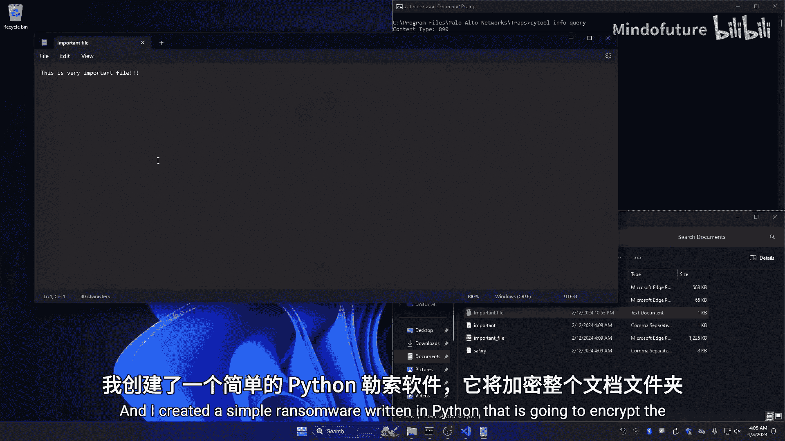
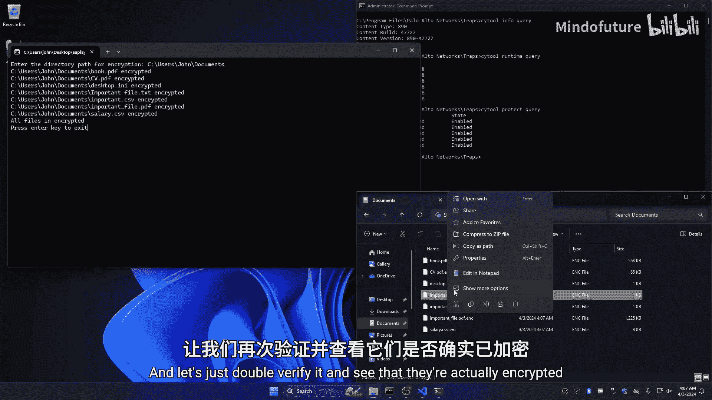
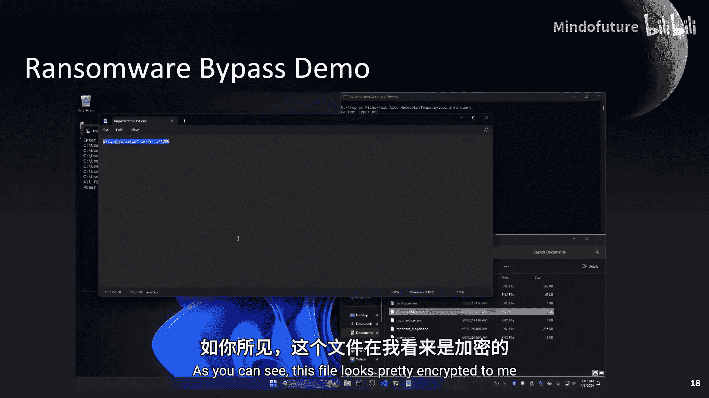
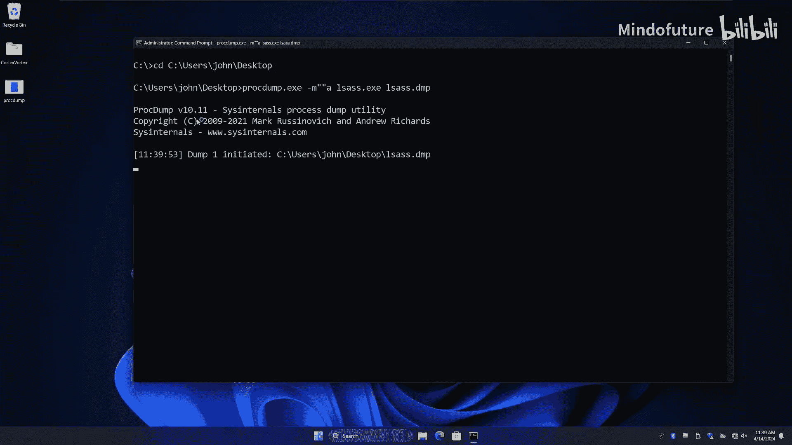
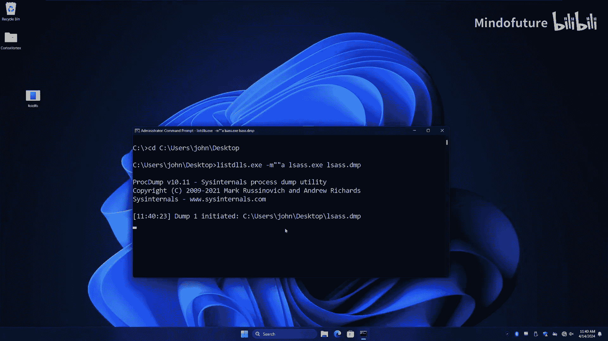
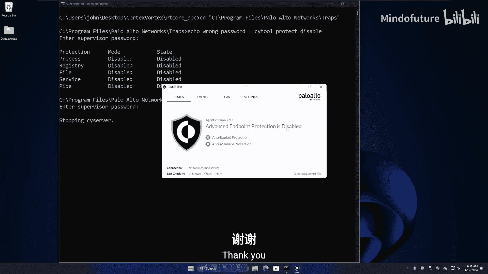
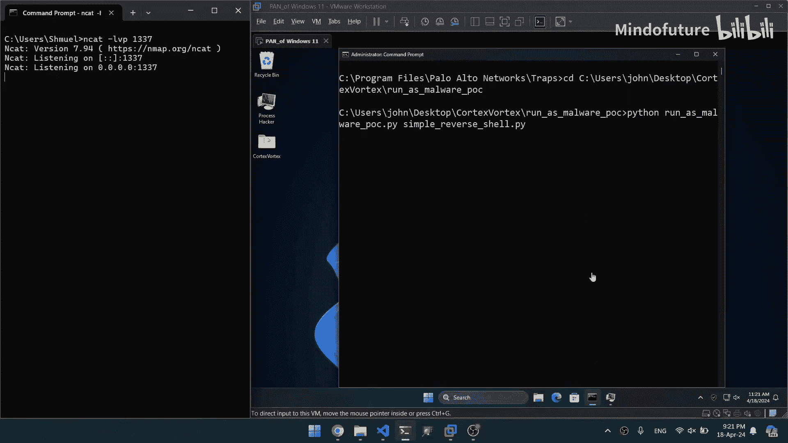
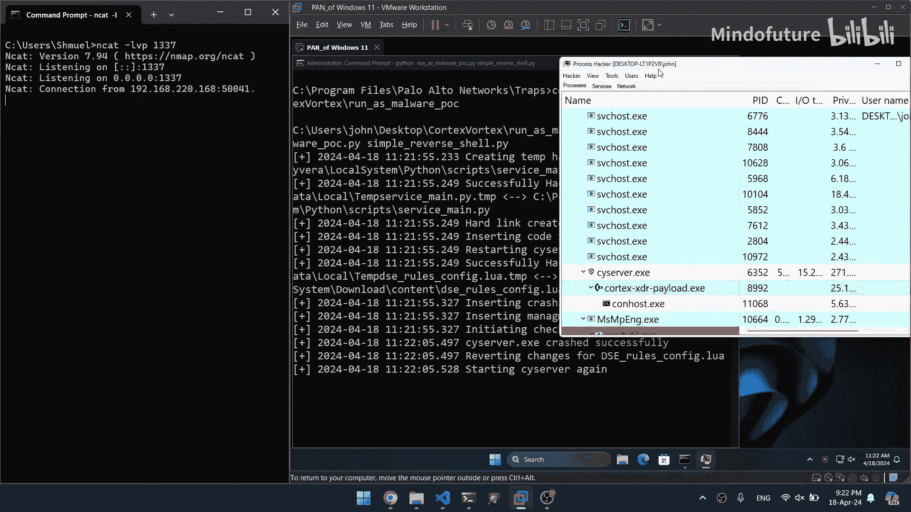
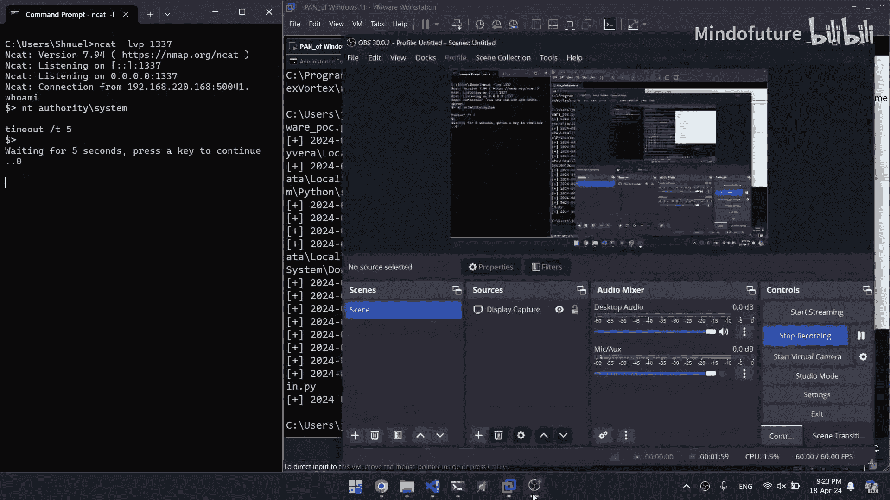

# 019：将EDR重新用作攻击工具 🛡️➡️🗡️

在本教程中，我们将学习如何利用端点检测与响应（EDR）系统（以Palo Alto Cortex XDR为例）的设计特性，将其从防御工具转变为攻击者的持久化、高权限恶意软件平台。我们将探讨其策略文件、绕过保护机制的方法，并最终实现在EDR进程内部执行恶意代码。

## 概述与目标 🎯

上一节我们介绍了本次研究的背景。本节中，我们来看看研究的具体目标。

我的研究目标有两个：
1.  开发一个能够无缝集成在EDR内部的恶意软件模型，而不仅仅是绕过它。
2.  确保这个恶意软件符合高级持续性威胁（APT）级别恶意软件的标准，即必须具备持久性、隐蔽性和高权限访问能力。

为了实现这些目标，EDR需要具备三个关键能力：
*   以最高权限运行。
*   其文件防篡改，确保用户无法修改。
*   具备高度的持久性。

基于这些标准，我选择了在企业中广泛使用的Palo Alto Cortex XDR作为研究对象。





## Cortex XDR 工作原理初探 🔍



上一节我们确定了研究目标。本节中，我们来深入了解Cortex XDR的基本工作原理。



首先，我检查了Cortex XDR安装时写入磁盘的文件。在`ProgramData`目录下，我发现了一个名为`content`的文件夹，其中包含大量以`.lua`和`.py`为扩展名的策略规则文件。这些文件是明文存储的，相对容易阅读。

这些文件的数量和性质引发了我的思考：既然这些检测逻辑是公开的，我们是否可以利用它们来设计绕过检测规则的技术？

## 绕过勒索软件防护 🚫➡️✅

上一节我们发现了可读的策略文件。本节中，我们来看一个具体的绕过案例：勒索软件防护。





在`content`文件夹中，我找到了一个名为`ransom.lua`的文件。阅读后，我理解了其防护原理：它在系统各处创建隐藏的诱饵文件（honeypot），任何修改这些文件的尝试都会被检测为可能的勒索软件攻击。

为了使这些诱饵文件对用户和某些程序不可见，开发者维护了一个进程白名单。这个名单明文存储在`ransom.lua`文件中。

以下是绕过步骤：
1.  **识别白名单**：从`ransom.lua`文件中读取受信任的进程名列表。
2.  **伪装进程**：将恶意勒索软件程序重命名为白名单中的某个进程名（例如`svchost.exe`）。
3.  **执行攻击**：以伪装后的进程名运行勒索软件，此时对诱饵文件的加密操作将不会被Cortex XDR阻止。

**核心概念（代码描述）**：
```bash
# 原始恶意程序
malicious_ransomware.exe --encrypt C:\Documents

# 绕过后的执行方式（将程序重命名为白名单中的名称）
copy malicious_ransomware.exe svchost.exe
svchost.exe --encrypt C:\Documents
```
通过这种方式，我们成功绕过了基于进程名的勒索软件防护。

## 绕过LSASS内存转储防护 💾➡️🕵️

成功绕过勒索软件防护后，我进一步测试了其他攻击场景，例如尝试转储LSASS进程内存。

LSASS进程内存中包含敏感凭证信息，因此转储其内存是常见的恶意行为。通常使用`procdump.exe`工具进行转储。首次尝试时，Cortex XDR基于正则表达式（regex）检测并阻止了该命令。

**首次绕过（正则表达式）**：
原始命令：`procdump.exe -ma lsass.exe lsass.dmp`
绕过方法：在命令中插入两个引号，这不会改变命令执行结果，但可以绕过简单的正则表达式检测。
修改后命令：`procdump.exe -ma “”lsass.exe lsass.dmp`

然而，绕过正则表达式检测后，触发了另外四条基于`MiniDumpWriteDump`函数的防护规则。这些规则定义在`content`文件夹的`dse_rules_config.lua`文件中。

**二次绕过（进程白名单）**：
在该lua文件中，我发现了另一个名为`MimiKatzLPMProcsWhitelist`的列表。我将`procdump.exe`重命名为该白名单中的一个名称（例如`listdlls.exe`），成功转储了LSASS内存。

**核心概念（流程描述）**：
1.  检测点1：命令字符串正则匹配 -> 通过插入引号绕过。
2.  检测点2：检测`MiniDumpWriteDump`函数调用 + 进程名 -> 通过伪装进程名绕过。

## 篡改EDR策略文件 ✏️

之前的绕过依赖于读取策略文件。一个更根本的问题是：我们能否直接修改这些策略文件？



尝试修改`content`文件夹中的文件时，即使拥有管理员权限，也会收到“访问被拒绝”的错误。这通常是由文件系统微筛选器驱动程序（Minifilter Driver）实现的保护机制。

**保护机制分析**：
通过逆向工程，我确认了`sf.sfd`驱动负责此保护。它会检查试图以写入权限打开的文件路径是否在其保护列表中，如果在，则拒绝访问。

**绕过方法（硬链接）**：
保护机制基于路径检查。我们可以利用Windows的“硬链接”特性来绕过。硬链接是指向磁盘上相同数据的另一个文件入口。
1.  **思路**：从磁盘上一个不受保护的位置，创建指向受保护策略文件的硬链接。
2.  **挑战**：使用标准`mklink`命令创建硬链接需要写权限，会被微筛选器阻止。
3.  **解决**：利用James Forshaw（Google Project Zero）的研究，使用一种无需写属性即可创建硬链接的工具。使用该工具成功创建了到策略文件的硬链接。

现在，我们可以通过修改这个硬链接文件来间接修改原始的策略文件。

## 实现持久化与高权限恶意软件 🧩

上一节我们获得了修改策略文件的能力。本节中，我们探讨如何利用这一点实现最终目标：将EDR本身变为恶意软件。

**初步尝试：修改检测规则**
我尝试将一条检测“加载易受攻击驱动”的规则动作从`block`改为`allow`，然后加载一个已知的易受攻击驱动（如`RtCore64.sys`），并利用其漏洞进行内核内存读写，例如修补Cortex XDR管理密码的验证函数，使得任何密码（或无密码）都能通过验证，从而完全控制EDR的开关。



**关键问题：规则重载**
修改文件后，XDR进程并不会自动重新加载这些规则。需要触发规则更新。





**触发更新与拦截**
Cortex XDR提供了一个命令行工具`cytool`，其中`checkin`命令会向管理服务器请求更新（包括策略更新）。但这会从服务器下载新文件，覆盖我们的修改。
**解决方案**：
1.  从`content`文件（如`cc_url`）中找到管理服务器域名。
2.  修改本机`hosts`文件，屏蔽到该域名的连接。
3.  执行`cytool checkin`。此时XDR无法连接服务器，但会尝试重新加载本地的策略文件，从而使我们修改的规则生效。

**进阶攻击：注入并执行代码**
Lua和Python策略文件本质上是代码。我们能否注入自己的恶意代码并让XDR执行？
1.  **Lua代码注入**：在`.lua`规则文件中插入恶意Lua代码（如创建文件、执行命令），并通过`checkin`触发重载。实验发现，某些Lua函数（如`io.popen`）会导致主进程`csagent.x`崩溃，这反而成为了一个可利用点。
2.  **Python代码注入**：在`content`文件夹的Python脚本（如`service_main.py`）中注入恶意代码。该脚本由`cortex_xdr_payload.exe`进程执行。
3.  **触发执行**：修改Python脚本后，利用之前发现的Lua崩溃漏洞，故意触发`csagent.x`进程崩溃并重启。重启后，`cortex_xdr_payload.exe`也会随之重启，并加载执行我们修改过的、包含恶意代码的Python脚本。

**最终效果**：
恶意代码在`cortex_xdr_payload.exe`进程中运行，该进程具有`SYSTEM`权限，且受到EDR自身保护，难以被终止。攻击者从而获得了在目标系统上持久、隐蔽、高权限的后门。

## 演示总结与防御建议 🛡️

在本节课中，我们一起学习了如何逐步将Palo Alto Cortex XDR转变为攻击工具。

**攻击链总结**：
1.  **信息收集**：读取明文策略文件，了解检测逻辑和白名单。
2.  **初始绕过**：利用进程名伪装绕过具体防护（勒索软件、LSASS转储）。
3.  **权限提升**：利用硬链接漏洞篡改策略文件。
4.  **规则操控**：修改规则以允许恶意行为（如加载漏洞驱动）。
5.  **代码注入**：向Lua/Python策略文件中注入恶意代码。
6.  **持久化**：通过触发进程崩溃重载或利用内置服务，使恶意代码在EDR高权限进程中持久运行。

**核心安全启示与缓解建议**：
*   **保护检测逻辑**：检测逻辑是安全产品的核心机密，应加密存储或在内存中解密，避免明文暴露。
*   **改进检测机制**：基于单一特征（如进程名、简单正则）的允许/阻止列表极易被绕过。应结合多因素（如进程路径、签名、父子关系、行为序列）进行判断。
*   **强化自我防护**：对自身文件的保护必须周全，需考虑所有可能的文件操作路径（如硬链接、符号链接、卷影复制等），确保任何篡改企图都能被检测和阻止。
*   **纵深防御**：不要完全依赖单个EDR产品。结合网络流量分析、用户行为分析等其他安全层，建立纵深防御体系。

## 总结

本节课中，我们深入探讨了EDR系统可能被攻击者反向利用的“黑暗面”。通过分析Palo Alto Cortex XDR的案例，我们看到了从信息泄露、规则绕过到最终实现持久化高权限控制的完整攻击路径。这项研究揭示了安全产品在设计时，必须在提供强大防护能力与确保自身绝对安全之间找到平衡。对于防御者而言，理解这些攻击技术有助于更好地评估自身安全架构的韧性，并采取更有效的缓解措施。