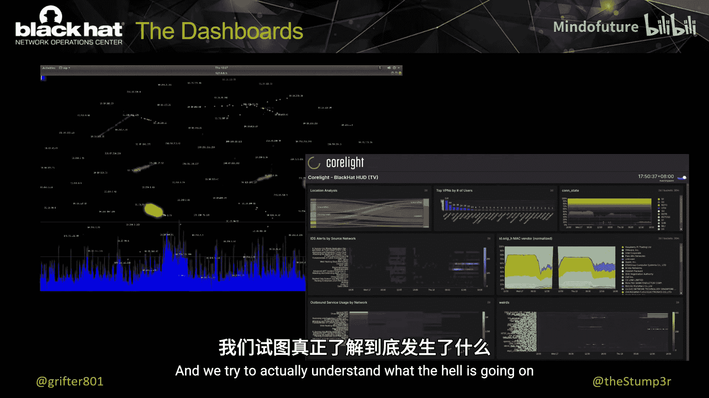

# 020：黑帽亚洲网络运营中心（NOC）报告

在本节课中，我们将学习黑帽亚洲大会网络运营中心（NOC）的构建、运作、技术架构以及在过去几天中观察到的关键网络安全事件与趋势。我们将深入了解NOC团队如何管理一个大型会议网络，并从中发现有趣的安全洞察。

## 团队介绍

大家好，我是Neil Weiller，但在信息安全与黑客社区中，大家更熟悉我的别名Grifter。我的日常工作是在IBM X-Force担任全球主动威胁评估负责人，负责全球的威胁狩猎项目。同时，我也是黑帽大会NOC的负责人之一，这已经是我参与的第78场黑帽大会。

我的同事是Bart。Bart白天是CDW的首席安全解决方案架构师。我们共同负责NOC的运营，但我们并非独自完成这项工作。

## 合作伙伴与团队

NOC的运作离不开我们的合作伙伴。我们与多家顶尖安全厂商合作，共同构建和维护大会网络。

以下是我们的核心合作伙伴名单：
*   **Arista**：提供核心交换机和网络分路器。
*   **Cisco**：提供包括ThousandEyes在内的多种解决方案。
*   **Corelight**：提供网络可见性与安全分析。
*   **Palo Alto Networks**：提供下一代防火墙。
*   **NetWitness**：提供安全信息与事件管理（SIEM）。
*   **MyRepublic**：作为本地合作伙伴，为我们提供了1Gbps的互联网带宽。

这些合作伙伴与我们是一种真正的协作关系。我们基于技术需求选择产品，他们则提供设备和技术专家支持，共同应对挑战。

## 网络架构概述

我们遵循“保持简单”的原则来构建网络。整个架构虽然看起来基础，但旨在高效可靠。

我们的网络架构流程如下：
1.  互联网接入来自MyRepublic的1Gbps带宽，连接至Arista交换机。
2.  流量经过由Palo Alto提供的高可用防火墙集群，作为网络边界。
3.  之后进入由Arista提供的核心交换机。
4.  Arista还在核心层之下提供了网络分路器，将流量镜像给右侧的各类安全分析工具。
5.  与我们在拉斯维加斯的部署不同，在新加坡我们利用了滨海湾金沙会议中心的现有基础设施（如分布层交换机）来连接注册Wi-Fi、Arsenal区域等。
6.  我们还有独立的管理网络用于所有工具和NOC自身。

一个值得注意的新增部分是Cisco的ThousandEyes。我们在Wi-Fi、核心网络和教室等关键位置部署了其探针，这使我们能够主动监控网络性能，发现问题并快速修复。

## 网络搭建与集成

我们通常在活动前几天抵达现场，并在两天内搭建起一个企业级网络。这是一个高强度、快节奏的过程。

在后台，各个合作伙伴的工具之间进行了深度集成与自动化。我们正在将大量数据相互关联和丰富，并将其转化为可操作的信息，以提升整体安全运营效率。

一个令人自豪的成就是，即使在商业市场上是竞争对手的公司（如Cisco和Palo Alto），在NOC项目中也能紧密合作。有些产品的功能改进和集成，正是源于在黑帽大会这样真实、高负载环境中的测试与反馈。

此外，我们还会在Twitch上直播NOC的实况，让无法亲临现场的人也能了解我们的工作。

## 可视化仪表盘

我们使用了大量仪表盘来理解网络状况。这些仪表盘不仅外观炫酷，更重要的是其承载的数据价值。

其中一个关键工具是名为`OIP`的开源项目。它以动态点图形式展示网络中最活跃的主机。
*   **绿色**代表TCP流量。
*   **红色**代表UDP流量。
*   **白色**代表ICMP流量。
*   点的大小代表了数据包的大小。

这种可视化能帮助我们快速发现异常，例如大规模扫描活动会像烟花一样从单个主机向外爆发。

其他仪表盘则提供了更具体的数据，例如：
*   发送给恶意软件沙箱进行分析的样本数量（本次大会已超过4800个）。
*   根据MITRE ATT&CK框架归类的安全事件。
*   事件的地理来源与目的地。
*   来自Palo Alto Cortex XSIAM的自动化事件关联与严重性分析。
*   基于ThousandEyes数据的物理设备位置与网络性能监控。

这些仪表盘也在NOC前台的屏幕上轮播，参会者可以实时看到网络状态。

## 实战挑战：应对高危漏洞

在真实运营中，NOC同样需要应对突发安全事件。本次大会期间，我们就遭遇了Palo Alto Networks产品的一个高危漏洞（CVE）的挑战。

事件发生时，我们正在飞往现场的途中。我们立即与现场的Palo Alto团队协作，根据最初的缓解建议采取了措施（例如禁用遥测功能）。然而，随后漏洞信息更新，表明风险更高。我们登录设备检查，确实发现了针对该漏洞的利用尝试。幸运的是，Palo Alto的签名及时拦截了所有攻击。

这个案例说明，即使在黑帽大会这样的特殊环境中，运营团队也需要像企业SOC一样，随时准备应对突如其来的关键漏洞。

## 网络流量数据分析

接下来，我们分析一下本次大会的网络流量数据。

**DNS请求**：我们强制将所有DNS查询指向Cisco Umbrella以便分析，共记录了1650万次DNS请求。热门类别包括：
*   应用更新：Debian
*   聊天工具：Slack
*   加密货币挖矿：NiceHash
*   社交：Tinder

**无线网络使用情况**：
*   约有1500个独立的无线客户端。
*   总流量超过10TB。
*   网络持续负载在500-750Mbps之间，并多次达到1Gbps的带宽上限。
*   流量最高的单个用户传输了超过700GB的数据。

**加密流量趋势**：
*   约80%的流量被加密。
*   主要加密协议为TLS 1.2和1.3。
*   值得注意的是，在亚洲区域，加密流量的比例从过去的90%以上呈下降趋势，这可能与某些应用的设计有关。

**流量分类**：
*   按子网划分，流量最大的通常是视听设备团队，消耗了总带宽的三分之一。
*   在应用层面，Microsoft更新消耗了260GB带宽，许多人一到会场就开始更新系统。
*   总体而言，97%的流量是被允许的。我们检测到的威胁数量相对总流量极少，这正是我们所说的“在针堆里找针”——几乎所有流量看起来都“可疑”，但真正的恶意攻击很少。

## 人工智能与机器学习应用

今年，我们开始探索AI和机器学习（ML）在网络分析中的应用。

Corelight的团队正在测试其产品中的机器学习功能。例如，通过分析我们骨干网络设备的管理流量，ML模型可以将所有数据点可视化。正常情况下，数据点会聚集在一起；而异常点（如某台设备仅被SSH登录了一两次）则会偏离集群，这能快速指引我们关注异常行为。

同样，对于培训教室，我们可以基于安全警报进行聚类分析。正常的、进行相同实验的教室，其数据点会集中；而活动各异的教室，数据点则会分散。这帮助狩猎团队将精力集中在真正的异常值上，而不是去调查主流集群。

## 常见安全问题与案例

年复一年，我们在大会上观察到一些反复出现的安全问题。

**配置错误与信息泄露**：
*   **VPN分割隧道配置错误**：用户以为自己在使用VPN，实则一半流量暴露在公网。
*   **LDAP协议暴露在互联网**：许多组织机构仍存在此问题。
*   **明文传输凭证**：即使密码很强，通过明文传输也毫无意义。
*   **移动应用泄露隐私**：我们观察到天气应用明文传输设备的精确经纬度；某些应用在登录时明文传输令牌；甚至有应用枚举并上报设备上安装的所有其他应用。

**威胁狩猎发现**：
*   **案例一：被入侵的演讲者设备**：一位演讲者将笔记本电脑接入网络后，其设备立即开始大量联系已知的命令与控制（C2）服务器。经调查，该设备已严重被入侵，尽管用户自称安装了EDR产品。这提醒我们，必须检查设备发出的网络流量。
*   **案例二：攻击关键基础设施**：我们的狩猎团队发现有人从大会网络登录了美国某关键基础设施系统（如水厂）。我们迅速收集证据，找到相关人员并进行了沟通。当事人承认了行为，并表示这只是向朋友演示工具。我们强调，即使在黑帽大会上，攻击他国关键基础设施仍然是非法行为。这个案例表明，我们的监控是有效的，任何非法活动都可能被发现。

## NOC的演进与自动化未来

回顾NOC的发展，我们经历了几个阶段：
1.  **稳定网络**：最初的目标是让网络不再轻易崩溃。
2.  **增加安全**：网络稳定后，开始部署基础安全措施。
3.  **隔离环境**：将不同的培训教室隔离，防止相互攻击。
4.  **引入威胁狩猎**：主动寻找真正的威胁。
5.  **恶意软件沙箱分析**：对可疑文件进行动态分析。
6.  **身份与访问管理（IAM）**：防止未授权的配置变更。
7.  **端点检测与响应（EDR）**：保护我们可控的端点（如注册设备）。
8.  **自动化与扩展**：面对日益增长的数据和规模，引入自动化势在必行。

目前，我们正利用Palo Alto的Cortex XSIAM平台大力推动自动化工作流建设，例如：
*   开发Slack机器人，快速查询设备连接的接入点（AP）位置。
*   整合多源威胁情报（Cisco, Palo Alto, ThreatConnect），一键查询IP的声誉。
*   聚合内部上下文信息，将来自各合作伙伴（Umbrella, Corelight, NetWitness, Palo Alto）关于同一内部IP的所有日志和警报集中展示。

未来的方向是将网络可用性数据（防火墙、交换机、AP、ThousandEyes状态）也整合进来，构建更强大的统一运营仪表盘。

## 总结

本节课中，我们一起学习了黑帽亚洲大会NOC的构建与运作。我们从团队和合作伙伴介绍开始，了解了网络架构、搭建过程以及深度集成的重要性。通过分析流量数据，我们看到了当前的网络使用趋势和加密状况。我们深入探讨了如何利用可视化仪表盘、人工智能和机器学习来增强网络监控与威胁发现。最后，通过几个真实案例，我们强调了常见的配置错误、持续威胁狩猎的价值以及自动化在应对大规模安全运营中的关键作用。记住，安全意识与持续验证是防御的第一道防线，即使在最专业的环境中，威胁也无处不在。