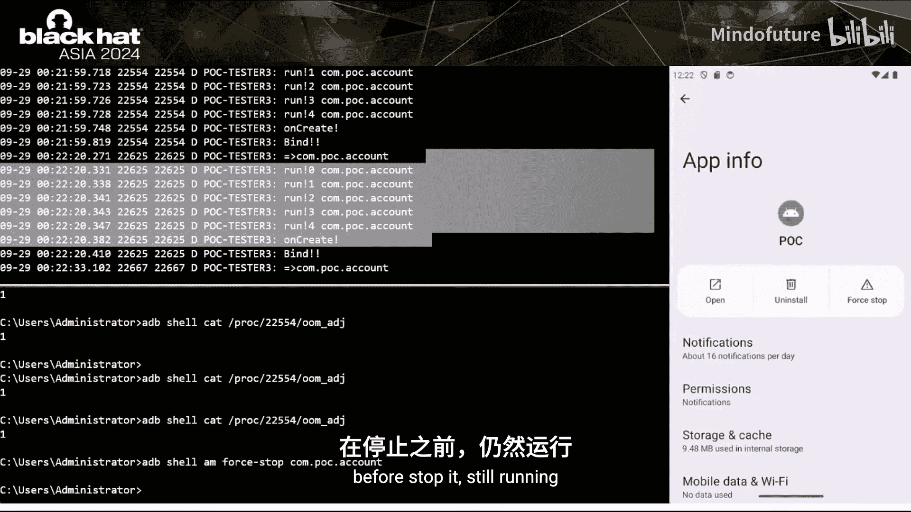
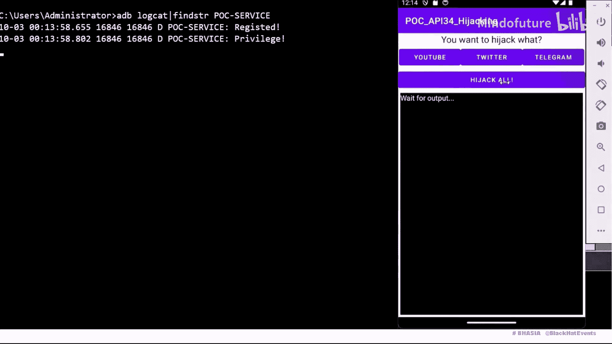

# 021：SystemUI作为邪恶画中画——现代移动设备上的劫持攻击

在本教程中，我们将学习一种针对高版本Android平台的劫持攻击技术。我们将探讨如何利用系统UI和传感器服务中的漏洞，绕过谷歌近年来实施的安全限制，实现无需用户交互、无需危险权限且难以被用户察觉的精确劫持攻击。

## 概述：什么是Activity劫持攻击？

Activity劫持攻击是一种传统攻击手段。许多恶意软件，如勒索软件、银行木马等，常滥用此技术向受信任的应用程序注入恶意内容。攻击者借此可以窃取敏感用户数据或获取危险运行时权限。用户通常在被攻击时毫无察觉。

## 第一部分：传统劫持攻击的工作原理与限制

上一节我们介绍了劫持攻击的基本概念，本节中我们来看看它在旧版Android上是如何工作的，以及谷歌实施了哪些限制。

### 传统攻击流程

我们以Android 4上的一个真实勒索软件“Slocker”为例。该恶意软件会创建一个定时任务，每秒检查前台Activity。如果前台Activity不是勒索软件自身，它会使用`FLAG_ACTIVITY_NEW_TASK`标志启动自身Activity到前台。一旦恶意软件占据前台，它就能将先前的应用程序任务推到后台，从而伪装成受信任的应用程序的身份。这是一种“中间人”攻击。

**为什么恶意软件需要抢占前台？**
要理解这一点，我们需要了解任务栈的概念。根据开发者文档，任务栈是Activity的集合。系统通常将任务栈分为前台任务和后台任务。在大多数情况下，用户一次只能与一个前台任务交互。例如，当你使用“应用一”时，你可以与其前台任务栈顶的Activity交互，但无法同时与后台的其他应用交互。因此，恶意软件必须抢占前台，才能将恶意内容注入到用户屏幕。

### 劫持攻击模拟

以下是模拟劫持攻击的关键步骤：
1.  用户设备上安装了银行支付应用。
2.  后台的恶意软件持续监听所有进程的运行时状态。
3.  当用户点击银行应用时，系统本应将其带到用户面前。
4.  与此同时，后台恶意软件检测到银行应用来到前台，立即注入一个伪造的银行登录页面并抢占前台。

这是一种本地高回报的攻击方案，在旧版Android设备上影响了几乎所有应用。

### 劫持攻击的三个关键要素

我们可以总结出实现精确劫持攻击的三个关键要素：
*   **从后台启动Activity的能力**
*   **从后台检测运行时状态的能力**
*   **在后台持久运行的能力**

缺失其中任何一个要素，都无法实现精确的劫持攻击。

### 谷歌的安全限制与妥协方案

当然，谷歌不会坐视这种攻击发生。近年来，谷歌发布了一系列安全策略和限制。

**1. 运行时状态泄露限制**
*   **API 22之前**：恶意软件可以直接调用特殊接口（如`getRunningTasks`）获取其他应用的运行时状态，无需任何权限。
    ```java
    // 示例：旧版获取运行任务的方法
    ActivityManager am = (ActivityManager) getSystemService(Context.ACTIVITY_SERVICE);
    List<ActivityManager.RunningTaskInfo> tasks = am.getRunningTasks(100);
    ```
*   **API 22之后**：上述接口只能返回调用者自身的数据。
*   **API 26的变通**：应用仍可通过访问其他进程的OOM_ADJ分数来间接判断目标是否在前台。
*   **2017年SELinux策略更新**：增加了新的策略行，拒绝应用访问`/proc/[pid]`目录下的文件，这类似于PID保护。恶意软件从此无法直接访问其他进程的OOM_ADJ分数。
*   **妥协方案**：恶意软件转向使用`UsageStatsManager`等组件间接监听状态。但这需要申请危险的运行时权限（如`PACKAGE_USAGE_STATS`）并引导用户进行复杂的设置交互。

**2. 后台Activity启动限制**
*   **API 29之后**：无特权的应用无法从后台启动Activity。这意味着恶意软件无法从后台向屏幕注入内容，即使它能检测到运行时状态。
*   **妥协方案**：
    *   使用无障碍服务或其他系统服务。
    *   使用`SYSTEM_ALERT_WINDOW`权限覆盖屏幕。
    *   尝试满足开发者文档中列出的BAL限制例外情况（如被系统绑定、拥有全系统生物识别权限等）。但这些例外条件通常极难满足。

**3. 后台执行限制与LMKD**
*   **API 26之后**：后台服务无法持久运行，会获得较高的OOM_ADJ分数（意味着低优先级），并可能被LMKD首先杀死以释放内存。
*   **API 24之后**：隐式广播也被限制，恶意软件无法通过监听广播来自启动。
*   **妥协方案**：谷歌建议开发者启动前台服务以获得较低的OOM_ADJ分数。但这需要持续通知用户，且无法在后台静默运行，容易被用户发现。在某些定制系统（如小米MIUI）中，用户清除最近任务时，前台服务也可能被强制停止。

综上所述，传统的妥协方案通常需要危险权限、复杂的用户交互，并且无法在后台静默运行，导致攻击容易被用户察觉和阻止。

## 第二部分：绕过后台Activity启动限制

上一节我们了解了谷歌设置的重重限制，本节中我们来看看如何找到新的攻击面来绕过这些限制，首先是**后台Activity启动限制**。

这是整个漏洞利用链中最关键的一环。

### BAL检查机制分析

当应用从其应用域启动Activity时，请求由Activity管理器服务处理。系统会执行`shouldAbortBackgroundActivityStart`函数来检查BAL限制。如果检查失败，系统会阻止该后台Activity启动。

随后，系统在`startActivityInner`函数中决定是否将应用带到前台，这取决于BAL检查的结果。如果`mAllowMoveToFront`标志被设置为`false`，那么`moveToFront`函数将永远不会被调用，Activity无法被带到前台。

因此，我们需要关注BAL检查函数，并找到绕过它的方法。

### 利用“可见窗口”例外

开发者文档为BAL检查提供了一些例外情况。例如，**如果应用拥有一个可见窗口，它就可以从后台启动Activity**。最简单的例子是让应用进入画中画模式，此时画中画窗口会被系统视为“可见”。

BAL检查函数会调用`hasActiveVisibleWindow`函数。该函数获取调用者的UID并尝试访问其窗口类型。如果某个窗口的类型值大于`FIRST_SYSTEM_WINDOW`，该窗口就会被系统视为可见。

窗口类型与其Z轴索引相关。在`addWindow`函数中，系统会检查新窗口与现有窗口的层级关系。层级（`mBaseType`）越高，其Z索引也越高，而层级又与`getWindowLayerFromType`相关。因此，窗口类型值越大，Z索引通常也越高。

### 画中画：一个理想的攻击面

问题在于，普通应用通常只能获得基础应用类型的窗口，其Z索引较低，在大多数时候不可见。要获得系统窗口，需要申请`SYSTEM_ALERT_WINDOW`权限，这又涉及复杂的用户交互。

而**画中画**功能是Android系统的一部分，也称为PIP模式。它是谷歌为开发者提供的一个折中方案。任何应用无需特殊权限，都可以随时进入画中画模式，将Activity固定到屏幕顶部的一个小窗口中。PIP窗口由系统UI处理，其窗口类型值大于`FIRST_SYSTEM_WINDOW`，且不需要任何权限。这看起来是一个理想的攻击面。

以YouTube应用为例，当应用进入后台时，它可以进入画中画模式，将其Activity固定在一个小PIP窗口中。因此，系统会认为它处于“可见”状态。

### PIP的挑战与历史漏洞

然而，我们不能直接使用PIP，因为PIP窗口对用户是可见的。即使用透明主题，系统UI也会让PIP窗口对用户可见，并且用户可以随时移除PIP窗口。因此，PIP是一个高度可被察觉的功能。

但PIP存在一个历史漏洞：我们可以为Activity设置一个极小的尺寸（如1x1像素）。系统会据此将PIP窗口调整为1像素大小。用户几乎无法察觉这个微小的点，但关键的是，**系统仍然认为这个窗口是“可见”的**。

该漏洞的补丁很简单：PIP边界算法组件添加了检查，如果传入的尺寸值异常，则只返回固定值。但这个漏洞为我们扩展攻击面提供了思路：我们能否找到一种滥用PIP的方法，创建一个合法的、对用户不可见但对系统可见的系统窗口？

### 深入PIP工作流程

在寻找PIP漏洞之前，我们需要了解PIP的工作原理。

应用调用`enterPictureInPictureMode`，系统AMS会处理此请求，然后调用`moveActivityToPinnedStack`函数。在此函数中，代码会设置窗口模式为PIP，然后调用`scheduleTaskAppeared`回调与系统UI进行IPC通信。系统UI端的`onTaskAppeared`回调函数被触发，系统在此处正式渲染PIP窗口，包括设置动画过渡和窗口尺寸等。

因此，我们可以得到完整的PIP启动流程序列图。要攻击PIP，我们需要找到这个链条中最薄弱的部分。

### 攻击方案一：阻止IPC

第一个方案是尝试阻止AMS与系统UI之间的IPC通信。如前所述，AMS设置PIP模式后，系统会认为应用可见。如果我们在此时阻止IPC，系统UI可能不会渲染PIP窗口，这样我们或许能获得一个不可见但仍处于PIP状态（对系统可见）的窗口。

但不幸的是，在用户空间，我们几乎无法影响服务端（AMS、SystemUI）的代码执行。

### 攻击方案二：攻击系统UI端

第二个方案是尝试攻击系统UI端，例如创建一个异常的窗口类型。`setPictureInPictureParams`接口中的`setSourceRectHint`是一个有趣的接口，它可以自动缩放和裁剪Activity窗口到传入的Rect对象定义的尺寸。如果我们传入一个异常的Rect对象（如1x1像素），我们就能得到一个异常的PIP窗口。

我们编写了POC代码并在Android 13上运行。当然，它通过传入1像素的Rect对象获得了一个1像素的窗口。但半秒后，它又恢复到了正常尺寸。这半秒内发生了什么？是否有办法延长这个异常状态？

### 追踪与利用：动画过渡漏洞

我们需要追踪Rect对象。在`onTaskAppeared`回调函数中，Rect对象被传递给`scheduleAnimateResizePip`。在代码内部，系统设置了一个过渡动画并设定了持续时间（一个由系统定义的固定值，例如4225毫秒）。经过调试，我们了解到这个过渡动画会将PIP窗口调整到Rect对象定义的尺寸。

那么动画播放完毕后会发生什么？过渡动画对象会设置一个回调处理器（`onPipAnimationEnd`接口），动画播放结束后会被调用。在此回调中，代码会调用`finishResize`。`finishResize`会创建一个窗口容器过渡对象，并将其传递给`prepareFinishResizeTransition`，同时传入一个系统定义的正常尺寸Rect对象。然后，它会设置SurfaceControl过渡，并将系统定义的Rect设置给WCT。

接着，系统会将WCT通过IPC传递给系统服务端。在IPC之前，系统UI端会从WCT获取ST，然后通过IPC传递。系统服务端随后会进入`setMainWindowSizeTransition`。在这个过渡中，系统会直接调用`merge`操作来在屏幕上渲染LCC。这个操作会导致PIP窗口恢复到正常尺寸。

### 针对Android 12的绕过

我们的目标是尝试阻止`merge`操作。我们比较了该函数的多个分支，发现Android 12有一个代码变更。从其提交详情来看，这是一个功能补丁而非安全补丁，因此分析Android 12仍有价值。

在Android 12中，`setMainWindowSizeTransition`函数没有调用`merge`操作，而是将ST设置给一个全局成员。我们跟踪这个全局成员，发现`setSurfaceBoundariesLocked`函数会获取这个ST。我们继续跟踪，发现了一个熟悉的函数`prepareSurface`，它属于ActivityRecord组件，与Activity启动和渲染相关。这意味着我们可以从用户空间间接控制这个调用链。

总结一下：
*   **Android 13**：`setMainWindowSizeTransition`会直接调用`merge`，我们几乎无法阻止PIP恢复正常，因为整个链条由系统UI处理。
*   **Android 12**：该函数将ST设置给全局成员，然后在Activity操作中启动一个链条并访问它，最后代码才会`merge`。如果我们能操纵这个操作，也许`merge`操作就不会被调用。

我们成功实现了第一个CVE利用。你可以在屏幕上看到一个非常小的点，它对用户来说难以察觉且不可见。这个PIP可以持续停留在手机中，因为我们“冻结”了系统UI。

但这仍然是针对Android 12的绕过，我们需要一个适用于Android 13及之后的绕过方法。

### 新的攻击面：`makeLaunchIntoPip`函数

我们查看API差异列表，发现了一个新的攻击面：`makeLaunchIntoPip`函数。这个函数返回一个ActivityOptions对象，你可以将其视为Activity启动的附加选项。

在代码内部，该函数会将接收到的PIP参数通过一个特定的键（`KEY_LAUNCH_INTO_PIP`）保存到Bundle对象中。然后，这个Bundle可用于为Activity启动设置选项。

我们尝试将Bundle对象放入Activity启动链中。Bundle最终会被传递给`startActivityInner`函数，这个函数我们之前分析过，它会在应用通过BAL限制检查后调用`moveToFront`。

那么Bundle对象在代码内部做了什么？在代码中，会调用`isLaunchIntoPip`来检查Bundle是否包含特定的键。触发后，代码会直接调用`moveActivityToPinnedStack`，**而不进行任何其他检查，包括BAL限制检查**。

这意味着我们的恶意软件可以随时从后台启动Activity，并直接进入画中画模式。这样，我们就获得了针对Android 13及之后版本的新CVE。

## 第三部分：绕过运行时状态检测限制

上一节我们成功绕过了BAL限制，本节中我们来看看如何绕过第二个障碍：**运行时状态检测限制**。

这是在开发过程中遇到的一个Bug。你可以在日志中看到`IllegalStateException`异常。该异常在我合并代码后发生：合并前，我在前台使用`bindService`；合并后，我使用了`startService`。查阅开发者文档后，我发现`startService`受到后台执行限制的约束，而`bindService`则不然，这就是崩溃的原因。

我们可以利用这个限制，将其转变为一种后台检测器，目标是那些导出的Service组件。

以下是实现原理：
1.  从后台尝试启动目标的导出Service组件。
2.  如果目标处于后台，系统端会返回ComponentName，这会导致用户空间抛出`IllegalStateException`异常。
3.  我们可以在用户空间捕获这个异常。

这意味着我们可以通过另一种方式检测目标是否来到前台。这个漏洞目前仍在等待CVE编号分配。

由于时间关系，其他一些绕过状态检测的技巧，请参阅我的白皮书。

## 第四部分：实现后台持久化进程

本节我们将探讨如何绕过LMKD，实现**在后台持久运行的进程**。

在讨论LMKD之前，我们需要了解OOM_ADJ分数。分数越高，意味着进程优先级越低。系统会持续检查后台进程，其优先级越来越低，最终被LMKD杀死。

我们可以启动前台服务，前台服务通常能获得200的分数（较高优先级）。但如前所述，前台服务无法在后台静默运行。

### 利用系统绑定提升优先级

通过分析系统中计算优先级的代码，我们了解到：**如果一个进程的服务被第三方绑定，且第三方的优先级高于自身，系统会检查客户端优先级是否高于可见应用的ADJ值。如果为真，该应用可以获得与可见应用相当的优先级**。

那么，是否存在被系统进程绑定的方法？在此之前，我们需要了解管理器。框架中有多个管理器，如ActivityManager、WindowManager、PackageManager。普通应用可以通过对应的Binder对象与这些管理器交互。这些管理器通常以系统用户身份运行。我们能否滥用这些管理器？

### 案例研究：无障碍服务管理器

以无障碍服务为例。无障碍功能由无障碍服务管理器处理。普通应用在使用此功能前，需要在清单中声明特定的Intent过滤器，该过滤器指向一个特定的应用服务组件。

无障碍服务管理器首先会通过Intent过滤器找到想要访问此功能的应用。然后，它会在代码内部创建一个连接对象，该对象指向此应用。接着，代码会调用函数绑定到该应用。

此时，我们的POC进程就获得了高优先级，因为它被系统进程绑定了。但是，无障碍功能需要危险的运行时权限，因此我们不会使用它来实现持久化进程。

### 理想的攻击面：账户管理器

我们发现了另一个管理器：**账户管理器**。这个API从API 5（2009年）就已存在。该管理器用于管理设备账户。同时，要使用这些组件，普通应用也需要声明特定的过滤器。**关键点在于，使用此组件不需要申请危险的运行时权限**。

因此，我们有机会通过此管理器调用账户接口。系统会创建系统对象来指向我们的核心应用，然后系统会调用此系统对象的函数，这将导致系统回调到我们的POC代码。我们的POC进程从而获得高优先级且用户难以察觉。

还有一些技巧可以使账户管理器持续绑定到普通应用，从而使进程无法被杀死。由于时间原因，我们不在此详述，相关限制和技巧可以在我的白皮书中找到。

### 持久化进程演示

以下是持久化进程的代码视频演示：
1.  检查Android版本为API 34。
2.  启动POC进程，POC开始运行。
3.  将该应用置于后台。
4.  检查其OOM_ADJ分数，显示为高优先级。
5.  尝试强制停止该应用，但POC仍在运行，无法被`am force-stop`杀死。
6.  再次检查其OOM_ADJ分数，仍为高优先级。
7.  尝试在ADB中杀死它，在停止前它仍在运行。

## 第五部分：完整的劫持攻击武器化演示

现在，我们将结合所有绕过技术，进行完整的劫持攻击武器化演示。

演示环境为Android 14。我们需要劫持三个不同的应用。



以下是演示步骤：
1.  首先运行目标应用，确保它们正常运行。
2.  启动我们的恶意POC进程。
3.  点击“开始劫持”按钮，POC开始检测运行时状态。
4.  依次点击三个目标应用（如Chrome、YouTube、Telegram），观察它们均被成功劫持，显示为伪造的登录页面。

## 总结



在本教程中，我们一起学习了针对高版本Android平台的现代劫持攻击技术。我们回顾了传统Activity劫持攻击的原理及其三个关键要素，并详细分析了谷歌为应对此类攻击实施的多重安全限制。随后，我们深入探讨了如何通过发现和利用系统UI（特别是画中画功能）中的漏洞、运行时状态检测的异常行为以及系统管理器（如账户管理器）的绑定机制，来逐一绕过这些限制。最终，我们展示了如何将这些技术组合起来，实现一种无需用户交互、无需危险权限、难以被察觉且能在后台持久运行的精确劫持攻击。这项研究揭示了即使在不断加固的现代移动操作系统中，攻击面依然存在，强调了持续进行安全研究和防御的重要性。