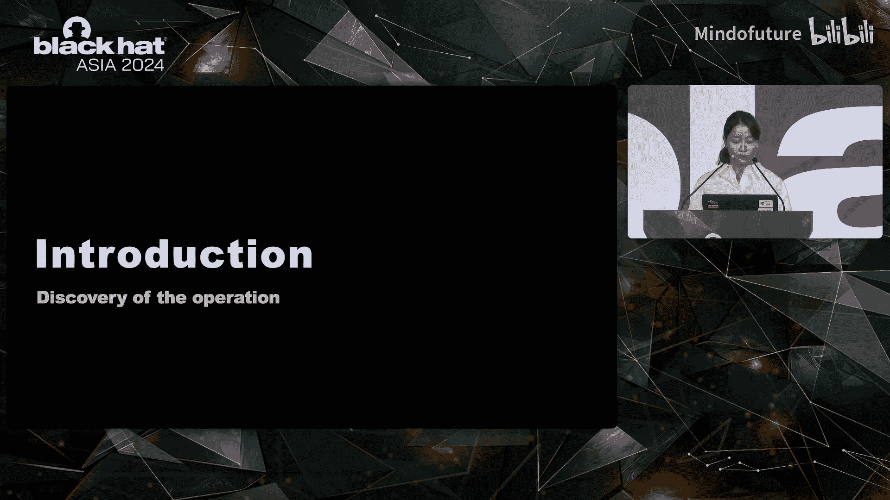
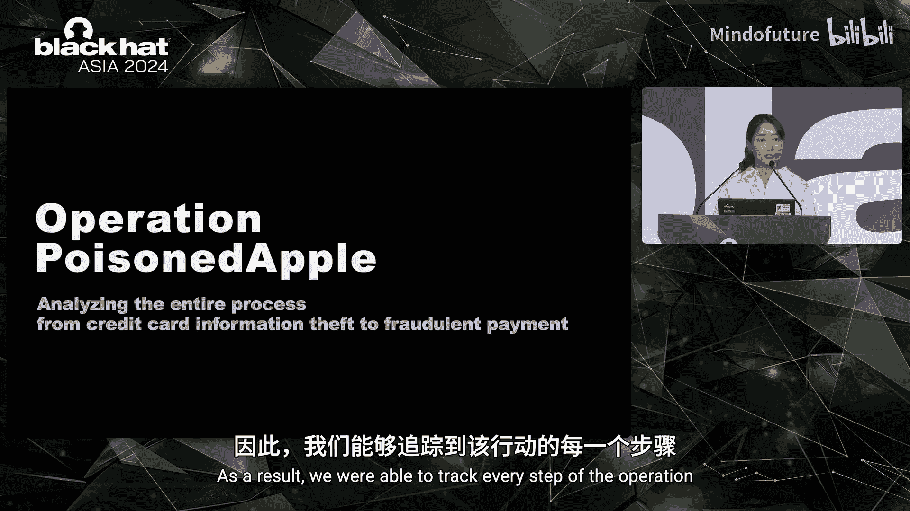
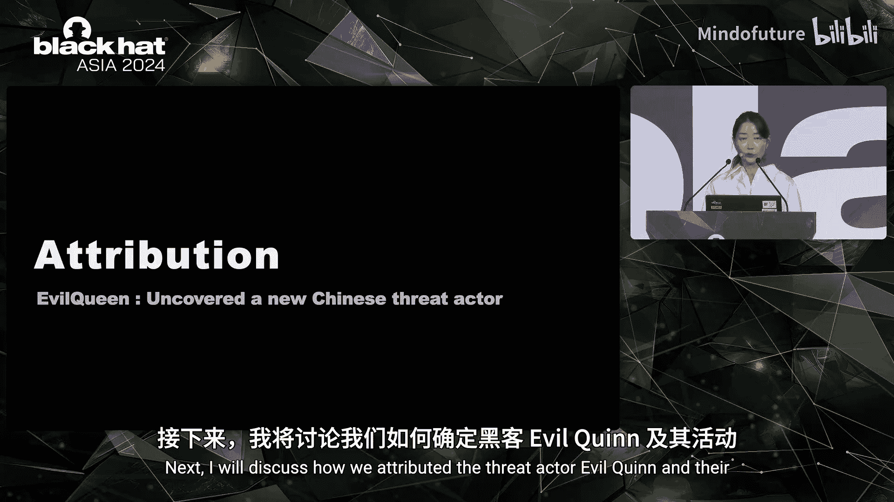

# 022：追踪信用卡信息窃取与欺诈支付行动

在本课程中，我们将学习如何分析一个名为“毒苹果行动”的复杂网络犯罪活动。该行动在过去两年间针对韩国，涉及信用卡信息窃取和欺诈支付。我们将从发现过程开始，逐步剖析攻击者的手法、技术细节、变现策略，并最终追踪到背后的威胁组织。

## 引言：行动的发现与特殊性

上一节我们介绍了课程概述，本节中我们来看看“毒苹果行动”是如何被发现的，以及它为何在韩国显得尤为特殊。

2022年9月，我们在一个在线商店的结账流程中发现了一个钓鱼支付页面。该页面被插入到正常的结账流程中，旨在窃取用户的信用卡和个人信息。

在韩国金融领域，这种类型的钓鱼页面对我们来说是新的。因此，最初这个案例被视为孤立事件。在分析了页面的功能后，我们联系了该网站要求将其移除。

然而，两个月后，相同的页面在其他在线商店中被发现。我们意识到这不再是一个孤立事件，而是一个更广泛的问题。因此，我们分析了两个被入侵网站之间的共同点。

起初，我们怀疑是一个以使用JavaScript注入进行卡片侧录攻击而闻名的著名卡片团伙。但我们发现，服务器端代码会在用户结账时将其重定向到钓鱼页面，这表明其技术手段与那个卡片团伙不同。

此外，该在线商店构建平台在韩国被广泛使用。基于此，我们开发了一个概念验证代码来检测钓鱼支付页面。

我们利用被入侵网站的UI特征，收集并分析了超过5000个使用该电商平台的域名。结果，我们发现了超过50个托管着相同钓鱼页面的在线商店，这表明攻击规模巨大，促使我们开始进行详细分析。

我们随后揭示了以下攻击流程。该行动的最终目标是经济利益。为了实现这一目标，威胁行为者预先分析了韩国的在线信用卡支付系统。

之后，他们入侵在线商店并插入钓鱼页面以窃取用户信息。然后，他们利用窃取的信息，通过巧妙的计划进行欺诈支付来变现。

他们的计划之一涉及在二手交易平台上使用苹果产品进行诈骗，类似于《白雪公主和七个小矮人》故事中用毒苹果引诱公主的情节。受此启发，我们将此行动命名为“毒苹果行动”。

此外，我们识别出一个新的威胁行为者，他们执行了包括此行动在内的、针对亚洲国家的各种攻击。我们将其命名为“Iberqui”，并追踪了他们的活动。

在深入详细分析之前，让我解释一下为什么这次行动值得注意。

首先，与其他国家相比，韩国的在线卡片支付系统是安全的。在其他国家，在线交易通常只需要物理卡片详细信息，如卡号、有效期和CVV码。而韩国需要额外的认证程序。

这里的认证涉及各种信息，如卡片密码、发卡行提供的附加密码、手机验证，甚至居民身份证号码。威胁行为者通过一个钓鱼支付页面成功收集了所有这些信息，这表明他们对韩国的在线支付系统有深刻理解，并完美地针对了该国。

其次，虽然大多数攻击者通常通过在暗网上出售窃取的卡片信息来变现，但这个威胁行为者更进一步。他们不仅窃取信用卡，还亲自参与诈骗和欺诈支付，从而获得了比单纯出售卡片信息更高的利润。因此，我们得以追踪到该行动的每一步。

## 攻击流程剖析：资源、入侵与钓鱼页面

上一节我们了解了行动的背景和特殊性，本节中我们来看看威胁行为者具体使用了哪些资源，以及他们如何入侵网站并部署钓鱼页面。

以下是威胁行为者开发的资源列表。我们发现了他们的网络服务器，该服务器被用于存储工具、脚本，并作为收集窃取信息的网关。他们使用了Cloudflare等服务来隐藏真实的IP地址。但他们犯了一个错误，在自己的服务器上安装了Web服务器软件，这暴露了真实的服务器IP地址。

他们在托管服务提供商处设置了网络服务器，并创建了一个钓鱼域名，该域名模仿了一家真实支付网关公司的域名。

他们的软件包含了各种工具，如文件管理器、数据库管理工具等。此外，后来还发现他们也使用窃取的卡片来支付其域名的注册费用。

为了获得对在线商店的初始访问权限，威胁行为者采用了多种方法。他们利用SQL注入获取管理员凭证。他们还利用平台漏洞创建了Web Shell，允许他们在无需认证的情况下创建自己的后门。此外，他们还入侵了网站的管理员面板。

在某些情况下，他们上传了包含所有必要钓鱼相关组件的压缩文件形式的漏洞利用工具包。基于中国菜刀的Web Shell和反向Shell也被安装在受入侵的网络服务器上。

基于中国菜刀的Web Shell具有查看和上传文件、发送命令和建立连接等基本功能。通过这个Web Shell，威胁行为者持续访问受害系统并执行命令。

接下来，解释一下钓鱼支付页面是如何工作的。所有被入侵的在线商店都基于PHP Web服务器。在操纵了支付页面后，威胁行为者通过多个恶意的PHP文件收集信息。

首先，威胁行为者在商店端的真实支付页面上，将支付网关域名替换为他们自己的域名。因此，用户被重定向到他们的域名。在未被入侵的网站上，点击结账会将用户直接导向支付网关的真实页面。然而，在被入侵的网站上，用户被重定向到钓鱼页面。

用户在那里输入详细信息后，这些信息被发送到威胁行为者的服务器，然后用户被导向真实的支付页面以完成交易。此外，他们还通过调用存储在数据库中的会话数据，获取用户的个人信息，包括ID和密码。

他们利用PHP环境变量捕获用户的IP地址、浏览器详情和设备信息。最后，所有收集到的信息都被传输到威胁行为者的服务器并存储在他们的数据库中。

窃取的信息总共包含14个项目，如下表所列。

| 信息类别 | 具体内容 |
| :--- | :--- |
| 支付信息 | 卡号、有效期、CVV、卡片密码、附加密码 |
| 个人信息 | 姓名、居民身份证号、手机号、邮箱、地址 |
| 会话信息 | 用户ID、登录密码 |
| 设备信息 | IP地址、用户代理 |

此外，威胁行为者采用了各种规避技术，以防止商店管理员或用户检测到钓鱼页面。

以下是他们使用的主要规避技术：
*   **文件名伪装**：他们将钓鱼页面的文件名伪装成真实的支付模块，然后将其上传到与真实模块相同的路径。
*   **时间控制**：页面仅在平日夜晚和周末暴露。并且，它只在用户首次访问时出现。通过检查网站Cookie，在用户回访时显示真实的支付页面。
*   **UI模仿进化**：钓鱼页面的用户界面随时间演变。最初，他们没有模仿特定公司。逐渐地，他们开始创建与主要卡片公司和支付网关公司完全相同的钓鱼页面，使用户若不仔细检查网站地址则无法察觉。

因此，钓鱼支付页面得以在较长时间内保持活跃。

## 变现策略：巧妙的欺诈支付手法

上一节我们剖析了攻击者的入侵和钓鱼技术，本节中我们来看看他们如何将窃取的信息变现，这是本次调查中最有趣的方面。

他们的方法堪称巧妙。他们使用窃取的信用卡在三个不同的前台平台上进行欺诈支付，每个平台都采用了独特的方法：一个二手交易平台、一个开放市场以及在线苹果商店。

以下是每个案例的详细说明。

**案例一：虚假购买与退款诈骗**
许多韩国内容交易平台提供卡片支付服务。威胁行为者在此类平台上为列出的商品进行欺诈支付。然后，他们迅速联系卖家，借口诸如“我本想把这个当礼物送人，但我朋友已经有一个了”。在此对话中，他们要求退款，说：“我申请取消购买，你留下20美元，退还我180美元。”从卖家的角度来看，这就像在没有实际销售的情况下得到了免费的钱。这导致他们将钱存入威胁行为者的账户，最终造成卡片持有人的损失。

**案例二：虚假销售与三角发货**
威胁行为者在二手交易平台上发布销售信息，以折扣价提供全新的电子产品。感兴趣的买家通过平台聊天联系他们，并将现金转账到他们的账户。三角发货过程非常巧妙。威胁行为者使用窃取的信用卡在一个在线市场上为第三方的商品发起欺诈支付。当时，他们在收货地址处填写了买家的地址，以确保商品直接寄送给买家。

**案例三：利用苹果线下提货政策的诈骗**
这是最具创新性的案例。威胁行为者专注于销售苹果产品，欺诈支付发生在在线苹果商店。在苹果在线商店，你可以使用信用卡购买商品，并让他人代为提货。他们诱骗人们购买苹果产品以利用此政策。当买家表示兴趣时，他们通知买家将商品现金转账给他们，然后去附近的苹果商店提取新产品。如果买家同意，他们就用窃取的卡片在在线苹果商店为商品进行欺诈支付，并在收件人详细信息栏中填写买家的信息。实际上，这个骗局在短时间内造成了最大的财务损失。

## 威胁归因：追踪Iberqui组织

上一节我们探讨了攻击者的变现手法，本节中我们来看看如何将这一系列攻击归因于一个名为“Iberqui”的特定威胁组织。

我们发现他们犯了一个操作安全错误，将他们的电子邮件地址直接嵌入到钓鱼支付页面的源代码中。他们始终使用该电子邮件地址中的一个独特昵称，导致该昵称在多个基础设施中暴露。这使我们能够发现关于他们身份和策略的关键信息。

基于此，我们利用各种OSINT工具找到了多个与Iberqui相关的域名。特别是，我们在“毒苹果行动”的C2服务器上发现了一个名为 `test.php` 的网页。该网页提供了对服务器整个文件列表的访问权限，包括像 `phpMyAdmin` 这样敏感的数据库管理页面。

此外，其中一个域名曾作为分发恶意软件的通用C2服务器，在过去对韩国造成了重大经济损失。该域名是通过一家中国ISP注册的，暗示其与中国有关联，因为恶意资源也是中文的。

随着我们深入挖掘，我们偶然发现了包含他们电子邮件地址和密码的凭证存储文件。似乎他们的设备存在漏洞，导致了信息泄露。我们识别出了四个额外的电子邮件地址及其关联域名，从而扩展了我们对其活动的了解。

同时，在2009年至2016年间，他们试图通过Web Shell或Iframe注入攻击来入侵韩国网站。其中一些被入侵的站点仍然可以在谷歌的存档中访问。

接下来，我们公司的金融安全研究所通过金融行业安全监控和调查，建立了自己的威胁情报库。通过将我们的情报与Iberqui的指标相关联，我们发现了全球范围的攻击活动。这是完整的攻击时间线。

我们最初在2023年识别出他们的活动，但很明显他们自2009年以来就一直在进行攻击。在他们各种攻击中，“毒苹果行动”影响最为重大，持续时间长且产生了巨额利润。在“毒苹果行动”期间，他们也继续进行其他以经济利益为动机的攻击。最近的观察表明，恶意活动仍在持续。

他们继续利用“毒苹果行动”的基础设施作为攻击跳板，并且有迹象表明他们正在构建新的基础设施以发起新的攻击。

以下是他们近期攻击的详细信息。在检查了与Iberqui电子邮件地址关联的域名列表后，他们最近使用“Mask”主题创建了一个官方网站。“Mask”是一种流行的加密货币钱包服务，似乎威胁行为者意图窃取钱包相关凭证。由于钓鱼域名具有与台湾和中国相关的顶级域名，表明其重点针对这些地区的用户。

2023年5月，一个先前在“毒苹果行动”中使用的域名被重新利用，用于冒充韩国一家著名的免税店。它是使用在中国流行的“Oaz UI”平台开发的。这个钓鱼网站显示韩语内容，但产品价格却以日元列出，表明这是一种新手法。

2023年7月，我们发现了一个模仿韩国著名奥特莱斯的钓鱼网站，以折扣价提供各种高价值电子产品。该网站上的结账流程包含一个旨在窃取用户信用卡和个人信息的页面，类似于“毒苹果行动”中采用的策略。值得注意的是，他们不是入侵现有的在线商店，而是构建了全新的钓鱼网站。这种模式持续存在，他们使用不同的域名创建了多个钓鱼网站。

他们最近的活动之一涉及通过短信钓鱼分发恶意应用程序，这种方法自去年12月以来在韩国兴起。这种攻击涉及发送宣布某人死亡的消息，并引导他们点击链接，从而安装恶意应用程序。我们在VirusTotal上发现了多个恶意应用程序，全部使用Iberqui的代码签名证书进行签名，旨在窃取和控制关键的P2P数据。

此外，我们在一个中文暗网论坛上发现了一篇使用他们昵称发布的帖子。威胁行为者用简体中文编写了部分钓鱼页面。2015年的域名注册详细信息包含一个中文姓名和电话号码，怀疑与威胁行为者有关联。从2022年开始，他们开始使用隐私保护服务来隐藏这些信息。然而，我们仍然在他们的邮件配置文件中发现了另一个中文姓名和电话号码。根据这些指标，我们推断威胁行为者与中国有密切联系。

总而言之，Iberqui是一个新的威胁行为者，自至少2009年以来一直在对亚洲国家进行网络攻击。他们主要专注于窃取金融信息以获取金钱利益。他们的恶意软件包括钓鱼工具、欺诈支付以及分发各种恶意应用程序。他们利用的工具包括Web Shell、基于PHP的钓鱼页面以及像SQL注入工具这样的漏洞利用工具。

我将分享一个与此相关的有趣案例。最近在韩国，一名罪犯使用窃取的实体信用卡在一家苹果商店和一家奢侈品店进行了约10,000美元的欺诈支付。尽管警方提出请求，苹果公司以内部政策为由拒绝提供安全摄像头录像。虽然尚不清楚此事件是否与Iberqui有关，但很明显，由于对苹果产品的高需求，犯罪分子经常利用它们来套现。有趣的是，苹果的一些政策似乎无意中助长了这些活动。因此，我们需要关注相关的威胁。

## 结论与总结

等待结束了。现在给出结论。

让我们总结一下这次行动。威胁行为者Iberqui策划了一场针对韩国和日本在线商店的网络攻击，导致超过50家在线商店被入侵，8000张信用卡和500万条个人记录被泄露。这些欺诈活动产生的收入约为40万美元。

我们公司将所有相关分析汇编成网络威胁情报白皮书。今天，我在此次演讲的同时也将其在线发布。感兴趣的人可以使用这个二维码下载白皮书。

最后，在分析这次行动时，我从两个角度想到了蝴蝶效应。首先，通过从微小线索开始的分析，我们最终发现了在网络上广泛传播的钓鱼页面，并识别出了各种恶意活动。我们得以阻止了一场可能造成更大蝴蝶效应的、规模更大的潜在攻击。

其次，攻击者正在开发新的、巧妙的计划以获取经济利益，例如利用公司政策进行诈骗和变现。这次行动只是一个例子，暗示我们可能只看到了微小蝴蝶的翅膀。为了应对即将到来的更大威胁，持续探索和分享新的技能与战术至关重要。

最后，金融安全研究所、卡片公司和国家警察机构等利益相关者之间的合作在最小化攻击影响方面发挥了关键作用。我们及时与卡片公司分享了被盗卡片信息和欺诈计划。他们重新发行了所有受影响的卡片，并加强了欺诈检测系统的监控，以防止进一步的攻击。此外，我们向当局提供了有关威胁行为者的所有信息，以协助他们的调查。因此，我想强调，这种协作响应对于在面对事件时建立弹性至关重要。

我的演讲到此结束。由于时间有限，如果您有任何问题，请在会议结束后随时找我。谢谢。