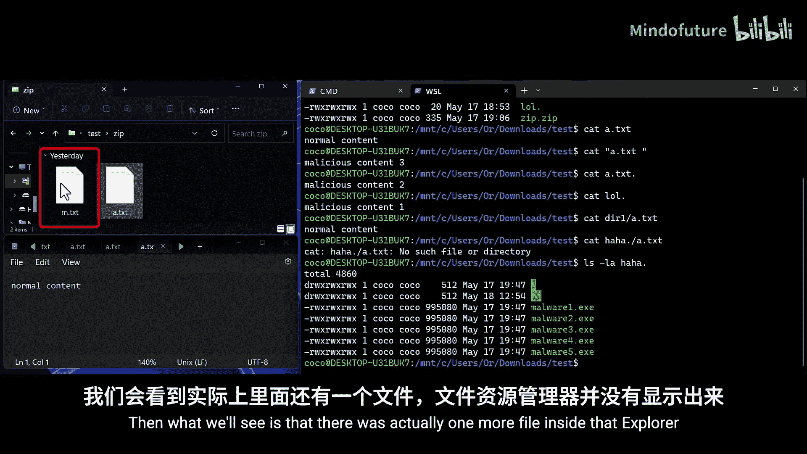
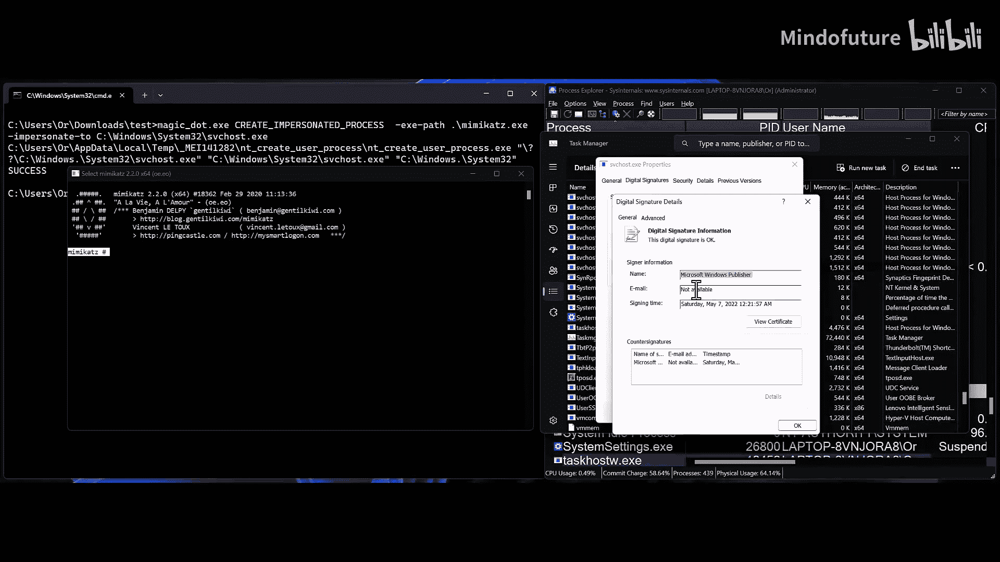
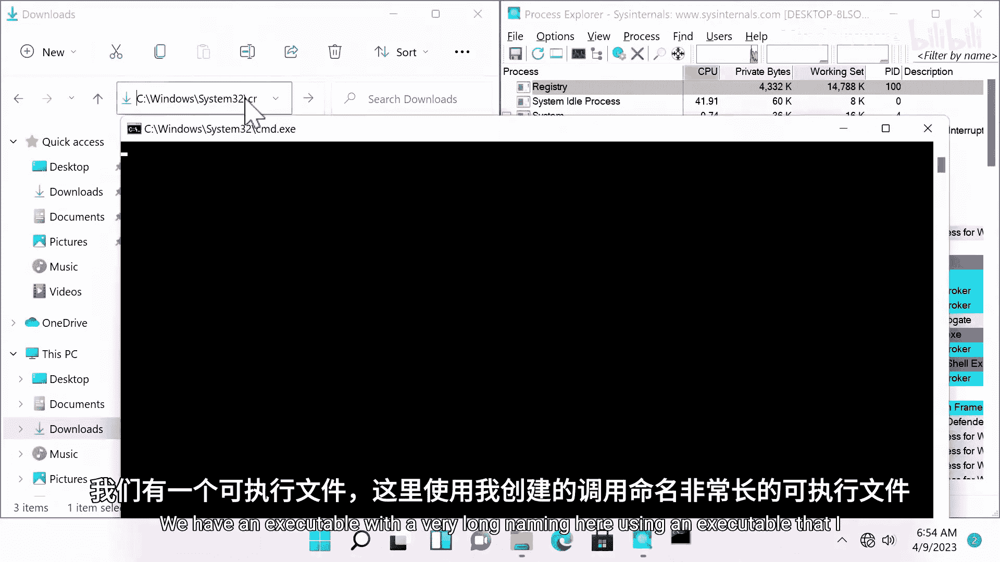
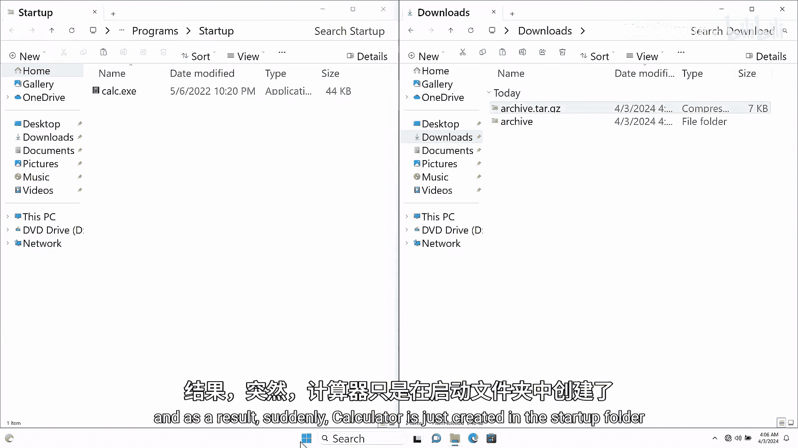
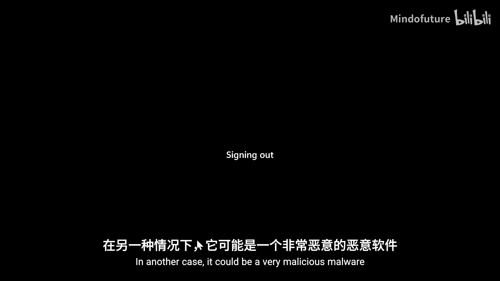

# 023：MagicDot - 消失的点与空格的黑客魔术秀 🎩

在本节课中，我们将学习一个存在于Windows系统中多年的、未修复的已知问题。我们将探讨如何利用这个“魔术”原语，实现无需管理员权限的文件、目录和进程隐藏，并发现基于此的多个安全漏洞。最后，我们将总结微软的修复情况并给出关键启示。

---

## 引言：一个古老的“魔术”问题

上一节我们介绍了本次研究的背景。本节中，我们来深入了解这个问题的起源。

Windows的向后兼容性是一个关键要素。作为全球最流行的桌面操作系统，Windows在演进的同时，必须努力维持其现有客户基础，确保不破坏任何第三方软件或用户已使用的功能。因此，系统中必然存在一些已知但未修复的问题。

这正是我在进行另一个研究项目时遇到的问题。使用NT API，我创建了两个同名文件，但其中一个文件名末尾带有一个点。然后我删除了带点的那个文件。结果，没有点的那个文件反而被删除了。这看起来像纯粹的魔术。因此，我决定学习这个“魔术”原语，并创造我的新黑客魔术秀。

查看微软的文档，我发现了之前不知道的事情。微软明确要求用户不要以空格或点结束文件名或目录名。但作为黑客，当有人告诉我们不要做某事时，我们会怎么做？我们当然会去做。

---

## 核心机制：路径转换的奥秘

在深入探讨如何利用这个已知问题之前，我们必须首先准确理解它的工作原理。

用户空间通常使用的Win32 API调用，本身通常不执行实际操作，而是调用底层的NT函数。另一个事实是，接收路径参数的Win32 API调用，我们通常提供给它们的是DOS路径格式。然而，NT函数并不处理这些路径，而是处理一种称为NT路径的路径类型。

因此，当Win32 API调用NT函数时，必须执行从DOS路径到NT路径的转换。根据我的检查，这个转换由一个通用函数执行，所有路径都会经过一个名为`RtlDosPathNameToRelativeNtPathName`的函数。显然，这个函数会以下列格式移除尾随的点和空格。

基本上，转换后得到的NT路径中，任何路径元素末尾的尾随点都会被移除，而尾随空格仅从最后一个路径元素中移除。

以下是转换示例：
*   `C:\test\file.` -> `C:\test\file`
*   `C:\test\file ` -> `C:\test\file`
*   `C:\test .\file` -> `C:\test .\file` (点被移除，空格保留)
*   `C:\test\dir \file` -> `C:\test\dir \file` (空格不是最后一个路径元素，故保留)

如果你想更深入地了解Windows中的路径类型以及它们如何精确转换为NT路径，我推荐阅读James Forshaw关于此主题的博客文章，信息非常丰富。

---

## 研究目标：无需权限的“无痕”隐藏

在准确理解这个已知问题的工作原理后，我立刻意识到，这样一个“魔术”原语非常适合用来实现一些Rootkit魔术。

我的假设是，如果我使用这种会被转换为其他路径的问题路径，那么也许我就能操纵用户看到的内容。众所周知，Rootkit的主要目标通常是隐藏恶意元素。但为了理解这个Rootkit与我们熟知的普通Rootkit有何不同，让我们先简要回顾一下它们。

内核空间Rootkit在内核中运行，挂钩内核空间API，并操纵返回给用户的信息以隐藏恶意信息。运行内核Rootkit需要管理员权限，并需要处理驱动签名强制、驱动阻止列表、HVCI等障碍和缓解措施。因此，如今在野外几乎看不到内核Rootkit。

用户空间Rootkit当然在用户空间运行，它会将自身注入到进程中，然后再次挂钩这些进程中的API调用，以操纵调用者检索到的信息。运行用户空间Rootkit同样需要管理员权限，因为Rootkit希望从系统上的所有用户（包括管理员）面前隐藏自己，这意味着它需要注入到以管理员权限运行的进程中。

但问题随之而来：攻击者成功入侵了一个完全打补丁的终端，但没有零日提权漏洞，甚至可能不需要管理员权限来实现其目标，这种情况难道不合理吗？这当然可能发生。鉴于此，我找不到任何能够由非特权用户执行、以从系统所有用户（包括管理员）面前隐藏的Rootkit类能力。

我意识到，可能存在一种方法，可以在不成为调用链一部分（像其他Rootkit那样）的情况下，操纵调用者检索到的信息。并且无需任何特权，因为我们需要做的只是命名文件和目录。然而，由于路径转换函数中存在这个问题，我们可以影响它，使其在检索信息的调用链中充当我们的“钩子”。

因此，我研究的第一个目标更新为：不要求任何形式的管理员权限，非特权用户也能执行。

第二个研究目标则更为明显，即证明这种在Windows中留存多年的未修复已知问题是安全风险。证明这一点最简单的方法，就是基于这个已知问题发现漏洞。

---

## 魔术技巧一：隐藏文件与目录

事不宜迟，让我们看看隐藏文件和目录的魔术技巧。

以下是利用此已知问题可以做的事情：

**1. 使用NT路径直接命名**
最直接的方法是使用NT路径命名文件，这样转换就不会发生。只需用点或空格命名它们，或在现有文件名末尾添加点或空格。结果，包括读、写、删除在内的任何文件操作都无法对此文件进行。

**2. 创建“冒名顶替”文件目录**
我们可以更进一步，创建我称之为“冒名顶替文件目录”的东西。例如，如果我们命名一个文件为`benign.`（末尾带点），并将其创建在另一个名为`benign`（无点）的文件所在的目录中。那么，任何针对`benign.`的文件操作，实际上都会作用于已经存在的`benign`文件，因为尾随点会被移除，路径将引用原始文件。因此，如果用户读取`benign.`，将看到`benign`（无点）的内容。这对于目录列表、删除文件等操作同样适用。

**3. 利用短文件名（8.3文件名）**
另一个我们可以利用的向后兼容功能称为短文件名，即8.3文件名。基本上，这些名称是自非常旧的DOS和Windows版本以来就存在的旧类型名称，当然现在已不是默认名称，但我们仍然可以使用路径引用它们。

假设某个目录中有一个名为`a.txt`的文件，我们想创建自己的恶意文件并以某种方式隐藏。我们希望读取我们恶意文件的用户看到的是`a.txt`的内容，而不是其中存在的真实内容。我们可以将`a.txt`的短名称设置为`LOL`，然后在同一目录中将我们的恶意文件命名为`LOL.`。结果，当用户使用DOS路径（最常用的）引用`LOL.`时，尾随点将被移除，最终路径将引用`LOL`，而`LOL`实际上是`a.txt`。因此，任何读取`LOL.`的人都将看到`a.txt`的内容。这同样适用于任何其他文件操作以及目录。

**4. 利用Zip压缩包**
另一种隐藏文件的方法是使用Zip压缩包。基本上，文件资源管理器是受害系统上默认的压缩包解压工具。由于文件资源管理器在处理此类问题路径时存在困难，如果我们只是在Zip压缩包中命名一个带尾随点的文件或目录，那么当文件资源管理器列出或解压压缩包时，我们将完全看不到该文件。所以，如果你只是用尾随点命名它，没人会看到它。

为了演示所有这些功能，我创建了一个演示视频，展示了一个看似正常的测试目录。在视频的第一部分，我们将看到Windows如何查看其内容；第二部分，我们将使用WSL查看其真实内容。

---

## 魔术技巧二：隐藏进程

现在让我们继续看看隐藏进程的魔术技巧。

以下是利用此已知问题可以做的事情：

**1. 创建“不可追踪”进程**
同样，最直接的方法是执行一个来自特定路径的可执行文件。我们可以使用名为`NtCreateUserProcess`的函数，但只有使用NT函数时才能用NT路径运行可执行文件。例如，为了创建一个不可追踪的进程，我们可以从这样一个路径运行可执行文件：当用DOS路径引用时，它会被转换为一个不存在的路径。在这种情况下，例如，如果我们从`C:\Windows.\blahblahblah.exe`运行一个可执行文件，那么当用DOS路径引用时，尾随点将被移除，引用的是真实Windows目录中一个不存在的`blahblah`目录。结果是，进程映像路径引用的可执行文件将无法对其执行任何文件操作，并且任务管理器和Process Explorer等进程列表工具也将无法查看有关该可执行文件的任何属性或信息。

**2. 创建“冒名顶替”进程**
我们可以更进一步，这次创建我称之为“冒名顶替进程”的东西。我们将从这样一个路径运行可执行文件：当用DOS路径引用时，它会被转换为一个现有的、受信任的合法路径，例如受信任的`svchost.exe`可执行文件的路径。所以，如果我们从`C:\Windows.\System32\svchost.exe`运行一个可执行文件，尾随点将再次被移除，引用的是合法的`svchost.exe`。结果，针对进程映像路径引用的可执行文件进行的任何文件操作，都将作用于`svchost.exe`可执行文件。此外，任务管理器和Process Explorer等进程列表工具会告诉我们，我们运行的恶意可执行文件经过微软验证和签名，并且进程分析工具将向我们显示有关那个合法的、受信任的`svchost.exe`可执行文件的信息。

让我们看看这个能力。在这里，我们看到Process Explorer正在运行，我们看到了magic dot工具和Mimikatz。现在，我们将以模仿`svchost.exe`的方式运行Mimikatz。我们运行了Mimikatz，在这里看到它。现在让我们在Process Explorer中找到它。Process Explorer告诉我们，它的路径就是原始`svchost.exe`的路径，并且它经过微软验证和签名。现在，如果我们在任务管理器中找到相同的PID。然后让我们看看这里发生了什么。我们检查它的属性，再次被告知它位于真实的System32文件夹中，并且由微软签名。是的，我们都知道Mimikatz不是由微软签名的。

---

## 漏洞发现：从路径问题到拒绝服务

作为基于此已知问题寻找漏洞的探索之旅的一部分，我逆向工程了Process Explorer，看看是否能找到任何此类漏洞或错误。嗯，我在那里没有找到基于这个已知问题的任何错误，但我确实发现了一个很好的进程分析技术，可以添加到我所谓的非特权Rootkit能力中。

基本上，在逆向工程Process Explorer时，我看到了这行代码，它将一个进程名复制到一个宽字符串缓冲区中，并将缓冲区的最终长度限制为256。为什么是256？因为进程名由其可执行文件名决定，NTFS允许的最大文件名长度为255，所以总体上是合理的。然而，在这行代码之后两行，还有另一个将进程PID复制到同一个宽字符串缓冲区的操作，再次将宽字符串缓冲区的最终长度限制为256。

几秒钟后，你立刻就能注意到，如果我们能命名一个长度为255个字符的进程，那么添加PID后，我们肯定可以超过这个限制。但这对我们有什么帮助呢？因为`wcscat_s`函数是一个安全的C运行时函数。

什么是安全的C运行时函数？基本上，这些当然是更安全版本的普通C运行时函数，它们增加了一些额外的安全检查。但是当这些安全检查失败时会发生什么？就像我们理解的那样，在这种情况下，我们可以超过256的限制。如果它们失败，它们会调用一个错误处理程序，就像我们在`wcscat_s`的情况下看到的那样，它调用内置的无效参数处理程序。内置的无效参数处理程序调用用户分配的无效参数处理程序。但如果没有默认分配，它会调用`_invoke_watson`，这只会关闭应用程序并生成一个小型转储。就像我们在这里看到的，没有处理程序，就调用`_invoke_watson`。

那么这实际上意味着什么？这意味着，如果我们以最大长度（即255）命名一个进程，然后PID被添加到其中，将超过256的限制，并导致Process Explorer立即关闭，并且在那时无法运行，以后也无法再运行。

我们可以从中吸取的教训是，许多开发人员使用安全的C运行时函数进行验证，但实际上，如果你在使用安全的C运行时函数之前没有自己执行验证，或者至少为这些函数设置适当的错误处理程序，那么你实际上可以将缓冲区溢出的安全风险转变为拒绝服务的安全风险，所以你仍然留下了风险。

让我们看看Process Explorer中的这个漏洞。我们正在运行Process Explorer，这里有一个使用我创建的可执行文件（调用`NtCreateUserProcess`）的、名称非常长的可执行文件。我以非常长的名称运行了这个可执行文件。Process Explorer立即关闭，并且以后无法运行。非特权用户可以通过此操作，使任何由管理员运行的Process Explorer实例也立即关闭且无法再次运行。

---

## 真正的魔术：安全漏洞

简单的魔术技巧到此结束，现在我们可以继续真正的魔术，也就是我们案例中的漏洞。

**第一个魔术：消失的文件夹**
在这个魔术中，我有一个名为`demo`的文件夹。`demo`里面有两个文件：`a.txt`和`b.txt`。作为一个非特权用户，我没有权限对这些文件进行任何文件创建操作。但是，我有权限在`demo`文件夹中创建一个文件夹。所以我要做的是，我创建一个名为`... `（三个点加一个空格）的目录，并在里面放置任何文件。文件名无关紧要。在我创建目录之后，我需要一位管理员志愿者（我已提前录制好视频）。在这个视频中，我们将看到当管理员志愿者尝试删除这个刚刚看到的非常奇怪的三点空格目录时会发生什么。管理员进入`demo`文件夹，突然看到一个之前不存在的、看起来非常奇怪的三个点目录，于是删除它。然后让我们看看发生了什么。结果，整个`demo`文件夹被删除了，而不是管理员试图删除的那个文件夹的父文件夹。

这是怎么发生的？基本上，当文件资源管理器或任何其他递归删除文件夹的工具，首先列出目录中的所有文件（递归地）。所以它从列出第一级开始，也就是一个`... `目录。然后，由于转换过程中最后一个路径元素被完全移除，这等同于列出其父目录。所以它列出了另一个不存在的、内部带有空格的`...`目录，因此它也列出了这个。然后，这实际上列出了原始的`... `目录，因为在这种情况下，最后一个路径元素再次被完全移除。然而，它前面的路径元素没有被移除，因为正如我们在演讲开头提到的，尾随空格仅从最后一个路径元素中移除。因此，以`...`加空格命名目录，可以防止在递归列出目录时出现无限循环。在所有文件被列出后，文件资源管理器删除每一个文件，最后删除顶层目录。但顶层目录等同于删除其父目录，因为正如我们之前看到的，最后一个路径元素被完全移除。所以文件资源管理器意外地删除了其父目录。

**第二个魔术：篡改卷影副本的记忆**
在这个魔术中，我将向你展示我如何能够改变卷影副本的记忆。更具体地说，我将展示一个卷影副本如何记住一个良性测试目录的内容，然后我能够将其内容替换为恶意的。

基本上，为了做到这一点，我所需要做的就是在我的目标目录旁边创建另一个目录。我的目标目录是`C:\test`，然后我在我的目标目录旁边创建`test `（带空格）。在里面，我创建相同的文件，即我想在`test`目录内覆盖的文件，位置和名称都相同。我将恶意内容放入其中。然后让我们看看，当上一段视频中的同一位管理员志愿者创建一个卷影副本，然后在稍后的时间点恢复同一个卷影副本时会发生什么。

我们看到两个目录。我们看到`test`里面有`a.txt`和`b.txt`，在一个内部目录的更深处目录中。我们看到我们的内容是“innocent”。现在管理员创建了一个简单的卷影副本。在稍后的时间点，管理员想要恢复这个卷影副本，所以内容应该保持不变。但是管理员恢复了卷影副本。然后让我们看看发生了什么。是的。现在我们再次打印它们的内容，突然它们的内容变成了“malicious”。我们改变了卷影副本的记忆。

**终极大魔术：远程代码执行**
现在我们到达这个魔术秀的终极大结局，我们将看到我如何能够催眠一台远程计算机来运行我的恶意代码。更具体地说，我们将看到我如何能够制作一个恶意压缩包，当解压时，能够将可执行文件（或任何其他文件）写入磁盘上任何我想要的位置，从而导致代码执行。

由于Windows刚刚添加了对许多我们一直期待的压缩包类型的支持，Windows现在为此类漏洞提供了很大的攻击面。当我着手寻找此类漏洞时，我认为符号链接是一个非常好的线索。要在Windows中创建符号链接，我们需要启用用户模式或开发者模式。然而，它们受到新添加的解压工具（用于解压所有这些类型的压缩包）的支持，受到我们所有使用的流行解压工具的支持，并且广泛用于开源代码项目和开源软件中。所以基本上，很多开发者使用的东西，因此它们是非常有效的攻击面。

符号链接在压缩包中不被视为重大威胁，因为解压工具不允许在解压后写入它们，而只是解压它们。然而，我们有我们的magic dot魔术。

我最初的想法是，我有可能创建一个内部有两个同名文件的压缩包，但其中一个文件名末尾带有一个点。然后将第一个文件设置为指向磁盘上我想要的任何位置的符号链接。接着将第二个文件的内容设置为我想要写入符号链接目标的内容。然后希望当第二个文件被解压时，解压工具会意外地打开第一个文件（因为尾随点被移除），并将其内容写入符号链接的目标。

针对此类指令的安全行为是，解压工具会注意到它现在尝试解压的文件已经存在，并会提示一种类似的消息，基本上询问用户是否要解压此文件，因为它已经存在。也许文件资源管理器或解压工具会询问用户是否要覆盖现有文件。这正是执行解压的`CFile`调用使用`CREATE_NEW`创建处置的原因。这是因为`CREATE_NEW`创建处置会导致`CreateFile`调用在文件已存在时失败。然而，给这个调用的唯一标志是`FILE_ATTRIBUTE_NORMAL`标志，而不是`OPEN_REPARSE_POINT`标志。

这个事实意味着，如果这个调用是针对一个目标不存在的符号链接执行的，那么这个调用和特定的`CREATE_NEW`创建处置实际上符合目标不存在的情况，并且它不会失败，而是创建符号链接的目标。

这意味着，我们可以做的是再次创建一个包含两个文件的压缩包。它们名称相同，第二个文件末尾带有一个点。第一个文件将是一个指向磁盘上某个不存在文件的符号链接（在我们的案例中，最好是指向启动文件夹中的一个可执行文件）。然后，带尾随点的第二个文件将是我们想要写入这个可执行文件的内容。当执行解压时，第一个文件（即符号链接）被解压。然后第二个文件被解压，解压工具意外地（作为结果）创建了之前解压的符号链接的目标，并将第二个文件的内容写入其中，从而导致我们在远程机器上的代码执行。

让我们看看这个漏洞的演示。我们看到了一个正常的`.tar.gz`压缩包，我们现在将使用文件资源管理器解压它。结果，计算器突然被创建在启动文件夹中。在这种情况下，它是计算器；在另一种情况下，它可能是一个非常恶意的恶意软件。我们现在注销当前用户，重新登录，看看会发生什么。计算器运行了，我们成功地在远程机器上运行了我们的恶意代码。

---

## CVE与修复情况

现在继续讨论CVE和回应。微软基本上为这三个漏洞发布了CVE：远程代码执行漏洞、利用卷影副本恢复的权限提升、以及Process Explorer中的拒绝服务。它们都已被修复。当然，未修复的是删除上级文件夹的权限提升。微软确实确认并复现了它，但他们回应说这低于他们的服务门槛。

关于所有其他后期利用技术，微软确实将它们识别为后期利用技术，因此正如我们预期的那样，由于它们不是漏洞，所以没有被修复。

---

## 总结与启示

现在来到本次演讲也许最重要的幻灯片：启示。

我认为我们可以从这次演讲中理解到的最重要的启示是，向后兼容性以及在许多软件产品中留存多年的未修复已知问题，确实会带来安全风险。即使这些已知问题有时看起来很糟糕，我们认为它们不会造成任何风险，我们也不应低估它们。

其次，正如我们现在看到的，恶意软件即使没有管理员权限，并且不成为检索信息的调用链的一部分（像其他Rootkit那样），也可以被隐藏。

第三，微软选择不修复仍然存在于Windows中的已知问题。他们选择只修复我展示的特定漏洞。这意味着，可能还有更多潜在的漏洞和后期利用技术有待发现。因此，我真诚地鼓励你们在真正的攻击者之前尝试并发现它们，或者也许他们已经发现了。

最后，我能给软件开发人员的最佳建议是，直接使用NT路径而不是DOS路径。基本上，大多数基于用户的API调用和Win32 API调用也支持NT路径。只是大多数开发人员不使用它们。通过使用NT路径，你可以100%确保你引用的是正确的文件，并且没有被操纵。

---

本节课中，我们一起学习了Windows中一个关于路径尾随点/空格处理的未修复问题。我们探讨了如何利用这个“魔术”原语，实现非特权下的文件、目录、进程隐藏，并深入分析了由此引发的多个安全漏洞，包括目录误删、卷影副本篡改和远程代码执行。最后，我们了解了微软的修复策略，并获得了关于软件安全设计和开发实践的重要启示。