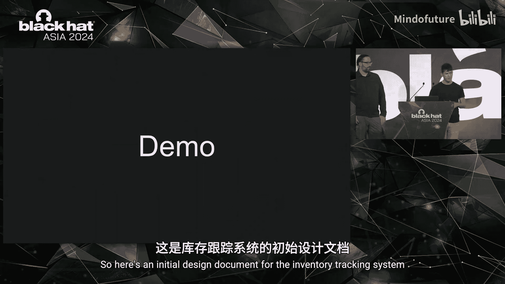
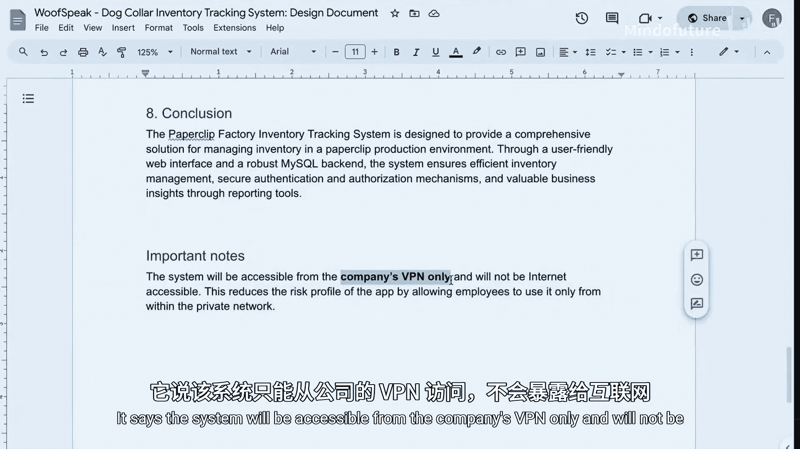
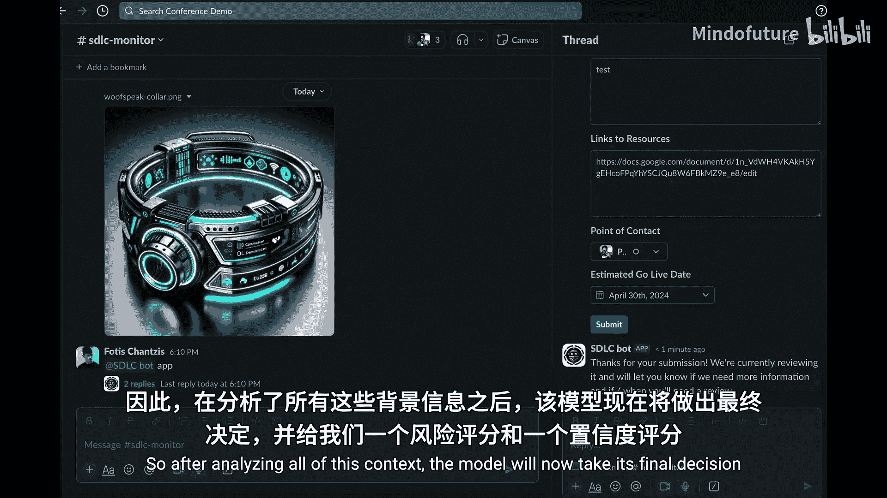
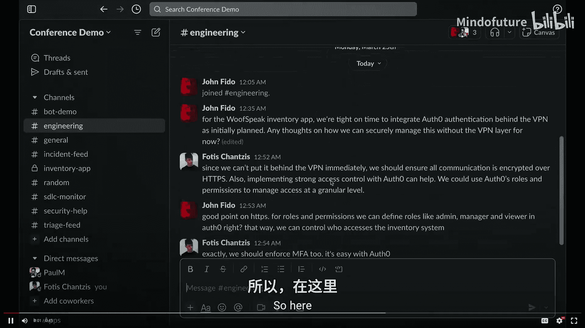
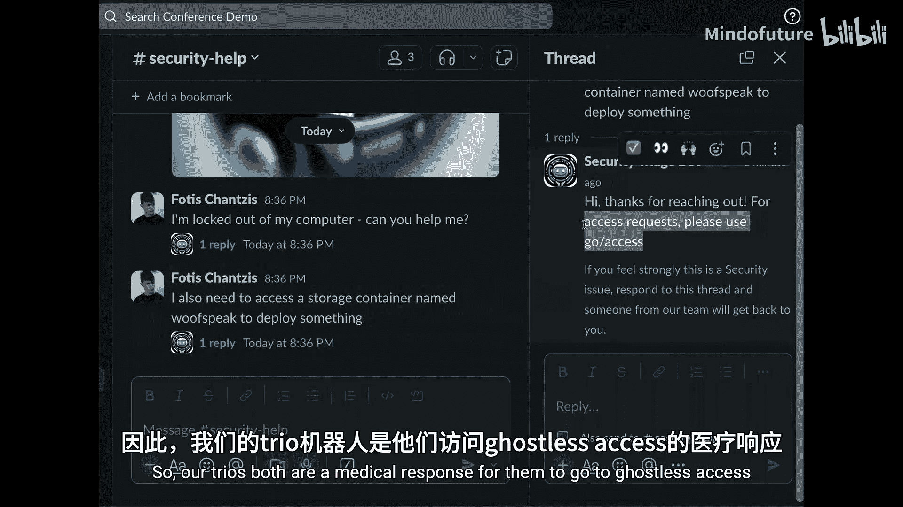
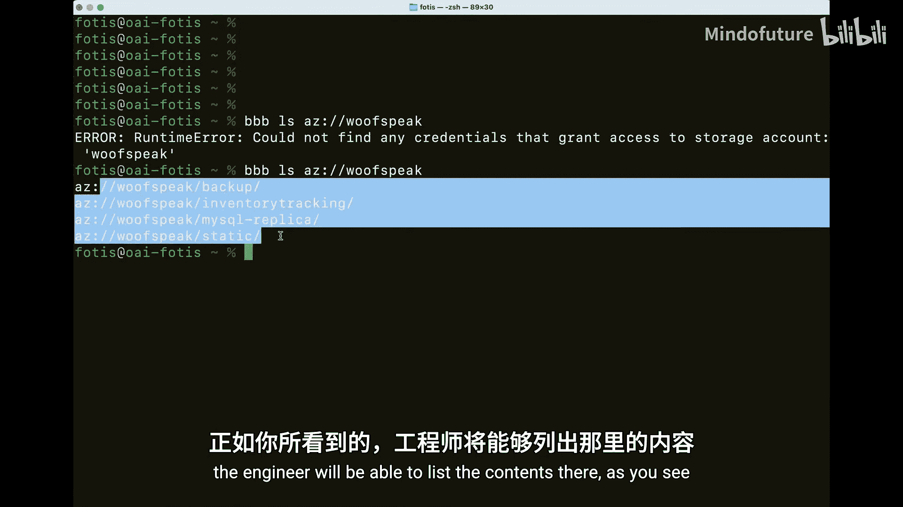
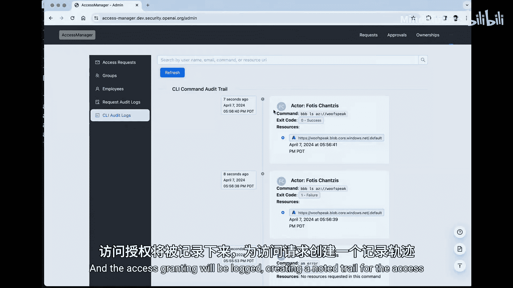
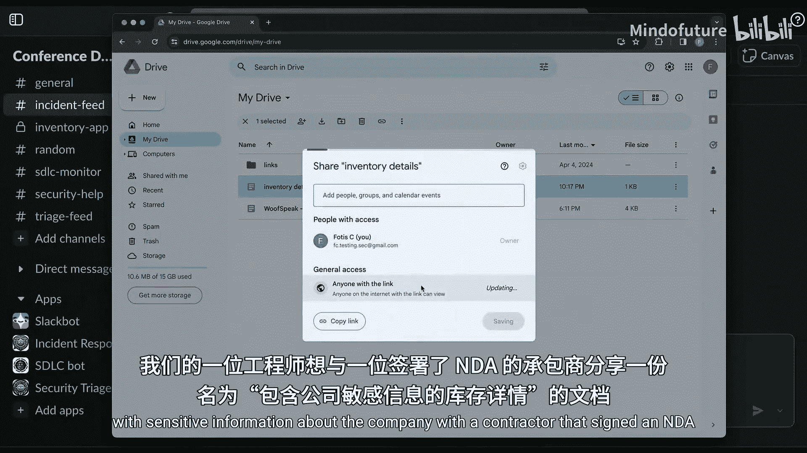
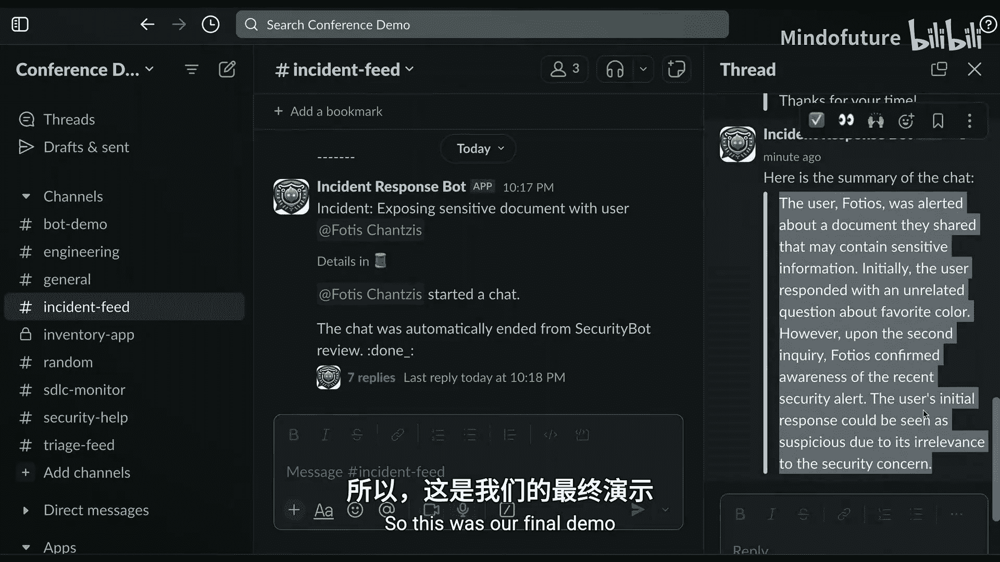

# 024：从理论到工具 🛡️

在本教程中，我们将学习如何利用大语言模型（LLMs）来增强安全团队的工作效率。我们将探讨LLMs的核心工作原理，并通过一个虚构公司“Wolfofspeak”的案例，展示如何将LLMs应用于软件开发生命周期（SDLC）评估、访问管理、安全报告分类和日志分析等实际场景。课程最后，我们将总结关键经验教训。

## 章节 1：引言与背景 🎯

在当今世界，安全团队承受着巨大压力。与此同时，人工智能（AI）的出现，就像一杯新的提神饮料，可以帮助安全团队专注于真正的威胁。我们的目标是确保AI不会将每一次鼠标点击都标记为生存危机。

我是Fodes，一名安全工程师和红队成员。我的工作亮点包括出版了一本关于物联网（IoT）实战攻击的书籍，发表了一篇关于TP漏洞的论文，并且是NMP项目中网络认证工具NC的作者。我也是OpenAI的首位安全工程师，早在2020年GPT-3发布时就已加入。

本次分享基于我们整个团队的工作，特别感谢Colin、Jake、Tiffany、Harold和Will的贡献。

## 章节 2：大语言模型（LLM）工作原理速览 🤖

在深入应用之前，让我们快速回顾一下现代大语言模型的基本工作原理。

现代大语言模型由**词元**（Token）构成，每个词元大约相当于四分之三个单词。模型的权重编码了这些词元之间的关系，并存储在GPU中。

当你查询一个模型时，它通过一个单一的请求-响应周期完成。你的查询被编码为词元，传递到GPU，然后生成响应。这意味着模型是**无状态**的：当你查询时，模型权重不会改变，模型也不会记住之前的对话，更不会从你传递的内容中学习。

那么，像ChatGPT这样的聊天应用是如何工作的呢？答案是**上下文**。模型本身并不记得对话历史，它只是将尽可能多的先前对话内容包含在每次请求中。当空间不足时，它不会报错，而是开始删除部分历史记录，以确保每个请求都能适配那个单一的请求-响应周期。这并没有改变GPU中的权重，其中并无魔法。

## 章节 3：案例研究：Wolfofspeak公司 🐕

为了演示我们的LLM驱动工具，我们引入一个虚构案例：Wolfofspeak公司。这家公司生产一种AI驱动的狗项圈，可以将犬吠声翻译成人类语言。

Wolfofspeak的工程师们正在为其不同版本的狗项圈构建一个新的库存追踪系统。该系统包含所有标准组件：使用React作为前端的Web界面、Node.js后端、MySQL存储、OAuth用于用户认证和授权。最重要的是，该系统只能通过公司VPN访问，仅供员工使用，没有互联网访问权限。

不出所料，工程师们工期紧张，软件开发生命周期（SDLC）不会非常线性。在快节奏的公司中，SDLC常常像世界上最不可预测的食谱。安全团队必须介入这个周期，以评估正在开发的项目或功能是否需要人工安全评审。然而，安全团队面临的最大问题之一是**人力带宽非常有限**。

## 章节 4：工具一：SDLC Bot - 自动化风险评估 🤖

为了解决人力有限的问题，我们开发了**SDLC Bot**。这是一个Slack机器人，利用LLM帮助我们优先处理安全团队需要首先评估的项目或功能。我们今天将开源这个工具。

以下是它的工作流程：
1.  它向用户询问一些关于项目的基本安全问题（这部分是可选的）。
2.  它覆盖并监控Slack上的重要线程。
3.  它分析与项目相关的设计文档。
4.  然后，在LLM的帮助下，根据上述上下文给出风险评级和置信度。

让我们看看它在实践中的运作。

最初的设计文档指出：“系统将仅从公司VPN访问，不会暴露给互联网。”SDLC Bot分析后给出了中等风险评分。

在我们的故事中，截止日期临近，工程师们决定没有时间为所有云组件创建私有链接以使其驻留在VPN内。于是有人更新了文档。这个根本性的变化会被我们的SDLC Bot检测到，然后LLM会根据更新后的上下文做出新的决策。

新的决策显示，这增加了项目的风险。风险评分从中等的4分提高到了中高风险的7分。

我们从这个工具中学到了一些经验：
*   **模型有时会过度拟合初始问题**：如果你用一些起始安全问题作为示例来提示模型，模型通常不会偏离这些示例太远。
*   **提示工程至关重要**：你越是告诉模型它是某个领域的专家，它的回答就越好。例如，告诉它“你是一名网络安全专家”比“你是一个普通工程师”能得到更好的回应。
*   **输出格式影响质量**：我们发现，当要求模型输出分数和数字而不是文字时，结果质量更高。
*   **减少用户摩擦**：我们开发了一个增强版本，能够自动监控Slack频道并自行发现感兴趣的主题，这样就不需要向开发人员提问，减少了用户摩擦。

## 章节 5：工具二：访问管理器 - 简化权限申请 🔑

我们开发的另一个工具是**访问管理器**（Access Manager）。它帮助用户自动找到正确的权限，而无需他们知道访问组的名称或详细信息。它利用可用的群组描述和元数据来寻找概念上的良好匹配，并向用户解释。即使用户在查询中没有使用匹配的关键词，它也能工作。我们计划在未来开源这个工具。

工作流程如下：
1.  工程师尝试列出名为“wofpeeak”的Azure存储容器内容，但因没有访问权限而收到错误。
2.  工程师使用访问管理器CLI询问问题所在。
3.  访问管理器在模型的帮助下，建议用户应属于哪个群组才能获得该存储帐户的访问权限，甚至主动提出代表用户发送访问请求。
4.  该工程师的经理在Slack上看到该群组的待处理请求后，可以点击批准。
5.  批准后，工程师将被授予对该存储帐户的访问权限，并且访问授予操作会被记录，创建完整的审计跟踪。最后，访问权限可以设置为在一定时间后过期。

我们的团队还试验了**动态授权**，即授予访问权限的决策基于多种因素，包括用户上下文（如位置、时间、设备或工作角色）、资源上下文（例如，访问资源的敏感性）甚至环境上下文（例如，网络条件）。

## 章节 6：工具三：利用LLM分类安全报告 📋

我们使用模型的另一个领域是帮助**分类安全报告**，可用于漏洞赏金、安全披露邮箱、甚至内部发现。关键不仅在于它能帮助评估报告，还能帮助改进报告，使其对团队更具可操作性。

去年四月，我们启动了漏洞赏金计划，收到了大量关注。在第一周，我们每天收到超过900份报告，这不是人类能够处理的合理数量。因此，我们转向模型寻求帮助。

我们没有一开始就让模型判断报告是否有效，而是从较低难度的任务开始：**拒绝那些不适合漏洞赏金的报告，并将其分类**。

我们构建的分类流程如下：
1.  **模型安全性与正确性**：报告是否与模型安全性相关？是否是针对模型给出的答案（有害、事实错误）的投诉？这类报告有单独的接收处理机制。
2.  **客户服务请求**：报告者是否有关于产品的问题？是否存在支付、订阅或退款问题？是否是功能漏洞报告但没有明显安全影响？这类报告会转给客户支持团队。
3.  **超出范围**：报告是否属于技术性“超出范围”列表？这需要模型对安全报告的类别做出一些判断。例如，缺少服务器标头、不发送邮件的域缺少SPF记录、服务器消息版本字符串等通常不在赏金计划范围内。
4.  **疑似合法安全报告**：如果不属于上述任何类别，则应归为此类。例如XSS、CSRF、子域名接管等安全问题。此类别中的报告不会收到自动回复，而是直接发送给人工分类团队。

对于这个用例，反提示注入并不是大问题，因为我们不是在做支付决策，也没有让模型编写回复，只是确保用户在错误地方报告的问题能被转到正确的地方。

## 章节 7：评估与迭代：确保模型表现良好 📊

我们不能只是编写提示词并希望它做对。我们需要数据来证明我们正在改善问题，而不是让情况变得更糟。**评估**（Evals）至关重要。

评估的工作原理如下：
1.  你建立一组已知正确答案的问题。
2.  你使用你的提示词向模型提问，运行问题，模型给出答案。
3.  然后，你拿着问题、已知正确答案和模型的答案，再次询问模型：“模型给出的答案正确吗？”它会告诉你“是”或“否”。
4.  你可以利用这个系统让模型自我判断，以确定你是否做对了。当你调整提示词以使其更好时，可以反复进行这个过程，也能看到何时让它变得更糟。

在实践中，我们如何双重检查工作？最初，我导出了前几千份报告的CSV文件，手动将它们分类到不同类别中，然后运行模型进行分析。在电子表格中操作非常快速、简单，是快速获取答案的好方法。

## 章节 8：前瞻性应用与总结 🚀

除了已部署的工具，我们还试验了一些其他应用场景：

*   **提高报告质量**：模型可以帮助确保报告包含所有必要信息，例如要求提供完整URL、电子邮件地址，或者指出报告者提交了模板但未修改。
*   **辅助分类**：模型可以自动修复分类、总结报告要点、提取复现步骤、提供澄清问题的建议，甚至可以将报告转换为其他工具队列。
*   **日志分析与事件响应**：LLMs擅长在“干草堆里找针”。例如，分析bash历史记录，识别出中间调用的反向Shell命令。我们开发了一个机器人，可以处理来自传统SIEM的警报，对于可能是无心之失的警报，它可以与用户开启聊天，告知潜在问题。

**最重要的经验教训：**
1.  **提供高质量数据**：你给模型的数据质量越高，它的表现就越好。但不要把所有东西都塞进去。模型在有更多上下文时表现更好，但这些上下文必须是高质量的。
2.  **告诉模型它是专家**：在提示词中明确模型是某个领域的专家，会得到更好的回应。
3.  **使用评估框架**：找到正确的提示词，通过评估迭代优化。
4.  **始终保持人在环路中**：模型并非万无一失，也会犯错、产生幻觉或遗漏信息。人类必须参与其中进行监督。
5.  **行动起来**：这比你想象的要容易，你应该去尝试。

## 总结

在本节课中，我们一起学习了如何将大语言模型（LLMs）实际应用于安全团队的日常工作。我们从LLM的基本原理讲起，通过Wolfofspeak公司的案例，深入探讨了SDLC Bot、访问管理器、安全报告分类等工具的具体应用。我们强调了高质量数据、专家提示、持续评估以及“人在环路”原则的重要性。最后，我们了解到，利用LLMs增强安全流程比想象中更简单，鼓励大家动手实践，利用开源工具提升团队效率。