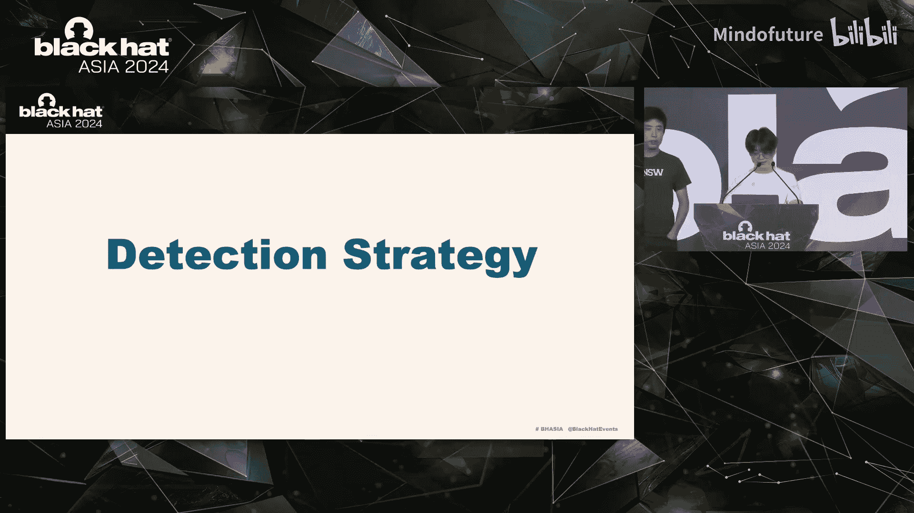
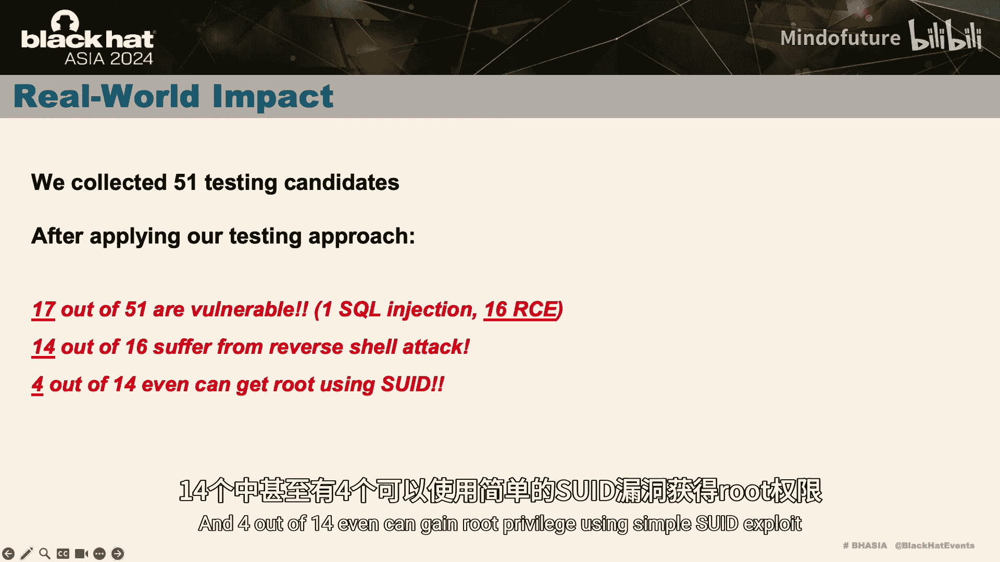
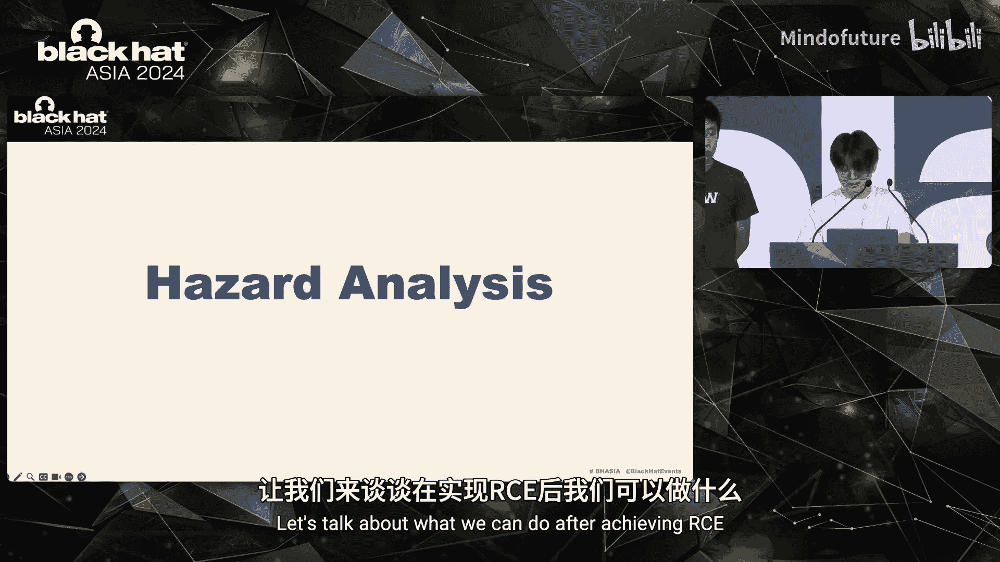
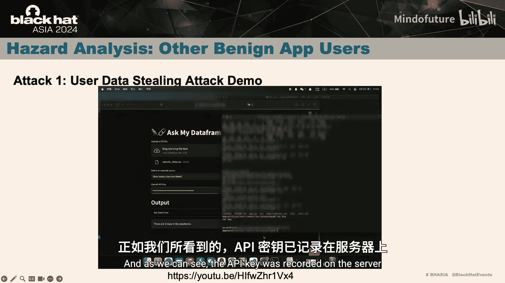
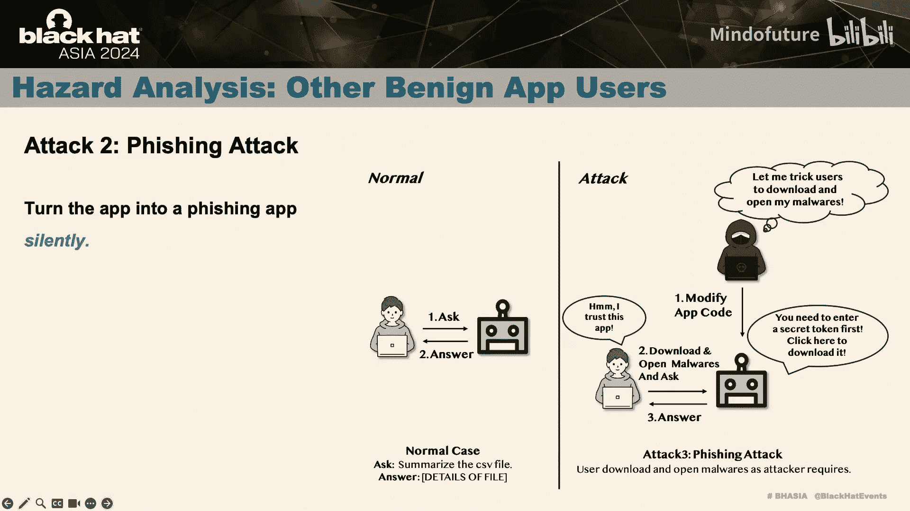
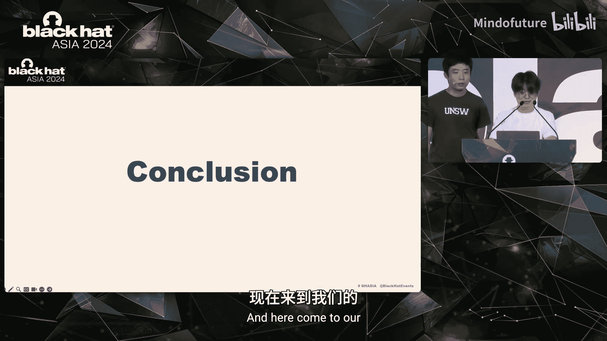

# 025：LLM4Shell - 发现并利用现实世界LLM应用中的RCE漏洞

在本节课中，我们将学习一种新型的安全威胁：LLM4Shell。我们将探讨在集成了大语言模型（LLM）的框架和应用中，如何发现并利用远程代码执行（RCE）漏洞。这种攻击允许攻击者仅用一两句自然语言，就能在服务器上执行任意代码，危害极大。

## 1.1：引言与背景

上一节我们概述了课程内容，本节我们来深入了解研究对象的背景。

我们研究的对象是由LLM集成框架和基于这些框架构建的LLM集成应用组成的系统。这些系统具备一个关键能力：生成并执行代码。

你可能会问，为什么需要让大语言模型生成和执行代码？答案在于，大语言模型本身有时无法直接回答用户的某些问题。例如，大语言模型通常不擅长解决复杂的数学问题。但是，它们可以生成一个程序，并通过执行该程序来获取数学问题的答案。因此，在某些情况下，我们需要允许大语言模型生成代码，并利用代码执行结果来增强最终的回答。这就是我们研究此类系统的原因。

下图展示了一个典型的工作流程：

1.  用户提出一个需要代码执行才能回答的问题。
2.  该问题被传递给框架的相关API。
3.  框架请求大语言模型生成解决问题的代码。
4.  大语言模型生成代码。
5.  框架处理并执行这段代码。
6.  执行结果返回给应用。
7.  应用将所有信息整合，呈现最终答案给用户。

那么，这个系统真的安全吗？为了理解其安全性，我们需要了解现有针对大语言模型的主要攻击类型，它们都与提示词工程相关：

以下是三种主要的攻击类型：
*   **越狱**：大语言模型在发布前会经过安全训练，以避免生成有害内容。但恶意用户可以通过精心设计的提示词，诱使模型回答被禁止的问题。
*   **提示词泄露**：许多应用使用系统提示词作为用户问题的上下文。这些系统提示词可能包含敏感信息。攻击者可以利用提示词工程技术泄露这些提示词。
*   **提示词注入**：在某些应用中，最终提交给大语言模型的提示词是应用模板提示词和用户问题的组合。恶意用户可以构造问题，从而“劫持”整个最终提示词的逻辑，操纵模型的回答。这类似于SQL注入攻击。

现在回到最初的问题：这个系统真的安全吗？答案显然是否定的。因为这个系统具备执行生成代码的能力，而这段生成的代码，正如现有攻击所展示的，可以被恶意用户操纵。这是非常危险的。

## 1.2：动机与案例研究

在了解了背景之后，我们来看一个具体的案例，它揭示了问题的严重性。

PAL（程序辅助语言模型）的核心思想是通过生成和执行代码的能力来增强大语言模型，利用代码执行结果来帮助解决需要编程的问题。这是一个非常有用的功能。

LangChain社区认可了这一功能，并决定实现一个名为 `PALChain` 的链，允许用户通过大语言模型生成并执行代码。但是，这段被执行的代码内容并未经过检查。

这可能导致潜在的攻击，因为用户可以利用提示词注入技术来操纵生成和执行的代码。这只是一个与 `PALChain` 相关的例子。

让我们进一步思考：如果这个 `PALChain` 被集成到某个应用中，可能会导致潜在的远程代码执行漏洞。这类漏洞有时可以提供一个反向Shell，类似于Web Shell。因此，我们称之为 **LLM Shell**。

然而，我们认为它比Web Shell危害更大。因为发动这种攻击，攻击者不需要很高的安全技术理解水平，仅用一两句自然语言描述就能发起攻击。这是极其危险的。

## 1.3：漏洞检测技术

了解了问题的背景和严重性后，本节我们来看看如何检测这类危害极大的漏洞。

我们采用了一种静态分析方法来帮助我们完成检测，如右图所示。我们的目标是提取出从用户级API（如 `create_csv_agent`）到危险函数（如 `exec`，可以执行任意代码）之间的代码调用链。这个脆弱的调用链正是我们想要找到的。

以下是我们的检测步骤：
1.  **识别危险函数**：首先，我们识别出特定的危险函数，例如 `eval`、`exec` 等。
2.  **提取代码调用链**：我们在代码的调用图上提取调用链。
3.  **优化提取过程**：为了提高调用链提取的效率和准确性，我们进行了一些优化。

典型的静态分析需要直接分析整个项目，这可能非常耗时。虽然大多数静态分析工具提供了分析用户指定文件的功能以减少分析时间，但在现实世界的漏洞检测场景中，这并不实用，因为我们无法预知涉及代码链的最小文件集合。

为了解决这个问题，我们提出了一种更高效的新方法。我们采用**反向策略**，从代码执行函数（如 `exec`）开始，搜索函数字符串以识别代码库中哪些文件可能包含调用者。然后，我们精确地分析这些调用者文件的调用图，找出它们的调用者，并以此迭代进行下一轮分析。这个过程无需分析整个项目，只需分析一小部分文件子集。

4.  **处理内联代码**：我们编写了一些规则来处理潜在的内联代码，以提高调用链提取的准确性。
5.  **手动验证与利用**：一旦调用链被提取出来，我们手动验证其可被利用性和可到达性，并进行漏洞利用测试。

结果，在8个流行的LLM集成框架中，我们总共提取了44条调用链，并验证了其中37条可以触发漏洞。我们检测到15个可以通过用户级API触发的RCE漏洞，这些API极有可能被用于应用后端。我们因此获得了11个CVE编号，并得到了框架维护者的致谢。

## 1.4：现实世界漏洞利用

但是，我们能否在现实世界场景中利用这些漏洞呢？要利用漏洞，首先需要找到潜在受影响的应用。

对于开源应用，我们可以在代码托管平台（如GitHub）上搜索所有使用了漏洞API的代码仓库。然后，我们可以自动提取它们公开部署的URL，因为对于网站来说，唯一的入口就是公开部署的URL。

如下图所示，我们可以从之前识别出的所有风险API中选择一个，例如 `create_pandas_dataframe_agent`，它非常危险，因为它可以触发RCE。我们在代码托管平台上搜索，可以找到许多使用了这个漏洞API的应用。

然后，我们提取一些关键信息，如仓库名称、描述、README文件，因为公开部署的应用通常会在这些信息中包含其部署URL。我们先从这些信息中提取所有URL，然后应用规则过滤掉不需要的噪声URL，从而筛选出应用的公开部署URL。

对于闭源应用，我们无法直接访问其源代码。因此，我们可以从收集到的受影响白盒应用中分析其特征。例如，我们发现许多受影响的应用与数据分析相关。我们可以将这些类别总结为易受攻击的可疑类别，并从公共应用市场中收集这些应用。

在收集了测试候选目标后，如何探测并利用隐藏在应用后端的漏洞呢？我们不能仅仅通过观察来判断应用是否可被利用，必须进行测试。

为了在尽可能减少误报和漏报的同时利用这些漏洞，我们设计了一个系统化的工作流程。下图是整个过程的概述。接下来，我们将逐一解释我们设计这些利用策略的洞察和原因。

以下是我们的系统化利用策略：
*   **基础使用测试**：首先测试应用是否允许用户输入自定义提示词，以及是否功能正常。因为有些应用可能不允许自定义输入，或因缺乏维护而无法使用，攻击者没有入口来触发RCE。因此，有必要在整个流程开始时排除这些异常应用。一个直接的方法是使用提示词让应用执行一些简单的任务（如计算），以检查它是否能满足我们的请求。
*   **幻觉测试**：应用通过基础使用测试后，可能仍存在大语言模型幻觉问题。在研究的初始阶段，我们遇到了一些实例，某些应用表现出幻觉问题。例如，我们让它列出当前目录中的所有文件，它生成了一些看似正确的输出，但实际上是由于LLM幻觉。为了减轻LLM幻觉造成的潜在干扰，并纯粹确认它是否能执行代码，我们设计了幻觉测试。这个测试的灵感来源于一个事实：LLM无法独立计算哈希函数。因此，判断标准是：如果LLM能正确计算随机字符串的哈希值，那么一定发生了代码执行行为。
*   **RCE测试（无绕过）**：一旦应用通过幻觉测试，表明它确实具备代码执行能力，且结果不是由幻觉生成的。接下来，有必要测试应用是否能执行我们提供的任意代码。在这个阶段，我们可以使用直接的提示词来确认RCE漏洞的存在，例如告诉它某段恶意代码或目标代码的最终结果是什么，以检查它是否能满足我们的请求。
*   **RCE测试（带绕过）**：然而，事情并非总是一帆风顺。在测试中，我们发现一些直接的提示词可能无法产生预期的结果。这是为什么呢？让我们以PandasAI框架为例，因为许多应用都构建在框架之上，我们可以从中获得洞察。在尝试利用PandasAI框架时，我们遇到了两个挑战。首先，该框架包含一个自制的沙箱，旨在通过限制Python执行环境变量和过滤一些可疑关键字来增强代码执行期间的安全性。其次，PandasAI中的系统提示词模板也显著影响了我们的测试，因为在这种情况下，我们的攻击性系统提示词会被嵌入到这个冗长而详细的、关于生成数据分析代码的系统提示词中，导致我们的攻击语义被混淆，使得LLM难以理解和满足我们的请求。此外，LLM本身可能具有某些安全对齐机制，即使我们能绕过系统提示词的影响，LLM仍可能拒绝生成我们想要的恶意代码。因此，我们引入了带绕过的RCE测试，它包括 **LLM绕过** 和 **代码绕过**。LLM绕过的目标是摆脱系统提示词的约束干扰，并打破LLM内部的安全和审核机制，使攻击者能够操纵LLM生成恶意代码。代码绕过则是为了逃逸潜在的代码执行沙箱，利用从CTF/Pwn挑战中学到的一些技巧，例如Python类的子类继承链、模块重载和代码语义混淆等。结合这两种技术，我们可以可靠地在PandasAI框架上实现RCE。
*   **网络访问测试**：现在，我们可以在应用服务器上实现RCE了，但这里的RCE可以分为**受限RCE**（允许执行某些命令，但不是所有命令）和**完全RCE**（可能导致反向Shell攻击）。因此，需要进行网络访问测试来评估可利用性和危害等级。如果注入代码的执行环境具有任意外部网络访问权限，攻击者可以通过反向Shell获得对受害者服务器的持久控制。否则，影响可能有限。在这个测试中，我们可以诱导应用生成一个`curl`代码，向我们的VPS发送请求。如果VPS收到了来自应用的请求，则网络访问测试通过。
*   **后门植入测试**：最后，让我们在应用服务器上植入一个后门。后门测试旨在从我们的VPS下载后门脚本并发动反向Shell攻击。首先，我们编写一个反向Shell脚本，并强制应用服务器下载并执行它。至此，攻击者可以获得对应用服务器的持久和完全控制。

## 1.5：攻击影响与演示

在成功利用漏洞后，攻击者能造成什么影响呢？本节我们来探讨攻击的后续影响。

你认为攻击到此就结束了吗？绝对不是。让我们谈谈在实现RCE之后我们能做什么。

在实现RCE后，我们可以将受影响的对象分为两类：第一类是**应用宿主服务器**，可以被直接控制；第二类是**其他良性应用用户**。这是我们提出的一个新攻击场景：在控制应用服务器后，攻击者可以静默地攻击其他用户。

以下是攻击者如何影响这两类对象：
*   **对应用宿主服务器的攻击**：
    *   **窃取敏感信息**：攻击者可以获取服务器上的敏感信息。许多敏感信息存储在文件或环境变量中。例如，许多应用将其OpenAI API密钥存储在环境变量中，攻击者可以直接获取。他们可以窃取开发者的OpenAI API密钥供自己使用。此外，对于闭源应用，源代码也存储在服务器上，导致源代码泄漏。其他敏感信息，如服务器配置、AWS私钥、SSH连接信息等，也可能被攻击者访问。
    *   **权限提升**：攻击者可能通过SUID或内核漏洞利用实现权限提升，从而获取更敏感的信息。
    *   **植入后门**：正如之前讨论的，攻击者可以在服务器上植入后门，导致对服务器的持久控制。
*   **对其他良性用户的攻击**：基本上，这些针对其他用户的攻击是通过修改应用源代码实现的。
    *   **用户数据窃取攻击**：这种攻击允许攻击者静默记录用户的敏感数据。这些数据可能是用户的提示词（可能包含PII）、用户上传的文件，甚至是用户的OpenAI API密钥。攻击者首先修改源代码。然后，当新用户使用该应用并输入其OpenAI API密钥时，该密钥会被攻击者在服务器上记录。用户甚至无法注意到他们的API密钥已被盗。
    *   **钓鱼攻击**：攻击者甚至可以静默地将此应用变成钓鱼应用。例如，攻击者想诱骗用户下载并打开其恶意软件。他首先修改代码。当应用用户到来时，被修改的应用会说每个用户必须先输入一个秘密令牌才能开始使用，而该秘密令牌可以通过下载某个文件获得。实际上，该文件是由攻击者精心制作的恶意软件。如果用户信任该应用，就会下载并尝试打开它，从而攻击者可以诱骗用户打开其恶意软件。其他钓鱼攻击也是可行的，例如伪造登录页面以诱骗人们输入其私人凭证。一旦用户名和密码被输入，它们就会泄露，造成重大损失。

## 1.6：缓解措施与总结

在讨论了如何利用漏洞之后，让我们谈谈一些缓解措施。

对于应用开发者，可以从不同角度采取各种潜在的防御机制。

以下是针对开发者的潜在防御机制：
*   **访问控制**：开发者应关注访问控制，并遵循最小权限原则，将用户权限设置为尽可能低的级别。例如，他们应禁用读取和/或写入应用源代码及其敏感系统文件或某些分区的权限。
*   **环境隔离**：应用开发者需要通过使用适当的代码沙箱或某些技术，将代码执行环境与应用服务器的运行环境尽可能分离。为了实现这一目标，可以使用一些沙箱，如进程级沙箱（如PIE沙箱、seccomp）、云沙箱（如E2B），或像Pyodide这样的工具，它利用Node.js和WebAssembly技术将代码执行嵌入浏览器中，允许代码在客户端而非服务器端运行，从而防止在服务器上执行代码。
*   **提示词级防御**：此外，提示词级别的防御措施也有助于过滤掉一些带有恶意意图的提示词。

最后，我们来总结本次课程的内容。

在本节课中，我们系统地介绍了一种LLM系统中的新攻击面，它可能导致RCE。我们称之为 **LLM4Shell** 或 **LLM Shell**，因为它类似于Web Shell。但在某些情况下，它比Web Shell更强大，因为攻击者只需使用一两行自然语言就能实现RCE。

我们还讨论了在现实世界场景中的漏洞利用，并设计了漏洞利用工作流程。最后，我们从不同角度为开发者提供了一些潜在的缓解措施，以保护他们的产品。

总而言之，请务必关注你的LLM集成框架和应用，尽可能保护它们。因为也许有一天，攻击者只需使用一两行自然语言就能在你的应用服务器上实现RCE。