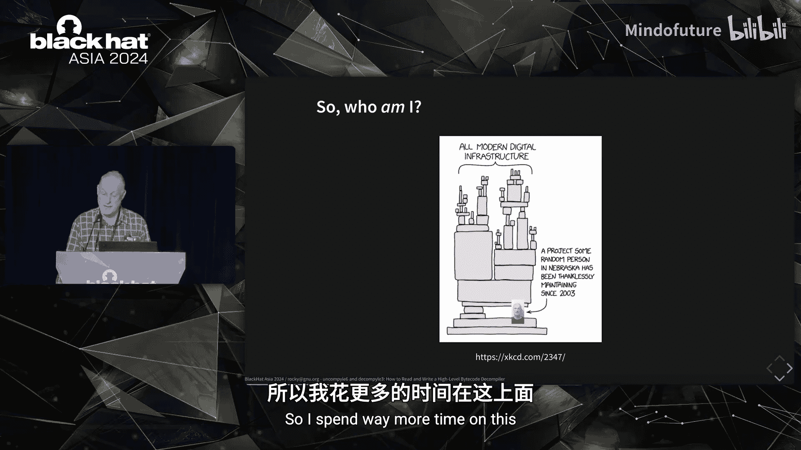
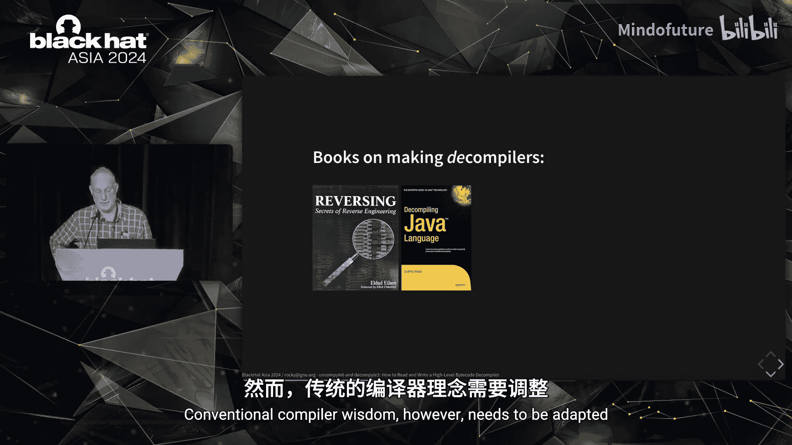
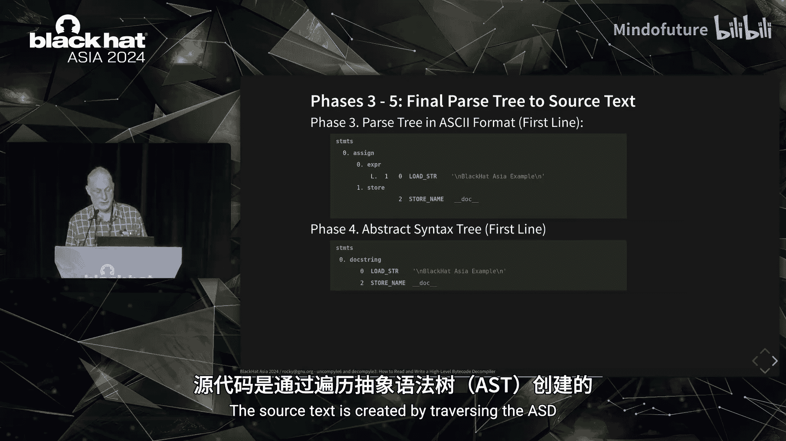
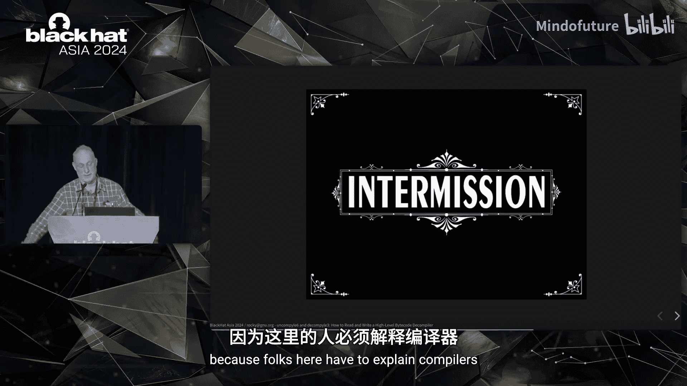
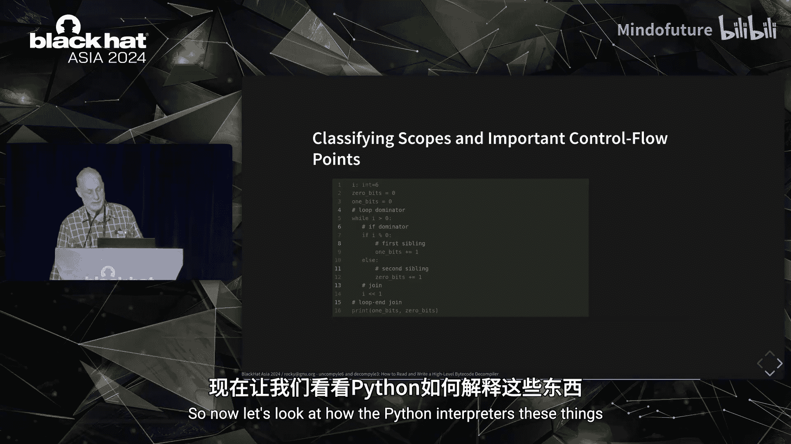
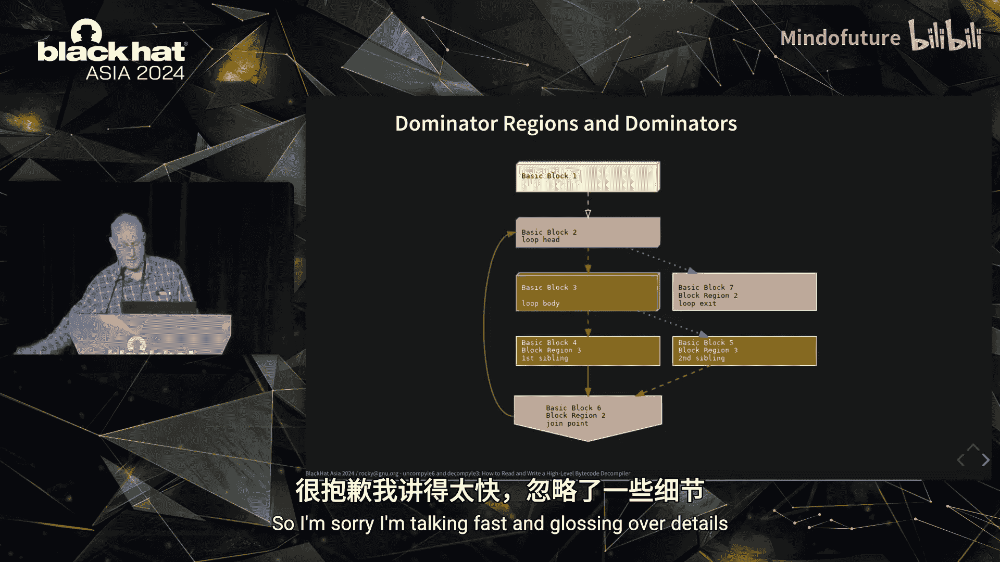
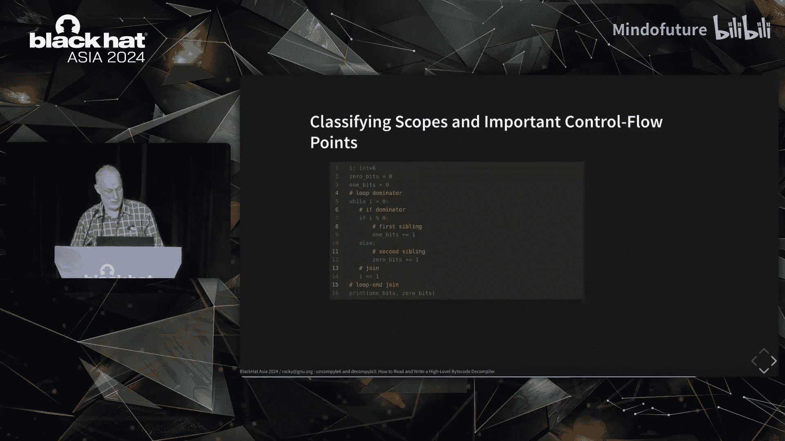
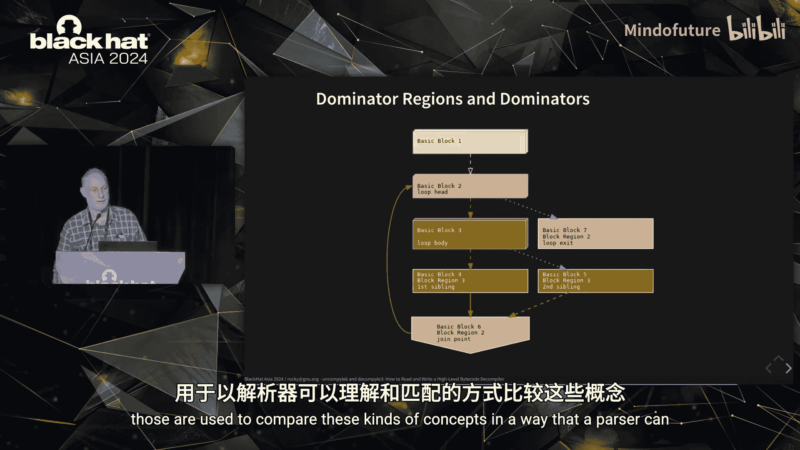
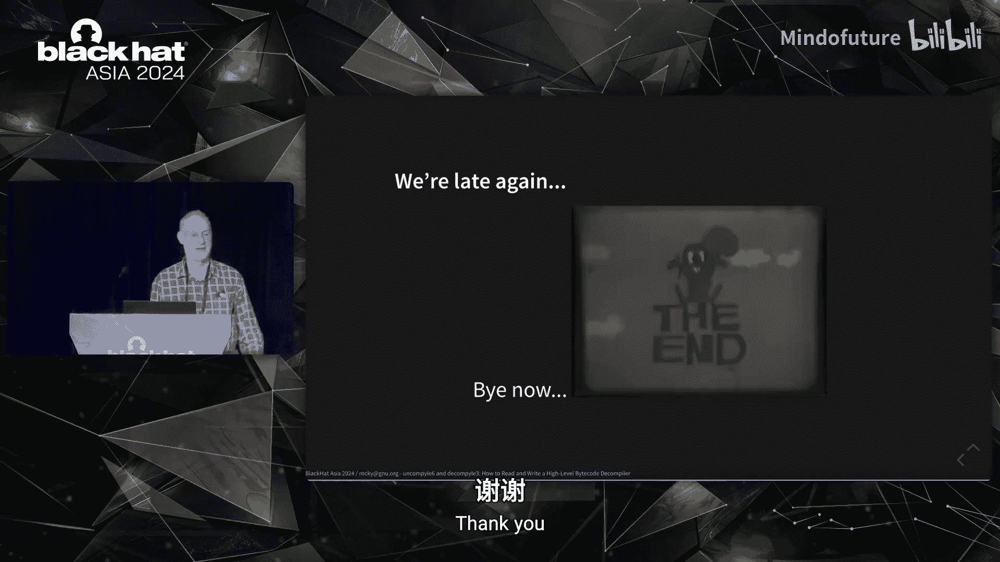

# 028：如何充分利用Python反编译器Uncompyle6与Decompyle3

## 概述

在本教程中，我们将学习Python字节码反编译的核心概念，特别是如何使用和深入理解两个重要的工具：Uncompyle6和Decompyle3。我们将从Python程序执行的基本原理开始，逐步深入到反编译器的内部工作机制，包括其五个核心处理阶段。最后，我们将探讨控制流分析等高级主题，并了解这些知识如何应用于恶意软件分析和逆向工程。

## 引言与背景

本次演讲内容非常紧凑，信息量大。第一部分会快速过一遍基础知识，其中包含大量技术性内容。这部分内容主要是为后续的深入讨论做铺垫，而不仅仅是复述原始演示。

时间有限，内容高度浓缩且重要，因此讲解速度会很快。强烈建议您同时参考底部蓝色链接中的文本材料。

让我们从一个简单的调查开始：请举手示意您是否使用过Hexrays、Ghidra或Binary Ninja。大约80%的人举手了，这很好。现在，请保持举手，如果您曾使用过这三款工具中的任何一款来调试或反编译Python字节码到Python源代码。我看到有人举手了。演讲结束后，我很乐意与您交流，因为据我所知，这些工具在处理解释型语言的字节码时效果不佳。我与其中一款逆向工程工具的创始人交流过，他确认所有从机器代码开始的反编译工具在处理基于字节码的解释器时都表现得很糟糕。

现在，请举手示意您是否使用过Uncompyle6或Decompyle3。人数不多，但有一些。在这次演讲之后，你们所有人都会对这些工具有更多的了解。

我是Uncompyle6和Decompyle3的现任维护者和开发者。这些是Python程序，您可以从PyPI获取。项目名称的选择可能不太好。项目页面显示了从2012年至今的Github提交活动，共有31人为这个开源项目提交过一两个拉取请求，我们对此深表感谢。但您可以看到，在漫长的时间里，我基本上是独自在维护这个项目。我的贡献在左下角，提交量排名第二的人在右侧，我已经有七年多没有他的消息了。

2016年，我从一个过时版本控制系统的存档中复制了代码，并在Github上启动了这个项目。那时，代码已经被遗弃了大约五年，这解释了图表左侧的大段空白。2018年，我在一个Python会议上做了演讲，因此您能看到2018年中期活动激增。这段代码支持从1999年的第一个版本到Python 3.8。虽然3.8是几年前发布的，不再是最新版本，但它仍然被支持和使用。

由于这段代码历史悠久、体量庞大，而Python编译器变得越来越复杂，因此需要更好的技术来跟上Python的发展。所以我分叉了代码，进行了重构，并缩减了其规模，这解释了图表最右侧从2021年至今活动量的下降。分叉后的代码名为Decompyle3，它只处理Python 3.7和3.8。一个有趣的事实是，在最右侧您能看到一个微小的活动上升，那是我为这次演讲准备代码。

这里有一个教训，但我们可以稍后再谈。不幸的是，即使对Decompyle3的修改也不足以完全跟上Python字节码和语言的变化。因此，我有一个针对Python 3.8到3.10的实验性反编译器，在演讲接近尾声时我会展示一点。

关于我：照片和卡通中在塔底的那个人就是我，只不过我住在纽约市。我从2000年开始从事开源工作，退休前在业余时间做开源软件，现在退休了，花在这上面的时间更多了。总的来说，我编写的代码有足够的时间传播开来。如果您安装了匹配第一行任何Logo的软件，那么您就使用了我编写的代码。我今天要讲的软件没有很酷的Logo，但左边Logo的软件使用了一个名为`libcdio`的CD读取库，我于2000年启动并仍在维护它。事实上，我回到纽约市后需要修复一个漏洞。我还对开源Mathematica和调试器等其他事物感兴趣。我编写的大部分软件都是GPL许可的，并且我是自由软件基金会的成员。

关于我的介绍就到这里，让我们进入正题。

## 为什么需要专门的Python反编译器？

高级字节码对恶意软件编写者具有吸引力，因为它具有可移植性、紧凑性和隐蔽性。

标准的通用分析工具，如Hexrays或Ghidra，对Python字节码效果有限。我曾有微软的人员联系我，涉及一个在微软Windows上活跃的恶意软件`Bonet`，该恶意软件是用Python 2.7编写的。正如我之前提到的，像Hexrays或Ghidra这样的标准分析工具对他们毫无用处。

情况正在变得更糟。使用高级字节码的语言并未减少，Python语言及其字节码也在不断变化。Python生成的字节码变得更加复杂，更难反编译。

反编译器自20世纪60年代初编程语言诞生以来就已存在。然而，我将要介绍的想法有些新颖或较少使用，它们代表了我个人的研究。这些想法的种子埋藏在24年前的代码中。正如我所说，这段代码在我发现之前已被遗弃了五年，我花了一些时间来提炼、纠正和扩展代码中的想法，甚至今天我也不确定我对此有最终结论。

学术界在所谓的“通用反编译器”领域有理论研究，这些程序将机器代码转换为伪源代码。通常，生成的语言无法直接通过编译器运行。

存在用于编译器构建的系统化方法和工具，这些只是您能在亚马逊上找到的一些书籍的总结。从左到右：有些书籍在几十年间经历了多个版本；有些根据书籍编译器算法所用的编程语言有多种变体；有些专门针对特定的源语言或目标语言、特定的CPU架构或操作系统；有些旨在编写解释器，而另一些则专注于高级编译器技术；最后，有些已经绝版，因为编译器编写技术已随时间演变。这里的重点是，这是一个成熟的领域。

但是，据我所知，上一张幻灯片中的书籍都没有提到反编译器。那么关于反编译器或编写反编译器的书籍呢？我只能找到这两本，它们都有大约十年的历史，都没有完全专注于反编译器，也都没有超过一个版本。这些书籍涵盖的编译器和字节码，我确信在过去10年里已经发生了变化。

如何编写反编译器这个主题与如何编写编译器一样丰富、深入和复杂。事实上，从核心上讲，反编译器是编译器的对偶体，两者都将用一种语言表达的代码翻译成另一种语言中的等效代码。然而，传统的编译器智慧需要调整，您将在本次演讲中对此有所体会。

由于对反编译器的需求大但稀缺，人工智能似乎可能成为从机器代码获取高级信息的一种方式。对于这次演讲，我最近研究了两个使用机器学习的Python反编译器。那么，人工智能能拯救这一天吗？不，目前还不行。然而，如果您对如何解决这个问题感兴趣，我可以在之后分享我的想法。

## 演讲目的与反编译概述

那么，我为什么在这里做这个演讲？我提到过，Ghidra和Binary Ninja或Hexrays中的通用反编译器对字节码语言几乎没用。事实上，我一直在努力提高人们对字节码反编译作为一个独立领域的认识，这是我在这里的主要原因。

随着我对字节码反编译的理解加深，我发现它的工作方式与通用反编译非常不同。“通用”这个修饰语是我目前的术语，这种区别尚未被广泛接受。几年前，为了提高认识，我刚刚在维基百科反编译器讨论区发起了一个讨论。不幸的是，在这方面没有太多讨论或进展。

关于提高认识就说到这里。我很快将描述反编译过程，并介绍一种很少使用（如果不是全新的）的反编译方法。我将反编译视为一个人工语言翻译问题。在某些方面，它可以像谷歌翻译所做的那样，但这个过程也将遵循与大多数编译器前端（包括Python的编译器）所使用的模式类似的过程。这在我之前展示的编译器书籍中都有描述，我将展示如何将其调整用于反编译。我认为我向您展示的这种调整可以扩展到为其他高级字节码创建反编译器。

在更技术性的层面上，我希望您能理解反编译的阶段，至少对于这些反编译器来说是这样。这对于提交错误报告或修复错误非常有用。已经有几个人使用过我们的工具。

我在逆向工程论坛上看到一个常见的误解，即混淆了反编译和反汇编。随着我们深入这个过程，我认为差异会变得清晰。对于那些熟悉机器代码的人，我想您会欣赏高级字节码与机器代码的显著不同。最后，我认为您会对反编译器能做什么和不能做什么有一些想法，不仅在Python中，在其他类似的编程语言中也是如此。

但在深入反编译之前，我应该简要说明一下它是什么。反编译以机器代码或字节码作为输入，并生成源代码文本作为输出。在这张幻灯片中，我们以Python为例。

那么字节码从何而来？我们稍后会介绍，但让我首先从运行Python程序时的一些基础知识开始。我将向您展示一个简单的程序，在后面的例子中会用到。该程序打印调用函数`five()`的输出。

我使用Python解释器（称为CPython）运行代码，得到预期输出`5`。在这个过程中，Python将程序翻译或编译成一种称为字节码的中间形式，并解释这种内部形式。在这种情况下，字节码保留在内部，不会写入磁盘。

这是主例程的字节码字节。这些指令的作用是：它们调用函数`five()`的创建。在解释型语言中，没有像静态编译语言那样的链接加载器，这些工作由通用分析工具处理。相反，这类事情是在运行时完成的。在将函数`five()`链接到主程序之后，调用`print`函数，然后函数返回值被传递给内置的`print`函数，显示输出。

这个过程很繁琐，但完成我刚才所说的所有操作的指令只占25个字节。对于那些熟悉机器代码的人来说，用25个字节完成所有这些操作真是太棒了。字节码中还有元数据部分，也会占用空间。我还没有展示，但我们稍后会看到一些。

## 字节码文件与首次反编译

正如我所说，解释器不直接运行源代码文本，而是运行字节码。因此，这意味着源代码文本在字节码编译完成后可能不需要存在。对于某些称为模块的源代码文本，内部字节码会自动写入磁盘。然而，我们可以使用一个名为`compile`的标准Python库例程强制将字节码写入磁盘。

这就是调用方式。字节码文件是一个Python代码对象，它被序列化，然后使用名为`marshal`的标准Python库函数写入磁盘。会添加一些额外的数据，比如源代码文件名和字节码版本。这个文件的简称是`5-doc-python-38.pyc`，说起来有点拗口。这种字节码的文件扩展名通常以`.pyc`结尾，就像这里一样，有时是`.pyo`。

现在我们有了这个字节码对象，我可以直接运行字节码。我们再次得到`5`。

有了这个介绍，我们现在可以使用Uncompyle6进行第一次Python反编译。最简单的调用方式是`uncompyle6`加上字节码文件名，这就是我们在上一张幻灯片中创建的文件。

橙色以`#`开头的行是注释。顶部的部分包含我之前提到的一点元数据，它存储在字节码文件中。它不是我们之前在十六进制中看到的25字节指令序列的一部分。

每个字节码都有一个唯一的变体编号，这里是`3413`，这个变体涵盖Python 3.8。Python的主要版本通常会改变编程语言和/或字节码和/或源代码文本翻译成字节码的方式。Python字节码的变化比我遇到的任何其他字节码都要多。因此，当您找到一个工具或阅读一篇关于Python字节码的博客时，其中一些想法可能只在该工具开发时或博客撰写时附近的少数版本中相关。

从1996年第一个版本到最近版本，字节码的漂移程度就像从拉丁语漂移到意大利语一样剧烈，只不过这种漂移发生得更快。

回到反编译结果。虽然字节码的名称是`five`（在顶部的白色部分可见），但包含源代码的Python文件名是`5-doc.py`（在橙色元数据中稍靠下的位置可见）。

正如您在这里看到的，源代码文本和反编译的代码几乎相同。习惯于Ghidra或Hexrays通用反编译器的人通常会对两者的接近程度感到惊讶，这是高级字节码的一个方面。很多源代码信息，如变量名及其类型，都保存在字节码内部。

两者之间的主要区别在于生成的注释。左侧源程序中的注释没有出现在重建结果的任何地方，这是因为注释根本不会出现在字节码中。左侧第11行没有出现在右侧的任何地方。这些反编译器为了增加获得精确源代码文本的可能性所做的一件事是，它们尝试按照Python标准格式化方式进行格式化。我们比其他Python反编译器更注重这一点，但我们并不总是能获得完全相同的格式。

## 反编译器的工作原理：五个阶段

既然我们已经给出了Python反编译的例子，现在展示我们的反编译器如何工作。通过这个，您可以跟随反编译的思维过程。

这些反编译器的一个独特功能是，我们提供了一种方法来跟踪反编译过程。机器语言反编译器，即使它们有像我们这样的语言亲和性，目前也无法提供这种级别的细节。

我们的反编译器经历五个阶段。分阶段运行或构建流水线的想法也是大多数编译器的工作方式。这些阶段是：

1.  **获取字节码**：使用`xdis`进行反汇编。`xdis`是我编写的一个跨版本反汇编库，用于支持这些反编译器，但它也可用于其他处理Python字节码的项目。
2.  **标记化反汇编**：“标记化”是一个以编译器为中心的术语。在其他反编译器和代码分析工具中，这个过程有时被称为“提升”，即提升反汇编或提升机器代码。
3.  **将标记解析为语法树**：将标记流解析成语法树。
4.  **将语法树抽象为抽象语法树**。
5.  **从抽象语法树生成源代码**。

如果您不理解上述步骤，请不要担心，我很快就会详细介绍每个步骤。第二和第三步中的扫描和解析阶段类似于编译器用于生成代码的初始步骤，这是这些反编译器与其他反编译器不同的部分。

反编译的第一步是将字节码字节切割成指令。这里我将使用我们之前生成的字节码文件作为输入，并出于演示目的使用来自跨版本反汇编器包的独立程序`pydisasm`。

首先，您会再次看到顶部的橙色注释，这同样是关于字节码的元数据。事实上，这个特定的元数据与我们之前的例子完全相同。例如，我们在这里第一行高亮显示的字节码版本与之前相同，是`3413`。

现在我们来看实际的字节码指令。我稍后会详细介绍，但这里主要要注意的是，前两条指令来自Python源代码文本的第1行。第1行由左侧白色部分的`1:`表示。在`1:`下方灰显的部分，您可能会看到`6:`，但那是第6行源代码文本的开始。

每个字节码指令包含一个蓝色的操作名称，例如`LOAD_CONST`或`STORE_NAME`，操作名称后面跟着一个可选的操作数，这些操作数列在括号中。在左侧面板中，您看到的是来自`xdis`库例程解码字节码的指令。因为编译器不调用命令行例程，而是调用库API，所以它有一个反汇编结构在左侧。

我们显示的是该结构的打印表示，这恰好与命令行实用程序的输出相同。但是，我们需要从这个反汇编结构中处理和重新打包信息，以将其放入解析器输入的形式，如右侧面板所示。尽管这两者看起来几乎相同，但内部结构不同：左侧的输出来自第一阶段，右侧是第二阶段的解析器输入。解析将在下一张幻灯片中介绍。

## 标记化与解析

解析器的输入是一个标记流。“标记”是编译器术语，指输入到解析器的原子单位。标记基于蓝色的操作名称，有时操作名称和标记名称是相同的。然而，右侧绿色的操作数字段有时会部分地合并到标记名称中。

这里有一些例子。在第一个指令中，偏移量0处的`LOAD_CONST`操作在右侧被特化为`LOAD_STR`。一般来说，`LOAD_CONST`操作可以是任何Python常量字面量，如布尔值`True`或`False`，或者一些字符串、时区名称等。这个方面显示了字节码标记与机器代码的另一个区别：机器代码的指令操作是寄存器值，可以是数字、地址或地址的一部分。而在Python字节码中，操作数是任意对象。

另一个与相应标记名称不同的操作名称是`MAKE_FUNCTION`，您在底部偏移量8处的紫色部分看到它。它添加了后缀`_0`，变成了`MAKE_FUNCTION_0`。`0`是字节码编码的方式，表示此函数的函数签名不接受任何参数。导致`MAKE_FUNCTION`的指令序列会根据函数接受的参数数量而变化，因此解析器需要这种粗略的参数信息来匹配导致`MAKE_FUNCTION`的指令序列。

## 深入解析过程：以第一行代码为例

在上一张幻灯片中，我们刚刚展示了前两个阶段，它们将字节码字节转换为字节码指令，然后转换为标记流。扫描和解析的下一个阶段即将到来，如果您开发过编译器，它会看起来很熟悉，但我怀疑这是一个小众领域，我怀疑这里没有人了解编译器开发。如果进展太快，您可能会在我之前展示的亚马逊上的40本书中的某一本中找到更详细的解释。

为了简化，我们将只关注源代码文本的第一行。配套材料提供了所有行所有阶段的完整输出，但即使这是代码的一小部分，它也很好地涵盖了所有基本概念。

为了跑起来，先学会走是有帮助的，所以让我们从Python程序的第一行开始。它只是一个简单的Python文档字符串，显示在顶部的绿色部分，让我们从第一条指令开始。

当然，大多数Python表达式需要不止一条指令才能在字节码中表示。哦，对不起。

请注意，我们只有标记名称`LOAD_STR`。字符串值在解析中不相关。仅这一条指令本身就是特定Python表达式在字节码中的完整表示。如果您键入字面字符串表达式`"Black Hat Asia example"`并且这是程序中唯一的内容，您就会得到这个。对于那些熟悉编译成机器代码的编程语言系统的人来说，这非常奇怪。在机器代码中，很少有一条指令覆盖一个源代码表达式的情况，这再次体现了高级字节码的特点。当然，大多数Python表达式需要不止一条指令才能在字节码中表示。

因为`LOAD_STR`是一个完整的表达式，解析器匹配那个单一的标记并发出一个所谓的“语法归约规则”。这就是您在这里看到的`expr ::= LOAD_STR`。这一行是用巴科斯-诺尔范式写的。您会在Python的语法规范和抽象语法树规范中看到这种表示法。更一般地说，这是大多数编程语言中指定语法的方式。但对于我编写的反编译器，它们也使用语法来完成工作，这是大约50个用于反编译Python 3.8的语法规则之一。

`::=`右边的词被称为语法符号。`::=`读作“转换为”。因为`expr`语法符号可以转换为`LOAD_STR`标记。但由于我们实际上是自底向上或从标记开始工作，解析器可能只在事后才识别归约，所以识别实际上是从右到左，或者从标记流到语法符号。

执行这个归约规则，解析器创建了一个简单的树，以黄色的`expr`语法符号作为树的根，蓝色的`LOAD_STR`标记作为单个子节点。

让我们继续。这里我只是复制了我们之前的内容。现在让我们看第二条字节码指令。

`STORE_NAME`指令是构成`store`语法符号的标记之一。

好了，我们继续。虽然您在Python的语法中找不到`store`语法符号，但您会在Python的AST文档中找到大写的`Store`。大写的`Expr`也出现在Python的AST中。在可能的情况下，我们尝试使用与Python AST相似的语法符号名称。两种语法在树的顶部有相似之处，但在底部必须不同。如果我们有的是`STORE_GLOBAL`标记而不是`STORE_NAME`，那将是“store”语法符号类中的另一种指令。

用更熟悉的英语术语来说：想想一个名词可能是许多单词中的一个，比如`bike`或`bus`。假设`store`就像`noun`（名词），而`STORE_NAME`就像`bike`，`STORE_GLOBAL`更像`car`。就句子结构而言，无论您用`bike`替换`car`甚至`bus`，句子的语法结构都不会改变。

回顾一下，我们现在遇到了两个归约规则，这些是黄色的行。第二个归约规则被触发。解析器在侧面构建的小图看起来像这样。现在我们有了两棵小树。让我们继续。

解析器匹配了六个`store`语法符号并为它们构建了两棵树。在完成`store`归约规则后，解析器现在注意到我们连续有`expr`和`store`语法符号。我为反编译器编写的语法规定，当这两个符号连续出现时，就构成了一个赋值语句。因此，又一条规则触发，我们将之前的两棵树连接起来。

回顾一下，我们匹配了一个赋值语句。继续，一个赋值语句是一种语句，我们有一条语法规则来表明这一点。请注意，在看到早期蓝色的第二个`STORE_NAME`之后，我们触发了一系列归约规则（黄色的行）。这种自底向上解析器在到达标记流末尾时会发生这种情况。这就像一个侦探故事，在最后几页，整本书的所有松散片段和谜团终于被解开，想要反编译其代码的人欢呼起来。

这是最终的树。现在让我们看看这在AST输出中是如何显示的。这是来自图的AST表示。

在上一张幻灯片中，它显示了更多信息。但这是因为我们除了显示标记名称外，还显示了标记属性。例如，我们现在看到了指令偏移量、操作数值。这很好，但回想一下，在源代码文本的顶部，我们并没有一个赋值语句，我们有的是一个文档字符串。然而，文档字符串在Python中是通过这种特殊的赋值给一个名为`__doc__`的奇怪字符串变量来实现的。

那么，这如何变成更熟悉的东西呢？我很高兴您这么问，因为这来自下一个阶段。第四阶段获取我们刚刚创建的语法树，并将其转换为抽象语法树。我们寻找这种特殊赋值语句的树模式，当过程找到感兴趣且匹配的内容时，树的那部分会被替换。从某种意义上说，我们正在将找到的具体细节抽象为更接近Python程序员编写程序的方式。

严格来说，我们在这里不必这样做，有时这类事情可能是重建的源代码文本与原始源代码文本之间的差异。然而，如果您发现一个Python源代码文本看起来有点奇怪或者是无效的Python，可能正在发生的情况是这种转换没有被检测到，我在其他Python反编译器中经常看到这种情况。

请注意，我们也简化了树。我们不再有语法符号`expr`和`store`。我们本可以尝试更早地检测文档字符串，但那会更混乱。

最后，我们得到了实际的源代码文本。还记得吗？源代码文本是我们做所有这些事情的目的。源代码文本是通过在AST中调用基于语法符号名称的例程创建的，这里感兴趣的语法符号称为`docstring`（黄色部分）。

为了简化AST到源字符串的转换，使用了一种自定义的领域特定语言。这种DSL在项目中有简要描述。

## 控制流分析与高级主题

您现在已经成功完成了本次演讲的第一部分概述，我将继续，但之后没有时间了，很抱歉。对于你们中的一些人来说，如果不熟悉编译器前端如何工作，这第一部分可能有点紧张，请放松。

时间差不多了，因为我超时了，而且接下来的内容可能更艰深。我接下来要更详细地介绍反汇编，并为Python反编译器引入一个新想法。不幸的是，那是最重要的内容，但我必须讲解所有这些材料，因为这里的人们需要解释编译器。接下来的内容使用了一些高级编译器技术。

但首先，我要稍微关注一下反汇编，原因很重要：对于最新的Python版本没有好的反编译器，而且这种情况可能会永远持续下去。因此，现实是您可能必须通过反汇编列表来理解字节码恶意软件。

Python标准库中有一个名为`dis`的反汇编器。大多数反编译新手首先想到的就是它，但它有一些严重的限制。最大的限制是它只能反汇编运行反编译器的单个Python版本的代码。如果您运行的是最新版本的Python，比如3.12，但您想分析的字节码来自更早的版本，比如字节码2.7，那么您就不走运了。用Python编写的恶意软件倾向于使用旧版本的Python，当微软人员联系我时就是这种情况。

Uncompyle6和Decompyle3提到了`xdis`，它代表跨Python反汇编器。该包附带了一个功能强大的反汇编器，我将简要展示。黄色部分是我用于此演示的命令行选项。

这是`xdis`，黄色部分是我用于此演示的命令行选项。这是对指令序列的基本解释，显示实际的字节码，并能够将源代码文本与汇编混合。在逆向工程中，大多数时候您不会有源代码文本。当然，当源代码文本不存在时请求它也无妨。

现在让我们看看输出。反汇编输出的顶部再次有一些橙色元数据，我之前介绍过，所以我在幻灯片中高亮了它。元数据的一部分……呃……这部分……应该……我们之前隐式看到过的一个元数据值是常量表中的这个值。紫色偏移量0处的第一条指令是`LOAD_CONST`。该指令的字符串操作符来自此常量表的索引0。

现在让我们比较一下汇编指令。如果您熟悉Python的`dis`模块，这很相似，但有一些差异，您很快就会看到。

首先，绿色部分是源代码，那是一个Python文档字符串。在下面的白色部分，我们在竖线之间有实际的字节码值，在顶部以十六进制显示。第一条指令的第一个字节是`0x64`，这是Python 3.8中`LOAD_CONST`的代码。操作数值是`0`，但`0`再次是上面橙色常量表的索引。

在第二条指令中，我们看到右边发生了一些有趣的事情。在括号中的操作数值`__doc__`之后是绿色的附加文本。这是额外的文本，说明这是一个以白色`__doc__ = "Black Hat Asia example"`开始的赋值语句。这里反汇编器所做的是将前两行的组合效果描述为一个赋值语句。正如我之前提到的，这就是Python实现文档字符串的方式。

这是一个更复杂的例子，配套材料显示了更多细节。不要混淆反汇编和反编译，尽管这里有一些更高级的表示，但我们有的是反汇编，是解释器内部的暴露。例如，“top of stack”或“top sequence”指的是解释器的工作方式，而最后一个`CALL_FUNCTION`下方灰显的`POP_TOP`指令在源代码中没有相应的含义。

反汇编简单直接，反编译困难。然而，反编译通常从反汇编开始。但上一张幻灯片中显示的反汇编器确实有一些限制，这里有一个例子说明反汇编器可以重建什么。

虽然反汇编器在处理没有跳转的代码时很棒，但一旦我们有像高亮指令这样的跳转，反汇编器就必须停止组合指令。随着每个新的Python版本发布，控制流的反编译变得越来越困难。如今，反编译器错误跟踪器中提出的约三分之一的问题与控制流相关。

然而，我们使用的基于语法的方法可以很好地处理嵌套的控制结构序列的解析，如果您对它们进行标记的话。因此，有一种适合反编译的控制流描述方法可以提供更高的精度和准确性，而这在通用反编译器中是无法获得的。

我不会多说Uncompyle6和Decompyle3如何更好地描述控制流，而是介绍我正在实验性反编译器中采用的方法。下面是这个实验性反编译器的AST。以`BB`、`START_BB`、`n`、`BLOCK`、`JOIN`开头的白色标记是伪标记，它们由一个特殊的控制流过程插入，我将在接下来简要展示。到下一张幻灯片结束时，我希望您能对在标记名称中看到的橙色`BB`（基本块）有所了解，对标记名称中的`sibling`和`join`的含义有所了解，以及对最后一行橙色操作数中的`dominator`含义有所了解。

现在让我们考虑这个简单的Python程序来计算一个整数中的置位位数（1的个数）。如果您对算法感兴趣，可能会觉得这段代码很酷很有趣，但在考虑控制流时，唯一需要注意的是这是一个具有以下特征的程序：

在主函数体内部嵌套了一个`while`循环。在`while`循环内部嵌套了一个`if-else`语句，并且还有一层嵌套，即在`if`的`else`部分内部。这里我们在同一嵌套级别有多个项目，即使两个块在同一嵌套级别，它们也是不同且分开的。在某些编程语言如Java中，在每个块中声明的变量将处于不同的作用域。

为了使解析更容易，我们想要做的是检测嵌套级别，或者更准确地说，是作用域。我们想要在指令序列中标记作用域边界，这就引出了橙色注释。这些注释捕捉了我刚才所说的内容，它们标记了作用域边界，但我在源代码文本中这样做，而不是在字节码指令序列中。

现在，假设我们用单词`dominator`替换橙色注释。假设那些带有`dominator`的单词是非分支指令。要到达同一作用域或嵌套作用域中的任何指令，您必须经过那个`dominator`指令，它充当该组指令的守门员。

类似地，要到达同一作用域或嵌套作用域中后面的任何指令，您必须经过一个匹配的、带有`join`的注释。

现在让我们看看Python解释器如何表示这一点。这是来自字节码指令的控制流重建。这个图来自一个名为“Python控制流”的项目。我创建这个项目是为了对Python控制流结构进行更准确、更快速的反编译。然而，这个项目也可用于其他类型的字节码控制流分析。

指令或指令序列被分解成基本块。一个基本块是直线代码。如果跳转到该指令块中的任何指令，必须是跳转到第一条指令。如果一个块包含任何跳转指令，只能有一条，并且是最后一条指令。因此，第一条指令充当了一个阻塞点或支配者，您必须经过它才能到达任何其他指令。

在基本块中，我没有时间描述文本框中的内容或箭头上的颜色和线条样式的含义，为此您必须查看配套材料。

这里我们有之前的控制流图，但现在经过修改以显示支配区域和支配者。这个图来自控制流项目的后期阶段。这里有很多内容我根本没有时间解释，所以请参考配套材料。

但让我介绍两个重要术语：支配区域和支配者。最容易解释的术语是支配区域，这只是作用域的另一个术语，我们在展示源代码时看到过。但它是基于图（更准确地说是像这样的控制流图）计算出来的属性。这个属性在编译器数据流分析中经常使用，所以请参考高级编译器优化的书籍以了解如何获取此信息的算法。

支配区域的“支配者”部分是什么意思？我们之前提到过：如果某物支配，它充当守门员。因此，像基本块的第一条指令这样的指令支配该基本块中的其他指令。类似地，一个支配者块支配其他块，如果您必须经过该块才能到达嵌套或同一作用域中的其他块。

一个块的颜色越深，它在其他块区域内的嵌套程度就越高。因此，块3嵌套或受支配于块区域2和1。支配者块具有那种3D块框或形状。倒置的“U”形显示了汇合点，即支配者区域的出口，这是作用域结束的地方。配套材料提供了更全面的解释。

很抱歉只有一张幻灯片，如果您要拍照，就是这张幻灯片。很抱歉我讲得很快并且略过了细节。这张幻灯片是我做这次演讲的动机，而且我已经超时了，因为我必须提供所有这些背景信息。

好的。一个块的颜色越深……那么我想在这里展示的是如何显示嵌套。

那么如何以自动化的方式显示嵌套和块作用域，以及在指令级别上的交替和差异。因此，我在那个链式比较例子中简要展示的那些古怪的伪标记，被用来以一种解析器能够理解和匹配的方式比较这些概念。

## 总结与展望

现在我已经对Python反编译器的字节码反编译进行了全球巡礼，让我退一步，将其置于适当的位置。

还有其他Python反编译器。它们都从反汇编开始，甚至我看到的那个使用机器学习的反编译器也是如此。许多反编译器或多或少基于反汇编的指令构建一棵树，并且它们都从内部树状结构生成源代码文本。然而，它们更加临时，没有一个使用这里基于语法的方法。它们的阶段更少，区分度稍低。

像Ghidra中那样的通用反编译器则大不相同。它们生活在一个更复杂的世界中，为了能够跨广泛的机器语言和编程语言工作，它们不得不放弃注意特定的指令模式，就像我们在链式比较示例中展示的那样。匹配特定模式的能力使得这些反编译器能够产生极其直观和准确的结果，并且是用源代码文本所写的编程语言编写的。

通用反编译器中的控制流，嗯，是一个阶段，并且该阶段不考虑产生代码的特定目标编程语言或该源语言中存在的特定控制流集。我们的控制流与特定Python版本的控制流紧密相连。

Python有一套极其丰富的控制流结构。据我所知，没有现成的控制流检测机制能够涵盖Python包含的所有控制流机制，例如`while`、`for`和`try`块上的`else`子句。我们的方法使用标记化来促进解析，这类似于通用反编译器中的提升阶段。在通用反编译器中，提升语言有时是LLVM或类似LLVM的语言。在Python中，我们的中间语言与Python字节码紧密相连。一般来说，所有高级字节码反编译器都是如此，它们的中间代码看起来很像高级字节码，如果存在中间语言的话。此外，这种中间语言会随着语言和字节码的变化而漂移。

我已经展示了两个最流行、最好的反编译器是如何工作的。当然，它们有错误，但通过理解它们的工作原理，希望您能够理解、定位和报告错误，甚至修复问题。开始理解Python字节码的一般原理以及源代码文本和字节码之间的关系。为更新或不受支持的字节码扩展此代码。使用这些技术为其他编程语言（如以太坊Solidity、Lua、Ruby或各种Lisp等）编写反编译器。对于您可能感兴趣的字节码，可能还没有可用的反编译器，希望有了这些信息，您能够编写一个。

## 致谢

现在到了我最喜欢的部分，虽然严重超时，但这是我最喜欢的部分。我只说名字：John Aycock 和 Hartmut Goebel，他们在2000年左右编写了初始版本，非常重要。Black Hat Asia的审稿人和组织者，我非常感谢他们给我这个机会来介绍这个我认为非常重要的主题，因为正如我所说，对于任何高级字节码语言，都没有像Ghidra、Hexrays那样的通用工具。

我要感谢Phil Young和演讲辅导项目。您知道Phil，谢谢Phil。感谢Lydia Giannone组织演讲辅导项目。我的意思是，尽管这次演讲可能不够好，但如果没有他们，情况会更糟。感谢AV团队和那里的工作人员。我的意思是，我感谢所有这一切。

Stuart Frankel对本次演讲做了一些编辑，并在某种程度上将其润色为英语。Christina也很棒。在组织方面。同时，感谢大家聆听。借此，我希望你们在未来做出伟大的成就。

这是所有附加材料。好的，现在我将展示这个小卡通，但就是这个。观众中有人知道这个小家伙是谁吗？这个小家伙的名字是什么？没有人。它叫Rocky，他是一只飞鼠。

好了，谢谢，但让我，让我回到那里。谢谢。我会接受这些评论。