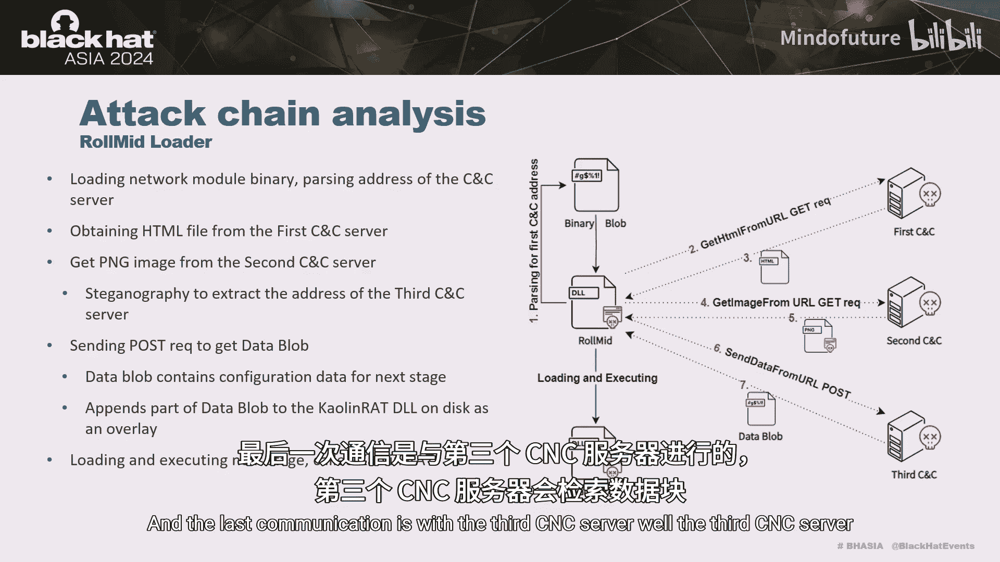
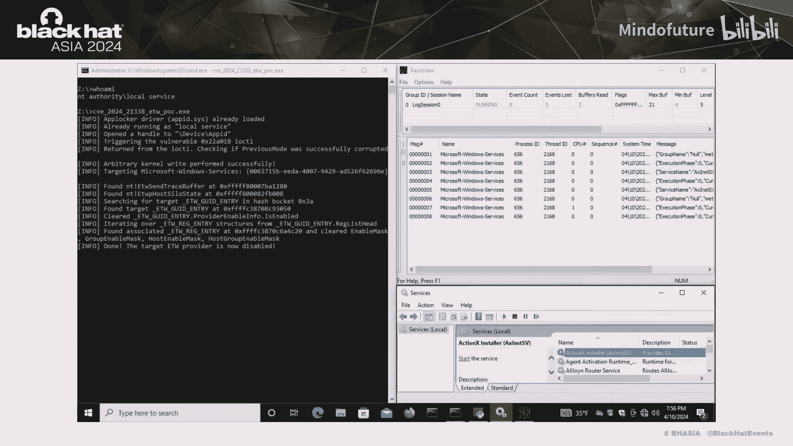

# 030：从BYOVD到0-day - 揭露网络招聘骗局中的高级漏洞利用

在本节课中，我们将学习拉撒路（Lazarus）黑客组织如何针对特定个人发起攻击，并分析他们如何利用一个零日漏洞获取内核读写权限，从而有效“致盲”安全厂商和安全功能。我们将详细拆解攻击链的每个阶段，并深入探讨其使用的内核级Rootkit模块。

## 概述

拉撒路组织通过伪造工作机会，针对特定个人发起攻击。攻击链始于一个需要受害者完成的“技能挑战”，最终部署了一个复杂的、利用Windows零日漏洞的内存驻留Rootkit。该Rootkit能够操纵多种内核对象，以禁用安全软件和系统监控功能。

## 攻击链分析

上一节我们概述了攻击的背景，本节中我们来看看攻击的具体执行链。

攻击始于攻击者通过LinkedIn、WhatsApp或电子邮件等平台，向目标发送一份伪造的工作邀约。为了展示技能，受害者被要求完成一个挑战。

以下是攻击链的核心步骤：

1.  受害者被引导挂载一个ISO镜像文件并执行其中的Amazon VNC客户端。
2.  该客户端会释放并执行一个恶意的DLL文件。
3.  恶意DLL会与一个由拉撒路组织控制的C2服务器通信，下载并执行一段Shellcode。
4.  该Shellcode的主要目的是实现持久化，它会注册一个名为“Roling loader”的服务。
5.  “Roling loader”是整个执行链的启动器，负责解密并加载下一阶段载荷“Roling”。

我们发现此样本与微软之前披露的、针对TeamCity漏洞的韩国威胁组织样本存在强烈的代码重叠，表明其同源性。

## Roling加载器分析

上一节我们介绍了初始的Shellcode，本节中我们来看看更复杂的“Roling”加载器。

“Roling”本身也是一个加载器，其任务是定位、解密并执行后续阶段。它需要在一个无扩展名的二进制数据块（Binary Blob）中定位下一阶段载荷。

以下是“Roling”的工作流程：

1.  枚举文件夹，寻找文件头4个字节表示特定数据长度的文件。
2.  读取指定长度的数据到内存中。
3.  在该数据中搜索一个“start”动作，这通常是一个导出函数。
4.  找到后，将下一阶段载荷“Romet”加载到内存中执行。

## Romet加载器与C2通信

“Romet”是另一个加载器，它需要与三个不同的C2服务器进行通信。

为了完成通信，它首先从Binary Blob中解密出网络模块，并使用该模块的导出函数。通信流程如下：

1.  从Binary Blob中解析出第一个C2服务器地址并进行通信，获取一个HTML文件。
2.  从HTML文件中提取第二个C2服务器地址，获取一个PNG文件。
3.  利用隐写术从PNG文件中提取第三个C2服务器地址。
4.  与第三个C2服务器通信，获取最终的数据块（Data Blob）。

该Data Blob包含下一阶段（Calendar RAT）的配置数据，以及创建该RAT所需的部分代码。Romet将这部分代码与Data Blob中的数据合并，在内存中创建并执行完整的Calendar RAT。

## Calendar RAT与漏洞利用

Calendar RAT是一个自定义的远程访问工具，具备文件压缩、上传、修改时间戳等能力。其最关键的功能是从C2服务器下载DLL文件并直接在内存中加载。

我们高度确信，攻击者利用此功能加载了一个漏洞利用程序，以获取内核读写权限。随后，攻击者加载了“Fa”模块，该模块负责“致盲”安全厂商和安全功能。

## 内核访问动机与BYOVD技术

在深入分析Fa模块之前，我们先快速回顾一下威胁行为体为何对获取内核级访问权限感兴趣。

从攻击者视角看，从管理员权限提升到内核权限打开了新的机会世界。这使得攻击者能够破坏安全软件、隐藏感染痕迹（如文件、进程、网络活动），并禁用内核模式遥测和各类缓解措施。

尽管微软不将“管理员到内核”视为安全边界，但他们已通过驱动签名强制（DSE）、HVCI等缓解措施显著加固了此边界，使得在内核中运行自定义代码变得非常困难。因此，攻击者被迫使用“仅数据攻击”。

一种方法是签署自己的恶意驱动，但这在签名验证过程中可能被检测。另一种方法是滥用有漏洞的驱动程序，即“自带易受攻击驱动程序”（BYOVD）技术。

BYOVD技术大致可分为三类：

1.  **已知漏洞BYOVD**：利用众所周知的漏洞驱动（如dbutil、ENI）。易于实施，但也最容易被检测，因为需要将驱动文件落地到磁盘，而微软和安全厂商会维护已知漏洞驱动的黑名单。
2.  **零日漏洞BYOVD**：利用已签名驱动中的零日漏洞。比第一种更隐蔽，但需要攻击者首先发现漏洞。理论上，加载第三方驱动仍可能产生可疑事件日志。
3.  **操作系统零日**：滥用Windows内置驱动中的零日漏洞。这是最难实现的，因为Windows组件的攻击面更小，代码质量更高。但此技术提供了最佳的隐蔽性。**拉撒路组织在本活动中使用的正是这种技术。**

## Windows零日漏洞分析

在分析受害者恶意软件时，我们发现其中一个样本利用了Windows组件中的零日漏洞。该漏洞已成功提交给微软并获得了CVE编号（CVE-2024-21338）。

具体而言，漏洞存在于`appid.sys`驱动（AppLocker功能的一部分）的IOCTL调度器中。攻击者通过向该驱动发送特制的IOCTL，能够获得运行任意内核函数的能力，并可以部分控制该函数的第一个参数。

存在一些限制，例如`SMEP`阻止调用用户模式代码，`KCFG`需要有效目标，因此攻击者需要更精巧地利用。该IOCTL通过特定设备对象暴露，要发送IOCTL，用户必须具有对该设备的访问权限，这通常需要以`LOCAL SERVICE`账户运行。

以下是他们的利用步骤：

1.  通过向AppLocker ETW提供程序写入特定事件，确保驱动已加载。
2.  等待一段时间让驱动完成加载。
3.  模拟`LOCAL SERVICE`账户以获取对该设备对象的访问权限。
4.  利用漏洞获取读写原语。
5.  使用该原语修改当前线程的`PreviousMode`，使其看起来像是从内核模式发起的调用，从而能够使用`NtReadVirtualMemory`和`NtWriteVirtualMemory`函数读写任意内核内存。

微软通过在该IOCTL调度器中引入`ExGetPreviousMode`检查修复了此漏洞。

## Fa模块：数据型Rootkit技术剖析

Fa模块是一个完全在用户空间操作的“仅数据”Rootkit。其第一版由ESET和NCC Group的研究人员在2022年独立发现并公布，当时使用了BYOVD漏洞利用并实现了7种数据型Rootkit技术。新版本则配备了上述零日漏洞利用，并实现了9种内核对象操纵技术。

以下是这9种技术的详细分析：

### 1. 针对注册表回调
注册表回调允许驱动程序监控和响应注册表更改。Fa模块通过解析`ntoskrnl`导出的`CmUnRegisterCallback`函数，扫描特定指令以找到回调链表头。遍历该链表，检查回调函数所在模块，跳过白名单模块，将其余回调函数替换为`ObIsKernelHandle`并从链表中彻底移除。

### 2. 针对对象回调
对象回调用于监控线程、进程和桌面句柄操作。Fa模块解析`ntoskrnl`导出的`ObGetObjectType`函数，查找内部的`ObTypeIndexTable`。该表指向一个`OBJECT_TYPE`结构体数组。通过遍历每个类型的回调链表，Fa模块可以通过将前后指针指向自身来“中和”这些回调。

### 3. 针对进程、线程和镜像加载回调
这些回调允许驱动程序在进程/线程创建或镜像（如DLL）加载时运行自定义代码，常被EDR使用。Fa模块首先解析必要结构，清除`PspNotifyEnableMask`以禁用回调。但这还不够，它会创建一个仅包含白名单模块回调的新数组，并用其替换原始数组，最后恢复`PspNotifyEnableMask`的值。

### 4. 针对文件系统微过滤器
文件系统微过滤器用于拦截文件系统操作。早期版本的Fa模块直接修补过滤函数，但在HVCI存在下已不可行。新版本从零开始重新实现：解析指向帧链表的`FltGlobals`结构，遍历`FLTP_FRAME`->附加卷链表->`FLT_VOLUME`->回调操作链表（按IRP主功能代码索引）->回调节点链表，最终获取过滤器结构本身。Fa模块检查过滤器名称，如果是Hitman Pro则立即移除节点；否则，根据过滤器的默认“海拔”决定是否移除。它特别关注`FSFilter Anti-Virus`和`FSFilter Activity Monitor`海拔范围内的微过滤器，将其从链表移除并彻底清空回调节点。

### 5. 针对Windows过滤平台
WFP是一套用于基于主机的网络流量过滤的API。此技术仅在系统存在卡巴斯基驱动时执行。Fa模块解析未公开的`gWfpGlobal`结构，找到指向调用出口数组的偏移量。遍历这些调用出口，Fa模块可以设置`callout`对象结构中的`conditionalOnFlow`标志。根据文档，如果设置此标志，则仅当有数据流关联的上下文时才会执行调用出口函数。一些安全厂商默认设置此标志，因此其调用出口不受此技术影响。结合对卡巴斯基驱动的初始检查，我们推测此技术专门针对卡巴斯基。

### 6. 针对Windows事件跟踪 - 系统记录器
ETW是高性能的事件跟踪和日志记录机制。此技术目标明确，通过清零`EtwpActiveSystemLoggers`来禁用系统记录器。

### 7. 针对Windows事件跟踪 - 特定提供程序
此技术包含一个95个特定GUID的硬编码列表。Fa模块解析`EtwpHostEtwState`，它包含一个GUID哈希表。通过遍历此表，Fa模块可以找到列表中的所有GUID，并通过清零`ProviderEnableInfo.IsEnabled`字段来禁用它们。同时，它还会清零相关掩码，防止这些提供程序通过其他方式提供日志。

### 8. 针对镜像验证回调
镜像验证回调在每次新驱动镜像加载到内核内存时被调用，对于反恶意软件阻止恶意或易受攻击的驱动非常有用。为破坏此功能，Fa模块首先在内存中定位`SeRegisterImageVerificationCallback`函数，然后查找指向全局对象的指针。该全局对象包含指向回调注册链表的`RegisteredCallbacks`元素。Fa模块通过使链表头直接指向自身来清空整个链表。

### 9. 针对安全软件的句柄表攻击
这是最后一种，也是最直接的攻击方式。Fa模块首先在自身进程结构中进行小修改：清零缓解策略标志并清除句柄表中的启用句柄异常标志，以增加攻击稳定性。

当用户模式代码与内核对象交互时，它通过“句柄”间接引用对象。内核通过“句柄表”将句柄转换为对应的内核对象指针。每个进程的`EPROCESS`结构中都有一个指向其句柄表条目的指针。

Fa模块利用此机制：
1.  创建一个具有全部访问权限的线程，这会在句柄表条目中创建一个新条目。
2.  通过读写原语，修改该条目中的对象指针位，使其指向目标安全软件进程（如Windows Defender、CrowdStrike、Hitman Pro）的内核对象。
3.  现在，Fa模块可以对该“句柄”调用任何API函数，例如挂起目标进程及其所有线程，从而实现破坏。

## 总结

本节课中我们一起学习了拉撒路组织一次复杂攻击的完整链条。我们的研究表明，拉撒路组织仍在投入大量资源开发复杂攻击，包括发现并武器化零日漏洞以针对高价值资产。

尽管存在各种缓解措施，但我们的发现表明，基于内核的安全解决方案仍然存在脆弱性。同时，尽管攻击手法先进，拉撒路组织仍在使用网络钓鱼作为初始感染媒介。

攻击的核心在于利用Windows零日漏洞突破内核边界，随后部署功能强大的Fa数据型Rootkit。该Rootkit通过9种精妙的技术，在不执行任何内核代码的前提下，系统性地禁用安全监控、破坏安全软件，展现了高级持续性威胁在对抗现代安全防护体系时的深度和技巧。