# 031：EDR 重装上阵 - 远程擦除数据

在本课程中，我们将学习如何通过向合法文件中远程植入恶意软件签名，来“欺骗”端点检测与响应产品，使其误删关键文件。我们将详细介绍研究目标、漏洞发现步骤，并展示10种不同的攻击向量。

## 概述与目标

我们的研究目标是：通过远程向合法文件中植入恶意软件签名，混淆EDR产品，使其误认为这些合法文件是恶意的，从而触发自动删除。

打个比方，防御者通常认为泰勒·斯威夫特是良性的。我们将尝试植入一个小的恶意“烟幕”，让防御者认为泰勒实际上是邪恶的，并尽其所能将其清除。

我们的引子是：如果我们能在无需任何身份验证的情况下，通过互联网远程删除你的关键文件，你会作何感想？即使你使用了不同的安全控制措施，或使用了完全打补丁的Windows或Linux服务器。在接下来的时间里，我们将证明这绝对是可能的。

起初，我们面临三个挑战：
1.  误报或误警是长期存在的已知问题，安装在数亿终端上的安全控制措施可能已经对误报免疫。
2.  我们这里想要实现的误报更为罕见，因为我们希望触发字节签名引擎，这通常被认为是误报率最低、最受信任的检测层。
3.  最后一个挑战是如何远程触发它。

## 第一步：寻找触发自动删除的签名

第一步的目标是找到一个签名，当将其附加到我们的文件中时，会触发自动删除。

我们决定采用黑盒方法，而非白盒方法。这是因为每个安全厂商的产品都使用不同的专有数据库格式，而我们的研究目标是尽可能多地发现不同产品中的漏洞，因此黑盒是最佳策略。

我们首先决定专注于Windows Defender，因为它是默认安装在各地的EDR。我们假设VirusTotal使用了与终端上常规Windows Defender相同的代理，并且VirusTotal也为我们提供了便捷的分析能力。

我们运行查询，获得了3600个结果。我们决定将文件最小化，找到仍能触发Defender检测的最小签名。

让我们通过一个简单的例子来理解我们的技术。在示例中，我们从字符串“xABCy”（检测到的签名）开始。我们移除第一个字母“x”并将文件写入磁盘以触发Defender扫描，仍然获得检测，这意味着“x”不是签名的一部分。但当我们移除“A”并写入磁盘时，这次没有检测到，所以“A”是签名的必要部分。“B”和“C”也是必要的，而“y”不是。因此，最小签名是“ABC”，我们稍后会用到它。

接下来，我们决定通过阅读文档来了解更多关于Defender威胁级别的信息。

我们找到了MP威胁类，其中包含一个名为“Severity ID”的有趣字段。我们发现威胁严重性有四个级别：低、中、高和严重，以及针对每个威胁严重性采取的默认操作。

我们假设最严重的威胁级别可能具有最严重的默认修复操作，这正是我们寻找的。我们通过逆向分析Defender验证了我们的假设是正确的。如右侧所示，这是扫描器的逻辑。因此，我们的目标是找到一个严重级别的签名，以触发文件的自动删除。

我们继续手动搜索正确的签名，但这花费了我们太多时间并经历了多次失败尝试。我们找到的签名要么需要手动修复步骤，要么只导致文件部分被删除。因此，我们意识到应该从手动过程转向自动化过程。

我们下载了原始VT查询中的所有3600个恶意软件样本，并开发了第一个基本工具，用于自动从每个恶意软件中提取最小签名。该脚本非常基础，只是自动化了手动过程。

大部分样本实际上是同一恶意软件家族的变体，最终我们只找到了130个独特的签名。

但我们如何选择最适合我们需求的签名呢？由于我们假设在合法文件中植入签名会有限制，我们必须优先考虑不同的签名，以便在数据库中找到限制最少的最佳签名。

我们相信字母数字签名限制会更少。我们可能还有长度限制，因此我们希望使用非常短的签名。

第一个签名无效。它是“aR”的Base64编码，Defender仅在签名前后没有额外字节的精确内容时才会删除。

我们转向第二个签名，它只有15个字符长度，并且仅由两种非字母数字字符组成：`$` 和方括号 `[]`。让我们尝试手动将其添加到我们自己的文件中。它成功了。

这个算法导致了我们自己文件的删除。这实际上是我们第一次成功找到能触发文件自动删除的最小签名。

但删除我们自己的文件并不有趣，对吧？所以我们的下一步很明显：验证我们是否可以手动将此签名附加到目标合法文件上。

我们尝试手动将签名附加到另一个现有文档的中间，但出乎意料的是，它没有生效。因此，我们开发了另一个更快的“最小化器”，它导致Defender扫描导出的函数，而不是像第一次那样迭代写入磁盘并等待检测。这种方法要快得多，因为Defender在此方法中根本不会隔离文件。

该工具从排除的路径读取目标恶意软件，并用字母“Z”替换每个字节，然后扫描它。如果VT认为是良性的，则我们将“Z”恢复为原始字节。

让我们看一个例子：我们取Mimikatz的二进制文件，运行代码。当我们将Mimikatz签名附加到合法便携式可执行文件的中间时，它成功了。

问题是我们无法想到任何针对PE文件的有趣攻击向量。如果用户已经有权限写入PE文件，他可能无论如何都可以删除它。

因此，我们必须专注于非可执行文件，并理解为什么它未能检测到我们自己的签名。

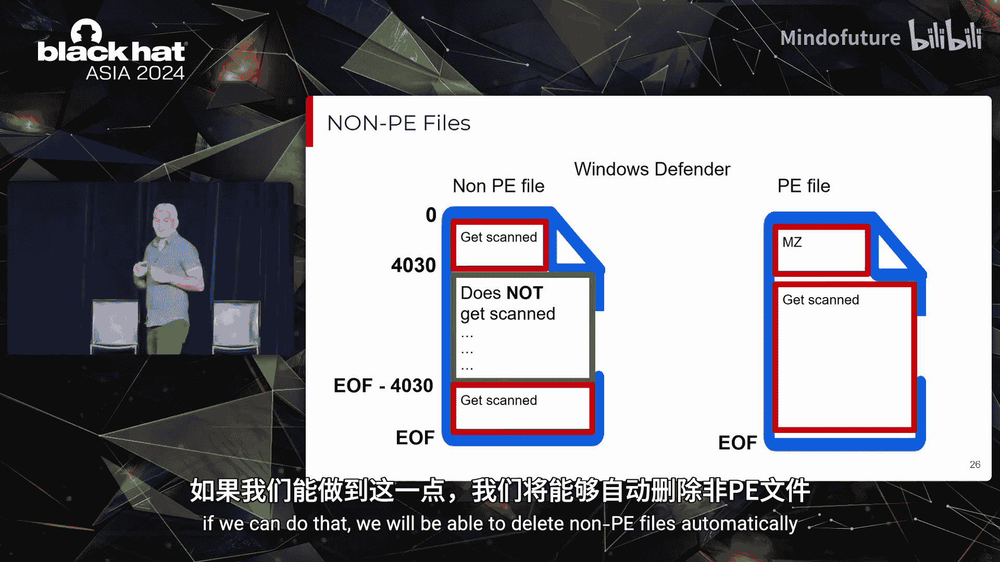

我们开发了额外的工具来理解非PE文件的限制。该工具尝试将相同的签名从文件开头逐步嵌入到文件末尾的增量偏移量中。

我们发现，对于非PE文件，Defender不会扫描整个文件，可能是出于效率原因。它只扫描文件的前4030字节和最后4030字节。

这意味着我们必须将签名附加到目标文件的这些部分。如果我们能做到这一点，我们将能够自动删除非PE文件。

到目前为止，我们专注于学习如何本地触发自动删除。现在，我们应该规划如何实现远程攻击向量。

我们需要一种方法，让一个有特权的设备能够将我们的数据写入远程文件。

我们想到的第一个想法是日志。如果我们能够向Web服务器发送一个包含我们签名的HTTP请求，并且该Web服务器记录了我们的请求，我们将能够触发安装在Web服务器上的远程Defender删除日志文件。

那么，使用哪个HTTP字段呢？我们查看了IIS日志，发现用户代理字段是一个长的自由文本字符串，它完全写入到包含所有客户端请求的每日单个日志文件中，而不仅仅是我们自己的请求。因此，这应该是包含签名的理想位置。

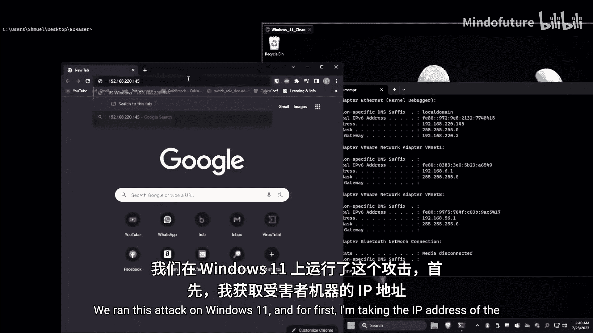

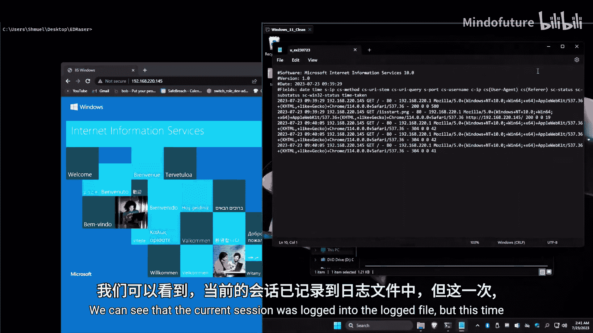

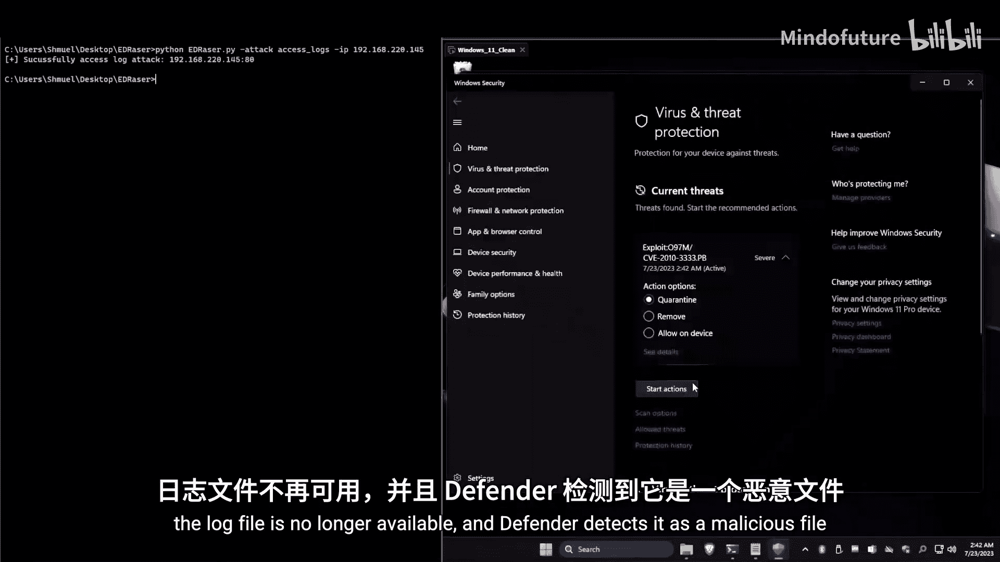

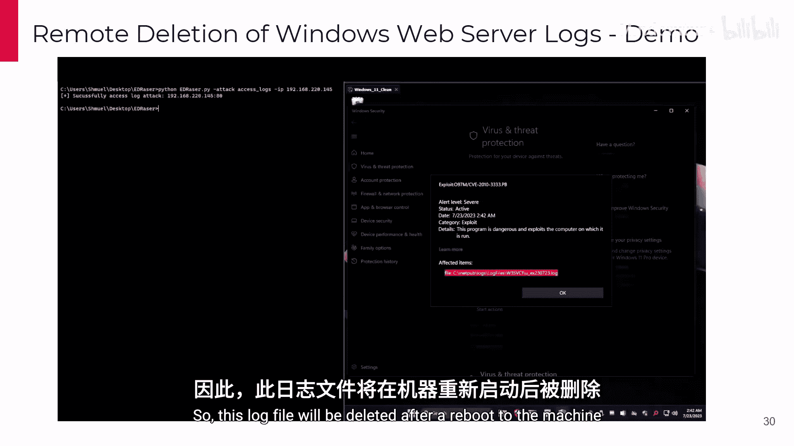

## 攻击向量演示：远程删除IIS Web服务器日志

现在让我们探索我们的第一个攻击向量，我们会有很多。它是通过互联网远程删除IIS Web服务器日志。

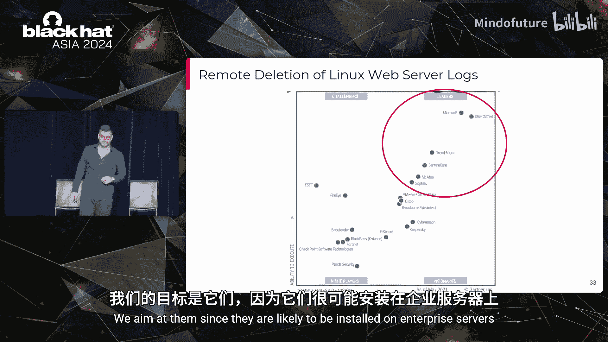

在这个演示中，我们将看到IIS Web服务器日志的远程删除。我们在Windows 11上运行此攻击，首先获取受害机器的IP地址，我们可以看到可以轻松浏览它。让我们确保我们的会话被记录到日志文件中，导航到日志文件，我们可以看到当前会话已记录到日志文件中。但这次，让我们尝试攻击机器。使用我们用于此攻击的工具“Eraser”，提供远程服务器的IP地址。运行攻击后，我们可以看到日志文件不再可用，Defender将其检测为恶意文件。此日志文件将在机器重启后被删除。

正如你在演示中看到的，Defender将IIS日志检测为RTF漏洞利用，并将在重启后删除它。IIS是Windows服务器的一个好例子，但大多数Web服务器安装在Linux上，而Linux默认没有安装EDR。因此，我们的目标是触发其他可能安装在大量Linux Web服务器上的EDR解决方案。

根据Gartner魔力象限，这些是市场上的领先EDR产品。我们以它们为目标，因为它们很可能安装在企业服务器上。

正如我们所见，到目前为止，我们确认了我们技术的有效性，并且我们现在有能力以触发自动删除的方式自动减小签名大小。有了这些知识，下一步就很明显了：为我们命名为“邪恶签名”的各种领先EDR厂商创建一个数据库。

这个数据库将允许我们执行能够触发大多数（如果不是全部）EDR解决方案的签名查询。这种方法在我们不知道远程机器上安装了哪个EDR的情况下非常有益，因为我们可以使用此数据库并获得适合此远程攻击的签名。

当我们探索不同的EDR解决方案时，我们注意到它们的行为存在差异，这可能是由于设计不同造成的。然而，我们的调查使我们发现，卡巴斯基EDL表现出了我们正在寻找的确切行为。因此，在接下来的Linux示例中，我们专注于针对安装了卡巴斯基EDL的服务器。

我们的另一个次要目标是找到一个能触发大多数易受攻击的EDR的签名。这对于我们不知道远程机器上安装了哪个EDR的情况将是完美的。经过一些尝试，我们找到了一个触发卡巴斯基的签名，但它也能触发Defender。

现在让我们看看在安装了Nginx Web服务器和卡巴斯基作为EDR的Linux机器上会发生什么。

在这张图片中，你可以观察到安装在Ubuntu机器上的Nginx服务器，在红色框内高亮显示。你可以看到我将使用一个基本的Python脚本发送给受害者的恶意签名。我将恶意负载伪装成用户代理发送给Nginx Web服务器，在我执行此命令的那一刻，卡巴斯基立即将日志文件检测为恶意并删除它。同样的方法在Apache Web服务器上也有效。

总之，通过使用一个非常短的签名，据称我们将能够远程删除世界上高达35%的Web服务器日志。这是相当惊人的结果。我们在Linux上用卡巴斯基演示了这一点，但它也有可能扩展到其他安全厂商。

## 其他攻击向量概览

在接下来的幻灯片中，我们展示了我们已识别的各种攻击向量的简要示例。

第一个是FTP服务器。不仅Web服务器日志面临风险，FileZilla FTP服务器也面临风险。例如，这次我们使用从Invoke-Mimikatz PowerShell恶意软件最小化的签名作为FTP登录的用户名。这个恶意用户名被写入FTP日志，导致Defender删除它。

另一个是使用Mozilla Thunderbird的电子邮件攻击场景。攻击者向受害者发送一封主题中包含恶意签名的电子邮件。然后，按照设计，Mozilla Thunderbird将整个数据库存储在磁盘上的单个文本文件中，本地收件箱将被EDR删除，而Thunderbird将尝试再次下载它。这将导致无限循环：下载整个收件箱，然后被EDR再次删除，然后再下载回来，再被删除。

另一个攻击向量是通过执行损坏的MSI文件。MSI属性中的主题字段将包含邪恶签名，这将导致包含邪恶签名的日志记录被写入应用程序Windows事件日志文件，从而触发EDR删除此文件。

但这还不是全部。那么实现Windows日志文件的删除，但这次是远程的，可能吗？答案是肯定的。通过尝试使用恶意用户名通过SMB等方式对机器执行远程登录，我们可以远程将恶意记录插入安全事件日志。如果我们重复此过程足够多次，记录最终将位于日志文件的末尾，导致其被删除。

让我们看一个演示。再次，我们在最新的Windows 11上运行，这次我再次获取受害机器的IP地址。我再次使用Eraser运行远程攻击，这次尝试使用恶意用户名通过SMB远程登录到机器。脚本完成后，让我们扫描Windows中的日志文件夹，看看我们会实现什么。

扫描文件夹，我们可以看到它发现了一些恶意内容。让我们看看它到底是什么，我们可以看到这次安全日志现在被认为是恶意的，它们将被删除。

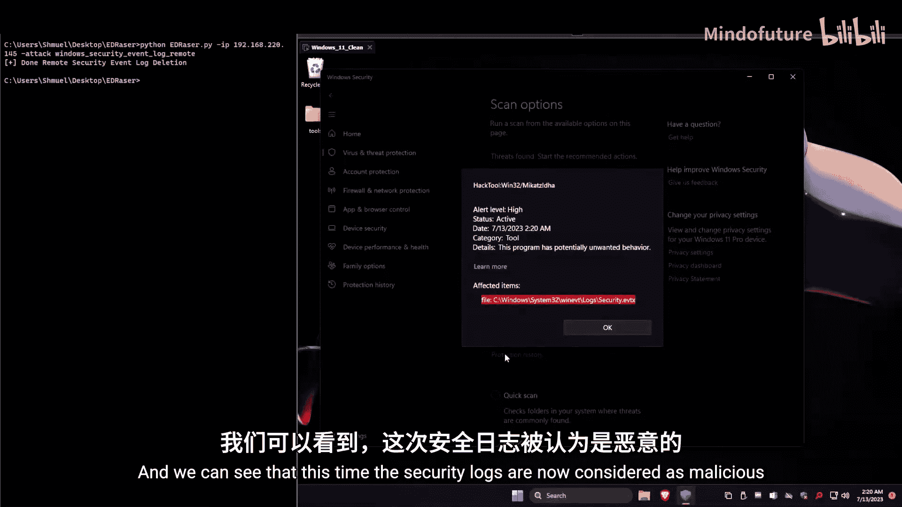

## 自我吞噬：攻击Defender自身日志

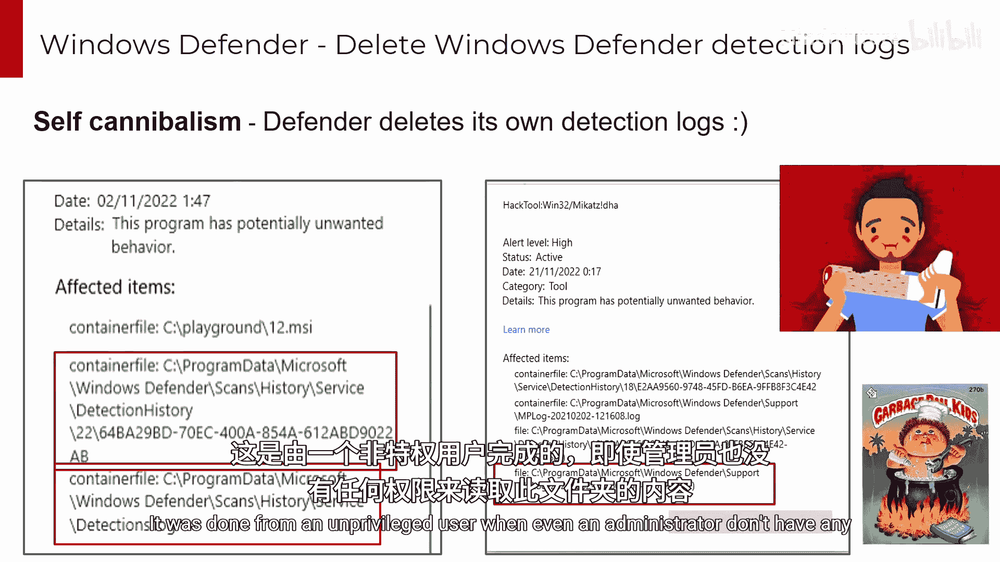

自我吞噬：我们如何让Defender攻击自己的检测日志。这是由一个非特权用户完成的，即使是管理员也没有任何权限读取此文件夹的内容。

让我们看看我们是如何做到的。首先，我只需在桌面上创建一个新文件夹，并用恶意签名命名它。这些字节，正如你现在看到的，将触发Defender。Defender将其检测为恶意文件，但有趣的部分是Defender会将此事件记录到自己的日志文件中。现在Defender的日志文件将包含恶意签名。所以，如果我们现在扫描Defender的日志文件，我们会看到它再次发现了恶意内容，让我们看看是什么。

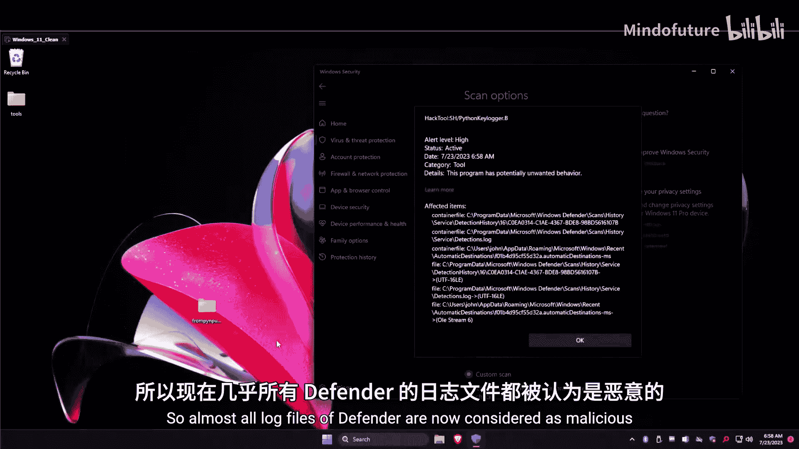

几乎所有的Defender日志文件现在都被认为是恶意的，它将删除自己的日志。

## 攻击日志聚合系统与虚拟机

好的，现在我们明白我们可以远程删除日志，但我们能实现更多。让我问你一个问题：企业中的日志会怎样？嗯，正如百川归海，所有日志都流向同一个数据库。例如，Splunk，它是监控、搜索和分析日志的中心点。让我们看看我们如何可能触发针对Splunk的连锁反应。

我们通过手动添加一个文件名包含邪恶签名的日志文件来验证这一点。Splunk会将文件名写入自己的数据库，这将导致Defender删除整个Splunk数据库。

当受感染的Windows事件日志被Splunk收集时，它将被添加到Splunk数据库中，这将再次导致Defender删除它，从而实现相同的目标。

日志绝对不是我们可以攻击的唯一东西。让我们看看在VMware下完成的两种虚拟机攻击向量。

首先，我们开始查看客户机上的.vmx文件，这是虚拟机的配置文件。此文件是机器启动所必需的，没有它，机器根本无法再次启动。因此，我们想检查客户机是否可以将数据写入此文件，以便将恶意签名植入其中。

研究从客户机发起到主机的通信，经过一番挖掘，我们发现VMware工具提供了一个名为“vmware-rpctool”的工具，允许你与主机通信，这可以由普通用户完成。

使用vmware-rpctool可以做的事情之一是设置全局变量。其中之一称为“guestinfo.detailed.data”。你可以在主机上设置这些变量，会发生的情况是：这些变量将位于主机上的.vmx文件中。例如，如果你能看到图片上的这个命令，我将这个guestinfo变量设置为等于“evil signature a”，这将冒泡到.vmx文件，并导致EDR删除此文件，从而产生此错误。在我执行此命令的那一刻，我在主机上收到了这个错误，我们可以看到这个错误消息说.vmx文件不可用，这意味着客户机无法再次启动。

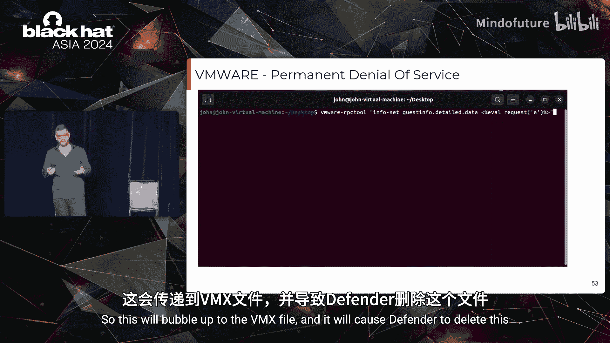

但等等，还有更多。这个攻击很好，但它只针对配置文件。那么针对整个虚拟数据本身呢？可能吗？当然可能。我们通过在客户机上创建大量恶意文件（在这种情况下大约100,000个）来实现这一点，这将导致这些文件被写入客户机的.vmdk文件中，这将导致EDR将这些.vmdk文件检测为恶意，Defender将删除它们。让我们看看演示。

运行此攻击，基本上我在此文件夹中放入了一个恶意文件，你现在可以看到。所以，我从主机获取一个恶意文件，一个单独的恶意文件放入此文件夹，然后我运行这个脚本，它只会多次复制此文件。在它复制此文件大约100,000次后，我对机器执行关机。我们可以看到，在机器关机的那一刻，我们收到了来自Defender的通知，Defender发现这些文件现在被认为是恶意的。我们无法再次启动机器，因为这些文件现在被认为是恶意的，我们无法访问它们。

我们可以说机器根本无法启动。

## 攻击生产数据库

大多数组织的核心资产并非存储在文件中，而是存储在数据库中。虽然我们主要专注于删除日志和配置文件，但问题出现了：我们有可能通过互联网删除整个生产数据库吗？

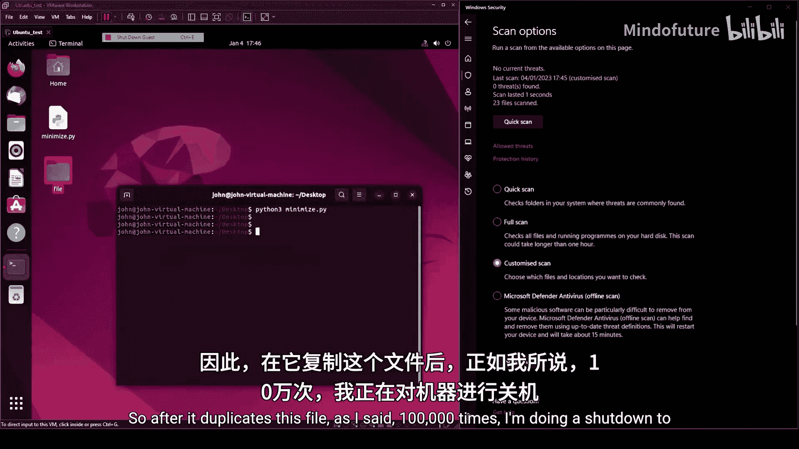

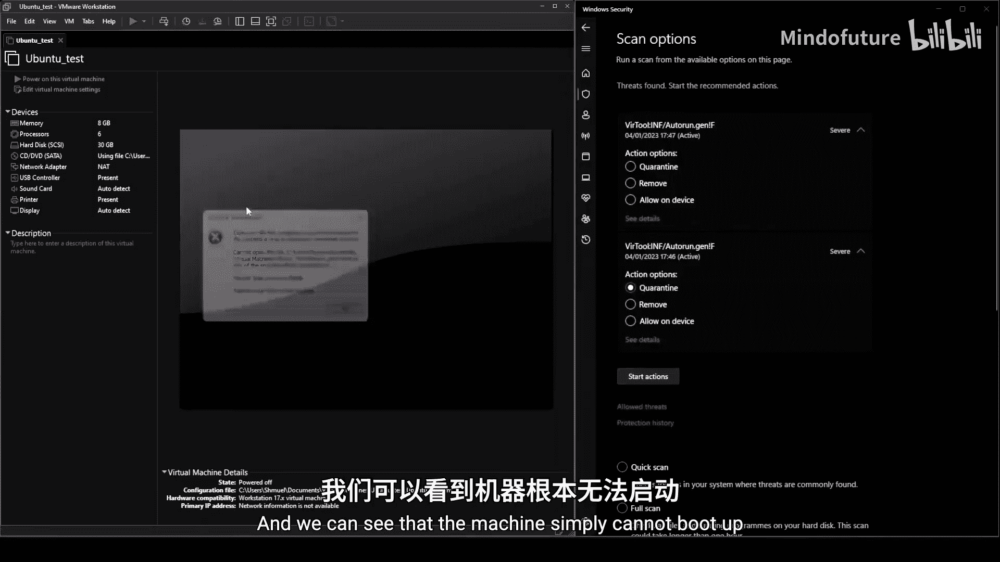

通常，用户没有权限直接向远程数据库插入查询。然而，网站通常依赖后端数据库进行操作。例如，考虑一个网站具有新用户注册表单的场景。通过通过此表单向数据库提交我们的恶意数据（例如注册新用户），我们将能够在无需任何身份验证的情况下，远程提示Defender删除整个数据库。

让我们看一个演示。对于这个演示，我创建了一个注册到新数据库的小表单，我们在后端使用Linux和卡巴斯基安装的MySQL作为测试数据库。我们可以看到数据库实际上正在工作，并且我们能够向其中插入新数据。所以，让我们向其中插入一个恶意签名。插入恶意签名后，正如你所看到的，它被提示到数据库中。我们可以看到卡巴斯基立即检测到数据库文件，关键数据库文件是恶意的。我们可以看到，在卡巴斯基识别它们的那一刻，我们无法再访问数据库，数据库服务实际上崩溃了。即使我们尝试从外部备份恢复这些恶意文件，卡巴斯基再次将它们检测为恶意并再次列出它们，这个数据库不再可用。

此攻击在Windows上使用Defender或其他易受攻击的EDR解决方案时同样有效。在将Mimikatz签名植入MariaDB数据库后，数据库文件被标记为恶意。这不仅存在潜在数据丢失的风险，还会导致数据库服务变得无法访问，正如我们在MySQL上的相同演示中看到的那样。即使尝试从隔离区或外部备份恢复也会失败，我们无法恢复其功能。

我们测试了我们的攻击针对世界上最流行的数据库。以同样的方式，我们能够在Linux和Windows平台上使用易受攻击的EDR远程删除PostgreSQL、SQLite和MongoDB数据库。考虑到这些不同数据库的广泛使用以及对主要网站的潜在影响是巨大的。

## 攻击客户端浏览器

到目前为止，我们已经探索了针对服务和服务的各种远程攻击向量。现在我们将转变方向，演示一个Web服务器可以对客户端浏览器发起攻击的场景。

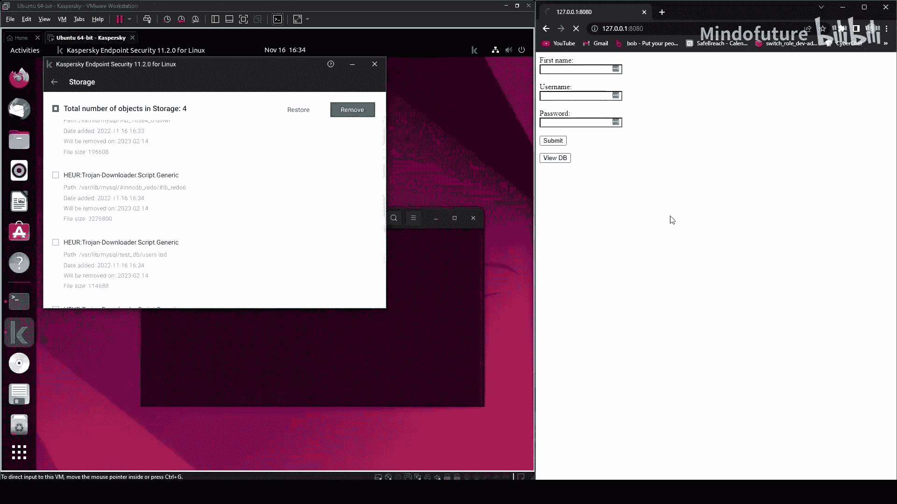

让我们看看我们是如何做到的。当攻击者向受害者发送链接时，一旦点击，受害者的浏览器就会向服务器发送HTTP请求。

恶意Web服务器然后用一个签名（甚至可能在cookie文件中）进行响应。

结果，受害者的浏览器将此响应记录到其本地数据库中，然后触发Defender删除它。

这是远程删除Chrome历史记录和Web数据数据库的一个例子。所以我们可以看到这些文件现在被认为是恶意的。

我们相信我们发现的这10个攻击向量只是冰山一角。关于云攻击，可能性几乎是无限的。随着Defender嵌入全球无数关键接入点，潜在的损害是巨大的。

## 漏洞披露与补丁分析

我们在2023年初向相关厂商报告了此漏洞。微软于2023年4月发布了针对此漏洞的修复程序，这是CVE编号。卡巴斯基没有发布补丁，但他们也计划缓解这些攻击。但这还不是我们故事的结束。

这是我们迄今为止发现的时间线。在2023年4月补丁发布后，我们立即开始检查原始攻击向量，发现并非所有攻击向量都被修复。

但我们将深入分析推迟到了8月。在这个例子中，这是在完全打补丁的机器上仍然可能实现的Defender检测日志文件的未修补删除。在检查时，我可以告诉你，即使在现在仍然是可能的。在检查了我们最初于2023年1月报告的每个攻击向量后，我们能够看到几乎一半的攻击向量仍然有效。所以左边是已修复的攻击向量列表，右边是补丁未修复的攻击向量列表。

我们开始专注于MySQL数据库，这是世界上最流行的数据库之一。

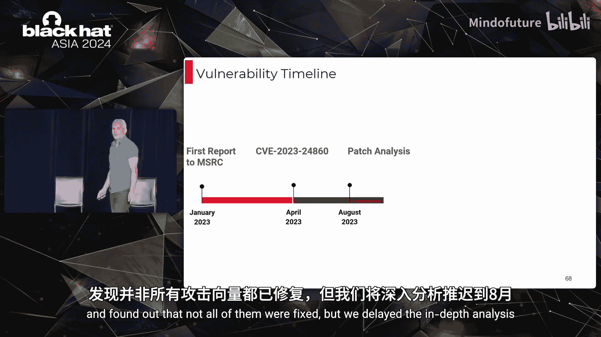

MySQL 12的默认存储引擎是InnoDB。文件大小是动态的，并且在插入新数据几乎到达文件末尾时会增大。默认大小是3 MB，导致漏洞未被触发，因为我们的签名从未写入Defender扫描的分配区域。

但InnoDB并非一直是默认存储引擎。MyISAM是默认存储引擎，直到MySQL版本5.5.5。

MyISAM数据库文件大小不是动态的。当插入新数据时，它将被附加到文件末尾，这可能是易受攻击的。所以我们尝试一下，尝试使用MyISAM存储将我们的签名插入MySQL。

让我们看一个演示。

在这一点上，你知道流程。首先，获取目标文件的远程IP。我们运行MySQL，你可以看到它正在运行。现在，让我们验证在检查时它是一台完全打补丁的机器。记住，补丁是在4月发布的。我们在那时是7月底。运行攻击。

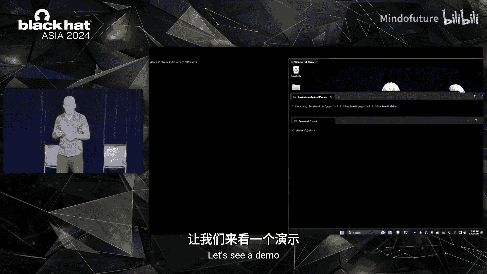

立即，服务崩溃了。我们可以看到我们的文件，.MYD文件，它是核心数据库文件被检测到，服务不再可用。Defender将.MYD文件检测为MS Office漏洞并删除了数据库文件，导致拒绝服务和数据丢失。

但MySQL 5确实非常旧，但有一些非常常见的安装程序，如WAMP（代表Windows、Apache、MySQL和PHP套件），它使用MyISAM作为默认存储引擎，使得此攻击在今天仍然相关。

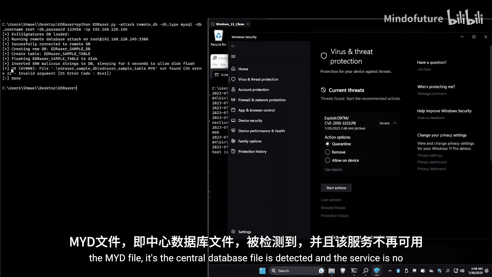

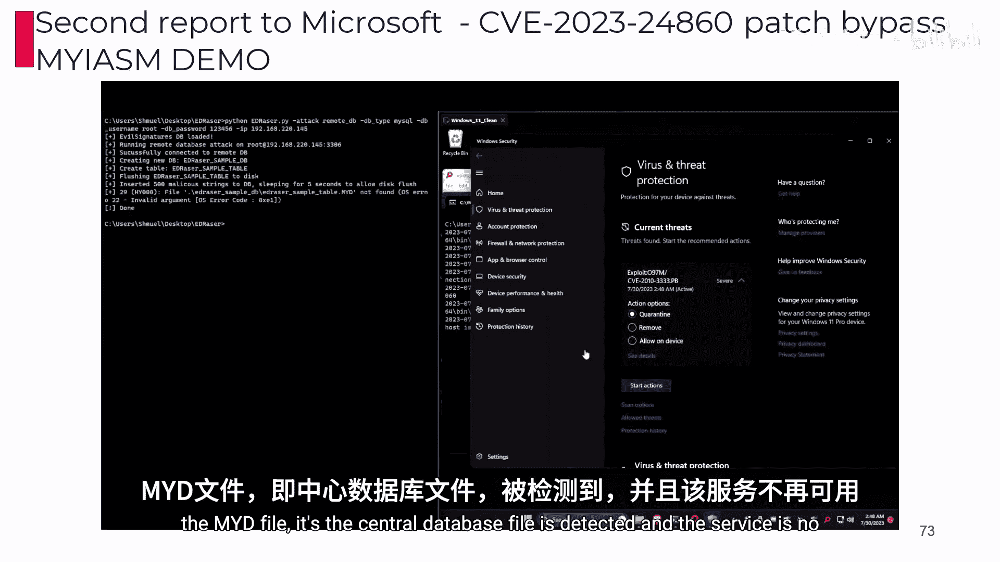

但这只是补丁的第一次绕过。我们希望能够绕过MySQL删除和其他数据库，即使它们使用最新的默认存储引擎。查看表格，很容易看出左边标记为绿色的文件以二进制格式存储，而右边的所有文件都以文本格式存储。因此，似乎补丁改变了Defender扫描文件时的行为。当文本文件包含基于文本脚本的恶意签名时，它会触发检测，但当文件是二进制格式时，它会忽略相同的签名。

如果我们对二进制格式的数据库使用二进制签名会发生什么？

我们使用一个简单的脚本尝试了我们从签名数据库中收集的所有签名，并找到了一个名为“Levinian Case Sign”的签名，它触发Defender在完全打补丁的机器上删除数据库。让我们看一个演示。

这是一个InnoDB MySQL服务器。我们在同一时间（7月底）做了这个。获取目标的IP。运行MySQL并启动攻击。好的，再次，服务崩溃了。再次，这次是Levinian Case签名触发了InnoDB文件，你可以看到InnoDB。即使你尝试重新启动服务，重启操作系统，尝试从外部备份恢复，它也不会工作，数据库完全消失了。

微软于2023年12月发布了第二个补丁CVE-2023-36010。猜猜我们的下一步是什么？当然，我们再次分析了补丁。让我们看看我们取得了什么成果。

补丁根本没有修复InnoDB MySQL的远程删除。你可以看到这是一个完全更新的Defender，包含了12月的补丁，签名被插入到数据库中，触发了Defender。

那么让我们看看补丁是否在MyISAM MySQL远程删除中添加了逻辑。好的，我们发现它确实专注于MyISAM数据库修复，添加了基于MyISAM文件格式的白名单算法。Defender检查扫描的文件是否以`0xFD`字节开头，以及文件大小是否与256字节对齐。如果两者都为真，即使找到恶意签名，它也不会触发检测。

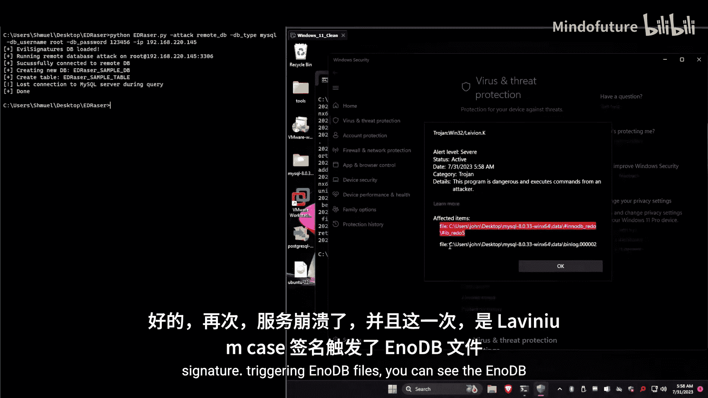

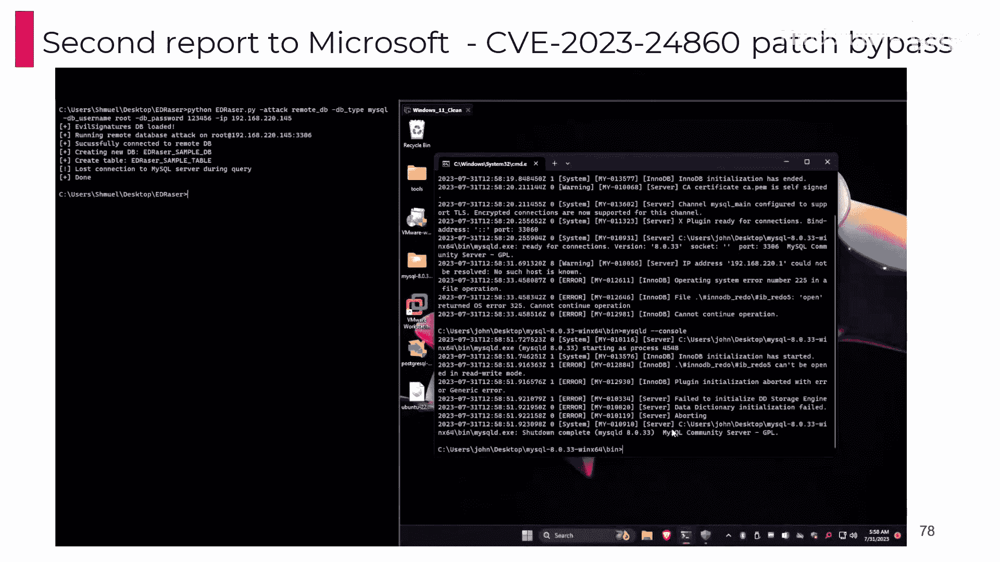

因此，我们的目标是绕过白名单以触发数据库文件的删除。我们当然无法控制数据库的前几个字节，因此我们专注于记录的大小。文本字段的默认长度值是256字节，但对于使用非默认文本字段长度的任何数据库来说，情况并非如此。根据MySQL手册，文本字段的长度最多可以达到65,000字节。如果受害者数据库使用非默认文本字段会发生什么？

正如我们所见，我们能够将Levinian Case签名插入到MyISAM MySQL数据库文件中大于256字节的字段中，并绕过白名单逻辑。

因此，在原始补丁发布一年后，我们能够绕过由两个不同补丁修复的几乎所有攻击向量。当然，我们也报告了。

## 补丁绕过与惊喜

除了绕过第二个补丁，如果你还记得，我们承诺在最后有一个特别的惊喜。我们将介绍由MSRC引入的Windows Defender通用检测绕过。

如果你还记得我们刚刚展示的由第二个补丁添加的白名单逻辑，如果我们能由于安全补丁而使非恶意的IOC被Defender白名单化呢？

我们知道PE文件必须以“MZ”开头才能工作，对吧？这是头部魔数。所以我们专注于脚本。我们尝试将`0xFD`字节添加到脚本的开头。但这当然不是一个合法的脚本命令，所以我们为此寻找解决方案。我们找到了一个PowerShell命令，称为“ErrorActionPreference”，其可能值为“SilentlyContinue”，这意味着不显示错误消息，并且执行继续而不中断。这正是我们等待的。我们还添加了一个注释，以将PowerShell脚本的大小对齐到256字节，注释可以是任意大小，对吧？请见PowerFD，我们的工具。FD赋予恶意PowerShell超级能力以绕过Defender，它也是完全无法检测的。所以它很有趣，而且只有17行代码。你可以看到我们实现并绕过补丁并使任何PowerShell脚本变得完全无法检测的所有三个步骤。不错吧？

微软向我们确认了所有绕过，但决定不修复最后一个，也不发布第三个CVE。相反，他们添加了改进和配置，以减少误报和数据丢失的风险。这是完整的回应。

关于Defender绕过，微软确认了通用绕过，但决定不修复它，因为攻击者必须在攻击之前获得对设备的初始访问权限。

这是最终的时间线，以概括一切。几乎我们所有的攻击向量仍然是可能的。

## 总结与要点

这是我们的GitHub仓库，你可以在其中找到EDR Eraser，它支持我们发现和展示的所有内容，你也可以非常轻松地扩展新的攻击向量。所以请使用它。

对于要点，我将以此作为结束。

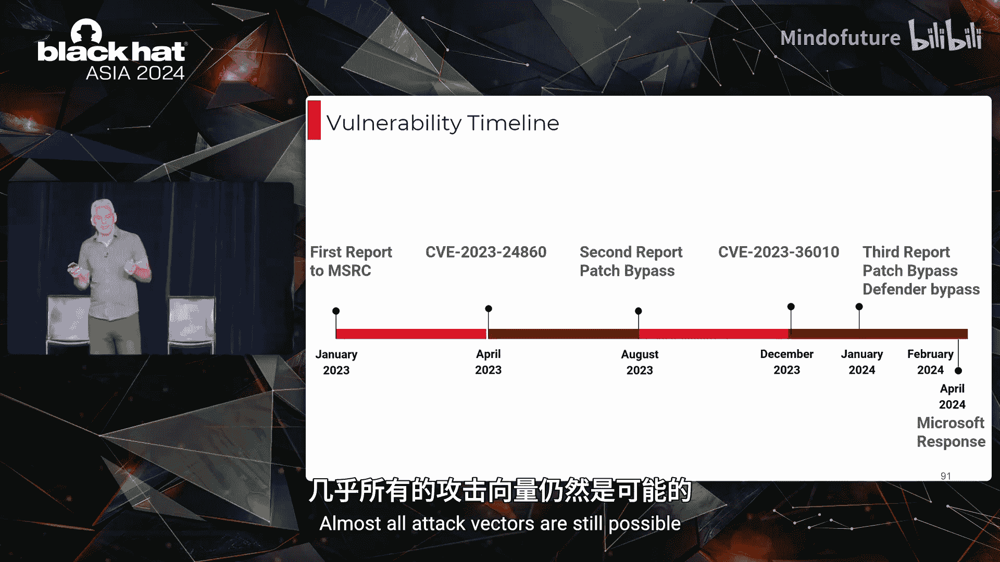

远程删除漏洞难以修复，正如你所见，特别是当安全控制依赖于字节签名检测时。

安全补丁可能不完整。修补不应被视为灵丹妙药，其他安全层应防止单点故障。

最后，修复安全控制中漏洞的安全补丁可能会引入绕过和意外行为。

本节课中我们一起学习了如何通过植入恶意签名来混淆EDR产品，触发其误删合法文件。我们详细介绍了从寻找最小签名到实现多种远程攻击向量（包括Web服务器日志、数据库、虚拟机配置乃至EDR自身日志）的全过程，并分析了厂商补丁的局限性与后续的绕过方法。核心在于理解EDR的签名检测机制及其在文件格式、扫描范围上的限制，从而找到攻击面。