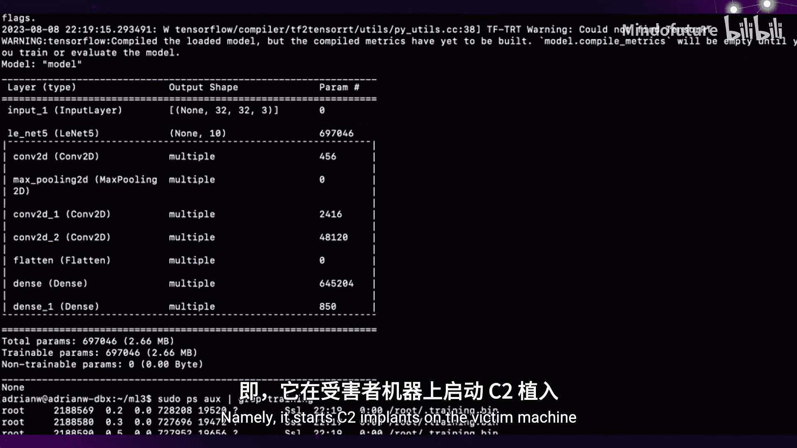
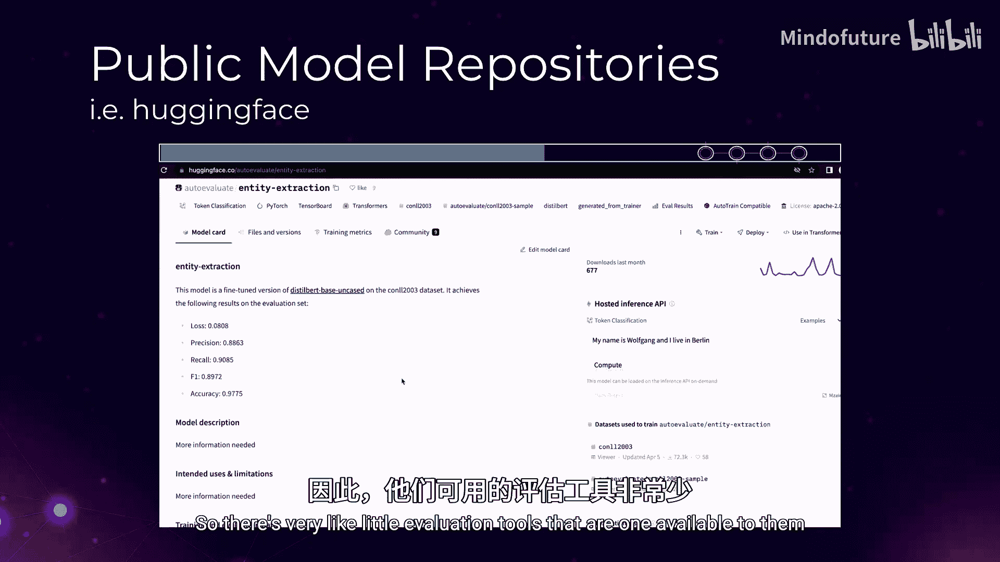
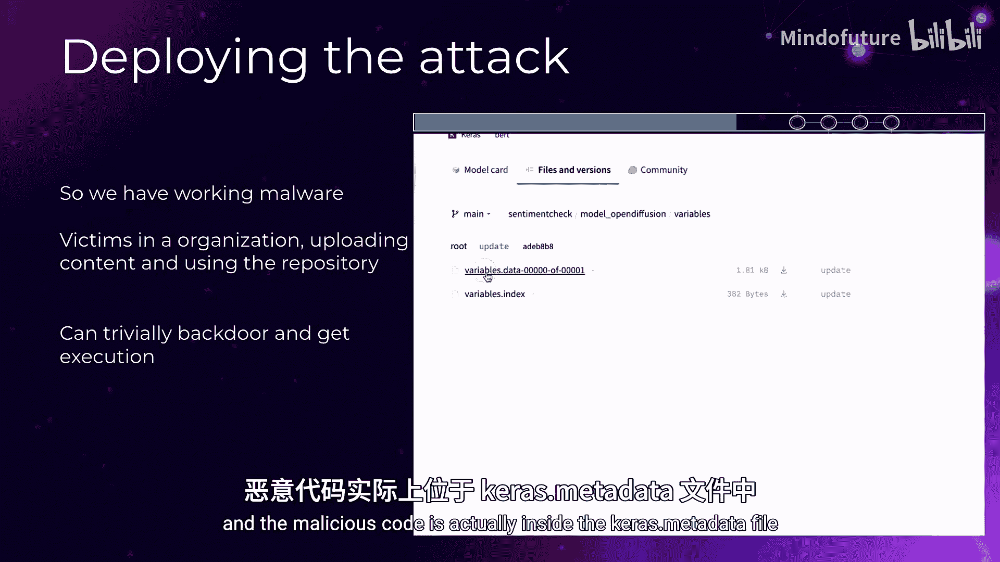

# 032：混淆学习——通过机器学习模型进行供应链攻击

在本教程中，我们将学习一种针对机器学习模型的供应链攻击方法。我们将了解攻击者如何将恶意软件嵌入到模型中，如何通过公共模型库（如Hugging Face）传播这些模型，以及防御者可以采取哪些措施来检测和防范此类威胁。



## 概述

机器学习模型供应链攻击是一种新兴的安全威胁。攻击者通过污染或创建包含恶意代码的模型，并利用目标组织对公共模型库的信任，将恶意模型引入其机器学习流水线中，从而获取对敏感数据和系统的访问权限。

## 关键概念：模型即程序

首先，我们需要理解一个核心概念：机器学习模型不仅仅是纯函数，它们本质上是完整的软件程序。这意味着模型可以包含并执行任意代码。

一个表面上具有完美准确率的模型，在后台可能执行额外的恶意步骤，例如在受害机器上启动C2（命令与控制）植入程序。



**公式/代码表示**：一个被感染的模型可以抽象表示为：
`模型输出 = 预期函数(输入) + 恶意函数(环境)`

上一节我们介绍了机器学习模型可以作为恶意软件载体的基本概念，本节中我们来看看攻击者如何选择目标并实施攻击。

## 攻击者视角：目标选择与攻击路径

攻击者需要找到愿意运行其恶意模型的受害者。机器学习领域中的多种角色都是潜在目标。

以下是主要的目标角色：
*   **机器学习工程师**：负责开发、训练模型，或从Hugging Face等平台拉取模型进行测试。
*   **MLOps运维人员**：负责搭建和维护机器学习流水线基础设施。

对于攻击者而言，机器学习流水线是一个理想的攻击环境。它通常靠近业务的核心数据资产，且由于大量使用Kubernetes、容器和虚拟环境等技术，防御团队的可观测性往往较差，便于攻击者隐藏行踪。

## 攻击实施：武器化模型

现在我们已经了解了攻击的目标和环境，接下来看看如何将模型武器化。



将恶意软件注入模型并不需要特殊的机器学习专业知识。攻击者主要需要操作C2框架的能力。以下以TensorFlow Keras模型为例，展示一种基本的感染方法。

**代码示例：在Keras模型中嵌入恶意负载**
```python
import tensorflow as tf
from tensorflow import keras

# 1. 创建一个简单的模型
model = keras.Sequential([...])

# 2. 添加一个恶意的Lambda层
# 该层包含一个exec语句，可以执行任意Python代码
# `all_x` 确保该层对模型的主要计算是“穿透”的，不影响原有功能
malicious_layer = keras.layers.Lambda(lambda x: exec(__import__('base64').b64decode('...encoded_payload...')) or x)
model.add(malicious_layer)

# 3. 保存模型
model.save('malicious_model')
```
在上面的代码中，恶意负载（如下载并执行C2植入程序的代码）被Base64编码并嵌入到Lambda层中。当模型被加载和运行时，这段代码就会被执行。

为了控制恶意负载的触发，攻击者可以在模型的服务端设置条件，例如只对来自特定IP段（CIDR块）的请求返回真正的恶意负载。

## 威胁狩猎：现状分析

既然我们知道模型可以包含任意代码并能成功部署到生产环境中，那么下一个问题就是：这种情况有多普遍？

为了回答这个问题，我们进行了一次针对Hugging Face平台的威胁狩猎。我们的主要目标是了解该攻击向量在Hugging Face上的普遍程度，并识别针对特定机器学习格式的检测机会。

我们的分析范围聚焦于使用Keras保存的TensorFlow模型，因为它们具有结构化的序列化格式，便于分析。

### 模型格式分析

以下是分析过程中涉及的两种主要模型格式：

1.  **`.pb` 协议缓冲区格式**：
    *   使用 `model.save()` 方法生成，会创建一个独立的 `keras_metadata.pb` 文件。
    *   如果模型包含Lambda层，Keras会使用 `marshal.dumps()` 将函数代码序列化，然后进行Base64编码，并存储在这个元数据文件中。
    *   **优点**：元数据文件很小（通常小于1MB），且包含完整的负载代码，便于静态分析。

2.  **`.h5` 文件格式**：
    *   模型的所有内容（架构、权重、配置）都保存在单个 `.h5` 文件中。
    *   文件可能非常大（可达数百GB），分析时需要下载整个文件。
    *   使用较新 `model.save()` 方法保存的 `.h5` 文件包含可解析的 `model_config` 层，可以从中提取代码。

**代码示例：解析.pb文件提取代码**
```python
import tensorflow as tf
from google.protobuf import json_format

# 加载并解析 .pb 文件
with open('keras_metadata.pb', 'rb') as f:
    metadata_proto = tf.saved_model.loader.parse_saved_model(f.read())
# 转换为JSON并遍历结构，找到编码的代码块
metadata_json = json_format.MessageToJson(metadata_proto)
# ... 提取并解码Base64代码 ...
```

### 分析结果

在初步评估了超过11,000个文件（包括约890个.pb文件和400个.h5模型）后，我们发现：
*   仅有约1.7%的模型包含代码层（Lambda层）。
*   包含代码并不代表恶意。大多数良性代码只进行简单的数值操作。
*   截至分析时，在Hugging Face上只发现了**6个**明确试图滥用此攻击向量的模型（包括本教程描述的POC模型）。这些模型通常会在描述中标记为“演示”或“安全研究用途”。

## 防御与检测

了解了攻击方法和现状后，我们来看看如何防御此类攻击，特别是在您自己的环境中。

### 环境加固

*   **网络隔离**：确保机器学习流水线没有直接的互联网出口连接，这是防止C2通信的最有效方法之一。
*   **使用更安全的格式**：鼓励使用 **Safetensors** 格式。目前尚未有已知方法能在Safetensors模型中嵌入可执行恶意代码。

### 模型评估与静态分析

对引入的模型进行评估至关重要。以下是一些可用的工具和方法：

*   **Boco**：一个开源的静态分析工具，可以扫描Keras TensorFlow模型（.pb和.h5格式），识别并提取Lambda层中的代码，帮助分析其行为。
*   **ModelScan**：另一个工具，可以分析TensorFlow、PyTorch和Keras模型，并能识别嵌入的Lambda层（标记为中等风险）。
*   **YARA规则**：由于恶意代码的嵌入方式一致，可以编写YARA规则进行检测。例如，规则可以搜索特定的序列化模式或Base64编码的请求库特征。
*   **手动分析**：对于可疑的.h5大文件，可以使用HDF5查看器等可视化工具检查模型的不同层。

### 事件响应准备

机器学习环境需要被纳入整体安全事件响应计划。
*   **建立基线**：了解机器学习环境中的“正常”行为，以便识别异常。
*   **日志与监控**：确保在机器学习流水线中启用足够的日志记录和性能监控。
*   **沙箱测试**：虽然对完整模型进行沙箱测试可能因大小和依赖问题而不切实际，但可以对提取出的可疑代码片段或使用仪器化的环境进行行为分析。

## 总结与未来展望

本节课中我们一起学习了通过机器学习模型进行供应链攻击的全过程。我们从攻击者的角度，了解了如何创建恶意模型、选择目标以及利用公共仓库进行传播。从防御者的角度，我们探讨了威胁现状、分析了模型格式，并介绍了多种检测和防御工具及策略。

未来，这一领域仍面临诸多挑战：
1.  **更复杂的攻击**：例如基于神经元的攻击，将负载分散到神经网络的多个神经元中，更难检测。
2.  **标准化缺失**：需要机器可读的标准化模型卡片（如Cyclone DX正在推进的标准），以便于进行来源验证和安全评估。
3.  **工具完善**：需要更多更好的DFIR（数字取证与事件响应）工具、静态分析规则以及针对不同模型格式的文档。

机器学习安全是一个需要安全专家和机器学习从业者共同关注的交叉领域。提高对此类威胁的认识，并采取积极的检测和防御措施，对于保护日益重要的AI基础设施至关重要。