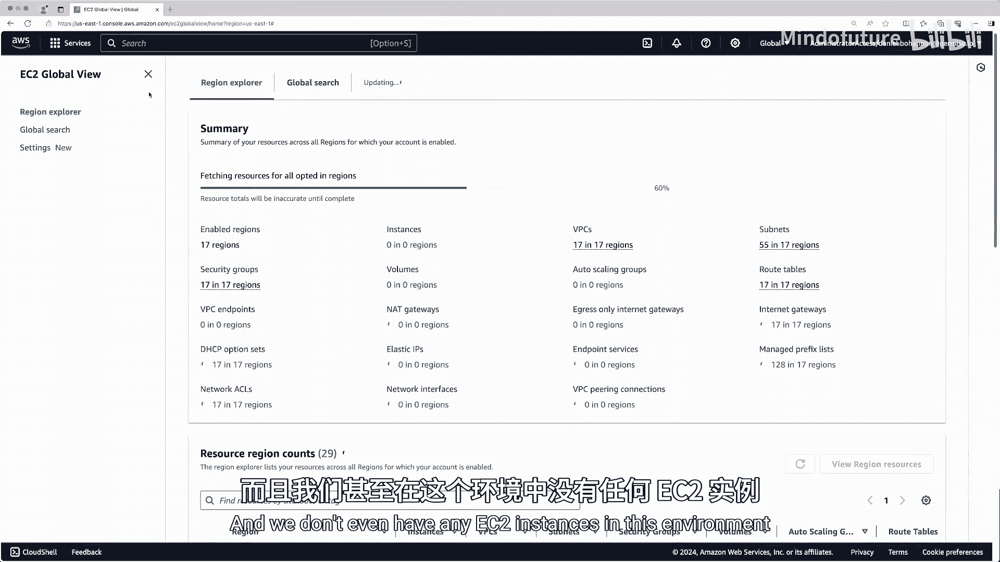
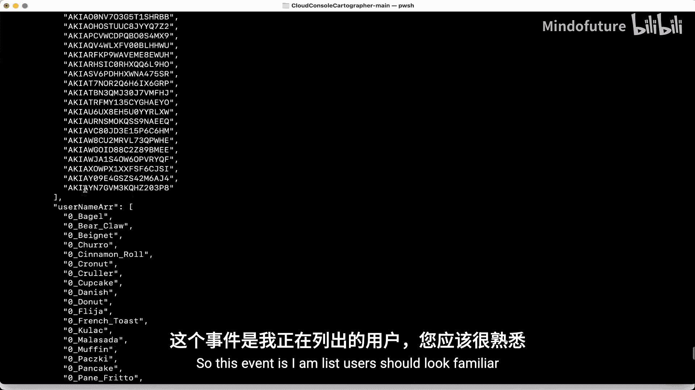
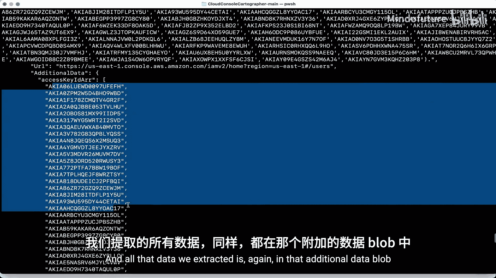
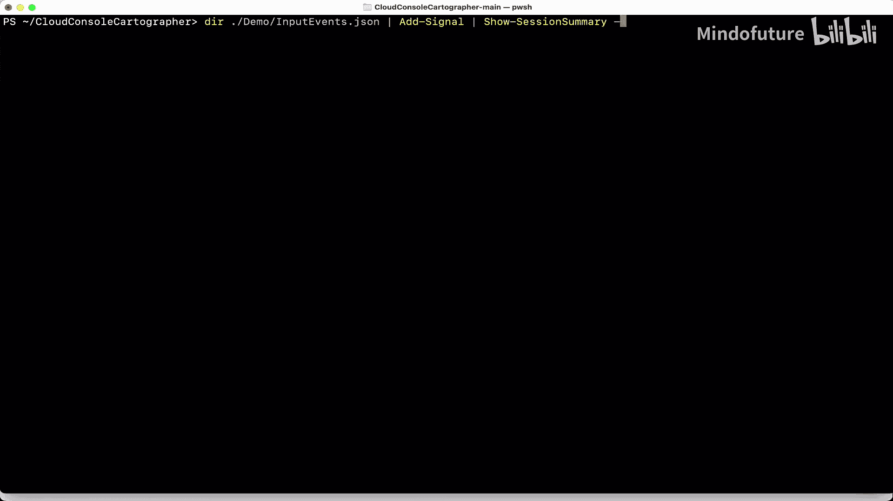
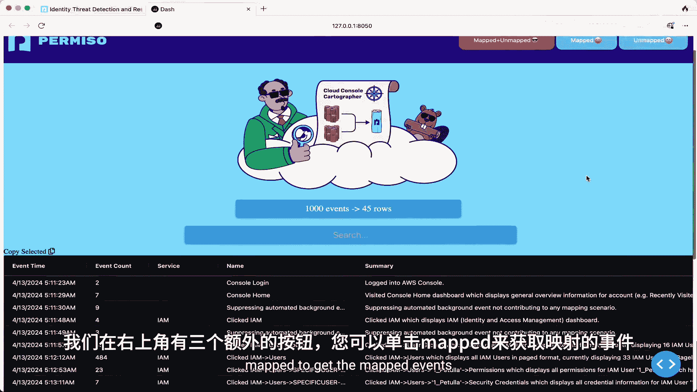
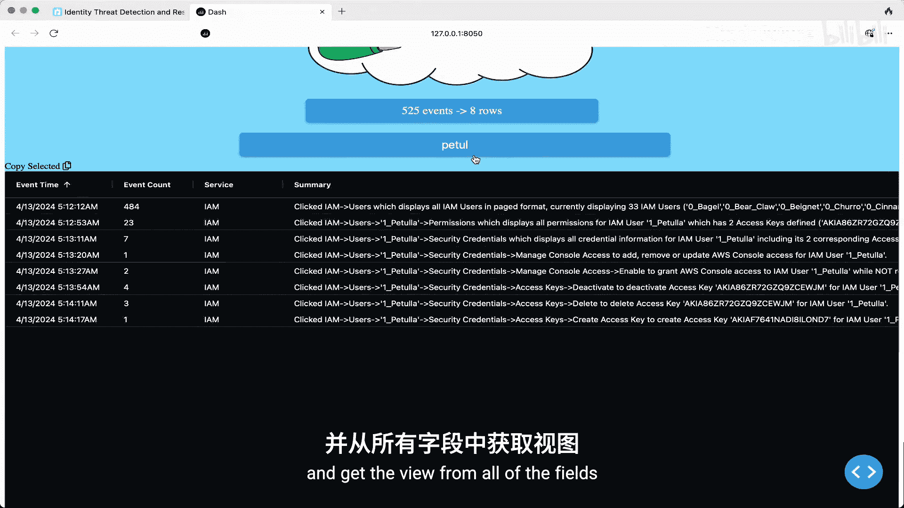
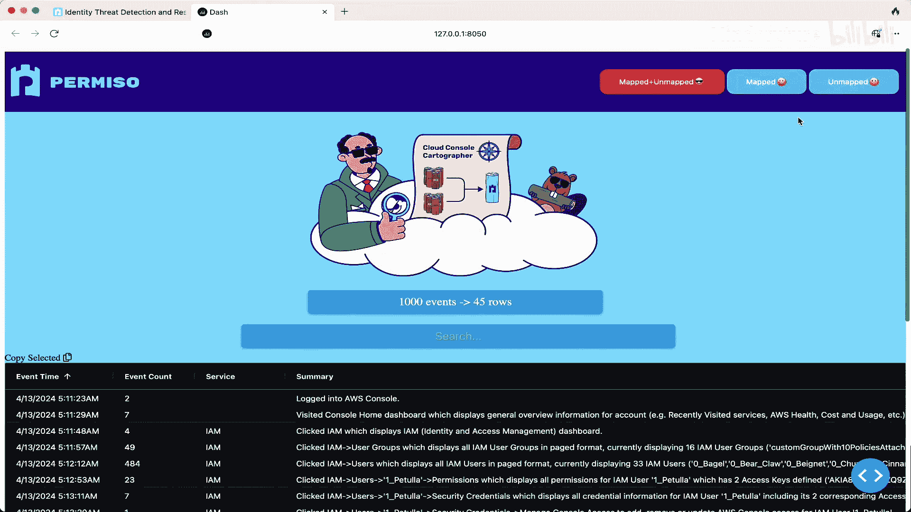

# 033：云控制台测绘师 - 从映射入手，告别日志苦海

在本节课中，我们将学习如何理解云环境中，特别是通过AWS管理控制台操作时产生的海量、复杂的日志。我们将探讨这些日志的特点、分析它们所面临的挑战，并介绍一种系统化的映射方法，以将杂乱的API调用事件转化为可理解的操作序列。

---

## 概述：日志的角色与云日志的挑战

日志对于防御者而言意味着可见性。它们记录了环境中发生的事件。通常，人们不会主动启用日志，攻击者更不会替你开启。因此，你需要了解能够记录哪些日志并启用它们。其次，应将日志转移到另一个位置，以便进行复制和备份，使攻击者更难删除它们。最后，不仅要等事件发生后才查看日志，还应主动监控，以发现可疑活动。

接下来，我们简要讨论本地日志与云日志的一些区别。这里的区别主要在于数据源，而非存储位置。从主机和网络的角度看，本地日志存在时间更长，有更多转发工具和分析选项，并且通常更加精细。例如，从Sysmon中可以获取进程信息、镜像加载、网络连接，甚至攻击者可能使用的二进制文件或脚本内容。这为攻击者留下了大量可供追踪的指纹，对于事件响应和取证来说，发现攻击者初始行动带来的这些次级效应非常有价值。

但在云环境中，情况变得模糊。你无法完全控制，基本上只能依赖云服务商提供的内容。通常，云服务商会将日志分为**控制平面**和**数据平面**日志。控制平面日志默认启用，提供环境中所有资源的管理和配置信息。数据平面日志通常默认不启用，它记录的是对资源的具体操作，例如每次向S3存储桶请求或上传文件。由于数据量和成本问题，数据平面日志通常需要手动开启。

此外，云日志的保留期限也有限制，我们将在下一节讨论。通常，云日志的粒度较低，因为它们本质上是API调用的记录，而不是端点或设备上的活动日志，这已经抽象了一层。因此，寻找攻击指纹更多地依赖于将不那么精确的信息分组到更大的聚合数据中。

---

## 云日志分析：查询与存储的权衡

让我们进一步探讨云日志对防御者的意义。以AWS和Azure为例，执行一个非常简单的操作——创建一个名为“Pre Leva”的新用户。我们可以看到这两个平台的日志中有类似命名的事件和被创建的用户名。

那么，如何查询这些日志呢？如何获取我们刚才看到的信息？你可以直接使用云服务商提供的API。这样做的一个优点是延迟最低，你不必担心次级复制的问题，可以直接从源头获取数据，有时甚至比其他位置早几分钟。但缺点是保留期限有限：AWS CloudTrail可以回溯90天，而Azure只有30天。这至少是你需要考虑并了解的局限性。

另一种方式是将日志转发到存储服务。这使你可以拥有任意大小的存储空间，可以将日志保留5年、10年，只要你愿意。通常，存储成本并不昂贵，但这完全取决于你处理的数据量。此外，这种方式没有API限制。例如，CloudTrail LookupEvents API每秒只能调用两次。虽然这看起来很多，但当多个安全工具竞争使用此API时，你可能会很快达到限制。

将日志复制到Azure存储Blob或S3存储桶后，其他工具也更容易使用这些数据。你可以控制对该存储位置的访问权限，而不是直接授予某人访问你账户中API的权限。然而，这样做的一个缺点是，有时你可能会丢失元数据。如果你从CloudTrail查询日志，你会得到一个包含资源类型和资源名称的完整资源部分。但如果你转发了这些日志，这些数据可能会完全丢失。因此，权衡这两种选项并确定哪种对你更重要是很关键的。

此外，引入额外的处理步骤时，你需要确保监控该步骤的健康状况，以保证日志正确流动。

---

## 控制台的使用：攻击者为何仍在使用？

当我们提到“控制台”时，本次演讲的标题“云控制台测绘师”可能有些令人困惑。通常，“控制台”指的是终端窗口，黑色的或蓝色的（如果你是PowerShell用户）。但在这里，控制台指的是AWS管理控制台，即你登录后用于查看配置、管理环境的实际网页浏览器。

那么，现在还有人使用控制台吗？答案是肯定的。无论是合法用户还是攻击者，今天仍然在使用。我们观察到两个不同的威胁组织大量使用控制台：Luer3和Scattered Spider（又名Octopus）。他们有时非常频繁地使用控制台，这可能是因为他们的操作手册是PDF格式，指示他们“点击这里做这个，点击那里做那个”。一些攻击者仍在学习云技术，但由于许多组织的云安全配置并不先进，攻击云环境对他们来说仍然有利可图。

有时也存在技术原因促使某人使用控制台。例如，我们曾遇到一个案例，攻击者从一个ECS容器中逃逸，并获得了联合令牌。有趣的是，如果你查看AWS文档，通过联合令牌访问时存在一些限制，例如无法通过CLI或SDK访问IAM服务。但这个限制不适用于控制台。这正是该攻击者所做的：他们一逃出ECS容器，就直接进入管理控制台，然后前往IAM服务创建用户、登录配置文件等。因此，攻击者使用控制台可能存在技术上的原因。

---

## 日志量对比：AWS与Azure的差异

Cool Depot向我们展示了AWS和Azure云日志的两个例子。但从日志量的角度来看，它们是什么样子呢？为此，我们将在AWS控制台中进行一些枚举操作：列出用户策略、角色、EC2实例。我们会惊讶地发现，这些简单的只读点击操作会产生大量事件。

另一方面，Azure的做法则不同。它只记录变更或更新事件。因此，如果我们在Azure门户中进行相同的枚举过程，比如列出用户、Blob或容器，我们将一无所获，不会产生任何日志。从安全角度来看，你总是希望知道攻击者是否在你的环境中对敏感数据进行枚举。就此而言，Azure从我们的问题中“免费通过”了，但这并不是因为他们做得更好，而是因为他们没有提供足够的日志来让我们理解环境中发生的事情。有鉴于此，我们将只关注能够获取这些信息的AWS部分。

---

## 核心问题：嘈杂的控制台日志

让我们进入演示的主要部分：嘈杂的控制台日志问题。我们都热爱日志，它们照亮了我们追寻真相的道路。但有时，光线太强也会使人目眩，让你陷入黑暗。

这里的主要问题不是缺少日志，就像我们讨论的Azure不记录许多操作一样。真正的问题是AWS控制台会话产生的**巨大日志量**。有时，这感觉就像在玩经典的打砖块游戏。

我们可能认为每一个UI点击都像球从球拍弹起击中一块砖，存在一一对应的关系。也就是说，一次请求对应一次响应，或者更准确地说，每一次UI点击只生成一个事件。但显然，情况并非总是如此。有时，球从球拍弹起，会飞到顶部，在后台触发数十次甚至数百次API调用。我们将在后面的幻灯片中看到，这实际上是我们某些控制台会话中的真实情况。

---

## 发现问题：从“无权限”用户开始

我们是如何发现这个问题的呢？我们查看了大量日志，然后意识到：“哇，这里有太多东西了。我们如何理解这包含1000个事件的控制台会话中发生了什么？”我们发现许多事件都发生在完全相同的时间戳上。

因此，我们决定创建一个名为“无权限”的身份，并赋予它零权限，只给它一个登录配置文件，然后开始在控制台中操作。我们发现出现了许多不同的错误。你可以看到控制台中的所有不同小部件都出现了这些错误。例如，点击IAM仪表板，我们看到更多错误。我们开始将这些错误信息拉到一边，试图理解每次访问这些不同页面时，这些错误是否一致。

以“列出用户”为例。如果我们只关注“列出用户”这个操作，然后只给自己那个权限会怎样？如果我们再进一步，比如给自己一个内联策略，现在我们实际上可以取得更多进展：列出用户。但你会注意到，每一列都出现了更多涉及不同API调用的错误。那么，我们如何着手理解“列出用户”呢？这些其他事件是什么？它们是如何被触发的？我们如何弄清楚？

---

## 研究方法：四条黄金法则

为了分析Debo刚才提到的数据，我们需要打开引擎盖，看看里面藏着什么宝藏。由此，我们提炼出了赖以生存的四条黄金法则：
1.  **完全权限**：我们的用户需要拥有完全权限，以免浪费时间为我们尝试的每个操作手动分配权限。
2.  **每个服务使用新环境或干净环境**。
3.  **大量Excel电子表格**：用于记录我们操作的时间。
4.  **大量咖啡或你选择的任何饮料**。

---

## 场景分析：IAM用户列表的日志生成

让我们回到IAM用户部分，这里有三种场景：
*   **场景A**：我们的用户除了呼吸和登录配置文件外，没有任何权限。
*   **场景B**：我们的用户只被允许执行一个操作：IAM ListUsers。
*   **场景C**：我们的用户在环境中拥有完全权限。

现在，让我们看看每种场景下后端会生成哪些事件。

对于场景A，只生成了一个事件，即IAM ListUser，显然由于缺乏权限而被拒绝。这里没什么特别的。

如果我们移到场景B，显然会生成更多事件。这两个场景的区别在于，在场景B中，IAM ListUser事件确实成功了。我们看到另外5组事件也出现了，但同样因缺乏权限而被拒绝。

移到场景C，事情开始变得有趣。我们看到第一个事件再次成功，那5组事件在此场景中也成功了，因为它们每个身份出现一次。我们知道这些事件在前一个场景和这个场景中都出现了，所以我们将把它们移到侧边的地图上。现在，我们将注意力转移到底部的两个额外事件上：`GetAccessKeyLastUsed`。这些事件只有在用户存在访问密钥时才会出现。一个用户可能包含0到2个访问密钥，也可能没有，所以这个事件可能永远不会出现。

---

## 事件分类：锚点事件、必需事件与可选事件

我们处理这个问题的方法是将这些事件分为三组：
*   **锚点事件**：指必须始终发生的主要事件。
*   **必需事件**：指在特定操作中必须出现的事件。
*   **可选事件**：指可能发生，但如果不发生也不会影响操作的事件。

让我们进一步谈谈可选事件。我们将其分为两个独立的类别。第一类是**后台健康事件**。只要你仍然登录，就会有一些事件出现。即使只是登录到控制台主页会话，我们实际上也可以将这些事件定义为与点击真正相关的事件，以及所有这些后台健康事件。因此，我们首先要做的是尝试找出普遍存在的噪音。正如Andy所说，在所有这些电子表格中，我们需要多次执行相同的操作，以开始理解哪些事件与输入操作一致，哪些只是“挂”在周围的事件。我们基本上喜欢将这些事件移开，以免意外地将这些后台健康事件作为必需事件纳入信号定义中。

另一种可选事件基于**上下文**。我想我们提出这个想法的那天真的很饿，基本上我们有了“全能百吉饼”和“原味百吉饼”。我的意思是，我们将创建一个拥有一切的用户——让我们给这个身份所有我们能想到的东西，然后比较点击操作。在这个例子中，这个身份有多个组成员身份、权限边界，我们可以看到该组也授予了不同的附加策略，我们给它添加了标签。从凭证角度看，它有登录配置文件（因此可以交互式登录）、激活的MFA设备、访问密钥、SSH密钥、密钥空间，甚至一些签名证书。而“原味百吉饼”什么都没有，没有权限，甚至没有登录配置文件，比我们的“无权限”用户权限还少。

如果我们比较点击这两个不同用户的操作，会看到什么差异呢？如果我们点击IAM仪表板的权限选项卡中的“原味百吉饼”，可以看到这些事件。而“全能百吉饼”则有更多一些的事件。在底部，我们也有一个类似的场景，提到了访问密钥。正如Andy在上一个例子中指出的，如果密钥存在，通常会产生额外的事件。但有趣的是，有些事件中的用户代理甚至不同，这是AWS内部用户代理的两个不同版本在讨论同一个密钥。我们看到很多有趣的——我不会称它们为差异，但可能是一些冗余。这在AWS的许多不同服务中非常不同，这是有道理的，因为有许多不同的团队负责这些服务。因此，即使出现的后台事件类型，或者前后端编程的风格，在你花大量时间浏览这些不同服务并观察它们如何映射时，也会变得更加明显。

但如果我们只是比较“全能百吉饼”和“原味百吉饼”用户的事件，会看到绿色框中的事件是无论什么情况下都存在的公共事件，而黄色和紫色框中的事件则是依赖于上下文的可选事件。

如果我们点击进入安全凭证，会看到一个非常相似的情况。同样，绿色框中的大多数事件是无论什么情况下都存在的公共事件，而紫色框中的事件则不同，在这个例子中，取决于该用户是否存在访问密钥。

---

## 操作对比：CLI、SDK与控制台

我们讨论了两个IAM用户“全能百吉饼”和“原味百吉饼”之间的差异。但如果我们试图看更大的图景，退一步看看，通过CLI与控制台执行一些先前常见的操作，实际差异是什么？为此，我们将从AWS CLI、Boto3 SDK和控制台的角度来看。

看看我们需要执行哪些步骤：创建一个名为“Cliva”的用户，创建一个访问密钥，并附加一个用户策略。在CloudTrail中会生成哪些事件？只生成了三个事件，并且彼此之间存在一些差异，主要体现在用户代理方面，因为事件源和事件名称附加在每个用户代理的后面。这就是它们不同的原因。

接下来看Boto3，我们执行完全相同的步骤：创建用户、创建访问密钥、附加用户策略。生成了哪些事件？同样的三个事件，与上一个场景只有一个区别，因为用户代理现在更简单了，并且在这些操作中保持一致。

最后看控制台场景，事情开始变得复杂。我们不仅要展示会发生多少事件，还要分解用户为了重现我们之前所做的相同操作而需要进行的每次点击。系好安全带，让我们看看发生了什么。

1.  **第一次点击**：控制台主页点击，即登录控制台后重定向到的页面。这产生了13个事件。让我们把它放在一边，并记录事件总数。
2.  **在搜索栏中输入或搜索IAM服务**：产生1个事件。
3.  **立即跳转到IAM仪表板**：总共8个事件。所以这里有9个事件。
4.  **点击IAM服务下的“用户”或用户浏览器**：产生18个事件。我们稍后会讨论点击这个浏览器的最坏情况。这是一个相当不错的场景，因为我们只有3个用户可列出。所以这里有80个事件。
5.  **现在开始创建用户**：到目前为止，我们甚至还没有开始创建过程，就已经有了30多个事件。
6.  **点击“创建用户”按钮**：产生4个事件。
7.  **立即创建或附加用户策略**：产生15个事件。
8.  **用户创建的最后一步**：产生3个事件。
9.  **立即重定向到这个新创建身份的权限选项卡**：产生13个事件。
10. **令人惊讶的是**，创建访问密钥操作只产生了1个事件。

出现的用户代理显示，只有10个事件来自我们实际的用户浏览器，其他用户代理包括健康检查、AWS内部和一些不同的AWS Java CLI用户代理。如果我们仔细观察以绿色和黄色高亮显示的部分，会看到它们版本之间的差异。因此，对于所有试图在此字段上进行某种统计数据分析或基线化的威胁猎人，请确保首先对它们进行良好的数据规范化。

作为比较，AWS CLI和Boto3都是3个输入事件对应3个输出事件，非常清晰、简单。而在控制台中，我们通过9次点击生成了73个事件。

---

## 最坏情况：列表操作的日志爆炸

我提到了最坏情况。现在我们就来看看。我们认为用数学公式来处理这个问题会很有趣。对于这个特定的点击（列出用户），我们有一个常数1，指的是锚点事件；`5 * n`，其中5是那5组事件，n是可用用户的数量（这里是15）；再加上访问密钥相关事件（一个用户可能包含0到2个访问密钥，在我们的例子中只有2个）。所以总共是18个事件。

让我们增加IAM用户的数量并开始列出它们：
*   对于20个IAM用户，总共产生141个事件。
*   尝试50个用户，我们有351个事件。
*   现在尝试一个账户中的最大IAM用户数100，我们得到了701个事件，仅仅因为那一次简单的点击。

我们也用其他服务进行了测试。这里是S3服务，如果我们有100个可用的存储桶并列出它们，将会产生421个事件。

---

## 解决方案：通过映射理清噪音

那么，我们如何理解所有这些噪音呢？我们已经经历了太多。我们有成吨的Excel电子表格，消耗了大量咖啡，对所有不同的事件做了大量笔记，并将它们分解为锚点事件、必需事件、可选事件。但实际上，我们只是试图为一个混乱的局面带来意义，并聚合这些知识，以便我们可以获取所有这些输入信息，并说“这些是当IAM用户被点击时”，或者“这是创建用户时”，或者“这是创建访问密钥时”。顺便说一下，我们也想非常具体地指出那些我们知道与输入操作无关的事件，让我们把这些健康事件移开。

那么，解决方案是什么？是**映射**。

我们处理这个问题的方法分为两步。第一步是基于为单个事件评估添加标签，然后我们返回去评估所有相邻的已标记事件，这时我们就有了创建**信号**的概念。当我们说“信号”时，你可以把它想象成一个警报，或者像一个映射：一次点击已被映射到这组事件。

首先，我们如何定义信号？我们首先关注锚点事件、可选事件和必需事件的分解，就像上一张幻灯片展示的那样。我们还有关于事件的元数据：面包屑路径是什么？如何在AWS管理控制台中到达这个点击？URL是什么？摘要是什么？是否有字段应该根据锚点事件或该点击中存在的任何可选事件动态更新？然后，在底部我们有额外的选项，用于在评估所有相邻标记事件的信号时增加或减少向前看和向后看的范围。

**第一步是添加标签**。每一个事件都被单独评估，然后基于非常具体的标准（如用户代理、请求参数、哪些为空、哪些不为空）来决定是否添加这个标签。正如我们在这里看到的，这些标签都以特定的顺序添加到一个事件上。这些标签将在第二步中发挥作用，然后我们会说：“现在让我们重新遍历所有事件。”

**第二步是信号生成**。我们在每个锚点事件处停止。将锚点事件视为必需事件之一。对于每个事件，我们评估所有标签。如果任何标签表明“我的定义说这是我所处场景的锚点事件”，那么该事件就会收到 `anchor_event = true` 的标志。然后我们进行第二步：遍历每个事件，在每个锚点事件处停止。接着，我们获取该锚点事件的标签，逐个标签地进行评估。每个标签的逻辑会说：“向后看3秒，向前看10秒，查看所有包含相同标签的事件。”将所有这些东西放在一起，然后根据信号定义进行评估。如果所有条件都满足，就为此创建一个信号，并将所有这些事件标记为已处理。它们已经贡献给了一个信号，不能贡献给另一个信号。这就是我们将它们分组的方式。

我们还想到了很多其他很酷的事情要做，其中大多数是我们必须做的。有很多奇怪的情况我们必须考虑。正如你在信号定义中看到的，我们可以动态修改URL和摘要。我们基本上希望为用户提供尽可能多的易于消费的信息。因此，你可以确切地看到他们是否点击了“全能百吉饼”用户，这里是包含信息的精确URL；如果他们点击了IAM用户并且有100个用户，那么我们想列出那100个用户或列出与他们相关的访问密钥。所有这些提取的信息我们都用来更新摘要或URL。我们还有一个名为 `additional_data` 的JSON对象，因此你始终可以编程方式访问我们为这些信号收集的所有信息。实际上我们也这样做，因为在最后一个要点中，我们能够进行回看。

有时，我们到达某个信号时，可能会回看并说：“实际上，我们需要根据当前信号修改上一个信号。”其他时候，当前信号可能发生在管理控制台中的四五个地方。因此，我们需要知道在过去10秒内刚刚发生的最后一个信号是什么。如果那是“IAM用户 -> 创建用户”，那么我需要从该信号中提取信息，比如用户名是什么，或者我们正在添加密钥的用户名是什么。我们还有合并现有信号的能力。这对于非常长的运行信号很重要，我们不想定义一个超长的向前看范围，但我们可以合并相邻的、具有匹配提取数据的相同信号。是的，我们不得不做了很多奇怪的技巧，直到今天还让我们有些头疼。但解决这个问题真的很有趣。

---

## 工具演示：Cloud Console Cartographer

说了这么多，看了这么多幻灯片，实际看起来怎么样呢？让我们看演示。我们有两个简短的演示视频。

在第一个视频中，我们将快速浏览这一切是如何开始的。用户登录管理控制台并开始点击一些东西。我们会非常快地覆盖几个不同的例子。用户登录后，点击IAM服务，列出一些用户组，点击用户列出他们，选择用户“zeropeula”，点击权限选项卡、安全凭证。在这个例子中，让我们启用一个登录配置文件（攻击者喜欢这样做），现在这个身份可以进入控制台。也许我们想为自己创建一个访问密钥。已经有两个了？停用一个，删除它，然后为自己创建一个新的访问密钥。这些正是攻击者登录控制台会话后采取的一些步骤。现在，我们给了自己登录配置文件，创建了访问密钥。接下来，去Secrets Manager，开始枚举一些秘密，看看有什么可用的，我能从这个环境中提取什么值。在这个例子中只有五个秘密。我们在这个上点击“打开”，查看概览页面，然后点击“检索”秘密值，以便查看那个秘密。但这有点无聊。让我们实际打开Cloud Shell，就像真正的攻击者那样，然后以编程方式将所有值提取到一个名为 `secrets.json` 的文件中。然后，我们可以方便地点击并从控制台下载该文件。所有这些操作都以非常不同的方式记录，将它们整合在一起是另一个令人头疼的问题，但正如你将在下一个视频中看到的，看到所有这些如何以一种可读的方式整合在一起是非常整洁的。文件下载完成后，接下来去S3服务，谁不喜欢看一些存储桶呢？基本上，列出一些存储桶，然后选择一个特定的点击进入。请记住我们点击的这些不同名称：“zero F bucket”，点击对象选项卡、权限、管理、访问点。最后，去EC2，这是我最喜欢的服务之一。EC2仪表板从日志量角度看并不超级有趣，但第二个“EC2全局视图”非常耗时，甚至有一个状态条。你真的会对这一次点击背后实际产生了多少事件感兴趣。答案是超过300个，即使在这个环境中我们没有任何EC2实例。所以观看这个过程很有趣。

在下一个视频中，我们将看到如何实际处理这些事件日志。你可以直接从API查询事件日志，并通过管道传输到我们的工具中。或者，在这个例子中，我们已经下载了这个会话并将其放在项目的演示文件夹中。因此，我们只需将其通过管道传输到 `add-signal` 命令中，该命令会为单个事件添加标签，进行第二步处理，并基于数据的聚合生成信号。让我们快速查看其中几个并将其转换为JSON。你可以看到我们包含了原始事件。

我们还在其之上包含了富集对象。在这个例子中，这个事件不是信号的一部分。因此，让我们更新查询，查找一些生成了信号的例子。我们称之为“承载信号的事件”。这个事件是“IAM ListUsers”，应该很熟悉。然后我们的信号在这里非常大。它显示“IAM Users被点击了”。顺便说一下，显示了33个用户，这是当时存在的用户。此时，这些身份有62个访问密钥。这是URL。所有我们提取的数据再次出现在那个 `additional_data` 字段中，因此你可以按需以编程方式访问它。我们获得了关于这个环境的一些有趣上下文，而无需任何额外的API调用，仅通过这种离线日志分析。

接下来，我们将执行 `show-event-summary`。这将显示所有这些事件，并按颜色编码显示哪些实际上是信号的一部分。然后我们可以看到每个事件顶部的信号指向下方。这让我们能稍微更好地了解信号是什么，任何提取的值也以绿色高亮显示。但让我们看看这个。这是我们在Secrets Manager中点击“opener”用户的地方。在这里，我们可以看到这四个事件。让我们实际添加更多细节，查看每个事件的详细信息。现在，所有四个事件下面都有一个详细的块。第一个事件是被首先评估的锚点事件，我们可以看到它有四个标签。前两个标签的向前看/向后看逻辑失败了。第三个成功了。我们将看到所有其他事件对该标签也是成功的，这就是它们被分组到这个映射中的原因。

任何紫色的内容，这些对于创建标签、请求参数等都非常有帮助。因此，我们希望在调试或添加新数据时，能轻松查看如果需要这些事件成为新信号或现有信号的一部分，需要定义哪些精确的请求参数和用户代理。

最后是会话摘要。它只给你一行信息：有多少事件贡献给了这一行，以及哪些事件没有贡献给任何信号。我们可以在高层次上再次看到，提取的信息以不同的颜色高亮显示，底部有一些统计数据，包括标记事件的数量、已映射事件的数量，以及映射涉及的服务。对于所有未映射的事件，列出了涉及的服务。6分钟，这就是我们的会话。

我们非常有动力做一些前端工作，以便为您提供更友好的体验。这是我们的UI可视化工具。右上角有三个额外的按钮，您可以点击“已映射”来获取已映射的事件、“未映射”的事件等。表格视图由AG-Grid支持，因此您拥有AG-Grid的所有酷炫功能，例如基于不同条件的过滤、重新排列列，甚至对不同列进行排序。我们还提供了搜索过滤器，您可以边输入边搜索，并从所有字段中即时获取视图，同时在上方的占位符中获取信息，从事件和总行数两个不同的角度展示。

---

## 总结与要点

这就是我们花了近一年时间，投入数百个小时开发的工具。再次强调，我想我的眼睛因为看了那么多Excel电子表格还是红的。我们非常兴奋地宣布，这个工具现已正式上线。链接在下一张幻灯片上。

让我们总结一下。这里有三个要点：
1.  **控制台会话仍然重要**。攻击者仍在使用它们，而对大多数组织来说，更重要的是普通用户也在使用。你仍然需要查看这些活动，并且要问：这个普通用户的活动真的正常吗？是否是我们应该关注的事情？我们试图通过这个工具为这些情况带来清晰度。
2.  **了解你的云日志选项**。有哪些限制？保留期限有什么问题？从策略角度看，是否需要更多关注？你有什么工具可以用来查看这些日志？你正在用它们做什么吗？你是否有人员或能力来理解日志中的内容？
3.  **我们已经发布了这个工具**，以便社区可以使用它并从中受益，甚至可以添加你自己的信号映射，以帮助它成为社区更强大的能力。

最后，我们想对你们的时间表示感谢，感谢你们对之前延迟的耐心。这对我们来说非常有趣。这是工具的URL，以及我们的社交媒体信息。在请大家提问之前，我们想说，随时欢迎联系我们，无论是在这个房间里，还是看到我们在周围走动时（我们有一些有趣的贴纸可以赠送）。我们非常喜欢与社区交流，期待与大家打招呼。再次感谢你们的时间。

---

## 问答环节

**问：** 我是一名威胁检测与响应网络安全分析师，是你们这类工作的受益者。我有个问题：我们经常不得不根据误报警报的数量来禁用某些警报/信号。根据你们的工作，你们发现了什么可以在不增加漏报风险的情况下减少误报数量？

**答：** 这是一个很好的问题。很高兴认识一位同行防御者。问题是我们的工具如何帮助减少误报。我想说的是，我们的工具旨在为大量事件带来清晰度，并为你提供关于该事件是什么的信息。我不想抨击任何厂商，但以AWS GuardDuty警报为例，这正是我们在控制台会话发生时看到大量误报的场景，因为出现了许多以前从未发生过的奇怪事件，其中很多与IAM相关，许多GuardDuty警报会说“异常的IAM权限提升”。而实际上，你只是点击查看了一些用户。因此，我们的工具并不直接更改任何警报。事实上，所有映射我们都不视为警报，我们将其视为一种简化的方式，用来表示：不是有700个事件，而是有45个事件（即45次点击）。现在你可以决定这正常与否。在某些方面，GuardDuty（我假设）通过对活动进行基线分析来工作。在我们的团队中，我们认为如何对这些点击进行基线分析，而不是对数百个单独的事件进行基线分析？例如，IAM用户被点击的频率如何？S3存储桶、权限、对象或管理被点击的频率如何？这不会改变其他工具产生的嘈杂警报，但希望即使面对这些嘈杂警报，你也有一种更好的可读方式来查看信息，以判断会话中是否真的发生了有趣的事情，或者他们只是点击查看了一些用户和存储桶等。我希望这至少部分回答了你的问题。

**问：** 很棒的工作。我想问一下，显然云服务商会更新，数据会变化，他们会来说：“好吧，我们更改了日志记录方式，更新你的检测。” 我没有完全抓住你们是如何……目前信号创建过程是手动的吗？你们考虑过自动化吗？如果考虑过，遇到的主要挑战是什么？你会说它现在很手动吗？

**答：** 是的，问题是我们能否自动化其中一些过程，因为你是对的，目前这是一个非常手动的过程。我想说，这种手动过程的部分原因可能是我个人的OCD水平，想要真正理解所有差异。因为我们不只是想分组日志，我们还想说从这些日志中可以提取哪些独特的值，并说这些是重要的上下文。但即使是一年前我们做的一些映射，现在重新测试时，其中一些也有细微差别，比如EC2服务中，过去某些点击使用特定的AWS内部用户代理记录事件，现在则记录你的网页浏览器用户代理。因此，我认为总会有这类需要手动跟进的情况。Andy，我知道你最初的做法之一是想通过浏览器插件之类的东西来查看请求，但我认为面临的挑战是，在浏览器端你能看到的东西有限，很多在云工程中跳转的日志是那个视图所没有的。因此，我们当然对建议持开放态度，如果有更自动化的方法，我们很乐意让其他人免受那些令人眼花缭乱的Excel电子表格的追踪之苦。是的，如果你有这方面的想法，我们很乐意听取，这是个很好的问题。

---

本节课中，我们一起学习了云控制台操作产生的复杂日志的挑战，探讨了如何通过系统化的映射方法（锚点事件、必需事件、可选事件）来理解和简化这些日志。我们介绍了Cloud Console Cartographer工具的设计思路和功能，它能够将杂乱的API调用序列转化为可读的操作步骤，帮助安全人员更高效地分析控制台活动，识别潜在威胁。记住，控制台活动依然关键，了解你的日志选项，并利用社区工具提升能见度。