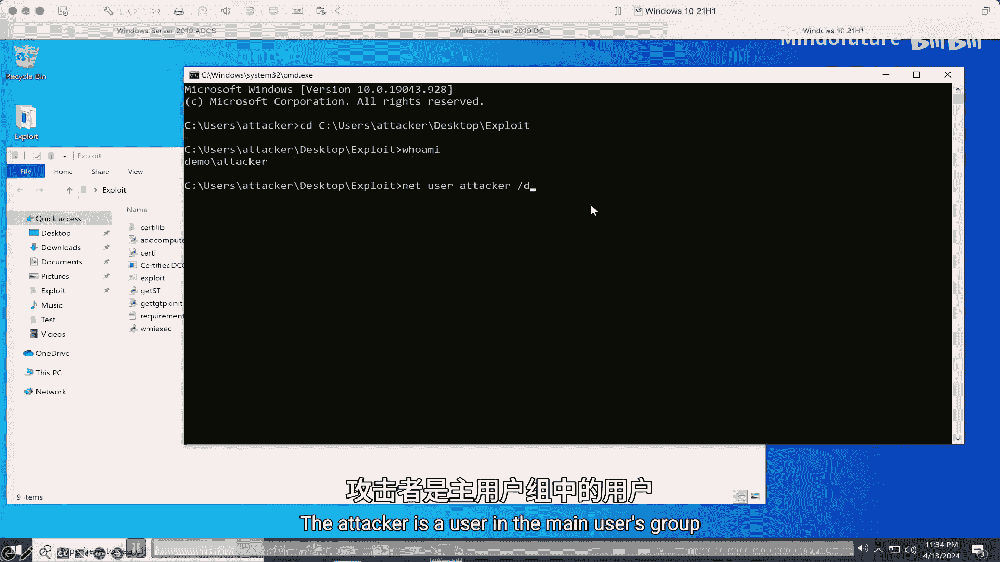
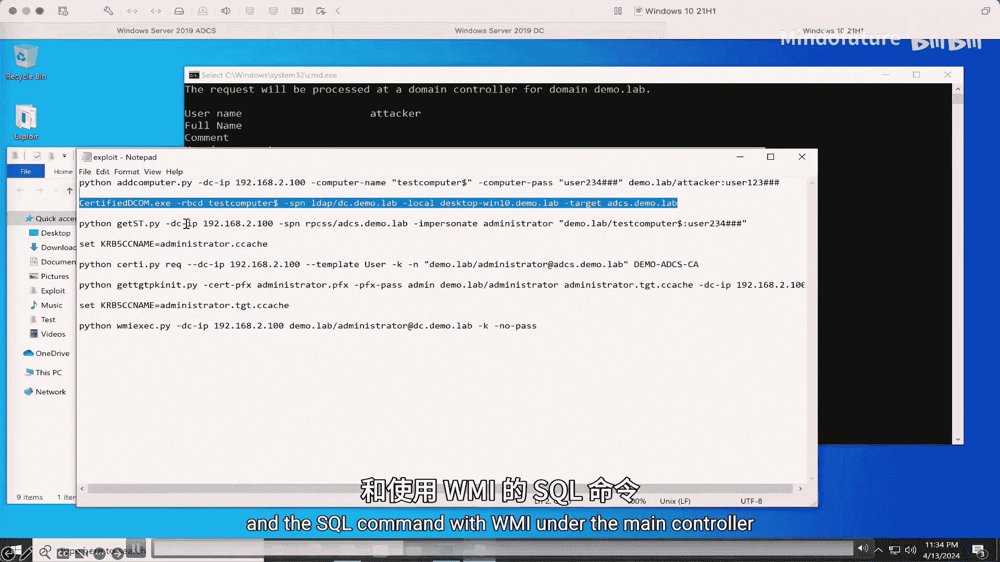
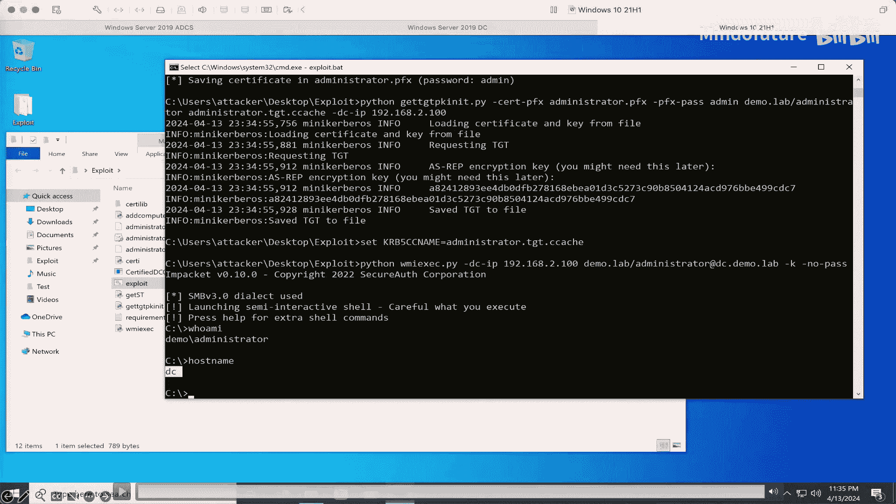

# 034：从域用户到域管理员的权限提升之旅 🚀

在本教程中，我们将学习如何利用分布式组件对象模型（DCOM）和活动目录证书服务（ADCS）中的一个远程攻击面，实现从普通域用户权限到域管理员权限的完整提升。我们将从基础概念开始，逐步深入到攻击原理、利用方法以及最终的防御措施。

## 概述

DCOM是微软的一项技术，允许客户端应用程序在不同的计算机上创建和使用COM对象。ADCS是Windows Server的一个角色，用于颁发和管理数字证书。本教程将揭示如何结合这两者，在默认配置的活动目录环境中，实现远程权限提升。

---

## 1.1：DCOM基础知识 🧱

上一节我们介绍了本课程的目标，本节中我们来看看DCOM的基础知识。

COM（组件对象模型）类似于一个二进制库。它提供可以被客户端调用的方法。一个COM服务器可以是一个DLL或EXE文件，其中包含COM类。COM对象是COM类的一个实例，它拥有一个或多个接口。接口包含可以被客户端调用的方法。

COM服务器可以分为进程内、进程外，甚至是运行在不同机器上的远程进程。
*   **进程内服务器**：COM对象与客户端运行在同一个进程中。
*   **进程外服务器**：COM对象运行在与客户端不同的进程中。
*   **远程服务器**：COM对象运行在远程机器上，这被称为DCOM。

调用进程内COM对象的接口方法被视为普通的函数调用。跨进程的COM调用由LPC（本地过程调用）处理。不同机器间的COM通信则通过基于TCP/IP的RPC（远程过程调用）实现。

在进程外COM中，当客户端请求一个COM对象时，它会首先与RPCSS服务通信。RPCSS会检查COM服务器是否正在运行。如果没有，它将启动COM服务器并在其中创建一个新的COM对象。这个过程被称为启动和激活。COM对象被激活后，客户端可以通过LPC与之交互。

DCOM的工作流程与进程外COM类似，区别在于客户端和服务器位于不同的机器上。客户端需要先与本地RPC通信，本地RPC再将COM请求处理并转发给远程机器上的RPC。两台机器之间的通信协议是基于TCP/IP的RPC。

---

## 1.2：历史研究与攻击面转移 🔍

上一节我们了解了DCOM的基本工作原理，本节中我们来看看相关历史研究，并引出我们关注的远程攻击面。

近年来，Potato系列攻击和Coerce/Relay是Windows COM上众所周知的研究。这些攻击的历史可以追溯到James Forshaw在MS15-078中披露的漏洞，大约在7-8年前。这是第一个滥用`CoGetInstanceFromIStorage` API进行DCOM激活的漏洞。

所有这些Potato攻击和Coerce/Relay都滥用了同一个API，这确实是一个非常强大的攻击向量。

但是，所有这些研究都集中在**本地攻击面**上，没有讨论DCOM的**远程攻击面**。

虽然本地权限提升至关重要，但攻击者通常更偏爱远程攻击。那么，被遗忘的远程攻击面在哪里？

---

## 1.3：核心API与攻击原理 ⚙️

上一节我们指出了远程攻击面的缺失，本节中我们来深入理解攻击所依赖的核心API。

首先，让我们看看`CoGetInstanceFromIStorage`是如何工作的。`CoGetInstanceFromIStorage`是一个用于创建COM对象的API。这个API与其他COM创建API的不同之处在于，它接收一个`IStorage`接口指针参数，并从存储对象初始化COM对象。

一个接口指针实际上是一个内存地址。在跨进程通信中，接口指针不能直接在客户端和服务器之间传递，因为客户端进程和服务器进程的内存不共享。作为解决方案，接口指针会被封送（marshal）到一个名为`OBJREF_Custom`的数据结构中。

客户端可以通过`GetClass`方法和接口方法来定制`OBJREF_Custom`中的类ID和数据。在COM服务器端，它将解封送（unmarshal）客户端发送的`OBJREF_Custom`，以获取COM对象或接口指针。

一个COM客户端可以将`OBJREF_Custom`中的类ID设置为`CLSID_StdObjref`，并将数据设置为一个`OBJREF_STANDARD`。当服务器解封送客户端发送的`OBJREF_Custom`时，它将创建一个`StdObjref`对象并调用其接口方法。

`OBJREF_STANDARD`中有两个重要字段，分别是`std`（流绑定）和`saResAddr`（安全绑定）。流绑定包含一个网络地址，指示在哪里可以找到对象。当服务器解封送`OBJREF_STANDARD`时，它将调用`ResolveOxid2`来解析对象导出ID（OXID），RPCSS将发起一个RPC连接到流绑定中指定的地址。

`ResolveOxid2`可以连接到本地或远程服务器，这取决于流绑定。`ResolveOxid2`的返回值是`DUALSTRINGARRAY`，它也由流绑定和安全绑定组成。然后，COM服务器将根据`DUALSTRINGARRAY`中指定的流绑定和安全绑定发起一个DCOM连接。

在之前的研究中，攻击者的客户端和受害者的服务器都在本地。服务器使用`CoGetInstanceFromIStorage`来触发高权限服务器向攻击者的本地服务器进行身份验证。然后，攻击者可以模拟或中继凭据以实现本地权限提升。

我们知道DCOM允许我们远程激活COM对象。那么，是否可以通过DCOM远程激活来调用`CoGetInstanceFromIStorage`呢？

当我们查看`CoGetInstanceFromIStorage` API的定义时，可以看到它允许用户将类上下文设置为`CLSCTX_REMOTE_SERVER`，以在远程机器上激活COM对象，并且COM服务器基础结构允许用户设置远程计算机名，即用于DCOM通信的信息。这表明此API也支持远程COM激活。

那么，我们能否调用它让远程计算机连接到我们，然后执行NTLM或Kerberos中继攻击呢？

假设我们已经入侵了一个普通的域账户。我们可以向任何域计算机进行身份验证。但是，当我们尝试使用`CoGetInstanceFromIStorage`在远程域计算机上激活一个COM对象时，我们得到了“访问被拒绝”的错误。这是因为Windows中默认的COM安全限制。

这里有两部分ACL（访问控制列表）：系统范围的ACL和进程范围的ACL。这些ACL定义了在启动、激活或访问COM对象时的限制。当客户端启动、激活或访问COM对象时，它需要首先通过系统范围的ACL检查，然后通过进程范围的ACL检查。

在默认的系统范围ACL设置中，只有特定高权限本地组（如本地管理员组、分布式COM用户组）中的用户才被允许执行远程启动和远程激活。因此，默认情况下，普通域账户无法在远程机器上启动和激活任何COM对象。

我相信这就是为什么很少有研究关注DCOM远程攻击面的原因。

---

## 1.4：突破限制：寻找特殊服务 🗝️

上一节我们遇到了默认安全限制的阻碍，本节中我们来看看如何突破这些限制，寻找可利用的特殊服务。

为了执行远程攻击，我们首先需要打破默认的COM系统范围限制。让我们跳出思维定式。虽然Windows默认有严格的COM限制，但活动目录中有许多服务也提供COM访问。这些服务同样是攻击面。

接下来，我们将攻击面扩展到活动目录，并尝试找到那些具有自定义安全配置（而非Windows默认配置）的服务。

*   **远程桌面服务**：修改了Windows默认安全配置，允许某些RDS组执行远程启动和远程激活。但在RDS默认配置中，这些组中没有低权限域账户。
*   **SCCM**：为了向SMS Admins提供远程WMI访问，也修改了Windows默认COM安全配置。但默认情况下，SMS Admins组中也没有低权限域账户。
*   **ADCS**：最终，ADCS提供了突破口。如果一台机器上安装了ADCS，本地“证书服务DCOM访问”组的成员将被授予远程激活权限。默认情况下，“经过身份验证的用户”就在“证书服务DCOM访问”组中。这意味着任何低权限域账户在ADCS上都具有远程激活权限。

为什么ADCS上有如此特殊的配置？这是因为ADCS需要处理客户端发送的证书签名请求。在活动目录中，所有域用户和域计算机都被允许发送证书签名请求以生成有效证书。ADCS实现了MS-WCCE，这是一个DCOM协议，用于支持证书签名。它授予所有经过身份验证的用户激活由MS-WCCE引入的COM对象的权限。

现在，我们可以通过ADCS系统范围的ACL检查了。接下来，我们需要找出哪些COM类可以被利用以进行进一步的攻击。

---

## 1.5：定位可利用的COM类 🎯

上一节我们找到了ADCS这个突破口，本节中我们来看看在ADCS上具体哪些COM类可以被利用。

如前所述，除了系统范围的ACL，我们还需要考虑一些进程范围的配置。这些配置包含进程范围的ACL、身份（Identity）、身份验证级别（Authentication Level）、模拟级别（Impersonation Level）等。这些设置在注册表中默认定义，也可以被`CoInitializeSecurity` API覆盖。

进程范围的ACL定义了谁可以远程启动、激活和访问COM对象。作为一个可利用的COM类，其进程范围的ACL需要允许低权限域账户进行远程激活。并且，COM服务器必须在ADCS上已经启动，因为“证书服务DCOM访问”组在ADCS上没有远程启动权限。

身份定义了COM服务器运行时所使用的用户身份。它可以是交互式用户、系统账户或其他指定用户。COM服务器将使用此身份进行网络身份验证。对于一个可利用的COM服务器，其身份可以设置为除本地服务（Local Service）之外的任何用户，因为本地服务使用匿名用户进行网络身份验证，没有可利用的价值。

身份验证级别的默认值是`RPC_C_AUTHN_LEVEL_CONNECT`，这意味着在连接中不需要签名和加密，这对中继攻击非常有帮助。模拟级别决定了服务器是否可以模拟客户端的身份。一些服务（如IIS和SQL Server）需要模拟客户端。这些服务要求客户端模拟级别设置为`RPC_C_IMP_LEVEL_IMPERSONATE`。

在审查了ADCS上的所有COM类后，我们发现了这些可利用的类：
*   **CertSrv Request** 和 **CertSrv Main**：这是MS-WCCE使用的COM类，默认安装在ADCS中。
*   **OCSP Request** 和 **OCSP Main**：这些是由ADCS在线响应者角色引入的类，这不是ADCS的默认规则，需要手动安装。

所有这些可利用的COM类都将身份设置为“系统”，这意味着COM服务器将使用ADCS机器账户进行网络通信。身份验证级别和模拟级别的设置表明，我们可以将ADCS的身份验证中继到LDAP服务。

---

## 1.6：攻击链构建与演示 🛠️

上一节我们定位了具体的COM类，本节中我们来构建完整的攻击链并观看演示。

因此，如果攻击者入侵了一个域账户，他可以使用`CoGetInstanceFromIStorage`远程激活ADCS上的一个可利用COM对象。当ADCS连接回攻击者时，攻击者向ADCS返回一个伪造的`DUALSTRINGARRAY`，并将流绑定设置为需要NTLM或Kerberos。ADCS将使用指定的身份验证方法和ADCS机器账户向攻击者进行身份验证。

在这个DCOM连接中，将遵循可利用COM的进程范围安全配置。身份验证级别将是`CONNECT`，模拟级别将是`IDENTITY`。因此，攻击者可以将NTLM或Kerberos身份验证中继到域控制器，并利用ADCS机器账户执行基于资源的约束委派攻击或影子凭证攻击。

以下是此攻击的完整概览图。

获得域管理员权限的最后一步是在基于资源的约束委派攻击或影子凭证攻击之后。这里提供了两种攻击路径：
1.  您可以攻击AS（身份验证服务）并通过黄金证书攻击升级到域管理员。
2.  您可以首先请求一个域管理员证书，然后使用该证书通过PKINIT请求一个域管理员服务票据（TGS）或票据授予票据（TGT）。

最终，您获得了域管理员权限，可以接管整个活动目录并在任何域计算机上执行命令。

让我们看一下第二种攻击路径的演示。
1.  攻击者是域用户组中的一个用户。
2.  接下来，运行证书DCOM漏洞利用程序，并通过WMI在域控制器上执行命令。
3.  运行漏洞利用程序。现在，您可以看到我们可以以域管理员身份在域控制器上执行命令。

---

## 1.7：补丁、缓解措施与扩展攻击 🛡️

上一节我们完成了攻击演示，本节中我们来看看官方的修复方案、其他可能的攻击向量以及如何防御。

此漏洞的补丁于2022年10月发布。该补丁修复了与ADCS的DCOM到LDAP中继攻击。它将证书服务中的身份验证级别提升到了数据包隐私（Packet Privacy）。一个月后，DCOM身份验证强化功能发布，它自动将所有非匿名激活请求的身份验证级别提升到了数据包完整性（Packet Integrity）。这种强化也消除了此漏洞，并可以防御大多数DCOM攻击。启用LDAP签名和通道绑定也可以保护您免受此攻击。

我们刚刚讨论了中继到LDAP。其他服务呢？我们没有找到支持将模拟级别设置为`IMPERSONATE`的COM类，因此我们无法真正将DCOM中继到其他服务。但是，`ResolveOxid2` RPC连接呢？在这个RPC连接中也有身份验证消息。`ResolveOxid2` RPC连接的模拟级别是`RPC_C_IMP_LEVEL_IMPERSONATE`，因此我们可以执行NTLM中继到AS HTTP或MS-SQL。但这需要域中有两台ADCS服务器，因为我们无法将NTLM中继回同一台机器。

Kerberos中继呢？我们能否在安全绑定中设置任意SPN，使`ResolveOxid2` RPC使用任何服务主体名称进行身份验证？实际上，我们不能，因为`ResolveOxid2` RPC身份验证中SPN的机器名被强制设置为流绑定中的机器名，因此我们无法通过安全绑定触发Kerberos中继。

其他RPC协议序列呢？我们也可以控制流绑定中的`TowerId`。`TowerId`决定了RPC传输。RPC支持许多具有不同高层协议（如TCP、UDP、SMB、HTTP等）的传输类型。我们能否滥用这些协议进行NTLM中继？在检查了所有这些RPC协议序列后，我发现`ResolveOxid2` RPC支持`ncacn_ip_tcp`和`ncacn_http`。DCOM连接还支持另一种类型：`ncacn_np`。

`ncacn_ip_tcp`是我们之前讨论过的。其他的呢？`ncacn_http`也称为HTTP上的RPC。RPC客户端将首先使用HTTP版本2，如果版本2失败，客户端将回退到版本1。当使用HTTP版本1时，客户端将与RPC服务器建立HTTP连接，并使用`RPC_CONNECT`作为HTTP请求方法发送HTTP请求。这是一个持久的HTTP连接。随后的RPC数据包将在同一连接中发送。需要注意的一点是，HTTP层没有身份验证，身份验证仅在RPC数据包中。HTTP版本2的RPC比版本1更复杂，但与版本1相同，HTTP层没有身份验证，身份验证仅在RPC数据包中。

因此，对于HTTP上的RPC，我们可以在HTTP连接内的RPC数据包中中继NTLM或执行Kerberos中继到LDAP，这与TCP上的RPC数据包相同。与`ncacn_ip_tcp`相比，HTTP上的RPC有潜力在某些情况下绕过一些网络限制或NDR设备。

DCOM连接还支持命名管道上的RPC。命名管道上的RPC使用SMB协议作为传输协议，并在SMB层使用机器账户进行身份验证。身份验证的模拟级别是安全模拟（Security Impersonation），这意味着服务器可以模拟客户端，因此我们可以在另一台ADCS服务器上对HTTP端点或MS-SQL执行NTLM中继，但仍然需要两台ADCS服务器，并且Kerberos中继在命名管道上仍然不起作用。

当我仔细研究之前讨论的漏洞补丁时，发现了一些有趣的事情。该补丁在证书服务中引入了一个名为`InitializeCom`的新函数。这个新函数调用`CoInitializeSecurity`来配置进程范围的COM安全性。它将证书服务（CertSrv）的身份验证级别更改为数据包隐私以修补漏洞，并且模拟级别也更改为`RPC_C_IMP_LEVEL_IMPERSONATE`。这个模拟级别正是我们想要的。

因此，现在有了这个补丁，我们可以将DCOM身份验证中继到ADCS HTTP或运行在不同机器上的MS-SQL。对于Kerberos中继，没有限制中继到同一台机器，因此我们可以执行Kerberos反射中继，将Kerberos身份验证中继回同一台ADCS服务器。以下是攻击的工作原理。我们可以同时使用`ncacn_ip_tcp`和`ncacn_http`作为这里的RPC序列，并且我们可以将身份验证从ADCS中继回自身。Kerberos反射中继不是一个新漏洞，而是一种新的利用技术。

为了缓解这种攻击，只需在您的AS HTTP端点上启用EPA（扩展保护身份验证）。EPA可以保护您免受NTLM中继和Kerberos中继攻击。对于MS-SQL，只需保持默认设置即可防御此攻击。

---

## 总结

在本节课中，我们一起学习了DCOM和ADCS的一个新的远程攻击面，以及几种可以导致从域用户到域管理员权限提升的攻击。我们还将Coerce/Relay提升到了一个新的水平，使其成为一个真正的远程攻击向量。

需要注意的是，这项研究基于活动目录的默认配置。如果您有一些自定义的DCOM错误配置（例如允许任何域用户激活您的COM对象），这种攻击也可能奏效。

以下是一些缓解措施供您参考：
*   更新您的ADCS以安装补丁。
*   更新所有机器以启用DCOM身份验证强化。
*   为中继攻击启用保护，例如LDAP签名和通道绑定，以及ADCS HTTP端点的EPA。
*   最后，检查您自定义的系统范围和进程范围COM ACL配置。

本教程基于这些杰出研究人员的卓越工作，我只是站在他们的肩膀上。感谢他们的工作。希望您喜欢本教程。