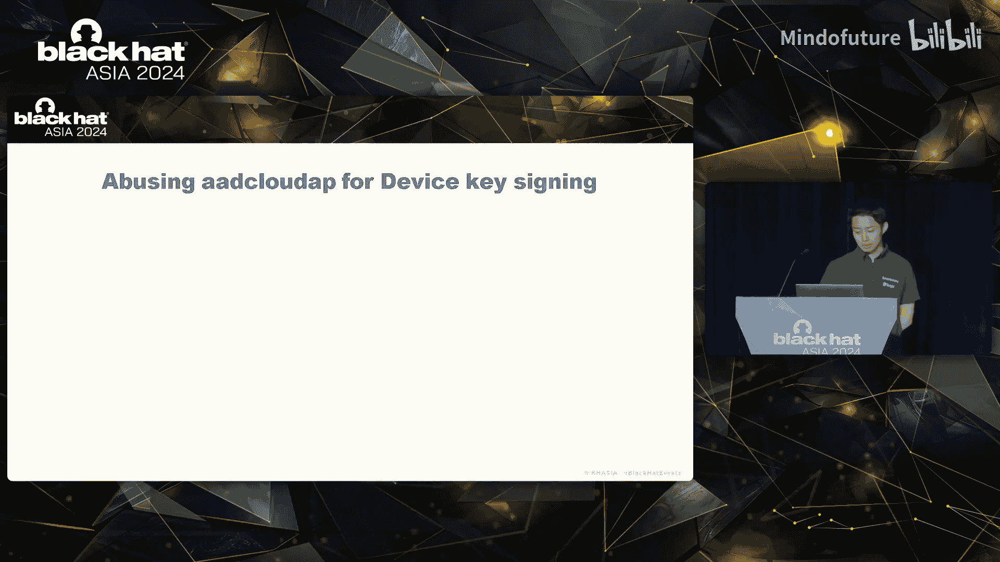
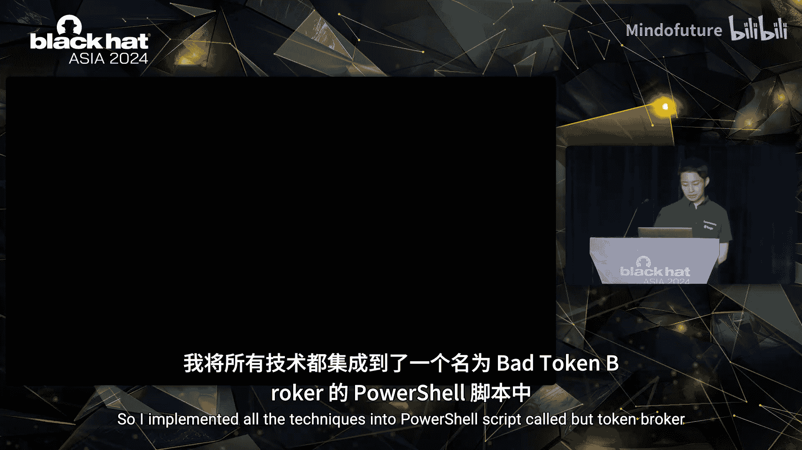
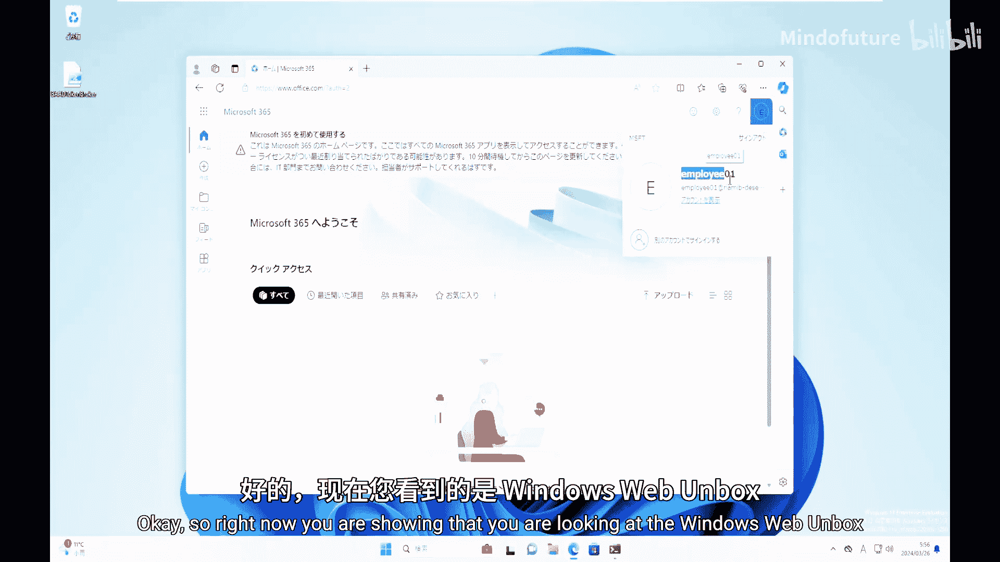
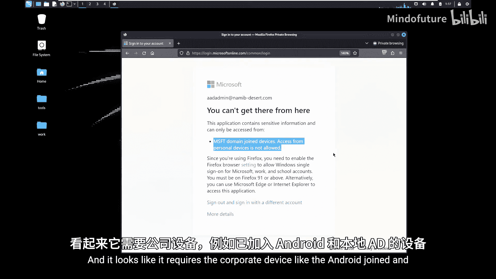
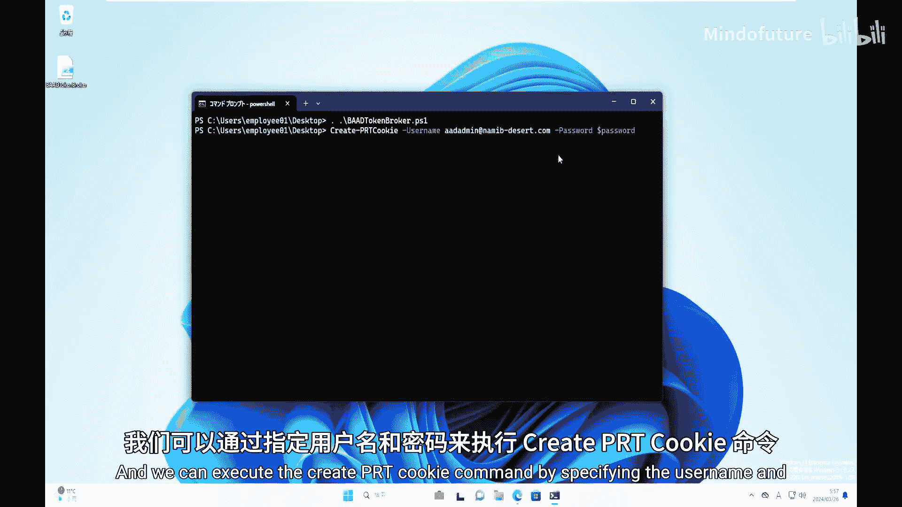
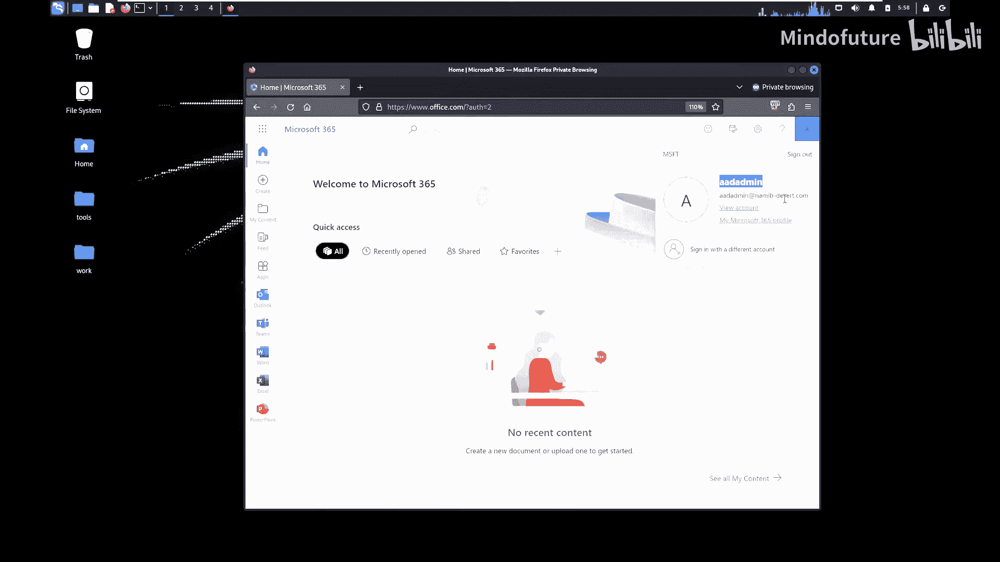
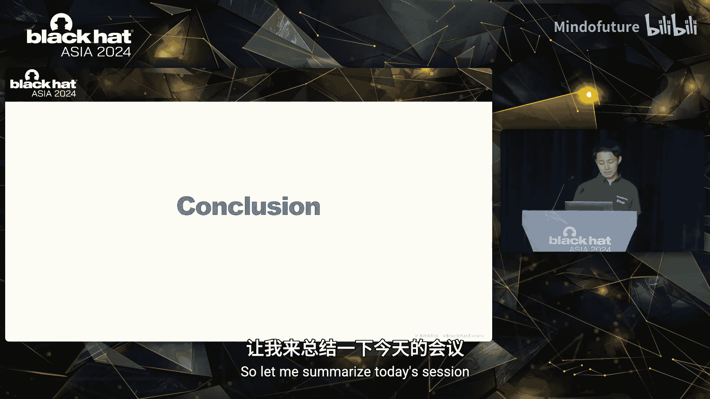

# 035：深入设备认证机制

在本教程中，我们将学习如何深入理解Microsoft Entra ID（原Azure AD）的设备认证机制，并探讨攻击者如何利用Windows内部组件和未公开API来绕过基于设备的条件访问策略。我们将从一次真实的红队演练故事开始，逐步剖析设备注册、密钥使用、浏览器单点登录流程，并最终揭示如何滥用这些机制。

## 课程大纲
1.  **引言：一次红队演练的挑战**
2.  **Entra ID设备认证机制**
3.  **Windows内部隧道分析**
4.  **滥用机制与演示**
5.  **缓解措施与总结**

---

## 1：引言：一次红队演练的挑战

我是Yu Trudo，来自Sere Works，主要为日本企业提供安全服务。

在今天的分享中，我想介绍我们在红队演练中遇到的一个挑战，以及相应的解决方案。

在一次红队演练中，我们通过鱼叉式钓鱼成功感染了一台目标机器，并植入了Cobalt Strike信标。从这台机器，我们渗透进了内部网络，并通过一些技术手段，最终攻陷了目标Active Directory，并获得了域管理员权限。

之后，利用获得的域管理员权限，我们从活动目录中导出了所有凭据。在导出的凭据中，有一个看起来像是Azure AD（现在称为Microsoft Entra ID）的管理员账户。如果我们能成功用这个管理员账户登录AAD，我们可能也能获得Entra ID的管理员权限。

我们尝试破解其密码，并尝试使用该凭据登录Entra ID。然而，登录虽然成功，但访问被Microsoft Entra ID的一项安全功能——条件访问——所阻止。

对于那些不熟悉条件访问的听众，这是微软的一项安全功能，可以根据信号（如你是谁、你的设备是什么、你使用什么应用程序、你的网络环境等）来控制对云资源的访问。

从我们收到的错误信息来看，访问被基于设备的条件访问策略阻止了，并且似乎要求使用已加入Microsoft Entra ID或本地AD的“公司设备”。这意味着，作为攻击者，我们需要一台公司设备作为跳板来访问云资源。

因此，问题在于：我们如何绕过这种需要特定设备的条件访问策略？

基于这次演练，我开始研究如何绕过这种基于设备的条件访问，并能够仅凭凭据就以任何用户的身份访问云资源。

我们希望仅凭凭据就能以任何用户的身份访问云资源，而不仅仅是设备的锁定用户。这样我们就可以轻松切换账户，在云环境中更快地进行横向移动和后渗透活动。这就是我的研究目标。

为了给这个研究目标寻找思路，让我们先看看Entra ID在认证过程中是如何识别设备的。

---

## 2：Entra ID设备认证机制

Entra ID进行设备识别的关键部分在于设备注册期间生成的密钥。

当设备注册到Entra ID时，会生成两组密钥：一组是设备密钥，另一组是传输密钥。每组密钥都有自己的公钥和私钥。在设备注册期间，设备密钥和传输密钥的公钥会被发送到Entra ID并完成注册。Entra ID可以在认证过程中，根据这些密钥的使用情况来识别设备。

现在，让我们详细看看当你使用公司设备的浏览器访问Microsoft时的认证流程。

首先，当你想要使用公司设备向Entra ID进行认证时，设备会发送一个由设备密钥签名的登录请求。这个签名的登录请求本质上是一个JWT（JSON Web令牌）。JWT包含三个部分，每个部分都是Base64 URL编码的JSON值。第一部分是头部，定义了JWT的签名算法。第二部分是载荷，包含用于用户认证的用户名和密码。最后一部分是签名，这是由设备密钥生成的JWS（JSON Web签名）。

Entra ID收到这个请求后，会验证设备密钥的使用情况以及载荷中的凭据。通过发送这个签名的登录请求，Entra ID可以识别设备并认证用户。然后，Entra ID会返回PRT（主刷新令牌）和会话密钥。

在响应中，你可以看到PRT和会话密钥。主刷新令牌可以用于对Teams、SharePoint、AAD等进行单点登录访问。但仅发送PRT不足以完成单点登录，你还需要使用会话密钥。

然而，在响应中，会话密钥实际上是加密的。为了使用会话密钥，设备需要使用传输密钥来解密加密的会话密钥。

对于浏览器的单点登录访问，设备首先解密响应中的加密会话密钥，然后用它来签名PRT，生成所谓的“PRT Cookie”。PRT Cookie也是一个JWT，其载荷中包含PRT。这个PRT Cookie由会话密钥签名，而会话密钥又与特定设备绑定。

因此，Entra ID可以根据会话密钥的使用情况来识别使用了哪个设备，并基于设备信息来控制对云资源的访问。

在设备识别之后，你就可以像这样访问Microsoft云资源了。

**总结一下：**
*   在设备注册期间，会生成设备密钥和传输密钥并注册到Entra ID。
*   Entra ID可以通过设备密钥和会话密钥的签名来识别使用了哪个设备。
*   但响应中的会话密钥是加密的，因此设备使用注册的传输密钥解密后，用它来签名PRT并创建PRT Cookie。

从这个机制出发，思考我们的研究目标，我们可以得出：通过使用这些密钥签名任何用户的登录请求和PRT，我们就可以以注册设备的身份访问Entra ID，从而绕过基于设备的条件访问。

然而，这些密钥（设备密钥、传输密钥和会话密钥）如果设备支持，都会被安全地存储在TPM（可信平台模块）中，并且这些密钥不可导出。之前有研究（由Benjamin Delpy和Dirk-jan Mollema发现）通过导出一个会话密钥的派生密钥来创建PRT Cookie，但该漏洞已在2021年被修补。因此，目前很难导出密钥并创建PRT Cookie。

但即使密钥受TPM保护且不可导出，我相信这些密钥仍然可以从设备内部被使用和访问。

因此，如果我们能理解TPM中存储的密钥在设备内部是如何被处理和使用的，那么我们仍然可以滥用它们来创建任何用户的PRT Cookie，并伪装设备访问Entra ID。这就是我开始逆向工程Windows操作系统，以理解这些TPM中的密钥如何被使用以及我们如何滥用的原因。

---

## 3：Windows内部隧道分析

首先，我开始研究Google Chrome如何处理浏览器单点登录，特别是处理用户浏览器登录的扩展程序“Windows Accounts”。

当你打开Google Chrome并访问Microsoft时，会发生以下情况：首先，Google Chrome会生成一个新的进程`browser_broker.exe`。然后，`browser_broker.exe`加载DLL `MicrosoftAccountTokenProvider.dll`。接着，`browser_broker.exe`执行该DLL中的一个方法`GetCookiesForUri`。在这个方法中，它会获取设备锁定用户的PRT Cookie，并将其返回给调用进程，最终返回给Google Chrome。

基本上，这就是Google Chrome浏览器单点登录的方式，并且这种方式已被攻击者用于窃取PRT Cookie。我的意思是，攻击者可以使用`browser_broker.exe`，或者也可以使用该DLL并执行你提到的方法。

但对于我的研究，我试图发现`GetCookiesForUri`方法内部是如何获取锁定用户的PRT Cookie的。

查看DLL中的`GetCookiesForUri`方法，你会发现该方法最终调用了一个名为`LsaCallAuthenticationPackage`的Windows API。这个Windows API可以与加载在`lsass.exe`中的认证提供程序进行通信。

这意味着`GetCookiesForUri`方法正在向`lsass.exe`发送一些数据，以获取锁定用户的PRT Cookie。

如果你查看发送到`lsass.exe`的数据，你会发现一些包含`CoreID`和载荷值的JSON数据。如果你进一步跟踪这些JSON数据的去向，你会发现JSON数据首先被发送到`lsass.exe`中的云认证提供程序，然后JSON数据被传递给`AzureAD`插件。最终，`AzureAD`插件在这个函数内部处理JSON数据。

在这个`AzureAD`插件的函数内部，有一个`switch`语句。根据JSON数据中的`CoreID`编号，插件内部的某个函数会被执行。这次，JSON中的`CoreID`是2，因此插件内部的`CreateSsprCookie`函数被执行，然后这个函数返回锁定用户的PRT Cookie。

**让我总结一下我们目前看到的情况：**
在浏览器单点登录期间，Google Chrome运行`browser_broker.exe`，然后`browser_broker.exe`执行`GetCookiesForUri`。接着，这个方法执行`LsaCallAuthenticationPackage` API来与`lsass.exe`通信，通过发送JSON数据。JSON数据被传递给`AzureAD`插件，然后根据JSON数据的`CoreID`编号，执行`CreateSsprCookie`函数。这个函数将PRT Cookie返回给Google Chrome。

这就是浏览器单点登录期间发生的情况。为了与`lsass.exe`和`AzureAD`插件进行交互以进行研究，我实现了一个概念验证（POC），可以直接与`lsass.exe`对话，而无需`browser_broker.exe`和DLL，只需调用`LsaCallAuthenticationPackage` API。通过这个POC，我能够调用插件中的`CreateSsprCookie`函数。

通过复制与Google Chrome相同的流程，并执行插件中的函数，我确认我们可以窃取设备锁定用户的PRT Cookie。

现在，我获得了另一种窃取锁定用户PRT Cookie的方法。然而，窃取PRT Cookie只允许我们以设备锁定用户的身份访问资源。

为了仅凭凭据就以任何用户的身份访问资源，我们首先需要使用设备密钥对用户的登录请求进行签名。为此，在`AzureAD`插件中有一个名为`SignPayload`的内部函数，它看起来很有趣，可能有助于研究。

因此，作为研究的下一步，我开始研究`AzureAD`插件中的`SignPayload`函数。

这是`AzureAD`插件中`SignPayload`函数反编译版本的一部分。你可以看到这个函数内部调用了两个函数：一个是`CheckPackageSidForRequestSign`，另一个是`BuildDeviceBoundSspr`。

让我们先看第二个函数，以理解插件中的这个`SignPayload`函数能为我们做什么。

在`BuildDeviceBoundSspr`函数中，首先JSON数据被发送到`lsass.exe`。然后，设备获取这个载荷值并进行Base64 URL编码。同时，生成JWT头部。从头部和载荷中，生成设备密钥的签名。最后，将所有部分组合起来，创建带有设备密钥签名的JWT。

因此，`SignPayload`函数确实可以对载荷内容进行签名，并使用设备密钥生成JWT。这意味着，通过这个函数，如果你在JSON数据的载荷中包含用户名和密码，那么通过`AzureAD`插件的这个内部函数，你可以获得带有设备密钥签名的登录请求，并可以用它来认证你的Entra ID。

然而，还有另一个函数`CheckPackageSidForRequestSign`。这个函数的作用是检查调用进程的SID是否是指定的SID。如果不是正确的SID，那么`BuildDeviceBoundSspr`函数就不会执行，因此`SignPayload`函数不会为我们返回设备密钥签名的登录请求。

但是，通过快速研究那里指定的SID，我发现这个SID是容器的SID，并且是针对名为`AzureADTokenBroker`的应用程序的。由于这个SID是针对容器的，通过一些技术，我们可以在设备中模拟这个SID，从而绕过这个函数的SID检查。

例如，从我们的Cobalt Strike客户端，我们可以模拟`AzureADTokenBroker`的SID来绕过SID检查，然后我们可以调用`LsaCallAuthenticationPackage` API来执行插件中的`SignPayload`函数。如果你在发送到`lsass.exe`的JSON数据中包含用户名和密码，那么你就可以通过这种方法获得设备密钥签名的登录请求。

我为这种方法实现了一个POC，并生成了带有设备密钥签名的登录请求。通过发送这个签名的登录请求，我确认我们可以获得用户的PRT，以及响应中的加密会话密钥。

**总结一下：** 我们可以通过`AzureAD`插件中名为`SignPayload`的内部函数，使用设备密钥对任何用户的登录请求进行签名。通过发送签名的请求，我们可以获得用户的PRT和加密的会话密钥。

对于浏览器单点登录访问，我们还有一件事要做，那就是解密响应中的加密会话密钥，并用它来签名PRT。那么，让我们找出如何做到这一点。

通过查看伪代码，我发现从`cryptngc.dll`导入了一些未公开的API，用于处理响应中的加密会话密钥，它们是`NgcImportSymmetricKey`和`NgcSignWithSymmetricKey`。

我不会在这里涵盖所有技术细节，但这些未公开的API作为RPC客户端工作。`NgcImportSymmetricKey`可以与`lsass.exe`通信，然后`lsass.exe`作为RPC服务器，将加密的会话密钥输入TPM，并使用TPM中注册的传输密钥进行解密。`NgcSignWithSymmetricKey`可以使用TPM中的会话密钥对签名输入进行签名，并从签名输入中获取会话密钥的签名。

通过分析这些未公开的API，我发现我们可以使用它们将会话密钥导入并解密到TPM中，然后我们可以使用会话密钥进行签名。通过这种方法，我们最终可以使用会话密钥对PRT进行签名，并且可以创建我们自己的PRT Cookie。

我将这个功能实现到我的POC中，并确认我们可以创建自己的PRT Cookie。现在，我们可以使用凭据为任意用户创建PRT Cookie，因此，如果你有凭据，我们就可以以任何用户的身份获得浏览器单点登录访问资源的权限。

**让我总结一下我们目前看到的情况以及如何使用它们：**
首先，我们需要感染一台已注册到Entra ID的公司机器。然后，从这台机器上，我们可以使用设备密钥对任何用户的登录请求进行签名。接着，你可以发送带有设备密钥签名的登录请求，并获得用户的PRT以及加密的会话密钥。之后，你可以使用未公开的API将会话密钥导入TPM，并使用TPM中的传输密钥进行解密。然后，你可以用它来签名PRT并创建PRT Cookie。如果攻击者通过这种方法获得了生成的PRT Cookie，攻击者就可以以PRT Cookie用户的身份跳转到云环境，并绕过基于设备的条件访问。

通过这种方法，我们现在可以获得基于浏览器的单点登录访问权限。但是，如果我想要对Entra ID进行API访问呢？

还有另一种认证流程可以为我们提供API访问的访问令牌。通过发送由会话密钥签名的PRT，我们也可以获取API的访问令牌。然而，响应中的这些访问令牌是加密的，不能直接用于API。

但实际上，你可以使用会话密钥解密加密的访问令牌。我发现有另一个未公开的API用于此目的，即`NgcDecryptWithSymmetricKey`。通过分析这个未公开API的使用，我确认我们可以使用解密并存储在TPM中的会话密钥来解密加密的访问令牌，并且我们也可以获取访问令牌和刷新令牌，用于云环境的API访问。

因此，通过滥用TPM中存储的密钥（通过未公开API和`lsass.exe`中`AzureAD`插件的内部函数），我们可以创建自己的PRT Cookie，或者也可以使用任何用户的凭据获取访问令牌。这种攻击方法不需要在受感染的设备上拥有管理员权限。使用这种方法，我们最终可以绕过基于设备的条件访问策略。

现在，最初的目标已经实现。但让我们探索更多滥用TPM存储密钥的方法。

TPM存储密钥的另一种滥用是密码重置。我发现其他未公开的API允许我们与同样存储在TPM中的Windows Hello for Business密钥进行交互。

首先，让我们看看Windows Hello for Business的实现，以了解这个未公开API能为我们做什么。

正如你可能知道的，Windows Hello for Business用于无密码认证。当你想使用它时，会生成称为用户密钥的Windows Hello for Business密钥，并注册到Entra ID。之后，这可以用于在没有密码的情况下认证到Entra ID。

当使用Windows Hello for Business进行认证时，首先，我们需要发送一个设备密钥签名的JWT，其中包含Windows Hello for Business密钥的签名。我知道这有点复杂。然后，Entra ID可以返回PRT和会话密钥。有了这些，我们可以像之前看到的那样创建PRT Cookie。

让我们看看这个复杂的签名数据。这是认证期间发送到Entra ID的请求。它在请求中有一个设备密钥签名的JWT。如果你查看它，JWT的载荷中包含带有Windows Hello for Business密钥签名的数据。Entra ID收到这个请求后，通过验证设备密钥和Windows Hello for Business密钥的使用情况来执行其认证。

通过分析未公开的API，并与TPM中存储的所有密钥进行交互，我确认我们也可以在没有密码的情况下使用Windows Hello for Business密钥认证到Entra ID，并且可以创建PRT Cookie。

此外，除了PRT Cookie，你还可以通过Windows Hello for Business密钥接收访问令牌。如果你查看通过这种方法获取的访问令牌，实际上在其载荷中包含了MFA声明。

这意味着，通过这种认证方法，多因素认证已经完成。你还可以在载荷中看到设备ID，这意味着设备识别也已完成。

**总结一下：** 现在，我们可以创建PRT Cookie，或者也可以通过Windows Hello for Business密钥在没有密码的情况下获取访问令牌。这种方法允许我们绕过基于设备的条件访问策略，并且攻击者可以绕过Entra ID条件访问中的MFA强制执行策略。

然而，对于攻击者来说有一个限制：如果你想以其他用户身份登录并切换账户，那么你需要入侵其他存储了Windows Hello for Business密钥的设备。因为Windows Hello for Business密钥绑定到特定用户并存储在其他设备中。所以，如果你想在云中在账户之间横向移动，我们必须入侵其他存储了其他用户Windows Hello for Business密钥的设备。

---

## 4：滥用机制与演示

我将所有技术实现到了一个名为`BadTokenBroker`的PowerShell脚本中。让我展示一下它的样子。

现在你看到的是一个已注册到Entra ID的Windows虚拟机，因此你可以访问Microsoft。这是攻击者的机器。

对于演示，首先我将尝试使用引言中被盗的凭据从攻击者的机器登录Entra ID并跳转到云环境。然而，访问被条件访问阻止了，看起来它要求使用公司设备，即已加入Entra ID或本地AD的设备。

那么，让我们想象一下我们入侵了Windows虚拟机，并且可以打开PowerShell会话。我们可以导入`BadTokenBroker`脚本。像这样，我们可以通过指定用户名和密码来执行`Create-PrtCookie`命令。

一旦执行，你就可以像这样获得PRT Cookie。然后，一旦你通过这种方法获得了PRT Cookie，你可以回到攻击者的机器，并在浏览器的Cookie存储中配置这个PRT Cookie。像这样。一旦你配置了Cookie，你就可以再次访问Microsoft。现在，你可以成功访问了。

这就是演示的全部内容。我将所有技术都实现到了`BadTokenBroker`中。现在它是公开的，你可以访问这里指定的URL。

---

## 5：缓解措施与总结

这种攻击是基于Windows操作系统内部如何处理TPM中存储的密钥而实现的，因此这有点像是设计使然。微软已将此攻击回应为预期行为，因此到目前为止没有修复。然而，对于缓解措施，我建议你应该审查并强化你的条件访问策略，例如，要求MFA，而不仅仅是要求公司设备。这有助于使攻击者更难跳转到云环境并在云中横向移动。

在我们的红队演练中，我们看到很多公司只要求公司设备来访问云，而不要求MFA。但如果同时要求MFA，那么攻击者就必须做一些事情，比如入侵配置了Windows Hello for Business密钥的设备，以便为他们的后渗透活动切换账户。因此，我建议你应该要求MFA并强化你的条件访问策略，使攻击者难以跳转到云环境。

为了检测`BadTokenBroker`的攻击，你应该通过使用`AzureAD`插件的内部函数来监控可疑的RPC活动，并且还应该监控`cryptngc.dll`和未公开API的调用。此外，如果你的公司设备被入侵，那么检查该设备是否被攻击者用于绕过基于设备的条件访问策略并在账户之间横向移动是一个好主意。你可以查看来自你设备的多账户登录日志。请参考这里列出的KQL查询。

**让我总结一下今天的课程：**
我们已经看到攻击者如何通过RPC记录和未公开的API与TPM中存储的密钥进行交互。一旦你的公司设备被入侵，攻击者就可以轻松地滥用它们来绕过条件访问策略，正如我们之前所看到的那样。为了使攻击者更难得逞，我强烈建议你审查并强化你的条件访问策略，并在你的终端上检测可疑活动。

这就是我演讲的全部内容。如果你有任何问题，我会在这里，你可以在会议结束后找我提问，或者随时通过Twitter或LinkedIn发送私信给我。

非常感谢大家的聆听。