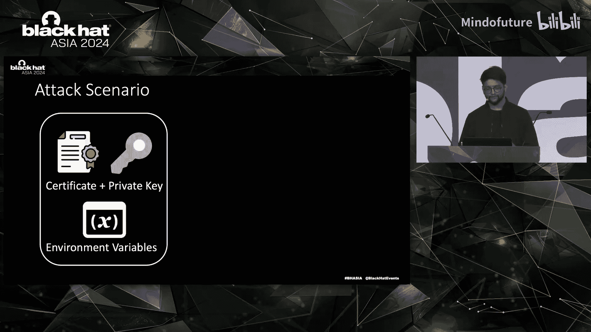
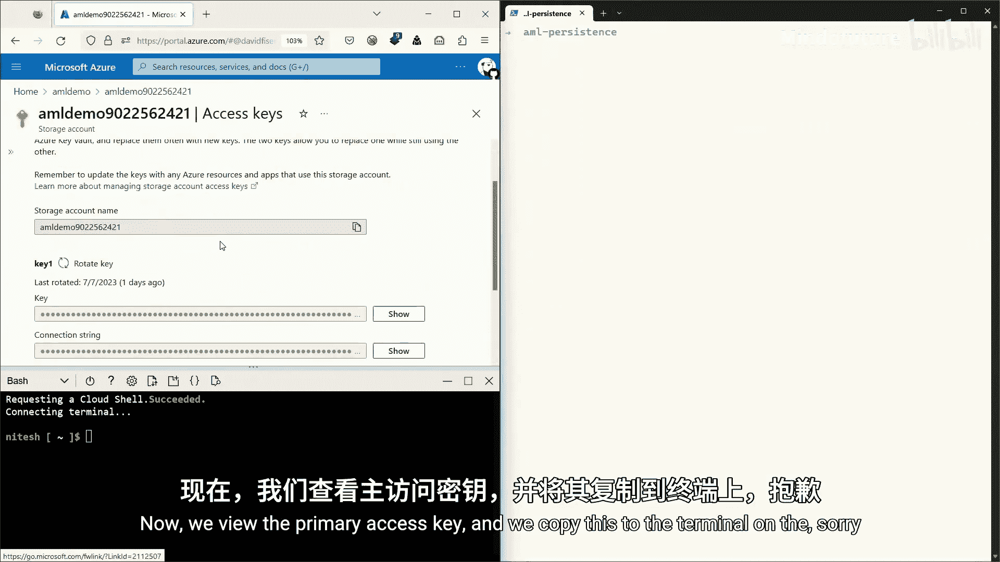
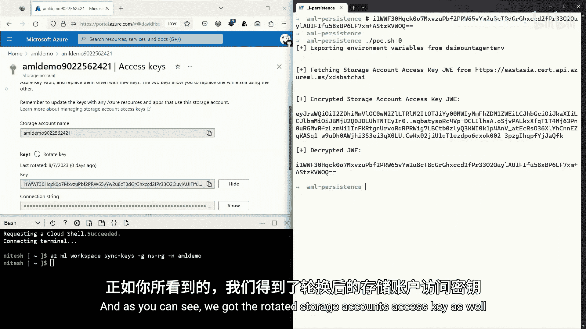
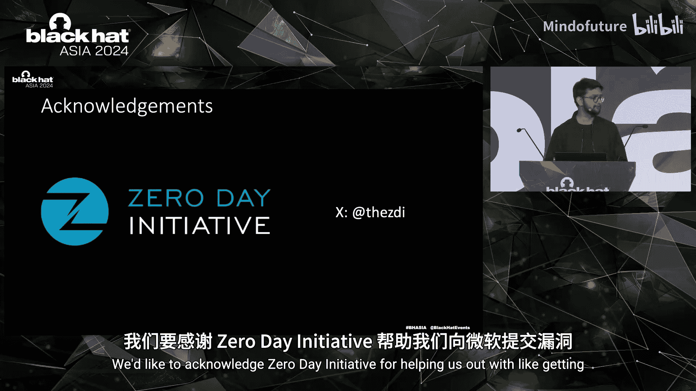

# 036：突破Azure服务中的托管身份壁垒

在本教程中，我们将学习两位安全研究员David和Niish在Black Hat Asia 2024上分享的研究成果。他们将深入探讨在Azure Functions和Azure Machine Learning服务中发现的托管身份实现问题，揭示攻击者如何突破安全边界，从受保护的环境中窃取敏感凭证。我们将跟随他们的研究思路，理解漏洞原理、攻击方法以及从中汲取的安全教训。

---

## 第1节：研究背景与研究员介绍

上一节我们概述了本课程的主题，本节我们来认识一下进行这项研究的安全专家。

我的名字是Niish，来自印度。我在Trend Micro工作，专注于代码与云之间的安全与威胁研究。我曾在Black Hat USA、HITB等会议上展示过我的工作。我通过零日计划向微软等云服务提供商提交过发现的漏洞，并曾入选2023年MSRC最具价值研究员前100名。

我的名字是David。我的信息安全之旅始于2010年，最初是一名恶意软件分析师。2017年底，我加入Trend Micro，将重点更多地转向云威胁和漏洞。我曾在安全会议上展示过我们团队的一些初步发现。

David在Azure Functions服务中发现了一些问题。我在Azure机器学习服务中发现了一些问题。今天，我们将重点讨论Azure Functions和Azure机器学习服务中托管身份实现的问题。

---

## 第2节：Azure Functions环境分析

上一节我们介绍了研究员背景，本节我们来看看David对Azure Functions的探索之旅。

首先需要了解什么是Azure Functions。查阅文档可知，它是一个无服务器平台。本质上，它是在云服务提供商的托管平台上运行用户提供的代码。

这意味着在别人的服务器上运行用户代码。开发者中有一句名言：永远不要信任用户输入。而现在我们却要执行用户代码。但不必过度担心，存在一些机制来防止任意代码执行，例如身份验证。我们可以通过触发器来强化使用，并非所有函数都需要公开端点来执行。

我们的研究方法是从“模拟入侵”开始。我们假设用户的代码在某个时间点会引入漏洞。因此，我们设计了自己的无服务器函数，它本质上是一个连接到我们控制环境的反向Shell。通过这个Shell，我们分析了支撑Azure Functions的底层环境，并执行了一些命令来观察配置变化。

**身份验证选项**：
Azure Functions提供了几种身份验证选项：
1.  **函数令牌**：有两种作用域的令牌。函数令牌基本上绑定到函数本身。主机令牌则允许你在无服务器环境中执行任何函数，还提供了执行某些函数主机API的能力。
2.  **客户端证书**：这是一个更安全的选择。
3.  **自定义逻辑**：由于我们实际上提供了执行函数的代码，因此可以实现自定义逻辑。客户端证书实际上就使用了自定义逻辑，但已有现成的代码片段可用。

**触发器**：
默认触发器是HTTPS请求，这基本上是一个公共端点。第二种是基于云事件的触发器，例如数据库触发器。

**执行时间**：
默认情况下，我们的反向Shell会活跃5分钟，而我们的请求由于负载均衡器会在4分半钟后过期。你可以在`host.json`文件中限制执行时间。

**环境分析**：
获得Shell后，我们首先检查当前身份。结果显示我们是`root`用户。但如今的`root`权限已不如从前。我们执行了`mount`和`capsh`命令，发现我们运行在一个Docker容器内，并且能力受到限制，基本上是默认的Docker能力。

但有一个命令`env`，它可以打印出所有的环境变量。正是从这里开始，事情变得有趣起来。

---

## 第3节：环境变量的安全隐患

上一节我们分析了Azure Functions的运行环境，本节我们深入探讨环境变量带来的安全风险。

环境变量在开发中是一种非常流行的做法，它经常用于存储密钥。有些产品甚至在文档中将其作为存储密钥的“墙”来引用。如果它们都这样告诉全世界，那么对于攻击者来说，这就像是一个公开的“保险箱”。

**环境变量的基本原理**：
在Linux中，一切皆文件。我们可以列出`/proc`文件系统，其中有一个文件`/proc/[pid]/environ`，我们可以打印它，这基本上就是给定进程的环境变量表。我们可以访问运行用户进程命名空间内的所有环境变量。默认情况下，环境变量会继承到每个子进程中，除非显式传递新的环境变量表作为参数。

我们做了一个简单的演示。这是一个简单的C++“Hello World”程序，它甚至没有提及环境变量。我们导出了一个超级秘密的API密钥到环境变量中。编译并运行程序，在`main`函数处设置断点。可以看到`RDX`寄存器指向栈上的地址。跟随`RDX`的值，我们可以看到它指向栈上，并且有一些内容与环境变量非常相似。打印出地址范围，我们可以找到所有的环境变量，包括我们的超级秘密API密钥。

这是调试器特有的吗？还是每个进程都会从父进程继承？这是一个很好的问题。我们进行了分析。起初可能认为是调试器，但不太可能。然后我们想，也许是`ld.so`在起作用。但我们发现实际上是内核本身将环境变量推送到栈上。这是在Linux中创建新进程时调用的函数。从这个大函数中摘取的一段代码展示了它是如何被推送到栈上的。

**回到Azure Functions**：
这是环境变量打印输出的样子，内容很多，难以浏览。我们为你简化了一下。但对于我们的安全目的来说，这些是最重要的部分。

让我们从`AzureWebJobsStorage`开始。这个环境变量是做什么的？对于Azure Functions，你需要将代码存储在某个地方。在很多情况下，你需要一个存储账户。这个存储账户用于存储源代码，Azure Functions主机拉取源代码然后执行。`AzureWebJobsStorage`本质上就是存储账户的连接字符串或访问密钥。我们可以将其复制粘贴到一个名为Azure Storage Explorer的酷工具中。在这里我们可以找到源代码、一些密钥（如函数令牌、主机令牌）。除非我们在云端进行强化，使存储账户不公开可用或禁用写入权限，否则我们可以直接删除和上传文件。但如果进行了强化，对于开发者来说，将源代码放在那里就更麻烦或不方便了。如果你移除了写入权限，那么当你使用VS Code推送源代码或服务器函数时，它将无法工作。你可以完全重写函数本身并执行自己的代码，然后仅仅通过泄露环境变量就能达到目的。

下一个最重要且有趣的环境变量是`CONTAINER_START_CONTEXT_SAS_URL`。它是一个简短的URL。如果我们访问这个URL，会得到类似这样的内容。它基本上是容器配置的加密上下文。看起来不错，但这意味着什么？我们进行了一些挖掘，发现加密上下文是一个AES加密的有效载荷，其中第一部分是初始化向量，第二部分是有效载荷本身，后面跟着哈希值。加密密钥是什么？给你一个提示，是`CONTAINER_ENCRYPTION_KEY`，这是第一个环境变量。所以我们可以解密它。解密后看起来是这样。我们能从中得到什么？当然是身份验证令牌。但假设我们已经可以执行函数，所以这并没有增加太多价值。最重要的是，**托管身份代理**的配置信息。我们认为这些信息应该对服务器环境本身隐藏。

---

## 第4节：托管身份代理与安全边界突破

上一节我们发现了包含敏感信息的环境变量，本节我们看看如何利用这些信息突破安全边界。

我们有一个Azure Function、一个存储账户和一个漂亮的镜像。我们想使用这个镜像，但不想将凭证放在环境变量中。我们使用托管身份。它的工作原理如图所示。最重要的是，它运行在与无服务器函数相同的容器中。

底层发生了什么？在Azure Functions容器内，有一个二进制文件在运行。因为我们解密了上下文，我们得到了代理的所有参数，包括客户端证书、端点和其他一些参数。这个二进制文件只是将请求转发到公共端点，然后获取令牌。

总结一下我们的发现：我们获得了大量环境变量，包括代理参数。这意味着我们可以获取有效的JWT令牌，并且可以在Azure环境外部进行操作。这实际上打破了安全边界，因为它本应在Azure内部进行强化。仅仅通过泄露环境变量，你就可以获得托管身份的令牌。当然，Azure是一个相对安全的平台。除非你明确为托管身份指定权限，否则你可能获得令牌，但它没有任何权限。

**演示**：
1.  首先，模拟环境变量的泄露，解密加密的上下文。如图所示，这是客户端证书和其他代理参数。
2.  然后，在外部使用这些参数请求令牌。
3.  一旦获得令牌，我们联系我们的存储账户并获取一些元数据。
这一切都是在Azure外部完成的。与Azure环境的唯一通信是首先与易受攻击的函数通信并泄露其环境变量。

一个重要的问题是：为什么会发生这一切？显然，重要的一点是环境变量本身的流行度。有时当我审视这个问题时，我感觉每个人都觉得它是安全的。我们使用它，却不去思考底层发生了什么。然后就会出现一些细微的配置链变化，它就被继承到了子进程中。也许有些人不知道，也许有些人知道。但作为安全人员，我们应该了解其后果并告知他人可能出错的地方。

---

## 第5节：Azure Machine Learning服务简介

上一节David介绍了Azure Functions中的问题，本节开始由我（Niish）介绍在Azure机器学习服务中的发现。

如今，人工智能几乎被融入我们将要使用或最终会接触到的所有事物中。我们现在多多少少都接触过这些服务。所有这些服务都基于Azure AI平台。应用AI服务是解决业务问题的产品。它们依赖于作为服务提供的机器学习模型，即认知服务。而所有这一切都构建在Azure机器学习服务之上。

Azure机器学习是微软提供的基于云的机器学习即服务产品。在AML中，你创建一个工作区，这个工作区基本上是进行机器学习操作的中心场所。MLOps最终归结为拥有一些计算资源、一些云存储以及一种监控日志的方式，还有其他一些参数。

工作区依赖于某些Azure服务，如存储账户、Azure Key Vault、Azure容器注册表和应用程序服务。

**存储账户**：为每个工作区创建一个存储账户，用于保存机器学习模型和数据集，如数据集、Jupyter笔记本、日志、模型、快照、Python脚本等。这是你存放东西的地方。

**计算实例**：Azure ML提供了各种计算选项来运行你的代码。计算实例是托管的Ubuntu虚拟机。“托管”意味着主机操作系统的安全等一切由微软自己管理。操作系统镜像包含开发者使用的各种工具，如Jupyter、VS Code、Conda、Docker、Python等。与Azure Functions不同，我们对此虚拟机或计算实例拥有完全的`root`访问权限。

此外，这些计算实例包含某些由云服务提供商（本例中是微软）创建和维护的程序或中间件代理。这些是秘密的、未文档化的代理，用于配置环境、诊断环境等，有时也会打开信息泄露和代码执行的途径。这些代理可能是开源的（如OMI），也可能是闭源的。

**研究方法**：
1.  检查进出流量。
2.  检查运行进程以找到此类代理。
3.  逆向这些云服务提供的代理（因为它们是闭源的），可能发现未文档化的API或过度宽松的API。
4.  探索执行操作时生成的日志。

---

## 第6节：计算实例中的身份代理

上一节我们介绍了Azure ML的基本架构，本节我们深入计算实例，看看其中运行的身份代理。

与David之前分享的例子类似，假设我们有一个函数应用和一个计算实例在用户的订阅中。我们希望这些Azure资源能够访问一个存储账户。方法之一是在代码中硬编码凭证，但这不被推荐。微软建议使用托管身份。

第一种类型是**用户分配的托管身份**。这个身份可以跨资源使用，也可以被多个资源使用。第二种类型是**系统分配的托管身份**。这个身份是特定的，并且绑定到你所分配资源的生命周期，不能跨资源使用。

要使用Azure CLI开始使用托管身份，你可以运行`az login --identity`。

由于我们对虚拟机或计算实例拥有root访问权限，当我们运行此命令时会发生什么？一个GET请求被发送到本地端口`40368`。同样，由于我们有root权限，我们能够找出监听此端口的底层进程。在本例中，它是`identityresponderd`。`identityresponderd`是什么？它是一个强大的守护进程，以root身份运行，也称为Azure Batch AI身份响应守护进程。它会响应一些身份令牌吗？我们稍后会看到。它还从存储在文件中的环境变量获取其配置。这些是文件的位置。

这些是`identityresponderd`用来启动计算实例的一些环境变量，特别是`MSI_ENDPOINT`、`MSI_SECRET`和`CURL_CA_BUNDLE`，这是我们需要关注的三个重要环境变量。

我们想弄清楚出站流量是什么样的，看看我们能做些什么。最终，我们看到了这个POST请求，其中`Host`头被设置，POST请求体包含证书指纹、设置为`instanceId`的计算实例名称以及我们为其获取令牌的资源。要与这个端点通信，我们需要一对证书和私钥，它们来自所有你将创建的计算实例上的一个硬编码路径。

总的来说，我们有一个包含`identityresponderd`二进制文件的计算实例。这个闭源二进制文件使用一对证书和私钥与公共端点通信，在响应中，可以从计算实例获取托管身份的JWT。

假设在入侵后场景中，证书和密钥对被泄露并从计算实例中窃取。攻击者是否仍然可以使用同一对证书和密钥从非计算实例环境获取托管身份令牌？我们尝试绕过安全边界，但发现不行，我们得到了`401 Unauthorized`。那么微软真的赢了吗？让我们看看。证书和密钥对实际上与计算实例绑定，并且每个计算实例都是唯一的。没有两对证书和私钥会是相同的。

但就这样结束了吗？不。

---

## 第7节：DSI Mount代理与密钥泄露

上一节我们发现直接使用证书外部调用失败，本节我们引入另一个关键代理——DSI Mount代理。

`dsimountagent`是另一个存在于所有计算实例上的二进制文件，同样以root身份运行。它被称为Batch AI DSI Mount代理。它也像`identityresponderd`一样，从存储在文件中的环境变量获取其配置。

这个代理正是我们去年在Black Hat USA上发现漏洞的那个二进制文件。我们在二进制本身中发现了一个漏洞，网络攻击者基本上可以获取任何服务的日志。例如，你可以获取Jupyter服务的日志，因为Jupyter安装在所有计算实例上。假设你是一个使用计算实例的数据科学家，并使用Jupyter终端以`sudo`身份运行一些命令，这些命令会进入日志，而这些日志可以被网络攻击者查看。这个问题后来通过这个CVE修复了。

现在，我想展示最初计划在去年Black Hat USA上分享的内容。`dsimountagent`的配置文件包含某些有趣的环境变量，如一些对称密钥、集群证书、集群私钥、XDS端点等。`dsimountagent`的目的是确保此工作区的存储账户的文件共享被挂载到计算实例上，它通过每两分钟检查一次来实现。它的工作就是确保文件共享被挂载。

事实证明，`dsimountagent`使用与`identityresponderd`相同的证书和私钥对与Batch XDS端点通信。在响应中，我们得到了一些东西。

出站流量看起来像这样。我们只关注请求体，因为从这里开始，证书、端点、URI都是相同的。响应中，对于请求类型`getworkspace`，我们得到了AML工作区的元数据。这些元数据包含诸如存储账户资源ID、密钥库、应用程序洞察、租户ID、订阅ID等信息。这可以看作是AML工作区的“我是谁”。

后来，我们遇到了另一个请求。我们有一个名为`getworkspacesecrets`的函数，其中请求类型设置为`getworkspacesecrets`。在响应中，我们得到了这些存储账户访问密钥的加密形式。响应由某些环境变量解密，这些变量同样存储在`dsimountagent`和`dsiidlestopagent`（另一个不同的二进制文件）的文件中。使用这两个环境变量，我们得到解密的对称密钥。使用这个解密的对称密钥，我们能够解密我们看到的响应，最终获得存储账户的访问密钥。

**攻击场景**：
我们有一个证书和私钥，以及一堆存储在文件中的环境变量。这些变量用作这些中间件代理的配置。你可以使用这些来获取存储账户的访问密钥。假设这三个文件被泄露。现在，你会做什么来使存储账户访问密钥失效？旋转密钥是个好主意。让我们看看是否有效。

**演示**：
1.  在AML工作区中，导航到存储账户的访问密钥部分，复制主访问密钥。
2.  运行POC（概念验证），利用我们窃取的证书和私钥，获取当前的存储账户访问密钥。
3.  然后，在Azure门户中重新生成（旋转）存储账户访问密钥。
4.  复制新生成的密钥。
5.  同步AML工作区以使用这个新的存储账户访问密钥。
6.  同步完成后，返回终端，重新运行POC，看看是否能获取旋转后的存储账户访问密钥。如你所见，我们成功获取了旋转后的存储账户访问密钥。

故事并没有在这里结束。还有更多代理使用证书和私钥对与类似的公共端点通信，在响应中我们可以获得诸如存储账户访问密钥、AML工作区元信息等“皇冠上的明珠”。我们可以研究并逆向更多代理，找出使用证书和私钥还能获取什么。

我们的想法是找出我们还能请求什么，以及POST请求体中`requestType`参数还能是什么。例如，`getworkspacesecrets`函数调用了另一个函数`generate_xds_api_request_schema`。POST请求体是由这个函数生成的。`requestType`参数由这个函数填充。我们的想法是查看所有二进制文件中对此函数的交叉引用，找出还能做什么。

这是我们列出的清单。其中有`generateSas`、`generateDatastoreCredentials`、`getACRToken`、`getAUToken`等。我们选择了`getAUToken`，因为它很有趣。这个函数存在于`identityresponderd`主机工具包以及许多其他二进制文件中。

请求体看起来像这样，我们将`requestType`设置为`getautoken`，请求体包含我们为其获取令牌的资源。这被发送到相同的Batch XDS端点。在响应中，我们获得了分配给计算实例的托管身份的Azure Container Registry JWT。响应看起来像这样。类似地，为了获取用户分配的托管身份，我们只需在请求中指定`clientId`，就能获得分配的用户分配托管身份的ACR JWT。

**快速回顾**：
计算实例中有某些二进制文件使用一对证书和私钥与公共端点通信。我们可以获取AML工作区的“我是谁”信息、存储账户密钥、托管身份的JWT等等。如果这些凭证在入侵后场景中被泄露，攻击者可以做同样的事情。

---

## 第8节：日志记录缺陷与安全建议

上一节我们展示了攻击者如何持续获取敏感信息，本节我们探讨为什么此类攻击难以被发现，并总结安全建议。

我们可以使用日志来查看是否有异常活动发生。让我们看看日志。首先，进行一些合法活动，例如使用Azure ML SDK或从计算实例运行`az login --identity`。然后，使用来自同一计算实例（但假设已泄露）的证书和密钥对，从计算实例外部运行请求。我们得到了这些日志。攻击者日志和计算实例日志之间的差异，并不真正意味着我们可以依赖的重要信息来判断请求是来自计算实例还是攻击者环境。如你所见，登录详细信息不包含任何IP地址信息。这本来是一个可以依赖的指标，但你不能。

那么，我们如何检测有人窃取了我们的证书？你不能使用日志。这太糟糕了。为什么这甚至是一个漏洞？根据微软的文档，托管身份的设计初衷是，只有我们分配了身份的Azure资源才能使用该身份从Azure AD请求令牌。但我们能够在分配身份的资源之外使用证书和私钥来获取令牌。

为了从官方渠道确认，我们联系了Azure支持。我们询问为什么托管身份登录日志不包含任何IP地址。他们的回复是：假设托管身份令牌是从本地端点获取的，就像AWS的IMDS端点。因此，由于托管身份的特性，日志没有帮助。后来，为了确认，事实证明无法确定证书请求的实际来源。他们再次表示，Microsoft Entra不记录IP地址，因为假设登录来自目标托管身份资源。

**关于持久性的说明**：
使用证书和私钥，你可以获取旋转后的密钥、托管身份的JWT。证书有效期为整整两年。因此，如果你被入侵，你至少两年内不会知道有人拥有后门访问权限。要使证书失效，你需要删除计算实例。显然，这些日志记录的差异对攻击者非常有利。

**披露时间线**：
我们原计划在Black Hat USA上与社区分享这项研究。然而，在演讲录制前，漏洞可重现但未修复。我们联系了微软，他们认为这个漏洞是低严重性的。后来应微软的要求，我们删除了细节。尽管这个漏洞已经超过了90天的ZDI披露政策期限并且仍然可重现，微软最近确认漏洞已修复，我们也已验证。目前，修复措施不允许在计算实例外部使用证书和密钥对。我们将在4月22日发布相关博客。

有多少服务支持托管身份？有超过50个Azure服务支持Azure托管身份。我们已经研究了Azure应用服务、Azure机器学习服务。研究人员可以研究其他服务以发现更多变体和服务中的日志记录差异。

**关键要点**：
1.  并非说你不能使用环境变量注入密钥，但当你这样做时必须非常小心，了解后果，知道事情可能会变得非常糟糕，它绝对不是一堵“墙”。
2.  对云服务提供商的服务进行威胁建模总是好的，以便了解可能出错的地方，并可能制定应对计划。
3.  始终遵循最小权限原则。这对于云部署尤其重要，因为单个访问令牌可能导致整个云账户沦陷。
4.  如果你是威胁研究人员，请检查云API，发现漏洞，使整个环境更加安全。
5.  测试和保护你的身份验证和授权范围非常重要。确定可以从哪里使用这些基于证书的身份验证。
6.  如果我们有可操作的日志记录，我们就可以检测到此类事情，从而更加安全。
7.  这种“模拟入侵”的研究方法也可以导致此类安全发现，而这些发现很难被检测到。
8.  挑战官方文档，不要忘记联系支持团队。

我们感谢零日计划在帮助我们与微软沟通漏洞方面提供的帮助。

---

## 总结

在本课程中，我们一起学习了David和Niish在Azure Functions和Azure Machine Learning服务中的深入研究。我们了解了环境变量不当使用可能导致敏感信息（如托管身份代理配置、存储密钥）泄露。我们看到了攻击者如何利用这些泄露的凭证，突破安全边界，从Azure资源外部获取令牌和访问密钥，并且由于日志记录的缺陷，此类攻击难以被检测。最后，我们总结了一系列重要的安全实践和教训，包括谨慎使用环境变量、实施最小权限原则、进行威胁建模以及挑战官方假设。这项研究提醒我们，在云原生环境中，安全是一个需要持续关注和深入理解的复杂课题。