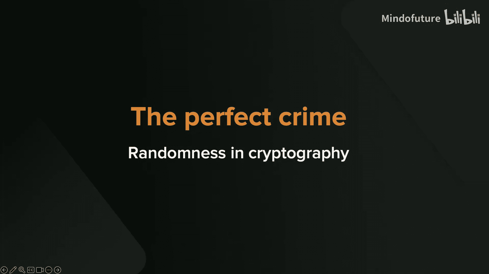
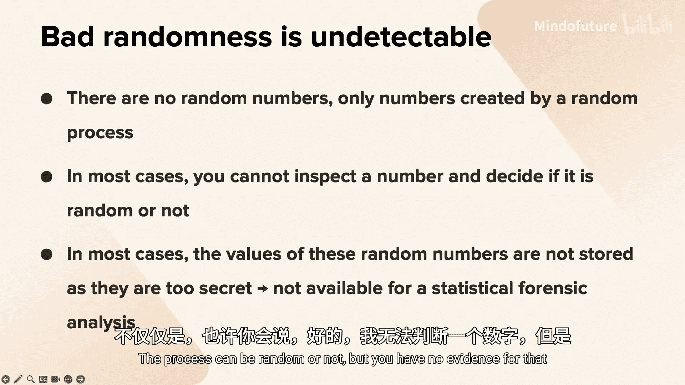
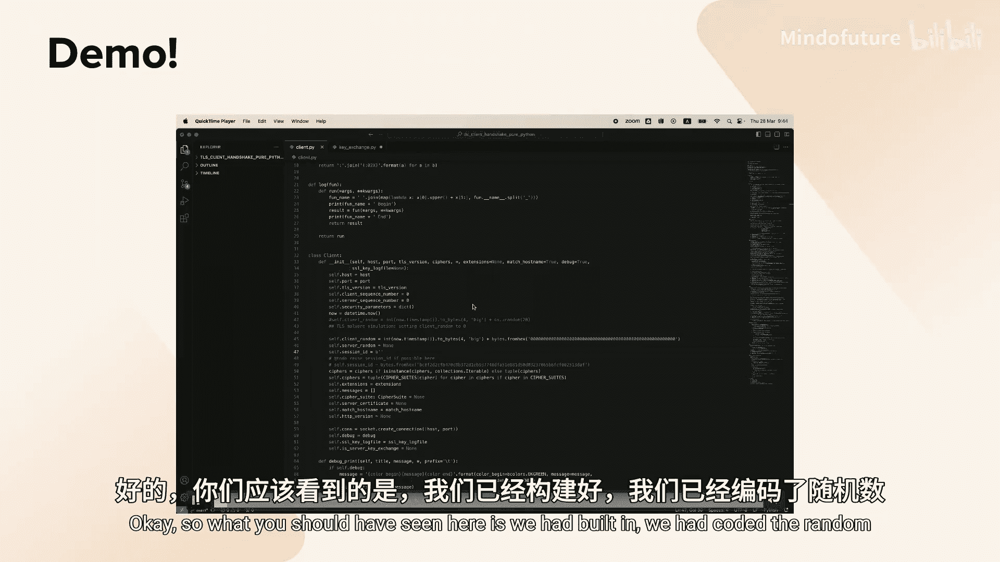

# 037：对抗密码学的完美犯罪——坏随机性

在本节课中，我们将探讨密码学中的一个核心但常被忽视的威胁：坏随机性。我们将了解为什么坏随机性被称为“密码学的完美犯罪”，回顾几个真实世界中因此被利用的高危漏洞案例，并学习一些实用的防御解决方案。

## 为什么坏随机性是“完美犯罪”？

上一节我们介绍了课程的主题。本节中，我们来看看构成“完美犯罪”的两个要素。

首先，它必须是致命的。在密码学中，随机性至关重要。正如教授所说：“随机性之于密码学，如同氧气之于呼吸。” 几乎所有密码系统都依赖随机性来生成**密钥**、**随机数**等关键参数。如果这些本应随机的值变得可预测，整个系统的安全性就会彻底崩溃。

其次，它必须是无法检测的。这才是使其成为“完美犯罪”的关键。问题在于，数字本身没有“随机”的属性；随机性是生成过程的特性。当你收到一个号称来自随机数生成器的数字时，你无法判断它是否真的随机。更糟糕的是，出于安全考虑，我们通常被禁止收集和存储随机数生成器的输出（例如用于生成密钥的随机数），因为这本身就会成为新的攻击面。因此，攻击者可以制造坏随机性，而受害者几乎无法察觉。

## 真实案例：坏随机性在行动

我们已经理解了坏随机性的危险性。接下来，让我们通过几个真实案例，看看它是如何在不同的领域被利用的。

### 案例一：比特币地址与坏随机性

比特币地址的安全性完全始于一个随机数。以下是其简化的生成流程：
1.  生成一个随机的128位数字（熵）。
2.  通过BIP-39词典将其转换为助记词（种子短语）。
3.  对种子应用密钥派生函数（如2000轮HMAC-SHA512）。
4.  最终派生出私钥和公钥（地址）。

如果第一步的随机数生成器质量不佳（例如，早期某些网页钱包使用的JavaScript `Math.random()` 函数熵不足），那么生成的私钥就可能被攻击者猜测到。更严重的是，由于用户会通过助记词备份和恢复钱包，这个初始的脆弱性会一直伴随用户，即使更换了钱包软件。

为了证明有攻击者在主动搜寻这类漏洞，研究者创建了一个使用完全非随机数（数字“1”）生成的“诱饵”比特币地址。当向该地址发送一小笔资金后，资金在交易被广播到网络的同一秒内就被迅速转走。这表明，有机器人正在实时监控区块链，专门寻找并掠夺由坏随机性生成的地址中的资金。

### 案例二：ECDSA签名与随机数重用

坏随机性的威胁不仅限于生成密钥。在ECDSA等数字签名算法中，每次签名都需要一个唯一的随机数（`k`）。如果这个随机数被重复使用或可预测，攻击者就可以从中推导出私钥。

这在以太坊网络上真实发生过：有用户重复使用了签名随机数，导致其账户资产被立即盗取。同样，YubiKey硬件密钥也曾因一个固件漏洞导致随机数生成问题，不得不召回并重置所有设备。

### 案例三：TLS协议与国家级恶意软件

如果你觉得加密货币离你很远，那么TLS协议（保障HTTPS安全）则是人人都在使用的。卡巴斯基在五年前披露了一款名为“Reductor”的恶意软件，据信与某个国家级攻击组织有关。

这款恶意软件会篡改受害主机上的伪随机数生成器函数。在TLS握手过程中，客户端会发送一个“客户端随机数”。如果这个值被恶意软件固定为一个攻击者已知的值，那么攻击者部署在网络上游的中间人设备就能轻易地从海量流量中识别出受害者的通信。

攻击流程如下：
1.  恶意软件感染受害者电脑，固定其TLS握手时的“客户端随机数”。
2.  攻击者控制网络中间节点，监控流量。
3.  当看到带有特定“客户端随机数”的TLS连接时，即识别出受害者。
4.  中间人节点可以拦截并篡改服务器返回的响应（因为恶意软件也注入了伪造的根证书），实现完美的中间人攻击。

更深入的分析发现，在支持**前向保密**的TLS握手（使用临时Diffie-Hellman密钥交换）中，客户端的DH参数也由同一个被污染的随机数生成器产生。这意味着，攻击者甚至可以在不进行主动中间人攻击的情况下，仅通过被动窃听就能解密受害者的通信内容，因为DH私钥已被推知。

## 解决方案：如何防御坏随机性？

在了解了坏随机性带来的种种问题后，本节我们探讨一些可行的解决方案。

首先，有些方法并不可行。例如，试图完全由人类自己生成随机性（如“脑钱包”使用密码短语），已被证明是极其脆弱的，因为人类并非良好的熵源。

以下是几种有效的策略：

**1. 重用已有的优质随机性，减少对RNG的调用**
不必要的随机化会引入额外的攻击面。对于某些参数，我们可以从已有的随机值中确定性派生。
*   **例如**：在ECDSA签名中，随机数 `k` 可以从私钥和待签名消息的哈希中确定性派生，而无需每次向RNG索取新随机数。
*   **例如**：在TLS中，可以使用“Naxos技巧”，将服务器的临时私钥与其长期私钥的哈希值结合，减少对随机数的直接依赖。

**2. 强化随机数生成器本身**
将随机数生成器置于安全硬件环境中保护起来，如同保护密钥一样重要。

**3. 采用多方计算分散风险**
这是最强大的防御措施之一。其核心思想是：将随机数的生成过程分散到多个独立的参与方。只要其中至少一方是诚实且随机的，最终联合产生的随机数就是安全的。
*   **优势**：易于横向扩展。如果担心两个参与方可能同时被攻破，可以增加第三、第四个参与方。
*   **应用**：在MPC钱包中，密钥生成和签名都是多方参与的。即使一方设备被恶意软件感染，其坏随机性也会被其他诚实方的随机性所“拯救”，无法单点破坏整个系统。这种安全架构在设计时可能并非专门针对坏随机性，但其分布式特性天然提供了防护。

## 总结

本节课中我们一起学习了：
1.  **坏随机性是密码学的完美犯罪**，因为它既致命（破坏系统根基）又无法检测（缺乏取证手段）。
2.  **它在现实中被广泛利用**，包括比特币钱包资金被盗、ECDSA签名密钥泄露、以及针对TLS协议的国家级中间人攻击。
3.  **有效的防御手段**包括：保护随机数生成器、减少不必要的随机性需求（重用或派生）、以及采用多方计算技术来消除单点故障，分布式地生成和使用随机数。

通过理解这些案例和解决方案，我们可以在设计和评估密码系统时，对随机性这一“看不见的基石”给予足够的重视。