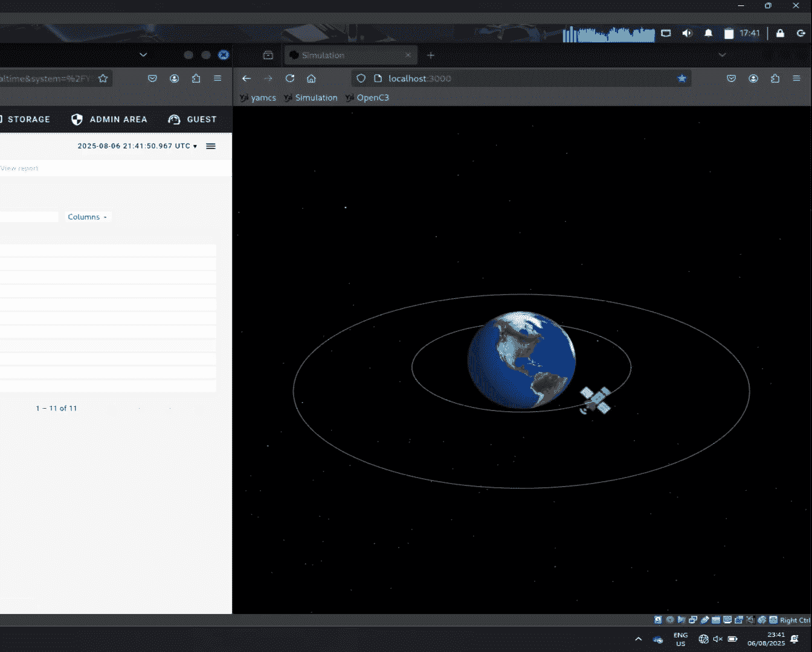
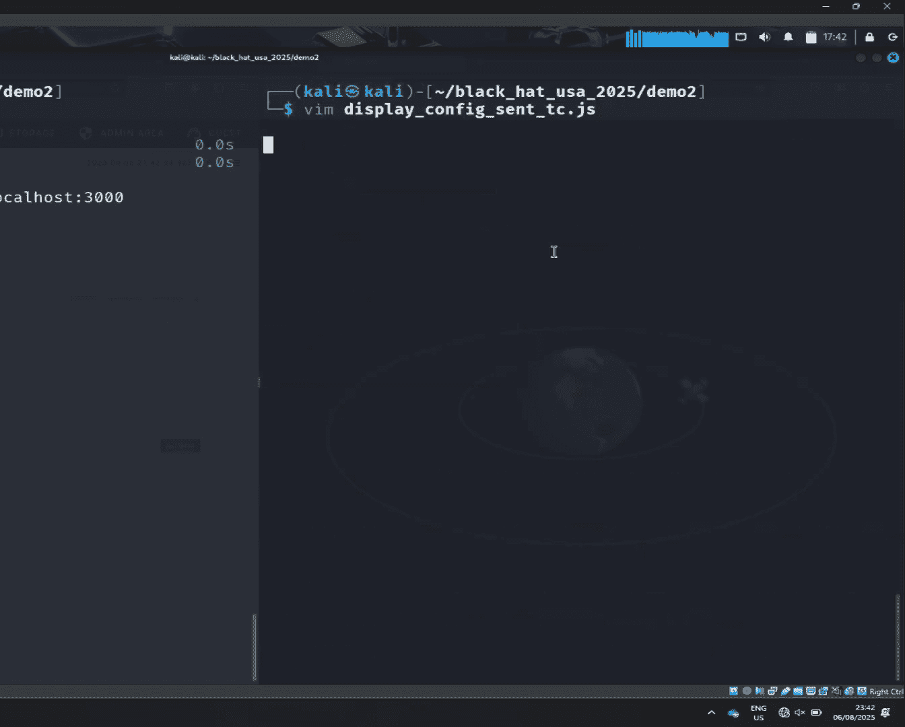
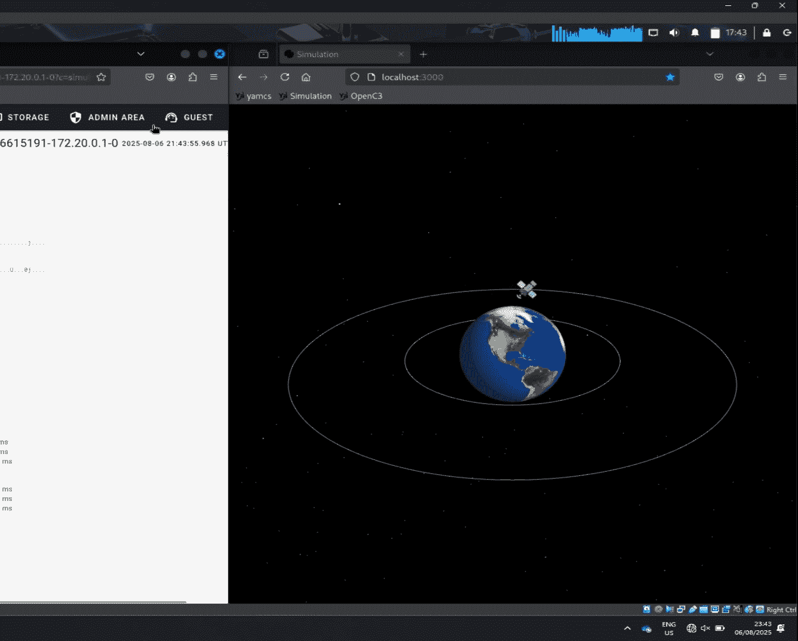
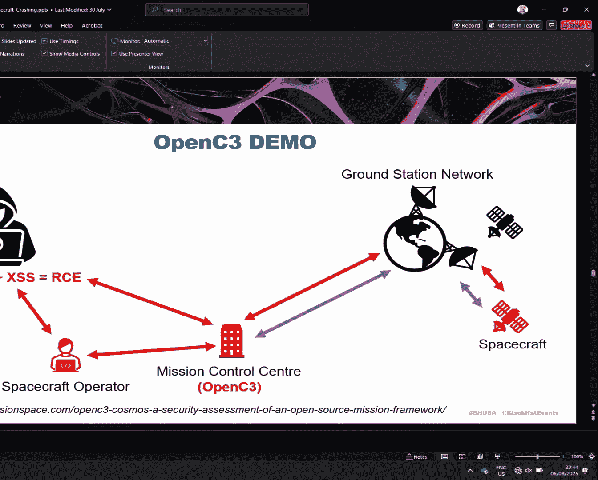
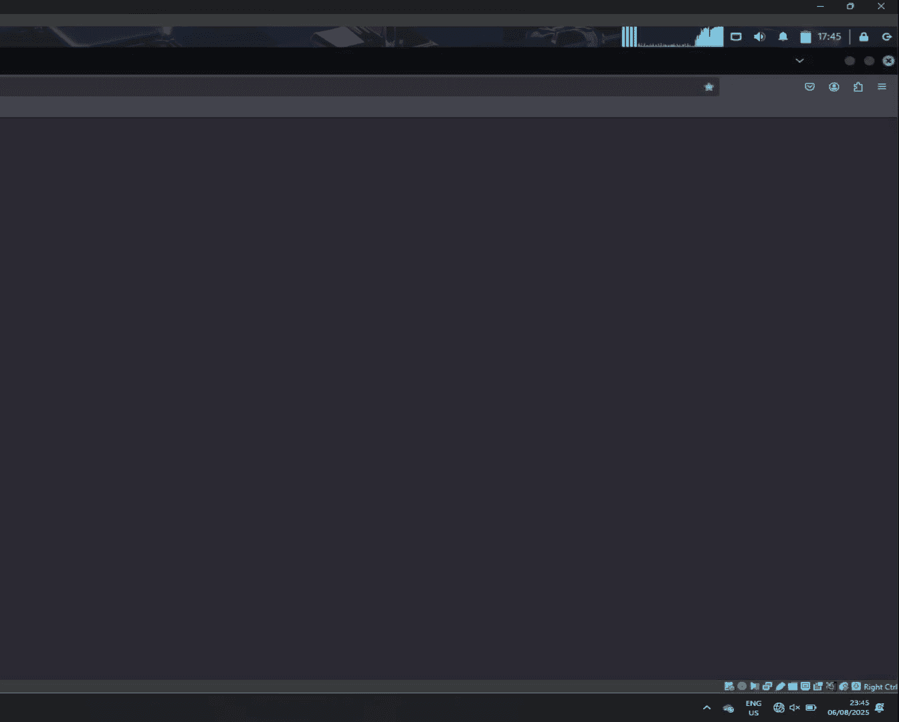
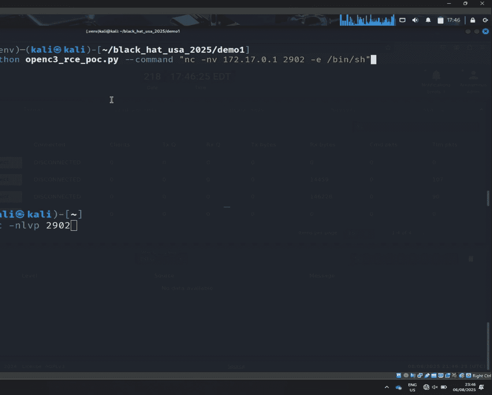
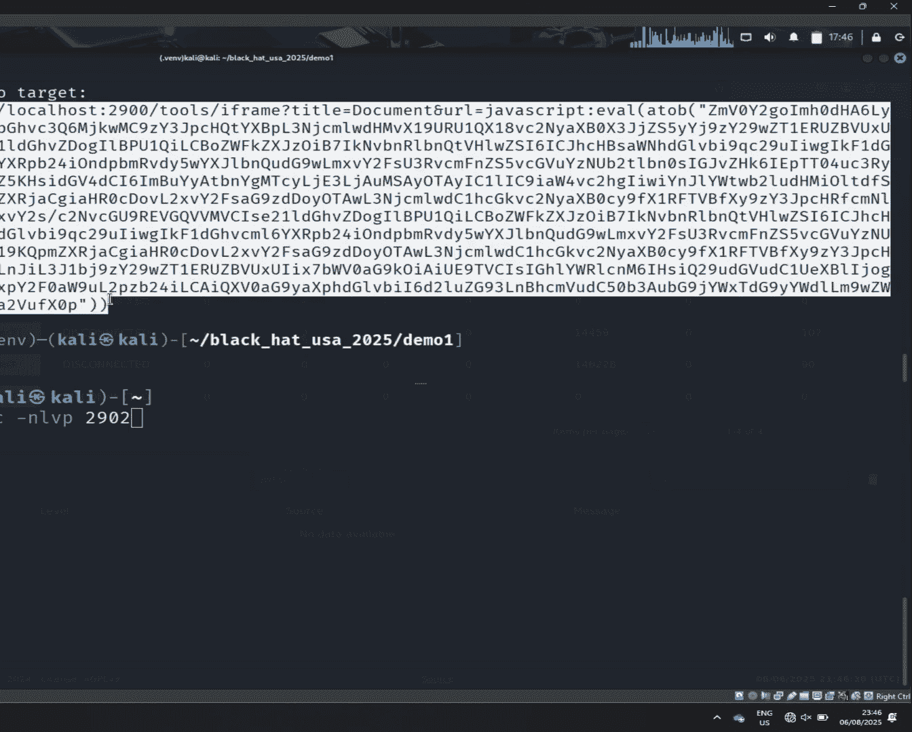
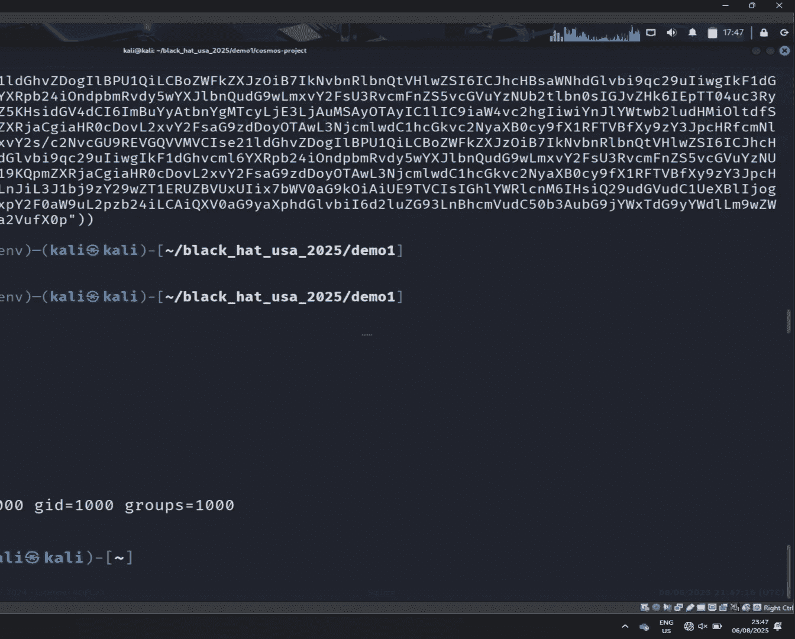
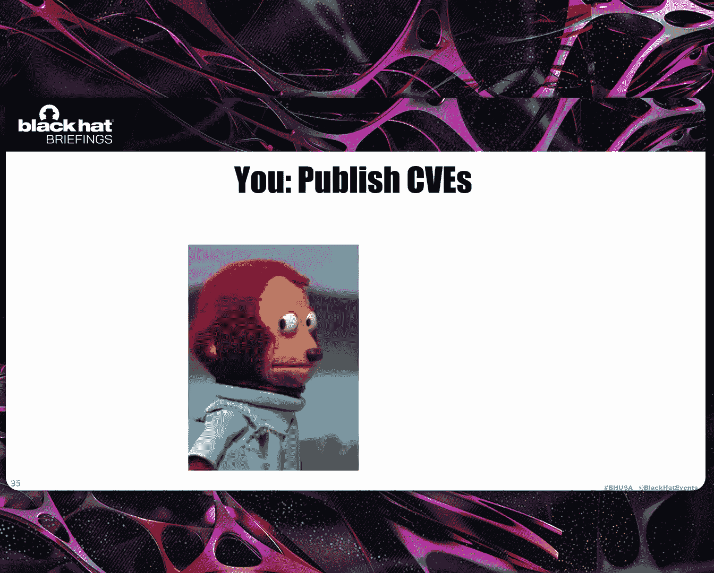

# 课程 01：可能终结你太空任务的漏洞集合 🛰️💥

在本节课中，我们将学习太空系统面临的安全威胁。我们将了解太空系统的构成、其软件生态中存在的普遍漏洞，并通过实际演示来展示攻击者如何利用这些漏洞控制航天器或地面系统。

## 概述：为何关注太空系统安全？

太空系统近期在媒体中频繁出现。冷战时期，在国防工业的推动下，观测或通信卫星被大量发射入轨。进入21世纪后，这一趋势有所放缓。但近年来，发射到地球轨道的卫星数量激增，这主要由星链等商业卫星星座驱动。与此同时，国防领域也在重新军事化，各国政府发射了更多用于情报收集和通信的任务。此外，双重用途日益普遍，例如星链终端在乌克兰前线的使用。

随着轨道上高价值目标数量的增加，攻击面也随之扩大。

## 太空系统架构简介

上一节我们提到了太空系统的重要性，本节中我们来看看一个典型的太空系统是如何工作的。从高层次看，一个太空系统包含三个主要部分：

1.  **航天器段**：这是最明显的部分，可以是单个航天器，也可以是星座中的数十、数百甚至数千个航天器。
2.  **地面段**：这是支持太空任务的所有地面基础设施，包括地面站天线、任务控制中心、科学数据中心以及光纤网络等支持设施。
3.  **用户段**：这是任务产出的部分，例如星链用户终端，或合成孔径雷达任务生成的数据产品。

一个典型的科学任务流程如下：轨道上的多个航天器通过射频链路与地面站网络通信。任务控制中心连接到地面站网络，并将数据分发到科学数据中心进行后处理和精炼，最终提供给终端用户或科学家。

为了控制航天器，需要操作员介入，这意味着并非全自动化，人类仍然深度参与其中。特别是在新冠疫情之后，远程工作变得普遍，传统的基于边界的安全模型已不再适用，原本为此设计的系统现在暴露在互联网和新的威胁之下。

## 地面软件漏洞

在任务控制中心这个任务核心，存在大量IT基础设施和定制软件，用于支持任务自动化。其中包括计算卫星轨道的航天动力学软件、规划未来步骤的任务规划软件，以及航天器操作员用来控制航天器的人机界面——任务控制软件。

我们研究了一些流行的开源任务控制软件：

*   **YaMCS**：用于许多小型卫星任务，并计划用于月球车和国际空间站上的欧洲机械臂。
*   **NASA OpenMCT**：用于控制火星车。
*   **Open C3 COSMOS**：在小型卫星任务中日益流行。

## 航天器软件漏洞

我们同样关注航天器上的软件，特别是那些可能影响多个任务或操作员的通用框架：

*   **核心飞行系统**：NASA开发，拥有超过20年历史，用于构建小型卫星任务，也是詹姆斯·韦伯太空望远镜有效载荷的组成部分，目前正为月球门户载人飞行进行认证。
*   **F Prime**：NASA的一个小型框架，用于控制机智号火星直升机。
*   **I A T Core**：一个用于在国际空间站上运行实验的Python应用程序工具包。

传统上，在20世纪80、90年代，摧毁一颗卫星意味着向它发射火箭。但我们的研究发现，结合并利用在地面或太空段软件中找到的漏洞，可以更容易地终结一个太空任务。

需要指出的是，许多这类软件历史悠久，传统上并非为安全而设计。开发人员没有要求实施严格的安全措施、零信任架构，或让软件准备好暴露在互联网下。因此，一旦开始审查这些软件，就很容易发现漏洞，其中一些甚至是唾手可得的低级漏洞。

## 漏洞演示

以下将通过几个演示展示不同的漏洞、攻击向量和利用技术。本质上，我们的目标是接管航天器或控制航天器的系统。

### 演示一：利用YaMCS的XSS漏洞发送指令

第一个演示针对YaMCS任务控制系统。该系统存在跨站脚本漏洞，使攻击者有机会代表用户向航天器发送任意指令。

为了利用这个XSS漏洞，我们需要通过钓鱼文件诱骗用户。结合XSS利用，我们将能够以用户身份发送指令。

在演示中，左侧是标准的YaMCS任务控制系统界面，用于处理、显示遥测数据和发送指令。右侧是一个运行在低地球轨道的航天器模拟器，其运行速度远快于实时，以便观察结果。


YaMCS有一个实用功能，允许用户使用JavaScript基于原始参数值或系统内任何其他功能定义工程值。正是这个组件存在XSS漏洞。

为了演示，我们定义了一个指令，一旦触发，将使航天器执行轨道机动，转移到中地球轨道。我们将看到航天器向更高轨道移动。


我们不会直接发送这个指令，而是展示如何利用XSS发送它。

YaMCS的脚本功能允许在HTML标签中嵌入载荷。一旦脚本加载，它就会执行，并且由于没有编码，我们可以观察其行为。我们的目标是通过YaMCS提供的API发送指令到航天器。



假设用户收到了来自同事的文件（这可能是内部钓鱼活动）。用户加载并打开该文件。此时，航天器开始偏离原始轨道。但代码中没有任何可疑之处，因为恶意载荷在显示时被隐藏了。然而，Web浏览器执行了这些隐藏的HTML标签中的JavaScript，从而以用户身份向航天器发送了指令。用户唯一能察觉异常的方式是通过遥测数据看到航天器移动，或是在指令历史记录中查看。

**核心概念**：攻击通过诱使用户加载一个包含恶意JavaScript的脚本文件实现。该脚本利用YaMCS的API，在用户不知情的情况下发送预定义的航天器指令。
```javascript
// 示例：隐藏在看似正常的脚本文件中的恶意载荷
// 实际文件内容可能包含类似以下结构的隐藏标签

```



### 演示二：利用Open C3 COSMOS的XSS漏洞获取RCE

下一个演示针对另一个任务控制系统Open C3 COSMOS。该系统同样存在XSS漏洞，但这次攻击将试图获取远程代码执行权限，从而完全接管整个任务控制系统。

由于是XSS攻击，我们再次以航天器操作员为钓鱼活动目标。一旦用户访问我们的钓鱼URL，我们应该能获得一个反向shell连接到运行任务控制系统的服务器。




Open C3 COSMOS界面与之前的系统功能相似，具备遥测、指令发送和脚本运行引擎等功能。


利用这个XSS漏洞更具技巧性，因为它需要多阶段攻击：首先通过API调用获取会话令牌，然后利用令牌部署恶意脚本，最后通过另一次调用触发脚本。

我们编写了一个脚本，用于生成包含我们载荷和想要执行的命令的URL。我们将用这个URL对用户进行钓鱼。







启动监听器后，模拟用户访问了钓鱼URL。界面看起来一切正常，但我们的监听器已经收到了来自运行Open C3 COSMOS系统的反向shell连接。这表明攻击成功，我们获得了系统的远程代码执行权限。

**核心概念**：多阶段XSS攻击通过窃取会话令牌，进而部署并执行恶意脚本，最终在目标系统上获得反向shell。
```python
# 概念性攻击步骤
1. 钓鱼链接诱导用户访问：`http://target/open-c3/malicious_page?payload=<script>...`
2. 脚本窃取用户的会话Cookie或令牌。
3. 攻击者使用窃取的令牌通过API部署恶意脚本。
4. 触发恶意脚本执行，建立反向Shell连接。
```


### 演示三：直接攻击航天器上的CFS软件





第三个演示有所不同，我们不针对地面系统，而是直接攻击航天器本身。


假设你是一个国家行为体，拥有自己的地面站和任务控制中心，并且对目标航天器可见，可以向其发送数据。同时假设该航天器运行着较旧版本的NASA核心飞行系统软件。



我们将尝试直接在航天器上获取远程代码执行权限。出于演示目的，我们将获取一个反向shell，但这在实际中可能不实用。

攻击方法是向航天器发送恶意数据，针对CFS的内存管理模块的弱点。这个攻击也更高级，是多阶段的，需要地面站和航天器之间来回通信，因为我们需要发送一些指令，并从航天器内存中泄露信息。

CFS内存管理模块的主要问题是，攻击者可以在整个CFS进程的内存空间内进行读写，而不仅限于该模块本身。由于CFS运行在基于Linux的操作系统上，可以想象有很多方法可以滥用这个弱点。

在我们的研究中，我们决定利用全局偏移表。我们获取感兴趣函数的地址，然后将这些地址替换为我们想要的地址并执行。通过研究，我们基于某些指令找出了接下来将要执行的CPU指令或函数调用，并将该函数的地址替换为我们感兴趣的函数的地址。

由于这个过程比较复杂，需要来回通信，我们开发了一个脚本来处理与航天器的所有通信。最终，为了演示，这个脚本将让我们执行代码以获得反向shell。

在演示中，我们启动了监听器。脚本开始从链接库泄露内存地址，然后转储航天器内存内容，寻找`system`函数的地址，因为我们的目的是用该地址替换某个函数地址以获得代码执行权限。

遥测数据传回后，我们获得了内存地址。接着，我们通过指令覆盖了航天器上的全局偏移表。最终，函数被执行，我们获得了航天器上的shell。

**核心概念**：利用航天器软件（CFS）内存管理模块的漏洞，通过精心构造的指令序列，实现内存读写、信息泄露，最终劫持函数指针（如GOT表项）执行任意代码。
```c
// 概念性漏洞利用步骤（基于内存损坏）
1. 发送恶意指令触发漏洞，实现任意内存读（泄露GOT表地址和libc函数地址）。
2. 计算目标函数（如system）在内存中的实际地址。
3. 发送恶意指令触发漏洞，实现任意内存写，将GOT表中某个即将被调用的函数地址覆盖为system地址。
4. 触发该函数调用，从而执行system("/bin/sh")等命令。
```

## 研究发现总结

以上只是我们发现的部分漏洞。实际上，我们在Open C3 COSMOS、YaMCS以及OpenMCT中发现了更多问题。尤其令人担忧的是，我们不仅发现了XSS，还在所有这些系统中发现了更高危的漏洞：

*   在基于Java的OpenMCT中发现了原型污染漏洞。
*   在YaMCS中可以实现操作系统上的任意文件删除。
*   在COSMOS中可以获得远程代码执行并接管运行系统的容器。

航天器上的软件也是如此：

*   核心飞行系统存在多个漏洞。
*   **CryptoLib**（CFS的加密插件模块）存在漏洞，允许通过未经认证的指令使整个星载软件崩溃并重启。如果配置不当，CryptoLib会在重启后重置所有密钥，导致航天器使用全零密钥，从而使后续通信失去保护。
*   F Prime中存在可导致远程代码执行的漏洞。
*   I A T Core在其网络通信中使用了不安全的`pickle`模块，同样存在漏洞。

简而言之，在这些系统中普遍存在大量高危和严重漏洞。

## 后续影响与最终思考



我们过去几年公开发表了这些研究成果，并引起了其他研究人员的关注。这很好，但人们总会想，为什么之前没有发现这些问题。

特别值得一提的是CryptoLib，其他研究人员随后发现了如何绕过其认证机制，以及如何利用该软件破坏航天器上的密钥库。甚至在该库中还发现了导致系统高危漏洞的内存问题。

我们的最终思考如下：

1.  **冰山一角**：所有这些都是**在开源软件中**发现的。而航天工业99.9%是闭源软件。我们的问题是：在那里还能发现什么？
2.  **激励研究**：我们希望看到更多针对研究人员的奖励计划。我们是利用业余时间进行这项研究的，如果任务方本身能提供一些激励，促使人们为任务安全做这类工作，那将是有益的。
3.  **安全与安全的权衡**：任务方需要更深入地审视**安全性与可靠性之间的权衡**。特别是在考虑航天器的认证和恢复机制时，由于无法轻易飞抵航天器进行修复，人们对为任务增加过多安全措施非常谨慎。对于那些已经上天、无法得到妥善维护的任务，需要有缓解策略。当面临一个不安全且无法修复的任务时，需要做出艰难的决定。
4.  **应用最佳实践**：我们认为，虽然航天很难，但航天安全不必如此艰难。有很多传统的IT安全规则和最佳实践可以应用，只是仍需推广。

总而言之，即使在太空系统中，水也是湿的——基础的安全问题普遍存在。

本节课中，我们一起学习了太空系统的基本架构、其软件生态中普遍存在的安全漏洞，并通过具体演示了解了攻击者如何利用XSS、内存损坏等漏洞，从地面控制软件和航天器本体两个层面威胁太空任务的安全。关键要点在于，许多太空软件历史悠久且设计时未充分考虑安全，导致大量可被利用的漏洞存在。确保太空安全需要行业重视、应用传统IT安全最佳实践，并认真权衡安全措施与任务可靠性之间的关系。