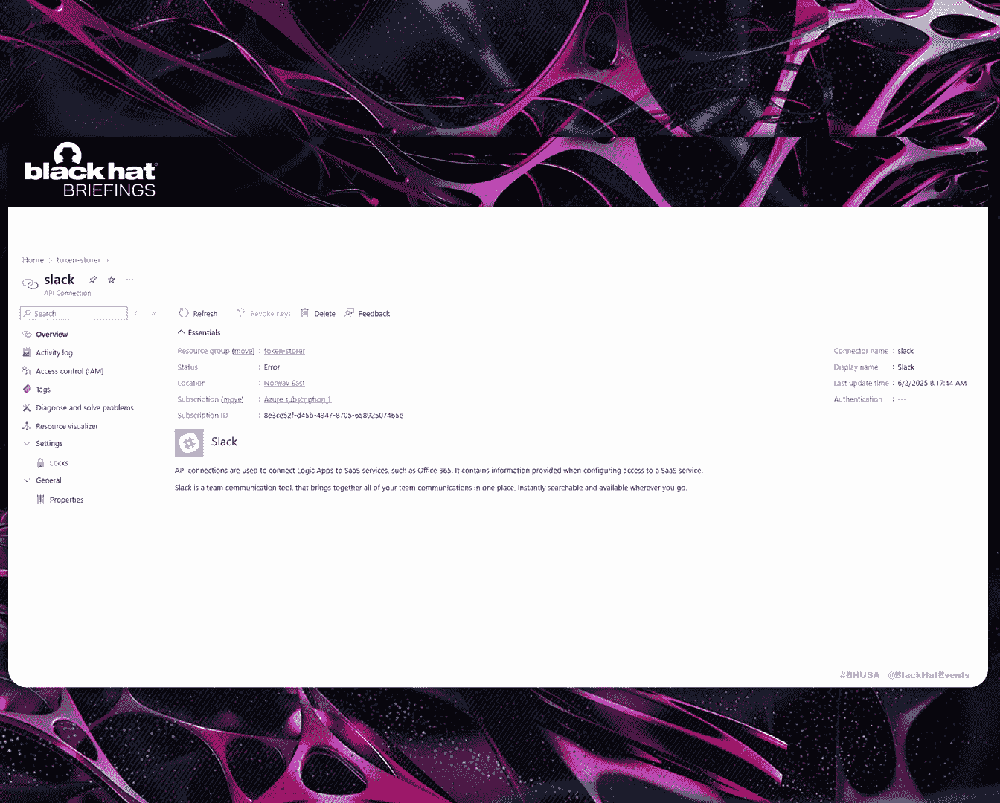
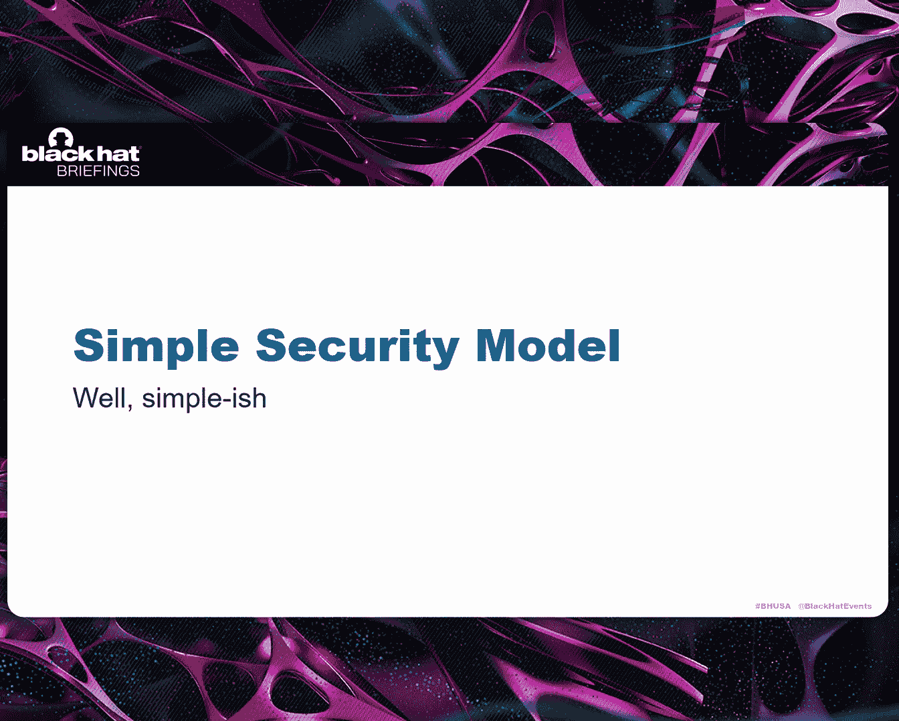
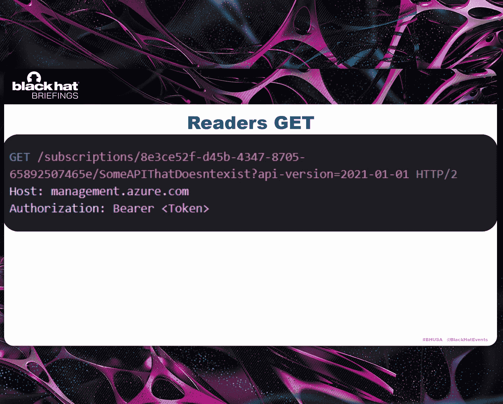
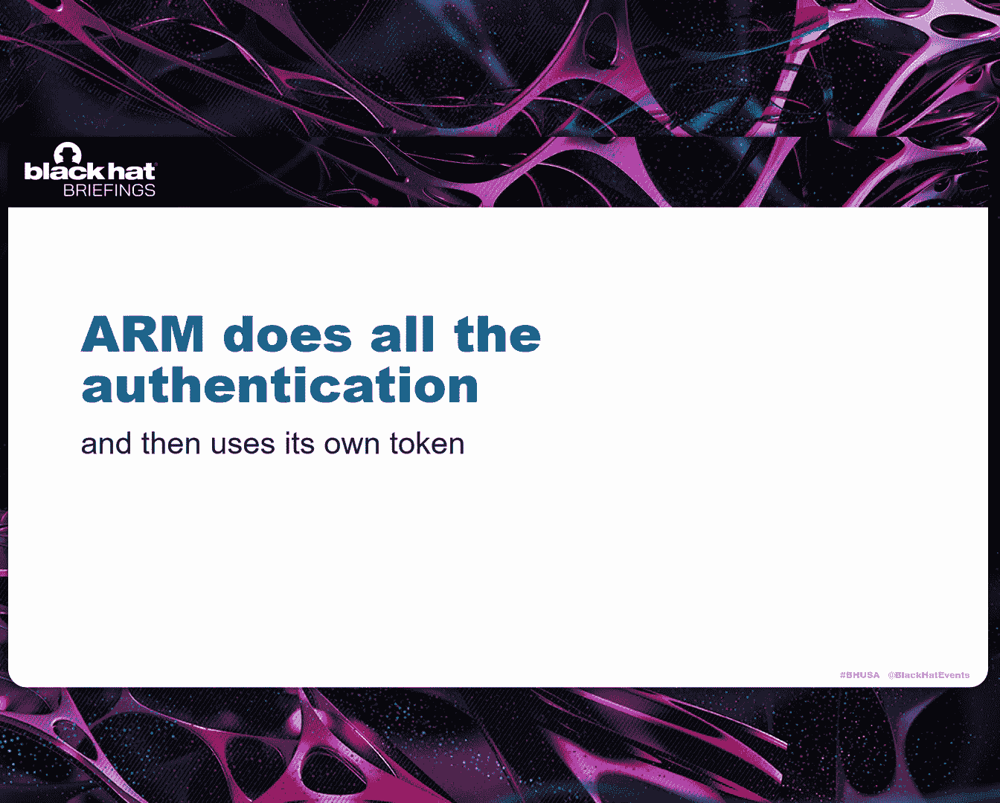
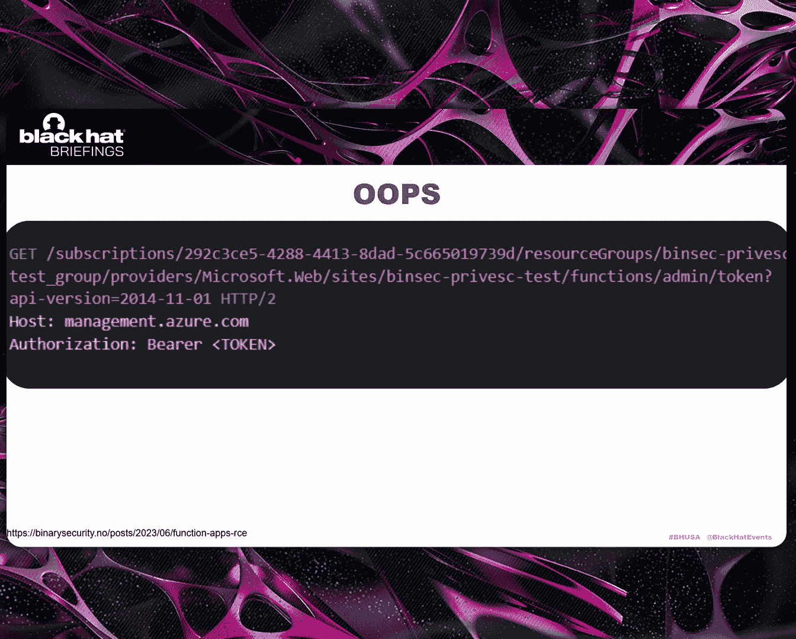
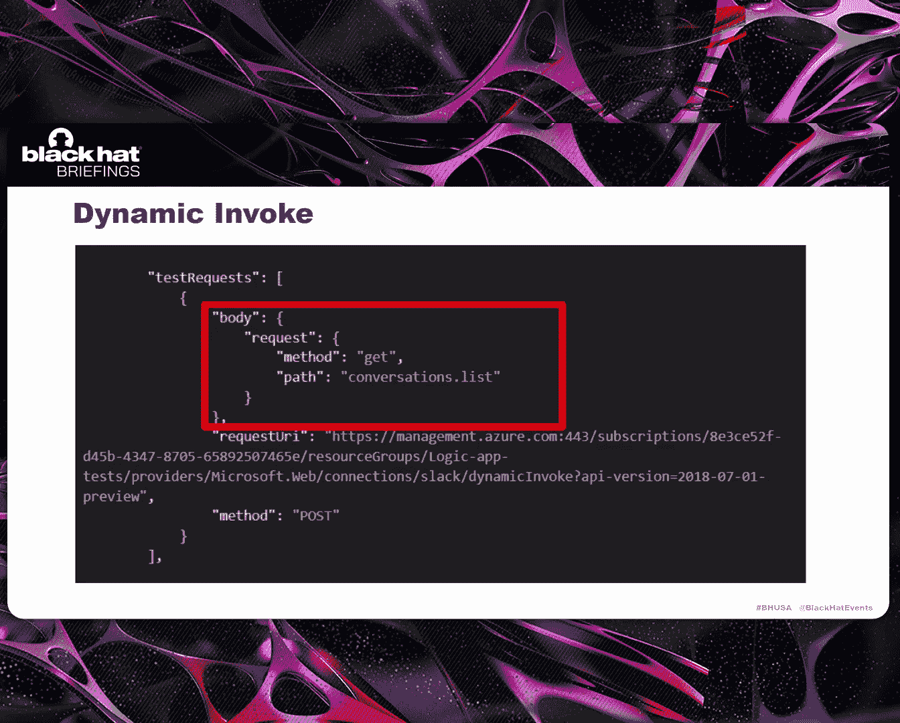
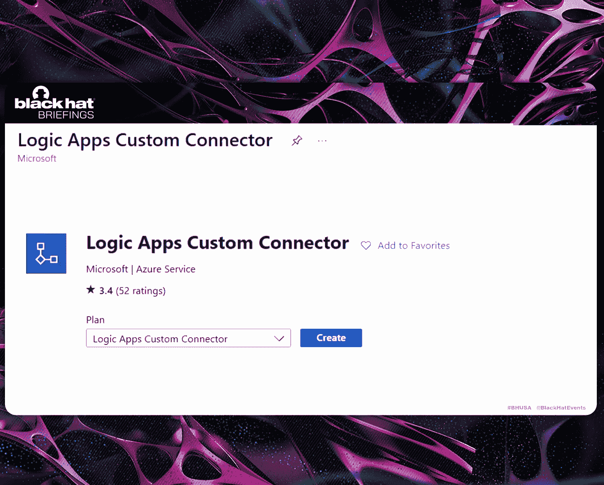
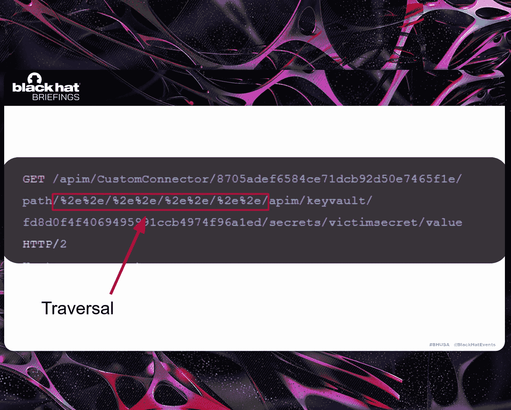
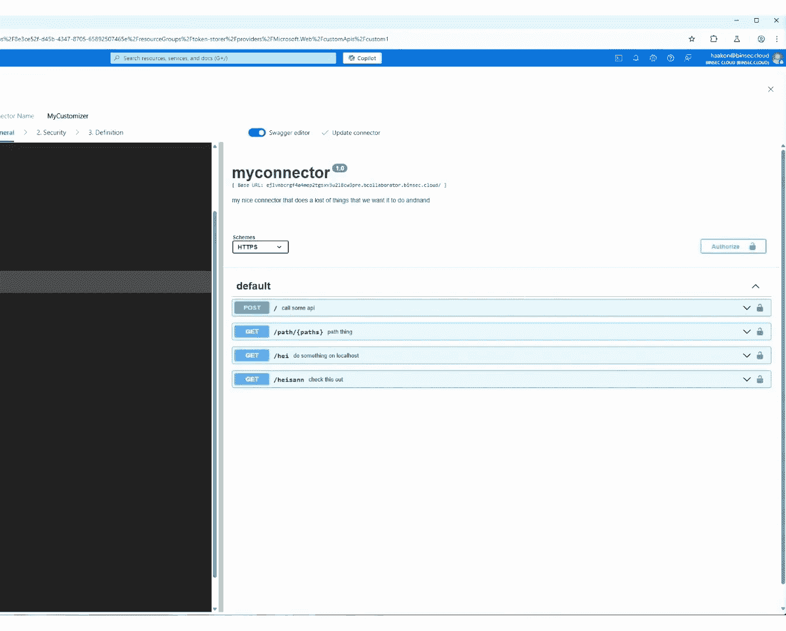
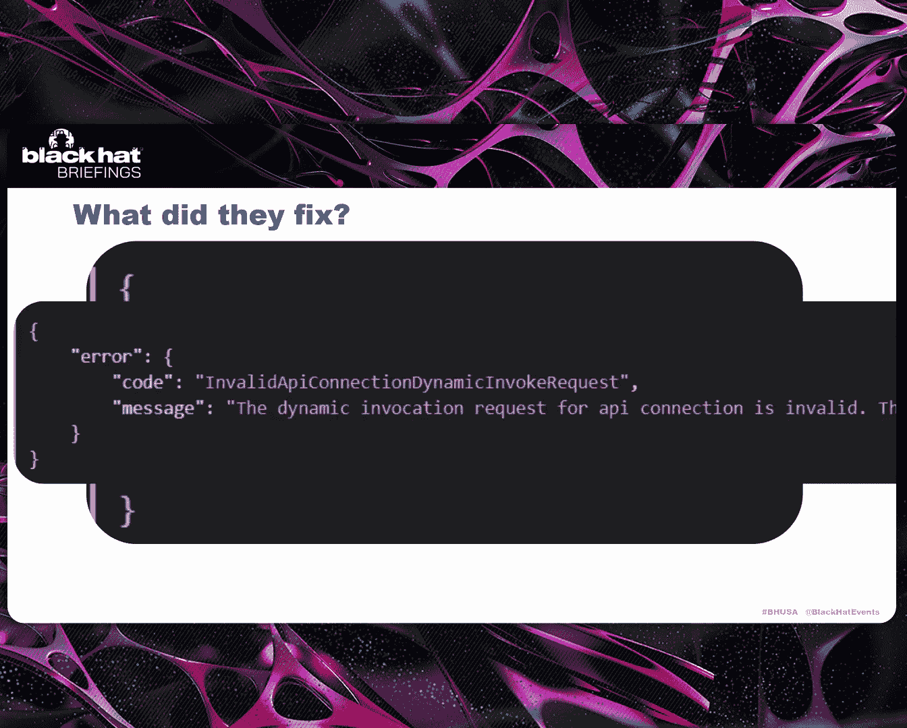

# Azure's Weakest Link？ How API Connections Spill Secrets [rpAZz0uY2ac]

Hi， everyone and welcome to my talk， Azure's weakest Li， yeah。😊，So。Thiss me。 I'm Hocomb。

 I'm a security consultant and researcher working at a binary security consulting firm based in Norway。

 where we do almost exclusively white box application pen testing。

 So what that means is basically that we test customers applications with full access to their source code with full like user privileges and administrative privileges and access to their infrastructure and configurations。

To get like the most in depth penest thing that we can do。

And what happens is that if it's like a well secured application we're testing。

 we have some time to look at the actual infrastructure that supports it。And also。

 we spend our like 20% research time on like， finding bugs in these kinds of infrastructures。

And in Norway， that is mostly Azure。So this is like the。

 the story of one time I found a bug there or several bugs there。

So like the initial vulnerability discovery came from when I was looking at an Azure logic app because we were doing a customer engagement and。

It's a bit sad， but like， it was quite well secured。 So we had to go looking elsewhere。

 and we had access to their Azure portal。 And they had some logic apps。

 And what we usually do when we kind of look for bug and logic apps is that。😔。

We try to find unmasked secrets because that's kind of it in that。

 like aller app is basically a web app a response to some kind of input。 So in this case。

 like when an H T TP request is received， it's gonna perform some actions。

 And what developers usually do is that they forget the master secrets and then。

You can just read them out here as like a low privileged user and escalatorator privileges， right。

But no such luck in this case， which got me like。Wondering， what else can I do here， And I。

 I kind of considered these weird symbols。 What， what do they mean。And as it turns out。

 what what this means is that there is an API connection there And an API connection is something that you might not have heard about。

 even if you do work in Azure。But you can be surprised by how many。

ApiI connections you actually have in your tenant because these are automatically created whenever you create an action that requires them。

 and they're not necessarily deleted if you delete the action or the logic app。 So after a while。

 they kind of pile up。And you've taken no steps to like， explicitly create them。

And if you click on one of them， you， you kind of see this， which is not very interesting。

 This is a slack connector。 So we kinda assume that it does something to slackck。

 But what is interesting is the actual response we get when we click on this。

 like as an H T TP request。 we get a response that includes this。

And this is very interesting for us。 And first of all。

 we're gonna check out the first red square there called test links。

 which is basically a U R I that looks like this。😊。

And bearing in mind that we are a low privileged user in this tenant。

So this is a request to Azure resource management。 And that is the thing that manages resources in Azure。

 So this is the service that you kind of call whatever you want to do anything to anything in Azure。

 So if you want to create like a Web app or if you want to get some information about your API management or if you want to change something。

 this is the service you you're talking to。 And the Us are always built in the same way。

 you have like the subscription you're talking about。 you have your resource group。

 then you have like the type of API you're talking to。 So in this case。

 it's Microsoft Web slash connection type。 Then the resource itself， like the name of it。

 And then the actual action that you want to perform。

And there are several interesting things about this action。 It's called extension slash proxy。

 which we kind of think， oh， that's pretty cool。 Like we're proxying two slackck in some way。😊。

And it ends with conversations list。 And if you have worked on Slack at all。

 you wouldn't know that that is， in fact， an endpoint in the Slack API to list channels。

And the most interesting thing about this is that it's undocumented。And like， in my experience。

 whenever theres an undocumented API in Azure， it is filled with bugs。But if you call this。

 like as a reader， you get back a list of channels。

And that is exactly what you would expect if you were calling the API directly。

 which kind of makes sense。But who is doing this call， right。Because is it me。

 I have a slackla user in this tenant， and it's like S S O and blah， blah， blah。

 So is it just me doing this kind of thing。 Well， it turns out it's not。

 which we see if we try another endpoint called do not disturb sets news。

 basically setting the do not disturb status for five minutes。And it responds with snooze enabled。

 But I checked the slack， like the customers slack， where I'm in。 I'm not snooed。So who is？

 That's kind of the question。And I tried to figure it out by like doing a conversation to join to like join the channel and see who。

 who joined it。 But we got。

Ex is denied。 That is actually not a surprise。 And we will see why that is not a surprise as later。

But as like a temporary conclusion， we can say that any get request action on an API connection can be called by readers。

And then there is the obvious question where readers being low privileged users。

 But like the big question is， what are the actions we can do and who is doing that action。

So we go to Microsoft documentation， and they have this extremely nice diagram。

 which is accurate and informative， which is not very common。

 And there's only like one big emission in it that we're going to use to exploit it。

 So assuming on like the left part here， we see we have some resource types that communicate with an Azure API management。

 Now， we don't care about power automates and power apps。

 we're only concerned with logic apps in this case。😊。

EAnd what this larger gap is gonna do is gonna have some input， a token， a connector I D。

 an operation I D， and a connection Id。To communicate with this Azure API management。

 which it says has a swagger。 And actually， if you know where to look。

 you can find the swagger and it's quite clearly defined and you get all the all the actions you can take。

 So you're restricted by this swagger， you don't have full access to the entire API because that would be crazy。

呃。And then what Azure API management is gonna do， it's going take your the user token that was input。

And the connection I。 And it's gonna query this magical credential and metadata store。😊。

And retrieve the connection token。And that kind of answers our question， because。

It is the connection token。 That is the privilege that is calling the endpoint。

And that is the token that was used when setting up the API connection in the first place。

 So that can be like O wealth parameters。 It can be an API key。

 It can be whatever kind of secret you want。 But that's what's gonna be used in like the later portion here。

 ignore this part， and assume that it's just gonna use that token to do a direct call to the backend service。

 So in our example slacklack。啊。And， but this is all a bit academic because if we try to。

 if we try to call this。 and I say， if we try to call this global API M host。Which is not global。

 but it's basically global because it's segmented by location。

 and you can create an API connection in any location you want。So you basically you have this URL。

 and then you have the connectionor type and then you have a connection I D。

 which is a kind of obscure hash here。 And then the actual action you wan to do。

But this doesn't matter because we are denied。 and specifically。

 we are denied because we are not in the connection A L。

 So the access control list for like our reader user。 and the it's the token store that denies us。

 And until very recently， you could just kind of visit the token store and see this nice page。

 But they have blocked it now。 So you， you will not no longer be able to see this。Well。

 doesn't really matter。 But by default， you have that。Only the logic app itself。

 like the logic app you used when creating the API connection。Is able to call the API am instance。

 And you can go in here and you can add your own kind of service principles and， and whatnot。

 that no one's gonna do that。 So it doesn't matter， but。Remember， we could call it。

 and we did call the API connection， and we got a response from Slack。 So how did this happen。

It is because there is another entry into the connection A C， L。And as a graphical view of that。

 it looks like this。And the Azure resource manager has access to it。

 And that explains how when we used like our request through Azure research management。

 we could call Slack。And to understand why they did this， like why they made this so。

 you have to know some things about Azure。And these are things that may not strictly speaking。

 be facts。But they are quite accurate， and。They work， so。There。

 and the first thing is that there' is a simple security model。And it's kind of been altered over。

 over time because people find bugs in it。 But， but in like essence。

 if you're talking to the APIs in Azure resource management。

 you have the security models that readers can do all get requests。

So I kind of prove this or show it by saying that as a reader in this subscription。

 I want to call this API that doesn't exist。 It's going tell me。

 I don't know what you're talking about。 But if I change this to a post request。

 it's gonna immediately say authorization fail。

Because it already knows that I don't have permissions to do a post request on that subscription。

 because I'm just a reader。It doesn't need to consider the rest of it。And then， like， another。

A proof is that it's very common in the documentation to have like sensitive endpoints being empty post requests。

 So if you want to list host keys on a Web apps， for instance， then you need to do a post request。

 but it has to be empty。And here's another example of it。So that's like the first thing。

 And then the second thing is that arm at the Azure Resource manager does all the authentication and all the authorization。

On every endpoint。 And then it's gonna query the backend using its stone token。

 which owns that resource。

And I， I don't have any explicit proof， but I just wanted to show how it works。

 So if you're communicating with the Azure resource manager using the portal or like directly with H T TP or through the C I。

 it's gonna do like a roll check here in the authentication part。

 and it's gonna check like for instance， if it's a get request。

 are you at least a reader here And if it's supposed to request， are you at least a contributor here。

 And if that kind of checks out it's gonna query the backend。

 So be that a Web app or a VM or something with full control。

 with a token that has administrator permissions on that thing。And like， the only way to show。

If this is true is to see where it goes wrong。 And here's an example of where it goes wrong。

 So you have get functions admin token， which looks like this。 It ends with functions admin token。

 And it's an API that's directly copied from K do the thing that runs Web apps where， of course。

 the authenticational authorization rules are that you have to be an administrator to get the functions admin token。

 But since the arm developers just straight up， copy that endpoint into there into their API and forgot to check anything else。

 you could call this as a reader and get the functions admin token， giving you R C on the Web app。

And I found this a couple of years ago， and I reported it。 And then Microsoft fixed it。

 And then they said， oh， we actually， we have already known about this for several months。

And a similar example here from a， a more recent blog post by token security。

 It's basically the same thing。 There's an API， and it's a get， and it's sensitive。

 So you could get the VPN shared access key。Right。But what does this mean for API connections then。

 Well， we know that we are querying the backend service using the token that was set up when creating the API connection。

And we know that we can do all get requests。So what we need to do is see， are there backend services。

 Does there exist the backend service in the world where a get request can be sensitive。

 especially question。 And， of course， the answer is yes。 And I have some examples here。

 this is an Azure S Q L database。 and to no surprise if you  query this。

 you have the ability to read。All values in the SQl database as a low privileged user。

And then I have like a fun example here。 If you try to add had to be redacted a bit because of customer data。

 But if you kind of do this weird try for a path traersal。

 you're gonna get a response with H T P 502 and then a stack trace in the status message。

 which is not like a common way of having errors showing up，But then another example here。

 Jra and injira case， right， your Jra instance can be anywhere on the Web。

 So it needs some way of knowing where it is。So instead of like setting that up when you're setting up the connection。

 which would be like a normal insane way of doing it。 you have to add this header to every request。

 So like and if you you do it， it's gonna send that request to that service and you receive the API key。

 So now you're not restricted to anything anymore。 and you have the API key to the Jra And that's probably gonna be like an administrator user because it's you set this up for a reason right。

And then the， the big one here is the key volts。And， of course。

 you can read all the secrets in the keyboard。So that's like pretty free。

 And for those that don't know， like Azure keyvas is the thing that safeguards。

 encryption keys and all your seekers and your S H keys， like whatever。

 That's where you store your most sensitive things。So， that's pretty bad。And then I reported this。 I。

 I reported the general case and the Gro case separately because the Ja case is kind of like just another bug。

 And after a week， they fixed the general case and immediately replied on the G case saying， oh。

 we can't reproduce this anymore。 and they just close that。 So that's the works。 but you have to be。

 you know， owner on it。And then they spent a couple more weeks and concluded that they had known about this bug for several months。

And what exactly did they fix here， right。Well， now。

 if you try to call this extension slash proxy and then an end point。

 it's gonna tell you that that's not allowed。 You can only do the explicitly defined test connection in URL。

 right。 So for slack， that's conversational list。So obviously they white list those paths。呃。So。

 but then that kind of begs the question like， there are many， many API connections。

 like these are a subset of the ones starting with a。

 And do they know that all readers can call the test connections。

 like who are defining these test connections。 And I'm not saying like that there are lots of them that have sensitive data that kind of comes out。

 But I think it's more than the developers may be intended。

 But could we do more like we didn't get bounty。 So can we do more here。

And remembering that all connections are hosted in the same place， this global APII M instance。

And if you go back and remember slide 9， which was really highlight so far， it looked like this。

And we were only considering the top square there。 But if we zoom into the middle one。

 you see another kind of endpoint， which is really interesting。 this dynamic invoke endpoint。😊。

Which is also undocumented。So that's kind of our next target。 Saly， it's a post request。

 So we know already that we have to be like an owner or a contributor to call it。

 which kind of leaves us with no way of doing a local privileged escalation in in a tenant because you。

 if you own it， then let's just assume that you are highly privileged in the tenant。😔。

And then there's a body here。 And you can see that it's like。

 it says it's a method get and then a path that is conversation with this。

 So we kind of assume that this is gonna return the same thing as the test link。

 because it's the same endpoint。

And just a surprise no one。 if you try this， obviously。

 just copy the whole thing and send off the the request and being owner or contributor of the API connection。

 Of course， you have the same response。 So， okay， that makes sense。But then we have to ask ourselves。

Are we still restricted to the just the test connection instance， Because if we are。

 then this doesn't matter and。what is great is that we are not。So we can call any endpoint again。

 Any action is defined， but we are now owners。 So it's not like high severity bugs we can find。

 like in the local case， because we already know own the resource。

Although this is probably a bug since like you can read all the secrets in in a keyboard just being contributor。

 which if you have like R back set， shouldn't be allowed， you need like a specific role to do that。

But interestingly， in this thing， we have path parameters and path parameters that are not in the U R I itself。

 in actually is's quite rare。 And the reason it's quite rare。

 it's because it's so catastrophic if it's exploited。So， let's see。

And like to illustrate what happens here。 I made this diagram。 and here I am。

 And I want to call an endpoint on like an API connection with some method and some some data。

 And the Azure resource manager is gonna do a roll check。 It's gonna conclude that， of course。

 you're allowed to do this because you own the API connection。

And then it's gonna do some kind of validation on that path and method， right。

 It needs to be in the swagger for you to be able to call it。 And if that， if that gets validated。

 it's gonna do a path drawing on like the the host， which is the API M instance。

 And then the connection I， which is baked into the API connection。

 and then your path that you want to call， which is， of course， it already knows is valid。😊。

And then it's going use that to call the Azure API management instance and。嗯。

That's probably a bad idea。Because what we can do is probably do some kind of path traversal here。

And to make this like， to make the easiest kind of example here， I created my own custom connector。

 basically saying that I don't wantna go searching through the swagger for one endpoint that I can exploit。

 I just make my own。 And it's gonna be hosted in the same place。 And what happens if you make it。

 Like you get this nice swagger view。

And what you're gonna do is define a path like this。 Excel slash path， and then a string parameter。

And the hope being that if you do a path like this where you have where this is like in the swagger already like this this weird path。

 you kind of try to path traverse back down to the root of the API in instance。

 and then up again to another victim API connection， which you shouldn't have access to。

And the hope is that when arms sees this request， they will accept it and then kind of make this type of call to the API M instance。

 where it's like first， my， my connection， like my custom connectionor， my connection I D。

 and then all the way down to the route again。

And then the victim's API connection and they secret in this case， right。

 because this is a keyboard connection。So let's see what happens if we try to do that。

So here I am in the victim's tenant。And the victim has a keyboard。 And there is， is a secret there。

 And， of course， it should be impossible for anyone to read it if they don't have very specific access to it。

And he has made an API connection to it。And here you can see that that's like the connection connection IDd。

 which is this hash value， which could be difficult to find， but it's possible。

And here I am in my attacker tenant。I have my， my custom connector。

 and it's gonna be the same as as we just showed。 It's gonna be like path and string parameter。

 And here I'm， I'm trying to search for the UPN to show that it's actually the attacker doing this。

 There it is。

And I'm calling my custom connection。And we're path travercing down to the road and up to the victims。

 And you see that it's the same like connection idea there。 And we can list the secret。

And after listing it， because we didn't certainly know what it was called。

 we can actually get the value of it。RightSo there we have it。So， that's。

Like a totally unauthentated cross tenant key secret leaking。

Basically。呃。Thanks， and Microsoft response。 So I， I submitted it， and they。

 they fixed it in about two days。Which is great。 It spent a couple of weeks。

 and then they concluded that I get $40，000s。😊，H。But you't。Which is fine。 is fine。

 And what did they fix。Well， if you try this now with like this path here。

 percent2 E being doed for those that don't also this path dotled slash。

 it's gonna tell you that path is invalid。

So basically， they blacklist that。 So if you。If you have another path reversal or if you have like a way of changing the connection runtime URL。

 this is still valid。 and you can get a 40000 buck for it。嗯。

And then I have some takeaways if you want them。 And the first thing I wna kind of stress is that hacking Azure or anything is not black magic。

 Yeah， I know it's a black box， technically。But if you kind of spend some time thinking about the security model and how they usually like make this architecture。

 it's quite easy when you come across an endpoint like dynamic in bulk or extension proxy to。

Be to make exploitation easy， right， You absolutely can know just by looking at an endpoint。

That this is a bug， right。So， yeah， so understanding is like key here。

 And then the second thing is that the fix is silent， right， There is no announcement。

 There is no C VE， and there is nothing coming out from Microsoft about this bug。

 It's not a particularly difficult bug to find， really。And now that it's fixed， that's fine， I guess。

 But you have no way of knowing if you were exploited by this or if you're like key if you ever were vulnerable to this。

 there's no announcement and there's no like coordinated effort to say， maybe you should change this。

 right， because people could have accessed your salesesforce instance or yourjira or taking all your keys。

 if you had this。啊 yeah。

And then I think I have， I have about three minutes for questions if anybody has any。

 so you can step up to the microphones， I think。Hi I just have a quick question。

 first of all thank you so much for presenting this talk how does the logs look like in the victimss account when you're trying to read the secret values so since you have mentioned that you will never come to know but does this information available in the logs or everything is happening from the Azure side so that information is not visible to you at all so I'm not really a loggi but what would happen in the logs is that it would say that in API connection the API connection you set up access your keys for instance。

😊，Which is an expected thing because your larger app is doing it also。

 right whenever your larger app runs， it's going to access that keyboard。

 potentially but in case of Cstandon， because you're trying to access Yeah。

 but you're doing it with the authentication of that logic app。 So that's what you're gonna to see。

It would look like your logic app is accessing it。Okay， thank you。Yep。

