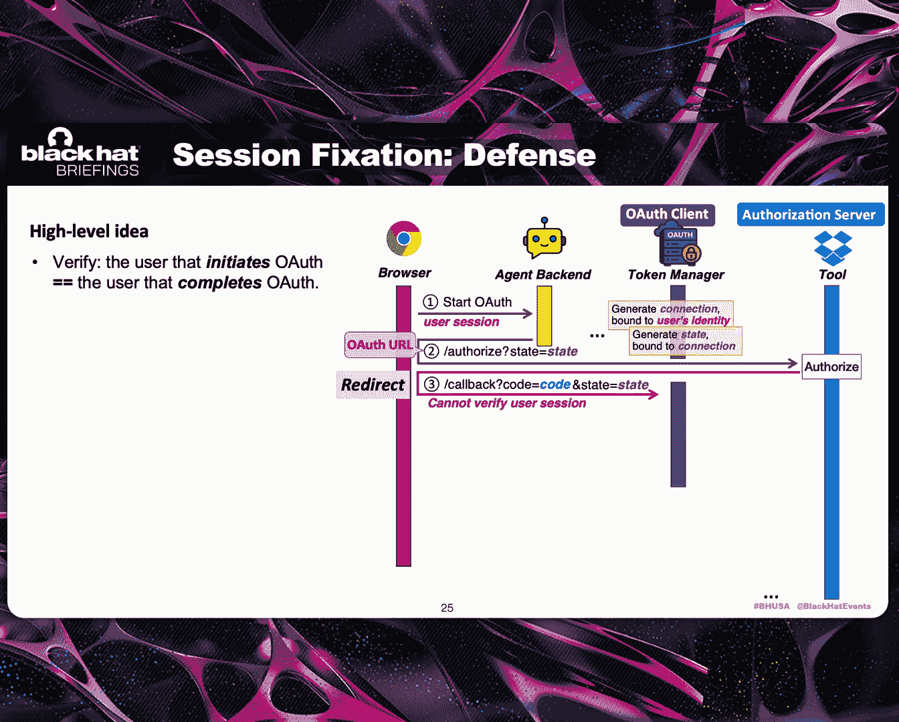
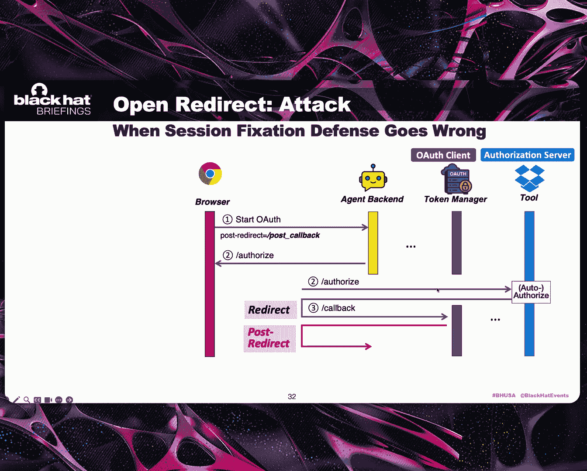
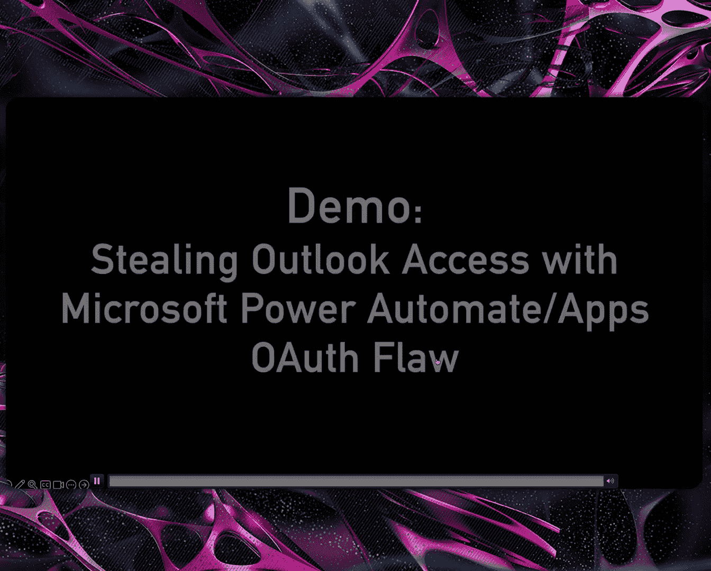
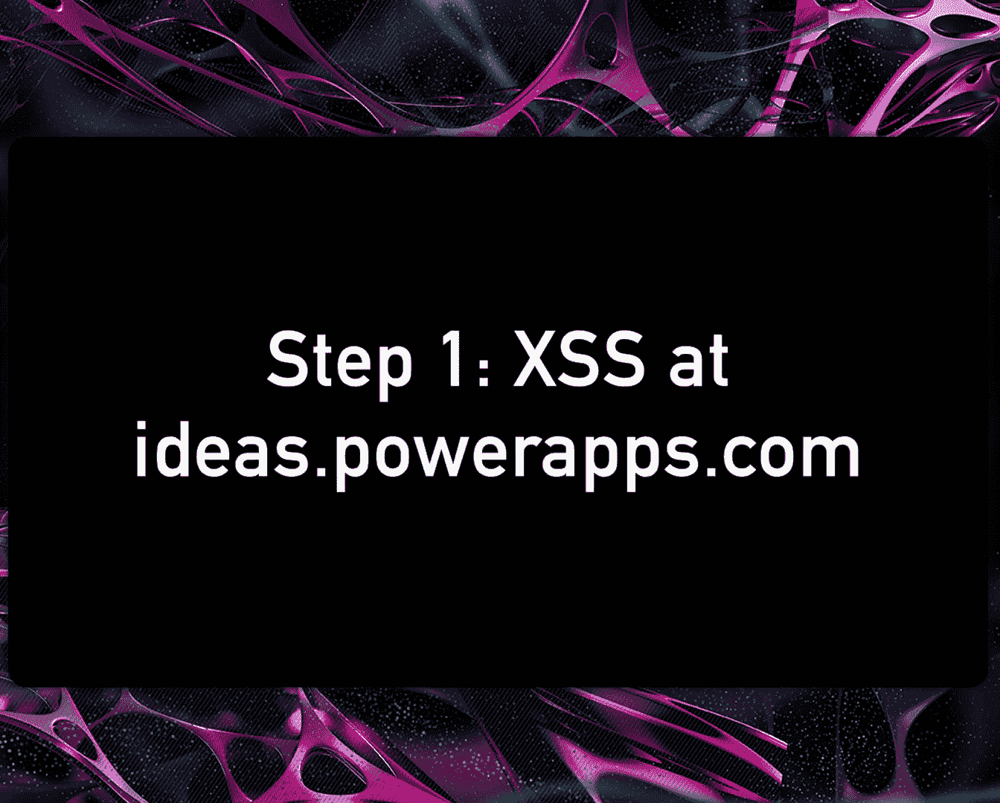
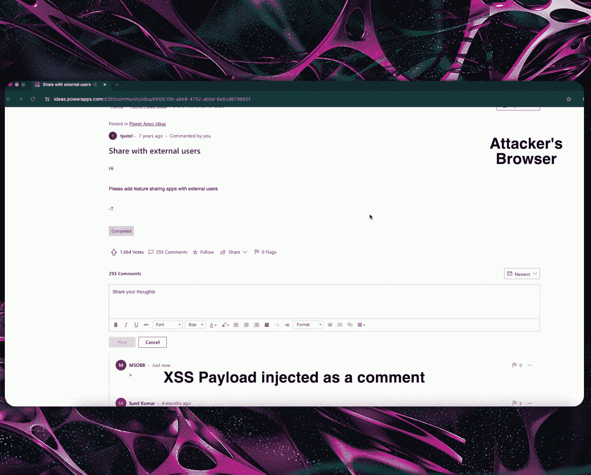
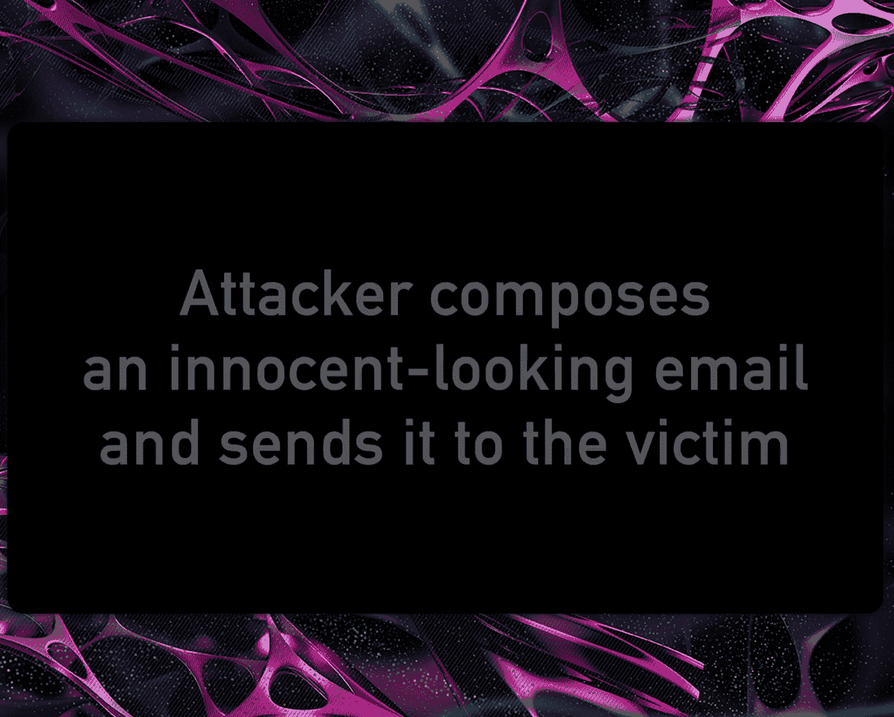
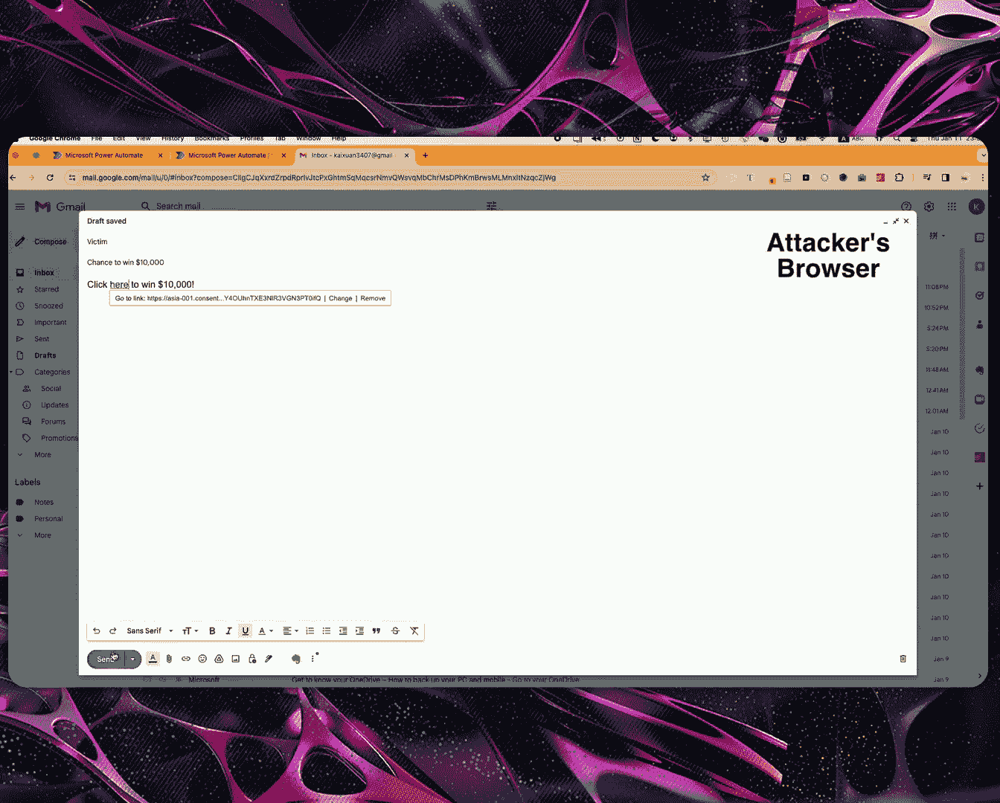
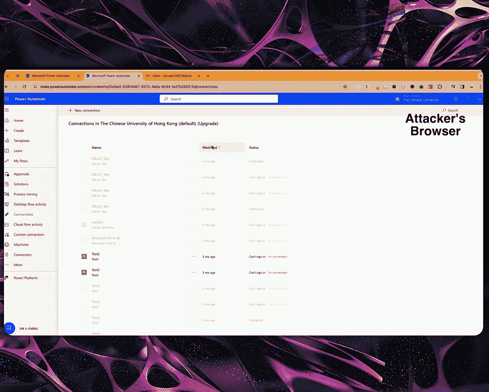
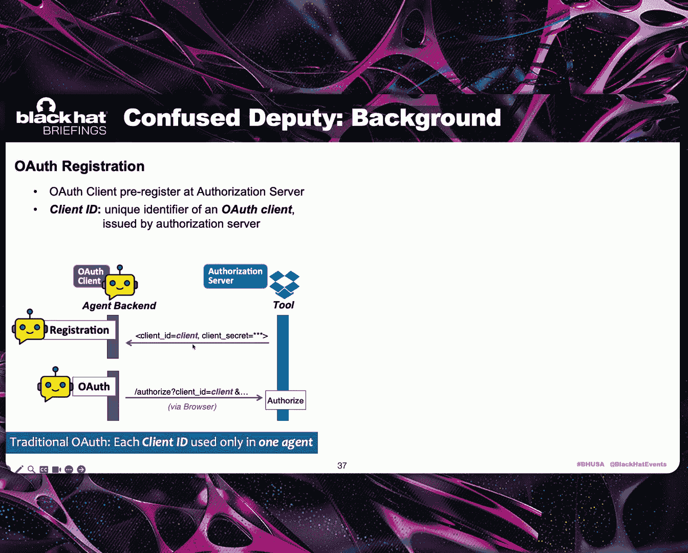
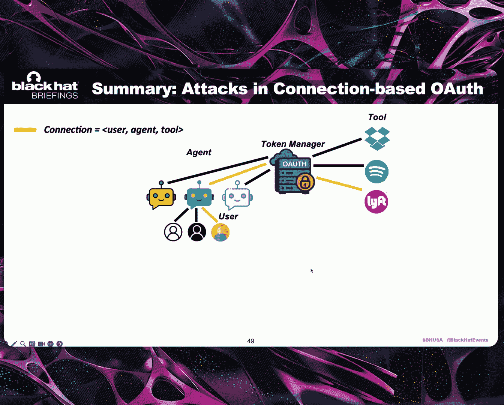

# Back to the Future： Hacking and Securing Connection-based OAuth Architectures [__NtTfL0oPw]

👏Okay， good。So good morning。 today， we will be talking about back to the future。

 hacking and securing connection based all of architectures in e AI and integration platforms。😊。

This is a joint work between our team from the Chinese University of Hong Kong and Samsung Research America。

My name is Wing Lao， and this is Kaishhi。 Okay， and here is the outline of our talk In the next 30 minutes or so。

 I will first provide some background about integration platform， agent AI ecosystems。😊。

And then explain the crux of the new security problem。

 namely the new security challenges in this emerging all off as a surface architecture。

 which are being adopted by a lot of agent AI platforms in the industry。

Then I will give a summary of our key findings。Before passing it over to Kain。

 who will cover all the technical details， as well as the case studies and empirical results。Okay。

 so even before the。The rise of。Eenttic AI， actually， a user can already。Use。

Integration platforms built by big name providers such as those shown here， Amazon， Addaa。

 Google Home or， Microsoft Power Automate or even Cha GBT， okay。

 to control external applications or AK A， the dus。😊。

In order to complete some tasks or doing orchestrating more sophisticated tasks。Okay。And now。

 as we enter the air of agent AI。We will expect instead of just a handful of big name integration platforms。

 there will be many， many more。F party。AI agents developed by third party developers。 Okay。

 that help the user to do to control and orchestrations。😊，And in fact， in the industry。

 we already see a lot of companies who are busy positioning themselves to build so called the AI agent platform。

 or agent AI platform to help third party developers to develop this many， many AI agents。😊。

So with that setting， now， a user can delegatedi to control and orchestration to both big name integration platforms。

 as well as third party AI agents。 Okay， to complete automate increasingly sophisticated tasks。😊。

But we need to make sure， only the authorized agents。

Or the integration platform cake can access those users tools on behalf and control them on behalf of the user。

 So we need delegation ofizationization。And in the industry。

O off is the standard for delegation authorization。 And as such。

 both integration platform as well as。Fed party agents need to deal with， relying on all of。 Okay。

 to do to use。Allation。However， we all know that O off is not trivial。 Okay， in particular。

 to apply all off to these new use cases to build a secure system。 Okay， it's not as easy as it suck。

And， in fact， last year here in Blackhead USA 20，2，4， we already share our findings。

 a lot of new all of related vulnerabilities when they got applied to integration platform。

 And in particular， we found three types of new attacks。😊。

F so called based on false account or mis account mislinking， Okay， which will result in one click。

 I can't take over。Or privacy leakage。Of the truth。And。Out of the 25 platforms that we study。

24 of them。Are found to be vulnerable to at least one of those new attacks。 Okay。

 and the affected domains， those platforms actually span across different application domains。

 including。Smart home。Internet affects Iot T。Virtual voice assistant。Workful automation。

 as well as L O M services supporting Pra E。 Okay， and many of those vulnerable platforms actually have more than 100 million active users。

 okay， so。😊，This actually demonstrate that it's not easy to get all of right。Okay。

 even the big names had problems。And we would expect。S。We see the proliferation of agent AI。

 mainlyly that we will see many， many more agents developed by third party developers。 Okay。

 the problem will get worse。😊，Because after all， the third party developers are not as resourceful or may not have the technical expertise。

😊，In all of， like those big name providers of the integration platform。 Okay， so in order to relieve。

The third party developers from this O of intricacies。

There is a paradigm shift towards So called the O off as a surface architecture， okay。

In the industry。And under this approach。We can offload the complexity of all of token management from those large number of third party agents to a secure token manager。

 Okay， run by the agent AI platform。😊，So in the industry， we already see an example， For example。

 for Microsoft， now， they offer at least two。Secure token manager under the name of Bo Fra token Sur or credential manager。

 which are used it to support。The agentic AI platforms。As well as the integration platforms。

 respectively。And elsewhere， we also have other companies and startups， which have similar。Os。

 which use all of as a surface， architecture to facilitate。F party developers to build。

Their agents easier。 Okay， are typical offerings， including。The software development kit。

A development portal。 and then a token manager run by the company。

 Usually the company will refer their offering， either as a AI to calling platform or AI agent two set or AI app development platform。

In it is very common that those offering will also include prebu。

Software modules to support popular tools。As we show here。And as well as some of the all。

 some of those platforms also have their own first party agent applications under the platform。

And this。All of as a surface， architecture is also relevant for MCP。

 the popular model model context protocol。Okay， and after all。MCP was originally proposed by entroic。

To support。To use in large language model， L O N， Okay， and in the original MCCP architecture。

The MCCP Kaya。Which hosted by some thing like a crowd core desktop， actually。

 will be responsible to store and manage all the two tool。Dealt with the all of complexity。

But now in the industry， there's already a new proposal in the MCP community， okay， which。

Pposedse to have to shift offload all those。To tokens management from the MCP client to a token manager implemented by a single MCP server。

Okay， so in that sense。This all of surface actually pop up everywhere。

So with that one sounds like all of a surface。 soundss good。

 We can centralize some of the complexity。 Give it to the more resourceful builder to implement it。

 So everything sounds okay， but actually， it's not as good as it sounds。 Why。

 because the new all of as a surface architecture also bring its own security challenge。😊。

In particular， okay。Before this architecture。An integration platform。 All they need to do is to。

Take the role and implement。All of Ka， under the standard framework。Actually。

 the developer can mostly follow the O of standards。

 except those caves that we disclose in last year's black。 Okay。

 and then they can follow the standards， build。😊，Se system。To manage the O off。To分。However。

 under the new oil of a surface architecture。The functions of the O of Ka under the center framework got split between the two entities。

 namely。The third party。AI agent and also the secure token manager。

And the problem is that how this functions to be split actually is beyond the scope of the O of standards。

And as a result， different agent AI platforms need to roll their own proprietary designs。And。

 not surprisingly。We find that they have committed mistakes， actually new， critical。

 O of related vulnerabilities。And， in fact， what well be sharing with you or explaining is that about our new findings。

On this。啊。Problem， okay， and in particular， what we find is that。Several classical web attacks， okay。

Which were carefully addressed by all of standards。

 as now we man manifest under this all of as architecture， all of as a surface architecture。

 And in particular， these classical web attacks are things like section fixation， open， redirect。😊。

As well as different types of confused deput。 Okay， but they now， we've selecteded。

In the context of of。Under this new architecture。 and in our study。

Across the seven different platforms vendors of agent AI platforms。

 we found numerous instances of vulnerabilities under the context of cross user attack。

 cross agent attack and cross to attack。And all of them will lead to。A cant takeover of the victim。

Okay， so now I have providing the background。 So I will hand over the floor to Kaiun to go over the technical details。

 Thank you。😊，Hi， everyone。 I'm Kaian Lu， and we'll be covering the technical details。

 Let me start with some basic oil terminologies here。😊，So traditionally。

 if you build an agent that needs tokens from the tool drawbox。

 you need to set up an or client for managing tokens。

 and the tool Dbox would operate an authorization server that issues those tokens。So your agent。

 the OF client， will send the tokens back to Dbox resource server for API calls。

But in this new paradigm of Oath service， the OF roles remain。

 But because of the split of the OF client role between the agent and the token manager。

 the key problem here is， how can these two entities negotiate， How could they coordinate。

There are two potential solutions here。 So the first solution is that we just chain to all flows side by side。

So we repeat the off pattern between the token manager and the tools and let the agent and the token manager also talking off。

So the benefit of this approach is that the agent now only needs to establish O off with a token manager。

But the limitation is not obvious。The agent still needs to implement the OF client and manage the token securely。

People would call this pattern broker or off。The other solution is that people try to invent something new to something that's based on this O off connection concept。

 which is a proprietary add- on that's introduced by some of those O service providers。

The highlight level idea here is that instead of returning tokens。

 which are crucial secrets that the agency to keep a cure of。

 the token manager would simply return in the I D for each token， that's the connection I D。

So the key benefit of this architecture is that the Earth logic is fully ated away from the agent side。

 and the token manager would fully handle the token's whole life cycle for the agent。😊。

We call this architecture the connection based wealth architecture。

 and it will be the focus of our talk。Well， actually。

 all of the vendor examples we mentioned so far are adopting this second approach。More formally。

 a connection is defined as a preconfigured handle for a managed O of token。 So at the minimum。

 it will encompass the information of a three element temple， tool， agent and user。😊。

This is because these are the necessary information to fulfill the basic use case that an agent calling a tool like Dbox on behalf of any user。

So this three element tuple is tracked as metadata within a connection and governed by a connection I D like a database primary key。

And what's inside this connection is this managed all of token。

But before we dig deeper on how Oof actually works with this connection concept。

 let's step back a little bit and first figure out how an O off flow is supposed to work without connections。

And enter the hood， it goes like this。So first， the end user will be involved in Oof。

 typically with the web browser。 When the user click the connect button to start all off the agent backend now implementing the of client with issue in Oof authorization URL and pass it back to the browser。

 So this is referred to as Oof URL for short。Following the OF URL。

 the browser would hit Dbox dot com slash authorized， which is Dbox offers and server。

 And the end user would need to log in Dropbox and provide his consent to click an authorized button。

But this explicit authorization is not always required， is not always required。For example。

 if you've logged in and author it before， then the next time you encounter the same tool。

 then very likely the consent will be gone through automatically。

Remember this setting because it will be the beauty block of many powerful stealath attacks。

And after this authorization step， S step 3， Robbox will retain an authorization code and get it delivered via the browser through our redirect to a callback that's set up by the agent backin。

And during this process， there will also be another o parameter involved called state that can be used to keep track of the state in。

And then comes the cult exchange phase where the authoritization code will be exchanged for an access token。

 That's to stored at the agent back end。So that wraps up the OF dense。

And because each agent can have its own end users。 So the user session here in the browser will you be used to tie the tokens to a particular user's identity。

Okay， so now let's move on to the new connection based of wealth architecture。

There are three faces in Kalo， namely pre O off， O off and post O off。Pre all off。

 the agent will first request for new connection and information about the three elements in the Tabao tool。

 agent and user will all be passed to the So manager。

And the token manager would generate a new connection。

 but it would be a empty connection for now because the old part is not done yet。

This new connection I D and also the OF URL will be returned in the response。So following the O URL。

 an O floor will be established。 and eventually， an access token will be end up like occupying this empty star in the connection。

😊，And post a law， the agent would use this connection to make authorized API calls。

After retrofitting this connection concept to O off， this is how the whole picture will look。

 So this is the traditional O off from step 1 to step 5。

 And now we place this connection part within the O flow。

 And what we get here is how the connection based O off will work in normal coordination。😊。

So from the agent's perspective， whenever it receives a request from the end user to start all off。

 It would just query that took a manager to generate Ol URL and then pass the URL back to the user and then wait for the user to complete a off。

And from the Token manuscript perspective， the connection concept would actually manifest as an authorization session in the OF flow so that it could keep track of the connection。

 even in the user's browser。And usually， this authorization session will be maintained by the state parameter in O of。

And from the end user's perspective， the user experience is no different from the traditional law。

But it turns out that this normal coordination also is an insecure coordination by design。

Why is it the case， So now I'm starting with the first attack。As an end user of an agent。

 I would expect that， like my authorization should not go to another end user that's served by the same agent。

But in reality， this expectation is invalid by an attack called session fixation。

So session fixation is a classic attack in Web security。

 where a attacker can fixate a session I D of his own to a victim and force the victim to authenticate under that session I D。

In this way， the attacker could take over the victim's account。In connection based though of。

 recall that the connection would manifest as an authorization session during of。

 So we actually already have this session concept here。 But what about the fixation part。

When an attacker initiates Olof， an Oaf the L is returned。

 which signifies in a attacker's connection with session。 So now what the attacker would do is that。

It was simply share this off URL to the victim。 C dropbox dot com slash authorized with some o parameters here in this case。

 and then let the victim go through the rest of the o dance automatically。Because here。

 the authorization session belongs to the attacker。

 So the victims orath tokens would eventually get linked to the attacker's connection。

And as a result， the attack could take over the victim's tool account like probox access。

 So that's how the session fixation attack will work。

And we found five vendors vulnerable to this attack。In a session fiction attack。

 it is the attacker that initiates O off， but it is the victim that actually completes O off。

 So to defend against this vulnerability， the high level idea is that we need to verify the user that initiates O of is the same user that completes O off。

 more specifically， it is to enforce that。 It is always the same person that trying to generate this O URL and do the follow up O of sense。

But they actually implement this high level defense idea。

 It's still a little bit tricky here because， again。

 we face the split between the talkingken manager and the agent backend。

So the original redirects that we know of cannot determine which user actually completes O of because it will redirect to this deco token manager。

The Tokamar is designed to only handle off。It is agnostic of all of the other Asian specific logic。

 for example， user sessions。

So here， the idea of the fix is that the token manager would need to additionally redirect back to the agent back end。

And then the agent back end would extract the user I D out of the user session for。

 for the verification。So we call this defense the pose to direct pattern。

And here we offer two alternative implementations of this same defense idea。

 I'll skip the final details for now， but feel free to review them later。

So the key takeaway here is that， like， as you can see。

 even in this connection based wealth architecture that aims to completely decouple off。

 the agent backend does still needs to take some of those off responsibilities for security purposes。

Okay， to wrap up， we see this session position a possibility in connection based all of。

 And actually， a similar pattern can also be observed in MP。

 if this downstream tool authorization is enabled by simply distributing an all of URL。

 And the session fiction attack also applies if you do not verify the user identity consistency。😊。

So to recap what we've covered so far， there is this successession fictionation attack in a corresponding defense。

 which relies on the concept of post redirect。 But what if this post redirect pattern failed to serve its purpose。

So now it's time to bring up the concept of channels。

Many agent AI platforms would let developers to publish their agents in various channels。

 So besides regular websites， you could also deploy your agents to multiple instant messaging apps as bots。

 say your Facebook Mesenger， Slack， Telegram， and so on and so forth。😊，Sa AI agents。

The browser may not be the only user agent where the only channel involved for user interaction。

And because of that， this whole idea of poster direct may not work work as expected。

Because here we require the token manager to post redirect to the agent so that it could verify the user's identity。

 But in this complex channel use case， So if it's an instant messaging app like Facebook Messenger。

 redirect into this instant messagingenger app itself is easy because that's offered by the deepening feature supported by modern operating systems。

But here we are requiring to redirect to the exact agent or bots that's running inside this instant messaging app。

 That is hard because it will require custom support for each channel。

So this would make this postdirect defense hard to implement。And to tackle this limitation。

 the high level idea is that we could learn from how people develop across device flows you know of。

So when you log in to your smart TV using your mobile handsset。

 there is a similar gap between the devices that would render the O redirection in applicable。

 Just like the gap we are facing now， we are facing here between the agent and the token manager。

So one of the solutions for this session fiction defense in this instant messaging channel scenario is that we could either directly adopt existing cross device flows in Oof or maybe retrofit some cross device design patterns to the most standard law that we've covered in this talk。

😊，For example， in Microsoft compilepilo Studio， it involves the end user to manually copy and paste a  six digit pane to bridge this gap。

 which may look a little bit clumsy， but it is the most practical fix so far。

So now I'm going talk about the second attack called open redirect。

Opperdirect is another classic web attack where a website's redirection would accept a user controlled input。

 and that can be used by an attacker to redirect end user to an unt the location。

In connection based of， open vulnerabities can actually occur when talkingken managers try to mitigate session fixation。

 So it's the previous attack。 It's trying to mitigate the previous attack。😊。

Recall that like the implementation of session fixing defense requires the token manager to issue a second redirect to this agent backend。

 But how does the token manager know like which exact endpoint at agent backend should they redirect to。

 So a common approach here is to pass this information from the browser。And this could open up。

Or per direct possibility。 because now we have a user controlled input。

So what the attacker would do is that it would initiate all off。

 But for the session fixation defense part， it would specify in attacker controlled location as the post redirect instead of any preview values。

And then like session fixation， the attacker would just simply share the off link to the victim and that the victim would go through roll off。

 And now because of the session fix defense， this token manager would redirect to this attacker control location。

And that's how the OF credentials could be leaked to an attacker。For opener Direct。

 we have found two instances of attacks， both in Microsoft。

It turns out that Microsoft only checked the postdirect URL with wildcard。 So as a result。

 we could point the posterdirect to a place with either across the script vnerability or with the post message vulnerability on Microsoft domain。

 which would all allow the attacker to eventually harvest the victims wealth credentials。😊。

So now at Sam time， let's see how to leverage this opendirect with process scripting to steal outlooklook emails in Microsoft power auto and power apps。

So first， we are lucky enough to find a process scripting on ideas stop power apps dot com。

 It is a domain for the power apps community forum。 It will share the same root domain。

 but different subdoma as the O of post URL。 So the attacker could inject the malicious service group as a post common。

 But here we're not gonna steal this Q And A websites cookies directly because it will be low impact。

 Instead， we would forward any URL parameters to a attacker site。😊。

And we would couple it with this all part of the vulnerabilities。

So during know of， here we start a new connection and。

The attacker would set this post to direct URL to the URL of that cross scripting page。

And because the Token manager in Microsoft， it only does wild cart matching。 So this new。

 manipulated postory regular would also be accepted。

And now what the attacker would do is that it would copy that all through L， and then compose。

A ph email。 and then send it to the victim。

And then。The victim will be pricked to make a click。

So the victim would jump to the manipulated poster direct location automatically。

 which would trigger the malicious jascript that would exfiltrate the victim's authorization code to the attacker。

So this is how the victim's authorization code could be leaked。And after that。

 inteer can redeem this stolen code for anexus token and will result in this stolen connection with the victim's token。

So next， the attacker would use this stolen connection with an outlook email tool that would be used to leak emails out of the victim's mailbox。

And here we can see the email being leaked。So now， mission complete。

So as a defense， it will require that the token manager strictly verify whether the postorydirect is allowed or not。

 or not to even expose this postorydirect URL to the front end。

 but have it preconfigured backend so that there will be no more user control input for the redirect。

So to reflect on this Op redirect attacks in No of。

 there is actually a common source of Op redirect already in No of。

 which is this first redirect from probox to this to manager or to the O of Klein。

 But here we like to emphasize this second， this posterdirect from token manager to agent backend。

We implementing this session fixation defense， which could further expose open redirect modabities。

Next， let's move on to a new category of tech called confused diabetes。 In traditional Web security。

 Con diabetes is like a very broad attack type where a privileged entity would get confused by an attacker to。

And intentionally forward a request。 So， you know， if thiss a service。

 we have identified two confused scenarios here。 So what if like my authorization that's intended for one agent would be granted and no only granted to another agent。

Well meanwhile， what if my， my authorization for one tool will be forwarded by the talking manager to another tool。

Let's first focus on the like confusion between different agents。

So thinking about this business model of aut service from its angle is like。

 the more it can help the agent developers ease the O burden， the better。😊。

But besides managing off tokens， what else can I offer。

Here comes the concept of preregistration in Oof。 So traditionally。

 before a user can actually run all flows， the agent developer needs to first talk to the tool first。

 like talk to the drawbox that will request for a unique pair of I D and secret。

So this robot issued client I D is used in Oflows to identify the agent。

But you know what as a service， what were seeing here is that some providers would go through all registration with a lot of these common tools like drawbox outlooklook Github or like Google Calendar。

 And the agent developers don't need to do so。 So now。

 instead of having each agent register running its own client Is。😊。

2 agents were multiple agents which share the same client I D offered by theto manager。

But this design has a critical flaw that could be elevated in an attack。

 which we call plain I D confusion。Let's say as an end user。

 I first authorizedize drawbox in an agent that I trust。But behind the scenes。

 what I'm actually doing is granting that access that granting that consent to the Dbox line I D at the token manager。

So later， when I stumble upon a malicious agent， also avoid Robox Xes。

 although intentionally I wantna stay alert， like， but under the hood。

 I am still authorizing this same kind I D。😊，Of the token manager。

 which I already grand to consent to。So the Dbox Xs will be automatically rendered to this mal agent。

And as a defense， we were required that the to manager rather not offer shared clientities for the agents instead just let each agent register client for themselves。

The final attack form is confusion between different tools。 So last year in a blackca。

 we showed an attack vector in integration platforms that's called cross app or off account takeover or cult。

 The highlight level of idea is that in anti platform as a confused deput could be disclosing the victim's authorization cult as a benign tool。

 like drawbox to a malicious tool。😊，So this attack would require that the platform itself has an open marketplace so that the attacker could infiltrate a malicious tool。

But now， with this multiple third party agent supported by office of service。

 In attacker can always use a malicious agent that carries a malicious tool to target a benign tool in the in the victim's agent。

😊，So now， the militia's tool existence will not depend on an open marketplace of the victim's agent or platform。

And we found six vulnerable instances across the industry that are susceptible to this cross agent version of the cold attack。

As a case study here for this pro code attack， we have found a severe vulnerability in Microsoft Copi Studio。

 Since in compilepi Studio， every agent is called a copilt。 And interestingly。

 Microsoft has extended this token manager to support user authentication。😊，So in other words。

 you could use this token manager for more fine grain access control to configure who can access your agent。

As a result， what this cross agent code attack would become is like I can use a malicious copt and configure a malicious identity provider to log into arbitrary。

 well authenticated cops on the Internet。😊，And to launch this attack， first。

 the attacker would just try to log in to victims Go pilot to try some luck。 Unfortunately。

 he will be blocked because the victims Go pilot is only configured to be used within the victim's own tenant or own organization。

 So the attacker is an outsider， naturally cannot log in。

But what the attacker would do is that it would go set up these malicious authorization survey endpoint in his malicious compile。

 which would target the victim's tool or identity provider in the victim's compile。

 So this coincide with the setup of this cross agent cult attack。

And now the attacker would go fetch a fresh O off URL with his malicious compilet that would conduct O off with his malicious identity provider。

 He would send his URL to the victim and lure him to make a click。😊。

And once the victim make the click， he will be automatically redirected and to leak his fourth credentials of his cop pilot to the attacker。

Then with this stolen lot credial， the guitar could obtain an exit token that would lock himself in。

Into the victim's copi， under the victim's identity。So essentially。

 with the victim's one single click on a hyperlink。

 an attacker without any special privilege could launch cross agent cross tool account takeover。

 And in the context of Microsoft it is the takeover of the account that's used to authenticate the victim's compile in the victim's tenant。

AndMoreover， the impact here is not limited to logging as victim because of the powerful capabilities of AI agents。

 more juicy are all the data and resources inco pilot that an attacker could enjoy。

 So this would include but not limited to permissions。

 knowledge sources and other tools that's all configured behind the gates of your pilots a off。😊。

And as a defense here， we required that the token manager would differentiate not just the tools inside the particular platform agent。

 but also across agents。So it will require a globally unique idtenifier for each tool in the old parameter called V U I that could be used for further tool consistency matching。

Okay， so to summarize what we covered so far， we first discussed this scenario of cross user attacks。

 We introduced two attacks。 Session fixation happens because of the decouple token manager。

 and opendirect happens when people fix session fixation。😊，Incorrectly。

And we introduced a cross agent confused de attack called Kin I D Con and another cross tool confused attack called Colt。

 also with this cross agent impact。So we can see， indeed。

 classic web security or all threats would reman themselves in this connection based or architecture。

And these back to the future attacks enable tour captic over as easy as a single click。

Besides， we also briefly touched the concept of agent published channels。

 and we discussed why session fixation defense may not work for session channels and provided some alternative mitigations。

To make the world a better place， we investigated7 leading vendors across the industry in5。

 five instances of session fixation，2 open redirects，3 Kine Cons and 6 cross agent code attack。

 which adds up to 16 vulnerable instances。😊，We follow the common industrial practices for responsible disclosure。

And for some vulnerable vendors， including Microsoft， Arrcade and Bydense code。

 we had in depth discussions and meetings with their engineering team to help them better understand the security issues and also better fix the problems。

😊，Wed like to take this chance and thank these vendors for their coordination， responsible fix。

So this is the taxonomy of our attacks covering three attack scenarios。

4 attack types and the dedicated defense for each attack type。

Wed like to conclude our talk with some key takeaways here。 So firstly。

 emerging Oth as a service architectures indeed bring convenience to AI engine development。

 but it could also introduce or reintroduce classic vulnerabilities when inventing this proprietary Oathth connection concept。

😊，Secondly， as an user， you may trust your agent， but you may not be aware that there is this token manager behind the scenes。

 which is actually a third party that you don't recognize right。And this token manager is， in fact。

 part of the allut service architecture that's adopted by H AI platforms and is potentially vulnerable。

And because of this vulnerable token manager， Age may unknowingly expose end users to impersonation and and author access。

So as an actionable takeaway for agent developers， please review your AI stack and see if you're using one of the insecure auto architectures。

😊，For all of the service providers， please fix the security issues Asap。

These are some of our references。And also， feel free to take a look at our previous work。

 if you are interested。😊，That's all for our top。 Hopefully we enjoyed it。 Thank you。

 And we are ready to take questions。😊，So I think we are running out of time for questions。

 but we'll be here and also go to the rap world， go to the rap room。 and then we can discuss there。

 Thanks a lot。 Thank you。😊。