# BitUnlocker：利用Windows恢复环境提取BitLocker密钥 [课程 2CJl6mTtgws] 🔓

在本课程中，我们将学习如何通过攻击Windows恢复环境来绕过BitLocker加密，并提取受保护的数据。我们将从研究背景开始，概述BitLocker和Windows恢复环境，然后深入探讨我们发现的漏洞、利用方法，最后总结研究成果、修复措施以及可行的BitLocker防护对策。


## 研究背景

今天，我们将探讨一项旨在保护设备上敏感数据的安全功能。它旨在防御攻击者窃取笔记本电脑、提取敏感信息、入侵机器甚至植入后门的场景。

数据静止保护功能确保即使您的笔记本电脑被盗，您的数据也保持加密和不可访问状态，您的系统也保持未被篡改。

统计数据表明，笔记本电脑失窃的风险和成本不容忽视，这凸显了数据静止保护功能的重要性。因此，我们开始了攻击和保护BitLocker的旅程，这是Windows的数据静止保护功能。

BitLocker是一种全卷加密技术，旨在保护单个磁盘卷。启用后，它会加密目标磁盘卷，保护存储在该卷上的所有数据。默认情况下，BitLocker以操作系统卷为目标，确保存储在操作系统环境中的所有数据都受到保护。

在BitLocker加密下，即使您的笔记本电脑被盗，受保护的数据也因加密而无法读取。BitLocker的威胁模型假设攻击者类似于普通窃贼，即拥有对设备的完全物理访问权限，但没有高级凭据（如用户名或密码）。

自然地，BitLocker的攻击面是由在此威胁模型内可访问的接口所塑造的。在我们检查不同的攻击面时，有一个攻击面因其巨大的漏洞潜力而脱颖而出，但在先前的研究中却很少受到关注。

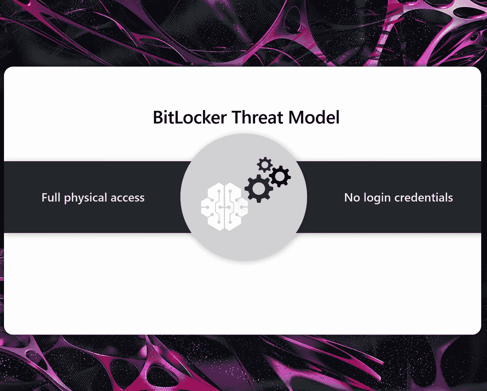

这个攻击面就是Windows恢复环境，也称为WinRE。

任何BitLocker攻击者都可以通过在登录屏幕选择重启时按住Shift键，直接启动到WinRE。这使其成为一个值得深入检查的潜在目标。

鉴于WinRE符合BitLocker的威胁模型、先前研究的缺乏以及其高漏洞潜力，我们决定进行一次专门的安全审查，旨在发现新漏洞、利用它们、修复它们，然后加固WinRE并减少其暴露的攻击面。

我们安全审查的目标是使WinRE和BitLocker都更加安全和具有弹性。

## 深入了解WinRE

上一节我们介绍了研究背景，本节中我们来看看WinRE是什么、它如何运作，以及哪些领域为漏洞研究提供了最有希望的机会。

WinRE是Windows的恢复平台。它旨在解决关键系统问题，例如启动失败、系统崩溃、BitLocker错误等。例如，如果您的机器崩溃，WinRE负责分析问题、识别损坏并使用其恢复工具进行解决。

从架构上讲，WinRE运行在自己的独立操作系统上，称为恢复操作系统。恢复操作系统是Windows的精简版本，具有恢复特定的自定义设置。这些自定义设置包括一组独特的恢复工具，这些工具都集成在众所周知的蓝色屏幕恢复用户界面中。

在存储方面，整个恢复操作系统，包括所有可执行文件、DLL和驱动程序等系统文件，基本上都被压缩到一个名为`Winre.wim`的单个WIM文件中。

这个WIM文件存储在磁盘上。当WinRE启动时，整个WIM文件被解压缩到内存中，创建一个承载恢复操作系统运行时的临时内存盘。

在此环境中进行的任何更改都不会保存回原始的`winre.wim`文件，使得恢复操作系统运行时本质上是易失的。对内存盘的修改在重启时会被丢弃。

当BitLocker首次引入时，WinRE必须演进以支持从BitLocker相关故障中恢复。这导致了一些架构和设计上的更改，以实现BitLocker恢复功能。我们想知道这些更改产生了什么影响。让我们更仔细地看看它们。

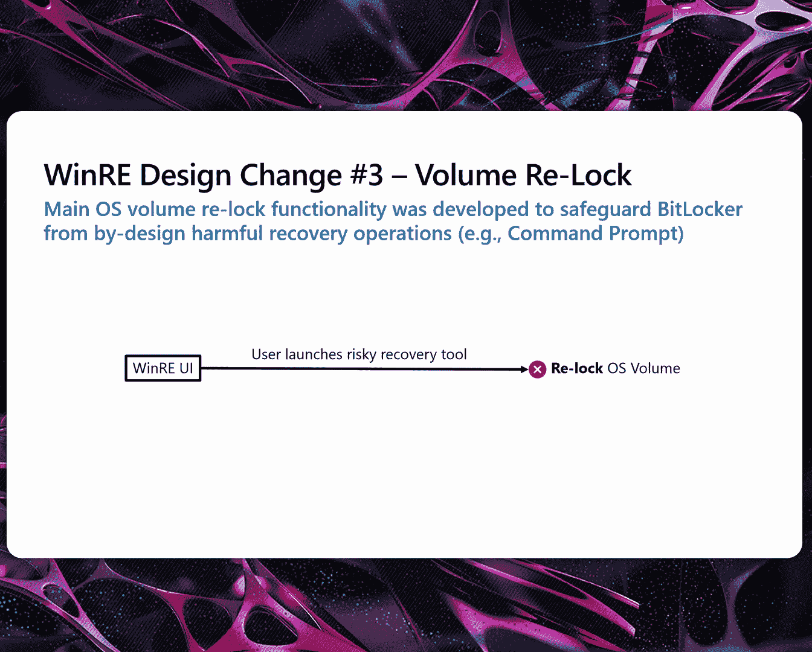


第一个设计更改侧重于`winre.wim`文件的位置。它从位于操作系统卷（现在被BitLocker加密）中，移到了位于一个专用的恢复卷中。

这个变更是必要的，因为WinRE必须能够从BitLocker相关故障中恢复。如果操作系统卷被加密并因解密失败而变得不可访问，将WinRE存储在那里会阻碍恢复。

由于WinRE是一个必须始终可用的关键组件，它被移到了一个单独的恢复卷。这确保了即使操作系统卷不可访问，WinRE也能正常运行。

第二个设计更改侧重于`Winre.wim`文件的完整性。为了支持对`winre.wim`的完整性验证，引入了名为“可信WinRE启动”的功能。它通过将其哈希值与已知的可信哈希值进行比较来验证WinRE的完整性。

如果哈希值匹配，操作系统卷会自动解锁。如果哈希值不匹配，操作系统保持锁定。这两种状态——自动解锁和锁定——定义了WinRE对操作系统卷的访问级别。

在自动解锁状态下，WinRE对操作系统卷拥有完全访问权限，无需任何用户干预即可执行恢复操作。而在锁定状态下，WinRE对操作系统卷完全没有访问权限。

这个变更，即引入可信WinRE启动，是必要的，因为WinRE现在位于不受保护的恢复卷上，不能再被盲目信任。可信WinRE启动确保对`winre.wim`的任何未经授权的修改（例如由物理攻击者进行的修改）都会破坏信任，从而有效阻止任何篡改。

第三个设计更改侧重于限制那些对BitLocker来说本质上具有风险的恢复工具。例如，在恢复工具中有一个命令提示符。

为了防止攻击者滥用命令提示符访问BitLocker保护的数据，在WinRE中添加了卷重新锁定功能。每次选择有风险的恢复工具时都会触发此功能，它会重新锁定操作系统卷。

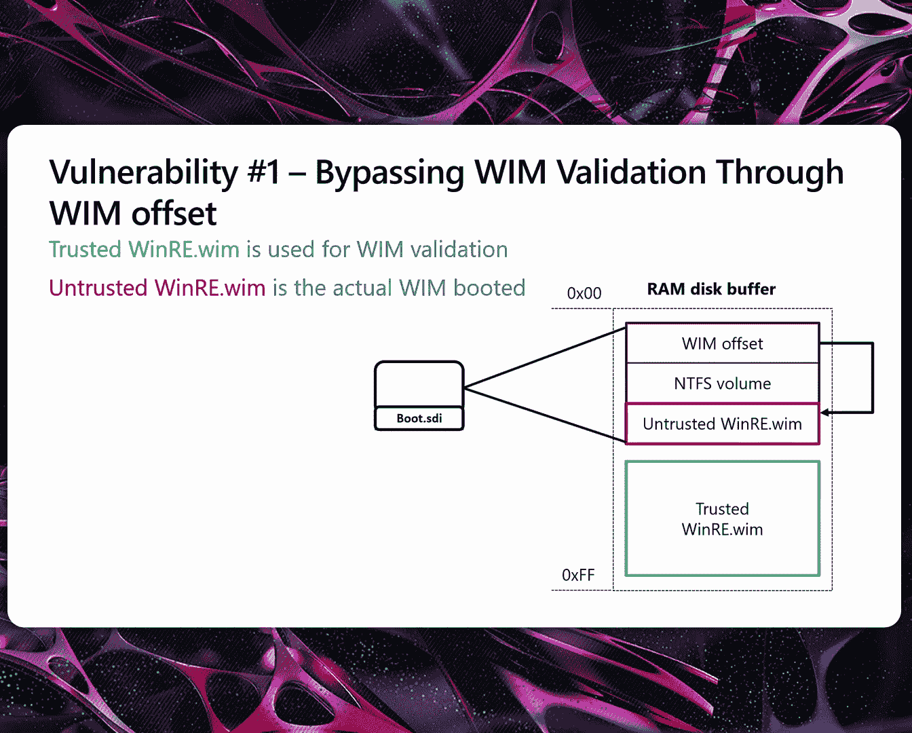

因此，要重新获得对操作系统卷的访问权限，用户必须手动插入BitLocker恢复密钥。否则，所有内容都完全无法访问。


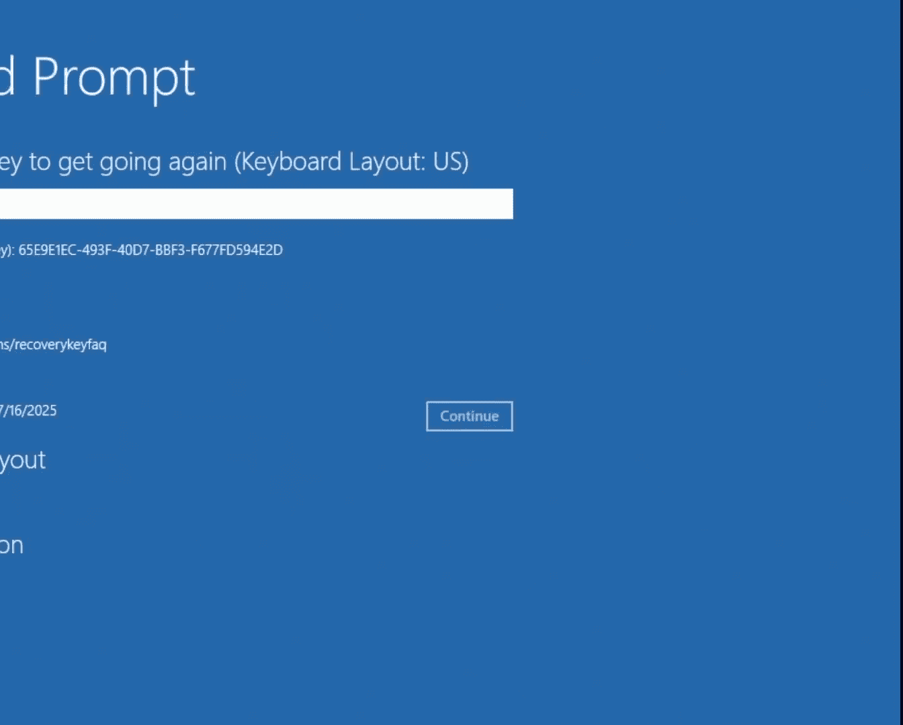

总结这些设计更改的影响：只要`winre.wim`是可信的且没有触发有风险的恢复工具，操作系统卷就会自动解锁，允许WinRE无需用户干预即可恢复它。

相反，如果`winre.wim`被未经授权地修改，或者触发了有风险的恢复工具，操作系统卷就会被重新锁定，阻止WinRE访问它。

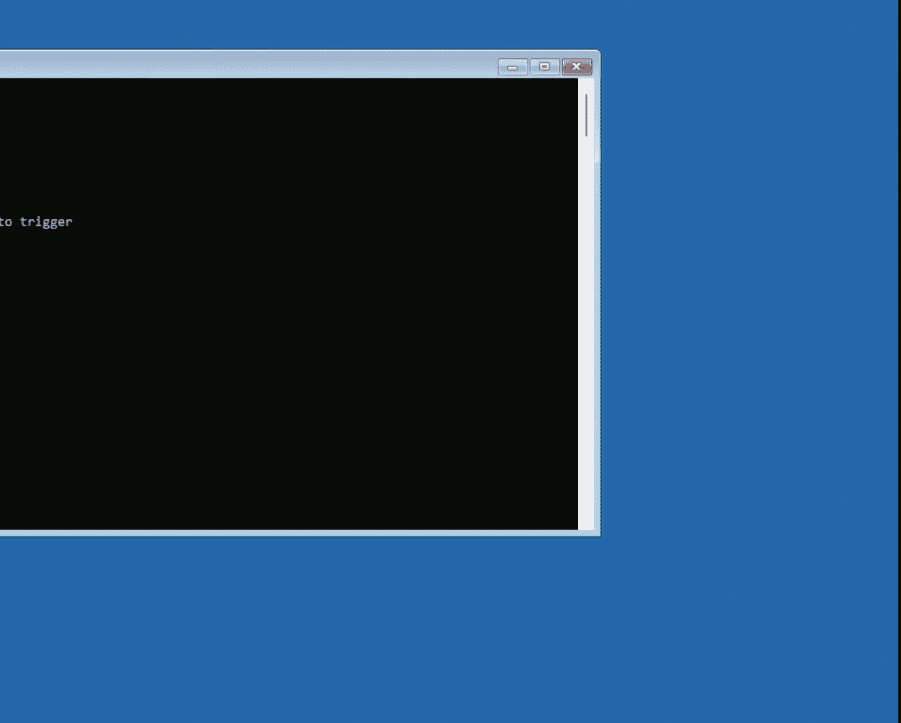

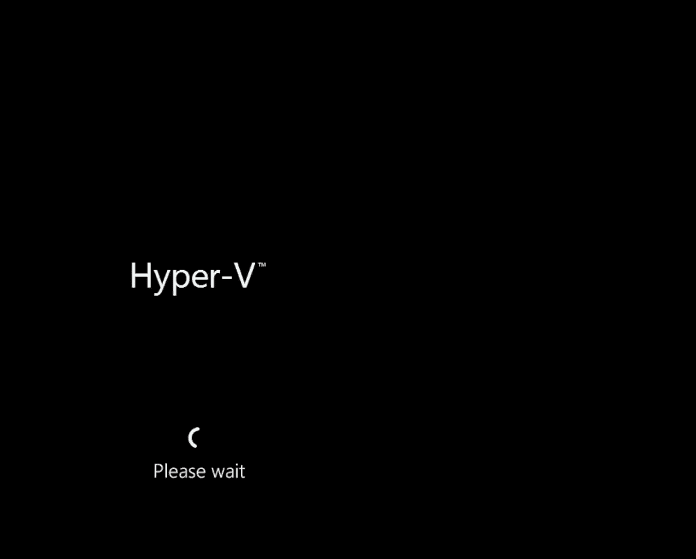

现在，关键问题出现了：由于这些设计调整，暴露了哪些攻击面？事实证明，在自动解锁状态下，WinRE会解析来自不受保护卷（特别是EFI系统分区和恢复卷）的文件。这种解析呈现了一个非常有趣的攻击面，在BitLocker引入之前，这个攻击面没有多大价值，因为在BitLocker之前，即使在WinRE内获得完全代码执行，也不会赋予物理攻击者任何新能力。

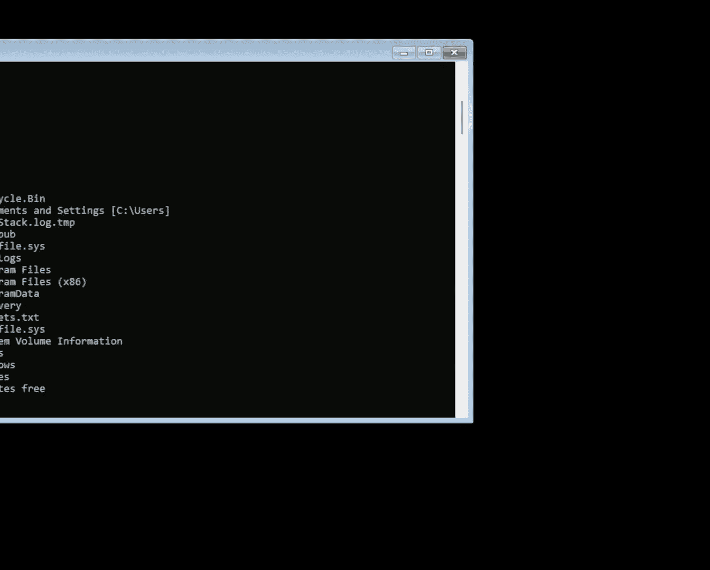


相比之下，有了BitLocker，在自动解锁状态下，WinRE内的任何代码执行都可以被用来绕过BitLocker并提取所有受保护的密钥。

我们决定更深入地研究这些外部文件并检查解析过程。具体来说，我们今天将重点关注的这些文件是位于恢复卷中的`raagent.xml`和`boot.sdi`文件，以及位于EFI系统分区中的启动配置数据存储。

## 攻击外部文件解析


上一节我们介绍了WinRE的设计和潜在攻击面，本节中我们来看看针对这些外部文件的研究过程。

让我们从`boot.sdi`开始。SDI代表系统部署映像格式，它可选地用于从虚拟磁盘启动到内存中。这种格式由多个二进制块组成，其中某些块对于内存盘启动过程至关重要。

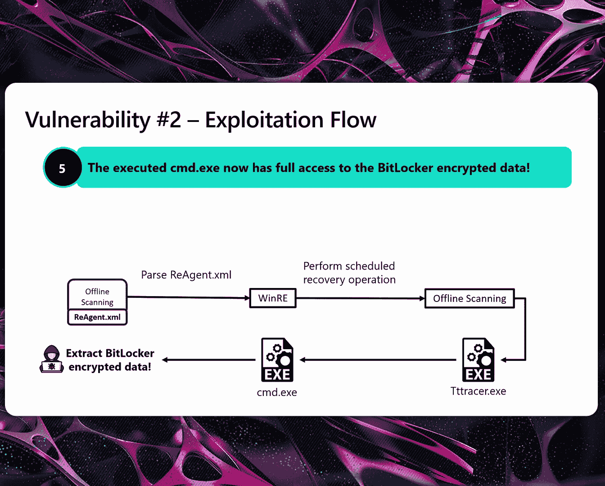

在我们的场景中，我们尝试从WIM文件启动到Windows恢复环境。`boot.sdi`将包含一个WIM块，其中包含指向附加的可信`winre.wim`的偏移量。此外，`boot.sdi`必须包含一个空的NTFS卷。这个空卷使得内存中的WIM能够作为NTFS卷呈现，确保与其他Windows组件的兼容性。


现在，让我们简要查看一下演示此过程的伪代码。


```c
// 伪代码示例：加载SDI和WIM
size_sdi = GetFileSize("boot.sdi");
size_wim = GetFileSize("winre.wim");
buffer = AllocateMemory(size_sdi + size_wim);
CopyFileToBuffer("boot.sdi", buffer);
CopyFileToBuffer("winre.wim", buffer + size_sdi);
wim_hash = CalculateHash(buffer + size_sdi, size_wim);
if (wim_hash != trusted_hash) {
    LockOSVolume();
}
wim_address = buffer + ReadOffsetFromSDI(buffer);
```


值得注意的是，在用于验证的WIM和稍后执行的WIM之间没有验证链接，允许偏移量被任意设置。

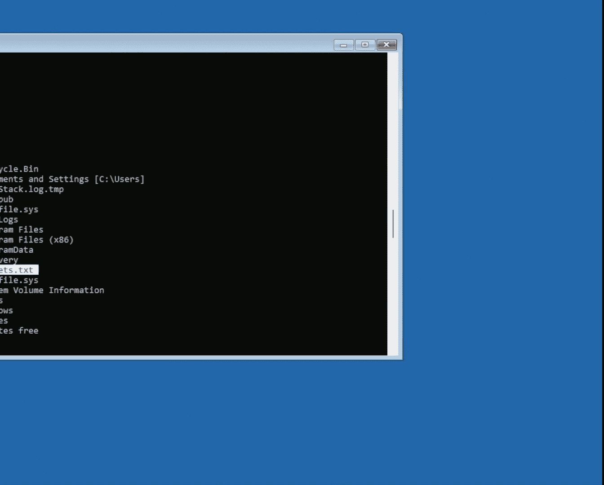

考虑到这一点，让我们深入探讨我们的第一个漏洞。我们知道，当`winre.wim`紧接在SDI之后加载时，它必须通过哈希验证。然而，`boot.sdi`本身完全没有经过任何验证。由于我们可以操纵WIM偏移量指向任意位置，我们可以将不受信任的WIM附加到SDI，并调整偏移量指向它。


对可信WIM的验证将会成功，但不受信任的WIM将被执行。这允许我们加载和执行我们选择的任何WIM，同时保持操作系统卷仍处于解锁状态。

现在，让我们看看第一个漏洞的演示。这是一台锁定的机器，我们没有它的密码。我们按住Shift键选择重启以启动到WinRE。在WinRE内部，我们将运行我们预先准备好的漏洞利用程序。在启动过程中，主操作系统卷被BitLocker自动解锁。


我们到达WinRE操作界面。我们选择“疑难解答”，然后选择“高级选项”，再选择“命令提示符”。现在主操作系统卷被重新锁定，需要密钥。我们没有密钥，所以我们跳过这个驱动器。


现在我们尝试访问C盘，但无法访问，提示被BitLocker锁定。如果我们检查BitLocker状态，会看到它显示为锁定。现在，我们将路径更改为D盘，即已挂载的恢复卷（不受保护的卷）。我们执行预先准备好的漏洞利用程序。

我们将自定义WIM附加到`boot.sdi`，调整偏移量指向它。此时，我们只需将机器重启回WinRE。

现在，我们没有进入WinRE恢复用户界面操作，而是加载了自定义启动项，我们将其设置为启动CMD。这是CMD。我们可以将路径更改为C盘。

如果我们现在检查BitLocker状态，可以看到它显示为“已解锁”，并且其上的保护仍然开启。如果我们列出C盘下的所有文件，就可以查看所有机密信息。

完成对`boot.sdi`的审查后，我们将注意力转向`raagent.xml`以寻找漏洞。


`raagent.xml`文件包含当前的恢复状态和WinRE的其他配置设置。WinRE启动后，会立即使用和解析此XML文件。当WinRE状态配置为执行计划操作时，它将运行指定的恢复操作，例如启动修复或其他任务。所有这些都发生在到达之前看到的用户界面操作之前。


今天，我们将讨论两个可以通过修改`raagent.xml`中的状态来任意执行的计划恢复操作。首先是离线扫描，然后是WinRE应用程序。


从离线扫描操作开始。此操作允许从WinRE内部对主卷运行防病毒扫描。它主要用于对付不在WinRE内部运行的恶意软件。


我们发现我们可以控制扫描程序，但有一些限制。首先，离线扫描只能通过执行主操作系统卷内的应用程序来执行。其次，此应用程序必须由Microsoft或WHQL进行数字签名。第三，签名必须嵌入在二进制文件本身中。

我们搜索了所有满足这些要求的默认应用程序，发现了大约30个应用程序。CMD不在其中。由于兼容性原因，我们无法执行所有应用程序。

我们逐一审查它们，直到找到名为`TTTracer`的应用程序。这个应用程序是一个时间旅行调试器实用程序，允许跟踪任意可执行文件。如果我们能跟踪任何我们想要的东西，那就跟踪CMD吧。

现在，让我们回顾一下第二个漏洞的完整利用步骤。在启动机器之前，我们在`raagent.xml`中设置恢复状态以计划离线扫描操作。然后WinRE解析此XML。根据我们设置的状态，WinRE恢复执行计划的操作，即离线扫描。它将执行`TTTracer`，后者将跟踪您设置的任何二进制文件。我们指定了CMD。所以在我们的案例中，它将启动CMD。在这个特定时刻，当仍处于自动解锁状态时，我们拥有一个具有对完全未加密的主操作系统卷的访问权限的shell。

让我们看看第二个漏洞的快速演示。同样，这是一台锁定的机器，带有密码保护器，我们没有密码。我们再次按住Shift键重启以启动到WinRE执行我们的漏洞利用。

现在主操作系统卷被自动解锁。我们进入WinRE恢复操作界面，选择“疑难解答”，然后“高级选项”和“命令提示符”。

现在，主操作系统再次被锁定。我们没有密钥，所以跳过这个驱动器。如果我们尝试访问C盘，会提示该驱动器被BitLocker锁定。如果我们检查BitLocker状态，可以看到它显示为锁定。现在，我们将路径更改为D盘，即恢复卷（不受保护的卷）。我们将运行预先准备好的漏洞利用程序。我们设置`TTTracer`在离线扫描操作中被计划执行，并设置它来跟踪和运行CMD。漏洞利用完成后，我们将机器重启回WinRE。

但这次，我们没有看到之前看到的用户界面操作，而是看到了我们计划的应用程序`TTTracer`。这是`TTTracer`。它要求我们接受最终用户许可协议。我们接受它。之后，我们立即看到CMD正在启动。现在，我们可以更改驱动器。如果我们检查BitLocker状态，这里显示为“已解锁”，并且保护仍然开启。再次，如果我们列出C盘下的所有文件，就可以查看机密信息。

## 攻击WinRE应用程序

上一节我们介绍了离线扫描漏洞，本节我们来看看WinRE应用程序的漏洞。

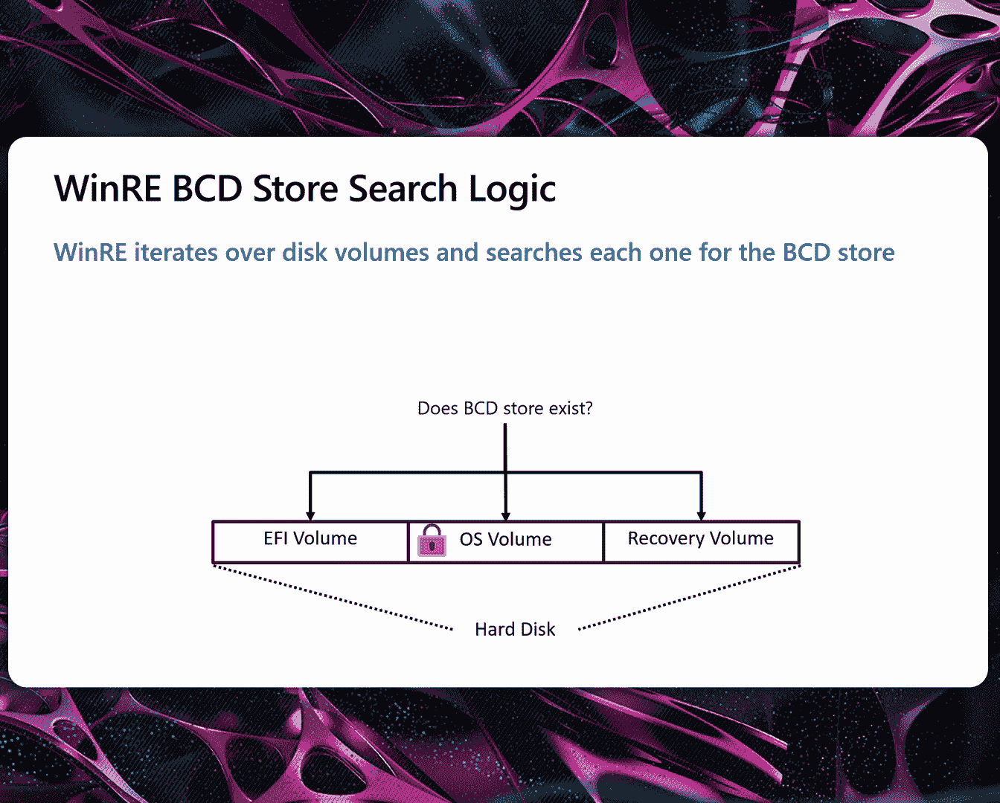

我们可以配置的另一个计划操作是WinRE应用程序，它允许我们在WinRE内运行应用程序。如果这些应用程序是可信的，它们会在主操作系统卷仍处于自动解锁状态时执行。否则，它们会在主操作系统卷被重新锁定后运行。


我们寻找了哈希验证过程，发现可信应用程序使用其可执行文件名和文件哈希在WinRE注册表中注册。此注册表位于WIM文件内，物理攻击者无法修改它。对WIM的任何更改都会改变其哈希值，导致在启动哈希验证期间主操作系统卷被重新锁定。

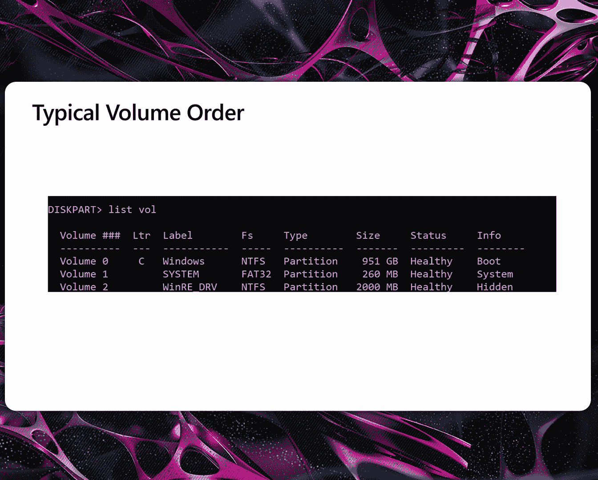

当WinRE计划运行可信应用程序时，它首先计算目标应用程序的哈希值，然后在注册表中搜索匹配项。如果找到匹配项，应用程序被标记为可信。如果没有匹配项，应用程序被标记为不可信，主操作系统卷被重新锁定，之后该应用程序被执行。

总的来说，这听起来像是二进制可信应用程序验证是可靠的。它正常工作，对吧？我们想知道一个已注册的应用程序是否会暴露攻击面。所以我们开始寻找已注册的应用程序。

我们发现了一个名为`SetupPlatform`的程序对此功能的合法使用。此应用程序注册为可信应用程序，并在Windows升级期间使用。一旦升级完成，可信应用程序条目仍保留在注册表中，并且不会被删除。所以我们可以执行`SetupPlatform`。但我们还能用它做什么呢？

我们发现该注册表设置了F1热键来启动CMD。我们尝试了，但由于主操作系统卷上缺少配置而无法执行。由于此配置文件位于BitLocker保护的主操作系统卷上，我们无法创建或编辑它。这个配置要求导致`SetupPlatform`在文件不存在时提前终止。

现在，热键注册和进程退出之间的时间窗口非常短。手动使用此热键触发CMD几乎是不可能的。


我们仍然想找到另一种启动CMD的方法。所以我们回过头来分析`SetupPlatform`。就在这时，我们发现了一些非常有趣的事情。在注册了CMD热键之后，此应用程序立即在恢复卷（即不受保护的卷）上搜索`setup.ini`文件。通过正确配置此文件，`SetupPlatform`将触发一个消息框。这会阻止应用程序继续执行，本质上阻止了应用程序提前终止。


这将打开一个无限的时间窗口来生成CMD并在其中输入任何我们想要的内容。

让我们查看完整的流程。我们修改`raagent.xml`来设置计划执行WinRE应用程序，具体来说，我们设置执行`SetupPlatform`。WinRE验证此应用程序是否可信，验证成功，主操作系统卷保持解锁。接下来，`SetupPlatform`被执行。它注册了CMD的热键，即Shift+F1。然后它查找并加载`setup.ini`文件，这将触发一个消息框。这样，进程被阻塞，直到我们按下“确定”才会继续。现在，我们可以简单地按下Shift+F10来触发CMD。我们获得一个正在运行的shell，同时主操作系统卷仍然处于解锁状态。

让我们看看第三个漏洞的演示。同样，这是一台锁定的机器，我们没有它的密码。我们按住Shift键重启以启动到WinRE。

我们到达WinRE，选择“疑难解答”，然后“高级选项”，再选择“命令提示符”。现在，主操作系统再次被锁定。我们没有密钥，所以跳过这个驱动器。

我们再次尝试访问C盘，它被锁定。我们将检查BitLocker状态。再次，两者都显示为锁定。现在，我们将运行位于恢复卷（不受保护的卷）上的漏洞利用程序。我们将`SetupPlatform`设置为可信应用程序，并设置`setup.ini`文件。


漏洞利用完成后，我们重启机器。现在，我们没有看到之前看到的操作界面，而是期望出现来自`SetupPlatform`的消息框。这是消息框。现在，我们可以简单地按下Shift+F10，生成CMD。

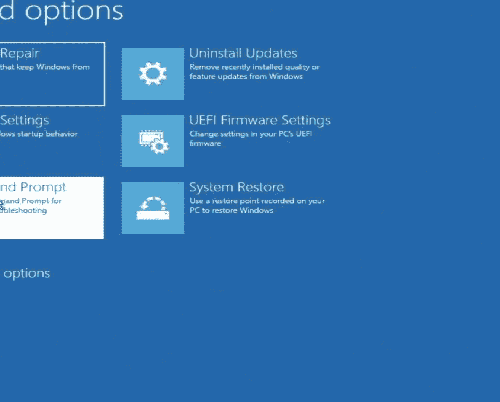

我们可以将路径更改为C盘。如果我们检查BitLocker状态，可以看到保护仍然开启，并且卷已解锁。如果我们列出C盘下的文件，就可以再次查看所有机密信息。

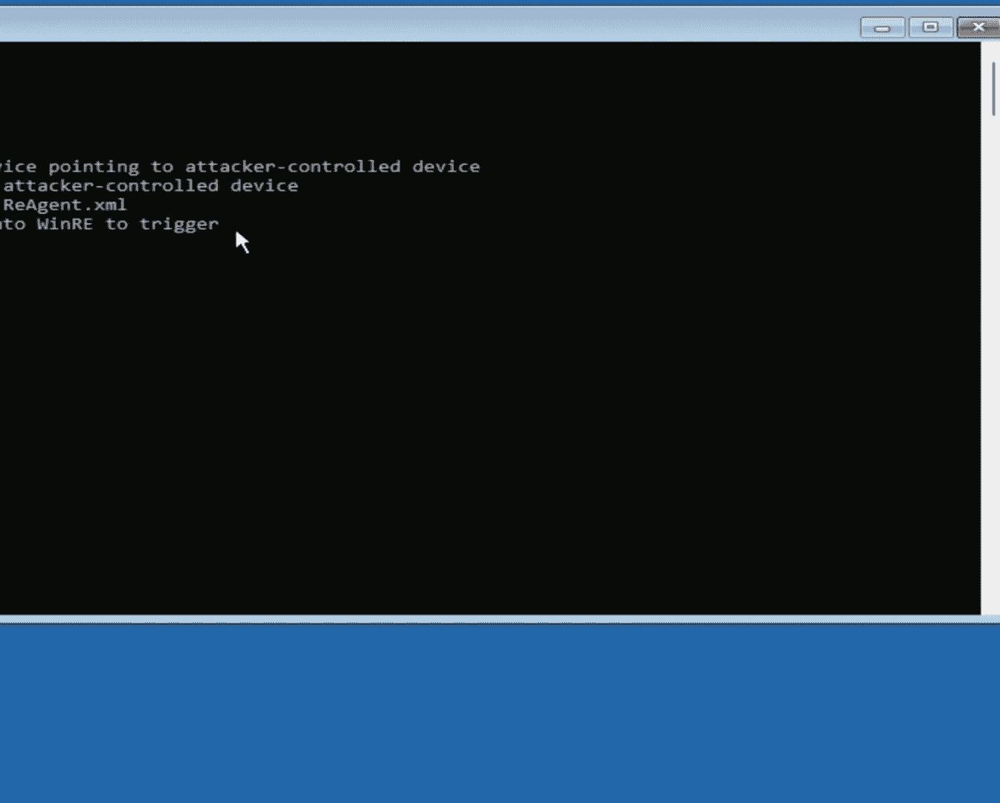

## 攻击BCD解析

上一节我们介绍了WinRE应用程序的漏洞，本节我们来看看攻击WinRE中的BCD解析。

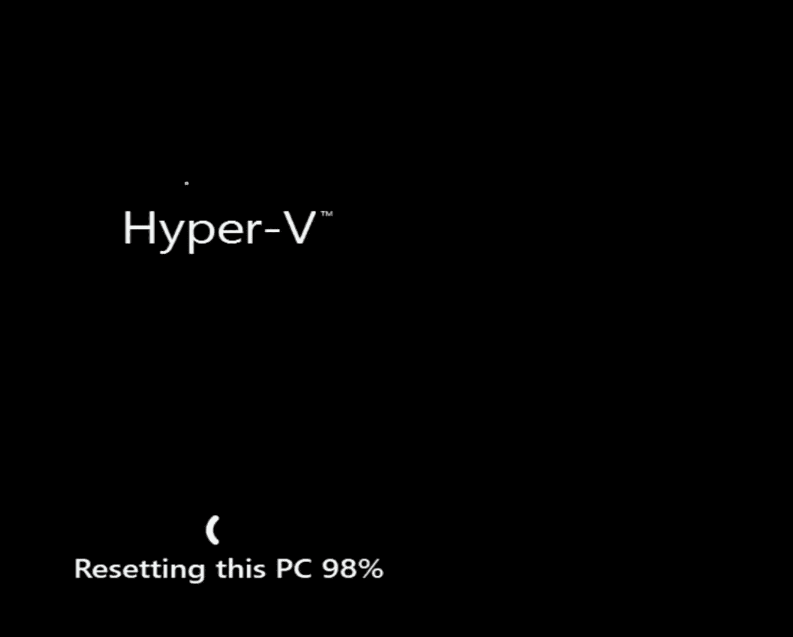


对于那些不熟悉BCD及其含义的人，BCD代表启动配置数据。它是定义Windows如何启动的文件。它存储启动条目、控制启动参数、恢复设置以及许多其他与启动相关的配置。


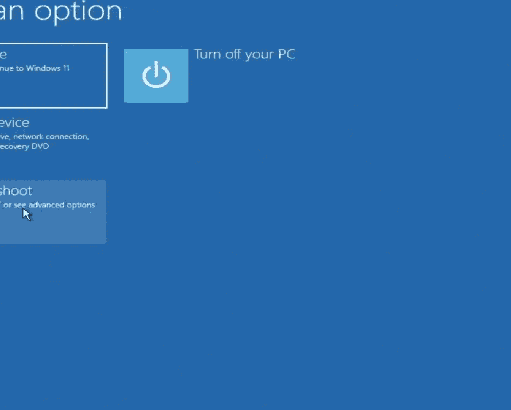

在WinRE的上下文中，BCD的使用相当有限。WinRE主要使用BCD来确定目标操作系统卷在磁盘上的位置，以便WinRE知道将恢复操作定向到哪个卷。当WinRE启动时，它读取BCD存储，从BCD中检索目标操作系统卷，然后将恢复操作定向到BCD指定的这个卷。


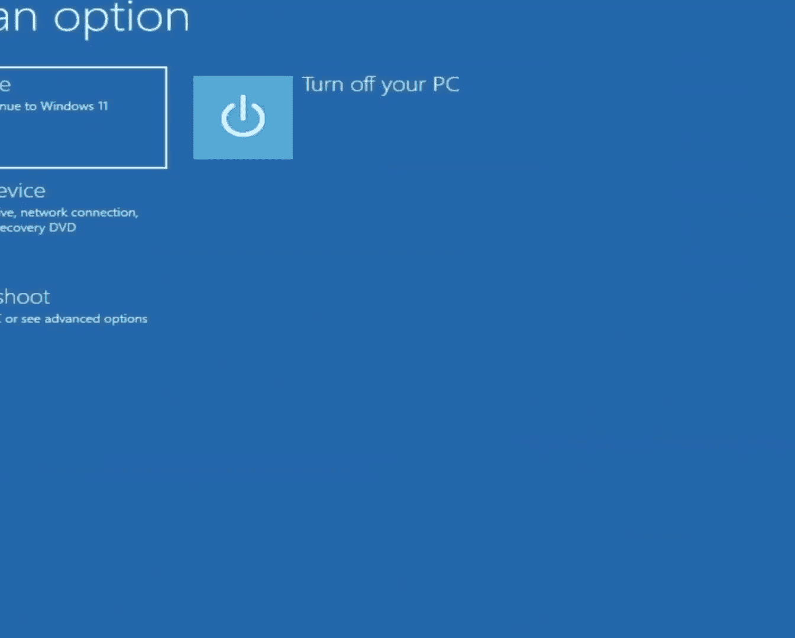

因此，当我们调查WinRE的BCD使用时，脑海中出现的第一个问题是：我们可能从中获得什么？事实证明，WinRE完全信任目标操作系统卷，假设它超出了攻击者的触及范围。从设计角度来看，这个假设实际上是可靠的，因为启用了BitLocker后，目标操作系统卷是加密的，攻击者无法访问它。因此，可以放心地查询其配置，假设它超出了攻击者的触及范围。

话虽如此，由于目标操作系统位置是在我们可以修改的BCD中定义的，我们开始质疑这个信任假设。BCD操作是否允许我们破坏它？如果我们能欺骗WinRE，让它认为一个攻击者控制的卷是可信的BitLocker加密卷，从而混淆WinRE，会怎么样？


因此，我们的重点转向识别一个允许冒充目标操作系统位置的原始方法。目标是操纵目标操作系统卷，使其指向攻击者控制的卷（例如恢复卷），而不是指向我们无法修改的可信BitLocker加密卷。但我们能修改恢复卷。我们获得的这个原始方法将打破信任假设。

我们已经知道目标操作系统位置是在BCD存储中控制的，我们可以直接修改它。那么，如果我们直接在BCD存储中更改位置会发生什么？理论上这是可能的，但没有价值。让我解释一下。

目标操作系统位置不仅被WinRE使用，还被启动管理器使用，启动管理器用它来知道应该为WinRE自动解锁哪个卷。对BCD存储的任何更改都会影响启动和操作系统两个方面。在这种特定情况下，将目标位置修改为指向恢复卷会阻止启动管理器自动解锁包含机密的BitLocker加密操作系统卷。而这些正是我们想要提取的机密。所以这打破了信任假设。但即使在WinRE内获得完全代码执行，BitLocker机密仍然无法访问且