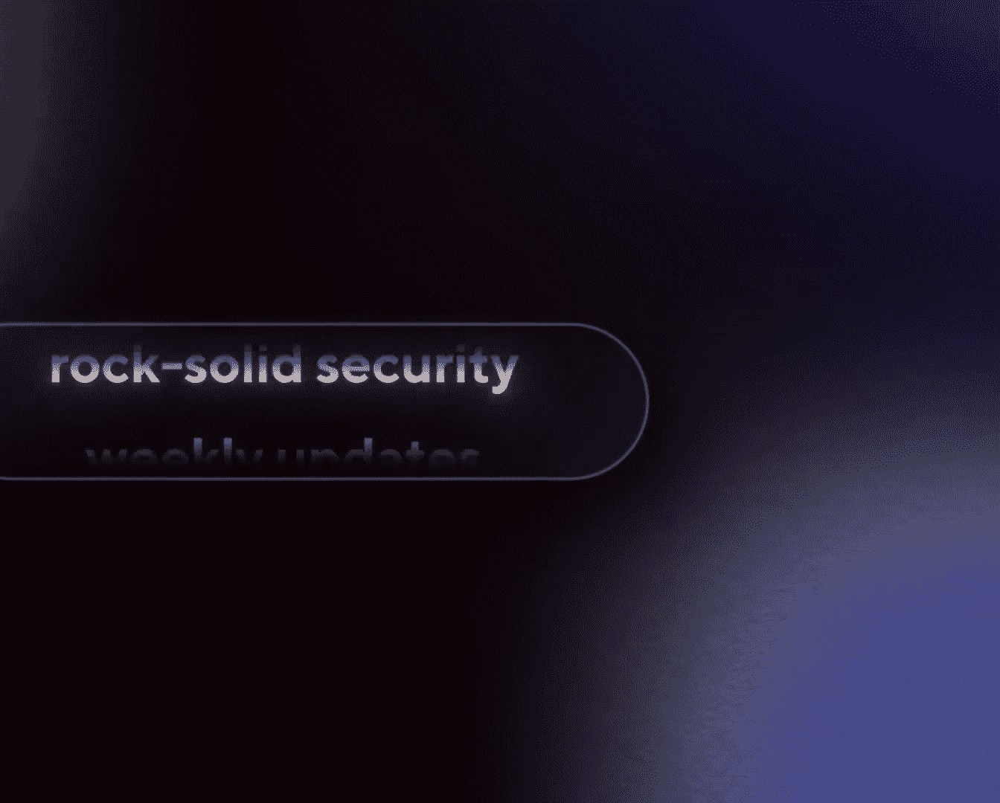
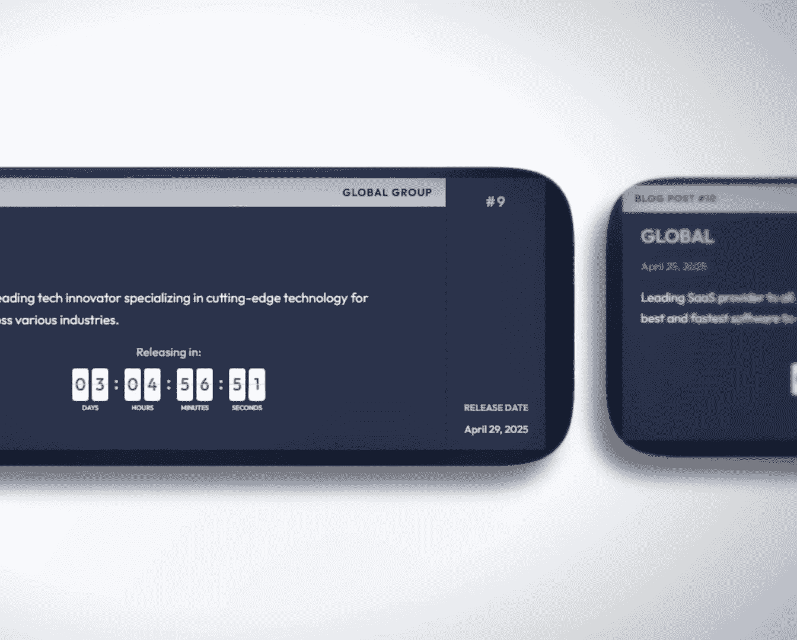

# 网络安全课程 第1课：三十年的网络安全演进与洞见 🔐

在本节课中，我们将跟随网络安全先驱米科·许珀宁的视角，回顾过去三十年间网络威胁的演变历程。我们将从早期的计算机病毒，一直探讨到当今由人工智能驱动的复杂攻击，并思考安全从业者应如何构建更具韧性的团队和防御体系。

## 概述：一个充满不确定性的时代

上一节我们介绍了课程背景，本节中我们来看看当前网络安全领域面临的宏观环境。我们正处在一个充满不确定性的时代。多种变革力量同时涌现，带来了前所未有的挑战。

以下是当前面临的主要挑战：

*   **人工智能的颠覆性影响**：人工智能的潜力巨大，但其最终将如何颠覆现有格局尚不完全明确。
*   **大国竞争加剧**：国家间的竞争日趋激烈，国家尊严等非完全理性的因素在决策中变得至关重要。
*   **新法规的出台**：例如欧盟正在实施的《网络弹性法案》，首次将软件责任明确化，其具体影响仍在探索中。
*   **贸易不确定性**：地缘政治事件（如关税调整）与突发事件（如自然灾害）可能同时发生，打乱全球供应链。
*   **社会因素与人才流动**：社会环境的变迁促使人才重新评估工作与生活地点，引发全球人才竞争。
*   **技术的政治化**：技术已深度融入社会各领域，采购、合作等商业决策不可避免地带有政治色彩。人工智能无法理解企业的核心使命和复杂的政治权衡，这些仍是需要人类做出的决策。

面对这种混沌环境，个人和组织需要像培养一个适应力强的孩子一样，注重灵活性、多语言能力、全球视野和跨文化适应力。对于企业和团队而言，这意味着需要构建强大的社区和团队韧性。

## 构建有韧性的团队与文化

上一节我们探讨了外部环境的挑战，本节中我们来看看如何从内部构建抵御这些挑战的基石。研究表明，联系紧密的社区能从灾难中更快恢复。这一原则同样适用于公司团队。

以下是构建韧性团队的核心要点：

*   **团队建设优于“购买”**：除了极少数巨头，大多数组织无法直接“购买”一整支顶尖团队。更现实的路径是从B团队开始，通过培养和建设，将其提升为A团队。一个好的团队比一群顶尖的个人贡献者更重要。
*   **使命感的巨大价值**：清晰的使命感可以弥补相当一部分的物质回报。人们为金钱工作的动力是有限的，而为有意义的事业工作的动力则强大得多。公式可以表示为：`员工动力 = 物质回报 + 使命感`。
*   **文化决定战略成败**：企业文化会吞噬战略。如果企业文化不支持，再完美的战略也无法落地执行。在引入新系统（如SAP）时，往往是你的公司文化去适应系统，而非相反。因此，制定战略时必须考虑其与公司文化的兼容性。

在混沌环境中，追求绝对的效率优化可能导致组织变得脆弱。相反，保持一定的灵活性、预留备选方案（如备用技术栈），为员工提供机动空间，才能更好地应对意外冲击。

## 威胁演变史：从恶作剧到国家武器

上一节我们讨论了团队建设，本节中我们来看看网络安全威胁本身在过去三十年发生了怎样的根本性变化。米科·许珀宁的职业生涯完整地见证了这场演变。

早期的计算机病毒（如1986年的“Brain”病毒）更像是青少年的恶作剧，通过软盘传播，显示一些无害的消息或动画。攻击者并无经济利益或政治目的。米科曾根据病毒中的地址信息，在25年后找到了“Brain”病毒的编写者。

**转折点出现在2003年**。在此之前，攻击多以爱好和恶作剧为主。2003年之后，情况发生了两大根本性转变：

1.  **金钱成为动机**：出现了以牟利为目的的恶意软件，如帮助发送垃圾邮件的僵尸网络、盗取银行信息的木马。
2.  **国家力量入场**：政府开始将网络能力用于间谍活动等目的。攻击方式通常是通过鱼叉式钓鱼邮件，诱骗目标打开带有漏洞的Office文档（如 `.pdf`、`.docx`、`.xlsx`），从而控制其电脑。

2010年的“震网”病毒是一个里程碑，它由美国和以色列开发，专门用于破坏伊朗的核设施，证明了软件可以作为物理破坏的武器。

## 勒索软件的兴起与“网络犯罪独角兽”

上一节我们看到了国家行为体的介入，本节中我们来看看当今最猖獗的威胁形式——勒索软件。如今，典型的攻击（如勒索软件）通常不再自动复制传播。攻击者为了赚钱，需要低调控制受害范围，避免成为头条新闻。

然而，历史上仍有大规模爆发的案例。**2000年的“爱虫”病毒**是史上最大的电子邮件蠕虫，感染了超过2亿台电脑。它通过标题为“I love You”的邮件传播，附件是一个Visual Basic脚本文件（`LOVE-LETTER-FOR-YOU.TXT.vbs`）。

**2017年是另一个分水岭**，出现了两起破坏行业“信誉”的巨大事件：
*   **WannaCry**：由朝鲜政府编写，旨在筹集资金。它利用从美国NSA窃取的“永恒之蓝”漏洞利用程序，像蠕虫一样自动传播。
*   **NotPetya**：由俄罗斯政府编写，实质上是针对乌克兰的网络武器，但波及全球，导致如马士基等跨国公司损失惨重，需重装数万台设备。

勒索软件得以盛行的关键推手是**比特币**等加密货币。加密货币是可编程的、基于数学的货币，难以通过法律进行监管，这使其成为网络犯罪的理想支付工具。2013年的“Cryptolocker”是首个要求用比特币支付赎金的勒索软件。

如今，勒索软件团伙已发展成庞大的犯罪企业。它们拥有自己的品牌、标识和网站，通过“初始访问经纪人”获取企业网络入口，然后像散弹枪一样扫描全网寻找漏洞。其利润之高，足以被称为“网络犯罪独角兽”。这些团伙甚至开始利用AI进行自动化谈判。

## 防御的进步与未来的挑战

上一节我们剖析了攻击方的演进，本节中我们来看看防御方取得的进展及未来的战场。尽管每天都有数据泄露和勒索软件事件，但从长远看，安全性比以往任何时候都好。

过去十年取得了显著进步：
*   **淘汰了不安全的浏览器插件**（如Java、Flash），消除了“点击即感染”的主要途径。
*   **操作系统安全性大幅提升**。例如，发布12年的Xbox One至今未被成功越狱，这证明了严格锁定的系统是有效的。
*   **移动设备安全**：现代智能手机（iOS/Android）是高度限制性的计算机，大幅提高了攻击门槛。像“飞马”间谍软件这样的高级攻击成本极高（约10万美元/目标），仅限于针对特定人物，这本身是一种安全成功。

攻击者在技术壁垒前受阻后，转而更多地**利用社会工程学攻击用户**，如网络钓鱼和诈骗。我们不应简单指责“用户是最薄弱的环节”，而应将安全责任更多地放在安全专业人员和技术设计上，减少用户犯错的可能。

**人工智能是未来的关键变量**。目前，防御方在利用AI方面领先于攻击方。AI已帮助研究人员发现了数十个零日漏洞。然而，攻击方对AI的利用才刚刚开始，更复杂的AI攻击必将出现。

网络安全工作常是“隐形”的——成功意味着什么都没发生。这就像“俄罗斯方块”：消除的成功行会消失，而失败则会堆积起来。正如一句话所说：“当你把事情做对时，人们不会确信你做了任何事。”

## 总结与个人转向

本节课中我们一起学习了网络安全三十年的风云变幻。我们从混沌的外部环境谈起，探讨了构建韧性团队的重要性。随后，我们回顾了网络威胁从青少年恶作剧，演变为有组织犯罪和国家级网络武器的历程，并深入分析了勒索软件成为“网络犯罪独角兽”的根源。最后，我们看到了防御技术的进步，以及AI带来的新挑战与机遇。

米科·许珀宁在演讲最后宣布，他将离开工作了34年的网络安全行业，加入一家专注于无人机防御的国防承包商。他住在离俄罗斯边境仅两小时的地方，当前的战争形态正迅速向无人机战争演变。他认为，与他一生所对抗的、试图规避检测的可编程威胁（恶意软件）相比，无人机防御在本质上具有相似性——检测与反检测的动态对抗。对他个人而言，在当前时刻，从事“反无人机”工作比“反病毒”具有更直接的意义。

他的职业生涯转变，也标志着网络战与物理世界的传统战域正在以前所未有的速度融合。这为我们所有安全从业者留下了关于责任、使命与技术演进的深刻思考。