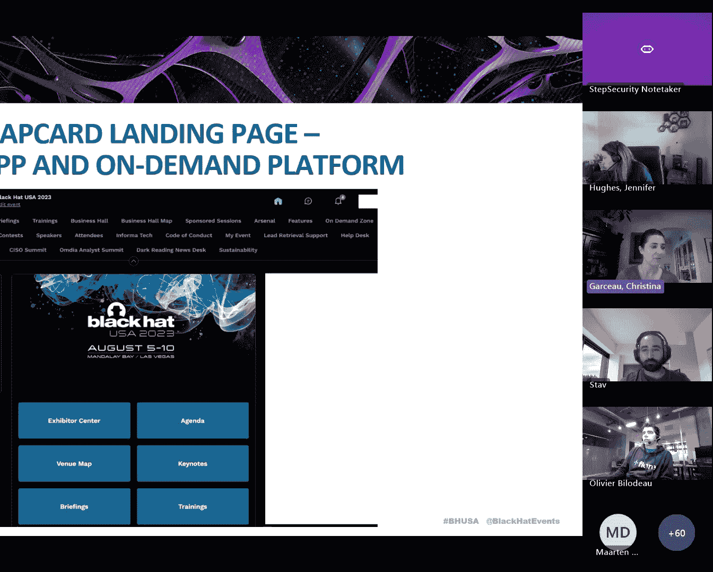
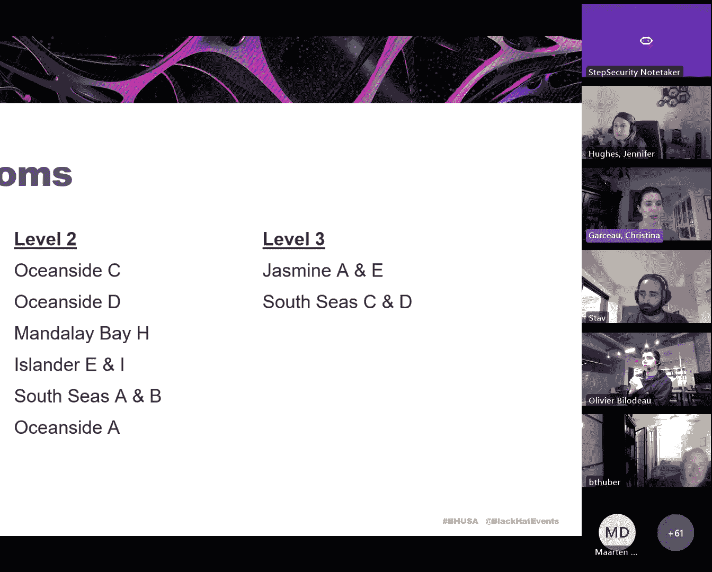
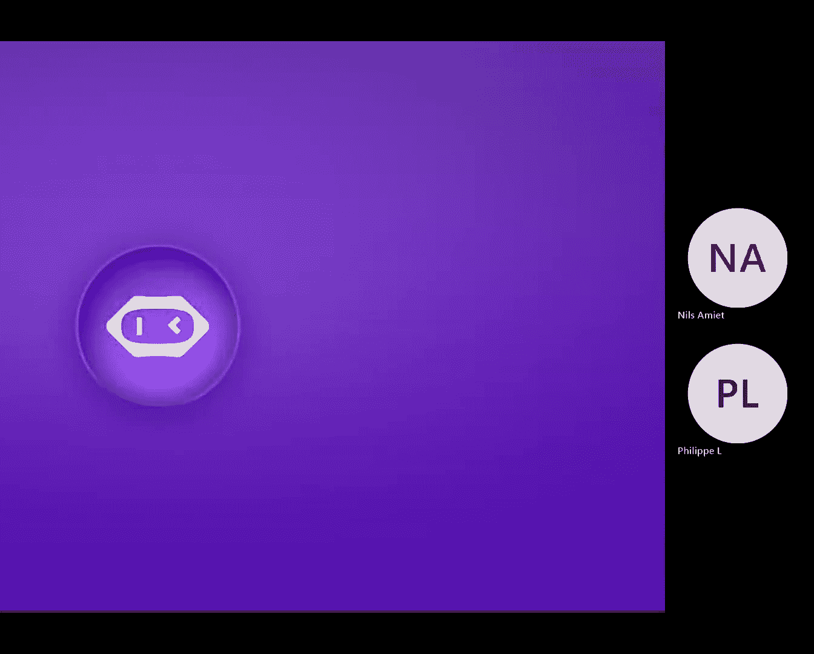

# Black Hat 简报会 演讲者指南 📋

在本教程中，我们将详细介绍Black Hat简报会演讲者需要了解的所有关键信息，包括虚拟平台使用、现场流程、演讲准备和活动细节。请仔细阅读并遵循指南，以确保活动顺利进行。

---

## 1. 虚拟平台与移动应用 📱

首先，我们将介绍本次会议使用的虚拟平台——移动应用程序。

您需要在应用商店搜索“Black Hat Events”并下载该应用。应用现已开放，您可以在其中查看会议内容。请使用您注册时提供的邮箱进行登录。

以下是使用移动应用的关键步骤：
*   **注册与登录**：使用会议注册邮箱登录应用。
*   **更新个人资料**：登录后，请立即进入个人资料页面，移除您的个人家庭住址信息，以防他人通过连接请求看到。
*   **管理可见性与会议**：请勿将个人可见性设置为“关闭”，否则您的演讲将不会在应用中显示。您可以在“会议”选项卡中编辑您的空闲时间，并查看他人发送给您的会议请求。
*   **发送连接请求**：如需联系他人，可浏览其个人资料并点击“发送连接请求”。

您也可以通过扫描屏幕上的二维码或访问指定链接来使用网页版应用。

---

## 2. 活动场地与日程 🗺️

上一节我们介绍了线上平台，本节中我们来看看线下活动的具体安排。

本次活动在曼德勒海湾酒店举行。会议简报室分布在三个楼层：
*   **Level 0（北会议中心）**：包含简报室和总结交流室。
*   **Level 1**：设有主题演讲厅和商务展厅，无简报室。
*   **Level 2 和 Level 3**：设有多个主要的简报室。

活动日程概览如下：
*   **8月6日（周三）**：共6个时段，每时段9场简报；包含2场主题演讲和2场主舞台会议。
*   **8月7日（周四）**：共5个时段，每时段9场简报；包含5场主题演讲和2场主舞台会议。

您可以通过提供的链接查看详细日程。

---

## 3. 报到与证件领取 🎫

了解场地后，抵达现场的第一件事是领取参会证件。

请前往注册台，出示您注册确认邮件中的二维码以及带照片的身份证件。我们设有主注册台和位于酒店大堂的卫星注册台（开放时间较晚）。

如果您修改了注册信息以包含DC（媒体）证件，也可以在Black Hat活动现场指定柜台领取。

---

## 4. 演讲准备与现场流程 🎤

现在我们来了解作为演讲者最重要的环节——演讲准备和现场流程。

**演讲者中心**是您的核心报到点。**您必须在演讲开始前45分钟抵达位于Level 2的Surf BC演讲者中心**。我们的联络员会在此与您对接，并在演讲前约20分钟陪同您前往演讲室。

**演讲彩排室**位于Surf A，您可以通过提供的预订链接提前预约30分钟的时间段进行彩排。

关于视听设备，请注意：
*   您将使用领夹式麦克风。
*   现场提供提词器（信心监视器），方便您查看幻灯片和备注。
*   请将演示视频嵌入PPT或存放在U盘中，**切勿依赖现场Wi-Fi进行在线演示或播放网络视频**。
*   建议您将演示文稿备份在U盘中，并打印演讲备注，以防笔记本电脑出现意外。

演讲结束后，请迅速离开房间以便下一场准备。您可以在总结交流室（Level 0的South Pacific D或Level 2的指定区域）继续与参会者深入讨论。

---

## 5. 重要规则与材料提交 📄

为了保证会议的专业性和一致性，请遵守以下核心规则。

**公司标识**：您的公司Logo**仅允许**出现在标题页之后的**第一张幻灯片**和**最后一张幻灯片**上。请注意，标题页本身不计入。

**幻灯片提交**：请在演讲后尽快将最终版幻灯片以PDF格式发送给指定的工作人员。提交时请遵循邮件中指定的**命名规范**，例如：`[日期]_[时间]_[您的姓名]_演讲标题.pdf`。这有助于我们高效地将材料上传至会议平台，供参会者查阅。

**字体与可读性**：请确保幻灯片字体足够大，以便会场后排的观众也能清晰阅读。

---

## 6. 社交活动与后勤信息 🍽️

除了紧张的会议，我们也为您安排了一些社交活动。

**周二晚上**是活动密集的时段：
1.  **Day Zero**：大型交流活动。
2.  **演讲者招待会**：在Level 3举行，提供小食和饮品。
3.  **VIP派对**：在Border Grill举行（仅限受邀者，不可携带同伴）。

**周三**则有商务展厅的展位巡游和欢迎招待会。

**餐饮信息**：
*   早餐位于主题演讲厅（Mandalay Bay Arena）外。
*   午餐位于Level 1的Bayside D，靠近商务展厅。
*   各简报楼层在会议间歇提供茶歇。

请务必全程佩戴您的参会证件。

---

## 7. 联络方式与紧急情况 📞

保持沟通畅通至关重要。

请务必将活动工作人员（Christina和Jen Hughes）的手机号码存入您的手机。如果您在演讲当天可能迟到，请务必提前通知我们。

如果您的手机号非美国号码，请告知我们最佳的联系方式（如WhatsApp），以便在紧急情况下能及时联系到您。

---

## 总结

本节课中，我们一起学习了Black Hat简报会演讲者需要掌握的完整流程：
1.  如何使用会议移动应用。
2.  熟悉曼德勒海湾酒店的场地布局与日程。
3.  报到、领取证件的步骤。
4.  演讲前45分钟必须抵达演讲者中心的核心流程。
5.  关于幻灯片格式、公司标识、材料提交的重要规则。
6.  会议期间的社交活动与后勤安排。
7.  保存工作人员联系方式以备不时之需。

请提前做好准备，我们期待您的精彩演讲！