# 课程 01：深入漏洞：探寻 Windows SecureBoot 的远程攻击面 🚀

在本课程中，我们将学习关于 Windows SecureBoot 安全特性的漏洞研究。我们将探讨如何发现这些漏洞、它们的影响范围，以及普通用户应如何保持系统安全。

我是来自 Cyber Kun 的 Andrew Youngang。Cyber Kun 是一家专注于软件和系统安全的新一代网络安全公司。多年来，我一直对 Windows 操作系统充满热情，并在四年前开始了我的 Windows 安全研究员之旅。在此之前，我是一名全能型的 CTF 挑战者。这是我第一次进行演讲，很荣幸能站在这个舞台上。

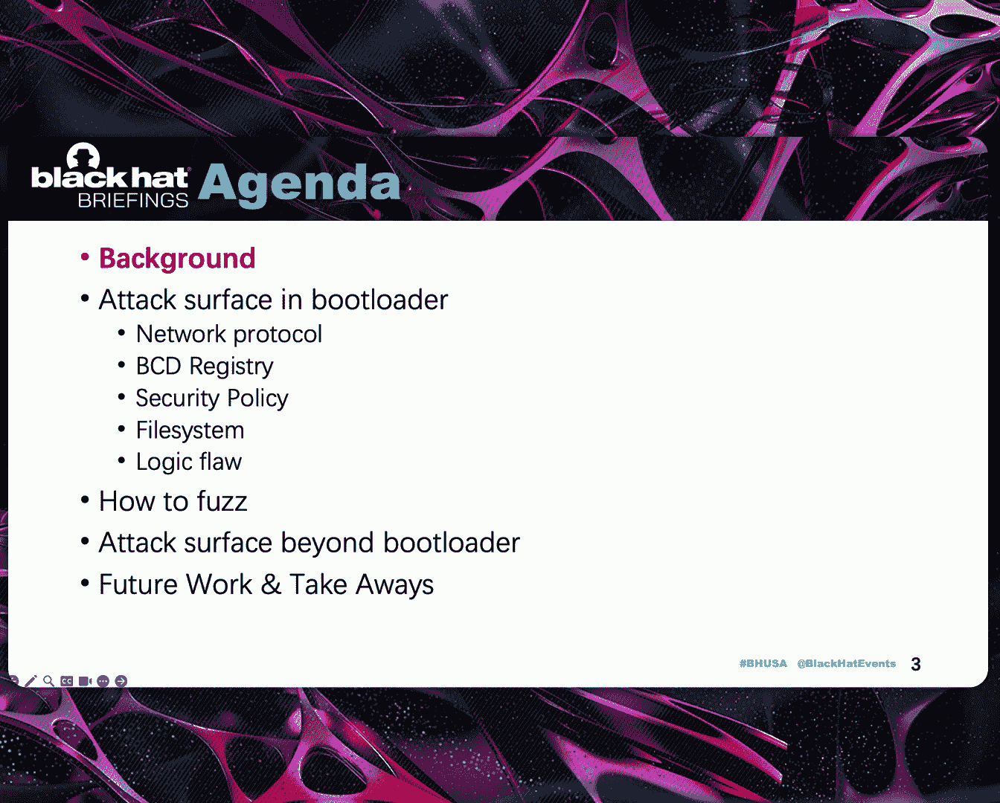

首先，我会介绍一些背景信息，例如什么是 SecureBoot，以及我的研究与以往研究有何不同。我将介绍基于模糊测试减少重复报告的方法，并讲解理解引导加载程序中漏洞所需的基础知识。

然后，我们将深入探讨我发现的多个攻击面以及针对这些攻击面的关键研究。

之后，我会介绍如何在环境中设置模糊测试框架。

最后，我们将探讨引导加载程序之外的攻击面，并进行总结与要点回顾。

## 研究背景与动机

在深入技术细节之前，让我分享一下这项研究是如何开始的。

作为一名安全研究员，我们总是被未知领域所吸引。对于 SecureBoot 而言，它是三个因素的完美结合：未知的领域、基础的重要性以及现实因素。这种结合使其成为一个极具吸引力的目标。相比之下，引导过程本身没有更高的安全要求。

因此，根据我的理解，SecureBoot 使用数字签名和加密哈希来建立从硬件到操作系统的信任链。你可以看到它在移动设备锁定实现中的应用，例如 iOS 和 Android 内核的各种实现，这些实现将设备锁定为仅运行硬件信任的代码，这通常是硬件制造商或操作系统供应商提供的引导加载程序和操作系统。

在 PC 平台上，操作系统供应商通常不是硬件供应商。借助 UEFI 标准，可以将 SecureBoot 功能引入 PC 平台。

虽然移动电话更贴近我们的日常生活并持有更多隐私数据，因此你可以看到每部手机都默认启用了 SecureBoot。它非常重要，以至于如果你试图破坏手机的 SecureBoot，它会警告你手机不可信。在 Windows 操作系统中，近年来也有一些功能要求强制执行 SecureBoot。

但坦率地说，PC 平台还有很长的路要走，因为有太多的硬件制造商，很难让每个硬件制造商都投入精力。

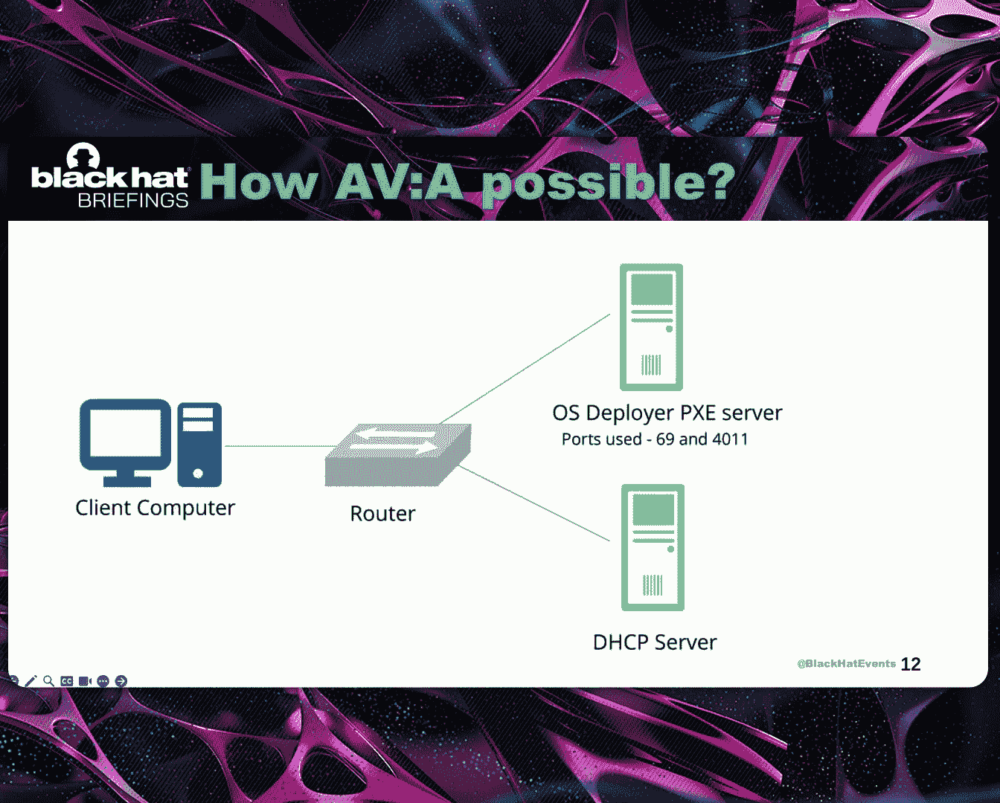

回到我们的主题，“深入漏洞”。那么，是什么造成了这些漏洞？

首先你需要知道的是，我所有的发现目前仍然可以通过网络在 PC 平台上默认被利用。这主要是因为 PC A 2011 第三版是 UEFI 标准中的默认设置，并被无数主板制造商和虚拟化平台使用。

它的有效期到 2026 年。它的前身已经通过 Windows 更新默认部署在 Windows 机器上，但由于兼容性问题，PC A 2011 并未被添加到黑名单中，正如微软安全响应中心的 Bill 在去年的 Black Hat 演讲中所解释的那样。

此外，UEFI 黑名单的限制也较少。因此，所有这些条件使得这些 Windows SecureBoot 漏洞能够被利用，这是时间上的漏洞。

## 先前研究与现状

让我们回顾一下之前关于 Windows SecureBoot 的研究。你可以看到，它们主要关注需要本地或物理访问系统的攻击服务。在过去的 10 年里，只有 8 个关于 Windows SecureBoot 的 CVE。与其他 Windows 组件相比，这个数字很小，对吧？

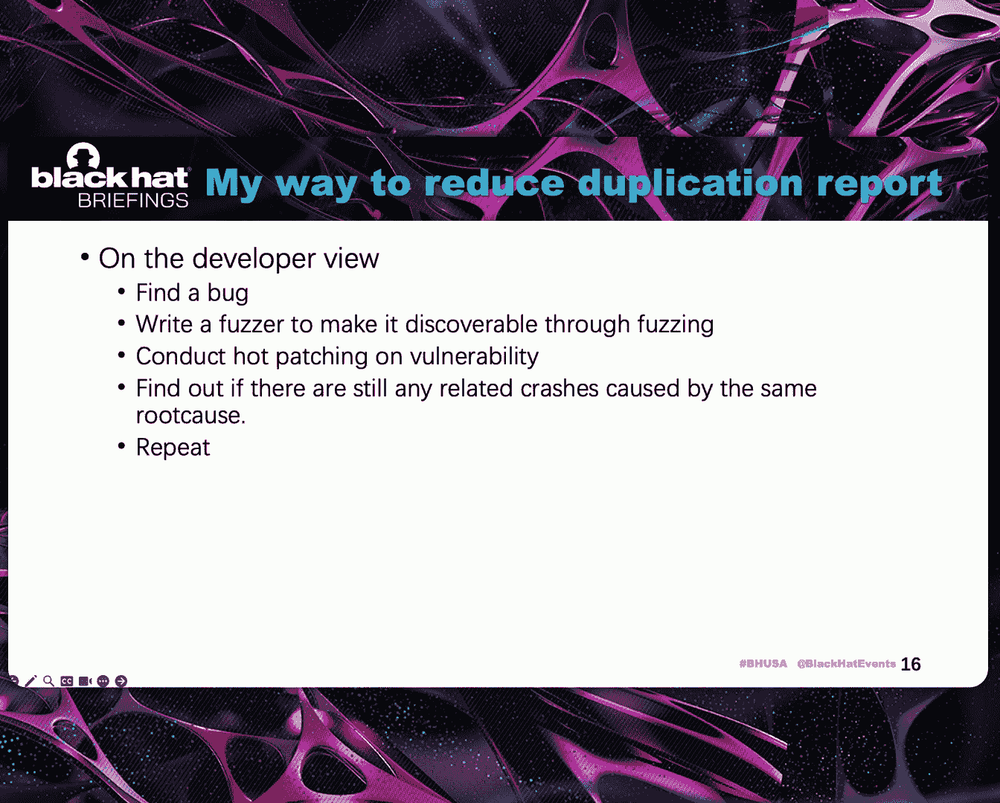

在这仅有的 8 个 CVE 列表中，有两个著名的漏洞拥有自己的名字。最著名的 CVE 是被 Black Lotus 恶意软件使用的两个。

这里有一份由微软安全响应中心发布的关于我的发现的公开致谢列表。你可以看到，与之前的研究相比，我的发现数量非常大，并且它们可以通过网络被利用。因此，在过去 10 年里，我发现了近 60% 的 Windows 操作系统 SecureBoot 安全特性绕过漏洞。

有时我看着我的研究，会想，这真的重要吗？它是否带来了任何改变？然后我看到了这样的反馈，这让我想起了我为何要继续前进。

## 漏洞为何能通过网络利用？

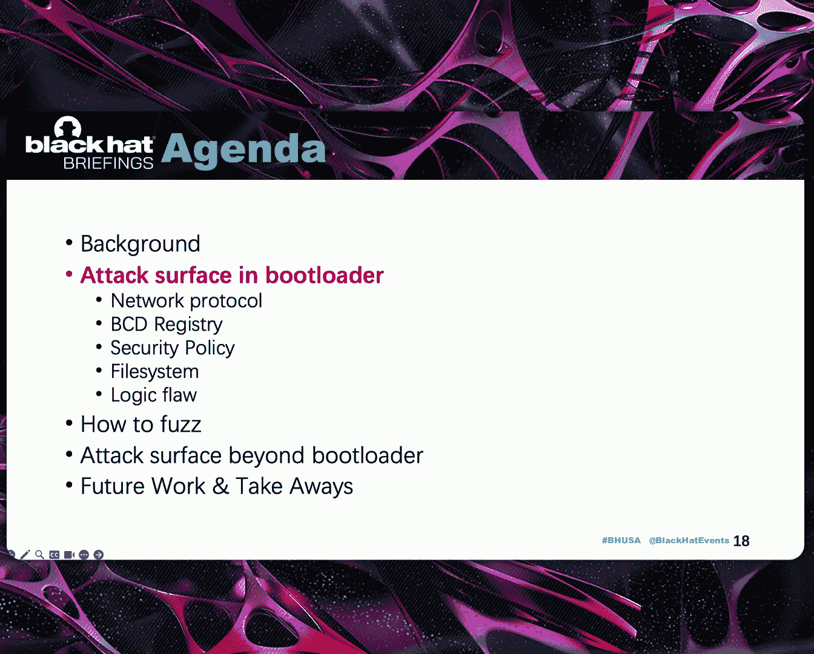

在这里，我想请大家注意一个名为 PXE 的协议，即预启动执行环境。PXE 是一种标准化的客户端-服务器模型，支持网络引导。与我之前提到的由其他研究人员发现的 9 个漏洞不同，我在研究中发现的漏洞更容易利用，其复杂性不高，并且不依赖于特定的硬件供应商。

## 漏洞性质与影响

既然有这么多安全特性绕过漏洞，你一定会有疑问。这些漏洞是关于什么的？微软安全响应中心向我解释说，在 SecureBoot 之前，微软不承认引导加载程序中的漏洞。引导加载程序问题可以获得 CVE。因此，SecureBoot 是 Windows 的一项安全功能。所以，Windows SecureBoot 中的漏洞属于安全特性绕过。因此，它可以是远程的，可以无需用户交互，可以是临时的，可以是远程代码执行或信息泄露，但不能是拒绝服务。他们不认为这是一个安全问题。

关于我的发现的影响，它可以用来攻击大多数启用了 UEFI SecureBoot 的 PC，而不管平台上运行的是什么操作系统。但在现实世界中，主要是 Linux 和 Windows。通常，这两个系统需要经常重启，并且有许多环境利用磁盘环境，这些环境默认使用 PXE 作为选项。这些环境默认就处于真实风险之中。因此，攻击可以通过 B.Y.O.B. 实现，即“自带引导加载程序”。

## 研究成果总结

以下是我的研究成果总结。在研究期间，我向微软提交了 55 份报告，详细说明了在微软代码中发现的各种漏洞。

从图表中可以看到，按发现方法分类，共有 35 个案例是通过代码审计发现的，20 个案例是通过模糊测试发现的。按攻击面分类，有 25 个案例与 BCD 注册表处理相关，16 个案例与文件系统相关，6 个案例与网络协议相关。还有 5 个案例发生在 Windows 内核中。

## 减少重复提交的策略

在我的研究中，我面临的第一个挑战是如何减少提交的重复性。我的方法是从开发者的角度来考虑这个问题。首先，我会发现漏洞。然后，我会尝试编写一个模糊器，通过模糊测试来发现漏洞。最后，我会对漏洞进行热补丁修复。

如果热补丁成功，应该不会再出现与同一根本原因相关的案例。我会重复这些步骤，直到模糊器无法再生成崩溃为止。

## 引导加载程序内存管理基础知识

在深入探讨攻击面之前，有一个关键知识点需要记住，以便我们未来在引导加载程序上开展工作。那就是引导加载程序中的堆管理。

与 Windows 用户模式相比，引导加载程序中没有页面堆。这意味着在发生越界访问时，它不会立即崩溃。相反，它会在下次使用损坏的数据时，或者在堆管理代码进行垃圾回收时崩溃。

我非常惊讶地发现，堆损坏报告函数本身存在自递归问题，但这并不重要，因为栈溢出理论上不会使堆越界更容易被利用。

此外，你需要知道块大小至少为 32 字节，并且按 32 字节对齐。

## 引导加载程序中的攻击面

现在，让我们进入引导加载程序中的攻击面部分。

### 网络协议攻击面

我们首先介绍引导加载程序中的网络协议。在我的研究中，使用了多种网络协议，包括 IPv4、IPv6、TFTP、HTTP 和 WDS 多播。我发现协议栈是引导加载程序中最安全的部分。在引导加载程序协议栈中，我只发现了 6 个漏洞。

这包括引导加载程序中处理 IPv6 响应包时的两个栈溢出、处理 TFTP 时的一个递归调用、处理长路径自加载时的一个递归调用，以及引导加载程序中处理 HTTP 响应时的一个整数下溢。此外，在 IPv6 协议栈中还有一个中等严重性的拒绝服务漏洞。从这个拒绝服务漏洞可以看出，微软引导加载程序的 IPv6 代码尚未准备好投入生产。

这张图向你展示了 IPv4 PXE 引导阶段。这张图展示了 IPv6。

我花了几个小时将这张图实现为 Python 代码。它是引导加载程序研究中一个非常好的参考起点。

### 搭建研究环境

在开始研究实际案例之前，我们需要为研究搭建一个易于复现的环境。Hyper-V 绝对是漏洞挖掘的好帮手，因为它是唯一一个无需入侵虚拟机就能生成小型转储文件的工具。

它还支持在固件上进行 IPv6 PXE 引导。根据文档，很容易找到指南，教你如何使用 PowerShell 为 PXE 引导选择特定的 IPv6。

你可以看到，小型转储生成代码在 VMWP 进程中。如果你想实现完整转储或使其在 KVM 中工作，需要做同样的工作。我还没有做，因为 Hyper-V 的小型转储对于研究来说已经足够了。你可以获得关于漏洞的非常详细的堆栈跟踪，以及可能的根本原因分析。小型转储在许多情况下都很有帮助，但当缓冲区溢出只影响堆块之后的几个字节时，它通常不起作用。

你也可以准备一个 VMware ESXi 环境，因为 VMware 是现实世界中的虚拟化领导者。

### 实际漏洞案例：栈溢出

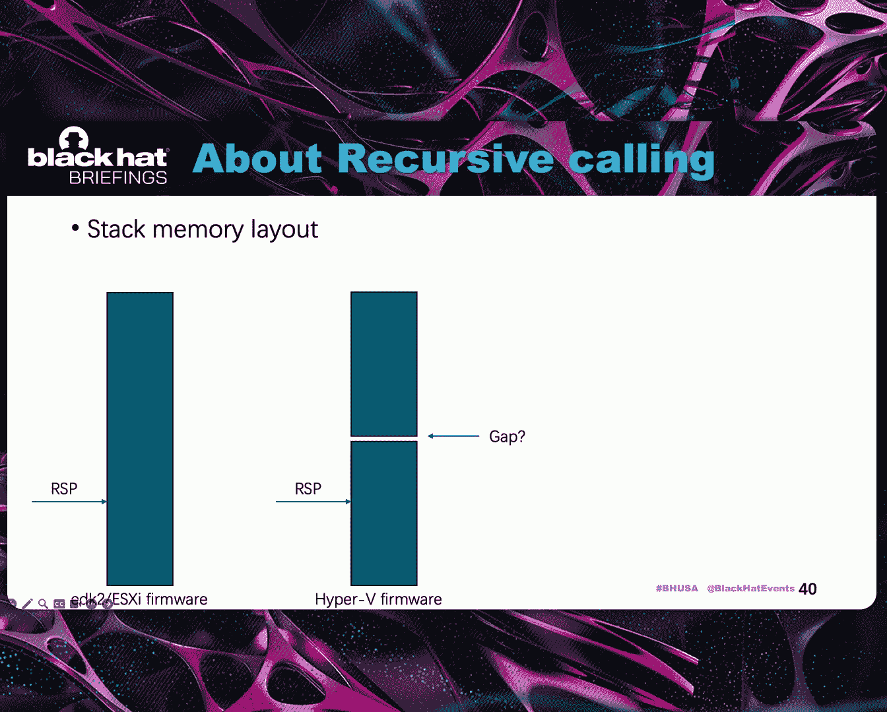

现在，我们将看到引导加载程序中的真实漏洞，从一个简单的 PXE 引导加载程序栈溢出开始。

这两个漏洞的根本原因是函数未能检测到客户端/服务器标识符长度过长，而目标数组只有 16 字节。然后它会覆盖父函数栈上的变量。这是一个非常简单的案例，非常老派，然而它存在了很长时间。所以我认为我们可以从中学习到的是，当你查看一个攻击面时，需要确保没有遗漏任何组件。顺便说一下，在 PXE 引导加载程序之前，没有漏洞只存在于其中。因此，选择一个尚未引起所有人注意的目标很重要。你可能会在其中发现简单的漏洞。这可以为你赢得信心。我认为这是进行研究时最重要的事情。

成功利用这两个漏洞将使攻击者能够控制 IP 和一些其他寄存器。攻击者随后可以发起 ROP 攻击。我们将在后面的部分讨论为什么这种利用如此容易。

### BCD 注册表处理攻击面

我们刚刚讨论了网络协议。接下来，我们将讨论 BCD 元素处理漏洞。

之前已经有两次关于 BCD 注册表溢出的演讲。所以我们简要介绍一下。BCD 是一个注册表存储库，可以通过 Regedit 分配和添加。

在我的研究中，模糊器只发现了一个与注册表文件结构相关的漏洞，就是这个函数中的越界写。同样，这非常老派。可能你们大多数人都知道，来自 Project Zero 的 Ju 近年来在 Windows 内核中发现了大量的注册表漏洞，但引导加载程序中的注册表要简单得多。它不支持完整版 Windows 注册表中的许多功能。它只是一个简单的配置存储库。然而，一个简单的模糊器在 2023 年仍然能找到东西。

在引导加载程序的注册表解析代码中，这很神奇。我不会手动查看注册表解析代码。那对我的水平来说太复杂了。

有两个工具叫 BCDedit，可以生成各种对象模板。当你计划在 BCD 注册表中寻找漏洞时，它非常有用。

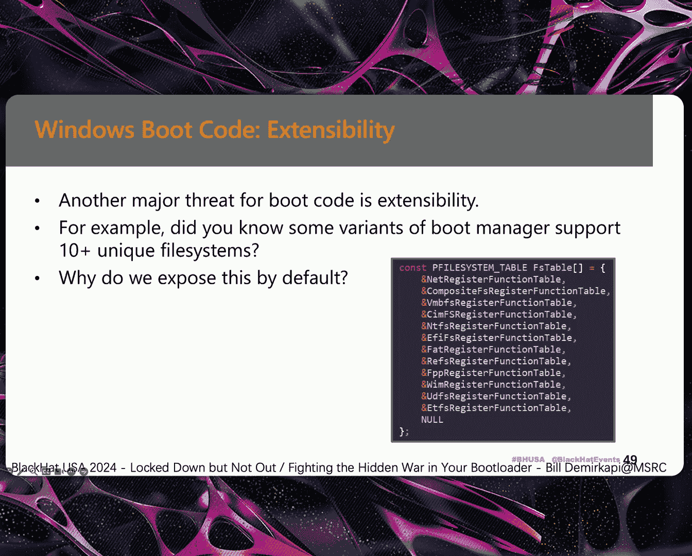

BCDedit 的用法没有完全记录。有一些实际用法你只能通过逆向工程 BCD 代码来发现和理解。在我的研究中，我发现这个网站上的 BCD 元素页面非常有帮助。如果你真的想深入研究引导加载程序中的 BCD 元素处理代码，你不会想错过这份资料。

在引导加载程序中，有一个关键结构称为引导环境设备，它反映了 BCD 注册表元素的内部二进制数据。通过逆向工程，我们看到二进制格式数据在解包时会被检查。

但似乎横幅的内容没有被完全检查。

引导环境设备类别有一个关键类型。`BL_DEVICE_TYPE` 是你研究 BCD 元素处理代码的灯塔。请牢记这个类型，并带着它继续前进。

### 关键漏洞函数分析

在处理来自 BCD 注册表的数据时，有一个神奇的函数。为什么说它神奇？从它的名字可以看出，它应该被设计用来消除攻击者控制数据中的非法设备对象。

然而，这个函数本身太有价值了。它只有大约 100 行代码。我在其中发现了 6 个漏洞。

这包括两个可以覆盖返回地址的栈溢出、一个任意内存写和三个堆越界写。所以，简单的模糊器在这个函数中产生了第一次崩溃，我逆向了这个函数并发现了另外两个漏洞，并在研究引导加载程序的早期就报告给了微软。实际上，在我开始研究 BCD 解析的初期，我并没有意识到它是可以通过 Regedit 添加到半文件中的标准写入二进制数据。所以在我面前是一个未记录的结果。它是一团糟。基于此，你可以修改的数据非常有限。大约一个月后，当我在引导加载程序中找不到更多漏洞时，我意识到数据可以通过 Regedit 修改。我回过头来查看这个函数内部是否还有其他漏洞，并在其中发现了另外三个堆越界写。

但微软安全响应中心告诉我，这三份报告是一份内部报告的重复，那份内部报告获得了 CVE-2024-26175。事实上，这个 CVE 在 2024 年 4 月被确认并修复。他们澄清说他们已经实施了设计层面的更改来解决所有问题。

所以我深入询问。工程团队在哪里实施了这种设计层面的更改？我得到了两个函数名，它们有 88% 的调用相似度。

所以我的想法是：也许工程团队在我报告那三个堆越界案例之前更改了函数名。当他们收到那三个堆越界报告时，他们找不到我报告的函数名了。所以他们向我解释说，它们已经被一个设计层面的更改修复了。但这只是我的猜测，因为我在 2023 年报告了这个案例，而 CVE 是在 2024 年。我不知道当我被告知是重复时是什么情况。

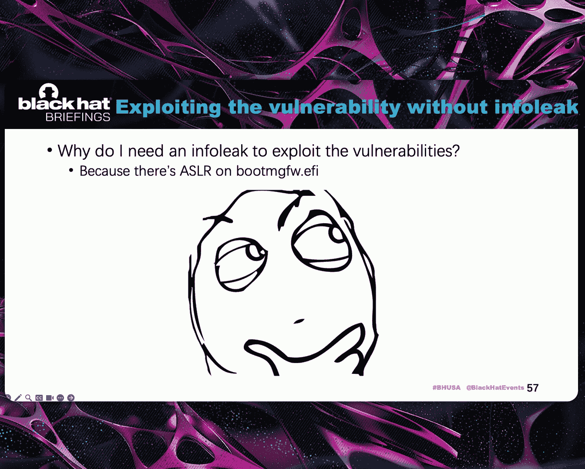

从我之前的介绍中，你可以看到这些漏洞很简单。你只需要添加边界检查来防御它们。它们太简单了，工程团队不会错过。这里又有了另一个想法：如果他们从一开始就不知道这三个报告的根本原因呢？

所以我尝试在打了补丁的引导加载程序上运行越界写漏洞验证代码。它确实触发了我报告的漏洞。它触发了堆损坏，正如你在屏幕上看到的那样。

在向微软安全响应中心报告此事后，我收到了关于案例重复的合理解释。我要特别感谢微软安全响应中心的明星员工在整个过程中的工作。我认为我们能从中学到的最重要的一点是，如果你在同一组件中有大量漏洞，当补丁发布时要非常小心。不要偷懒，只需在补丁 1 上测试你的验证代码。我想，如果我在补丁发布时进行复查，也许我能在列表中获得更多 CVE。

### 递归调用漏洞

两个 BCDedit 工具只是我大多数提交的提示和模板。当你深入研究并尝试利用更复杂的漏洞时，BCDedit 将超出其能力范围。这是这种情况的另一个例子。它的根本原因是在模拟元素时发生了递归调用。

关于递归调用，有一些重要的事情你需要知道。与用户模式的递归调用通常导致用户模式的拒绝服务不同，在 UEFI 环境中，它是高度可利用的漏洞。在尝试利用引导加载程序中的栈溢出之前，你应该了解 EDK2 UEFI 栈内存布局。

在标准的 EDK2 内存模型中，UEFI 栈之前的红色区域内存大小是 Hyper-V 中的两倍，尽管它与 UEFI 标准中的栈大小相同。在 Hyper-V 中，栈内存区域之前似乎有一个不是红色的间隙。在 UEFI 定义中，不能保证栈内存之前的内存不是红色的。因此，这将把递归调用变成栈越界写，而这种越界写将有能力覆盖 UEFI 环境中的中断栈或一些关键变量。

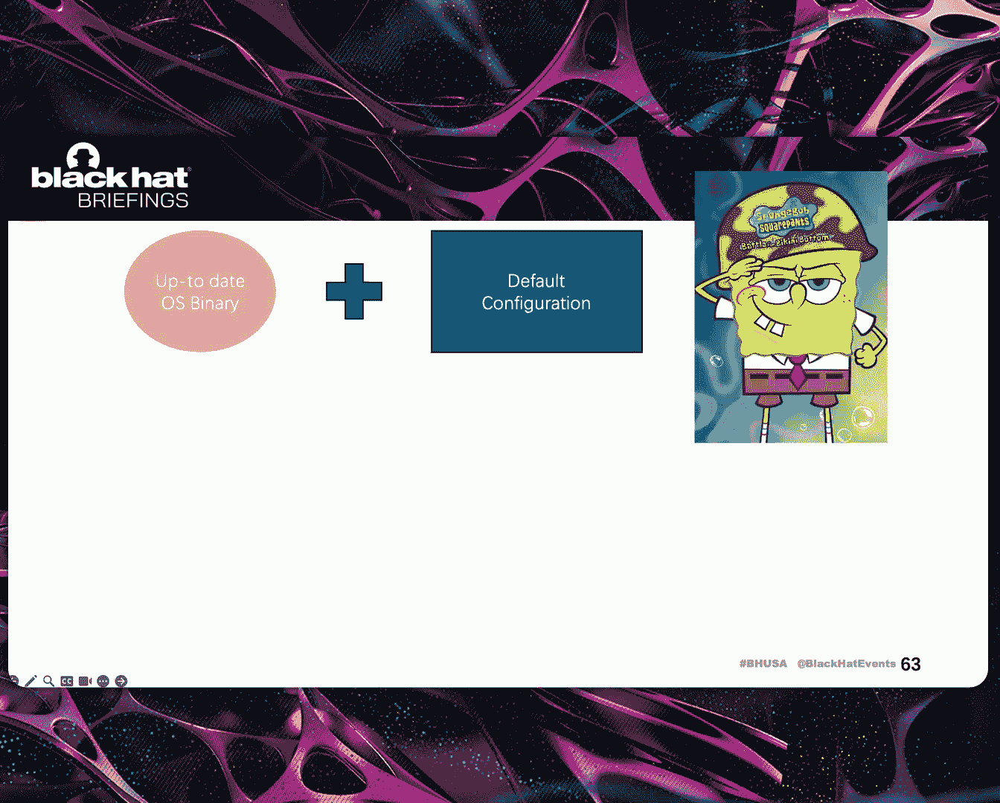

导致一个高度可利用的漏洞。从这张图片中，你可以看到当引导加载程序中发生递归调用时，它最终会覆盖 UEFI 环境中的一些关键变量，导致另一次访问违规。

如果你尝试在标准内存布局中手动利用这些漏洞来暴露这些漏洞，我会感谢你的耐心。你需要包含 415 个设备对象在 BCD 注册表文件中。即使在半虚拟化内存模型中，你也需要包含 226 个设备对象。

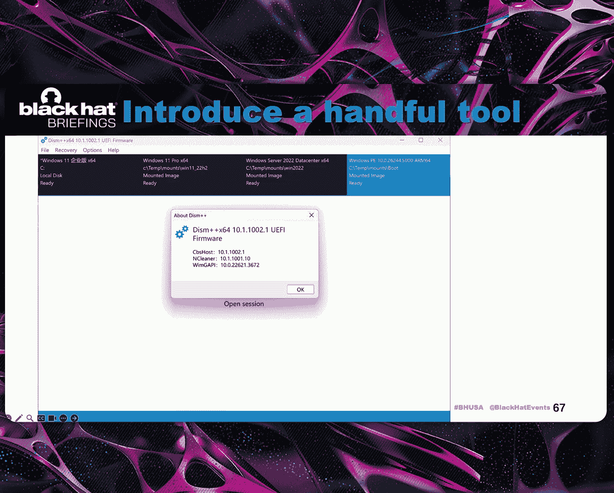

在这种情况下，我想强调编写一个能让你生活更轻松的程序的重要性，因为 BCD 注册表本身就是一个注册表。你可以在 Windows 上通过注册表 API 加载和修改它。你可以简单地编写一个像这样的程序来测试递归调用的崩溃边界。

### 安全策略相关漏洞

此外，这里还需要考虑另一个协议问题。

你只能通过利用特定的 BCD 元素来指定使用 HTTP 协议的引导加载程序。

大多数漏洞都围绕着数据应该至少有一定长度的假设，这是不正确的。在这种情况下，你需要根据假设检查攻击者控制的数据。

好了，关于 BCD 元素处理我们已经谈得够多了。让我们继续讨论安全策略。

这是微软关于 UEFI 平台初始化 2 规范的一个非常有趣的公开文档，非常重要。

正如你从我之前的幻灯片中看到的，最后一句话是不正确的。攻击可以通过 B.Y.O.B. 实现，即“自带引导加载程序”攻击。

因此，与策略相关的代码仍然存在于最新的 Windows 引导加载程序中。这看起来就像后门，只有拥有有效微软签名策略的人才能利用。我某种程度上能理解为什么这是设计使然。当你有能力正确发送所有内容时，为什么不直接签署一个引导加载程序呢？

另一个是我在研究期间提交的唯一一个安全特性密钥绕过漏洞。我的意思是，这不是内存损坏。它是逻辑性的，易于利用。它存在是因为引导加载程序从引导设备获取引导管理器 PE 文件进行验证。当执行代码时，PE 文件已经加载到内存中。然而，当引导由 PXE 启动时，它们会再次获取。远程服务器不可信。

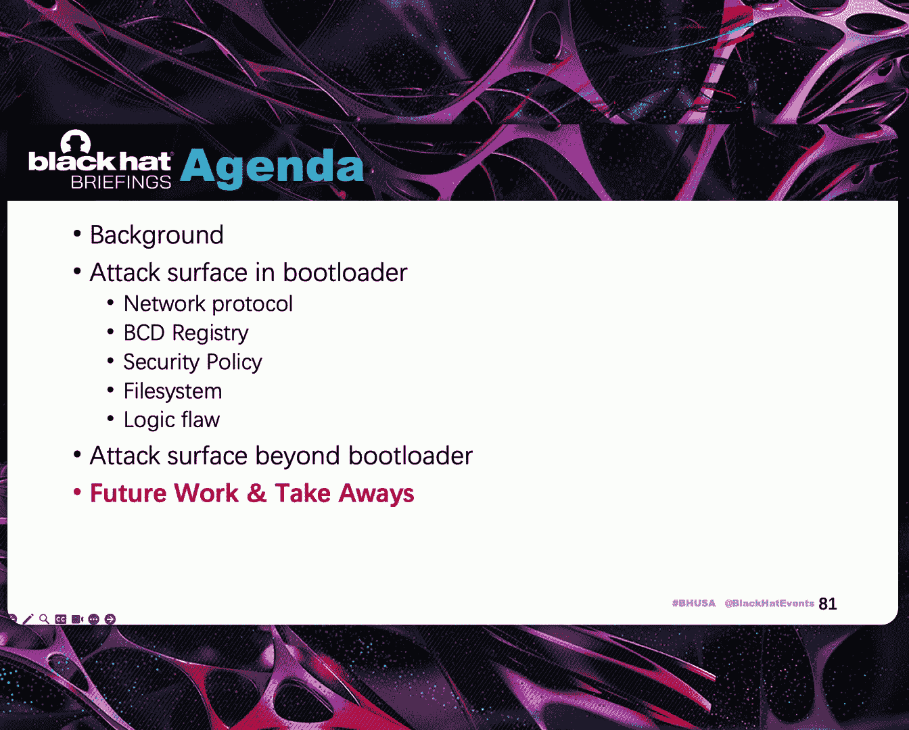

因为它可以为验证提供一个有效的镜像，而为实际运行提供一个无效的镜像。类似的逻辑案例确实存在于其他产品中，比如手机，但它需要更受限制的环境才能利用。所以每个人都会犯错。

在你真正想研究类似组件之前，查看其他研究非常重要。

### 文件系统攻击面

去年，微软安全响应中心的 Bill 向我们提出了这个问题。他说文件系统是那些喜欢红色模糊测试的人的天堂，并问为什么默认暴露这么多文件系统。但今天，我们不打算讨论不必要的文件系统。我们只讨论现代 Windows 中引导加载器正常工作所必需的文件系统。

即 WIM 和 NTFS，并提供一些针对文件系统的模糊测试技巧。

这是另一个神奇的示例，函数名中带有“fix”。奇怪的是，我们在一个名字中带有“sanitizing”的函数中发现了 6 个 RCE。这次，我在这两个函数中识别出了 5 个 RCE。它们的名字中都有“fix”这个关键词。同样，它们非常老派，不难发现。我们真的花了时间查看正确的函数。

这些发现都始于引导加载程序中文件系统的一个简单模糊器。在审查结果列表时，事实证明，模糊器更擅长发现和生成拒绝服务案例，而不是内存损坏案例。分析文件系统中的拒绝服务非常痛苦，因为它有太多这样的案例，而且引导加载器中的拒绝服务案例属于中等严重性。将时间花在分析拒绝服务上是一种浪费。

### 文件系统模糊测试设置

所以在这里，我将向你介绍如何在 Windows 引导加载器中设置文件系统模糊测试。我使用 AFL++ 的 NYYX 模式开始我的模糊测试设置，因为使用 NYYX 模式，我不需要关心当前集合。是的，你需要一个现代英特尔处理器来运行模糊器。

这是我设置模糊测试调用的方法，分配一些部分来保存模糊测试所需的必要代码和数据，并修补引导加载器中的必要函数以进行快速插桩。

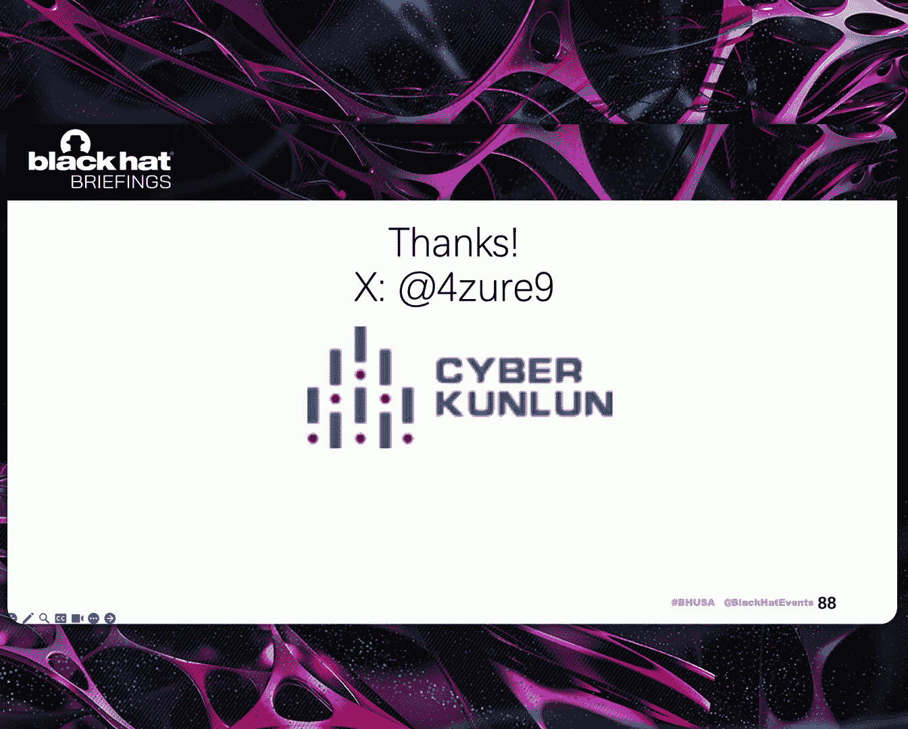

关于文件系统模糊测试，在你真正开始之前，有一个关键点你应该知道。文件系统本身是一个代码覆盖率放大器，因为模糊测试使用代码覆盖率基本块来计算代码覆盖率，并且为了到达代码中的相同逻辑，所有路径都可以引导你到达罗马，你会在真正对