# 课程 1：攻击 Windows Server 故障转移集群 - 集群化的故障点 [FSRmPwfMYs0] 🎯

在本节课中，我们将学习 Windows Server 故障转移集群的工作原理、其安全风险，以及攻击者如何利用集群配置中的弱点。我们将从基础概念开始，逐步深入到实际的攻击路径和防御策略。


---


## 概述 📖


故障转移集群旨在为关键应用（如文件服务器和数据库）提供高可用性。然而，这种设计也引入了独特的安全风险。我们将探讨集群的架构、身份验证机制，以及如何从控制单个集群节点升级到控制整个集群甚至整个域。


---

## 集群简介与历史背景 🕰️


为了理解故障转移集群，我们需要回溯到1997年。当时，微软在“可扩展性日”活动中发布了 Windows NT 4.0 Enterprise Edition，并引入了 Microsoft Cluster Server（MSCS）。这是微软首次涉足高可用性领域。

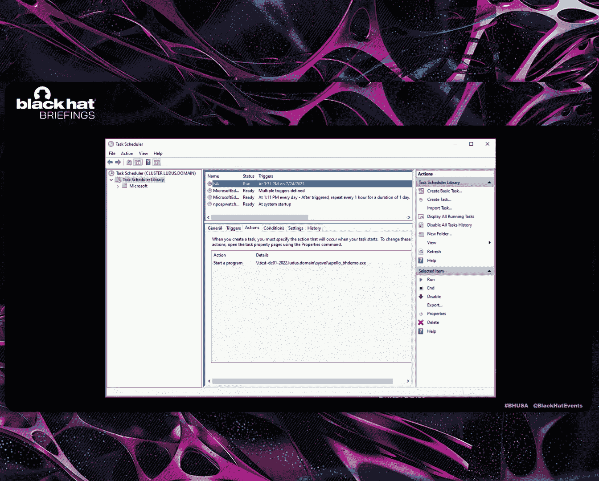

微软对 Windows Server 故障转移集群的当前定义是：一组独立的计算机协同工作，以提高应用程序和服务的可用性。三十年来，这项服务的核心目标没有改变。

最常见的集群化应用和服务是文件服务器和数据库。这两者都代表了单点故障。如果它们离线，就会失去对这些资源的访问。

集群通过让多台服务器支持单一资源来解决这个问题。如果一台服务器失效，另一台服务器会接管该资源。


---

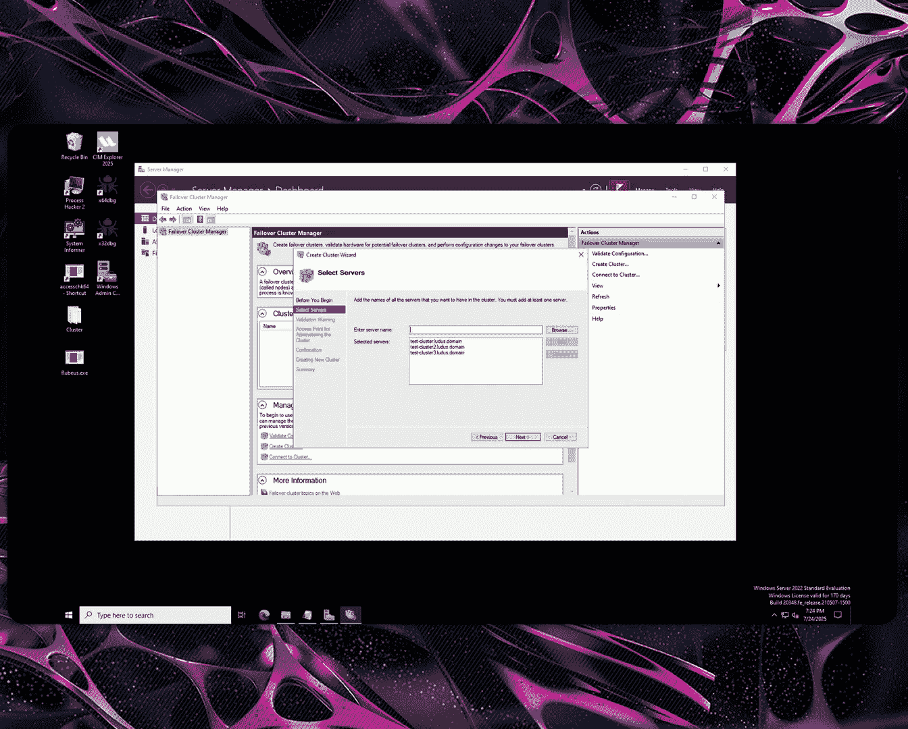

## 故事时间：一次攻击中的异常发现 🔍

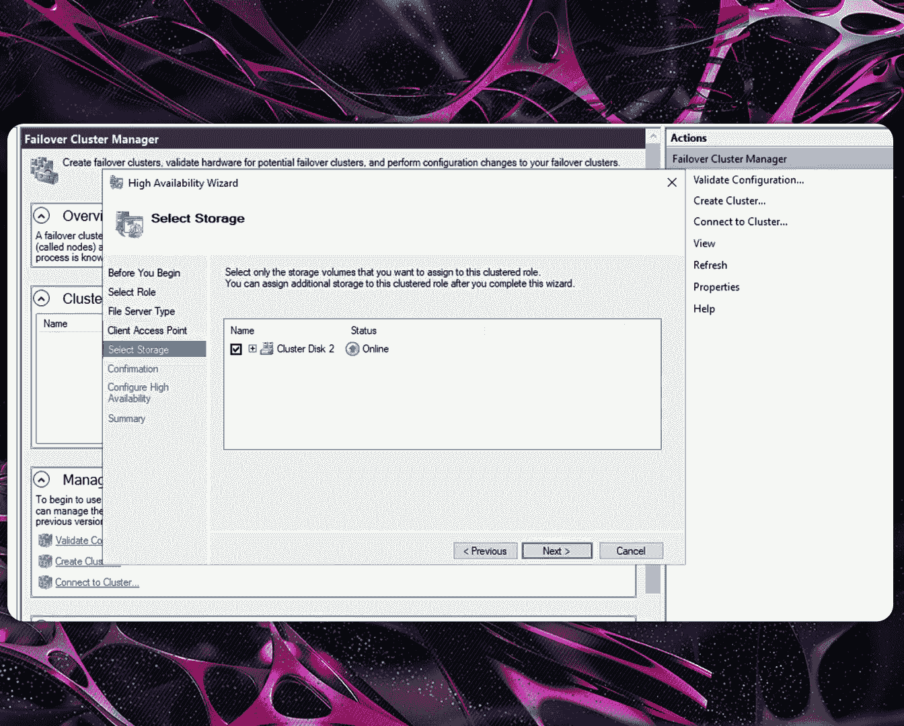

上一节我们介绍了集群的基本概念，本节中我们来看看一个真实的攻击案例，它揭示了集群行为的复杂性。

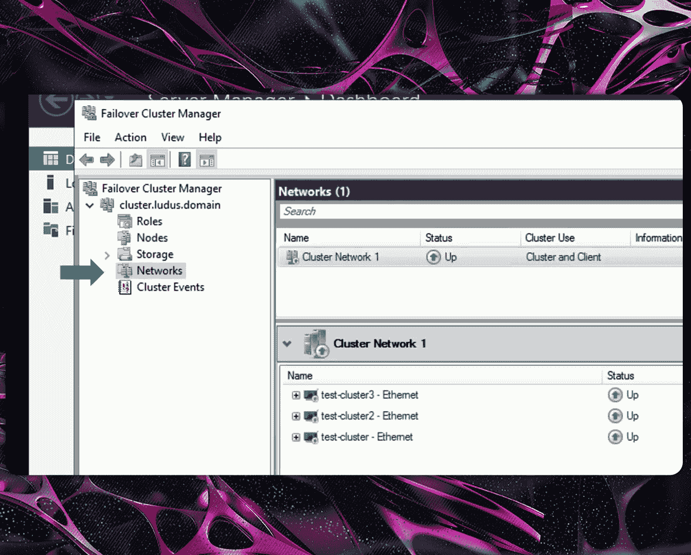

在一次内部测试中，攻击者控制了一台机器账户，并试图利用“msDS-AllowedToActOnBehalfOfOtherIdentity”属性（即基于资源的约束委派，RBCD）来攻击另一台主机。他们按照标准流程设置了 RBCD，并尝试使用 Impacket 等工具进行攻击，但都失败了，出现了主机名解析错误。


然而，当他们转而使用计划任务（Scheduled Tasks）时，攻击成功了。但奇怪的是，他们发现有效负载执行在了另一台完全不同的主机上，而他们最初的目标用户会话也存在于这台新主机上。

这引发了一系列问题：
*   为什么计划任务能成功，而 Impacket 脚本会失败？
*   我们能否预测或控制有效负载将在哪台主机上执行？
*   会话数据是怎么回事？是账户到处登录，还是其他原因？
*   集群环境下的 Kerberos 身份验证是如何工作的？


---

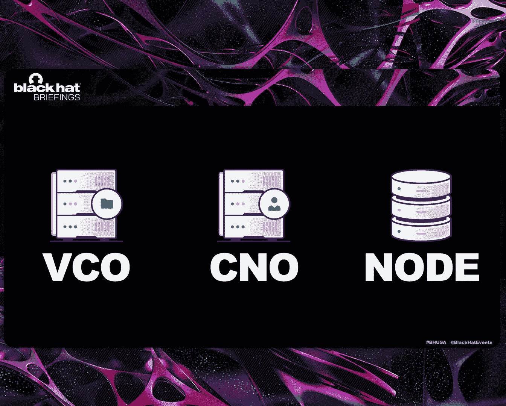


## 深入研究：搭建实验环境 🧪


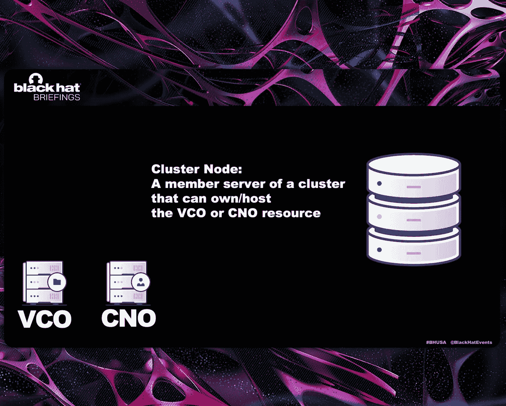


为了找到答案，我们搭建了一个实验环境。我们创建了一个三节点集群，并部署了一个文件服务器角色。

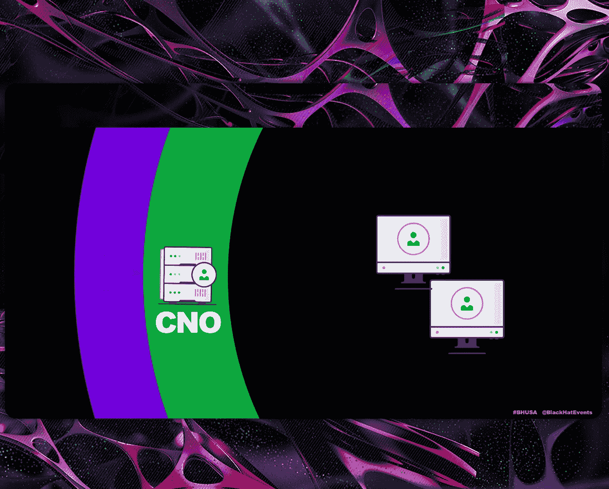


以下是创建集群和角色的关键步骤：
1.  在“故障转移集群管理器”中创建新集群。
2.  添加所有节点计算机。
3.  为集群管理创建一个访问点，并指定集群名称和 IP 地址。
4.  创建角色（例如文件服务器），为其创建客户端访问点，并分配存储。

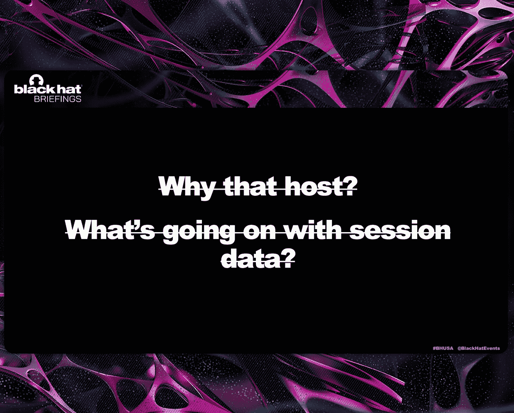


完成这些后，我们就有了一个正常运行的集群。每个节点都安装了一个“网络容错虚拟适配器”，用于节点间通信。集群使用 UDP 3343 端口进行心跳检测，使用 RPC（端口 135 及动态端口）进行管理通信。

通过分析网络流量，我们发现了第一个问题的答案：管理工具（如计划任务 MMC 管理单元）能够正确解析集群的虚拟主机名，而一些 Impacket 脚本在尝试写入文件时，会因为无法在虚拟命名空间上找到有效路径而失败。使用不依赖文件输出的命令可以解决这个问题。


---

## 集群的逻辑组件与 Kerberos 谜题 🧩

上一节我们搭建了实验环境，本节我们来深入理解集群的逻辑组件，并解开 Kerberos 身份验证的谜题。

集群包含几个关键逻辑组件：
*   **节点**：构成集群的物理或虚拟服务器。
*   **虚拟计算机对象**：代表集群服务（如文件服务器）的 Active Directory 计算机账户。
*   **集群名称对象**：代表集群本身的 Active Directory 计算机账户。


在任何时候，一个 VCO 或 CNO 资源只能由一个节点“拥有”。客户端连接到 VCO 的命名空间来访问服务（如文件共享），而管理员则连接到 CNO 的命名空间进行管理。


这解释了第二个和第三个问题：有效负载在哪台主机上执行取决于当时哪个节点是资源的所有者。BloodHound 报告的会话数据是准确的，因为它通过虚拟主机名查询，实际响应的是底层所有者节点。

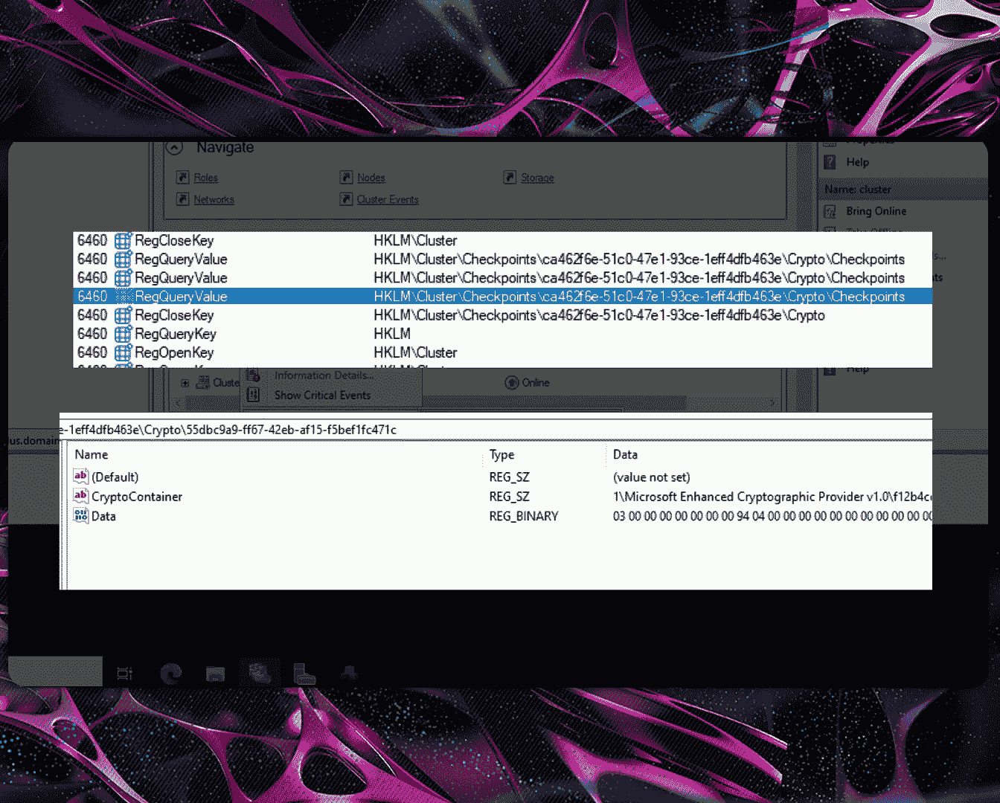

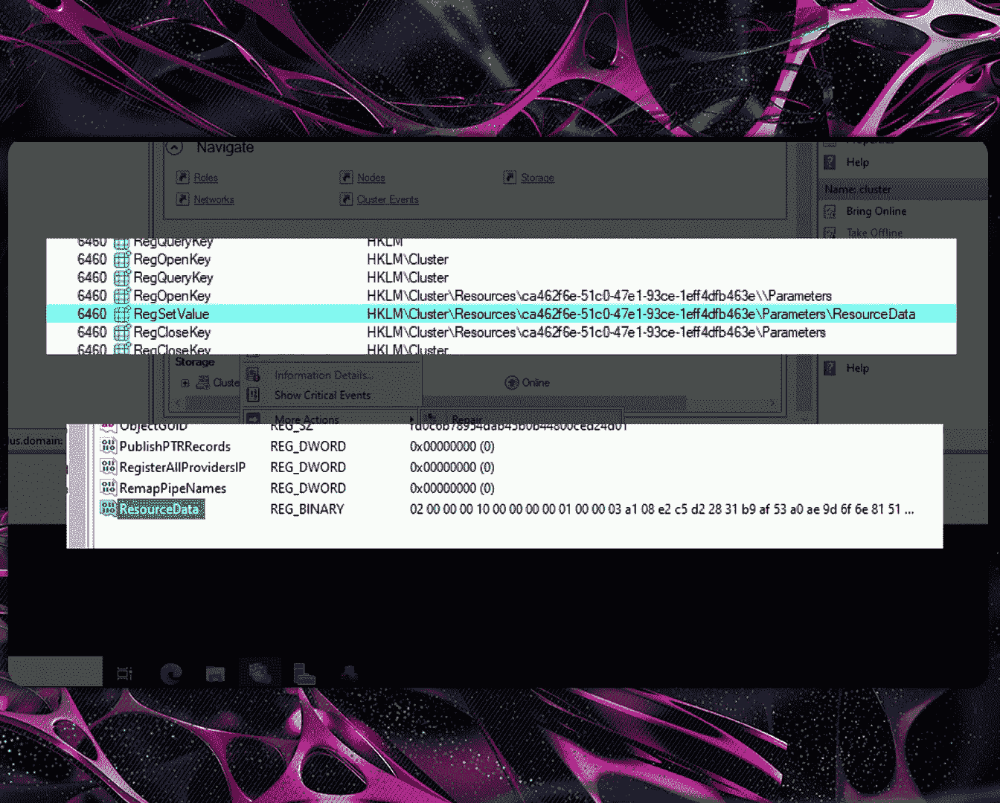

但最大的谜团是 Kerberos。在标准 Kerberos 流程中，服务票证使用目标服务账户的密码进行加密。攻击者无法解密。但在我们的攻击案例中，一个主机（节点A）生成的票证，却被另一个完全不同的主机（节点B）成功解密并接受了。

这意味着所有集群节点似乎都能访问 VCO 和 CNO 的密码。经过研究，我们发现密码存储在集群数据库中（实际上是每个节点上的注册表项），并且使用基于证书的加密进行保护。


通过逆向工程集群服务二进制文件，我们找到了解密这些凭据的方法。关键代码逻辑如下：
```python
# 简化版的解密流程示意
private_key = load_private_key_from_registry()
encrypted_secret = extract_from_resource_blob(data_blob)
derived_key = derive_key(encrypted_secret, private_key)
decrypted_password = decrypt_ciphertext(ciphertext_blob, derived_key)
```


解密后的数据块不仅包含 VCO/CNO 的当前密码，还包含历史密码，以确保密码轮换时不会中断现有连接。


至此，我们得到了最终答案：每个集群节点在启动时，都会用存储在本地集群数据库中的密码，为 VCO 和 CNO 执行一次登录。这样，任何节点在故障转移时都能立即接管服务并处理身份验证。

---


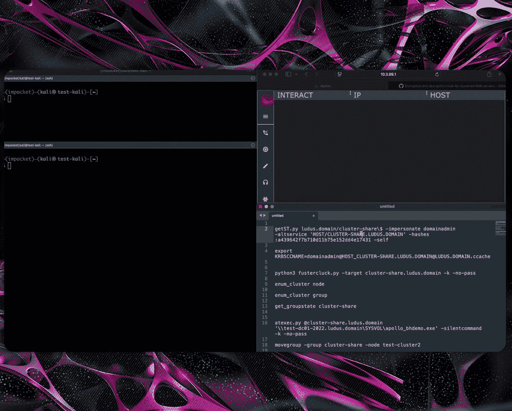

## 攻击演示：从节点到集群再到域 🚀

既然我们理解了机制，那么作为攻击者，在控制一个集群节点后能做些什么呢？

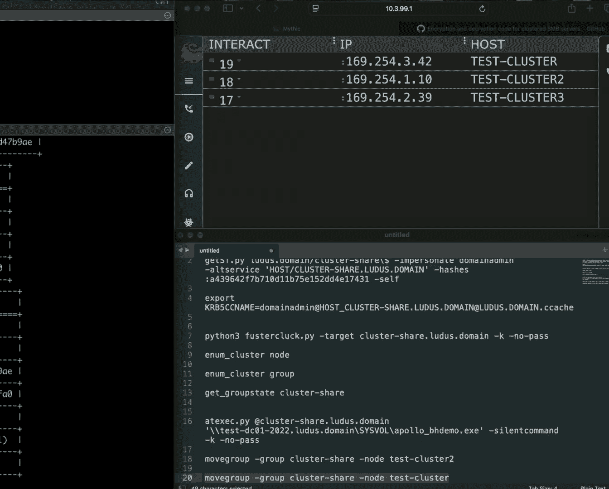

首先，我们可以提取 VCO/CNO 的密码哈希。利用 VCO 的哈希，我们可以执行 **S4U2Self** 扩展，代表任意用户（甚至是受保护用户组的成员）向我们控制的服务请求票证。由于我们就是服务本身，这种请求无法被拒绝。

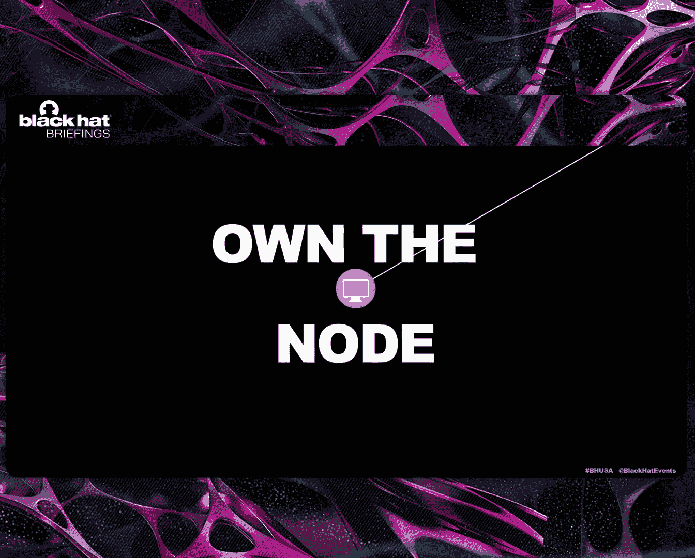


以下是攻击步骤：
1.  使用 VCO 的 NTLM 哈希，通过 S4U2Self 为域管理员请求一张访问文件服务器（VCO）的服务票证。
2.  使用这张票证，通过 RPC 连接到集群管理接口（CNO 命名空间），模拟集群管理员。
3.  枚举集群中的所有节点和角色。
4.  找出当前拥有文件服务器角色的活动节点。
5.  在该节点上通过计划任务执行有效负载。
6.  使用集群管理命令将文件服务器角色移动到下一个节点。
7.  **无需刷新或修改票证**，直接再次执行计划任务命令，有效负载将在新的所有者节点上执行。
8.  重复此过程，即可在所有集群节点上执行代码。


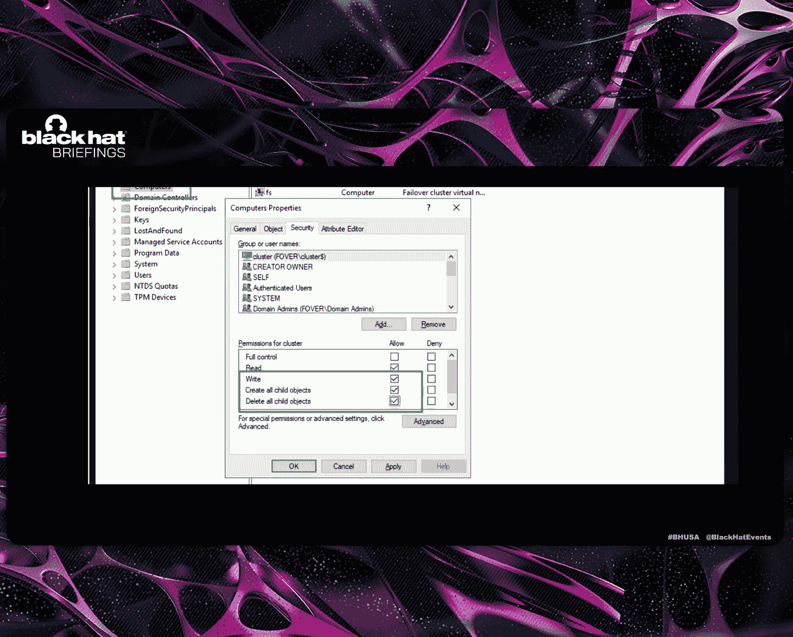

**结论是：如果你控制了一个集群节点（拥有本地管理员权限），你就控制了整个集群及其所有托管的服务。**


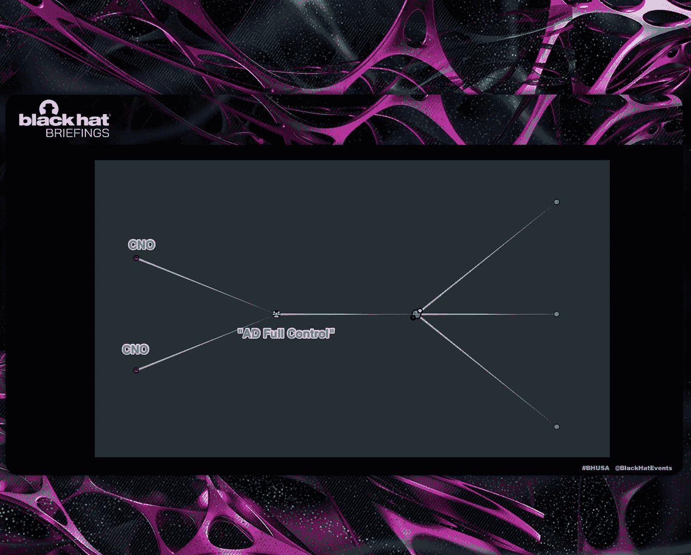

但这还能变得更糟吗？能否从集群控制整个域？这取决于 CNO 账户在 Active Directory 中被授予的权限。根据微软过时的文档和常见的错误配置，CNO 经常被授予其所在组织单元的过多权限，例如“完全控制”、“创建/删除所有子对象”等。


这些过度的权限可能带来灾难性后果。我们看到了多个真实环境中的攻击图：
*   CNO 对某个 OU 拥有通用权限，该权限向下继承，最终导致 **DCsync** 权限。
*   CNO 是某个安全组的成员，该组对域对象拥有完全控制权。
*   CNO 对一台属于“Exchange Trusted Subsystem”的计算机拥有权限。
*   即使权限看似无害（仅能创建计算机对象），结合 2024 年披露的 **Shadow Credentials** 和 **BA Successor** 攻击，也能导致域沦陷。

---


## 普遍性、影响与防御建议 🛡️

集群非常普遍。根据数据，82% 的企业环境中至少存在一个集群，平均每个环境有 141 个独立集群，最多的甚至接近 2700 个。这是一个巨大的攻击面。

受影响的不仅仅是域，还包括集群化的关键服务本身：
*   **MS SQL Server**：最常见的集群数据库。
*   **AD FS**：使用“始终可用”组。
*   **Exchange**：数据库可用性组。
*   **SCCM**：其核心站点数据库。
*   **AD 证书服务**：微软也提供了集群配置指南。

**如何防御？**


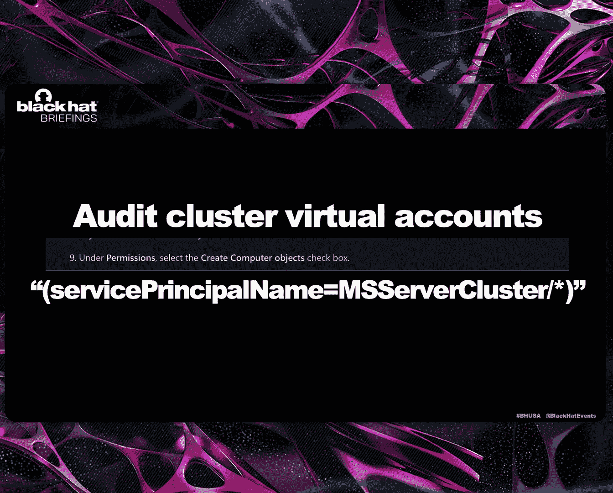

1.  **权限修正**：审核并修正 CNO 账户的权限。在 OU 上，它**仅需要**“创建计算机对象”权限。移除所有不必要的“完全控制”、“通用所有”等权限。
2.  **检测异常认证**：VCO/CNO 账户只应从集群节点的 IP 地址进行认证。监控来自非节点 IP 的该账户认证，这是一个高置信度的警报。
3.  **监控注册表访问**：集群凭据存储在注册表的特定位置。只有集群服务及其子进程需要读取它。使用 Sysmon 等工具监控其他进程对此注册表项的访问尝试。
4.  **不要遗忘虚拟账户**：这些 VCO/CNO 账户是长期存在的 Active Directory 对象，即使底层硬件多次更换。它们应与物理服务器账户一样，受到严格的权限管理和生命周期监控。


---

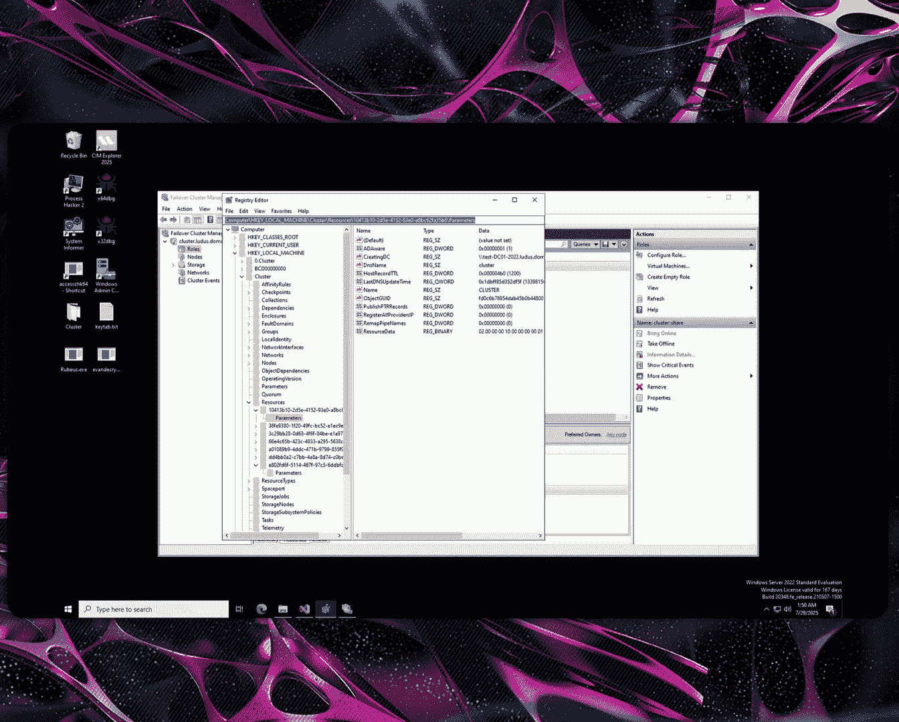


## 总结 📝

本节课中我们一起学习了：
*   Windows 故障转移集群的架构和核心组件：节点、VCO 和 CNO。
*   集群如何通过在所有节点上存储和同步服务账户密码来实现高可用性和故障转移。
*   攻击者如何利用控制单个节点的权限，通过提取密码、滥用 S4U2Self 和集群管理 API，最终控制整个集群。
*   由于常见的过度权限配置，控制集群身份（尤其是 CNO）可能成为通往域管理员权限的跳板。
*   集群化服务（如 SQL、AD FS）本身也是高价值目标，其沦陷会造成重大业务影响。
*   通过实施最小权限原则、监控异常认证和敏感注册表访问，可以有效地防御和检测此类攻击。


**关键要点：**
*   **控制一个节点，就等于控制了整个集群。**
*   **集群的错误配置可以导致域沦陷。**
*   **对于长期存在的虚拟服务账户，要像管理物理服务器账户一样严格。**

---
*（附注：相关攻击工具、PoC解密代码和更详细的技术博客可通过演讲中提供的资源链接获取。）*