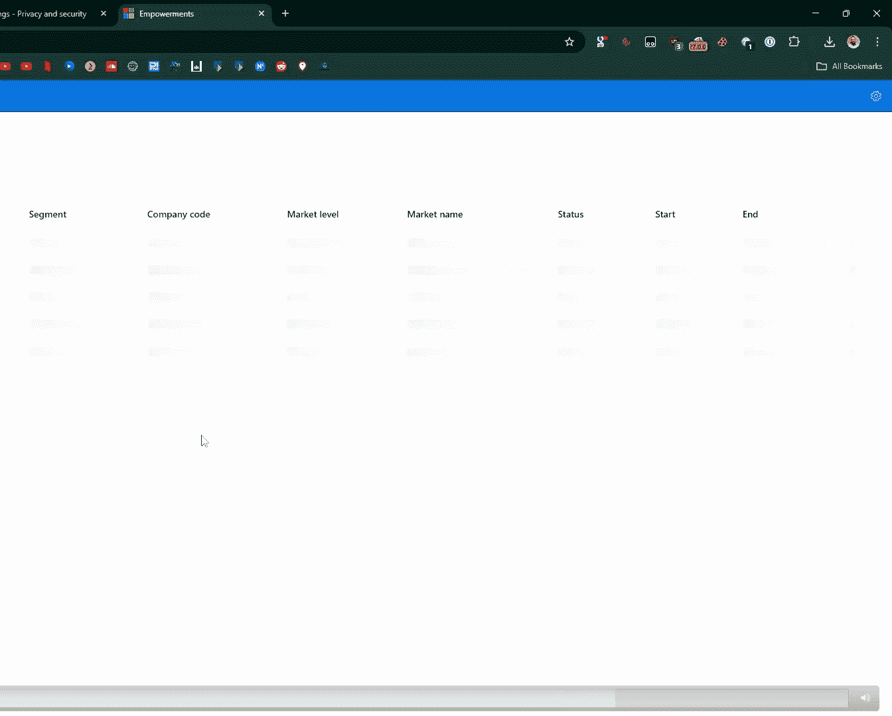

# 课程 01：滥用 Entra OAuth 获取内部 Microsoft 应用程序访问权限 🎯

在本课程中，我们将学习一种针对 Microsoft Entra ID（原 Azure AD）身份平台的新型配置错误。这种错误允许外部用户通过滥用多租户应用程序的 OAuth 授权流程，访问本应仅限于内部使用的 Microsoft 应用程序。我们将从基础概念讲起，逐步剖析攻击原理、步骤和实际案例。

---

## 概述

本次分享源于一次偶然的发现：通过访问特定的 Microsoft 内部域名并登录个人账户，意外获得了访问内部工程门户的权限。这引出了一个核心安全问题：为何个人账户能通过授权访问内部应用？答案在于对 **Entra ID 多租户应用程序**和 **OAuth 授权流程**的误解与错误配置。

上一节我们概述了本次发现的背景，接下来我们将深入 Entra ID 身份平台的基础知识。

---

## Entra ID 身份平台基础

为了理解后续的漏洞，我们需要回顾一些关于 Microsoft Entra ID（身份平台）的基础知识。我们通常都知道**身份验证**和**授权**的区别：
*   **身份验证**：确认用户是其声称的身份。在 Entra 中，这通过 OpenID Connect 协议完成，结果是一个 ID 令牌。
*   **授权**：验证用户是否有权限执行特定操作。在 Entra 中，这通过 OAuth 2.0 协议完成，结果是一个访问令牌。

对于开发者而言，在 ASP.NET 应用中，通常使用 `[Authorize]` 属性来同时要求身份验证和授权。这个过程主要在授权服务器（即 Microsoft 身份平台，如 `login.microsoftonline.com`）完成。

其核心流程是：资源所有者（用户）通过一个客户端应用访问自己的数据。客户端向授权服务器请求一个承载令牌，并用它来访问资源。任何需要用户使用 Microsoft 账户登录的应用，都必须在 Entra 中注册。

---

### 应用注册与服务主体

在 Entra 中有两个关键概念：
1.  **应用注册**：可视为一个模板，定义了应用在租户内可以拥有的权限类型以及应用中存在的角色。
2.  **企业应用/服务主体**：是应用注册在特定租户中的具体实例，描述了应用在该租户内的实际访问级别以及用户在该应用中的具体角色。

简单来说，**应用注册是蓝图，服务主体是根据蓝图建好的房子**。

---

### OAuth 授权码流程

虽然存在多种令牌授予流程，但本次漏洞适用于所有类型。我们以最常见的**单页应用使用的授权码流程**为例：

1.  应用引导用户登录。
2.  如果服务主体尚不存在，用户需要**同意**该应用。
3.  用户/应用获得一个授权码。
4.  应用使用授权码换取访问令牌。
5.  应用使用访问令牌调用 Web API 并获取数据。

**同意**分为用户同意（仅限用户范围的权限）和管理员同意（需要整个目录范围的权限）。同意的过程，就是在租户内实例化应用注册，创建服务主体。

你可以通过访问特定 URL 并输入应用 ID 来强制触发同意提示：
`https://login.microsoftonline.com/{tenant}/oauth2/v2.0/authorize?client_id={app_id}&response_type=code&scope=...`

也可以编程实现，例如通过直接调用后端 API 循环对大量应用进行同意（但不推荐）。

---

### 访问令牌与声明

获得同意后，你会得到一个访问令牌。令牌由头部、载荷和签名组成，由 Microsoft 签名，不可篡改。令牌的载荷中包含重要的**声明**：

*   `aud`：受众，即令牌的目标应用 ID。
*   `iss`：颁发者，即签发令牌的租户，**至关重要**。
*   `tid`：用户所属的租户 ID。
*   `scp`：应用在环境中的访问范围（权限）。
*   以及其他用于标识用户的声明。

访问令牌示例结构（伪代码）：
```json
{
  "aud": "应用客户端ID",
  "iss": "https://login.microsoftonline.com/{tenantId}/v2.0",
  "tid": "用户租户ID",
  "scp": "user.read",
  "sub": "用户唯一标识",
  "roles": ["管理员"] // 如果分配了角色
}
```

---

### 多租户应用与端点

Microsoft 身份平台可以通过多个端点访问，这与应用注册为**单租户**还是**多租户**有关：

*   **多租户应用**：允许其他租户的用户同意并使用。应使用 `common` 端点（或 `organizations`）。
*   **单租户应用**：仅限自己租户内的用户使用。应使用 `tenant` 端点（租户 ID 或域名）。

关键点在于：一个**应用注册对象**只存在于一个租户（其主租户）。但如果它是多租户应用，那么其**服务主体**可以存在于多个同意它的租户中。

这意味着，如果应用注册在租户 A，租户 B 的用户在向其主租户（租户 B）认证并同意该应用后，会在租户 B 内创建一个服务主体，并获得一个对租户 B 内该应用有效的令牌。

上一节我们介绍了多租户应用的核心机制，接下来我们将回顾一个历史相关漏洞，以更好地理解当前问题的演变。

---

## 历史背景：BingBang 漏洞

在 2023 年的 BlackHat 大会上，Wiz 团队披露了一个名为 **BingBang** 的漏洞。该漏洞也存在于多租户应用中。

他们发现，在授权码流程的认证阶段，如果攻击者在认证 URL 中将攻击者租户替换为资源租户（例如 Microsoft 的租户），身份平台会错误地颁发一个由资源租户签发的令牌。这使得攻击者能够以资源租户的身份访问应用。当时，约 25% 的应用受此影响。

Microsoft 随后进行了缓解：
1.  停止向未在资源租户内注册的客户端颁发访问令牌。
2.  建议实施**推荐的授权检查**以减少多租户应用的暴露面。
3.  建议**要求用户分配**并实施条件访问策略。

然而，我们将会看到，这些建议并不能完全缓解我们今天要讨论的新问题。

了解了历史漏洞及其修复措施后，让我们回到最初的问题：为什么我能登录 Microsoft 内部工程中心？

---

## 漏洞原理：同意与妥协

回顾发现过程：我访问了 `eng.ms` 等内部域名，被重定向到 **`common` 端点**进行登录。我用个人账户登录并同意了应用请求。

结果：我在**我的个人租户**内完成了认证，并获得了一个对我的租户内该应用实例有效的访问令牌。然后，我使用这个令牌成功访问了 `engineering hub` 应用。

**根本原因**：`engineering hub` 这个 Web 应用在验证我的访问令牌时，**没有检查 `iss`（颁发者）或 `tid`（租户 ID）声明**。它只验证了令牌有效、用户已认证且被授权（在我的租户内被分配了角色）。所有用户分配、条件访问策略都在我的个人租户内生效，而内部应用对此毫无察觉。

责任划分：前端应用开发者可能正确地实现了身份验证和授权库。问题很可能出在 **Entra 管理员或应用注册配置者**身上，他们可能认为“会有多个租户的用户需要访问此应用”，于是将其注册为**多租户应用**，但实际上它本应是严格的单租户内部应用。

既然在一个内部服务中发现了此问题，那么很可能存在其他类似漏洞。

---

## 攻击面枚举与发现

我开始枚举 Microsoft 的各种子域名（`*.microsoft.com`， `*.azure.com` 等），最终获得了超过 10 万个域名。

以下是枚举和分析的结果摘要：
*   超过 7 万个域名解析到 IP 地址。
*   超过 4 万个域名响应 HTTPS 请求。
*   其中，超过 **1400 个**使用了 Entra ID 进行授权。
*   大部分使用客户端重定向，少部分使用 HTTP 重定向。
*   发现了 327 个 Swagger 接口（留给他人研究）。

有趣的是，大部分应用重定向到 `tenant` 端点（应为单租户），但其中一部分实际上是多租户应用。这表明开发者可能并未意识到他们的应用被配置成了多租户。

具体来说，在重定向到 `common` 端点的 400 个应用中，我检查了其客户端 ID（应用 ID）的多租户属性。发现有 **172 个**是多租户应用。但值得注意的是，其中大多数在请求中使用的却是 `tenant` 端点，这进一步表明了配置与认知的不一致。

---

## 攻击步骤详解

由于我们没有 Microsoft 租户的账户，但目标应用是多租户的，我们如何登录？方法很简单：使用代理工具（如 Burp Suite）进行中间人攻击，在飞行中（on-the-fly）将认证请求中的 Microsoft 租户 ID 替换为 `common`。

这将整个授权流程重定向到了我自己的租户，允许我同意该应用、登录并获得访问令牌。但许多应用仍然会返回错误。以下是遇到的错误及绕过方法：

**1. 错误：需要用户分配**
*   **绕过**：用户分配现在发生在我自己的租户。我可以浏览到在我租户内创建的企业应用对象，将我的用户分配一个角色（例如“管理员”）。这些角色由应用注册定义，但实例化在我租户的服务主体中。之后，我的令牌中将包含 `roles` 声明。

**2. 错误：请求访问的资源已被删除或不再可用 / 组织缺少所需服务的服务主体**
*   **原因**：应用定义需要访问其他资源（其他应用对象），其中一些可能是单租户应用，导致同意流程失败。
*   **绕过**：直接在我自己的租户内创建所需的服务主体。可以使用 PowerShell 或 Microsoft Graph API 完成。创建后，仍需进行用户分配，并尽可能对各个实例化的应用进行同意。之后，大多数应用便可访问。

**总结攻击步骤**：
1.  **识别**多租户应用。
2.  **列出**其所需的资源（其他应用）。
3.  **实例化**所需的服务主体（在自己的租户）。
4.  **分配角色**给自己的用户。
5.  使用代理工具，在认证请求中将**租户 ID 重写为 `common`**。
6.  **同意**应用。
7.  **攻陷**应用。

在我识别的多租户应用中，有 **22 个（12.5%）** 受此漏洞影响并暴露了内部数据。这还不包括那些我获得了前端访问权限但未能访问后端 API 的应用。

---

## 实际案例展示

以下是一些通过此漏洞访问到的内部 Microsoft 应用示例：

**1. 紧急广播系统**
*   可向全球每个 Microsoft 365 管理员中心广播消息。我没有发布任何消息。

**2. ACE 命令中心**
*   顶级客户支持门户（财富 500 强公司）。可以查看、关闭、编辑所有支持工单。

**3. 负责任 AI 运营平台**
*   可管理各种大型语言模型，可能是 Copilot 的“父模型”。

**4. 风险登记册**（应微软要求已打码）
*   包含 Microsoft 组织当前面临的所有风险列表。可按安全风险、高严重性、未缓解等条件筛选。这相当于获得了所有已识别但未缓解的零日漏洞概览。

**5. 安全智能平台**
*   包含整个 Microsoft 组织的所有数据集（VPN 日志、云 shell 日志、用户、设备历史等），高度机密。平台内嵌了 AI 助手“Sippy”，通过与之对话，可以枚举 Microsoft 云环境中的任何用户和服务主体（存在大量测试账户）。还意外下载到一个包含用户授权码的 40MB 日志文件（但授权码只能兑换一次）。

**6. 媒体创建服务**
*   需要同意约 20 个关联应用。用于构建“版本客户端”，可能是 Windows。日志文件中包含 **ESD 私钥**，这是用于批量许可的密钥，可能用于生成大量 Windows 密钥。还提供了源代码查找工具，并允许上传新工具，极有可能导致远程代码执行。


**攻击演示**：
1.  已在个人租户创建所需服务主体并分配角色。
2.  在 Burp Suite 设置规则，将请求中的 Microsoft 租户 ID 替换为 `common`。
3.  访问内部应用（如“赋能中心”）。
4.  被重定向到个人租户的身份提供商进行登录。
5.  成功以管理员身份进入应用，可以查询所有后端数据。


此外，还发现了硬件库存 API 等，可以查询数据中心每个螺丝的序列号。



---

## SAML 身份验证的注意事项

SAML 的工作方式与 OAuth 不同，但使用相同的认证端点。问题在于 SAML 请求中也包含租户 ID，且请求是 Base64 编码和压缩的。攻击时需要实时解码、解压、修改租户 ID、再压缩编码。由于时间有限，未发现易受攻击的 SAML 服务，但此方向值得进一步研究。

---

## 时间线、奖励与影响

*   **2024年11月**：提交了 4 个案例。
*   **2025年1月**：再次提交了 18 个案例。此时，Microsoft Azure 安全威胁狩猎团队也在并行查找环境中的漏洞应用。我可能率先报告了其中 17 个。
*   **修复**：Microsoft 成立了专项团队，几乎所有案例在两个月内修复。

**漏洞赏金**：由于 Microsoft 赏金计划范围仅限面向客户的应用，**内部应用不在范围内**，因此我未获得奖金。但获得了排行榜积分。

**更广泛的影响**：在我们自己的客户群中，发现 **2% 的客户**也存在易受攻击的应用。我们已协助修复。**此漏洞在外部依然存在**。

**一个有趣的发现**：其中一个应用叫“Microsoft 奖励中心”，我给自己分配了管理员角色，找到了“返利”功能，可以输入任意金额、货币和 PayPal 标识，然后点击“支付”。这证明了“黑客微软仍然是一个无限金钱漏洞”——当然，这是出于研究目的的概念验证，并未实际操作。

**现状**：Microsoft 表示已修复所有审查过的应用，并实施了更广泛的监控。当我制作幻灯片时再次测试，立即收到了他们的监控邮件。

---

## 检测与缓解建议

**如何检测自己是否受影响？**
我编写了一个简单的 PowerShell 脚本来列出您环境中所有定义了重定向 URI 的多租户应用。
```powershell
Get-MgApplication -Filter "signInAudience eq 'AzureADMultipleOrgs'" -All | Where-Object {$_.Web.RedirectUris.Count -gt 0} | Select-Object DisplayName, AppId, SignInAudience
```
您需要检查这些应用是否**真正需要**多租户特性。对于大多数已识别的案例，多租户配置是偶然的、非必需的。如果确实需要，则必须确保应用逻辑检查访问令牌的 `tid` 或 `iss` 声明。

**最终建议（要点）**：
1.  **谨慎使用多租户**：仅在绝对必要时才将应用注册为多租户。
2.  **强制验证颁发者**：对于多租户应用，**必须在应用逻辑中显式检查**所接收令牌的 `iss`（颁发者）或 `tid`（租户 ID）声明。
3.  **主动狩猎**：所有漏洞赏金猎人和渗透测试员，请务必检查此类配置错误，它仍然相当普遍。

---

## 总结

在本节课中，我们一起学习了一种新型的 Entra ID 配置错误。通过滥用多租户应用的 OAuth 流程，并利用内部应用不验证令牌颁发者的缺陷，外部攻击者可以获取对敏感内部应用的访问权限。我们从身份验证和授权的基础知识讲起，回顾了历史漏洞，深入剖析了新漏洞的原理、攻击步骤和真实案例，并提供了检测与防御建议。安全始于正确的配置和对安全边界的清醒认知。