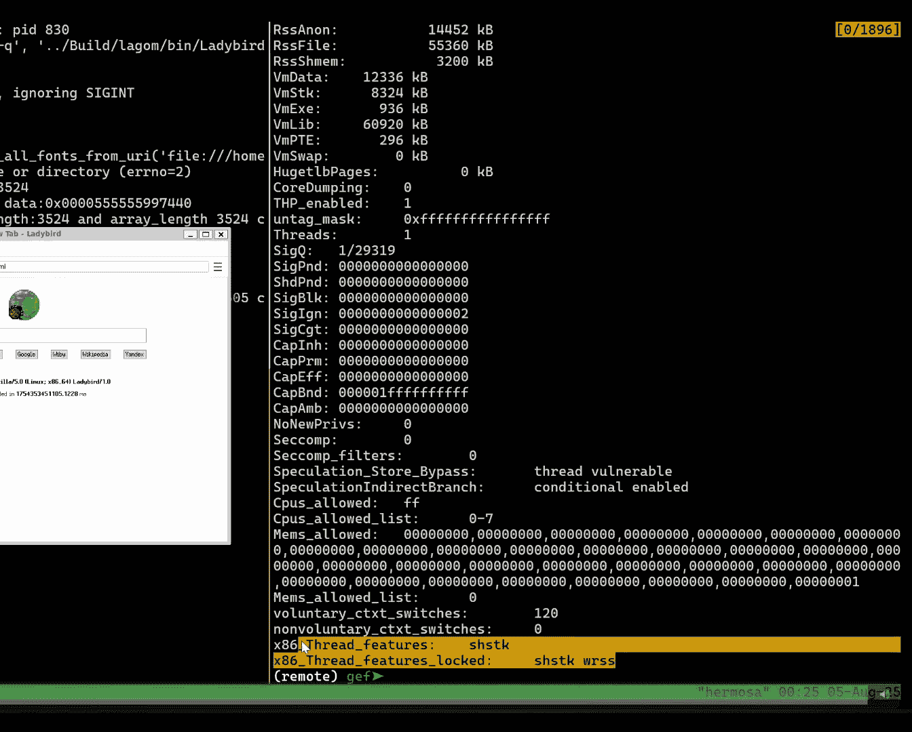
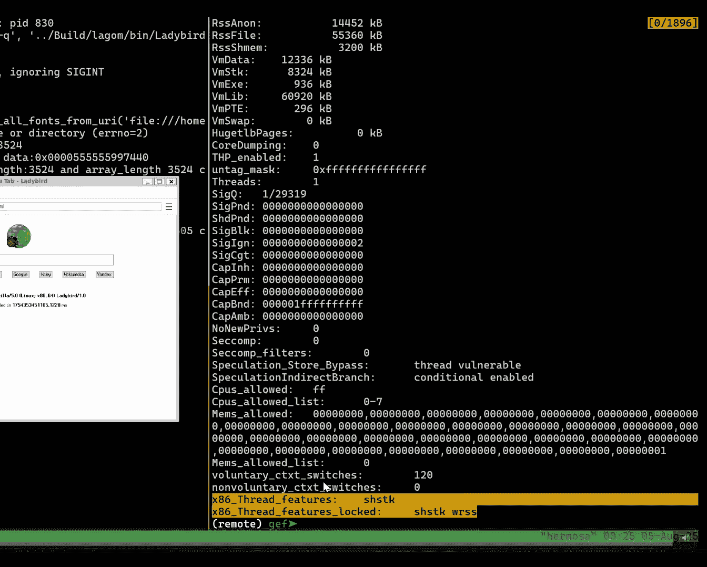
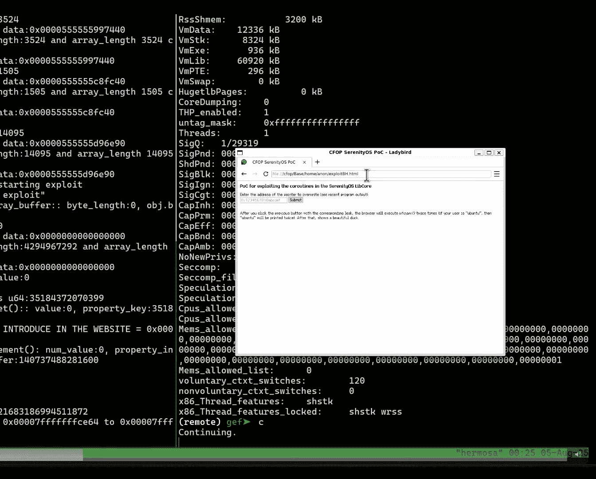
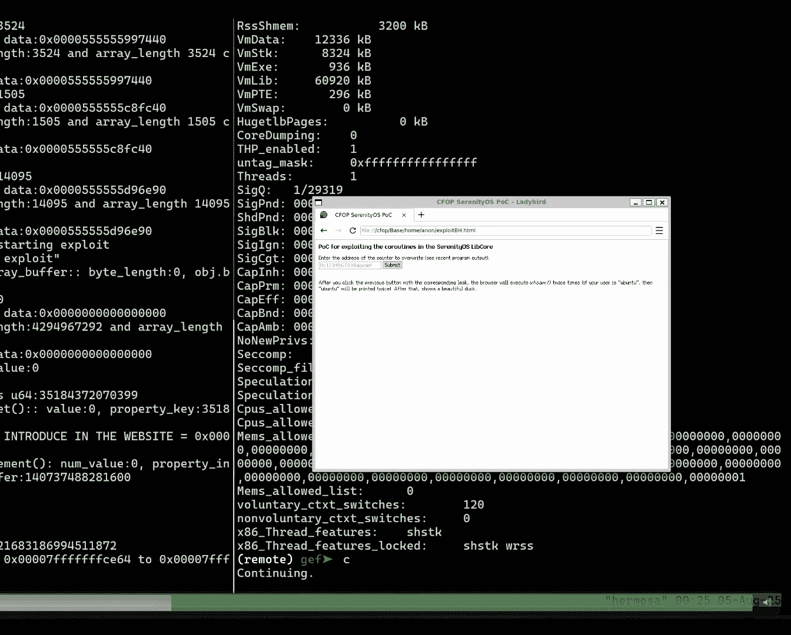
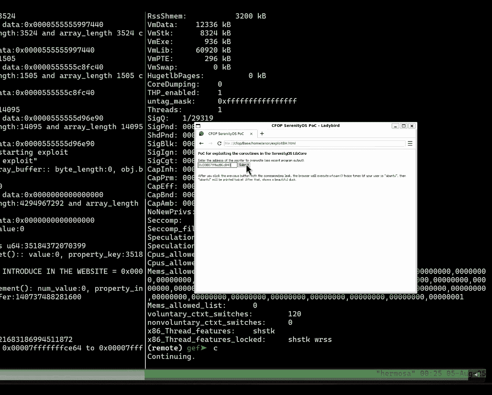
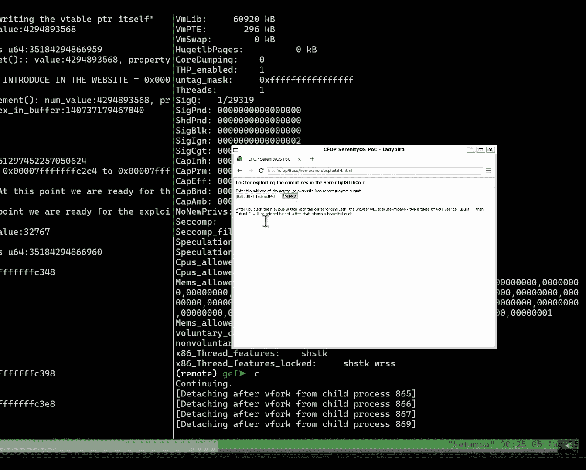
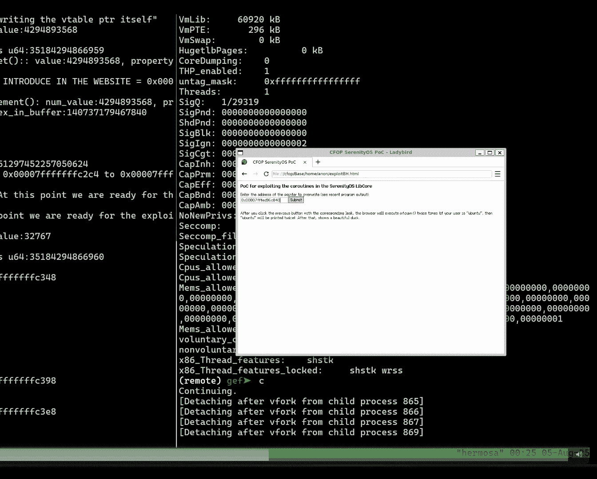

# 课程 1：协程帧导向编程：通过滥用现代 C++ 破坏控制流完整性 🧠

在本节课中，我们将学习一种新的攻击方法，它利用现代 C++ 中的协程特性来绕过控制流完整性保护。我们将从控制流完整性防御的基础知识开始，深入了解 C++ 协程的内部工作原理，并探讨如何利用这些机制来执行攻击。

---

## 概述：控制流完整性的演变 🛡️

50年前，我们首次认识到破坏程序内存可能导致控制其执行的指令。这是今天我们所知的缓冲区溢出的最早提及。

自那时起，安全社区，无论是防御者还是攻击者，都取得了长足进步。一方面，防御者创造了更好的方法来加固内存，例如地址空间布局随机化和不可执行栈。另一方面，攻击者总是能找到绕过这些防御的新方法，例如信息泄露和代码复用。

2005年，学术界引入了控制流完整性。这与经典防御方法不同。它不是在尝试使利用变得更困难，而是从根本上解决问题，即控制程序指令指针的能力。控制流完整性使用静态和动态方法分析程序，构建控制流图，然后对程序进行插桩，强制程序只允许图中描述的合法函数跳转，从而阻止攻击者发起的跳转。

这是一个对防御方非常重大的升级，因为它本质上阻止了我们长期使用的一种技术：返回导向编程以及其他代码复用技术。当然，攻击者也随之升级。我们不是第一个提出绕过控制流完整性方法的人，但今天，我们将指出一种在 C++ 协程中实现的新方法。

---

## 现有控制流完整性防御方案 🔍

上一节我们介绍了控制流完整性的基本概念，本节中我们来看看几种现有的、广泛部署的控制流完整性方案。

以下是几种主要的控制流完整性方案：

*   **Intel CET**：这是目前最流行的方案，是硬件辅助的粗粒度方案。它包含两个部分：
    1.  **影子栈**：每次调用函数时，返回地址会被推送到一个独立的、用户空间无法访问的影子栈页面上。函数返回时，会比较栈上的返回地址和影子栈中的值。如果不匹配，则触发错误。
    2.  **间接分支跟踪**：用于保护程序中的间接指针和间接函数。它通过 `ENDBRANCH` 指令强制执行，确保每个间接跳转都只能跳转到这些指令处，从而只能从函数开头调用。

*   **Control Flow Guard**：这是 Windows 采用的方案，是软件实现的。它在编译时工作，将程序中的每个间接调用转换为对特定函数的直接调用。该函数通过检查一个位图来判断此次调用是否被允许。函数开头的 `__guard_check_icall_fptr` 调用就是其标志。

*   **LLVM-CFI**：这是一种更细粒度的方案。它会计算每个间接指针的动态类型。例如，如果一个间接函数被赋值为 `close` 函数，它会根据函数的返回类型和参数定义一个原型，并强制所有调用都跳转到具有相同原型的函数。

---

## C++ 协程内部机制揭秘 ⚙️

上一节我们了解了现有的控制流完整性防御，本节中我们来看看攻击者可能利用的新编程范式：C++ 协程。

协程是一种可以暂停和恢复执行的函数。这意味着协程内部有“暂停点”。当再次调用协程时，不会从头开始执行，而是从上次暂停的地方继续。

在 C++ 中实现协程需要几个关键组件：

*   **任务对象**：这是最顶层的对象，包含了协程的所有内容。
*   **协程句柄**：这是一个指向协程的指针，允许你恢复或销毁协程。
*   **Promise 对象**：这是一个用于协程和调用者之间传递数据的对象。例如，返回值就存储在这里。

一个函数要成为协程，需要使用特定的操作符：`co_yield`（暂停并返回值）、`co_return`（返回并结束协程）或 `co_await`（等待某个操作完成）。

当协程被编译时，编译器会在后台生成三个关键函数：
1.  **创建函数**：负责分配和初始化协程帧。
2.  **恢复函数**：负责实际恢复协程的执行。
3.  **销毁函数**：负责销毁协程帧。

C++ 协程是“无栈”的，这意味着协程只能在自身内部暂停，不能在它调用的其他函数内部暂停。这导致编译器可以将协程的所有状态（局部变量、参数等）高效地存储在一个堆分配的对象中，即**协程帧**。

一个协程帧的结构如下：
*   **恢复指针**：指向恢复函数。
*   **销毁指针**：指向销毁函数。
*   **Promise 对象**：存储返回值等。
*   **参数**：调用协程时传入的参数。
*   **局部变量**：协程内定义的变量（现在存储在堆上）。
*   **协程索引**：一个整数，指示当前位于哪个暂停点。

`co_await` 是最强大、最常用的操作符，它允许进行异步操作和协作式多任务。它通过评估一个“可等待对象”来工作，该对象包含一个“等待器”，后者会按顺序执行三个函数：`await_ready`、`await_suspend` 和 `await_resume`。`await_suspend` 是执行实际异步操作（如创建新线程）的地方，对攻击者来说非常有趣。

---

## 攻击模型与核心原语 ⚔️

上一节我们深入了解了协程的内部结构，本节中我们来看看攻击者如何利用这些结构。

我们的攻击模型与控制流完整性假设的模型相似：
1.  需要知道程序中某些函数的地址（通常通过信息泄露）。
2.  需要存在内存破坏漏洞，允许覆盖某些内存。
3.  目标程序中使用了协程。
4.  目标程序启用了控制流完整性保护。

一个基本的观察是：**协程句柄和协程帧是可写内存**。基于此，我们设计了两种核心攻击原语：

以下是两种核心攻击原语：

*   **帧操纵**：覆盖一个已存在的协程帧的内容。
*   **帧注入**：在内存中注入伪造的协程帧，并让程序将其当作真实的帧来使用。

---

## 数据导向攻击 📊

首先，我们看看在不修改指针（恢复/销毁指针）的情况下能做什么，即数据导向攻击。

由于参数在协程创建时就被复制到协程帧中，攻击者可以通过覆盖协程帧和协程索引，跳转到任意暂停点，并使用被覆盖的参数数据执行代码。

对于局部变量，情况稍复杂。如果变量只在某个暂停点初始化并在后续暂停点使用，那么覆盖帧可以修改其值。但如果编译器优化后发现变量在某个暂停点未被使用，它可能延迟初始化，从而使得攻击失效。

更强大的攻击涉及堆分配的对象。例如，如果一个 `std::vector` 指针存储在协程帧中，并且在最后一个暂停点会被释放，那么覆盖这个指针可以导致对任意地址的 `free()` 调用，这是一个非常有用的原语。

内存覆盖可能发生在多种场景：
*   任意内存写。
*   基于栈的溢出，覆盖栈上的协程句柄。
*   协程内部的栈溢出（注意，协程变量在堆上，但可能通过缓冲区溢出影响其他帧）。
*   经典的堆溢出，覆盖堆上的协程帧。
*   组合利用，例如释放一个指针导致下次堆分配覆盖另一个协程帧。

---

## 控制流劫持与无限调用链 🔗

上一节我们探讨了数据攻击，本节我们来看看如何利用指针进行更强大的控制流劫持。

恢复指针和销毁指针对攻击者极具吸引力。然而，在控制流完整性保护下，我们不能简单地覆盖返回地址或虚函数表指针。许多细粒度的控制流完整性方案并未对协程进行插桩，导致协程的恢复和销毁指针不受保护。这暴露了防御机制需要随着编程范式演进而更新。

最终，我们主要面对的是粗粒度控制流完整性方案，如 Intel CET 和 CFG。它们仍然限制我们只能从函数开头调用。虽然我们可以覆盖恢复指针，但通常只能调用一两个函数，且参数受限。

为此，我们设计了一种方法来实现任意次数、任意参数的函数调用。核心是识别**控制流指针**。CFP 不仅包括恢复和销毁指针，还包括任何指向协程帧的句柄。例如：
1.  协程句柄本身。
2.  调度器中管理的大量句柄。
3.  协程帧内部的指针，如“续延”指针（用于协程调用链中返回）和“销毁器”指针（用于在协程调用结束时隐式销毁被调协程）。

基于这些 CFP，我们设计了**无限协程链**攻击。攻击步骤如下：

以下是无限协程链攻击的核心步骤：

1.  在内存中注入多个恶意协程帧。
2.  从第二个暂停点（一个 `co_await` 调用之后）恢复恶意链，此时即将调用 `destroy`。
3.  将下一个帧的销毁指针覆盖为恢复指针，这样调用 `destroy` 时实际是调用 `resume`。
4.  链式执行，直到最后一个“蹦床帧”，在此帧中执行任意函数调用（如 `system`）。
5.  利用第二个 CFP（如续延指针）再次调用 `resume`，跳转到另一个蹦床帧执行另一个任意函数。
6.  此过程可无限重复。

为了设置任意参数，我们利用了 C++ 成员函数的特点：它们使用 `this` 指针（存储在 RDI 寄存器）作为基址来访问成员变量。我们构造一个“碰撞”，在协程帧中特定偏移处放置我们想要的值，当某个成员函数被调用时，就会将这些值加载到寄存器中。随后，再利用另一个 CFP 进行间接调用，此时寄存器已准备好所需参数。

---

## 实例分析与防御建议 🛠️

上一节我们介绍了强大的攻击链，本节我们通过一个实例来具体分析，并探讨可能的防御措施。

我们研究了 SerenityOS 操作系统，它在其浏览器中使用了协程。我们发现了潜在的 CFP。作为概念验证，我们使用了 2021 年 Chrome 浏览器中的一个真实漏洞。该漏洞是一个整数溢出，可导致内存覆盖和信息泄露。我们利用它覆盖了一个间接调用指针，并链接了多个 CFP，最终成功执行了多个带有任意参数的函数调用，绕过了 Intel CET 保护。

协程特性在所有主流编译器中都可用，攻击面广泛。防御措施包括：

以下是几种可能的防御思路：

*   **将指针替换为标识符**：不直接在协程帧中存储函数指针，而是存储一个只读表中函数地址的标识符。即使标识符被修改，攻击者也无法直接调用任意函数。
*   **堆分配优化**：这是一个编译器优化，可将协程帧从堆移动到栈上。作为副作用，它不再在帧中使用恢复和销毁指针。然而，该优化触发条件苛刻，需要内联、同一翻译单元、知晓完整生命周期等，且并非所有编译器都完全支持或默认启用。
*   **调整协程帧布局**：例如，将 promise 对象移到帧末尾，或分配更大的帧，使得通过堆溢出覆盖关键指针变得困难。

---

## 总结 📝

本节课中，我们一起学习了如何利用现代 C++ 的协程机制来挑战控制流完整性防御。我们从控制流完整性的背景出发，深入剖析了协程帧的内部结构，并在此基础上构建了数据攻击和强大的控制流劫持攻击链。通过识别和链接控制流指针，攻击者可以绕过粗粒度控制流完整性，实现任意函数的无限次调用。最后，我们探讨了针对此类攻击的潜在防御方向，包括修改协程帧布局和利用编译器优化。这项研究表明，安全防御需要紧跟编程语言和范式的发展，才能持续有效。