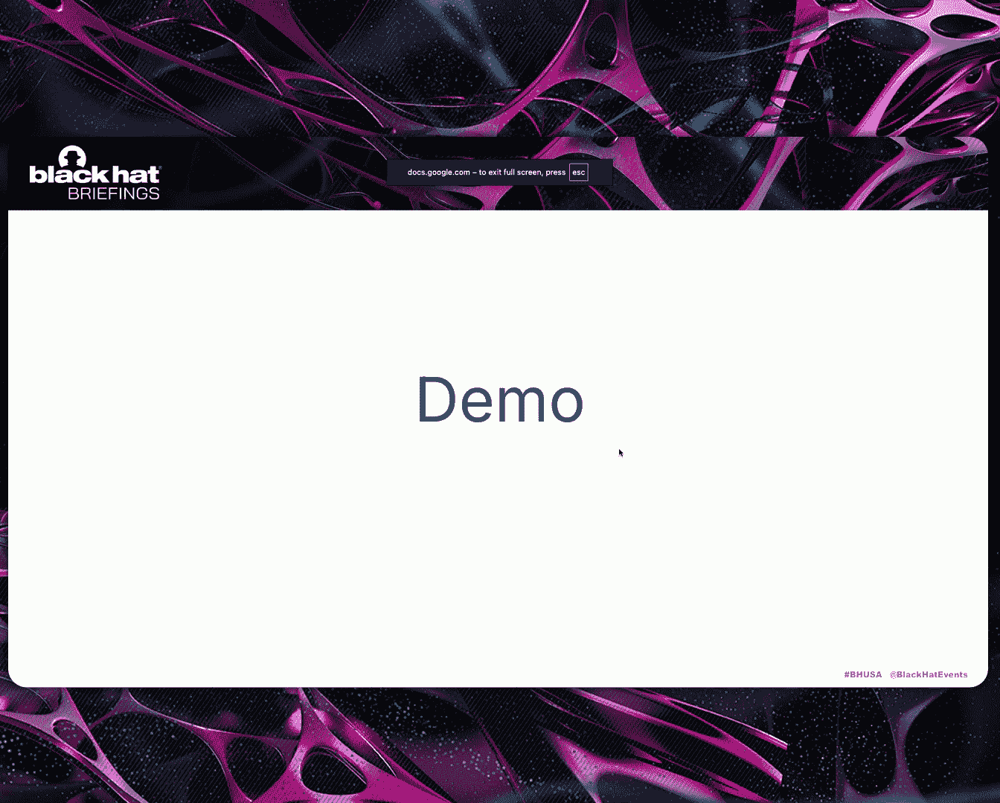
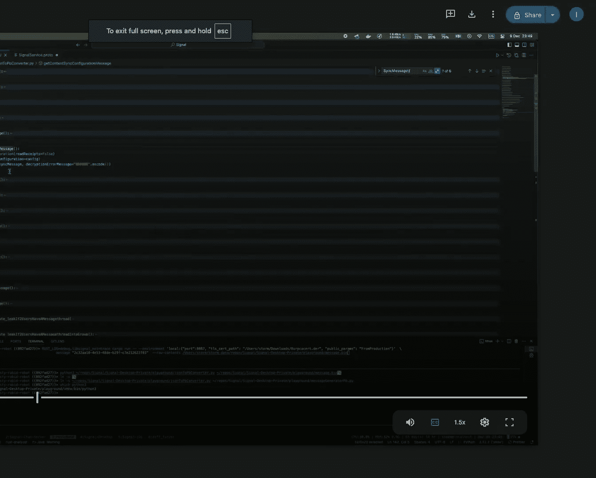

# Decoding Signal： Understanding the Real Privacy Guarantees of E2EE [CxnBO2gxMyI]

Thank you very much。 All right， so。Just some logistics， everyone can hear me。Perfect。

 amazing coolol so I just realized today that this timing of the talk is actually could be one of the most interesting timing for tech talk because you guys have been up since9 right you just have lunch and then if you're expecting me to entertain you and be more exciting than a nap for 40 minutes bold move but let's see how it goes so today I'll be walking you in an end depth security review that I've done for signal and the talk will talk about how signal works privacy guarantees that you expect and signal and a vulnerabilities that I' found throughout the way so the talk is divided into three parts the first part is about just to intro about the security review style。

 what do I look at and the second part is basically design signal how does it work。

 the cryptographic primitives everything and then the third part is the implementation details and where we start to start。

To see the vulnerabilities but before that I' would like to introduce myself so my name is Ibrahim I am a security engineer。

 I've been a security engineer for the past 15 years I'm the typical generalist security engineer that you can think of high review code。

 I work with product teams to build scalable secure systems and I do vulnerability research。

 the typical general security engineer I also have some skill set in static analysis so I built the static analysis at metata。

 the main static analysis for security and as of today or based on last post is that detects around 50% of the vulnerabilities at metata but in 2018 I became very excited about and very interested in end toend encryption messaging applications and that started when I was reviewing Whatsapp the calling stack for Whatsapp and I was very impressed by the power that you get from end toend encryption and I also was very fascinated by the risk of zerocl attack surface that and the high。

Attacks from Minnesotao back then made me very excited to look more into more messaging applications and that led the path to signal before we start just a little bit of a disclaimer so this talkque does not represent any of my employer previous employer this is purely my personal research this also was a close collaboration with signal so that's kind of consultants you work with signal and I work with the engineering team with signal closely on that review the talk focus completely on the technical parts during out the talk I may compare different apps but I will not mention any names of apps just focusing on the technical parts。

 the names are irrelevant so moving on what to expect from the talk so this is more on the security review side of the talk this is not crypto analysis。

 not the crypto protocolcols， many experts have done that research already many there are a lot of white papers and research that you can read about that but this is a security engineering view。

Of the toque and as I mentioned this is a close collaboration also the toque is focused only on the one to one messaging applications and signal signal。

 no groups and no calls and focusing only the zerocl attack surface of signal hopefully by the end of the toque you understand how signal works privacy guarantees from signal and other messaging applications and of course some vulnerabilities we are at black hat before diving in there will be a lot of code in the second part of the presentation I would love everyone to see it and be part of it so if youd like to move in a little bit closer。

 please do now I don't think you'll be able to see it at the back of the room so my methodology for security reviews is that usually I think of four layers when I review an application so I think of the design what systems are supposed to do what the specs says and then the intent what the engineers understood from that design and what the intent to implement and then the implementation the code that the engineers have actually written to kind of express。

their intent and lastly the execution how the code behaves and the coron cases at each layer you can imagine there could be different security vulnerabilities and each layer required different skill set and techniques to find the vulabilities Additionally I kind of break their views into four or like vulnerabilities into four classes language specific if you're reviewing CBB+ code or C you expect to see memory corruption if you're review application specific or。

Looking at the application specific code， SQL injection and others。

 So these are the different kind of four categories that I look at。

 keep this in mind throughout the review because we will touch across them as we explain or as we dive into the signal code based together So with that let's start to understand signal architecture and to explain how signal works。

 I'll use an analogy similar to like physical mail If you want to send a physical mail。

 you will descend sender will write a letter， put in an envelope delivered to a mailbox the processing company or like the mail company will pick up the mail route it to the recipient mailbox recipient collected read the mail read the message the envelopes here are read。

 which means that the messages are not encrypted in the normal case so the that the messages are not and then encrypted signal works in a very similar fashion or model so you basically again have Alice and Bob since we're talking about crypto so we always should have Alice and Bob and they write a message they deliver it to the mailbox signal pick up the envelope routes that。

The recipient mailbox， read the client picks up that from the mailbox and read the message usually signal and messaging applications will have like a directory to look people up so you can look people up by phone number。

 username and also you know their name and their profile picture so give you like good user experience from this diagram we can start to understand the attack surface so there are some servers。

 theres some clients typical application the servers in signal are mostly just Java and rust not a lot of CB++ or almost none so very small attack surface the clients the cross the cross platform library is written in rust which I think signal one of the few application that where the library is written in rust and not in other languages or memory unmanaged language and the applications are for Android Kotlin and Java Ios Swift and objective C and desktop is an electron app the only thing to highlight here is the library is in rust and that means like the attack surface。

Memory corruption is usually minimal comparing to a full CRC++ library moving on in terms of code size。

 the size of the server is around 300 k the size of the different applications between 300 to 500 k based on my experience for apps that I have reviewed decomped looked at this is mostly on kind of the lower end in terms of size of these apps so the app is very minimal very lean just have the main functionality。

 usually this is between 40 to 60% less than other apps that I've decomiled or looked at from similar messaging applications Last thing is that as you review of messaging application or end toend messaging application。

 we want to think about where the trust layers and that application So one in endto end messaging application we should expect the server to be malicious well that we have to expect that and we have to kind of start on top of that so and we should also expect the network is hostile we expect the messaging。

to protect the content of the message and ideally the metadata around the message and the metadata around the people。

 Not all end to end message application protect the metadata signal。

 we will see together how much it goes to protect metadata with that we can start with a metadata and think we can start about profile so profiles for every application there is or for signal you have the information around the users and similar messaging apps have that。

 So you have the person， their name， their profile picture， there is status。

 any other plain text information signal claims that this information is encrypted end to end。

 and this is one of the parts that I started the review with and in fact。

 the data is actually encrypted with something called the profile key This profile key is generated on the client It is never shared with the server。

 the data is sent to the server encrypted with that key and the encryption is as to 56 in GCM mode and the keys are only shared when you start a conversation with someone and if someone。

Con with you。 the key is only shared once you accept that conversation。

 So once you reply to that person， I tried different way to leak the key in different techniques。

 I actually couldn't。 And that was kind of the first part of the review。 And if you look at the。

The servers and if you look at so the server is also one thing to interest is that all clients and signal are open source and all servers are also open source so you can read the code for the clients and read the code for the servers so if you spin up the storage server locally and you look at the profile data on the server you see something like this so on the top you see signal where you have everything is encrypted or just kind of a blob of bytes and the bottom you can see typical or traditional messaging application where the data is actually in Plats one thing to do not the image URL is encrypted but also the image content behind that URL is also encrypted everything is encrypted with a profile key the profile key is rotated only when you block someone so theoretically someone can monitor when the profile key changes and know that the user have done something or blocking a user or other actions that kind leak that some action happened basically but now this is part of the metadata let's move into messages in our。

So far， we did not explain how signal of。Creates the end to end the encryption and so if we go back to this diagram I' will keep the letters read。

 which means they're not encrypted。 If the messages are not encrypted， of course。

 the server can open the envelope， read the content。

 there is no end to end encryption in order to encrypt data between two users what you want here is that the two users to agree or agree a shared secret between the two users and then they can start encrypt in with that shared secret once we think of key agreement protocols。

 we always think of diffy Heman and to explain Dffy Heman in layman terms assume that Alice and Bob agree on a common paint。

 they both select secret or like they select a secret color。

 they mix that color with a common paint and then they share the mixture over a public network or an unsafe network The assumption here is that to reverse that mixture and to go back to the original colors。

 This is extremely difficult and。Theoretically or difficult to do and that's the case in public keycurptography once they receive the mixture they mix their own secret colors and now both have a shared secret across the users between the two users signal uses eiptic curve diiffyhelman and the keys are that are shared called prekeys these keys are eip curve diyhelman keys and they are ephemeral keys they only shared ones to establish the session once the session is established then the keys are they just disappear the keys are signed by a key called the identity key and this is the most critical key for signal because the identity key the lifetime of that key is the lifetime of your account as long as you have the account is the same keys they never rotateated they are only used to sign they theyre almost never leave the device from signal and so now Alice and Bob have shared secrets and now they can encrypt messages we go back to green envelopes so this way that signal cannot see the content of these envelopes。

But。What I explained so far there is one interesting attack for that So what if someone so both Alice and Bob have shared secrets。

 what if the server kind of always make a copy of the encrypted blobs and at some point the server access or an attacker。

 get access to the device they can get the keys and they can decry all previous messages this is known as backward secrecy and what you want is that you want to build a system where even if the server that logged all the blobs or like the encrypted bytes if they get access to the device。

 they should not be able to compromise previous conversation and the solution for this is you ideally want to encrypt every message with a unique key so the way that it does the signal does this is that from the diiffyhelman key it uses that as the the chain key that you don't encrypt messages with that you run it into a key derivation function it outputs two keys message key and a chain key you encrypt the message with a message key。

 you throw away the key。After that you delete it once the message is delivered and then you generate another key。

 One mechanical way to interpret this， you can think of this as a ratchet So every time you send a message that ratchet moves one step every time you send the ratchet that ratchets move one step so if the attacker compromise the device at any point they cannot reverse the ratchet back this is good and this solves the problem of backwardt secrecy but there is still another problem here What if someone compromise my my device now they get access to that key or to that ratchet and then after that they monitor the network the current design would allow them to just because they have the ratchet they can move the ratchet step by step and to decrypt all future messages and this is known as future secrecy or post compromiseromise secrecy and in signal and a couple of other applications the way to solve this is that you want after some time to throw away the ratchet and say hey I don't trust this ratchet anymore。

 I want to create another ratchet and this is known as diy Heman ratchet which is kind of or a double ratchet。

Whi after some time you throw away the ratchet and you generate a new ratchet。

 basically when Alice pulls the kind of pre keys from Bob creates the ratchet and then sends all messages to Bob so that's the ratchet that we talked about and after that once Bob receives the messages and then Bob wants to reply what signal does it throws away these ratchets and then after that creates new ratchet and then the conversation starts so the ratchet change every direction as the ratchet gets updated as the message changes directions All right back to metadata so we mentioned that signal tries to kind of reduce the amount of metadata most of the envelope that you have seen if you look closely have two fields the from and the two the two is very important for the functionality because the server wants to know how to route that piece of information to the recipient but the from it would be great to delete that and not let the server know who is communicating with who。

2018 signal created a new feature or a feature that's called sealed sender or unidentified send。

 and the way that it works， it actually takes the information and then after that it puts the information inside the envelope encrypts it and then that way signal doesn't know who is sending the information to。

 they just see that this is an envelope that you need to deliver it to Bob and that's it。Cool。

 that's the design。 That's how everything works for now。

 Let's dive a little bit into the implementation and actually understand how our different things are implemented。

 So let's start with the envelope so the envelope is actually in the server or like in the clients is a broughtto b that Btob has different fields the first field is the source service ID which where the envelope is coming from and then the destination service ID which where do I need to route this envelope and then you have the content which all the encrypted content of the message and then after that you have the type so in the sealed sender case。

 the So service ID should be null and the server shouldn't know that information all the fields that other than content or plain text and this is what the signal service knows so let's look into that type。

So sorry some quick technology check this yeah slides so this should have been after the sealed sender but just out of the four application that I looked at one application that implement this single and double ratchet protocol and none of the application that I've noticed actually implement encrypted profile or sealed sender I only looked at application that have more than 10 million users above so I'm sure there are more other applications but if there are any other application that have more that implemented all the feature I would love to know that so feel free to reach being out after this now that was a bug let's go back to the code so what are the different types on envelopes here so the first is slidepher textex this is the typical signal encrypted double ratchet message and then you have a pre key bundle this is the first message the client sends to the other client and you can think of this as a superet between the message encrypted with the double ratchet protocol and。

Ks that the client need to establish so they can decrypt this message and then the third type is unidentified sender。

 is you can think of it as a superset between the cipher text as well and some met information or metadata that's encrypted about who send that information but I noticed that there is a plain text content So what does this mean why do we need a plain text comes envelope and I went back to the design and the specs and there is something called retry requests and these retry request says that in case the client or the receiver receives a message that they cannot decrypt。

 they need to reply with a plain text content saying hey， I cannot decrypt this message。

 this is the message ID please figure it out， send me back the message re-established the session there is the protocol specifies what's going on here So okay so there is one way that you can send a plain text envelope or an envelope that has plain text content and that is for the context of retry message only this is expected。

 but what we expect that the client to validate that code。

So let's dive a little bit into the code together This is iOS and in iOS you see again the different cipher types。

 the whisper is the encrypted message blob so if you unfold this you see it takes a signal message decrypt it this is great the plain text it takes the message return it as it is the decrypted function here again this is expected but what is that encrypted like what is the content what's the type of the content so this is another broughttob that can actually have 11 types message of 11 types and what we expect for a plain text content to only have a decryption error message so what we're expecting here is that once the message is returned the client validates that for plain text envelope there should only be decryption error message inside nothing else if we look at iOS there is no check I just takes the plain text envelope and after that execute and processes the message。

If it's a data message it will process that and it would handle the incoming message and this is the first vulnerability we have so basically i clients can receive plain text envelope from the server so it expects the server like this assumes the server is malicious and the server can send plain text envelopes it will receive these messages process them and it works the impact here is that you can send data messages so you can inject any message into any other thread or conversation and you can also send other types there are 11 types of messages so you can send an edit message which existing messages to visualize this here's the server sends a plain text message with different content other than the expected content and that will be processed on bo's device and you would not get any notification from that that was iOS the fix for this is basically checks if the message has a decryption error。

 it checks two things it should not have any other message similar to what they the spec expects and if it has and it has to be a plain text envelope as well。

Okay let's look at Android so Android these again the different types of messages， the cipher text。

 what we expect here， it takes a signal message， uses the signal protocol to decryptse it but and the plain text returns that plain text content as it is cool let's see the code so there is an Android there was validation so basically it says that if so this is a function that runs the validation before the message is returned and it says that if this is a plain text envelope make sure that the error decryption is not null so the error decryption message is there and it does other types of checks which says that make sure that you don't have other types story message。

 edit message but the code missed that data message check and this is the second vulnerability is that in Android you can send the server can send well this is as it is for now is still a bug because now we have a content is not necessarily a vulnerability and the next slide I would explain but we have a content or an。

that have two messages。 it has a decryption error message and a data message at the same content。

 and we don't know how the execution would work。 So the execution for Android that's the order of the execution where the Android takes par it's a when block and parses the data message first and executes that so the server can send a plain text content to Android clients and still that would be processed Unlike ios it's not all types of messages。

 just the data message which the typical text message that you get in signal and again that can inject any message in any current thread in signal the fix for that very simple check that the data message is not part of a plain text envelope moving on so this is desktop and the code for desktop again takes plain text return that plain text desktop also checks return that a flag that the envelope was not encrypted we know that it plain text envelope and desktop checks if it was。

Pin text envelope then make sure that you always have the error decryption very similar behavior to Android if it does not have the error error decryption the decryption error message it will throw an error but very similar to Android this is still a bug not necessarily a vulnerability depending on the execution of the code what function will be executed first and in discco the execution order is actually different than Android so they execute the error decryption message first and then the execution continues if you notice if and not if else so theoretically you can after you've complete the if you can go into the other block but I've reviewed all the code all these ifs actually return inside so practically it's kind of an if else condition here so disc was safe in that sense so a recap of the vulnerabilities basically Sign allows plain text messages only for specific error reporting cases however some clients fail to enforce this。

Enfor this accepting actual text messages via the full back path this opened the door for malicious servers to inject messages。

 this also you can play that a little bit in S swapping scenario where you can authenticate as another user and then you can send these messages and that will go through the server as plain text messages。

Moving on to another feature called Li device Li device is one of the one of the features that is actually difficult to implement in end to end messaging applications because if there is no end to end messaging。

 the server will have all the messages once you add a new device the server will send the messages to the new device and the two devices knows the state and everything is straightforward。

 but in end to end messaging there is no central part like all the information is in one device So there is a difficult problem of how to synchronize this data across your device。

 So there are two parts for this review。 One is how you actually provision a link device that I'm not going to cover a lot I'm going to focus on assume you have provisioned and already link device。

 how you synchronize these two devices So let's start with the recipient path So the recipient path。

 Bob if Bob provision their desktop or iPad when Alice send a message to Bob Alice ask the server how many devices Bob have and then the server says。

Bob have two devices so Alice goes establish a signal session between these two devices and then sends the message twice to the two devices for Bob this way Bob will get the message twice and the conversation is synced across the two devices but on Alice's side it's a little bit more complex because Alice have sent a message from one device and the other device doesn't know anything about this message so the other device is not the same state at this device and the way that signal solves this is that there is kind of an invisible conversation between these two devices this conversation is still end to end encrypted using the same signal end to end protocol where Alice sent another message to itself saying hey I've sent a message to the other device or to this user so update your current state and these are known as sync messages or synchronization messages they should be sent between a device to a device to update the current status here so。

These use the sync to sync messages， they use end to end encryption protocol。

 the same exact protocol as if you're communicating with anyone and the same path as one to one messages and they are protocol above sync message so let's look at them so yeah this is the content remember the envelope contain different content so that's our envelope and there is a type called sync messages and this is where the sync messages come in play so the sync message of like there are 22 types so this is the sent when Alice send a message to someone it send a sync message of the type sent to the other device to connect to make sure that both device are in sync and when you read the message from one device you send a red message to the other device to maintain the configuration to maintain the state and lastly the configuration message when you update the typing indicator on one device or you update like the red receipt on one device one of your device send the update configuration to the other device to make sure that you have synchronized update updates between both of them。

But clients in order for clients to process these messages safely， they need to do two things。

 The first one is that they want to the clients should make sure that the messages are or encrypted first no plain text envelopes and remember in iOS the first bug in iOS the code accepted any type of content so the server could have sent a sync message as well as a plain text content。

 but that is fixed now so let's focus on the second part which is validate sender itself so for syncnc message you always want to validate that this came from myself。

 it didn't come from any other user so with that let's jump into the code so this is Android this is the handle incoming envelope function and it receives a syncnc message and the first thing that it does it actually check that the message is coming from my other account or my account that's what we're expecting to see here this is disctopub handle syncnc message。

 JavaScript code or。Scr code and you can see also the check here the message have to come from myselfse and this is the code for Android there are validations。

 but there is no validation that states where the message is coming from and this is the third bug that we have today so the vulnerability here that there was a missing authorization or validation check on sync messages this only affected Android and it allows attackers to send sync messages end to end this is zero click this that require did not require malicious server or anything。

 this is a normal end to end message between two users in the exploit I was not able to read previous messages but I was able to send the different type of sync messages to edit inject a message and play and update the configuration this was patched immediately once discovered exactly the same day this was patched also in September 202224 and one so signal clients。

a force update after three months so after three months all clients have to force update otherwise they don't work so I don't believe there are any kind of vulnerable clients as of today to visualize this finally you bring Mallory to the party so Mallory sends a sync message and an encrypted。

 the server cannot see anything everything is into an encrypted the message looks very normal as a message that you send to the user and Bob's client in case it's Android it will actually process this and process that control message and change the state of the application and now we can go to a demo。

So oh， sorry。

So in the demo here， you can see I'm not sure how easy it is to see。

 but this is the configuration message or the sync message and this is the phone and you can see in the phone。

 this is the read receipt we're on。

And as I just send the message。The read receipt status now will change。 So probably get an error。

 But if you look at the read receipts now， So that changed to false。

 And the sync message was just to sync the the configuration from true to false。 You can。

 you can still do more。 You can inject messages。 You can do all other types of messages。 But yeah。

 that's for to change the configuration on one device。 Let's go back to。

The slides。All right， so these are all the types of sync messages that you can send again sent which will inject a message into a conversation contacts which update the contact list。

 mark a user as a verified edit will edit a message and yeah there are 22 messages there's also I think a way where you can leak if two users have been communicating or not together via sync messages。

So， sorry。嗯。All right this is the fix the fix is very simple just update the make sure that you have you check that the sync messages are coming from our selfidity and so vulnerability recap when you have linked devices your device is synchronized the state via an invisible conversation between them it's end to end encrypted the conversation is special type which sync messages and the vulnerability is that was Android clients accepted sync messages not validating from anyone not validating the identity of that this also affects Android clients even if they don't have a link device because the code just there and the code will execute one of the downstream clients of signal was prof they also are affected by this vulnerability because the vulnerability is not in the protocol is just in the client and they fixed that with a CVE and the CVS score was 8。

5 What else did I review so I looked at all kind of language specific there was no memory corruption issues even in the unmanaged code for rust I looked at。

The JavaScript that was excited to find any prototype evolution or anything related to JavaScript has actually was really well very well written nothing application specific。

 I literally reviewed every single SQL injection query and the application all looked good so there is nothing there only two vulnerabilities as I mentioned the vulnerabilities were between logicbased and product specific and this aligns very well with what I expect because as applications mature and as they have a higher quality the vulnerabilities tend to disappear from language specific application and they go more into the logic and logic based and product specific。

😊，That's it so yeah it's a review， a security engineering review from signal。

 it was a close collaboration between again the signal team big kuds to them for supporting me throughout that I hope you have a clear understanding of how signal works some of the privacy guarantees that you expect and you get from messaging applications and you've seen some of the vulnerabilities that they found throughout the review big thanks to everyone here and I think we have seven minutes for questions。

