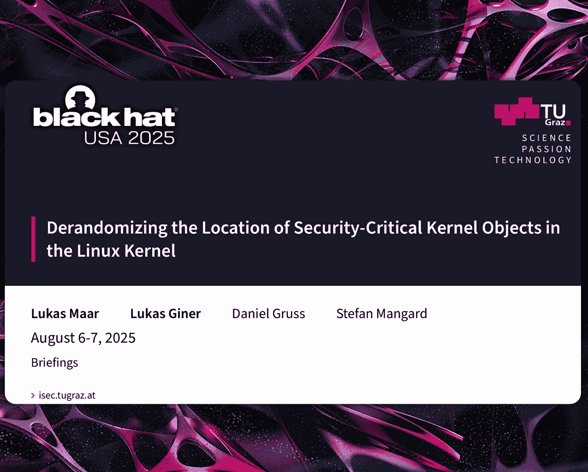
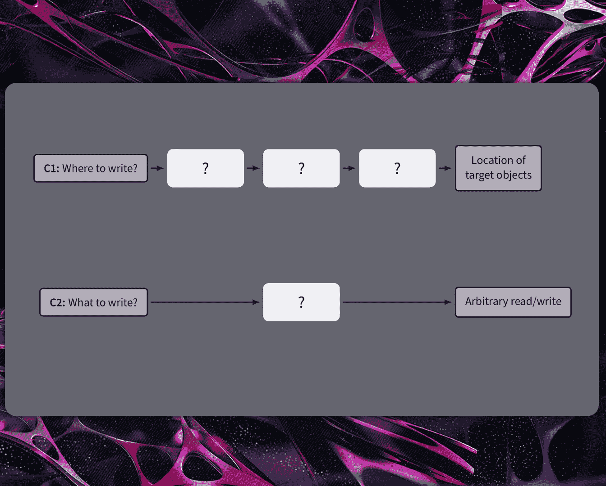
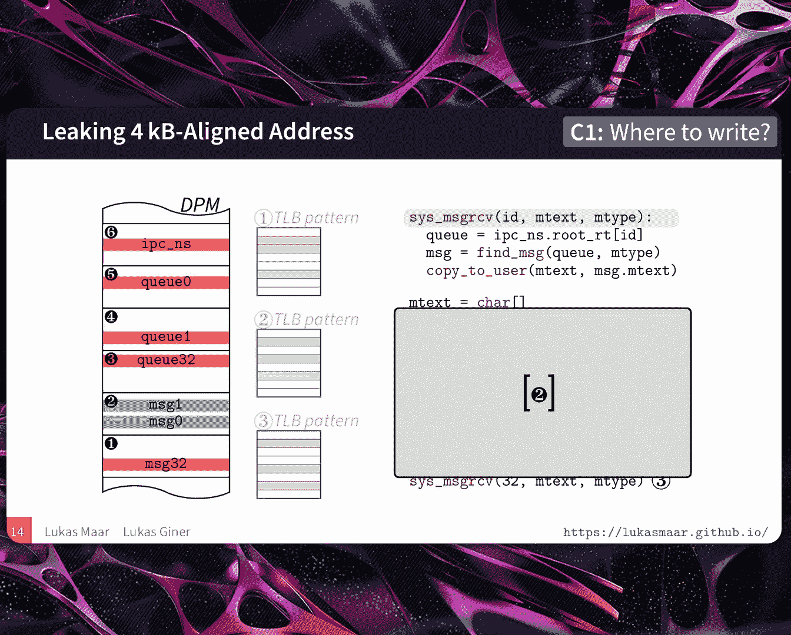
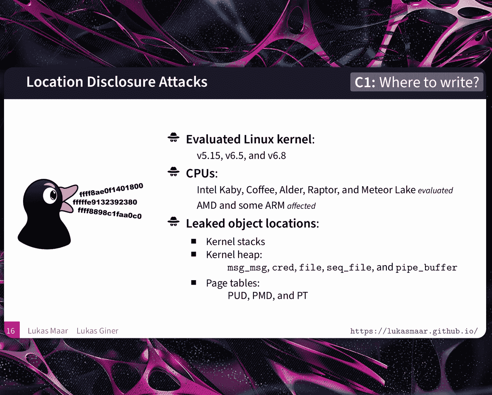
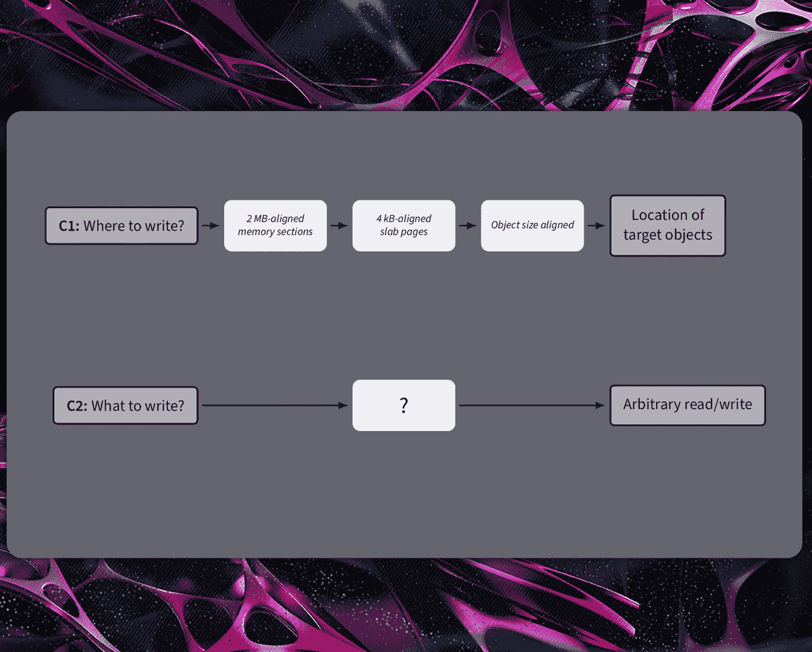
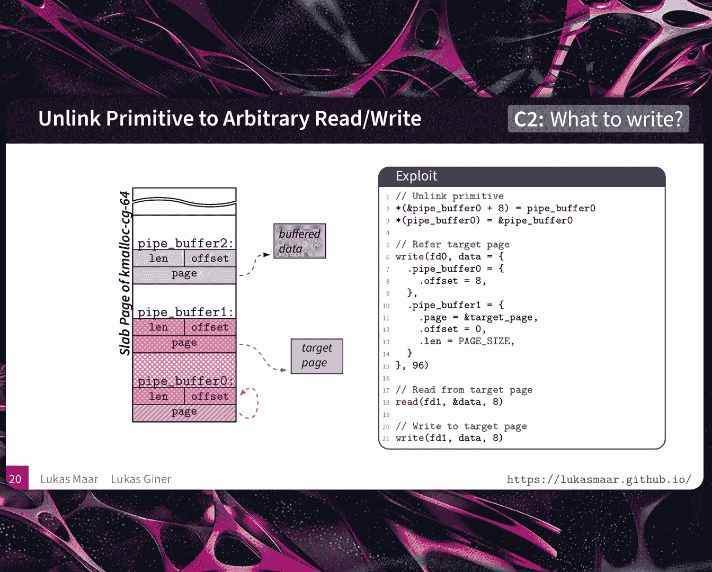
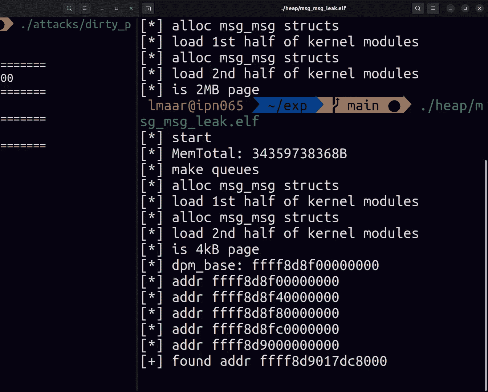
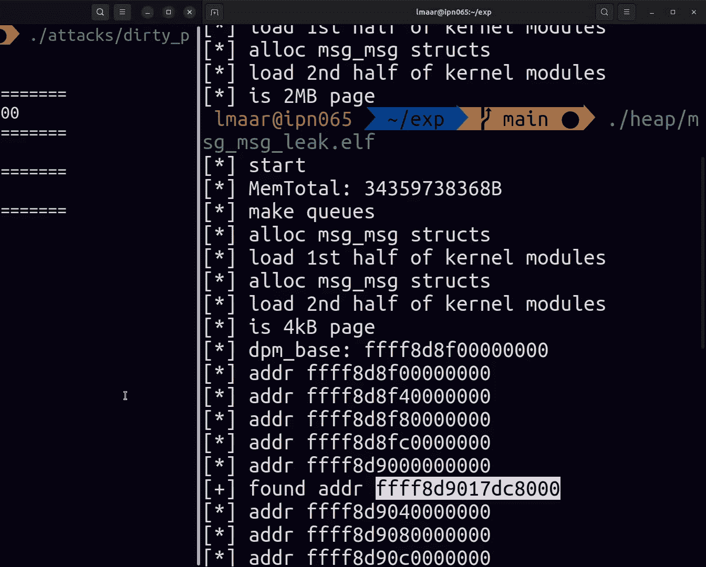
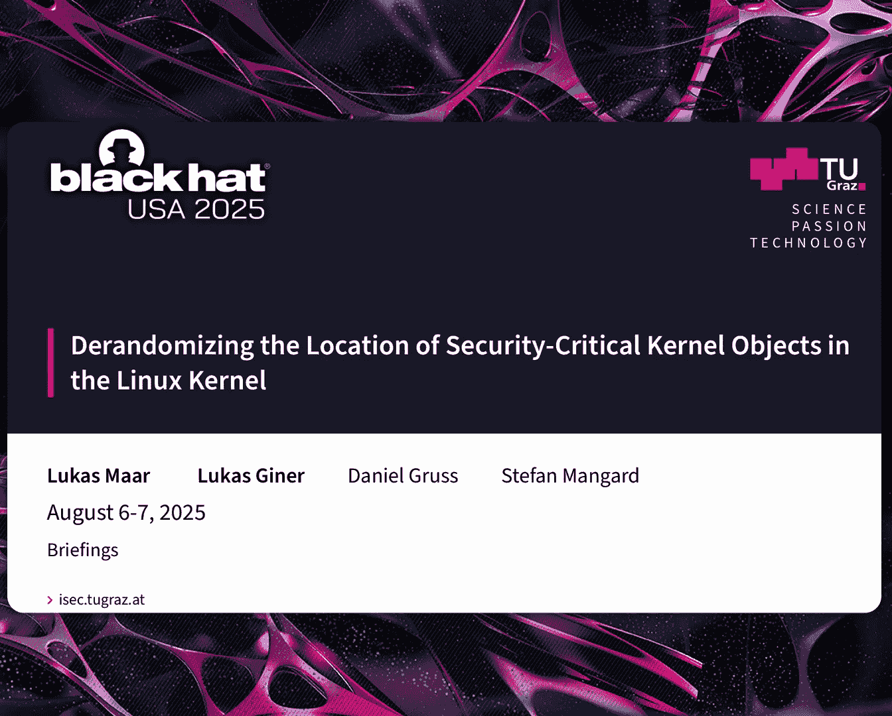

# 课程 1：Linux内核中安全关键内核对象的确定性定位去随机化 🎯


在本课程中，我们将学习如何利用微架构侧信道攻击，结合内核防御机制的特性，来精确定位Linux内核中的关键对象，并构建稳定的内核提权利用链。我们将从TLB侧信道的基础开始，逐步深入到如何利用这些信息实现可靠的内核攻击。


## 概述

内核利用通常始于在非特权上下文中获得初始代码执行能力。攻击者的目标是通过利用内核漏洞进行权限提升。传统方法依赖于猜测或概率性的内存布局，容易导致系统崩溃和利用失败。本课程介绍一种方法，通过结合**TLB侧信道**和**内核防御机制的副作用**，能够可靠地定位目标内核对象，并将其转化为强大的任意读写原语，从而实现稳定、隐蔽的提权。

## TLB侧信道基础

上一节我们介绍了内核利用的挑战。本节中，我们来看看攻击的基础——**翻译后备缓冲器**侧信道。

**TLB**是CPU中用于缓存虚拟地址到物理地址转换的硬件单元，用于加速内存访问。其工作流程可以简化为：
1.  虚拟地址通过一个函数（如异或）生成一个索引，指向TLB中的特定组。
2.  在该组的所有路中，比较标签以查找匹配的转换条目。
3.  若命中，则快速返回物理地址；若未命中，则需进行耗时的页表遍历。

这种命中与未命中的时间差构成了侧信道的基础。测量代码的核心逻辑如下：
```c
start = rdtsc();          // 读取时间戳计数器
prefetch(kernel_address); // 预取指令（不会因访问内核地址而崩溃）
end = rdtsc();            // 再次读取时间戳计数器
time = end - start;       // 计算访问耗时
```
通过测量大量地址的访问时间，可以区分出：
*   **未映射的页**：访问时间最长。
*   **已映射但未缓存的页**：访问时间中等。
*   **已映射且缓存在TLB中的页**：访问时间最短。


然而，测量行为本身会将目标地址加载到TLB中，污染状态。为了解决这个问题，我们使用**驱逐-重载攻击**：
1.  测量目标地址（如果是首次，可能未缓存，速度慢）。
2.  精心构造一组地址，利用已知的索引函数，填满目标地址所在的TLB组，将其驱逐出去。
3.  回到初始状态，可以再次进行测量。



利用这个基础能力，我们可以泄露内核内存区域（如直接物理映射、vmalloc区域）的基址，但此时粒度是2MB的大页。

## 将泄漏粒度从2MB细化到4KB

上一节我们获得了2MB对齐的内核区域信息。本节中我们来看看如何将泄漏精度提升到4KB页级别。

我们需要更精细的粒度来定位具体的内核对象。关键点在于利用内核的内存布局和防御机制：

*   **vmalloc区域**：本身就以4KB页进行映射，如果目标对象分配于此，则已满足条件。
*   **直接物理映射区域**：通常使用2MB大页映射。我们需要将其“拆分”为4KB页。

以下是利用防御机制副作用实现拆分的方法：

1.  **CONFIG_VMAP_STACK**：该防御机制将内核栈分配在vmalloc区域而非直接物理映射区域，自然使用4KB页。
2.  **SLAB_VIRTUAL**：该防御机制虚拟化整个内核堆，使其位于4KB映射上。
3.  **严格的页权限执行**：这是最有趣的一个。内核模块的代码页不应同时可写。当模块加载到直接物理映射区域时，内核需要将包含该模块的2MB大页拆分为4KB小页，以设置不同的权限。我们作为非特权用户，可以触发内核加载模块，从而间接地拆分大页。


接下来，我们需要让内核访问我们感兴趣的目标页，将其加载到TLB中，以便我们测量。我们通过系统调用来实现：


以下是触发内核访问特定对象页面的系统调用示例：
*   **内核栈**：调用任意系统调用。
*   **`msg_msg` 对象**：使用 `msgrcv` 系统调用。
*   **管道缓冲区**：对管道文件描述符进行读写操作。
*   **页表**：使用 `mprotect` 系统调用。

然而，一个系统调用会访问大量内核页，产生大量“噪声”。我们需要从中识别出目标页。

## 从大量噪声中识别目标页

上一节提到系统调用会访问许多页。本节中我们来看看如何通过集合运算从噪声中提取出目标页的信号。

我们以 `msg_msg` 对象为例。假设我们想泄露存储 `msg_msg 0` 的页（`P_target`）。

1.  调用 `msgrcv(0)`，它访问了页面集合 `S1 = {P_ipc_ns, P_queue0, P_target}`。
2.  调用 `msgrcv(1)`，假设 `msg_msg 1` 与 `msg_msg 0` 在同一页，它访问了 `S2 = {P_ipc_ns, P_queue1, P_target}`。
3.  调用 `msgrcv(32)`，假设 `msg_msg 32` 在另一个不同的页 `P_other` 上，它访问了 `S3 = {P_ipc_ns, P_queue32, P_other}`。

通过集合运算，我们可以提取出 `P_target`：
`P_target = (S1 ∩ S2) \ S3`
即，前两次调用都访问了的页面，且第三次调用没有访问的页面，很可能就是我们的目标页。

在实际攻击中，一个系统调用可能访问数百个页面，但通过精心选择多个调用并进行集合交集与差集运算，可以可靠地筛选出目标4KB页的地址。

## 堆风水：控制目标页的内容

上一节我们能够定位到目标对象所在的4KB页。本节中我们来看看如何进一步控制该页的内容，使其充满攻击者可控的对象。




我们不知道目标页上各个对象的具体排列顺序。但我们可以通过**堆风水**技术，操纵内核的SLAB分配器，让目标页只包含我们想要的对象类型（例如，全是 `msg_msg` 对象）。

这利用了SLAB分配器在分配相同大小对象时的行为模式。通过持续地分配和释放特定对象，我们可以提高目标页被同类型对象填满的概率。结合另一个侧信道（如缓存侧信道）来探测该页的“对象密度”，我们可以确认堆风水是否成功。



一旦目标页被我们可控的对象占据，我们就知道了该页上每个对象相对于页面基址的固定偏移。这为后续的利用提供了稳定的基础。



## 构建任意物理内存读写原语

上一节我们解决了“写到哪里”的问题。本节中我们来看看如何利用一个初始的有限写能力，构建强大的“任意写”原语。

假设我们通过一个漏洞（例如不安全的链表`unlink`操作）获得了一个受限的写原语：它能将两个值`A`和`B`分别写入地址`B`和`A`（即 `*B = A; *A = B`）。这被称为一个“交换写”原语。

我们的目标是将此转换为对物理内存的任意读写。我们选择**管道缓冲区**对象作为跳板。管道缓冲区结构体包含一个指向实际数据页的 `page` 指针。

以下是利用步骤：
1.  **信息泄露**：使用前述方法，定位到一组连续的管道缓冲区元数据所在的SLAB页（`P_pipe_meta`），并确保该页内容已知（例如，包含 `pipe_buffer 0, 1, 2...`）。
2.  **利用初始原语**：使用`unlink`原语，修改`pipe_buffer 0`的`page`指针，使其不再指向真实的数据页，而是指向它自身的元数据页`P_pipe_meta`。这样，`pipe_buffer 0`的`page`成员现在指向了包含所有管道缓冲区元数据的页面。
3.  **构建任意读/写**：
    *   **写**：向`pipe_buffer 0`写入数据。由于它的`page`指针指向`P_pipe_meta`，我们写入的数据会覆盖到`P_pipe_meta`页上的其他管道缓冲区元数据，例如`pipe_buffer 1`的`page`指针。我们可以将其覆盖为我们想要读写的**目标物理页地址**。
    *   **读/写**：现在，对`pipe_buffer 1`进行读写操作，实际上就是对目标物理页进行读写。
4.  **迭代**：重复步骤3，通过`pipe_buffer 0`修改`pipe_buffer 1`的`page`指针，可以移动读写指针到任意物理页。



通过这种方式，我们将一个受限的“交换写”原语，升级为了一个对物理内存的**任意读写原语**。


## 缓解措施


本课程展示的攻击结合了硬件侧信道和软件漏洞。有效的缓解需要软硬件协同：






*   **软件缓解**：**内核页表隔离**（KPTI）。它完全分离用户空间和内核空间的页表。当进程运行在用户模式时，其页表中没有内核映射，从而从根本上阻止了用户程序通过预取指令探测内核地址。虽然会带来性能开销，但能有效防御此类攻击。
*   **硬件缓解**：如Intel的**线性地址空间分离**（LASS）。它在地址翻译的早期阶段（在TLB查找之前），就根据虚拟地址的最高位（通常用于区分用户/内核空间）进行隔离检查，阻止非法的跨空间访问，从而消除TLB侧信道。

## 总结

在本课程中，我们一起学习了：
1.  如何利用**TLB计时侧信道**区分内核地址的映射与缓存状态。
2.  如何利用内核**防御机制的副作用**（如模块加载）将2MB大页拆分为4KB小页，提升泄漏精度。
3.  如何通过**系统调用**触发内核访问目标对象，并运用**集合运算**从大量噪声页面中精确定位目标4KB页。
4.  如何使用**堆风水**技术控制目标页的内容，为利用做准备。
5.  如何将一个受限的写原语（如不安全的`unlink`），通过**管道缓冲区**对象，升级为强大的**任意物理内存读写原语**。
6.  了解了**KPTI**和**硬件隔离**等可能的缓解措施。





这项研究表明，安全机制可能产生意想不到的副作用，而内存分配器的实现细节也可能被攻击者利用。将侧信道攻击与传统漏洞利用相结合，可以显著减少利用过程中的不确定性和猜测，实现更稳定、更隐蔽的内核攻击。