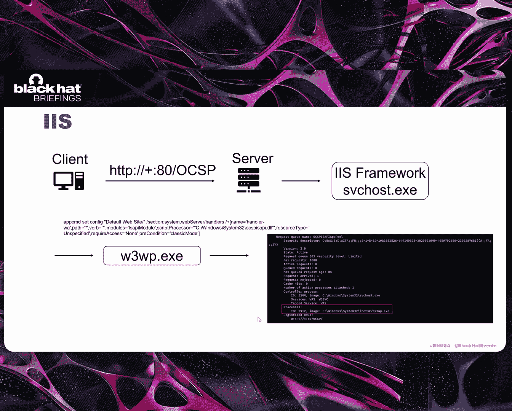

# 课程：深入Windows HTTP服务：揭示隐藏的预认证漏洞 [CD-1s2uBqmQ] 🔍

在本节课中，我们将学习Windows HTTP服务框架的基本原理，并深入探讨其中存在的几种逻辑型拒绝服务漏洞和远程代码执行漏洞的发现过程与利用技巧。课程内容由浅入深，旨在帮助初学者理解这些复杂的安全问题。

## 背景介绍 🎯

我们专注于研究Windows HTTP服务，主要原因是几乎所有这类服务都可以在无需认证的情况下被访问。它们不需要用户交互和额外配置。最重要的是，许多默认服务都构建在HTTP API之上。这意味着如果存在任何漏洞，都可能导致严重问题。

让我简要介绍一下HTTP服务。基于HTTP API的服务使用诸如`HttpCreateServerSession`函数和`HttpAddUrl`函数来注册各种HTTP服务信息。在这些HTTP服务注册后，我们可以使用`HttpQueryServiceConfiguration`函数来获取关于它们的各种信息。

我们可以轻松地使用`netsh`命令来获取关于HTTP服务的信息。这有助于我们快速确定研究目标。

## HTTP服务框架 🏗️

上一节我们介绍了研究背景，本节中我们来看看HTTP服务的整体框架。

基于HTTP API的Web应用程序通过HTTP API提供的接口与内核组件`http.sys`进行交互。这些接口使用具有特定IO控制代码的设备IO控制功能代码。最终，`http.sys`处理诸如接收和发送HTTP协议数据等任务。

以下是HTTP服务的简单框架。所有基于HTTP API的Windows HTTP服务都在此框架下工作。这是最简单、最常见的HTTP服务处理流程。

值得一提的是，几乎所有HTTP API服务都不需要预认证，只有极少数服务需要认证。客户端在收到HTTP头后，使用HTTP头中的NTLM或其他认证数据。但即使在这些情况下，接收阶段本身也不需要认证。

HTTP服务涉及两个重要的HTTP API函数。第一个是`HttpReceiveHttpRequest`函数，它负责接收HTTP头数据。服务调用`HttpReceiveRequestEntityBody`函数来接收HTTP实体数据，例如在接收POST数据的情况下。

总而言之，以下是通用的HTTP服务处理流程。

## 逻辑型拒绝服务漏洞 💥

现在我们已经了解了HTTP服务框架，我将分享一些由于不正确使用HTTP API而导致的逻辑型拒绝服务漏洞。

对于拒绝服务漏洞，由内存损坏引起的崩溃并不是唯一需要关注的问题。对于一个HTTP服务，如果服务器停止处理正常的客户端请求，这也是一种高影响的拒绝服务形式。

首先，我关注HTTP服务的接收阶段。不同的服务使用不同的接收方法，我将其分为三种类型：单线程接收方法和两种异步接收方法。

以下是每种方法的介绍：

**单线程接收方法**
它的主要特点是使用单个线程。我将以CVE-2024-43512中的`AvoidableFunction`为例进行介绍。`HttpReceiveHttpRequest`被设定为接收固定长度`0x1360`字节的HTTP头。当攻击者发送一个长度超过`0x1360`字节的HTTP头时，函数返回`0xEA`，这意味着接收缓冲区太小。通常，服务应该更新缓冲区大小并再次调用接收函数。但这个服务没有更新接收缓冲区大小，它保持在`0x1360`。结果，服务持续循环尝试接收数据，但永远无法从其他客户端接收数据。漏洞触发后，正常客户端只会收到超时错误。

**异步接收方法（类型一）**
在这种方法中，接收仍然由服务内的线程完成，但它不会在`HttpReceiveHttpRequest`函数内部等待。接下来，我将介绍CVE-2025-27471。UPnP服务是这类异步HTTP服务的典型例子。由于`HttpReceiveHttpRequest`函数是通过异步方式处理的，这导致了时间差问题。当攻击者同时发送多个恶意请求时，`HttpReceiveHttpRequest`函数不会像往常一样返回0或`0x3E5`，而是提前返回一个错误。这意味着接收到的字节数在初始化为0后没有被更新。如果返回的错误是`0xEA`，接收长度被设置为0而不是正确的值。我们可以通过设置条件断点来打印`HttpReceiveHttpRequest`函数的返回值来观察这个逻辑问题。当问题被触发时，即使攻击者断开连接，该函数也会永远返回错误。正如你所见，正常的UPnP客户端请求会收到正确的HTTP响应，但一旦漏洞被触发，客户端就无法再与服务器通信。

**异步接收方法（类型二）：使用注册回调**
这是在Windows服务中处理HTTP请求最常见的方式。使用这种方法，多个线程可以同时处理来自多个客户端的请求。这是一个常见的回调处理模式。我列出了一些常见的回调函数。重要的是要知道有些回调是可选的。这些代码是根据服务的需求注册的。

在前两种使用单处理线程的接收方法中，如果接收函数停止被调用来获取新请求，就会导致拒绝服务问题。对于多线程回调方法，在一个函数处理完成后，它在线程池中创建一个新线程并再次调用接收函数。

但这里我想提到另一个需要考虑的拒绝服务技巧。由于线程池中的线程数量是固定的，如果每个线程在处理完成后没有调用`StartThreadpoolIo`函数来在线程池中创建一个新的接收线程，而是直接返回，那么该线程就会结束。当线程池中没有接收线程剩余时，HTTP服务将停止处理正常的客户端请求。

接下来，我将介绍`FunctionResourceService`中的一个漏洞。在这个服务中，`IoResult`是`HttpReceiveHttpRequest`函数的返回值。当它为0时，意味着HTTP请求接收成功。服务正常处理请求，并最终调用`IssueReceiveRequest`函数。在这个函数中，`StartThreadpoolIo`函数被调用来在线程池中创建一个新线程，然后该线程调用接收函数等待新请求。然而，当`IoResult`不为零，意味着接收数据出错时，该函数立即返回而不创建新线程。这意味着，通过重复发送损坏的数据包导致`IoResult`错误，线程池中的所有线程都会退出。正如你所见，在漏洞触发前，正常请求会收到HTTP响应包，但一旦漏洞触发且所有接收线程退出，所有正常请求都会超时。

我去年报告了这个漏洞。MSRC认为，尽管它可能导致拒绝服务，但该服务被认为只在受信任网络中启用。因此，他们将其评为低严重性。

在接收阶段，我介绍了使用这些技巧的三个案例。我在Windows HTTP服务中发现了许多类似的问题。从研究这些漏洞中，我认为对于HTTP API服务，处理函数绝不应停止接收。换句话说，在任何请求之后，无论是有效的还是无效的，服务都必须将`RequestId`设置为0来调用`HttpReceiveHttpRequest`函数以等待新的客户端请求。仔细检查函数的返回值，并正确更新和验证接收函数的参数尤为重要。

## 响应阶段与连接管理 🔗

上一节我们探讨了接收阶段的漏洞，本节我们聚焦于响应阶段。

这里涉及两个函数。第一个是`HttpSendHttpResponse`函数，它发送HTTP响应包。第二个是`HttpCancelHttpRequest`函数，它强制断开与客户端的连接，导致客户端收到错误。客户端和服务器之间的连接实际上是在内核驱动中建立的。它通过`AllocateConnectionForLookaside`函数创建一个连接，并初始化一些所需的结构。类似地，当服务器主动断开连接时，它调用`FreeConnectionForLookaside`函数来关闭连接，释放相关结构并减少连接的引用计数。

当我的分析进行到这一点时，我想知道如果服务器不主动关闭连接会发生什么。换句话说，如果它从不调用`HttpSendHttpResponse`函数或`HttpCancelHttpRequest`函数来关闭连接会怎样。

我在一些服务中发现了这种情况。在接收和处理数据后，它们不调用`HttpSendHttpResponse`函数或`HttpCancelHttpRequest`函数，而是立即开始接收新数据。当我调试内核时，我看到`http.sys`没有关闭连接或减少连接的引用计数。这可能导致内核中的非分页池耗尽。

我以`BranchCache`服务为例。相关函数在MSDN上有文档，其中定义了不同类型POST数据的结构。

在POST数据结构中，我们可以指定服务应处理哪种数据。当我们发送特定数据时，服务使用`throw`辅助函数抛出异常。然后，服务在注册的回调中调用`HttpReceiveHttpRequest`函数来接收新数据，但它不调用`HttpSendHttpResponse`函数或`HttpCancelHttpRequest`函数来关闭连接。这导致`http.sys`中的连接未被释放。

以下是一个简单的演示。首先，使用`netsh`，我们可以看到`BranchCache`服务正在运行，以及它的URL和服务器的IP地址。接下来，我们从认证客户端运行PoC。你可以观察到非分页池的增长，最终导致系统蓝屏死机。

这些类型的漏洞导致非分页池耗尽，进而导致系统挂起或蓝屏死机。我认为服务在处理后必须始终响应，无论是成功还是失败，通过调用响应函数或使用注册的断开连接回调主动关闭连接。

## IIS框架与相关漏洞 🌐

最后，我们来谈谈IIS。IIS是一个框架，它本身也是一个构建在HTTP API之上的服务。IIS为一些Web服务提供了一个基本框架，帮助它们处理接收和响应请求。Web服务只需要通过ISAPI扩展处理数据。值得一提的是，使用C#或ASP.NET的常见Web服务器在核心上也由Windows内置的ISAPI扩展支持。

通过ISAPI和CGI限制，我们可以找到不同服务使用的ISAPI扩展。

对于运行在IIS上的服务，当客户端发送HTTP请求时，IIS使用一个命令为相应服务启动`w3wp`进程。一旦服务运行，我们也可以通过`netstat`看到它的进程。

在这个进程中，一个非常重要的数据结构是`ISAPI_CONTEXT`。对于IIS上的每个服务，当`w3wp`进程被创建时，也会创建一个`ISAPI_CONTEXT`结构。随着IIS服务的访问，`ISAPI_CONTEXT`结构被释放。对于这个结构，每次有特定服务的请求到达时，IIS检查该结构的引用计数。IIS设置了`0x1366`的引用限制。如果引用计数超过`0x1366`，IIS返回一个503服务不可用错误。

通常，IIS可以处理数据接收，但ISAPI扩展必须决定何时发送HTTP响应。为了支持这一点，IIS提供了`ServerSupportFunction`，这是一个具有不同分支以满足各种需求的调度函数。为了确保`ISAPI_CONTEXT`的引用计数保持平衡，`ServerSupportFunction`中的一些分支会减少`ISAPI_CONTEXT`的引用计数。

因为`ServerSupportFunction`管理着`ISAPI_CONTEXT`的引用计数，并且这个函数被不同的ISAPI扩展服务使用，所以ISAPI扩展在使用时必须非常小心。错误地使用`ServerSupportFunction`会导致引用计数问题，例如过早释放，从而导致释放后使用或拒绝服务。

接下来，我将分享CVE-2024-38067。OCSP是一个在IIS框架下运行的服务。OCSP ISAPI是它的ISAPI扩展，它处理来自客户端的POST数据并将结果响应回客户端。最终，OCSP在`SendResponseToClient`函数内部调用`ServerSupportFunction`来发送HTTP响应。

在`ServerSupportFunction`的分支中，服务器首先调用`Flush`函数。最后，在`PostCompletion`函数中，`ISAPI_CONTEXT`的引用计数被减少。然而，如果攻击者的客户端在发送POST数据后但在收到服务器响应之前提前断开连接，`Flush`函数会返回一个错误。结果，`PostCompletion`函数没有被调用，`ISAPI_CONTEXT`的引用计数没有减少。当引用计数达到`0x1366`时，OCSP服务将停止处理任何请求。在拒绝服务被触发前，正常请求会收到响应。触发后，客户端将收到503服务不可用错误。

这些类型的漏洞也会导致永久性拒绝服务。更严重的是，由引用计数问题引起的释放后使用很常见。如果ISAPI扩展不小心使用`ServerSupportFunction`，类似的问题可能导致远程代码执行。在开发ISAPI扩展时，在使用ISAPI支持接口时，我们必须密切关注结构的引用计数。

## 远程代码执行漏洞案例 ⚔️

我已经介绍了HTTP服务接收和响应阶段的逻辑型拒绝服务问题。接下来，我们将介绍HTTP服务中的远程代码执行问题。

首先，我将介绍KDC代理服务的HTTP服务。它提供了一种机制，允许客户端使用代理服务器更改密码并从KDC服务器安全地获取Kerberos服务器票据。客户端通过HTTPS与KPS服务器建立连接。然后，服务器解析客户端提供的域的IP地址。随后，KPS与KDC服务器指示的IP建立套接字连接，充当客户端和KDC服务器之间转发消息的通道。

以下是三列内容。第一列列出了服务器中使用的HTTP API。第二列显示了服务器在HTTP API注册的事件发生后涉及的回调函数。第三列显示了触发这些回调的事件。正如你所见，这是一个基于异步回调的HTTP架构。

当服务器调用`HttpReceiveHttpRequest`时，如果客户端发起连接请求，服务器进程会触发`KPSHttpReceiveRequestIoCompletion`回调函数来处理新的连接请求。如果服务器配置了客户端证书，它会等待客户端发送带有证书的请求。然后，服务器调用`HttpReceiveRequestEntityBody`来等待客户端的消息。如果客户端发送消息，它会激活`KPSReceiveRequestEntityBodyIoCompletion`函数，该函数继续处理客户端的消息。由于服务没有注册`HttpWaitForDisconnect`，当客户端断开HTTP连接时，服务器不会响应，导致新的问题，尽管这不是我们的主要关注点。服务器本身调用`HttpCancelHttpRequest`，随后在新线程中触发`KPSHttpCancelRequestIoCompletion`回调函数。服务器可以使用`HttpSendResponse`向客户端发送消息，并触发未完成的回调函数。

连接建立后，服务器调用`DsGetDcName`函数，该函数查询DNS服务器以获取与域对应的IP。假设客户端提供域`test.yours.zz`，它将查询两个SRV记录，假设服务器返回`abc.test.your.zz`。然后它使用LDAP协议评估此地址以获取Kerberos服务器地址，例如`abcd.test.your.zz`。在后续过程中获取此地址后，服务器调用Winsock接口`socket`和`connect`连接到我们模拟的Kerberos服务器。

此时，KPS服务器充当客户端。当它从伪造的Kerberos服务器收到消息时，会触发3个回调函数来处理接收到的消息。

接下来，让我们讨论案例CVE-2024-43639。在`KPSSoReceiveDataIoCompletion`回调过程中，它通过几个函数解码消息。由于套接字不限制接收消息的长度，消息长度可以是任意长度。当调用`ASN1InCheck`函数时，如右图所示，`a2`是当前消息长度，第10行，如果`a2`大于`word_18`的值，则将其赋值给`r8d`。在下一行，`dword_18`和`v9`相加，和赋值给`return1`，然后用作分配内存的大小。如果消息长度是，例如，`0xFFFFFFFF`，而`dword_18`是5，那么加法会溢出到0，导致分配非常小的内存。随后在向这个小内存写入数据时会导致溢出。在适当的条件和布局下，这可能导致远程代码执行问题。

以下是崩溃堆栈跟踪。我们可以看到RCX指向一个不可读的地址。

讨论完KDC代理服务器后，让我们转到另一个案例：远程桌面协议服务及其网关服务。远程桌面服务是Windows中的内置组件，使用户能够通过网络远程控制Windows系统。此功能通过使用端口3389的RDP协议实现。然而，Windows远程桌面服务也使用端口3387，它实现了一个支持WebSocket的HTTP服务。它允许客户端通过HTTP完成远程桌面协议请求。

现在，让我们探索远程桌面网关服务。如图所示，客户端通过HTTPS端口443或DTLS端口3391与远程桌面网关服务连接。经过一系列协商和认证后，网关服务将客户端的远程桌面协议消息转发到相应的远程桌面服务器。

现在，让我们检查远程桌面网关服务的HTTP架构。远程桌面服务器及其网关都采用了类似的基于异步回调的HTTP架构。正如你所见，它与KPS架构相似，不同之处在于它有一个用于处理连接断开的注册回调函数，以及用于处理WebSocket和非WebSocket请求的回调函数。

现在，让我们使用此流程图完成一个正常的连接过程。首先，客户端向服务器发起一个WebSocket请求，连接ID为`ConID1`。这会触发服务器的`HttpReceiveRequestCompletion`回调函数。在处理过程中，它调用`ProcessOutChannelOrWebSoRequest`函数，该函数为此连接分配新的连接结构并将其存储在哈希表中。随后，它调用`HttpSendHttpResponse`向客户端发送消息。完成后，触发服务器回调函数`HttpSendResponseCompletion`，该函数分配`HttpServerConnection`结构并将其绑定到`Connection1`。在后续处理中，它调用`ReceiveData`，其中参数3是指向`HttpServerConnection`结构偏移量的指针。在`ReceiveData`函数内部，它使用连接ID`ConID1`从哈希表中检索`Connection1`，并将参数3分配给结构中成员的缓冲区字段。在后续调用中，通过`WebSocketReceiveRawData`并调用`HttpReceiveRequestEntityBody`来注册新的回调。当服务器从客户端收到消息时，会触发此回调。在处理过程中，它调用`WebSocketReceiveLoop`，执行一个关键步骤：将接收到的消息复制到`Connection1`成员的缓冲区字段所指向的地址，该地址是`HttpServerConnection`结构的偏移量。其他操作随之进行。

那么这种架构可能有什么问题呢？客户端可以使用相同的连接ID连接到服务器吗？事实上，这是不允许的，因为`ProcessOutChannelOrWebSoRequest`会检查ID是否已存在于哈希表中。但是，我们能否在获取操作之前释放连接，然后让客户端使用连接ID1进行连接？这似乎是可能的。让我们推断一下会发生什么。

首先，客户端1使用`ConID1`连接到服务器，服务器创建`Connection1`结构。发送后，它创建`HttpServerConnection1`。然后进入`ReceiveData`。在此时刻，我们断开客户端1。由于断开连接回调已注册，服务器自动触发`HandleDisconnected`，该函数取消引用`HttpServerConnection`结构并从哈希表中移除`Connection1`。此时`HttpServerConnection`可能不会被释放，因为对它的引用仍然存在，直到`HandleSendResponseCompletion`完成。然后我们使用相同的连接ID连接客户端2，服务器创建`Connection2`并将其放入哈希表。现在，返回到`ReceiveData`线程，它继续运行，使用连接ID1从哈希表中检索`Connection2`，并将参数3分配给`Connection2`结构的缓冲区字段。然后它调用`HttpReceiveRequestEntityBody`来注册回调函数。`HandleSendResponseCompletion`函数完成，`HttpServerConnection1`的引用计数变为0，因此没有引用，参数3将成为一个悬空指针。后来，当客户端2向服务器发送消息时，它会激活`HandleWebSocketReceiveRawDataCompletion`回调函数。在函数内部，它使用`CallID1`从哈希表中检索`Connection2`，并向悬空指针写入数据。因此，我们可以溢出到一个悬空内存。

以下是崩溃现场的堆栈。正如所示，它在内存复制函数中崩溃，RCX指向一个不存在的地址。

## 总结与展望 📝

本节课中我们一起学习了Windows HTTP服务框架及其存在的多种