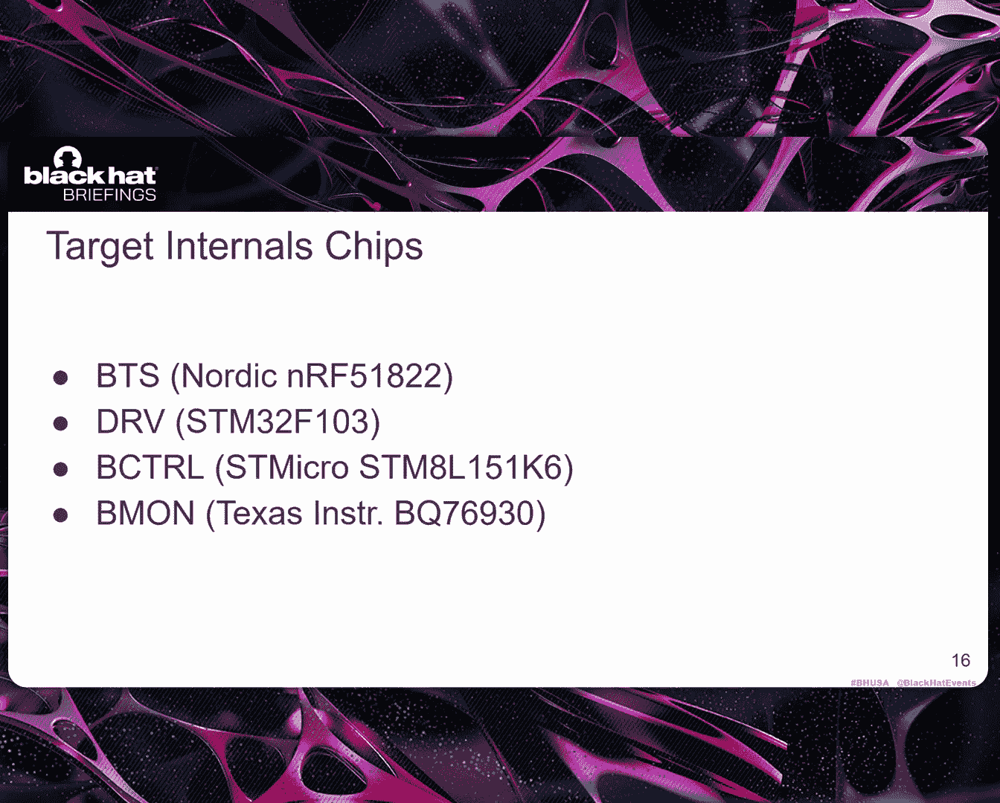
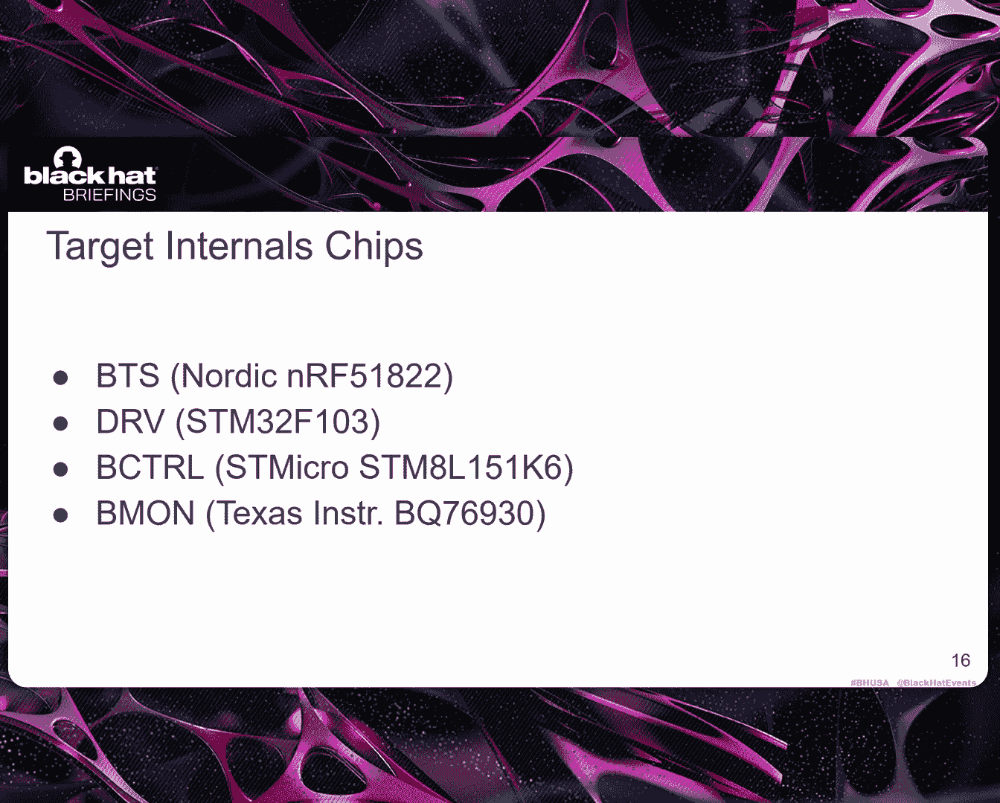
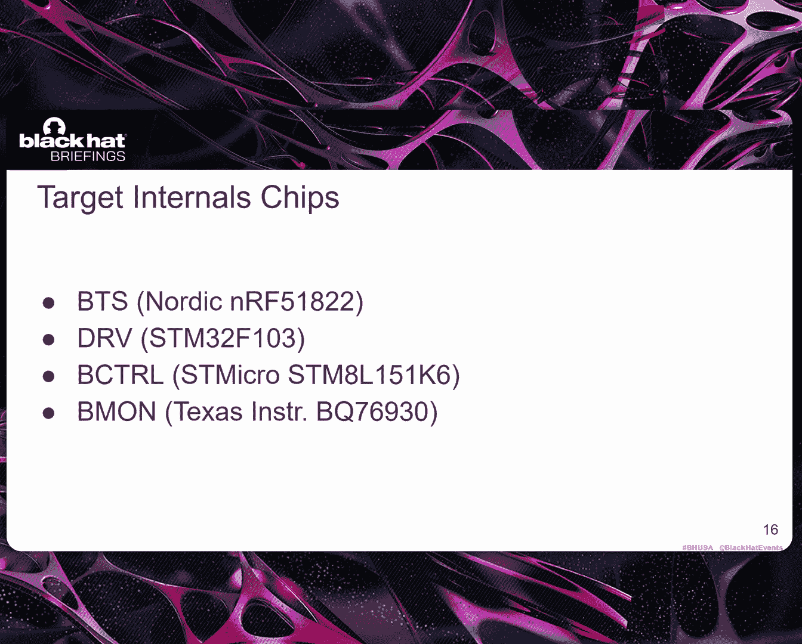
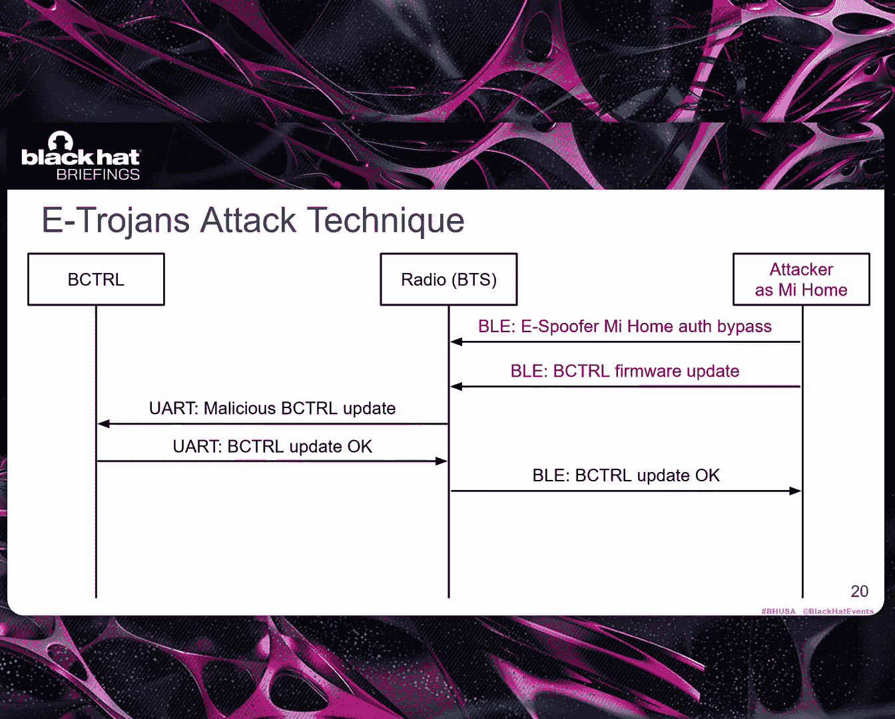
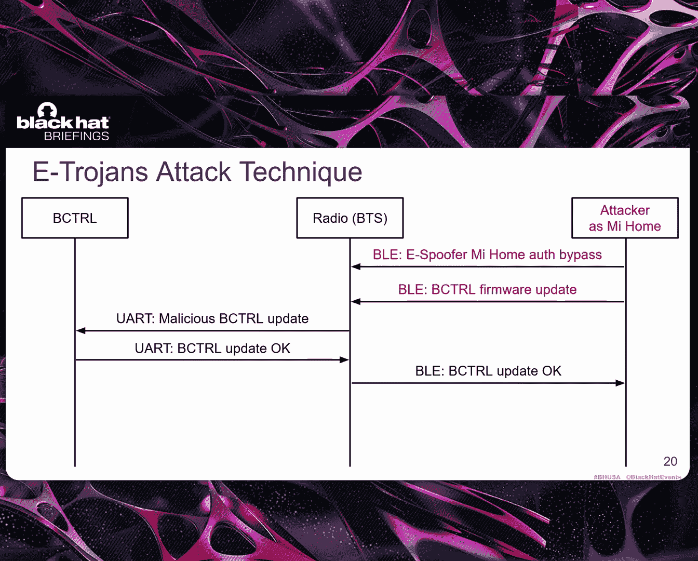
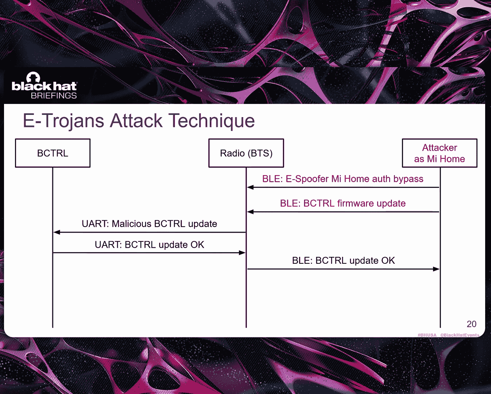
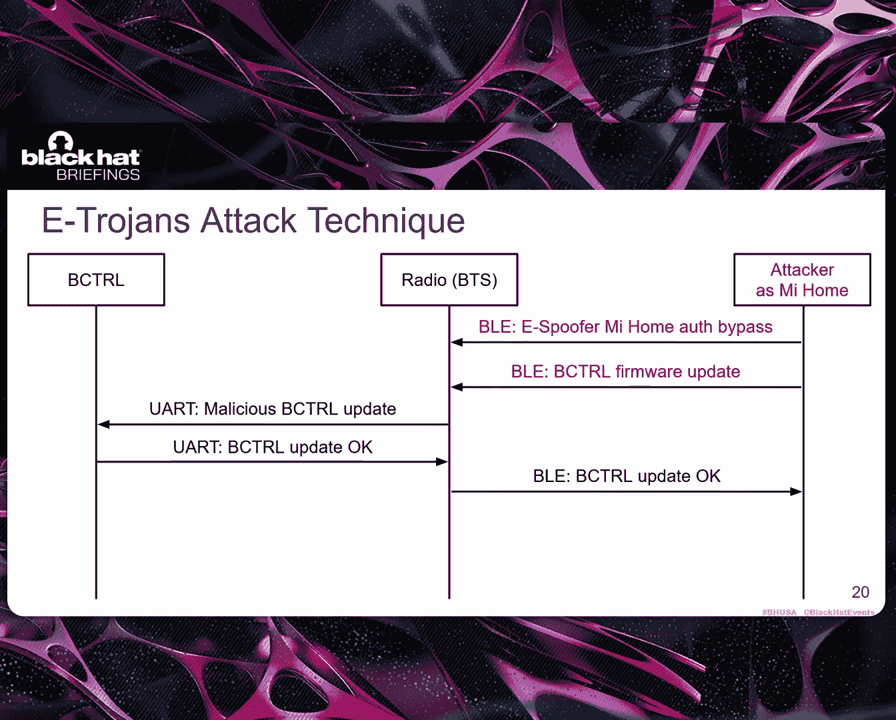
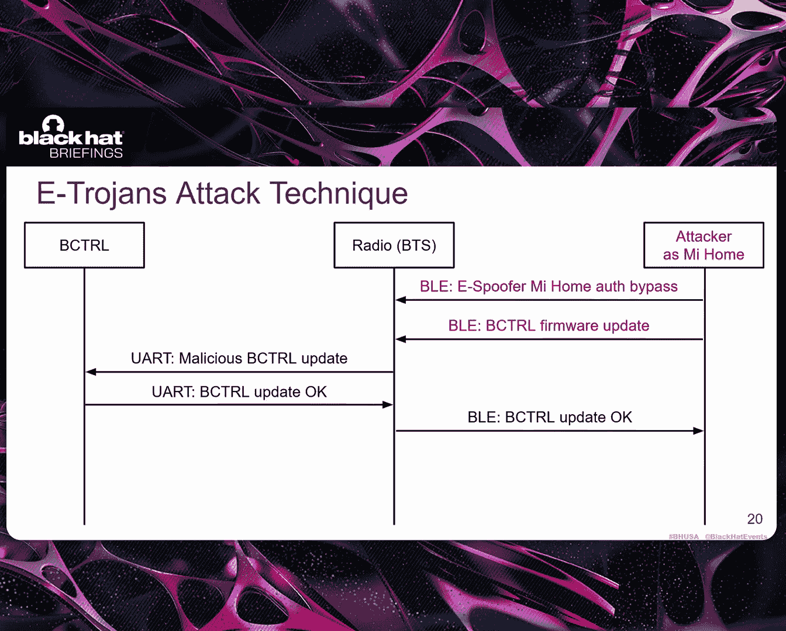
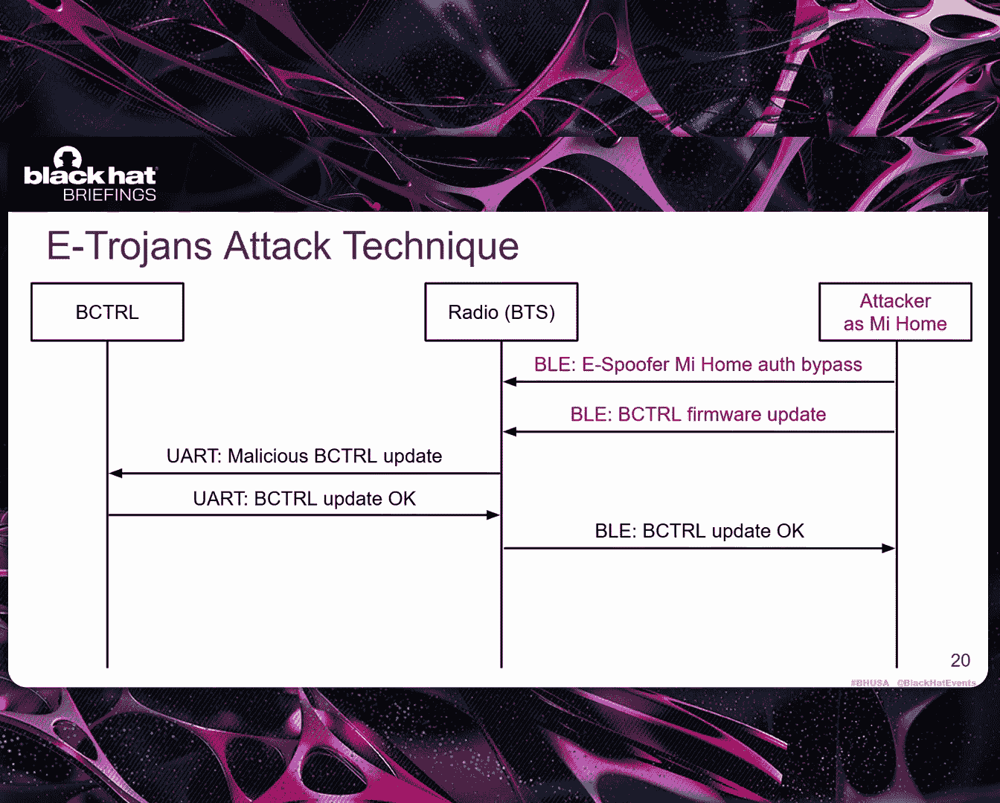
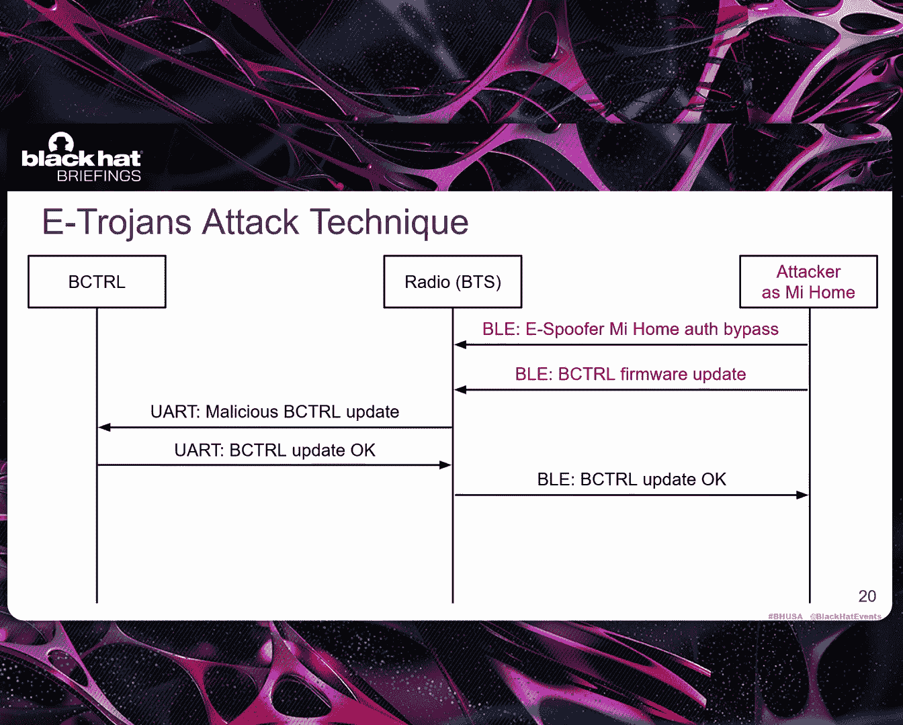

# E-Trojans： Ransomware, Tracking, DoS, and Data Leaks on Xiaomi Electric Scooters [k-UsaSfndQQ]

Hello， I'm Marco， so I'll introduce myself。 I'm a postdoc at K T H in Sweden。 It's a university。😊。

And this work was made during my PhD at Urecom in France under the supervision of my co speaker。

 professorfesor Ben Antonioli， Me of topics are in security and privacy。

 So I analyze proprietary and standard protocols transport that you all probably know like Blue energy。

 Wifi and X C and so on。 and also mobile security。😊，And now there you go。 Yeah， thank you， Mark。

 I take the stage。 So thank you for coming to our talk。 My name is Daniela Antonioli。

 I'm an assistant professor at Uracom， a university and Research centre located in the southern part of France。

 We do research in security and privacy。 We cover topics， including Bluetooth， electric scooter。

 Fido to indicators and web tracking。 You can find more information about my research in the website。

😊，Before we talk we， we start with the talk， I would like to acknowledge three coaus of the Hiroians research project。

 Ricardo Cstao， Ionor Luzuk and Marco Conti these are researchers from the University of Padua in Italy located in Italy。

This is the outline of the talk。 so I will start by introducing electric scooters and I will provide a summary of the heteros vulnerabilities and attacks。

 and then Marco will take over and he will cover in detail two of the eros attacks one is called overvoltage battery destruction attack。

 The second one is the undervoltage battery raner attacks。

 There are three more attacks in our project and encourage you to treat the research paper about itgens then Marco will talk about the reverse engineering techniques we used to uncover this attacks and the vulnerabilities。

 the toolkit that we develop and partially open sourced containing ways to test the attacks and the experiments that we run against Xiaomi scooters and then Marco will conclude the talk with the presentation of the countermeasures that we recommend to Xiaomi and the responsible disclosure that we did with Xiaomi in the in the last。

2， two years and so。So let's start with a quick introduction。 just to set the stage。

 you are talking about ecootters and escootters what is what you see on the left is an embedded system。

 rather complex one。 it looks like a smartphone on wheels and it has a radio interface and can communicate with a smartphone。

 A smartphone is typically running a companion application to control the the ecootter。

And the two devices are talking using proprietary protocols。

 which can be transported using several wireless technologies。 Most of the times。

 this technology is Bluetooth or energy because it's low cost and pervasive。

 But the the important thing to remember is that the protocol that is spoken over B is a custom one。

 Typ is vendor specific might have some security to security measure and so on and so forth。Then。

 they。Mobile application communicates with the Ecoter backend， which is a cloud service。

 And this communication link uses standard Internet protocols such as T， L S and T CPPI P。

And during the talk， we will focus on this red square。 So on the es scotter。

 the wireless link between the e scooter and the mobile app and the mobile app itself。

 This is the our attack surface。EFor it regionss， we decided to focus on Xiaomi is goodter specifically because Xiaomi is a market leader。

Maybe you know about the M3，65 and me 3。 These are two very popular electric scooters that are used both for personal as private scooters and also in rental services such as Bt。

 And the companion app for this E scooter is called me home。

 This is an app available for Android and i， which provides several functionalities。 You can。

Create an account with the Xiami backend。 Then you can pair your app with your escoooter。

 and then you can， for example， set a password the via the app to lock the scooter to unlock the scooter。

 You can get some sensor readings from the es scooter like the battery value。

 the voltage and the so on and so forth。 And you can also send Fware updates。 Remember this feature。

 because this is the feature that we are exploiting。 rogue Fware updates。

And it is very important to study e scotters because these days。

 they can be attacked in several ways， even remotely in wireless proximity。

 and an attack on an e scooter can have not only the typical security and privacy implications。 like。

 for example， I don't know， breaking an encryption protocol or leaking some sensitive data。

But if you compromise an es scooter， you can have some safety concerns like physical damage。

 You can maybe set the es scooter on on fire， right， So it。

 it is very important that these scooters are properly protected against remote attackers and proximity based attackers。

When we started this research in 2023， we looked at the state of the art and we。

 we found this work from Zimperium from 2019。 Don't give me a break where Zperum demonstrated an attack。

Where they use a custom application running on the attacker's marathon。

 This custom application was capable of crafting a wireless packet B packet。

 using this Xiaomi proprietary protocol that they reverse engineer and by using this application。

 the researchers were able to demonstrate remote lock command on the scooter shown in the picture。

 And by starting from this little work。 Then we we ran an extensive security evaluation on Xiaomi scooter。

 And then we presented the paper called e Scooter in 2023 at AM Yec。

 This is a premier conference on wireless security and privacy where we。😊。

Studied all the ways to compromise an ecoter while spoofing trusted Xiaomi me on app。

 we demonstrated。Proximity based attack。 We are using a device。

 We were capable of pairing maliciously with the scooter and then not only sending a lock command。

 but any authorized command that you can do if you have ill me。

 and also we extend the attacker model to what we call a remote attacker。

 which is different from what we seen in the previous picture imperium。

 because this time we install a malicious application on the victim's phone this malicious application is coexisting with me home And then whenever the text that there is the scooter in in range。

 then it can send malicious payloads。 And this is a sort of a remote attack surface because we can remotely target the scooter via the app and we can easily spread mal issues up as for example。

 moing up。 whenever you have an e scooter， you can install from thirdpart markets this moing applications where you can change the maximum velocity of the scooter。

 So it's quite easy for an attacker to repair。Backackage one of these moing appss that are very popular。

 and they are not checked by the user and then compromise the e scotter。So this is Epofer。

 And then the follow paper is eroggens。 This is the the the focus of this of this talk。

 And this is research where we started from the epooffer findings。

 And then we evaluated what we could do as a remote s proximity attacker by sending these malicious commands。

 proprietaryary commands over really to affect these scooer internals。

So the focus is the internals of the escoter。The paper is is， there is a paperprint on archive。

 and the paper is currently under submission for also for for an academic conference。

 So let's quickly look at the scooter internals。You have several system on chips。

 which are coex system in the in the scooter。 One is the D RV the electric motor system here。

 color coded in yellow。 This is a chip that is managing the electric motor。 This。

 this chip is connected to a B， T， S and the B M S subsystems。 The B T， S is the Bluetooth subsystem。

 This is the radio system。 This is very important is the gateway that provides access to the other subsystems。

V wireless signals。 And so， for example， whenever you are。Sending the filmware update。

 You want to update。 I don't know。 The Fware of the D RV。 Then you the the filmware is sent over B。

 A E from the neom app to the B， T， S。 And then the B， T。

 S is distributing the filmware internally using an embedded bus like Ut。

And then the third important subsystem is the battery management system。 This is the， the。

 the system that is managing the， the battery is managing the charging of the scooter。

 And if you look under the hood， typically it includes two modules。 One is the battery controller。

 and the other one is the battery monitor， which are indicated here as B， C， T L and Bmon。

One important thing to understand is that the battery controller Fware can be updated over the air together with the D RV Fware and the B T S F。

 Instead， the battery monitor is like an analog front end。

 which can be partially programmed via the battery controller。

 There is a bus connecting them an embedded bus an eye to C bus。

 and then you can send signals to write register and read registers to program the battery monitor。

 And we will see later that you can use this as an attack vector to compromise the battery management system。

 Then there is a battery charger that you can plug on the scooter， and then you can charger。😊，ですこ。

This is just a picture of the internal。 So if you open an electric scooter。

 this is what you will see。 A D RV， B M S， the battery cells， the S T link。

 the black cables and also the B T S system on chip， the B。

 T S system on chip typically typically is located close to the headlight while the other chips are located on the base of the scooter where you also have the the battery。

This is a picture of the battery management system， two sided picture on one side。

 you have the battery controller on the other side， you have the battery monitor。 So these。

 these are two system on chip on the same subsystem。And in the our itroggens evaluation。

 we focus on two very popular scooters。 Remember that we started this analysisis in 2023。

 And at that time， the most famous， most popular scooter was the Me 3。 So that's why we targeted it。

 This is a second generation scooter from 2021。 And then also we decided to target the most popular first generation Xiaomi scooter。

 which is called M3，65。😊，And by targeting these twoooters。

We also implicitly target what is in between like the pro， the pro 2， the1 S and the essential。

 These are scooters from 2018 and 2020。 So these are also in scope。

And this is just the list of chips that we target。 So this is scta are sharing these chips。

 and the chips might be running different thermal versions， but the， the problems still holds。

 The B T S is running a Nordic N R 51。 This is very popular chip for radio communications。

 The D RV is running an S TM 32 chip。 The Bluetooth controller and S TM micro with an S TM 8 architecture。

 and the Beamon， the analog front end is a Texas instrument chip， which is partially programmable。

Alright， so now let's look at the itroggen vulnerabilities and and attacks。

 So we start with the following track model。 We have a victim that owns an e scotter。

It is paird with the ecooootter via the malicious app。

 We have an attacker that can either target the e scooter in proximity using B，L E signals。

 So with the laptop with the special BL board or the attacker can also install a malicious application on the victim's smartphone and then target the e scooter from。

 from the smartphone of the of the victim。 So this is the threat model。😊。

And we run an extensive reverse engineering campaign on these ecootters using static and dynamic techniques。

 Marco will talk briefly about these techniques later。 But long story short。

 we uncovered four critical vulnerabilities affecting this ecooootter。

 First one is that the the fact that the Bluetooth controller firm is unencrypted。

 And so we were able to extract the film， both from the mem up and also from the memory of the Bluetooth controller and then reverse engineer。

 the firm。😊，The second problem is that the Bluetooth control film is not signed。 This is really bad。

 This means that you can install a rogue firmware on the electric scooter using a wireless signal。

 And this is exactly what we do。 So our attack technique is a rogue F update。And the fear that is。

 is like a payload。 And then with this attack technique， we can mount different attacks， one attack。

 one payload。The third vulnerability is that the U art communications。

 which are implemented to connect the internals system on chips lack integrity。

 encryption and authentication。 And this is also very bad because we can combine the mal issues F update with the fact that in the we can program the Bluetooth controller to behave as the D RV or the B T S because we can spoof the internals。

 And then we can send several internal messages to get data from the B T S to prevent the B T S from knowing that something is wrong to stop charging to to do whatever we want。

 And so the combination of V2 and V3 is very powerful。

 And then there is also a problem of denial of service。

 because the U art communications in the internals are not protected against of service。

 And then we were able to exploit this vulnerability to denial of service。

 the internals of the scooter V firmware update。😊，So these are the four vulnerabilities that will be exploited in the attacks。

And this is the eros attack technique。

Taking advantage of these vulnerabilities。 So there is the attacker。

 The attacker is communicating with the radio system。

 The radio system is the gateway to into the internals of the scooter。

 the first message of the attacker is exploiting ispoofer。 If you remember， with ispooffer。

 we were capable of bypassing authentication by using some tricks and。

 and some vulnerabilities that we that we found。 And once we byss authentication。

 then we can act as if we are the real neon app。

So， you are the real me O map。 Then we send Bluetooth controller from update date message over Bluetooth energy。

 Remember that all these messages are not standard B messages， but these are proprietaryary messages。

 So you have to reverse engineer the protocol before being able to， to， to send these messages。

And once we send this film update message。

The radio system is getting the firmware， which is inside the。

 the set of messages that we that we send。 And then it is distributing the firmware to the Bluetooth control。

The Bluetooth controller module， the Bluetooth controller module is installing our malicious firm and then is answering with a message that everything is fine。

 And then the radio is answering to the attacker saying that everything is fine。

 So this is the erosion attack technique。 a rogue firmware exploiting the lack of integrity protection in the Bluetooth controller。

 the Bluetooth controller is not checking that that there is no signature to check。

And also， we are exploiting the fact that we can spoof internals because the internal communications are not protected as well。

And then we use this attackctic team to present five new attacks。

First one is the under voltage battery ransomomer。 Marco will talk in detail about it。

 This is the first， As far as we know， ransomomer for electric scooter。

 This is the first attack that is using under voltage as an attack technique。

We present an over voltage over voltagetage battery destruction attack。

 And this is the first attack that is using over voltaget to target any e scooter。

And these two will be presented in detail。Next， I we will focus on the last three， which are。

 if you want to get more details about the last three attacks， you can read the paper。

 but basically with the third attack， we can track the user， the internals。

 So we we show that it's possible to create a fingerprint of the e scooter by reading some values that are unique for each scooter like a battery serial number。

 the electric motor serial number。 And this are very strong fingerprints。

 Then we create the fingerprint， and then we use the B module to advertise this fingerprint。

 And then with the network of zips， we can track a user based on this fingerprint。

 This is the the first time that an attack has been demonstrated on an e scooter。

 such a tracking attack。 Then we also do the another service attack where we break the U communication inside internals with our managed firm。

😊，And also， interestingly， we are also capable of leaking the password。

 the neon password via the escooootter。 This is also interesting。 whenever you have an es scoootter。

 you can set the password to lock and unlock it。😊，But the。

 the password is not only stored on the hub， but it is also stored on the ecootter， hashed。And so we。

 we are capable of recovering this hash and then leaking the hash the same way we lick the。

 the fingerprint， and then we can brufor the hash and then recover the password of a user of or the pin code of。

Of the user。Alright， now Mark will take over and continue with the technical details of the attacks。

Thank you， Daniela， for letting me， letting me explain the cool part of the attacks。

 So we' will talk about two attacks starting from the over voltaget battery destruction。😊，So， first。

What is over voltage， This is a picture of a battery cell。

 You have multiple of them inside your battery。So now we are talking about a Xomi lithium battery cell。

 and it has an operating range of 4。2 V， which is the 100% charger。And then up down to 3。6 Vt。

 which is when the scooter stops driving and you are at 0% charge。 This is a normal operating range。

 battery of a voltage happens when you have a voltage overflow。

 So when the voltage of a battery cell goes over 4。 shoevol。 So the charger goes above 100%。

So this can happen if you have a compromise a malfunctionuring charger。

So this is what we are assuming in our threat model。

And over voltageage is a very dangerous physical state that has serious consequences。 For example。

 leads to permanent battery damage cells becoming imbalanced。 So they have different voltages。

You have overeating due to the increased energy going through。And this also leads to safety hazards。

 like fires or explosion。So， the battery monitor。Has an over voltage threshold register。

If the voltage of a cell goes over the threshold， the battery monitor sets an O V an over voltaget fold bit to one in the system that register and also sends an alert to the battery controller。

The battery controller can write。Battery monitor register。 So he， he has read right access to most。

Of the battery monitor registers。 This means that we can influence the battery monitor from the battery controller。

 which。We can access since we can do the mal issuesious frame update。 So， for example。

 we do several things。 but just two things as an example。

 we set we write FF in the threshold register for over voltage to set the threshold from 4。2 to 4。7。

 This is the maximum amount that the battery monitor support。

 So this is why we call it a critical over voltage。

 We are going over the maximum limit that is setable by the battery controller。😊，Or， for example。

 we can un set the voltage full to bit to 0 in the system register so that it doesn't look like there is another voltage going on from the point of view of the battery monitor。

So for the attack over voltaget battery destruction starts with the malicious firmware flashing。

 And then this battery controller。 That's the following。

 we set the over voltaget threshold to the maximum 4。7。

 This allows us to perform the dangerous over voltage。

 Then we ignore every over voltaget alert from the battery monitor。

 This means that we whatever security measure that Xiaomi put in the battery controller。

 we are just not executing it and ignore it because we have a control of the battery controller。 So。

 of course。😊，Then we un set the over voltage fold bit in the battery monitor。 And also。

 we set this fat charge bit to one。 So when there is an over voltage。

 there is this fat charger that can block charging So under normal circumstances。

 the scooter does not charge anymore， even though if it's plugged into the electricity。

If the battery controller sets this to one， it starts charging away again。 So now。

 since we are ignoring the fault bit and making it charging。

 we can go over the critical over voltaget threshold。

Then we also don't want load balancing because load balancing means that we are equalizing the voltage of cells。

 So if a cell is overvolted， we are putting the voltage into other lower voltage cells。

 and making them equal。 And hopefully， this technique tries to put them all in the operating range。

 So we don't want this。 We want them imbalanced。 We want over voltage。

 So we change the balancing bits in the cell ball registers。😊，And finally。

 we just report that there is no voltage going on to the Bluetooth system and ultimately to the user。

 So the attack is stealy。😊，So now we look at a more sophisticated attack。

 which is the under voltage battery around summer， UBR。So what is under voltage。

 So now we have the same battery cell and the same operating range。 In this case。

 battery under voltage happens when the voltage under flows。

 So when a voltage of a battery cell goes below 3。6 V， which is a nominal， lower value。

 So the charge goes below 0%， Yes， it's possible。So。

Under voltage is also a safety risk because in its consequences。

 you have also permanent battery damage。 You have this。

 the batteries that cannot recharge anymore due to the damage。 You can even have polar version。

 So when you have a deep discharged battery cell。 So the voltage is very low， close to 0。

 And there is current going through。You can have this phenomenon。

 which reverses the polarity of the battery。 And this is very dangerous and leads to fires。

 short circuitquis and explosion。So similarly to before。

 there is an undervolted threshold in the battery monitor。If we， we go lower。

 we set the overvol1 under voltage fault bit， and we also raise the under voltage alarm to the battery controller。

 The batteryy controller can also write the under voltage registers。 So if we write 00。 in this case。

 we set the under voltage threshold to the lowest amount possible， which is 1。58。

 which we call critical under voltage。 It's even below the maximum setable value。

Then we can also un the underwvated fault bit， like before。

So when we deploy the undervol battery ranom， we do the following。

 we flash our firmor in the battery controller， and then we set the threshold for under voltage to the minimum 1。

58。 so we can do the dangerous under voltage， we ignore under voltage alert。

 and also we don't do anything that the battery controller will normally do to prevent under voltage。

 We also un under voltage voltage bit。 And now we set the fat discharge bit。

 So the discharge is a different kind of set。 it's a different bit in the same register。

 And this allows the scooter to minimize the energy。

 the power consumption because when we are undervoling。 It means that we are draining power。

 So if we shut down the Bluetooth system。 and the motor system， we are reducing consumption and。😊。

The voltage can be mitigated。 so we don't want that。

 So we set the fat discharge bit to one so we can。Continue discharging the battery and go below the critical under voltage status。

We also don't want balancing for the same reasons as over voltage。 We don't want balance itself。

 We want high difference in voltage。And it is also stealthy。

 So we don't report any under voltageage to the butoo system and to the user。

So UBR is the first e scooter ransomomer。 We targets physically the battery。

 We do under voltage to physically damage the battery。 This is different than typical ransomomer。

 which targets the data， encrypts the data。We put a trigger condition in the ransomomer。

 which at some point， for example， when we reach critical under voltage。

 it reveals the infection to the victim。 So we do this by changing the B advertisement。

 So we send a Xiami command to the Bluetooth system to change the BL advertisement of the device with a short link to download our app the app explains to the users his unlucky situation。

 and ask him for a ransom Otherwise， the scooter will continue drain power and the battery will be permanently damaged。

 and this increases over time。 So it's a ticking clock to recover to to stop the the undervol。

 We also provide a recovery service We are very kind in our ransomomer。

 So you can flash this battery controller frameer for recovery。

 So this recovery doesn't mean that you reverse。😊，The physical damage， the damage is physical。

 You can do anything about it。 Your battery health is already diminished。

 but you can solve the under voltage issue by。Graing the voltage。

 because in the normal showiaomi filmware， if the scooter is undervoled， you can charge it。

 That's it。 We remove this because because of safety reasons。

But we remove this and we get you this recovery frameworkware。

 So you can at least use the scooter in whatever condition remains。So this attack。

 UBR is also usable without asking for ransom。 And this is a silent destruction of your battery。

 You just underwvolt it。 and then eventually， the battery will die。

So now I will talk about the engineering， the toolkit that released today on Github and the evaluation。

So we it took months of reverse engineering in order to understand thecoooter internal architecture and the firmer we。

 we've done， weve used a set of dynamic and static techniques。 So， for example。

 we compile the firmer。 we read the bus traffic。Two examples。

 we use Gira to perform reversing of the battery controller filmer。

 So we downloaded the plugging because it is ST TM 8， which is not super popular。

 And we also had to set the memory addresses by looking at the schematics to to understand the starting address。

 the end address of the Ram of the flash and so on。 otherwise， the code will be unreadable。

 And we also dont dynamic analysis。 So， for example， film runtime the bug。

 And we could do this by plugging the an S T link the bugggger into the swim of the battery controller。

 So we sold the wires into the correct pins and we could read the traffic and the memory of the firmer using this cosmic the bugggger。

 which is the standard tooling for this chip in a GB like terminal。😊。

We release and the open source it toolkit。 It has three modules。

 the binary firmware patcher where you can binary you can patch the firmware in order to add malicious capabilities。

 So we use this malicious capabilities as building blocks for our attacks。

 So you can even build your own attack by combining the capabilities we offer we offer disabling of over voltage and the voltage protections of charging of firmware updates of load balancing。

 We do voltage sofing to the Bluetooth system and the the changing the B advertisement and a few more capabilities。

 Then we also release the malicious battery controller firmware。

 So for the attacks and they are flashable with script。😊，Here。

 we have redacted some parts of the code because regarding the over voltage and undervol attacks。

 because we don't want to release malware in the wild。 So for the other attacks， you have everything。

 But for these ones， you don't really have the full binary frameworkware patch or the full feer。

And finally， we also release the ransom app for the payment and its backend。😊。

Then we evaluated the attacks on shoehu scooters in 2024。 And here are some interesting results。

Experimenter results done with real world scooters in our lab。 So for the over voltage。

 we reached up to 4。9 Vt。 So the normal， the limit will be 4。2。 We got to 4。9。On both scooters。

 the battery was overeating already within 5 minutes。 and we reached 80 degrees at， at this point。

 it's starting to get。Unafe。 So we stopped the experimenter。And there's that。

Then the under voltaget battery ranum。 we undervolted the M 365， basically to 0 volt， because when。

 when you reach 0， there is so little voltage， so little power that the scooter cannot even maintain just the battery monitor the battery controller。

 So they reboot and then。You have to start from。From a different level。And for the E S 3。

 we call the reach 1。58 V， which is the Mac， the lowest amount you can set in the battery monitor。

 And this is because we found an additional voltage to check， not within the B， M S。

 but within the DRV firmer。 So the motor firmer can check the voltage。

 And if you go under this limit， it will。Raise an error and reboot the。

 the scooter so we can keep it at this level。 And it is dangerous under the voltage。

 but we couldn't go below because it was out of scope to attack this other firm。

And the UBR reduced the autonomy in half of the the autonomy of the M T And 6565 in half within three hours and a half。

 Basically， this is the time it takes to go from 5% charge to critical under voltage。

Because the damage is very fast to accumulate。 And if you keep it for more time。

 you have more damage to the battery。We also look at the other scooters。

 even if we didn't have them in the lab， we look at their architecture， their components。

 and we think that they are vulnerable as well because they are the same vulnerabilities。

 the same component， the same internals。 So everything should apply to them。

 It's just that we didn't have the real world devices。So last slide deck。

 the countermeasure and the responsible disclosure process。

So we propose four countermeasures for the four vulnerabilities。 We identified。

 Those are lightweight countermeasures。We only， we propose， for example， SP is 0，3。

 which is a constrained protocol for secure bass communication。 And they are also legacy compliant。

 We only use crypto and the defense mechanisms that show me already uses for the other filmers。

 So there should be。Easy to implement for them。Then we disclosed Ipoofer and Eroggenn tax on the hacker1 back bounty platform that Xiaomi uses for their vulnerability disclosure。

So is Pu。 It was reported in November 2021。And the the response was that vulnerabilities were not reproduced。

 They were not able to reproduce them。 Then for retrologians， first round of disclosure，2023。

 the attacks were not be able to be reproduced。 But then after the second round a few months ago。

 they acknowledged our findings， they contacted us。

 they assigned us medium CVE for the vulnerabilities。

 and they gave us the highest bounty in our tire。And we also talked with them some more。

 and they have a statement for this talk。 So the M 65 and the E3 models are at the end of their life cycle。

 So that's why they don't have few updates in the last years。

 And these vulnerabilities that we sh shown you have been mitigated in all subsequent Xiami electric scooters and they incorporate now announced security measures。

So that's to summarize the talk。 We showed you。 we， we've shown you that we can attack over B。

 the scooter internals。 We can flash a issues firmware that overvols andvols。

 the battery causes safety issues has safety， security and privacy implications。

 So among the battery safety hazards， our fires explosions This is always the risk。

 So we also track the user via the internal identifiers。 We leak the hashed password of the user。

 We leak private information like the mileage of the scooter。😊，We。

 we've also proven one time again that security obscurity is bad and was not enough to stop us from discovering these attacks and vulnerabilities。

 And also we are， we believe that we can deploy ejans on other battery power devices as long as they share a similar architecture and vulnerability。

 It should be applicable， but we then't test it。I's at work for later。

 So thank you for the attention。 And you can now step up to the microphone， ask us questions。

 And after the time is finished， we will still be staying in this room， not in the wrap up room。

 in this room to answer to other questions。😊，life。 So thank you。

