# ECS-cape – Hijacking IAM Privileges in Amazon ECS [UV-hS-DTeik]

Hello， everyone。 Can you eat me good。嗨。What if I told you that a single container running inside your cloud environment can use an internal A W S protocol and hijack the credentials of another mobile powerful container on the same machine。

😊，In some cases， that's all it takes to take over your entire cloud environment。 In today talk。

 I'm going to show you exactly how that's possible using a vulnerability that I found called E C escapescape。

😊，A world play between E C， S and escape because it sets an E C S task escape its sign boundaries。

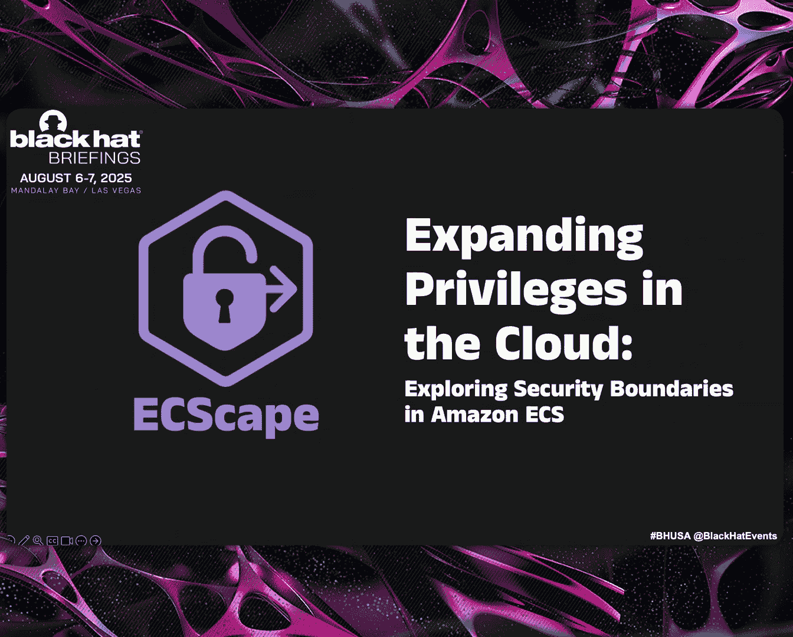

Now， before we begin， let me introduce myself。 So my name is Nohaiz。

 I'm software developer and security researcher at Sw Security。😊。

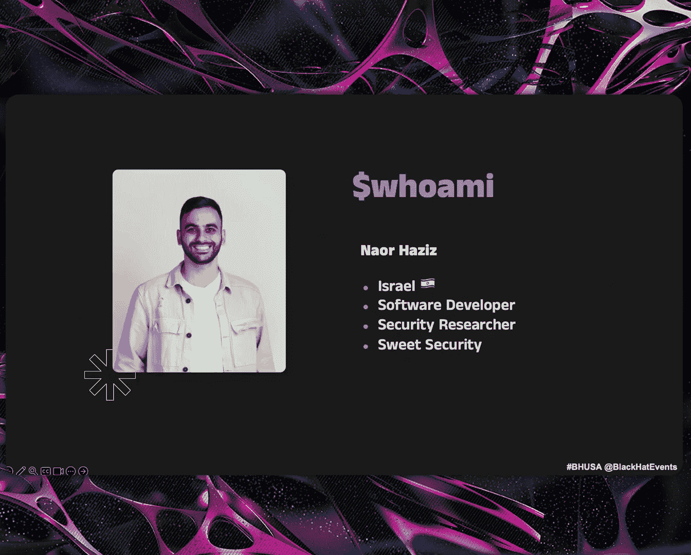

And in， and in my free time， I also like to go snowboard。And go to music festivals。

I'm also a part time DJ and a huge fan of last programming language。After this talk。

 I'm going to hit the clubs in Vega。 So you are more than welcome to join me。😊。

So here's what we are going to cover today。 First， were going to have a technical deep dive about the vulnerability。

 technical background， about some key concept that you should know for this talk。

Then I'm going to share with you my personal story of how encounter this vulnerability。Afterwards。

 we'll have a technical deep dive into the vulnerability smell itself。

 some in impact and mitigation techniques， demo and key takeaways。Now， before we deep dive into tech。

 let me give you a reason to stick with me。According to a survey。

 a third of data developers using orchestration technologies rely on Amazon E C， S。

 That makes it one of the most widely adopted orchestra store。

 And this means the thisstock is directly relevant to a huge portion of realw world production workloads。

😊。

So let's begin。 first， I know some of you are familiar with this concept。

 So I'm going to talk about it， and we'll see how it goes。

First， I want to talk with you about what is I AM M。

I M stands for identity and access management in the C， It's the system in A W S。

 They define who can access what and what can they do。 It has two main building blocks。

 policy and the whole。A policy is adjacent document that least allowed and denied actions。

 For example， this policy grants access to S bucket。

 and that one grants access to launch an E C2 instance。E goal is an an identity with one or more。

 The policies attached to it。Rs are assumable， meaning you can receive temporary credentials tie to the royal permissions and act as that rule。

Next， what is Amazon E C， S。 Amazon E C S is a native orchestration service。

It's essentially a simpler managed alternative to Kubernetes。

 It runs docker containers in your cloud environment。

 and it is deeply integrated with AWS core feature like I M logging and networking。😊。

There are three core concept I refer to throughout this talk， cluster， service and task。

In simple terms， E C S cluster is just a group of EC C twos managed by Amazon E C S。

 These in instances are where our containers are going to run。

Each instance is the sign with a wall called instance rule。

In order to EC to function this instance role， most of a specific policy called Amazon E C2 container service for E C2 Hall。

 the longest name error。 And it contains basic permission for E to function。

 like communicate with E C S access to pull container images from E CR。😊，Inside the T C2。

 you'll find service and tasks。In simple terms， service is in service is easiest way of saying。

 keep this task coming for me。 It handle of things like restart scaling and deployment。

A task is a single running unit defined by a task definition。

 These are where your containers are going to one。 It contains one of all containers。

 which are the actual processes doing your work like your app， sidecar or log。In E C， S。

 each task is assigned with with its own I M role， referred to as task role and another special role called task execution role。

The task execution role is intended to use 4 EC， S， and it's not accessible to the task itself。

It grants E， C， S permission to pull container images and fetch secrets for the task itself。

For example， let's say that we have a task that needed access the key to a Mongo D B ES itself will fetch the credentials for that Mongo D B for the task using the task execution role。

 and then inject it to the task as environment valuable。 and therefore。

 it will be able to access the Mongo D B without ever accessing the task execution role。Next。

 what is the task call， The task call define which action the containers inside the inside the task can do in your crowd environment。

Even though task might run on the same issue， to instance， each one gets its own isolated permission。

 as you can see。Each task has its own wall， assigned to it。E C。

 E S S tool launch modes Fargate and easy to Fargate is completely serverless。 Just。

 just define your task and let AW S handle the rest。E， C。

 S means that you manage the infrastructure yourself。 Daisy， to instance。

 runs in your crowd environment and everything runs in your crowd environment。Today。

 talk we'll focus on E C tool launch type， because this is where the vulnerability actually works。

So let's zoom in on how E C S works on E to launch type。 As I mentioned before。

 each instance is the same with a unique role。 The instance role that has specific E S permission。

Or that instance， you'll find the docker demon， which actually runs your containers and a component called the A C S agent。

This is agent acts as a bridge between AW S control plane and the itself。

D C S agent uses the instance hall to authenticate to AW S control plane and receive instruction from it like。

 start this task。 Stop that one。This whole unit， E C2 plus E C S agent。

 is what AW S refers to as container instance。 It has a unique area then。

 and you can find it in your AW S console。

That's it for the technical background。 Let's move on to the discovery， for the story。

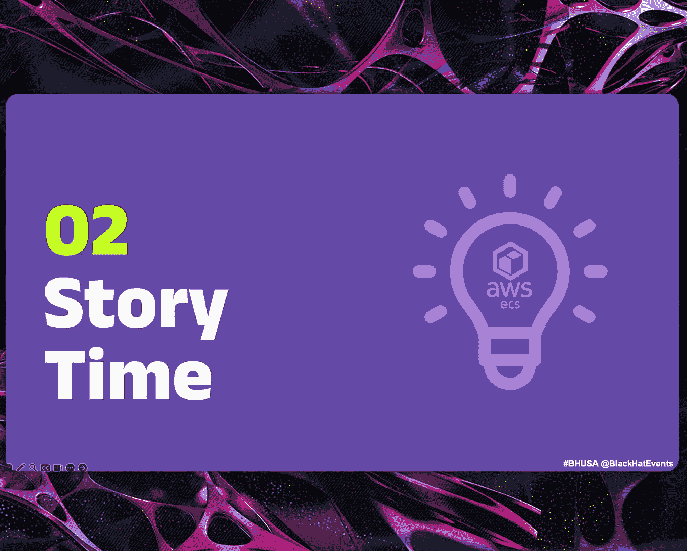

So。Here's， how it all started。 As you know， I woke at Twitter security。

 and I was working on a main detection and response component。 They easy to sensor so。One day。

 my manager came to me and asked me。Can you monitor V S tasks， My initial response was， yeah， sure。

 let's try。 Why not。

As I mentioned earlier， we know that the E C S agent communicates with Dr。

 Diman to to span the containers of the tasks。 So I figured I could do the same and get data about the task planning on the the instance。

Inspecting running containers， I noticed that it， they have these labels containing almost all of the information that I needed。

 like the class and Tusque again， Tu family。 But one thing was missing。

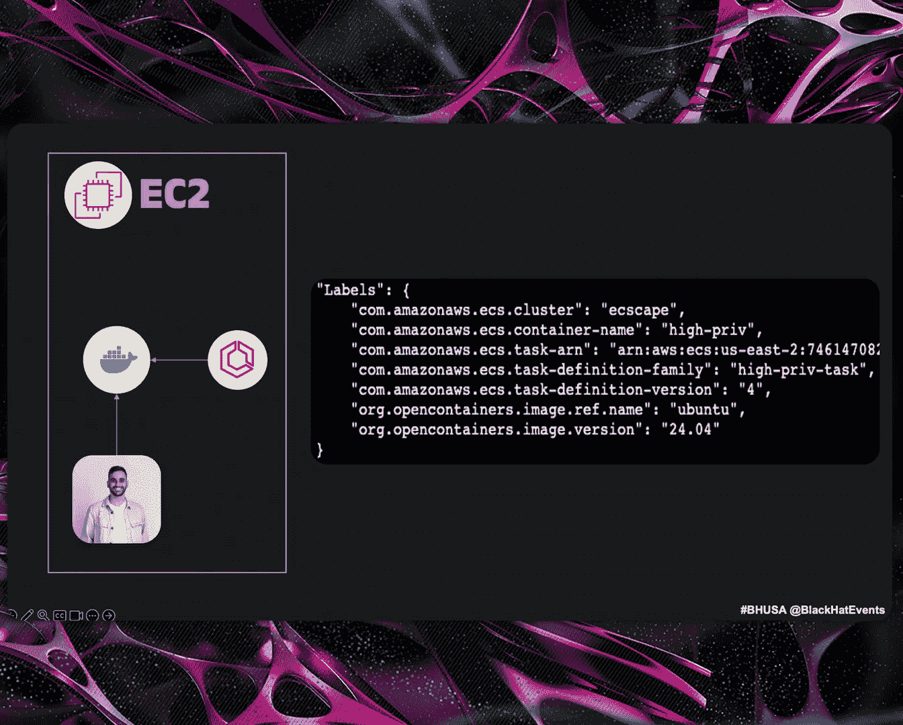

The service name I really wanted to know in which service the taskcal learning and this information is nowhere to be found。

 And it made me really， really sad。

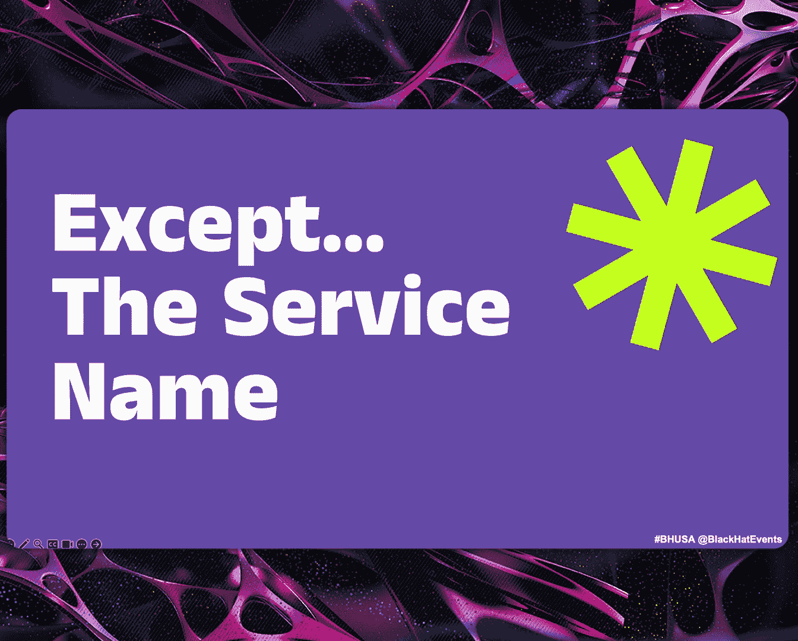

So I started digging online， and I found this endpoint called task method that I endpoint version 4。

 It's a unique endpoint that the A C S agent exposes to each task count on the instance。😊。

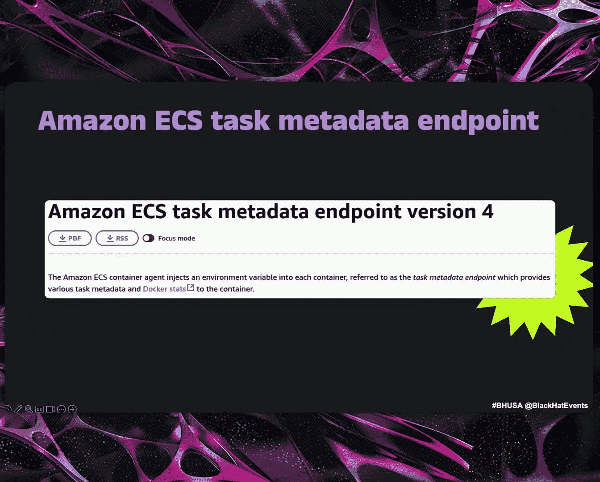

It returns tons of useful information about the task itself， like， a， again， revision。

 CPU and memory limitation。😊，But most importantly， returned the service name， which I really wanted。

Here's where thing got interesting。I wanted to get the service name myself。

 So I assumed I could do the same as the E C S agent。

I assumed that the instance role would have permission to list the running services。

 But when I went to A W S console， I looked at this is at the instance role permission and these permission are nowhere to be found。

 So I was the agent getting that info。😊。

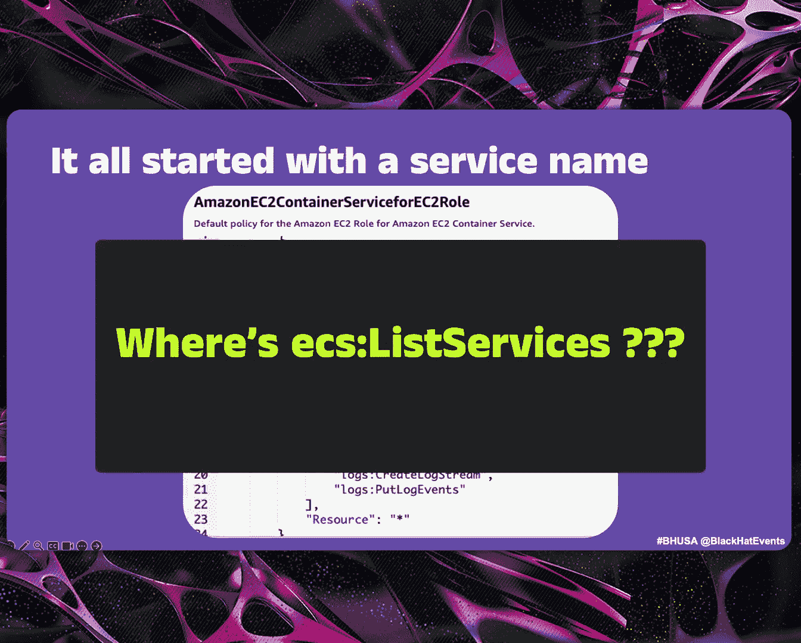

The first thing I did was to set up apoxy server and inspect the E C S agent communication。

That's when I noticed something really interesting。

 It was connecting to E S service using a web socket。

 and it was passing a specific query parameter called sent credentials equals2 that immediately made me suspicious。

😊，Here's， here's a real message that I captured， showing real tucan。

 And she also wrote that web socket。

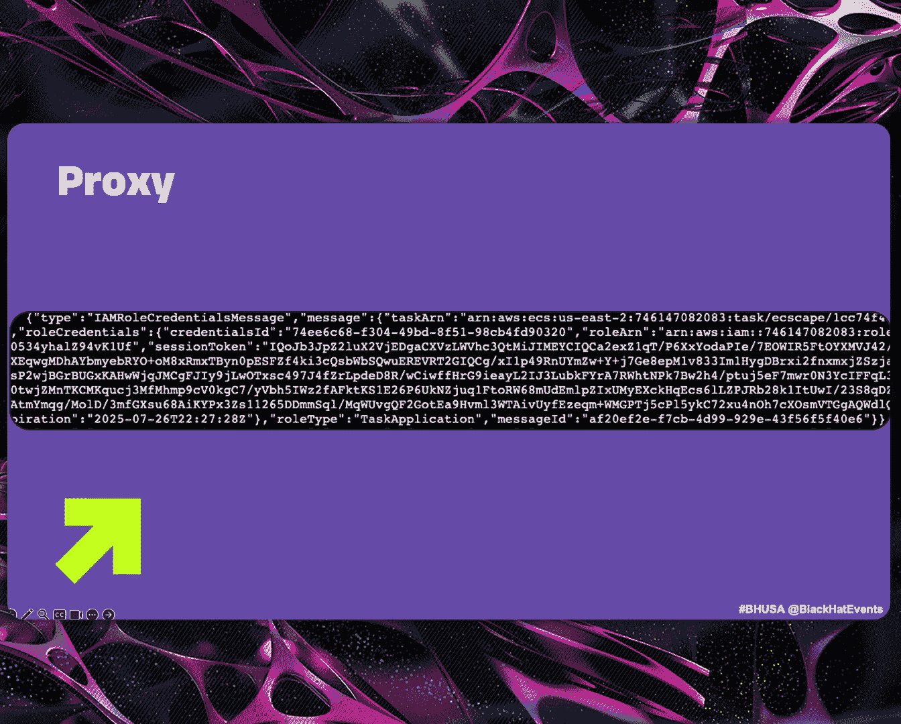

So I thought， can I impersonate with the A C S agent。

 if I would be able to trick K W S control plane into thinking that I am the agent。

 Can I get go those credentials， too。😊。

I went to my manager Ron again and showed them what I found。 And I told him， Ron， look。

 this is really interesting。 I didn't want to whistle cheat。😊。

And Ron being Ron Norden and told me， do you have three days。And they took it。

 And that's where the hunt began。Now， we'll deep dive into the vulnerability itself。

First， I wanted to point out that the A C S agent is completely open source。

 It was really helpful for me in my research。 I encourage you to go on Github and search it。

 And if you have any interesting question or findings， feel free to reach out。

 I would love to hear from you。😊。

So let's look at the at the instance wall。 as mentioned earlier， it has this specific policy。

 and it has specific E C S permission that play crucial role in our E C S functions。

 As youll see why shortly。 So keep them in mind， the register container instance。

 Discover polyen point and pole permission are crucial to E C S。😊。

So the first thing that the A C S agent does。Is to register itself as new container， instance。

 in the A control plane。In doing it by using the registered container instance permission that I mentioned earlier and calling an API that called surprisingly registered container instance。

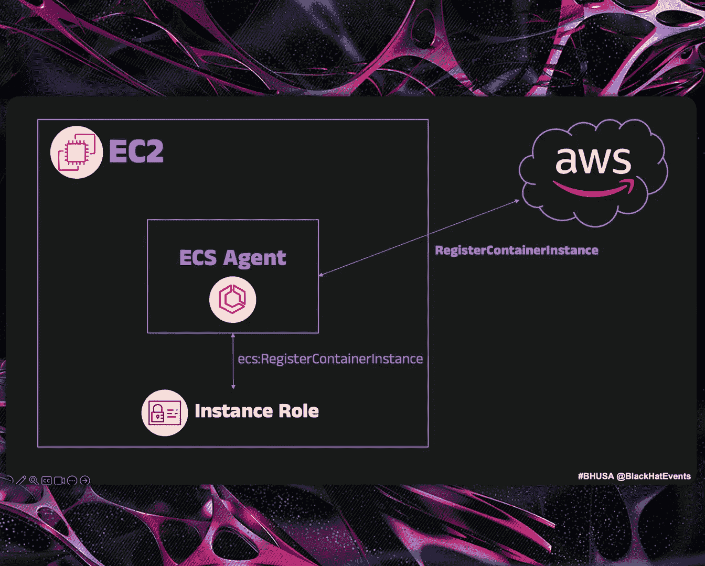

When this stage is done， the the A C S agent receive back the newly registered container instance A N。

 and it's now available in AW S console。I went online and search about this API。 and I show， I。

 I saw this note for A W S documentation stating that the。

 the action is only used by this Amazon E C S agent and not for views outside of the agent， which。

 of course， only made me more interested。😊。

Then the E S agent is using the discoverover poll end point permission and call API called Discover Po API Discover Poland end point。

This API returns mark a specific URL will refer to as。Poll 1。2 other。

Here's an example of a typical point end point URL， and how it might look like。

 though it may vary depending on the on the region and the availability。

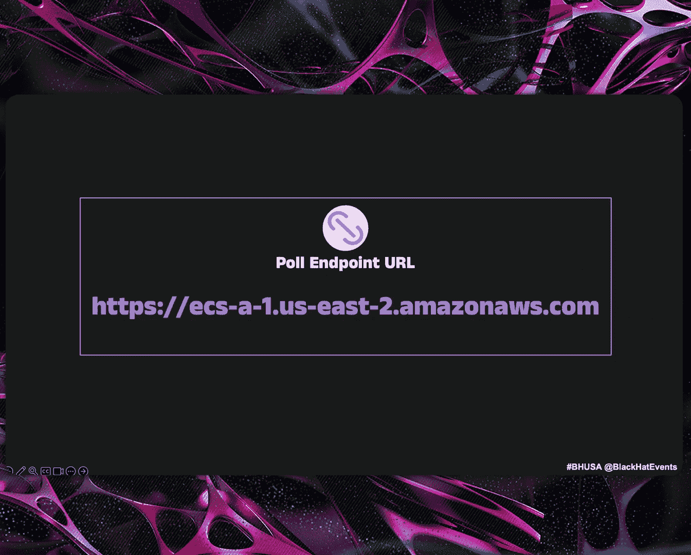

I searched online for this API as well， and I found the same note stating that it should not be used outside third of the agent。

 which， of course， only made me more interested。😊。

So later， when the E C S agent receive the poll point URL。

 it stake it and build a Web soet requests with it using a bunch of identifiers query parameters。

 And， of course， the sent credentials equals two parameter we saw earlier。😊，Then。

When everything is set up， the A C S agent attempt to connect to AW S control plane and to newly created the web socket。

 At this point， A W S control plane only validates one thing。

Does the A C S agent as the A C S pole pil。Luckily， the answer were。Have this permission。

 And the authentic and the connection is now authenticated。Once the connection is open。

The control plane starts sending the credentials for both task and task execution role over that web socket。

What is going on over that web socket。 This this web socket is communicating using a protocol called A C S。

 which stands for agent communication service。 It's an internal AW S protocol。

 which is meant for communication from the A C S agent to AW S control plane itself。

 It's non documented， but we know it carries messages like task metadata。

 This is where the service name that I've been searching for。😊。

Agent level directs like configuration updates。 and most importantly。

 the I am credentials for both task and task execution role of all of the task running on the same instance。

😊，So let's summarize the A C S agent flow and see how it works。

The first thing it does is to register itself as a container instance using the the register container instance API。

 Then it calls the discover Poland point and get back the poll point you order。Afterwards。

 using a bunch of identifiers as query parameters， it constructs the Web soet request of the A C S protocol。

And later， it authenticate to AW S control plane and received the task and task execution role of all of the task running on the same instance。

😊。

So heres the real question。Can a task imp personate to the E C， S agent。

Let's find out。The first thing we need is to get the discover the poll point URL URL。

 But the problem。We don't have the discover Poland end point permission。Here。

 you can see that the pollen point2 follows a predictable structure。

 It contains the region and the availability zone， which is the number is going from 1 to 9。

 So that's mean that it's possible to bru force it。

We can attempt to connect to the beautifultefulpo point URL， But then we。

 we will encounter in a new problem。We don't have the poll permissions。

This is where I had an idea to use something called。I am this。Im the stands for instance。

 metadata service。 It's a special H T T P endpoint available to， in each E C two instance。😊。

And it returns in metaadata about the instance itself， like region， In， I D and private I I address。

One of the main features of I MD S is to return the credentials of the instance all of the A C2 machine itself。

In E C， S， I MD S is enabled by default and accessible to each task running on the instance。

 meaning the choosing I MD S， each task running can get the credentials of the instance soul。😊。

The same one used by the E C S agent。So now that we know that we have the sameial use as the A C S agent。

We can use the discover Po point and call the discover Po P Po point API， just like the real agent。

Then we receive back the Poland point。Now， we need to take the poll point URL and construct a valid A C S Web soet request with it。

 The problem， we are missing the identifiers that needed to construct it。

Most of the identifiers I was able to get using I MD S and test can point metada version 4。

 But again， one thing was missing。😊。

The container instance say again， which， again， made really， really sad。

So I went back to the instance role， hoping it would have permission to list the container instances。

 but no luck there。

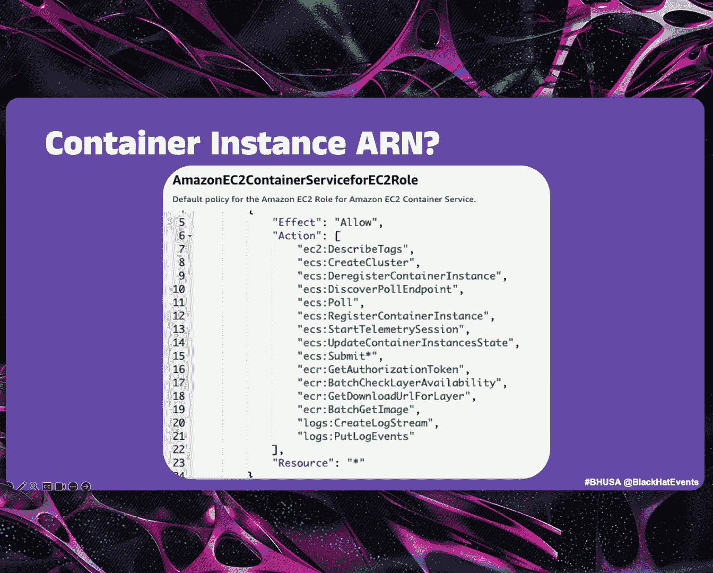

It was missing the list container instances permission。Then I tried something else。

 I thought I could try and register myself as new container instance。 although it worked。

 It had a couple of downsides。 First， I'm now running in a different container instance。

 which mean that in AW S perspective， I'm not running on the same instance。 And second of all。

 A W S will start sending me instruction to execute task。

 which I don't have the permission to execute because I can't do talk with doctor Doctor Demon。

 and therefore， I'll break E C S， which I didn't want。😊。

Later， I tried them digging around about the E C S agent code。

 and I found that it was writing the container in say again into a B D B over the host file system。

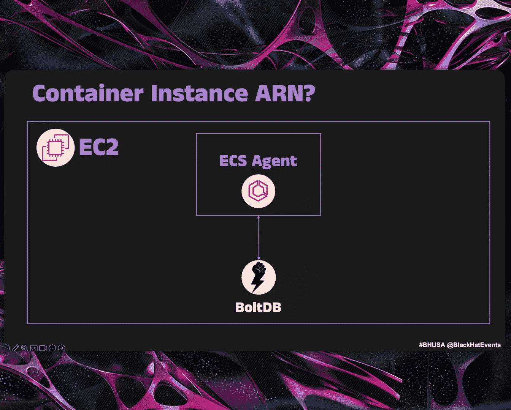

In this yes， there is a feature to create volume and mount point。

 So I thought I could mount the hostwood file system to the running task。

 And then I'll be able to access the O D B and get the container inense here。😊。

Again， it worked， but it had really big downside。 This relies on specific configuration that mount the host root file system to the task。

 which is not that common in real world scenario。

This is where I got lucky。I found out that the E C S agent exposes another API called containerspection API。

 This is a unique endpoint that the E C S agent exposes to each task running on the instance。

 and it returns the cluster， the container instance A N， and even the agent version and ussh。

 all of the information that I needed to fully imp personate to the A C S agent。😊。

With everything in place， I can now craft a valid A C S Web soet request using all of the identifiers that I need。

😊，E that I got using the introspection API， I M D S and the task method that I am Vi for。

So now by using the instance all， we can authenticate with A WS control plane and receive back the E C S pole permissions。

😊，And therefore， the， the connection is authenticated。At this point。

 AW S control plane will start sending the and shells of both all of the task scanning on the same instance and task executions of all of the task scanning。

Thinking it communicates with the real E C S agent。

What I get back are not some roles there in or something like that。

 I get already assumed the credentials by A W S on my behalf。 Why is that good to reason，1。

 I don't need to call a some role。 and two， if I look at cloud re logs。

 you can see that the user agent and the identity that assumes the role are the E C S itself。😊。

So it's selfie。 I get the role plainex credentials。So to summarize the easy escape flow。

The first thing we do is to use I D S and get the instance the， the instance cledentials， then。

We called the Discover poll point and received back the poll point URL。Afterwards。

 using I M D S task appointment data Vi 4。And the container in inspection API。

 we can craft a validate A C S Web soet request。Connect to AW S and receive the credentials for all of the task planning on the same instance。

I showed it to my manager on again， and responded with a great success。😊。

What A W S documentation have to say about this。So he's from AW S website saying the the the。

That the container never has access to credentials that are intended for another container that belongs to another task。

 That's the promise of task scores， isolation， security separation。 But as you can see。

 using this technique。A task can actually reach beyond that boundary。

Here's another documentation from A W S。 about the task execution role。

 They are saying these permissions aren't accessible by the containers in the task according to the to documentation。

 the task execution is only available for E S itself。 But as you saw， again， using that technique。

 attach， a task can actually read reach beyond that boundary。

So what is the impact of this vulnerability。

First， let's look at a typical E setup on EC C2。Here， we have two tasks running on the same instance。

 one with lower privileged。And in that the one， we higher privileges。Now， this is common in。

 different I M roles。 same easy， to instance。Now， let's say that the lower privilege container get compromised by an attacker。

With this escape， the attacker can now pivot laterterally across the the instance。

 meaning it can hijack the credentials of the area privilege role without ever compromising the higher privilege task。

 Then it can use this credentials to access resources that were out of reach for the lowest privilege task like S3 bucket。

Here's an example about the task execution wall。For example， let's say that we have a task that need。

 again， cledentials to access a Mongo Db。ES itself， we。

 will use the task execution role to communicate with A W S secret manager。

And pass it to the task as environment variable。 And therefore。

 it will be able to access that Mongodibi。But when E C S escape is in play， the story changes。

 The exploit allows to hijack the credentials of the task execution role meant for E S themselves。

 And then we can use it to communicate with AW S secret manager and fetch the credentials to the Mongo D B ourselves。

😊，Again， we get the credentials that was never meant for our task and was was for another task running on the same instance。

 In this case， this credentials was meant only for EC C S agent itself and not for any task running on the instance。

Okay， now I'll give you an example about multi tenancy。

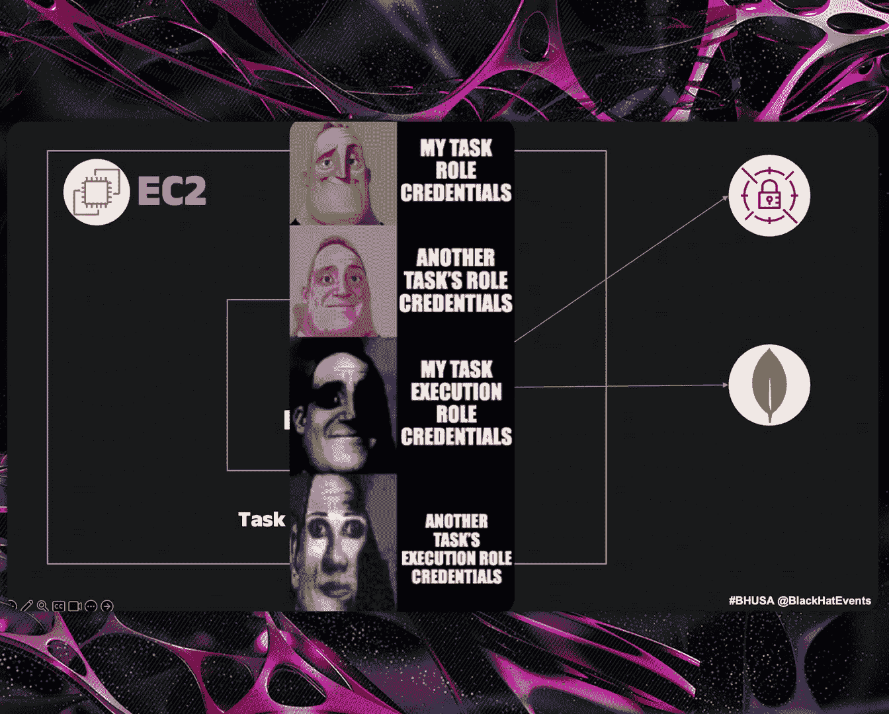

This is a common setup。 Here， we have two tenants running on the same E C。

 to instance in the same E C S cluster。Each1 enters its own tasks， its own databases。

 as and its own secrets。Access control relies on I M and task separation。

 assuming the task are securely separated。But E escapelets an attacker from tenant1 to hijack the credentials of a task that meant for tenant2。

And therefore， they mean they can access data and services they should never see。

This is tenant escape， and it's dangerous because teams may often think that I am worse and thus separation are enough。

The impact goes beyond just clentials。 It also exposes metadata about the other task planning and the instance itself。

 because we are implementing an internal AW S protocol。

 which reveals a lot of data about the cluster itself。

 which was out of reach be before this vulnerability。So let's summarize the impact。 First。

 course task I am more ejacking from one compromise task。

 we can reach the credentials of all of the other task running on the same instance。Second。

 abuse of Tu execution role。We can use the AC C S escape to hijack the hiddenials meant for the A C S itself and not for audio task cu on the instance。

 And then we can access secrets or private repository that roll out of reach。Third。

 access to E C S internals by implementing E E C S。

 we were able to get data that were out of which before。 And lastly。

 theres no misconfiguration needed。 I MD S is enabled by default in each EC S set。

 and the instance is configured configured with that with this permissions。

 So there's no misconfiguration needed。 This comes with a default E C S setup。😊。

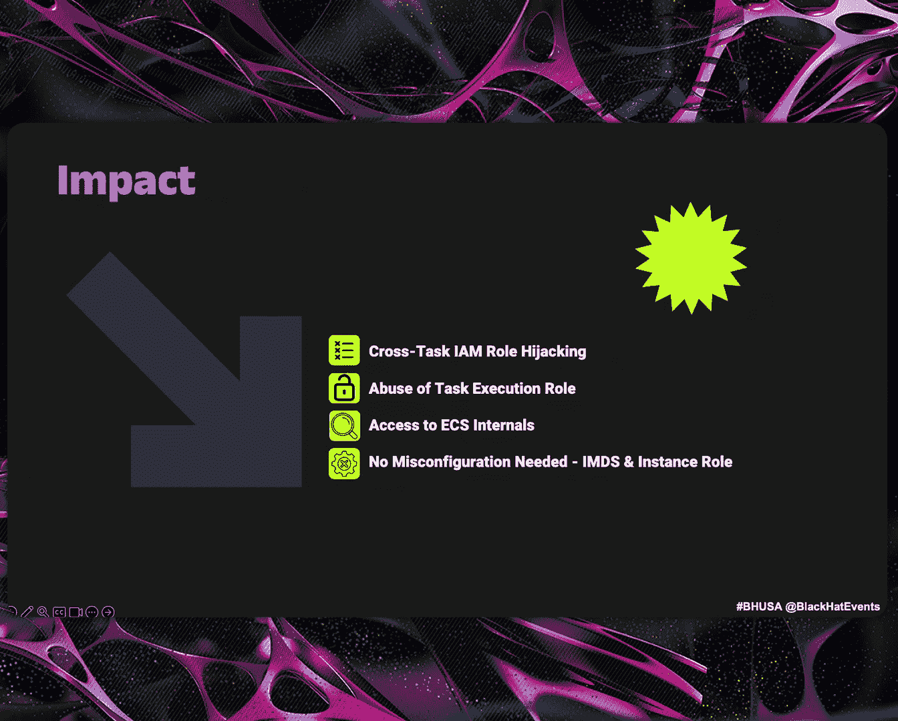

I prepared the demo for you guys to see this escapecap in action。

So I created a col， which I called easy escape， and it says three task count on it。

 E escape task is three control task and database task。

Let's look at the AC S task。Definition， it is task role called this escape role。

 and it is no task execution role。The task call has the permission。 deny wild card。

 meaning it has no permission to access anything in your cloud environment。Now。

 let's look at the S 3 control task。 It has task hole called S 3 control hall and no task execution role。

As you can see， it is the policy。 Amazon S3 full full full access。

 meaning it can do anything it want with S3 buckets。

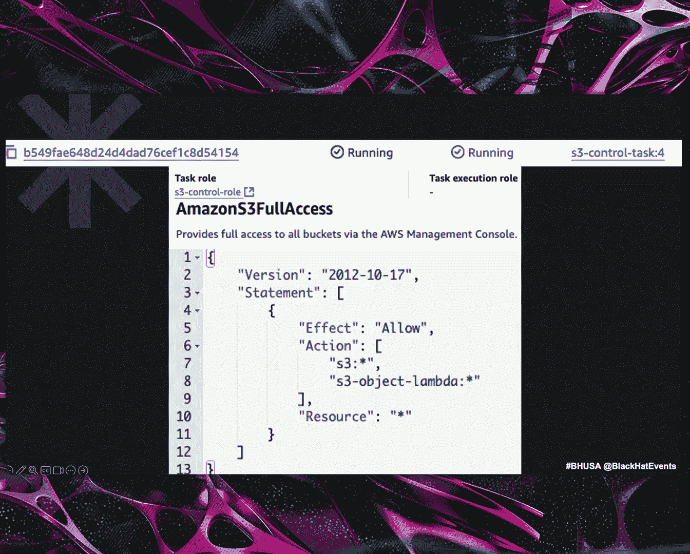

And I created an S bucket called Blackhead Las Vegas，2025。

Now， let's see the vulnerability in action。 This is a picture。 This is video form AW S a console。

 and we have also a shell attached to the easy escape task。😊，O。So you see the blanket Las Vegas。

2025 isley bucket。

This is the shell form the easy escape task。 And as you can see， using Amazon command line。

It replies with access denied to the action of trying and deleting that bucket because we don't have this permission。

But now we'll use this escape command line。And youll see it logs the hijack field shells of all of the task and task execution running on the same instance。

 and it logs that the S3 bucket is now deleted successfully。😊，As you'll see now。

 we'll go back to AW S control console and refresh the the page of the S3 bucket。

 And you'll see that this S 3 bucket is now deleted。😊，We。

 we didn't have the permission to do that before。 But now using easy escape， we have。

Now， I created another thing called the D B secret。 This is a a secret in A W S a secret manager。

And let's look at the database task。 The database task has no task goal。

 and there's task execution role called secret execution role。

This is an example about task execution， role hijacking。As you can see in the task definition。

 I I define the D V secret， which points to the newly created one。

And I have the permission to read that secret from AW S secret manager。

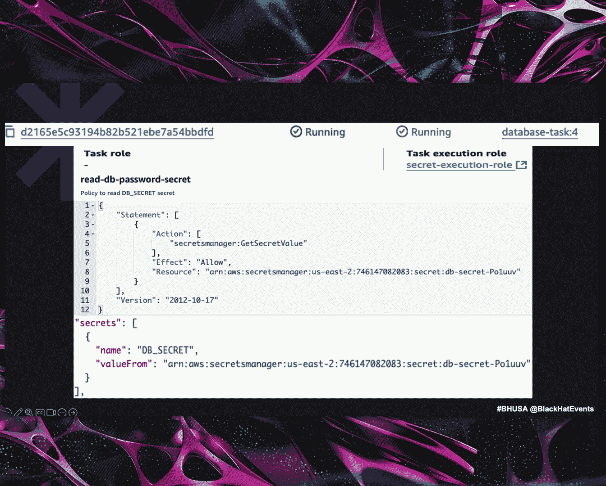

Now， as well see in the video again。

We have the D B secret in AW S console， and now we'll go to the She on Escape。

Using an Amazon command line， well see that if we will try to read that secret。

 well receive access denied。Because we didn't have these permissions。But again。

 when you see escape is in place， the things changes。

 It will log all of the credentials of all of the task scanning on the same instance。

 and it will log also the plain text value of that newly created secret， as you'll see shortly。😊。

Super secret password。It was out of which before， but now we can access it。

So after giving this talk and showing it on my blog。

A lot of people ask me about cloudy logs。So here's an interesting thing about it。

You can see the call to discover Poland point， but it's logged as it come from a legitimate instance I D and the instance wall itself。

This is the exact same call that the really C S agent do。So， during normal operation。

So it from A W S perspective， it looks like normal operation。 There's no one normally here。

Here's another interesting thing。 If we go to cloud re logs and try to monitor about the S3 de。😊。

You'll see that it's logged that this action came from the legitimate S 3 control task and not from the easy escape task。

 There's no mention of the attacker container， no sign of the hijack。And again。

 for the task execution role， well see the same thing。

It will be logged as it comes from the database task itself。

 There's no sign of the attacker or the container， just a zoo hole and session time to the real task。

The command line project that I showed you called this escapescape is open source。

 and it's available on Github。I encourage you to go and search it。

 continue rebute or talking with me about it。 I would like to hear from you。

 And it's written in rust well， because I love rust， sorry guys。😊，What about the mitigations。

 Let's talk some mitigations。Okay， the first thing you should do is to disable I M D S access to the task count on the instance。

If you disable IMD S access to the task scanning on the instance。

 they won't be able to high to get the instance roll and therefore won't have the pole and discover poll point permission and won't be able to in person it to the A S agent。

Keep in mind to never disable I M D S on the instance level， because the E C S agent relies on it。

 And if youll disable it， it will break E C S。This is for A W S documentation。

 This is how you can disable。 I， I am the successful for specific tasks。

 It relies on IP P table schools。 You can take a picture Now if you know， if you want。

 or you can search it online。😊，Now， let's talk about the task called。

The first thing you should do is to never run the task hole。

 the poll and discover Polanden point permission， Because if they have this permission。

They can impson it to D agent with no need for M S。Second of all。

 don't fall into the trap of the wild card。 If you'll do。

 if you'll give task E C S wild card permission， it contains both of these permissions and also another internal E C S permission。

 And therefore， it's dangerous。 So please don't use it。And lastly， keep your your task called tight。

 Give it only the exact permission the task need and nothing more。

Now。What about the task execution wall。Don't overprivilege the task execution wars。 I saw many teams。

That believe that the task execution role is only meant for use for E C S。 And therefore。

 it's safe to overprile They use one common task execution role to all of the task running on the E S environment。

 But as we saw using E Sscape， this task credentials are accessible to each task running on the instance。

 So be aware of it and give it only the needed permission it needs。

 and only the access to the needed secrets。😊，Please separate high and privilege low war clothess。

Don't， don't run low privilege workloads and high privilege workloads In the same instance。

 you can do it by configuring your capacity manager or by separating clusters。

Same goes for tenants in multi tenant systems， please。Give each tenant a different cluster。

 or at least separate at the easy to instance level because you don't want these kind of techniques in action in your crowd environment。

So to summarize the best practices， first， separate tiny low privilege workloads。

Don't let task with privilege run with one with lower privileges。 Second。

 isolate tenants in multiten systems。 and lastly， minimize task and task execution roles， thes。

So to some of this talk。

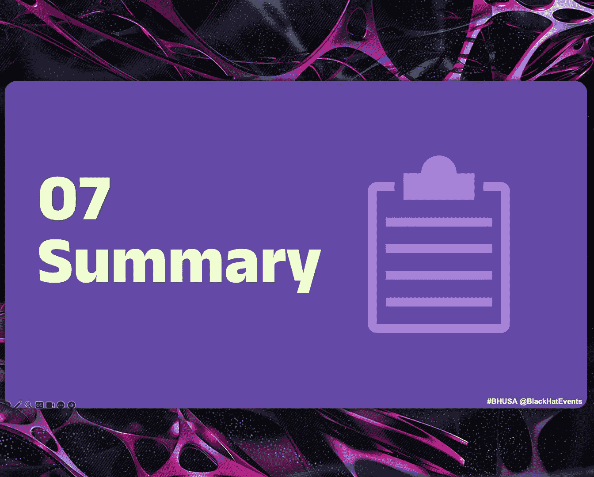

I went to AW S， and I showed them this vulnerability。

AW S responded that it's not present as security concern for AW S。

They say that they are going to update documentation and consider consider long term defense e changes。

Remember the documentation that I showed showed you before。

 showing the container never has access to other task credentials。

Now， it change to task handling on the same issue instance may potentially access credentials belonging to other task conduct instances。

O。What about the acknowledgecknowment。So I went to AW S again and they said that they are going to include me in the public documentation change log and draft a statement of appreciation for me。

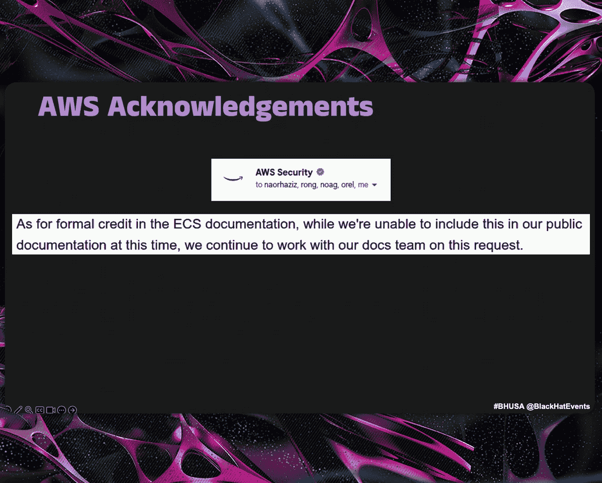

This is from AW S security blog， saying that AW S would like to thank Sw security and security researcher No Haiz for the research。

是。This is an official statement from A W S。 I don't expect you to read it。 It's small。

 but I will read the summary for you。 A W A W S clarified that agent like A C S agent runs inside the consumer security boundary。

 So there I am roles are always in scope for consumer to secure。😊。

Containers are not a security boundary。 In， level clinents remain reachable unless container consumers block them。

 We a positive engagement。 and I'm always glad to work with A W S about cloud security。😊。

So to some of this talk， first， on E to task and the easiest agent share the same security boundary。

A task can imp on a D C S agent using the poll and discover Poland point permission and hijack the credentials of both task and task execution wars。

And lastly， if there's one thing that I want you to take from this talk， please。

 task level outning is essential。 Disable IMD access to task handling on your instance and keep your your task and task execution walls tight。

😊，Only they need permissions。

So that's it for me。 Thank you so much for listening listening。

 It was actually my first time talking on blackhead and your is really appreciated。

 Here are my links。 You can， I you are you， you can feel you are welcome to reach out to me and talk with me about cloud security。

 I would love to talk with each and every one of you。 And that's it。 Thank you very much。😊。

I'm happy to take questions， now。If you have any。Yeah。

Can you talk go to the mic list so everyone could hear， yeah。

How I am the SV2 can affect this vulnerability。 I M the S V2。 Yeah。

 so Im the SV2 essentially means that you should get a token from the instance that you are running on。

 And because the task itself running on the same instance。😊，It should not affect anything。Essential。

 I think for I D SV2， you can configure some hope factors。 so maybe it can affect on containers。

But I'm not sure that the easiest C S agent itself support I S Vi V2。 So essentially。

 that shouldn't be such a change。Okay， thank you。Yeah， thanks for the talk。 It's good。

 Do you find it a little bit ridiculous that AW S wants us to implement our own IP tables rules to mitigate this disaster。

 what， I'm silly。Do you find it ridiculous that AWS wants us to write our own IP cable rules in the Docker file presumably to mitigate this？

EIf I find it ridiculous，E I their official response is that it's the secure consumer responsibility。

So I agree with it。 And I think that each and everyone here that uses E S should integrate these best practices。

 because this is the only way to prevent this time kind of vulnerability。

 Did they mention they might be implementing any， any other fixes for this。😊。

They mentioned that they might be doing it on the future。 Theyre considering it。

 but I don't know if they are going to do。 Thank you。Any other questions。Okay， guys。

 thank you very much。