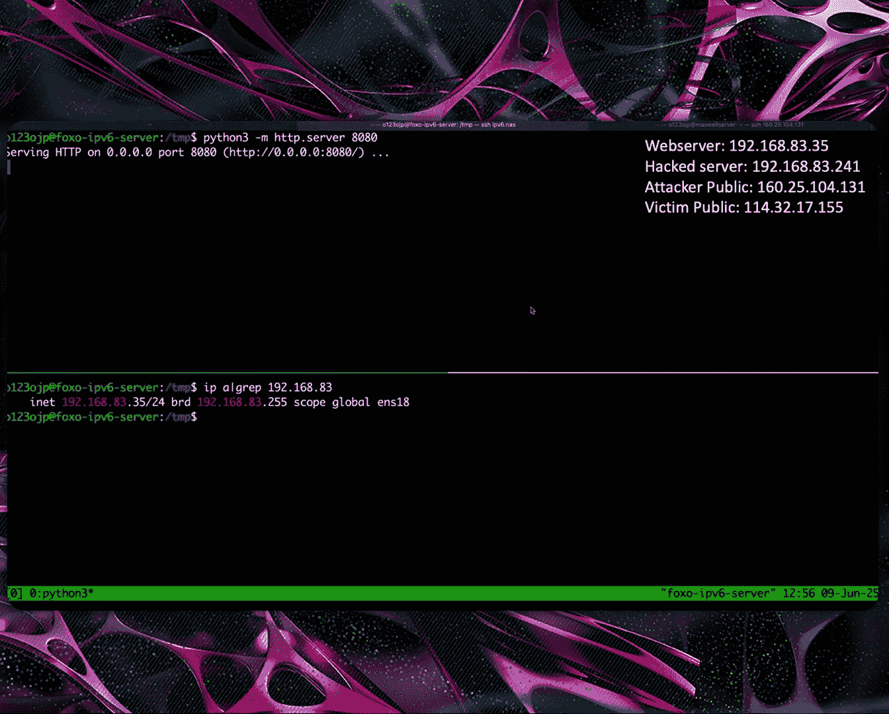
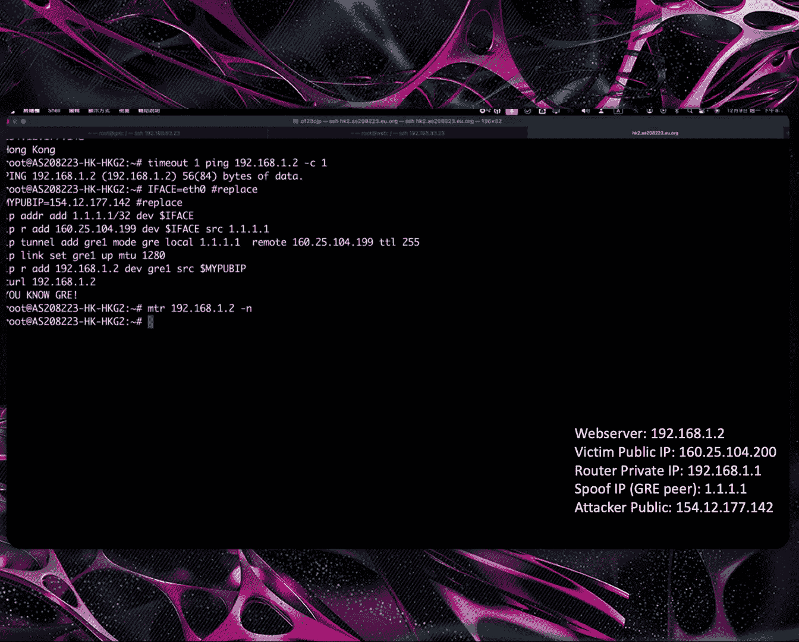
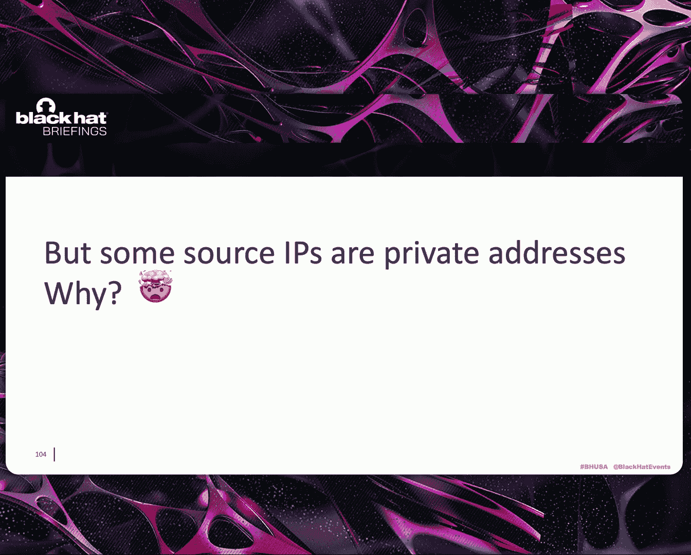

# 课程 001：从IP欺骗到隧道技术：红队用于初始访问与规避的新型网络技术 🕵️♂️

在本课程中，我们将学习红队用于网络渗透测试和规避检测的新型技术。课程将涵盖IP欺骗、利用隧道协议（如GRE和VXLAN）进行初始访问，以及如何通过劫持路由协议实现横向移动。这些技术不仅适用于高级红队演练，也揭示了企业网络中可能被恶意攻击者滥用的安全风险。

---

## 自我介绍 👨💻

我是来自台湾的Sufo，目前在趋势科技担任红队研究员。我毕业于清华大学，曾是黑客协会会长。我热衷于实验和探索网络协议。这项研究最初只是出于兴趣，但后来发现它对通用网络安全具有重要意义。你可以在我的Github账户上找到相关工具和研究材料。

---

## 议程 📋

首先，我将分享一些使用IP欺骗的新红队技术，以及如何利用它们进行初始访问。接着，我将揭示VXLAN配置的噩梦，包括内部劫持以及有缺陷的路由协议如何导致IP劫持甚至域名失陷。最后，在进入问答环节前，我将总结一些关键要点。

---

## 第一部分：源IP欺骗技术 🎭

上一节我们介绍了课程概述，本节中我们来看看源IP欺骗技术。

我们都知道，即使在近年，在公共网络上进行数据包欺骗仍然是可能的。例如，一个IP地址为`2.2.2.2`的攻击者可以发送一个源IP为`3.3.3.3`的DNS请求，而`3.3.3.3`并不属于他。当这个IP数据包到达`1.1.1.1`时，`1.1.1.1`无法验证数据包是伪造的还是有效的，它会将DNS响应发送回`3.3.3.3`。这样，`3.3.3.3`就会收到一个它并未请求的DNS响应。这是一种典型的DDoS DNS放大攻击，至今仍然有效。

接下来，我将深入探讨公司网络结构。出于安全目的，IT人员通常会阻止内部计算机访问公共网络。

以下是两种常见的做法：

*   **最佳实践**：当数据包从关键服务器发送到公共IP并到达防火墙时，防火墙会丢弃该数据包。
*   **常见但错误的做法**：一些IT人员只是禁用了NAT。数据包仍然会流出到广域网，远程服务器会看到源IP无效，它要么丢弃数据包，要么响应一个未知地址，而客户端将收不到消息。虽然代码逻辑有缺陷，但网络连接可能仍然“工作”。

如果我们同时考虑这两种情况，在互联网上伪造源IP地址会发生什么？

想象一个红队场景：攻击者入侵了公司设备`1.1.1.3`。他可以在C2服务器与被入侵设备之间建立一个隧道。之后，他可以通过隧道创建一个DNS请求，其源IP是攻击者的公共IP `9.9.9.9`。当数据包到达被入侵设备时，它会转发到公司的互联网路由器。路由器查询其IP路由表，然后将数据包转发给第二个受害者`1.1.1.2`。我们知道，如果没有针对`1.1.1.2`的防火墙，响应数据包将通过公共互联网发送回攻击者。然后攻击者将收到数据包，而整个TCP或UDP流中没有任何证据表明数据包来自`1.1.1.3`，只显示源IP是`9.9.9.9`，目标IP是`1.1.1.2`。

这就是为什么事件响应在典型的横向移动攻击中很困难。攻击者使用先前被入侵机器的IP地址来攻击下一个系统。这意味着当警报触发时，事件响应团队可以简单地使用网络日志来追踪攻击者从一台被入侵机器到前一台的路径。他们可以在前一台被入侵机器上找到相关日志，识别初始入侵点，然后关闭整个攻击链。

然而，当涉及欺骗技术时，日志中的源IP将不是前一台被入侵的机器。因此，事件响应团队将无法找到入侵路径。他们只能看到一个公共IP正在攻击他们的域控制器。这样，即使警报被触发，先前被入侵的机器也不会被发现，并且攻击者可以切换到另一个公共源IP继续攻击。

纵观整个路径，恶意数据包的源IP和目标IP只显示`9.9.9.9`和`1.1.1.2`。因此，没有人会知道先前被入侵的机器是`1.1.1.3`。另一方面，隧道IP是HTTPS流量，源IP是`7.7.7.7`。如果`9.9.9.9`是攻击者，他可以简单地切换到另一个公共IP并攻击不同的目标。事件响应团队将需要检查每个路由器的第二层端口日志，以识别被入侵的设备。

此外，源MAC地址可以在第一跳被伪造。如果ISP过滤源IP是私有IP的数据包怎么办？我们可以使用`3.3.3.3:32445`的NAT穿透来启用临时目标NAT。攻击者可以发送一个特殊的数据包到`9.9.9.9:32445`。然后，NAT路由器将为`1.1.1.3:445`在公共IP端口`32445`上创建一个临时目标NAT。它允许攻击者通过`9.9.9.9:32445`连接到`1.1.1.3:445`。

这里有一个快速演示。我们可以看到`2.2.2.4:8080`上有一个Web服务器。最初，位于`1.1.1.4`的攻击者无法通过公共IP访问内部Web服务器。在我们创建服务器并从被入侵机器发送一个`UDP 2323`数据包后，我们可以从受害者路由器收到一个数据包，它给出了连接内部Web服务器的目标端口。此外，我们可以看到Web日志中的源IP来自公共IP而非私有IP。这在攻击链中制造了一个断点。

另一种由Chi Ming Cai发现的方法涉及从被入侵设备伪造一个假的TCP SYN数据包，其源IP使用下一个目标IP地址`1.1.1.3`，并将其发送到攻击者的C2服务器。源NAT机制可以被滥用作目标NAT来连接内部服务。

这是另一个快速演示。我们可以看到`1.1.1.35:8080`上运行着一个Web服务器。最初，位于`3.1.3.1`的攻击者无法通过公共IP访问内部Web服务器。在我们从被入侵机器发送一个SYN数据包后，使用下一个目标IP和端口作为源IP并发送到攻击者C2服务器，我们就可以使用欺骗数据包中的目标端口连接回受害者路由器。SNAT机制将允许我们连接到内部Web服务器。此外，我们可以看到Web服务器日志显示源IP是公共IP而非私有IP。这同样在检测中制造了一个断点。

那么，我们是否可以用官方的VPN来替代C2隧道？答案是肯定的。如图所示，有许多商业SSL VPN解决方案可以欺骗来自客户端的源IP，例如Fortinet、Cisco、Palo Alto Networks的解决方案可能允许这种行为。另一方面，开源VPN解决方案如WireGuard和OpenVPN是否受影响取决于它们的配置。

---

## 第二部分：利用现有隧道进行初始访问 🚇

上一节我们介绍了源IP欺骗技术，本节中我们来看看如何利用现有隧道进行初始访问。

关于初始访问：我们是否有可能在没有互联网初始立足点的情况下做到这一点？我们能否使用任何现有的隧道？答案同样是肯定的。在互联网交换中心，每个人都在同一个第二层网络上。攻击者可以将私有网络范围设置为要攻击的公司路由器的下一跳。此外，我们可以滥用现有的隧道，如GRE、IPIP或SIT。但同样，良好的防火墙配置可以阻止这种攻击。

如果我们入侵了内部交换中心的路由器，我们可以强制将私有子网作为受害者公司路由器的下一跳。我们可以使用我们自己的公共IP作为源，私有子网作为目标来创建连接。受害者路由器会将数据包转发到其内部子网，并通过公共IP响应攻击者。

另一方面，我们可以滥用现有的内部隧道，如GRE。GRE是一种无状态的第三层隧道。它被广泛使用，因为它易于设置，只需要设置协议、公共IP和GRE接口IP。如今，仍有许多公司在他们的产品中使用GRE，例如Cloudflare Magic Transit及其客户。他们可以在ISP之间使用GRE，而ISP更安全。AWS Transit Gateway也支持VXLAN，但仅用于内部网络。此外，安全周刊报告称，像Sofacy这样的APT组织创建了巨大的隧道来收集来自被入侵设备的流量。最后，仍有许多公司使用GRE，但我们不知道。

GRE是如何工作的？当一个数据包想要通过GRE隧道时，内核会用一个GRE头封装数据包，并通过公共互联网发送。在接收端，GRE数据包被解封装，内部数据包根据路由表进行转发。GRE是明文且不提供加密的，这意味着任何人都可以通过公共网络发送GRE数据包。例如，`1.1.1.2`想发送一个数据包给`2.2.2.2`。数据包将发送到其默认网关。网关路由器会为数据包添加一个头，并通过公共网络发送。当GRE数据包到达`2.2.2.2`时，它会移除GRE头，并根据其路由表转发内部数据包，反之亦然。

那么我们如何找到隧道？我们可以使用OSINT技术。例如，我们可以在Google上搜索像Arbor这样的Netflow仪表板，并过滤GRE流量。这样，我们就可以获得隧道两端的IP地址。其他OSINT技术也有帮助。

接下来，我们可以使用GRE欺骗技术来扫描现有的GRE隧道。首先，我们可以使用上面提供的命令创建一个假的GRE隧道。然后，我们可以创建一个源IP地址被欺骗的GRE数据包（一个不属于我们的IP），并通过公共网络发送给受害者。如果受害者有一个GRE对等体，其IP与GRE数据包中的源IP（例如`1.1.1.1`）冲突，它将解封装内部数据包，并根据其IP路由表处理并转发内部数据包。因此，我们可以创建并发送许多具有不同源IP地址的数据包到正确的受害者。如果受害者不将源IP识别为已知对等体，它将丢弃数据包。另一方面，如果源IP与受害者已知对等体之一匹配，受害者将接受GRE数据包，并根据其路由表转发内部数据包。

出于扫描目的，我们将内部数据包的目的地设置为受害者自身。这样，受害者会立即用ICMP响应回复内部数据包。然后，我们就可以识别受害者是我们的GRE对等体IP地址。我们将信息编码到ICMP标识符和序列号字段中，这两个字段一起可以表示所有`255.255.255.255`个可能的IPv4地址。我们还在Github上创建了一个扫描脚本。如你所见，当GRE源地址与远程GRE对等体地址匹配时，我们可以得到ICMP回复。

然后，我们可以将所有内容整合起来，获得初始访问权限。想象一个场景，受害者`1.1.1.1`与`2.2.2.2`有一个GRE隧道。攻击者可以伪造一个看起来是从`2.2.2.2`发送的GRE数据包。内部数据包是一个从提供商IP `3.3.3.3`发送到内部网络IP的DNS请求。当数据包到达时，受害者会信任并使用这个GRE数据包，因为它声称来自`2.2.2.2`。然后，受害者将解封装GRE数据包，发现它包含一个目的地是私有网络IP的DNS请求。受害者将根据其路由表将数据包转发到公司内网。当内部DNS服务器收到DNS数据包时，它会响应并通过公共网络向攻击者服务器发送回复。这样，攻击者就可以与受害者内网的服务进行交互，包括那些使用TCP协议的服务。

我们创建了一个演示实验室。架构如图所示。Web服务器托管在内网IP `1.1.1.2`上。服务器可以通过SNAT访问公共网络。另一方面，IP为`2.2.2.1`的路由器可以直接访问互联网服务器。此外，该路由器有一个公共IP，并与IP地址为`1.1.1.1`的路由器有GRE隧道。最初，位于IP `1.1.1.4`的攻击者无法访问内部Web服务器`1.1.1.2`。攻击者可以创建一个欺骗性的GRE隧道连接到受害者路由器，并通过假隧道直接向内部网络发送流量。然后，攻击者可以直接访问并与内部Web服务器交互。

类似地，如果是像GRE这样的第二层隧道，并且如果我们能获取受害者的MAC地址，我们也可以用同样的方式利用它。通常使用SNMP协议来获取MAC地址。

**TL;DR 总结**：当公司没有配置防火墙并使用未加密的隧道（即使是遗留配置）时，攻击者可以利用此隧道进行内网的初始访问。

---

## 第三部分：VXLAN配置的噩梦 😱

上一节我们介绍了如何利用GRE隧道，本节中我们来看看VXLAN配置的风险。

那么什么是VXLAN？VXLAN是一种无状态且未加密的第二层隧道。它将第二层以太网帧封装到第四层UDP数据包中。每个网络由称为VNI的名称唯一标识。我们可以通过给出远程IP、本地IP、目标端口和VNI来配置VXLAN隧道，类似于GRE。然而，这种配置是脆弱的。

基于先前的配置，设置一个标准的VXLAN隧道对和往常一样简单。那么劫持一个VXLAN隧道呢？是的，这里唯一的区别是更改你的本地IP参数。为什么会发生这种情况？Linux内核不检查VXLAN数据包的源IP吗？为什么它接受具有有效VNI和端口的VXLAN数据包，即使源IP未配置？查看Linux手册后，你会发现这是一个特性而非漏洞，但这并不安全，并且在报告之前默认是开启的，你无法关闭此功能。现在，你可以更改设置为关闭，但它默认仍然是开启的。

那么，当VXLAN中启用学习模式时会发生什么？通常，当配置的对等体发送一个VXLAN数据包时，内核会将其MAC地址添加到FDB（也称为转发数据库表）中，如底部所示。下次需要发送数据包到FDB表中列出的目标MAC地址时，内核会封装并使用FDB表中的信息将数据包发送到远程位置。类似地，当学习模式启用时，任何具有有效VNI和端口的VXLAN数据包都会被添加到FDB表中。此外，远程IP可以是互联网上的任何IP。因此，攻击者`9.9.9.9`可以创建一个MAC地址为`FF:FF:FF:FF:FF:FF`的VXLAN数据包，而Linux内核会将此MAC添加到列表中。然后，当内核想要在VXLAN接口上发送广播数据包时，它会查找FDB表并将其发送到`9.9.9.9`，即攻击者的地址。

那么攻击者需要知道什么才能劫持VXLAN隧道？我们知道自己的IP，但我们不知道受害者的IP、端口、VNI或VXLAN内部子网。然而，所有这些信息都可以通过一次扫描获得。攻击者可以通过发送大量数据包来发现受害者的IP、端口和VNI。

让我们首先关注如何确定VXLAN内部子网范围。我们可以通过发送一个VXLAN数据包来收集信息，其中源和目标MAC地址都设置为广播地址。然后，当从VXLAN接口发送ARP请求时，它们也会被发送到攻击者的VXLAN。另一种方法涉及发送邻居发现协议数据包。当路由器收到广播的NDP消息时，它会用自己的IP和MAC地址响应广播MAC地址。因此，我们可以发送许多具有不同VNI和端口配置的VXLAN数据包，每个数据包包含一个内部NDP数据包，其中源和目标MAC地址都设置为广播地址。当VNI和端口与受害者配置匹配时，受害者设备会将攻击者IP添加到其FDB表中。然后受害者解封装VXLAN数据包，发现它是一个NDP请求。受害者路由器回复NDP数据包，并尝试将响应发送到广播MAC地址。它检查FDB表，发现目的地是`9.9.9.9`，即攻击者IP。因此，路由器会将数据包发送给攻击者。这样，攻击者就拥有了劫持隧道所需的一切。

我们还创建了一个扫描器。我们可以通过发送大量数据包来发现受害者的IP、端口和VNI。VXLAN的默认端口是`4789`和`8472`。VNI通常小于100。这是扫描器链接。我们还为VXLAN扫描器演示创建了一个实验室，其中包括一个路由器、一个Web服务器。如你所见，我们的目标是扫描`2.2.2.200`。扫描器发送许多具有不同目标端口和不同VNI的数据包。然后，我们可以收到一个VNI为`42`、端口为`8472`的邻居发现协议回复。内部子网是`10.0.0.0/24`。然后，只需使用上述信息创建一个VXLAN隧道，我们就可以直接访问VXLAN内网。

我们还使用VNI等于1和目标端口在全球范围内扫描了VXLAN配置。我们发现超过900个VXLAN端点响应了扫描器。此外，VXLAN子网内有4000个IP。其中一些是公共IP，这意味着我们可能劫持公共IP。此外，一些端点回复了大量广播数据包。结合IP欺骗技术，这可能导致DDoS攻击。最后，一些VXLAN数据包的源IP是私有地址。这引发了一个问题：为什么私有地址被用作VXLAN数据包的源IP？

我使用加密的隧道，所以我是安全的。答案是否定的。由于VXLAN的行为，VXLAN仍然会在不同接口上发送数据包流量，它仍然可能被劫持。

**TL;DR**：我们只需要三条信息就可以劫持一个VXLAN隧道：受害者的IP地址、VXLAN端口和VNI。不需要知道对等体IP或内部IP地址。此外，如果你的网络设置包括公共IP接口和任何接口上的VXLAN，它是高度脆弱的。

那么攻击者在劫持隧道后能做什么？攻击者不仅可以访问内网，还可以劫持IP通信或在两个站点之间执行中间人攻击。此外，攻击者可以针对网络服务，例如利用路由器上的RCE漏洞。事件响应具有挑战性，因为源IP不可信。而且，这些隧道通常运行路由协议，如BGP或OSPF。攻击者可以劫持甚至不通过隧道传输的IP，例如域控制器或Exchange服务器的IP。

那么什么是路由协议？它是一种路由器可以与其他路由器交换路由和网络信息的协议。路由协议帮助路由器了解周围的网络，并确定转发数据包的最佳路径。例如，路由器A有`192.168.1.0/24`。路由器C可以通过路由协议从路由器B学习到这条路由。我们经常看到公司使用VPN连接两个站点，并运行路由协议。但是，当我们将其与学习功能结合时，我们可以劫持路由器A的IP地址。然后，我们可以在路由协议中宣告域控制器的IP为`/32`。其他路由器将收到并信任这个路由前缀，并将域控制器的流量重定向到攻击者，因为`/32`的路由比`/24`更具体。

我们总结了劫持不同服务IP的潜在影响：
*   如果攻击者劫持了域控制器的IP