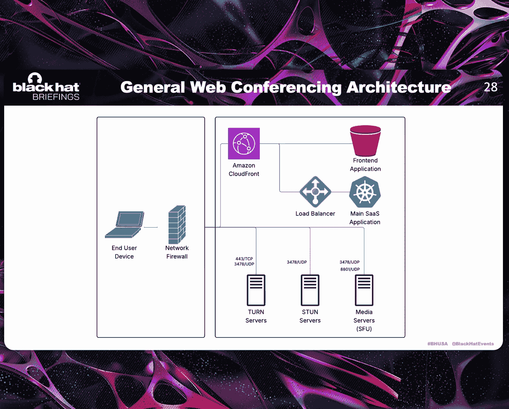
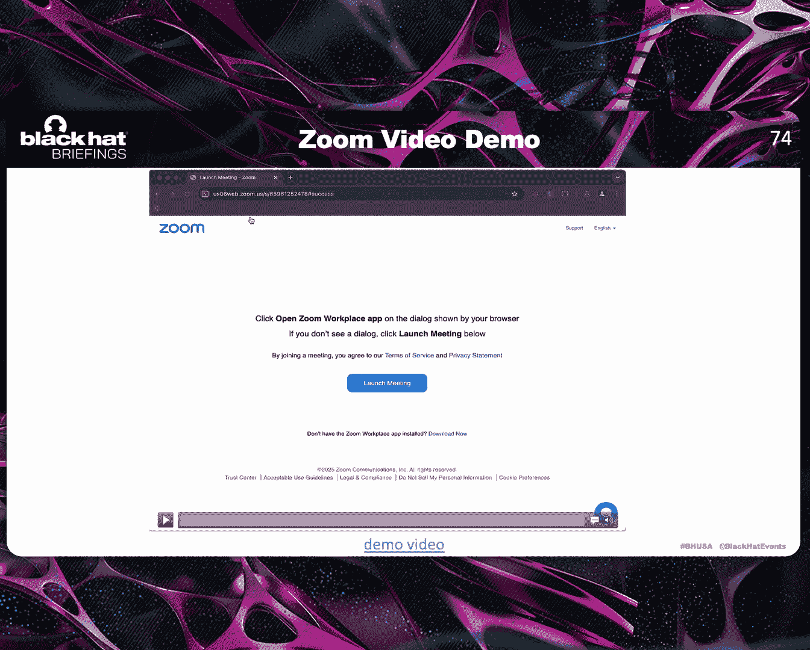
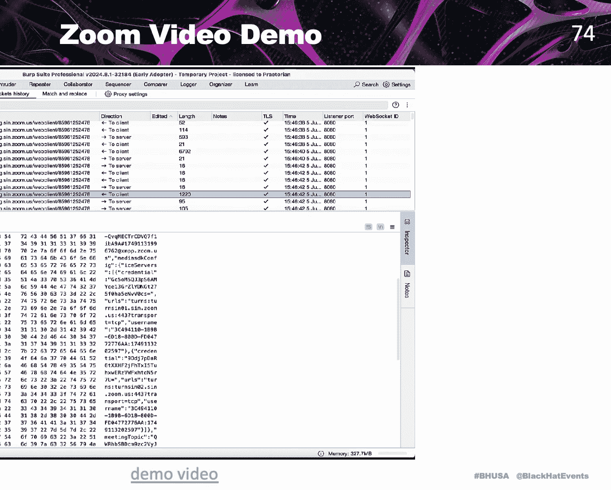
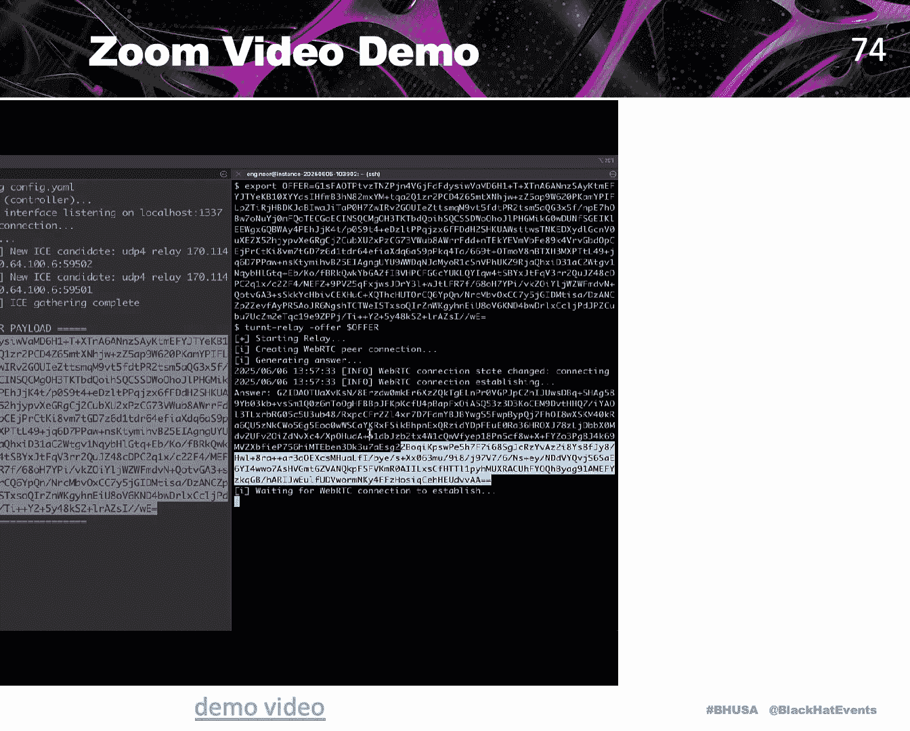
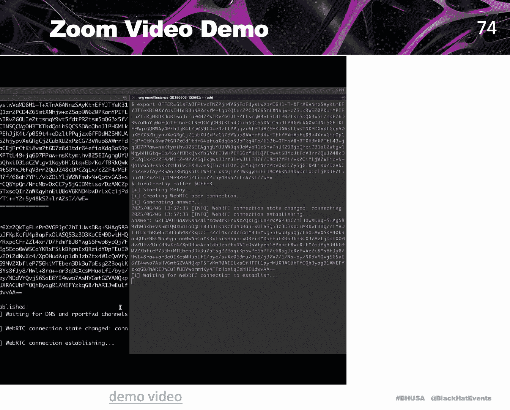
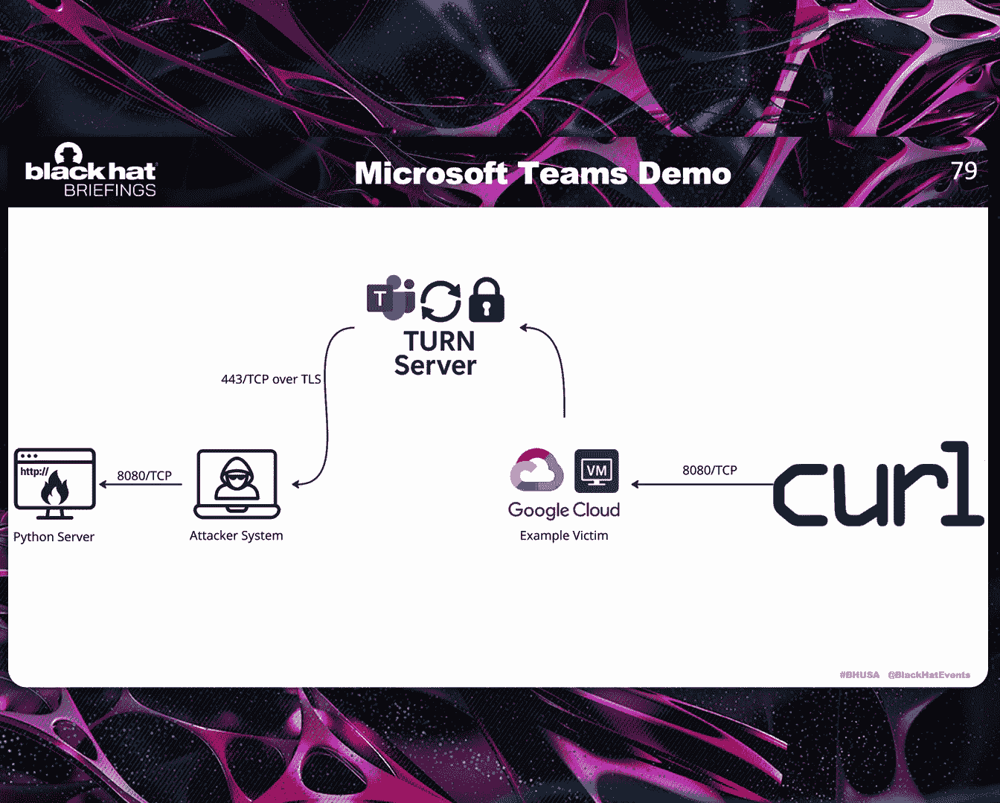
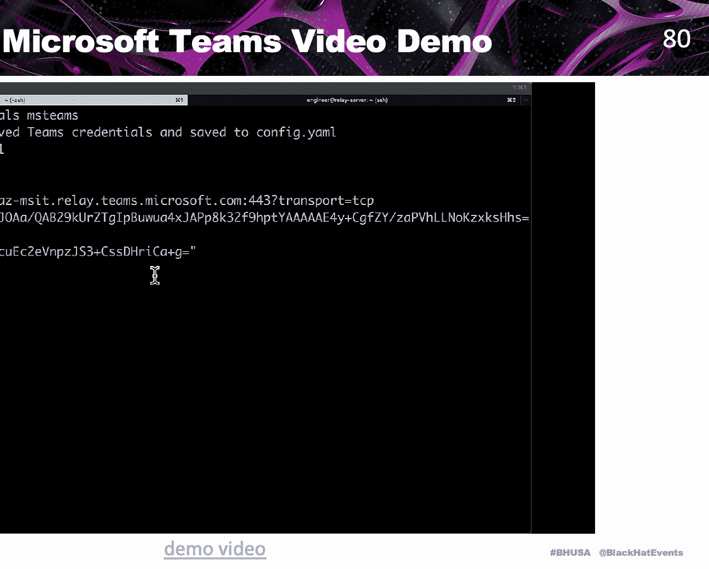
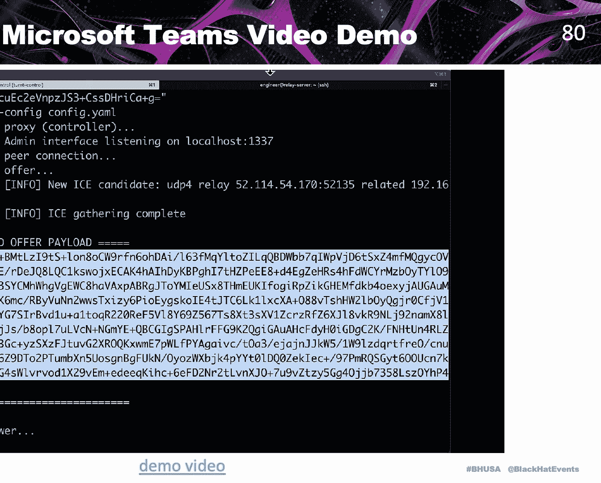
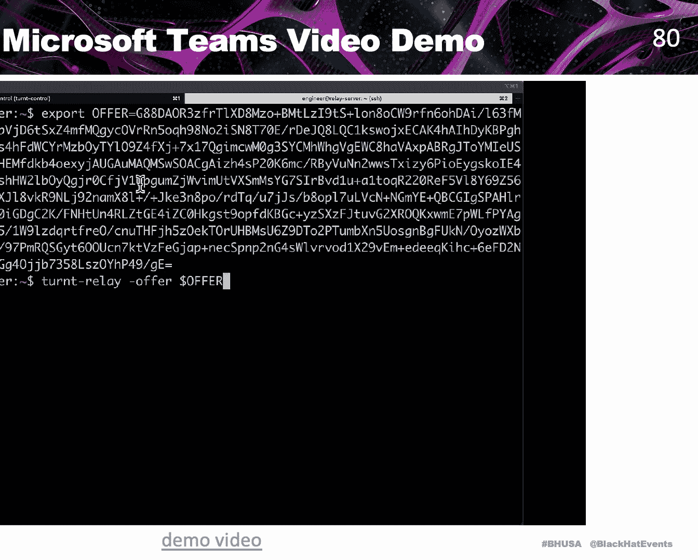
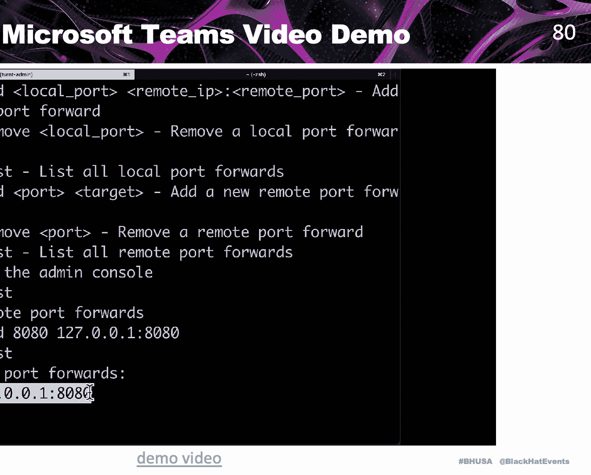

# Ghost Calls： Abusing Web Conferencing for Covert Command & Control [V9znA01MqUc]

All right。 thank you。 So yeah， as mentioned， this is Ghost calls abusing web conferencing fort command and control。

😊，To start off with， I'm Adam Crossser。 I just want to give a brief brief introduction。

 I'm a staff security engineer at Praettorian。 I primarily do a lot of research。

 like vulnerability research are helping to build offensive security tooling that we can use。

 on things like red team engagements。And so to start off with。

 I want to kind of get a common definition for us to use during the presentation because I want to talk about a problem that I tried to solve。

 which is we didn't feel like we had a good covert command and control channel for what I would call short termm command and control。

And so I would just gonna go through what I would consider maybe the four types of command control I might use on like a red team engagement or something like that。

The first is a short term channel where you might do things like socks proxying， hidden VNC。

 maybe remote port forwarding or tunneling different tooling through an implant on a host。

The next one is a long term channel。 So this would be what you would actually be spinning up and running when the system reboots and kicks back off again。

 And it would usually be on systems that you're actively operating off of。

 And lot of people actually use the same channel for both short termm and long- term command and control。

 But in this presentation， I'll talk a little bit about why that can sometimes not be a very good idea。

The third type is very similar。 It's like more of a backup C2。

 This is more meant to be if you're trying to survive， say an our eviction attempt。

 you want to have multiple additional methods back into the environment。

 you can get really creative here， like I found credentials to like tablets that were on these forklifts that weren't domainjo it didn't have EDR on them so you can kind of find some really weird places to hide there as well。

 And so usually then you're combining that with what I consider a fourth channel type。

 which is more peer-to-pe communication， So imagine a scenario where you have one system that has access to say an internal PCI environment。

 and then there's another system that has internet access but doesn't have access to that environment and the server that actually has access to that PCI environment doesn't have any sort of internet access。

 you can kind of bridge those systems together with ICMP or S&B9 pipes or other stuff like that。

 And so we basically just didn't have a good channel that we liked for the short shortter command control。

T perspective。And so we kind of went into brainstorming solutions and the first thing that we did was look at。

 okay， what are the ideal attributes of a short term command and control channel？

And so the first one is latency， which is more related to if you send a message and then you're sending that to the implant。

 how long does it take for that message to be received， the other one is slightly different。

 which is throughput， which is not the amount of time。

 it's more the amount of data that you can send within that period of time and both of these are quite important。

 some channels have high latency and high throughput and others have low latency and low throughput and ideally for shortterm command and control you want low latency and high throughput。

The third item is reach， you might have a good channel。

 but if it's like IC or tour or something that's not going to be normal on most enterprise networks。

And the fourth item is trust， ideally， you want to be using infrastructure that is allow listed within the environment or is excluded from different types of inspection or scanning。

 for example。And so we came up with some selection criteria which were we wanted to focus on services that would be egressing from end user devices。

 and so we wanted to focus on things that would be common across all user types。

 so not just developers so that would exclude things like SSH。

 and we thought a little bit about common workflows that someone might use and what that would look like at the network level。

And again， we were focusing on things that were widely used across most enterprise environments。

And so I'm just going to run through a few things that we considered and talk about kind of applying this framework how we thought about them。

 And so for things like DNS over HTP， this would have relatively low latency。

 but you run into a couple issues with throughput in terms of even if you could send a lot of data through that channel。

 it would look really weird if you're sending 20 gigs of data through Google's DNS over HTP servers and there's likely going to be some throughput issues there as well And from a reach perspective we are concerned that even though it's common on end user or consumer devices a lot of enterprises will use their own custom internal DNS resolution。

 infrastructure and would likely not be using DNS over HTTP as heavily。

But it would meet our requirement of being trusted infrastructure in many cases。

So then if you look at something like file storage and a common pattern。

 you'll see here is basically that you'll have one channel that has a few strings。

 but then it fails on two or three other that were kind of necessary for what we were trying to do。

 And so in this case with things like cloud file storage。

 you would run into issues where the latency would generally be a bit higher。

 you're going to be chunking larger blocks of data。 and we felt that the throughput。

 even though it would be good， the latency would be unacceptable for things like browsing internal web applications like like confluence and other things like that。

The reach would be pretty good， but the issue here was that。A lot of environments。

 if they're not using， say dropropbox it's going to be blocked within that environment。

 and so we thought that the trust was decent but not ideal。And then there's， you know。

 some classic ones I just wanted to throw in。 like。

 if you have a classified domain you've owned for three years or purchased your expired domains and it's classified as finance。

 you know， if you're using web socks， that would be pretty decent latency and throughput。

 but anything that's connecting to that domain would be attacker infrastructure。

 be compromised systems and it wouldn't necessarily be considered trusted。

And then another item is more email and messaging applications。

 depending on if you say sending slack messages or emails， the latency is gonna be different。

 I think latency would be higher on emails， but throughput would be a bit better。

 And so we we thought the latency would overall be fairly good。

 But the throughput wouldn't really be there。 But the reach and trust from that perspective would would meet the requirements。

 And then we kind of arrived at this final area， which is more web conferencing infrastructure。

 And if you overlay what our ideal attributes of a shortterm C2 channel would be it overlines really well with what web conferencing is designed for and that web conferencing calls have a very low tolerance for latency。

 because you have actual humans interacting with each other。

 and you're going to need fairly decent throughput。

 if you want to send multiple video streams through that channel。And the reach。

 especially after the pandemic is quite wide in terms of these solutions are widely used and most companies have users using at least all of the major products。

 and I'll talk a little bit about that later， and from a trust perspective。

 I'll talk about this on the next slide but it's generally quite trusted infrastructure in most environments。

And this is also captured in a lot of the vendor recommendations on how they recommend configuring your environment to work with these solutions。

 So if you think about things like VPN tunneling， they recommend excluding traffic to things like Microsoft Teams from full traffic VPNs。

 and they also recommend excluding traffic to their systems from TLS inspection。

And this is done both for making sure the solutions function properly as well as performance reasons and so if you look at other solutions like Zoom。

 for example， they also have recommendations around excluding traffic to their infrastructure from your VPN appliances。

 full traffic VPN tunnels， and they also recommend excluding their subdomains from TLS inspection in their documentation as well。

And so as a quick disclaimer， so everyone's on the same page。

 this isn't because these providers are being malicious or lazy or anything。

 it's just if you're designing a system that needs low latency and high throughput。

 performance is the main driver and anything that adds additional latency or throughput issues is going to need to be removed in order for that system to function optimally。

And so the next question is we now had an idea of what we wanted to focus on。

 which was web conferencing infrastructure。 The next item is。

 how do these solutions actually work and what are potential avenues that we could use for routing traffic through this infrastructure。

And from this perspective， a lot of them kind of function in a similar manner。

 so I made this kind of generic diagram that we can use to describe how they function and so we start off with having an end user device and that end user is maybe using a main SAS application and then when you do things like create or join a meeting you're either going to allocate a media server for that meeting or you're going to look up what media server is associated with that meeting and generally these solutions often have two different operating modes。

 one is peer-peer communication and the other is direct communication with a centralized media server。

And outside of the media services themselves， there's often stunned internal turn infrastructure for facilitating things like peer to peer communication。

And in terms of turn it's often in my experience， I've seen it used in two different ways。

 one of them is basically if you have two clients that are trying to set up a peerto peer communications channel and they aren't able to establish a peer connection through things like net hole punching。

 then you can use turn infrastructure as a relay for communication between those two devices。

 I've also seen it used in scenarios where a client has egress restrictions in place。

 and they're not able to directly communicate with the media server。

 allocated the meeting and they can use the turn infrastructure to communicate with the provider through that through that turn infrastructure to communicate with the media server。

And so there are entire 60 minute presentations just on how things like Web RRTC function。

 And so I don't really have time to go deep into this today。

 But outside of the architecture perspective， these providers often use common protocols。

 things like Web RRTC or the RTP protocol for communication。

And this is often even the case when they're using custom protocols， as well。

And so the main thing I want to talk about today is just the WebBRTC Handshake process in terms of this is the most important portion of WebBRTTC to understand for this talk。

 which is basically if you have two users like Alice and Bob and they need to communicate through a Web RRTC channel。

 they need some method of exchanging an offer and an answer。

 basically Alice would generate an answer， send it to Bob generates an answer and sends it back to Aliceison that。

helpsps with facilitating the Web RTC connection， exchanging the appropriate information。

 like key fingerprints for DTLS and stuff like that。

And so we started by just looking at Zoom on the desktop version and if you look at this we just looking at the header to start off with。

 you can see just IP traffic going their infrastructure on 801 UDP and we used a custom wireho analyzer and if you look at this is basically a custom header that they're using but it's actually more of a wrapper around the RTP protocol itself and so。

For， for this work， we， we use some wireshark analyzers that Princeton published for some of the research on the performance of Zoom just to use that to analyze the RTP traffic。

 But where， where I think it gets interesting is if you look at solutions like Google Meet。

And we dig in here， you can see UDP traffic outbound on 347，8 UDP。

 but you can see that it says the stream is set up by DTLS and SRTP。

 and so Google Meet uses stock webb RTC and so they're using the DTLS protocol for key exchange and then using SRTP for video and audio communications and so even when things like Zoom are using custom protocols。

 they're often using kind of similar stuff like kind of wrapping a custom header around the RTP protocol。

And another interesting observation about these solutions is they're often very resilient when it comes to actually egresssing from an environment。

 and so I would kind of mess around with this in my lab just configuring different environments or different egress controls and seeing what channels they might use to actually egress outbound from the environment。

 and so I was basically using that to try to find is there any like tunnelling service or using anything that I could potentially repurpose and use for my own purposes for command and control。

And so I just wanted to walk through how these solutions would operate an environment that is probably one of the most lockdown that you could have。

 which is only allowing eGgress through a web proxy that enforces TLS inspection and blocking all other traffic outbound any direct communication outbound。

 it needs to go through a web proxy that the client is actually explicitly configured to use that web proxy。

And so we're going to go through just with Zoom on the desktop and the web client just to talk a little about how this functions。

And so itll first start by trying to communicate outbound on 443 TCP over TLS using a custom protocol。

 and this would be blocked because of the egress controls in my lab environment。

 and so what it will do is it will switch over to using a web socket connection on 443 TCP to communicate with something called a zone controller and basically this is just used to look up what media server needs to communicate with。

So it's going to then try to make connections on 443 TCP and 8001 UDP to that multimedia server。

 and that's going to fail because of the egress controls in the environment。

 And so then it's going to switch over to using web socket connections over 443 TCP and basically send that same data that would have sent over those two connections over a web sockets communications channel。

 which would then work with the web proxy。And so the Zoom web client is a little bit different。

 it actually uses WebBRTC and then uses WebBRTC data channels to send its custom protocol over that connection。

 and so it starts off by making a connection to something called a real-time web gateway and it basically gets the same information it would get from the zone controller for the most part and so that would work because it's using HTTP in our lab environment。

Let's going to try to initiate a Web RRTC connection over 80 to 1 UDP to the media server itself。

This is interesting because basically all of this infrastructure can support multiple different protocols on the same port and it just depends on what the client does on the initial connection so it can either use the custom protocol or it can use WebBRTC just depending on what client is being used and this would of course fail due to the egress controls that are in place。

And then it's going to try to make a connection using turn over the TlS protocol。

 And so basically turn one of the operating modes is it supports a method called turnss。

 which uses the TlS protocol over 443 TCP to communicate with infrastructure。

 and so that will often work in environments where you have more strict egress controls outbound And so this would fail in this scenario again。

 I think that this is one of the more extreme scenarios that you would see in most networks。

 they're not this district unless it's like I've seen it in certain cases like DDI infrastructure for very very security conscious financial institutions。

 but it's pretty rare for this configuration to be in place across the board on user endpoints。

 And so this would fail。 So then it's going to go back and make a website connection on 443 TCP to the real-time web gateway and basically send audio and video data through that channel that then goes to the multimedia router。

 And so the main highlight here is that these solutions are actually very adaptable to different environments and different egress controls。

might be in place and so outside of this they're also very good at adapting to different environments in terms of the amount of available bandwidth so they might send audio only or prioritize certain video streams over others or degrade the quality of the video depending on the connection speed and so overall these are some of the most I think adaptive solutions you would see in many environments in terms of being able to egress outbound and adapt to different connection speeds。

Outside of that， I did notice there's generally performance degradationgregation as you go down this chain。

 know things like when having to fall back to web sockets for communication。

 for audio and video streams is quite slow compared to some of the other channels。

And so you might notice that I've been talking a lot about Zoom and Microsoft Teams and there's a reason for this。

 which is basically just that these are two of the most popular vendors on the market。

 If you look at any market share data， it differs a little bit。

 depending on what source you're looking at， but in general。

 these are some of the two most popular solutions， at least by a wide margin across most sources。

 even if the exact market share numbers differ a little bit。

And so the interesting thing about this is we wanted to focus on these two solutions because they' even if you're not using。

 say Google Meet or you're not using Microsoft Teams or Zoom。

 you're using say Google Meet internally， it's likely you have users in your environment that are using these solutions as well just because they need to interface with external external companies or customers that are they're using Zoom or Microsoft Teams。

 And so across basically I'd say every major environment you're going to see traffic to this infrastructure。

 even if you're not using it as your primary primary solution。

And so we did some reverse engineering of Zoom and focused on both the desktop and the web client。

 but focused a little bit more on the web client just because it's a bit easier to reverse engineer JavaScript code and so we found basically these credentials for turn infrastructure that are used within the Zoom client for communicating in those scenarios I mentioned before like when you're having eGgress issues over UDP。

 it can try to fall back to using turn infrastructure and so this was interesting to us because。

It's Zoom。us subdomain， so it's a domain that they would recommend excluding from TLS inspection。

 ands if we look into this a little bit more it's also within infrastructure that they recommend a allow listing in terms of what IP that resolves to。

 they recommend it's in the list of IPs that they recommend allow listing within your environment。

And then on the Microsoft Team side， we just did some research and we found there's a similar process。

 you don't have to actually join a meeting in this scenario。

 it's just an unauthenticated endpoint that you can access。And so。

We decided that this would be an interesting vector to pursue for command and control just because it would be agnostic to specific providers。

 We don't need to reverse engineer custom protocols or handshake or meeting join processes。

 We can just extract turn credentials from the infrastructure provided by these providers and use them for shortter command and control。

And I'll talk about this a little bit more later， but it's more meant to be something that complements your existing long term command and control channel。

 not something that you would use on a standalone basis。

And so these credentials aren't tied to any specific calls or anything， so once you obtain them。

 they're usually valid for a couple of days and the victim doesn't need to be using Microsoft Teams or Zoom or even have them really installed within their environment。

And so the next step goes into actually building the tool of we had a pretty good idea of what we wanted to do。

 but now I'm going talk a little bit about what are the requirements and what do we want to build And so the idea is we wanted to build something where you can build a shortterm C2 implant that you can use alongside your existing long-term C2 and we wanted it to be agnostic to the implant。

 So if you're using cobalt strike or nighthawk or a custom C2 as long as you have certain privileges like certain primitives like the ability to run code and memory。

 you could use this tool and use it on your red team engagements。

And so the idea is we wanted to build something where at the network level it might look for a couple of hours。

 it might look like you're on a video call， but you're actually just routing traffic through that provider's infrastructure for things like So proxy。

 internal network scanning， remoteoteport forwarding or any of those more bandwidth heavy actions you might use on an engagement like browsing internal web applications。

And so again， this is meant to be run in parallel with your long-term infrastructure and there's really two reasons why this is useful in my opinion。

 the first is sometimes the primary channel you're using for long-term C2 can be a little bit slow and trying to do Sox proxying through that can be quite annoying if you're trying to browse internal confluence instances or something like that and the other reason is kind of something I've run into on some red teams where I just have a contrived example here but it's based on a real worldorld experience where I was domain fronting through a fastly domain。

 I'm just using some bigcom in this example， this was a while ago back before fastly stop domain fronting。

 but I was basically I was needing to access a lot of internal SAP infrastructure。

 the customer wanted us to demonstrate the ability to like modify records or pull different data from different infrastructure and this involved a lot of me running the SAP that client on my laptop and then logging into different infrastructure and pulling and exfiltrating different types of data and RDP into different systems to demonstrate access to different control panels and stuff like that。

happenedapp was then when we kind of more pivoted after the red team and I started looking more at some of their dashboards and monitoring stuff I noticed that the infrastructure I was using for C2 it wasn't really accessed by legitimate clients within the environment。

 but this kind of random say regional banking website was one of the most popular websites on their environment from number of connections and so that's where maybe you're doing something where the C2 channel that you're using is actually very stealthy but once you start sending a lot of a high volumee of traffic through that channel。

 it starts to look very weird or suspicious like that previous example I gave of sending 10 gigs of data through a DSS over a CTtP server it wouldn't really match up to what you would expect to see in most environments and so having a channel that you can spin up that short live that you could send five or 10 gigs of data through over a couple of hours and anyone that looked at it would just kind of immediately assume it's related to to webconferencing infrastructure would be interesting。

And so in this regard， we did build a tool called turnt or turn tunneler that you can use for basically interfacing with turn infrastructure for command and control between two systems。

And there's a few useful scenarios here。 one of them is basically that it's completely decentralized。

 so you don't actually need a centralized command and control server for this to function like and so one of the scenarios we run into a lot is like assume breach exercises where someone provision has access to a VDI infrastructure laptop and sometimes you don't want to deal with setting up a full C2 and so you could use this to basically establish a peer-topeer connection with your operator system and whatever system you're operating off of and you can use that to proxy。

 different tooling that you might not want to directly run on the endpoint itself。

And so another key use case was local and remote port forwarding and just because not everyone will be familiar with what these are I'm just going to explain briefly。

 and so remote port forwarding is， for example， you want to bind to a port on a remote victim system and whenever someone connects to that port。

 it will basically route through Microsoft's turn infrastructure in this example。

 it will go to the attacker system and forward that connection to a service running attack on the attacker system。

 so if you wanted to say run ant and relayx on an internal network。

 you could run that on your laptop， do a remote port forward and then expose that through the remote system。

 and so that allows you to bypass a lot of the potential detections or just the logistical hurdles of running say a Python application with a lot of dependencies directly on a victim system。

And then local port forwarding is another one that I found useful。

 which is basically like imagining of something like Citrix receiver and you want to proxy it or SAP and you want to proxy that and run it from originating from a victim system。

 you can bind to a port on your local system and connect to it with the client and then it will route through our infrastructure。

 the turn infrastructure and say Microsoft Team and originate that connection from the victim system。

 and so I found this useful and like scenarios where they have cittrix infrastructure in place and they don't require MFA on the internal but they do on the external and so I can use that as one of my initial pivots to then get on citrix escalate privileges and then usually I can get objective just stealing cookies and stuff like that。

And so there's a few use cases， these are the use cases here， which is basically socks proxying。

 decentralized command and control and local and remote port forwarding。

And so I have two demos today， one with Zoom and Microsoft Teams， they're fairly basic。

 but I'm going to first show the process of obtainming credentials from Zoom since we didn't automate that。

 it isn't the readme， you just didn't want to automate the full process of joining a meeting to get those credentials when you can just open Bb and join a meeting and get them。

So the victim doesn't need to do anything on this stage。 They just need to have they're to do。

 You just need to have， say burb suite on your laptop。 you open open Chrome。

 and then you just join a meeting and you get the credentials。 And so we're going to demo that。

 And then the lab environment just uses an operator laptop in a virtual machine and GCP and we're just going to demo downloading a file through the channel。

 And so there's two components of the tool。 There's a controller that you run on your system and a relay you run on whatever victim system you're wanting to establish a shortterm channel through。

 And we're using SSH just to run the tool on the victim system。

 but normally you would want to run this through say night Hawk or cobalt strike。

 It's just easier to demo using SSH， but we have in the readme documentation examples of running this through a C2 agent if you would like to do that as well。

And then I can go ahead and start the demo。 and so here we're basically just running our browser and burp on our attacker system。

We're joining a meeting。 and then once we join the meeting， we can grab the turn credentials。

 So basically， once we complete this， this process and the interface loads， we can just。

Close close this browser here and then we just go in Bep suiteite and we look for about 1200 bytes of data。

 and so this will be actually contain those term credentials that I mentioned in a previous screenshot and so once we。

Have those credentials we're just going to add them to a configuration file which I'm not going to show here。

 but once you have the configuration file， we're going to run the controller component which you can run here and that has a config file and that generates an offer。

 which I mentioned before is part of the WebTC handshake process and you just basically paste this offer and run the relay and again the idea is you're running this through an existing channel to spin up a shortterm channel and we wanted to design this in a way that would work that's agnostic to whatever C2 platform or tool that you're using。

And so now we're downloading a file， getting fairly decent speeds。

 I think around 8 to 10 megabytes per second， which is fairly decent。

嗯。嗯。And if if we look at the network level， actually in destroying Wire shark while doing this。

 we can see that there's a TLS connection outbound to this you can see a client hello。

 and then if you look at this there's the client Ho is connecting to the Zoo that US subdomain。

And I will say I did find out on Sunday that they actually pushed a mitigation for this on the Zoom side。

 I wasn't sure if they would be able to do this or not just because。Basically。

 some providers will use the turn infrastructure for peer-to peerer communication。

 but I believe since they were just it for using your web client to communicate with the media server。

 they were able to modify the way the turn infrastructure works so you can only use this to connect to media infrastructure within Zoom and so I haven't had time to dig into this yet just because it was a few days ago。

 but it does still work on Microsoft Teams which it's allll show now。And for Microsoft Teams。

 we did automate the process of retrieving these credentials with credentials utility。

 and then we have an admin utility that you can use for actually connecting to the controller and managing local and remote port forwards and so in this demo I'm going to be showing basically downloading 100 megabyte file and I'm going to demonstrate remote port forwarding and again we're just using a laptop and a victim virtual machine。

 but in the example it's really going to be in reality it's really going to be say like a compromised endpoint or server on the internal network。

 but with this technique you would want to buy us towards using this with endpoints。

And so just to assimate， say exposing AntitM relay X through a victim system。

 I've just got a web server running on my local system。

 we have that tunnel set up with a victim system using Microsoft's turn infrastructure。

 and then if we're going to set up a remote port forward where someone connects on port 8080 on the VM and GCP。

 it will route that through the turn infrastructure and communicate with our local Python server running on the attacker system。

And then， starting here， we just run the tool to get those turn credentials in the configuration file。

And then we're going to go ahead and run the controller， we get the offer component。

And then we use that to run。

through our on the relay side， and again， this is meant to be run through an existing C2M plant to spin up a short term channel or just using SSH because it makes it really easy to demo in a video for a presentation like this。

And then now that we have the offer we just paste that back in。

 this facilitates creating that web RTC connection through the turn infrastructure。

And the connection is established， and then we're going to go ahead and download the 100 megabyte test file as a demo。

And then once this is done， we're just going to basically go through a process where I first show。

Listing remote port forwards on the remote system， where you're then going to on my laptop。

 we're going to try to curl that VM and GCP and show that that port on 8080 isn't accessible and then we're going to show that this is accessible on my laptop itself。

And then we're going to go ahead， go back to the admin utility。

 createate the remote port forward and then show that we're able to actually communicate with that service that's running on my。

 on my operator laptop on the， on the victim system。 And and again。

 this would be more if you want to expose a service like Ntel and relax on the internal network。

 you can use this with remote port forwarding。😊。

And so now we're using an admin utility， we're not able to see any active remote port Fords。

 we try to curl that GCP infrastructure。It's going to fail and then。On our local system。

 we can see that that service is running。And then now we're going to go back and actually go to the admin component and show that。

The activate the remote port forward， and。Now it should be active now and then once we go back and actually try to curl this port in GCP。

 it's going to be accessible， basically what happens is when you connect to that port on the VM and GCP。

 it's going to route through the turn infrastructure to our controller on the operator laptop and then initiated connection to the web server running locally。

And so if we look at this at the network level， it's very similar。

 you see traffic over 443 TCP over TLS to Microsoft infrastructure here。

 if we look at the client hello， it's going to a Team@ Microsoftsoft。com subdomain。

And so just for a quick conclusion， I want to talk a little bit about different defensive considerations and potential ideas for future work here as well。

 And so I think from a network level detection is quite hard。

 So I'd recommend focusing on kind of other areas of the kill chain。

 like don't focus on detecting someone using this as a tunnel focus on。

Detecting other tooling that's being run through this infrastructure。

And also the turn credentials are going to be difficult to remove in most cases because they're used legitimately within the infrastructure。

 but they can be restricted in some cases like Zoom。

 it depends on the provider and how they use the credentials if they're using them for both peer-tope communication and communication with say a centralized media server。

 then it would be difficult for them to actually restrict the usage of these credentials due to for the peer-to use case。

 but if there's someone like Zoom that's using their infrastructure that infrastructure only with a centralized backend media server。

 then there could be room on the vendor side to actually restrict how this service actually functions。

 but overall we focused on Zoom and Microsoft Teams but just when I did some higherlevel research it looked like basically every major web conferencing provider has some sort of turn infrastructure set up and then there's a lot of other providers like Cloudflare that actually provide managed turn infrastructure。

 so if you wanted additional channels outside of Microsoft Team。

 there's a lot of room for additional work there。And again， for things to avoid。

 I definitely recommend， you know， anything at the network level。

 I wouldn't recommend trying to correlate。 okay， this process is communicating with， say， Zoom My Ps。

 and it's not zoomed at E X C or something like that。 I think that would be。

A lot of high effort and maybe low return on detection。 I would focus on other areas。

 And so like you know， one idea is like we often use these types of channels for like reading internal infrastructure。

 like like slacklack or confluence or especially internal sites。

 but even sometimes infrastructure that is on the cloud just originating that connection from a victim system can be useful if for just detection purposes。

 And so you know things like canary tokens or one idea I might recommend considering of having different things。

 because just focus on like what an attacker might be using this channel for in not necessarily detect the channel。

 because I believe it would be a little bit difficult to build reliable detections。

And you again kind of mentioned this before， but like thinking about things like detecting proxy attacker tooling。

 things like someone running secrettoed up pi through the channel。

 you don't need to focus on detecting the channel that's being used。

 you could focus on detecting the actual tooling that's being run afterward and I think that would probably be a little bit better over a returnturn on your time versus trying to detect due direct connection of the channel。

Pioting into future work， I think that there's some good options here。

 things like expanding research beyond Zoom and Microsoft Teams。

 especially since the tool itself already supports turn infrastructure。

 you just need to find credentials， plug them in and do testing to see if they function properly and so looking at other providers or web conferencing providers or other solutions that use this infrastructure and finding other interesting credential vectors for using this for a short-term command and control channel。

And so I do think this is a good entry point for say new researchers or people wanting to get into work because a lot of the work has already been done。

 they can just kind of pick a provider over， say a weekend or something and pull their credentials and see if they function。

Another idea is looking at the size of the binary and seeing if you could potentially reduce them just because the relay components rid and go。

 So it's fairly large even doing things to reduce the binary size。

 it's still relatively large supporting that to say CR C+ could be interesting and having a bit of a smaller payload there。

 but I haven't really run into any issues with the larger binary size yet。

 It would also be interesting to see what the default security settings are in a lot of security appliances。

 I don't necessarily have access to them， but it would be interesting to know like do they ship default allow this or exclusions for things like following the vendor recommendations on excluding their traffic from things like TLS inspection at the network level。

And so I've got three takeaways here。 I'm not going to read them。

 I do have a little bit of time for questions and I've got three QR codes here。

 you can scan one of them is to a blog post that's two parts it's about I think you know 35 pages in Google Docs that just kind of is more of a deep dive on what I talked about today I talked to about 35 minutes today so there's a lot of stuff that I didn't cover that is published in the blog post。

 we've got the tool release on GiHub that you can actually download and start using with whatever C2 platform that you're using we have documentation for nighthawk but as long as you have similar primitives and your tooling it's just a matter of usually is changing the commands around and then LinkedIn is a good method of contacting me if you have any questions outside of this presentation and so I do have time for questions now I think about five minutes we're gonna to have a rap session after after the presentation as well and if you have any questions please use the microphone so that they're properly recorded for the video。

Awesome， well， if there's no questions， I can let everyone go。

