# HTTP⧸1.1 Must Die! The Desync Endgame [FJbuAyxTTWc]

Good afternoon。Thank you for attending Blackcat We'd like to welcome you to HTTP 1。

1 must die the D Snc End game。It is my pleasure and can you please welcome to the stage。

 James Kettle？

Good afternoon and welcome to HDP 1。1Mt Di。Have you ever had a good thing that went a bit too far。

 Maybe you got more than you bargained for。This is the fourth year that I've spent researching decent attacks。

 and so I thought I knew what I was going to fight。

The plan was to wrap up a mostly well understood attack glass with some weird bugs and niche flooraws on exotic targets。

 the long tail of HtTP Dcnc attacks。But what I found changed both my perspective and the title of this presentation。

😡，So today in this session， I'm going to share tools and techniques to enable you to embrace the never ending horror of HaTP1。

1。😊，Navigate the dey end game and convince the rest of the world that it's time for HtTP1 to die。

This started back in 2019 when I realized that H1 has a fatal flaw。

 which is that the isolation between individual H T， TP requests is fundamentally broken。

There's no single reliable way to tell where one request finishes and the next request starts。

 which means an attacker who finds the tiniest pauses a discrepancy between a front end and back end。

 can cause confusion about what the requests actually are。 In other words， a decent sinknc。

 which usually enables the attacker to completely take over the website。And what with HtP 1。

1 being an old lenient text based protocol with thousands of unique implementations。

 finding positive of discrepancies was not difficult。 At the time。

 it felt like you could hack pretty much any website you wanted to。For example。

 I was able to show that it could be used to persistently compromise PayPal's login page twice。

But we knew what the solution was by using H2 for the upstream connection between the front end and the back end server。

 we could pretty much eliminate the entire attack class。So， six years later。What's changed， Well。

 we haven't started using H2 for that backend connection。

 We have started using H2 for the connection between the client and the front end。

 but then we mostly just downgrade those requests to H1 to talk to the back end。

 which actually makes the situation worse。And then because， O， yes。

 some things were getting compromised， we decided to bolt on the ultimate security measure known as regular expressions。

😊，So the result is a mess。 Here's a classic dey detection probe。 You send two requests。

 and if the target is vulnerable， then the first one poisons the connection to the back end。

 meaning that the second request is prefixed with the text shown in orange。😊。

And these days， if you try that probe on a modern target， chances are it will fail。

 even if the target is actually vulnerable， because it will get blocked by multiple regular expressions looking for the transfer encoding header。

Or it'll fail because that detection gadget might not work on that target and we're not using very many different detection gadgets。

 or it'll fail due to one of the many race conditions involved in that strategy too， and yes。

 there's an alternative timeout based approach which doesn't have the race condition issue。

 but that's even more heavily blocked by regular expressions。So to sum， over the last six years。

 the industry has patched the detection methodology。 They've patched the scanning tools。

 but the actual vulnerability has largely not been fixed。

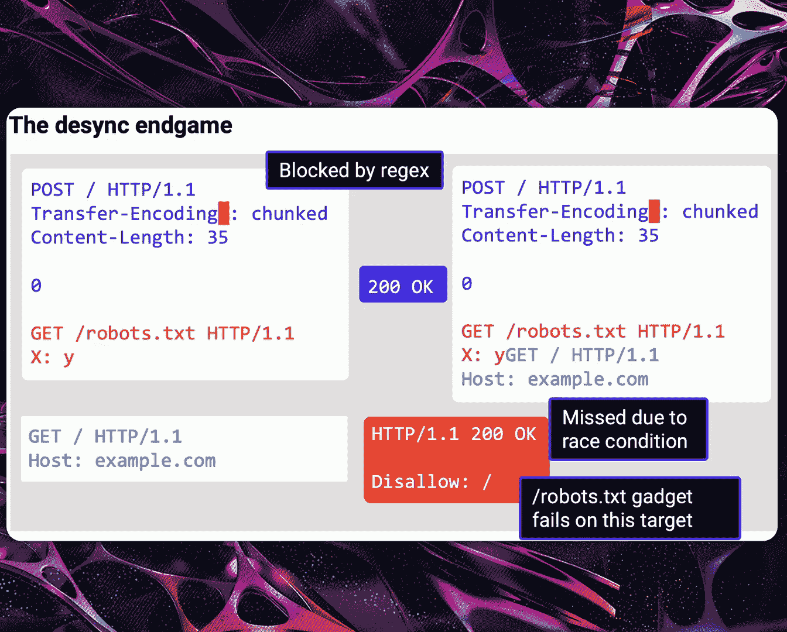

This has created the dey end game， where everything looks secure at first glance。

 But if you make the tiniest change to your methodology， things get interesting fast。

Let's take a look at an example。A few months ago， I got an email from Vans saying he'd found a puzzling vulnerability and would like to know my thoughts on what was happening。

The attack he was trying to do was pretty normal。 You send the request like this。

 It gets downgraded to H1。 It poisons the connection to the back end。

 So the next user to visit the vulnerable website gets redirected to our website。

And thanks to caching， that redirection would get saved so we could redirect JavaScript files。

 have that saved and persistently take over any page on the website。And。

It was working absolutely fine， except for one tiny little thing。

Which is that the users that were being hijacked weren't actually trying to access the targetet website。

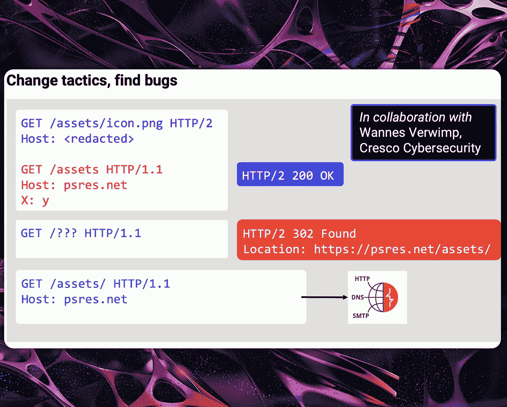

The attack was actually compromising random third party websites， including things like banks。

That's a bit strange。So clearly， the server setup does not look like this。

 It's got to be something more complex。

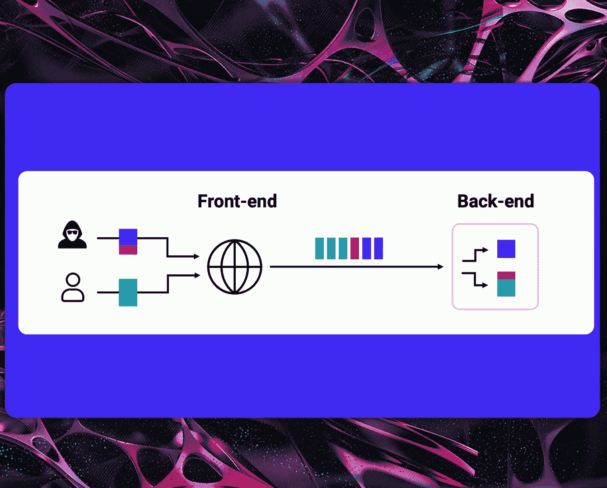

And after analyzing the target infrastructure， I thought， okay。This must be a decent between the。

 between the Cloudflare front end and Heroku's front end reverse proxy。

 So we must be exploiting random websites hosted on Heroku。However。

 that analysis was completely wrong because once again， that is too simple。

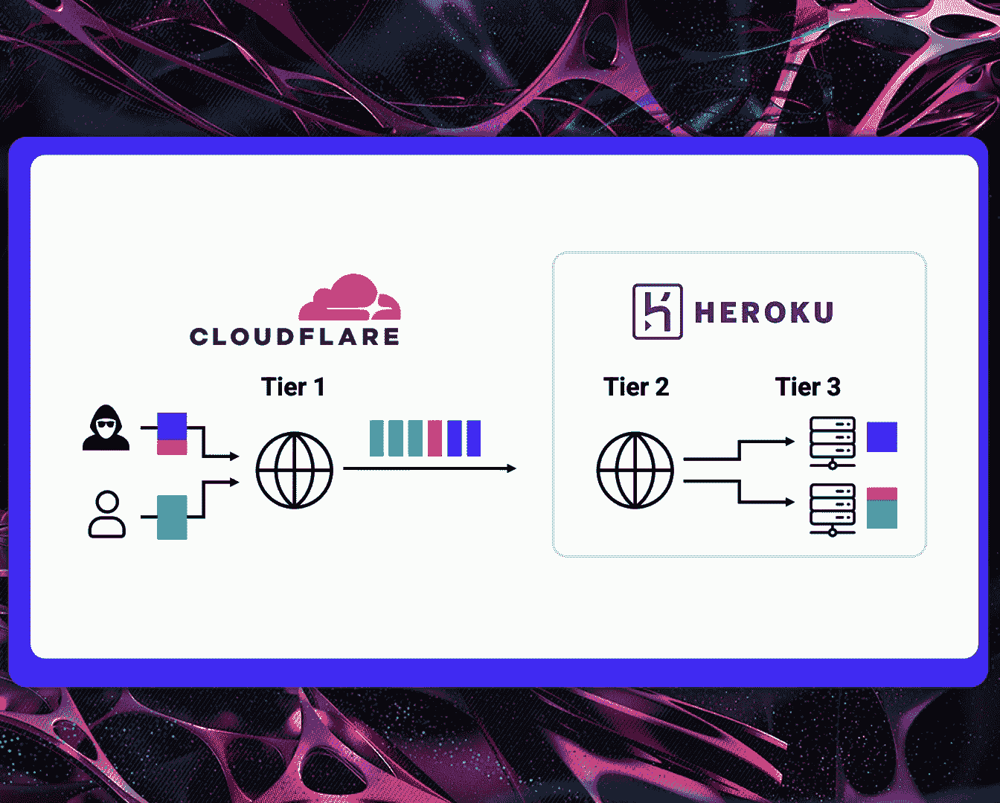

I realized that this when I tried to replicate the attack。 and I thought， hang on。

 he's made a mistake here。The request is getting blocked by by Cloudflares cash。

 which means the attack is never even reaching Heroku。

So I corrected his mistake by adding a cashbuster。😊，And the attack stopped working。啊。

So what does that mean， That means Heroku has nothing to do with this。

 There was a period of time during which if you tested any Cloudflare website and you did it correctly。

 you would find nothing。 But if you forgot to specify a cachebuster。 Well。

 then you would cause a deync inside Cloudflare's own infrastructure。

 enabling you to persistently compromise almost every single website using Cloudflare。😊。

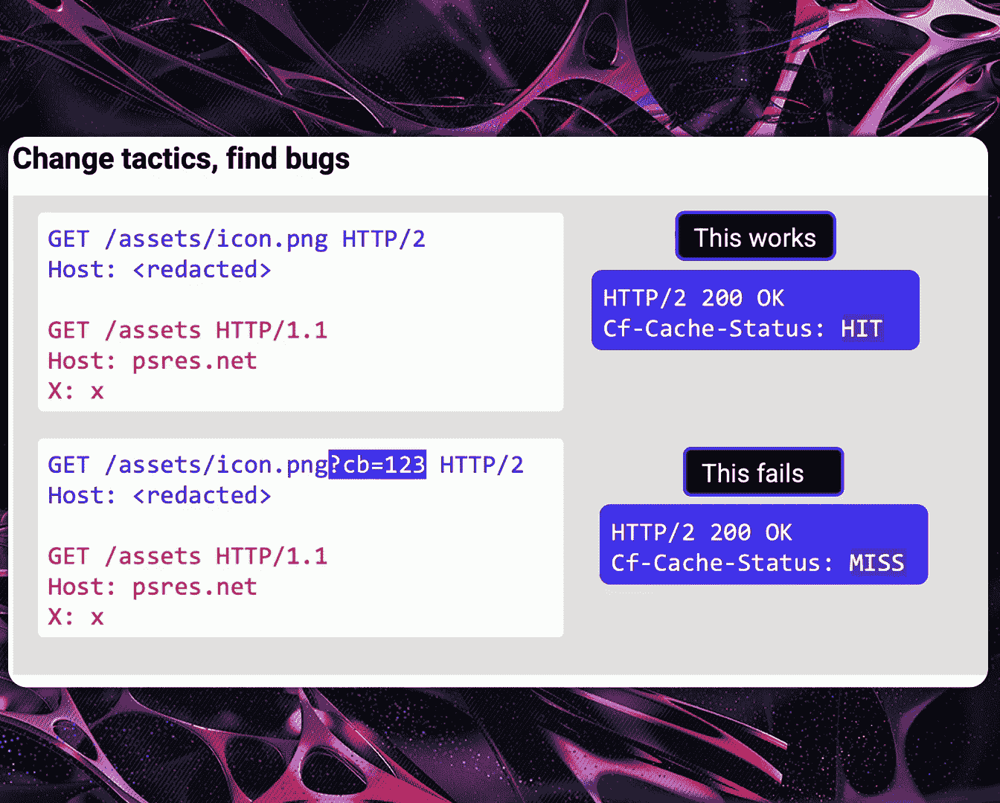

This is the decent end game。 Things look like they're secure， but you make one mistake。

 and you end up hacking 24 million websites。How old do bugs like that？Even happen。 Well， partly。

 it is the excessive complexity of the systems in involved。 For example， in this case。

 Cloudflare is receiving a request over H2。 Then they're converting it down to H1 for internal use。

 and then they're converting it back to H2 for the upstream connection。

But the underlying problem comes from the foundation。

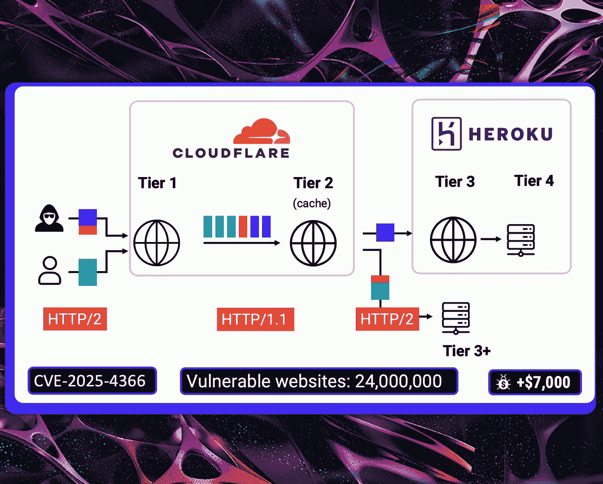

There's this idea that H T T P 1。1 is this kind of simple architectural level thing like TCP that can just be relied on。

 And we think it's secure because we know that simple things do tend to be more secure。

But in reality， as soon as you try to proxy H TDP， it stops being simple and becomes really complex。

 to illustrate that， here are five lies that I personally used to believe about H TDP 1。

And every single one of these is going to be used for an exploit in this session。😊，When combined。

 the last three lies taken together mean your proxy needs state just to read the correct number of bytes off the response from the back end。

And you need special casing， just readinging the header blocks before you even get to the body。

 And the entire response may arrive before you've even finished receiving the request from the client。

This is HtP 1。 It's the foundation of the Web。 It's made of landmines that expose millions of websites。

 and we've spent six years demonstrating that we're not able to fix it。

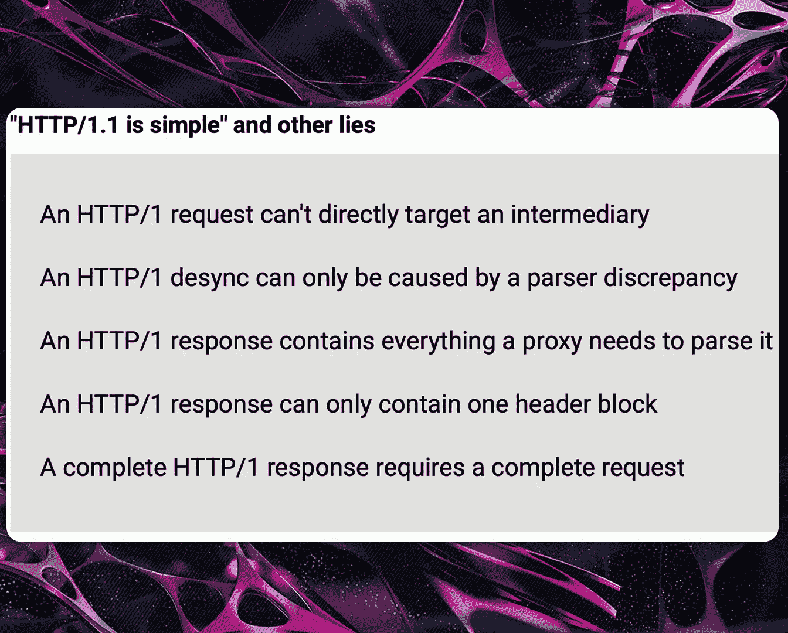

It needs to die。So。How do we kill it？ Well， we need to collectively show the world that upstream H T TP1 is insecure。

 that more decent attacks are always coming。And in the rest of this session。

 I'm going to show you how to do that。

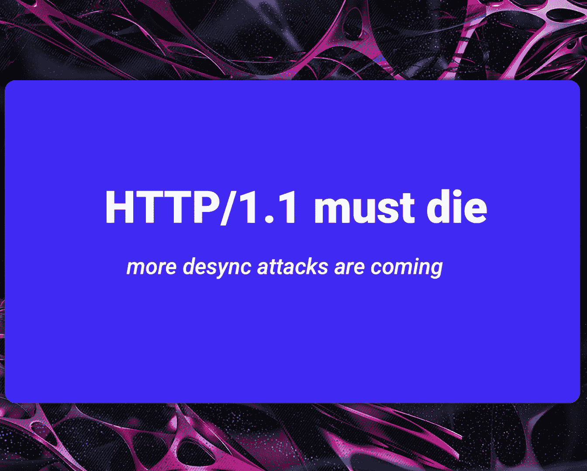

First， I'll introduce a new toolkit to handle the decentync end game。

 and then I'll share two entire new classes of attack exposing millions more websites。

 and then I'll take a focused look at how we can escape this pain。😊。

And then I'll wrap up and take some questions at the back。 Now， during this session。

 I'm going be following the research journey roughly chronologically。 So towards the start。

 we're gonna to be gaining knowledge， but not much by way of bug bounties or anything like that。

 But then as that now， as that knowledge。Takes us further beyond the state of the art。

 Things are going to rapidly get a lot more profitable。

All bounties mentioned in this presentation have been be split equally between everyone involved。

 and 100% of my cut has been doubled by。Doubled by Portswager and then donated to a local charity。

 and all vulnerabilities in named targets have been resolved。

So to win at the decent end game， there's basically。

 well rule number 0 is don't use transfer encoding。But to get any kind of progress with it。

 we need a reliable way to detect PAa discrepancies。 That doesn't get blocked by reexis。

And back in 2021， in a presentation at Blackcat Europe， Daniel Thatcher gave us one。

 And I was so hyped by the concept in his in his presentation that I implemented my own extra powerful version from scratch。

 And I'm pleased to release that today in Ha S B Request mugugler version 3。

 This is an open source Bp suite。😊。

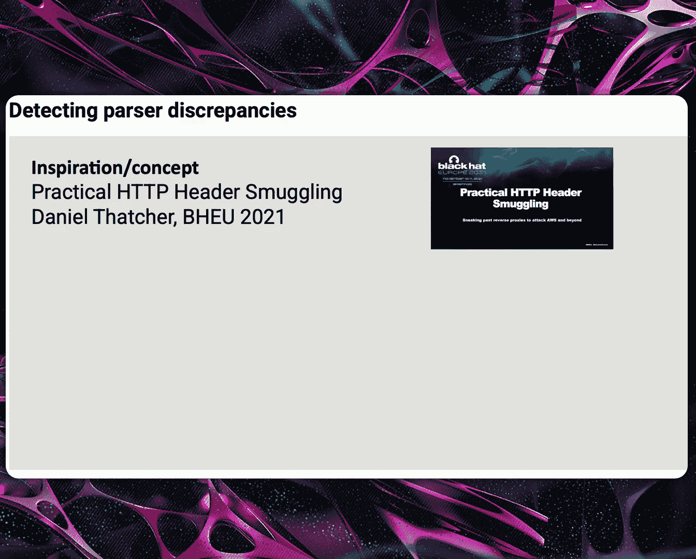

Extension fully fully compatible with pro and DT and the free community edition as well。In short。

 what this tool does is it uses a broad range of techniques to analyze and classify how the target front end and backend are parsing the request and find discrepancies。

For example， on this target by looking at the response status codes。

 we can see that if we use a space to mask the host header， then we get a unique result。

 which is different to what we get。 if we simply leave the host header out entirely。 And。

 and from that， plus the other responses shown， we can infer that we found a parser。😊，Discrpancy。

I'd call this one a visible hidden discrepancy because the masked header is visible to the front end。

 but hidden from the back end。Usually you can turn those ones into a classic CO0 deync simply by hiding the content length header as shown here。

😊，But crucially， if you run into any issues with building that exploit。

 you can adapt and deal with them because you've already found the underlying fl， for example。

 on a different。Targe they were rejecting get requests that had a body。

 but I was able to deal with that issue simply by switching the method。😊。

To options， it's that versatility that it gives you to overcome obstacles that makes this approach so valuable。

Also， by combining a broad range of different headers， permutations and strategies。

 it can achieve really good coverage。 For example， here。

 we're still using the hostheader as our detection gadget。

 And we're still hiding it with a leading space。 But this time。

 we're sending a duplicate host header with a mouthform value。 And using that。

 we found a deync on a Web VPN used by a bank。😊，This strategy even lets you predict vulnerabilities。

 For example， the HP RF says you're allowed to accept a slash end by itself as a line terminator。

 and the tool found this particular server， which does not respect that。

 So what that means is if you were to place that server behind certain proxies。

 Then an attacker could cause a disagreement about where the body starts and cause a denc。 Now。

 that particular target wasn't the sort of thing that you would put behind a proxy。

But we were able to trace the vulnerability back to the underlying H TP library。

 which is used by a whole lot of different systems。 Unfortunately。

 I can't name it because the patch has not yet landed。😊。

The tool also flagged a whole lot of servers running Microsoft I I S behind Amazon's application load balancer。

Now， if you look at the server banners here， you can see that the pars of discrepancy is happening the opposite way round。

 It's the front end that doesn't see the header and the back end that does see it。

 make it it a hidden visible discrepancy。Also， these targets are protected by AWS's HTP decentync Guardian。

 And when I saw that， I thought， okay， this thing is a bit of a headache。

 I'll just put this one on the shelf and come back to it later。

And while it SAT on my shelf gathering dust， Thomas Stacy independently discovered the same issue and bypassed decent Guardian for a H2 dot T E deync。

 So nice work， Thomas and AWS have now patched that。

 but they only patched the decent Guardian bypass。 The underlying pars of discrepancy is still there。

 So you can still exploit this to spoof your IP address and sometimes bypass access controls。

 If you want to patch that， you can do it by changing a couple of settings on your load balancer。😊。

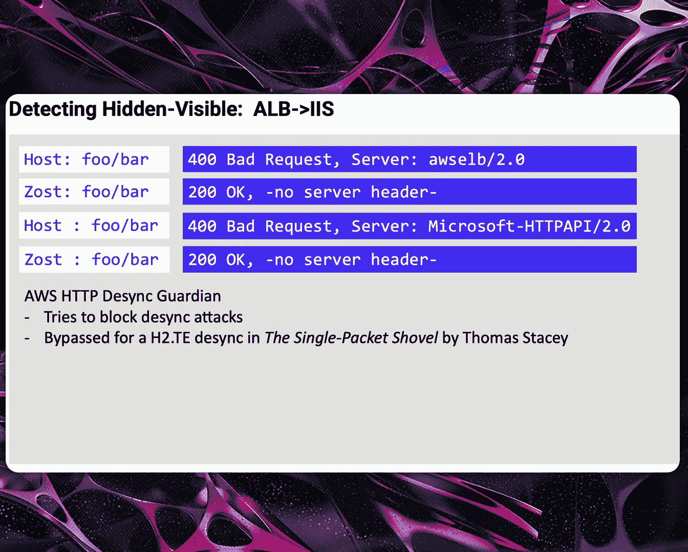

And when I saw that， I spoke to AW S and said， hangang on。

 you've literally got the settings to fix this。 Why don't you patch this by default。

And their response was that their customers have some ancient H T TP clients that cannot be changed and rely on sending malformed H T TP requests。

 That's why they can't fix it。 So basically， if you would use a cloud proxy。

 you're importing other people's technical debt into your own security posture。

This finding is where things started to get really quite interesting。 Now。

 I'm sad I can't name this target because I will be talking about it for the next 10 minutes。

 So let's dive it。 It's just another hidden visible denc。

 But the obvious exploit of using transfer encoding doesn't work。

 thanks to a web application filewall or something like that。 So it forced me to ask。😊。

How can we cause a deync on this target？ What happens if we smuggle a content length to to a target with a hidden visible discrepancy？

 Well， I guess that would be a zero C D sinknc， which is something that's widely regarded as impossible。

That's because when the front end doesn't see the content length header。

 it only forwards the headers to the back end， and then the back end ends up timing out while waiting for the body to arrive。

 In other words， as soon as you try the attack， you get a server- side connection deadlock。

 which is wonderful for taking down sight， but not so useful for decent attacks。

I discovered the solution to this problem， by accident。Last year， while researching timing attacks。

Whenever I tried to time how long it would take to load a static file served by Engine X。

 I would get a negative response time because En X was responding to my to my request before Id finished sending my request。

This was a massive nuisance， and I had to do a convoluted work around to get the timing technique to work。

 but it showed that sometimes servers do respond to requests before they're finished。

 which would let us escape this deadlock。Unfortunately。

 this target was running IIS S rather than Engine X。

 So how do you make IIS respond to your request early without closing the connection。

Well。Documentation is a wonderful thing。 And this is a great example of why。😊，On Windows。

 if you use certain names for a file or folder， the platform will think you're referring to a serial console or a device driver and blow up。

 So what happens if we hit that path on on a server running on Windows。 Well。

 you hit a special code path which makes the server respond early without waiting for the body and thereby escapes the connection deadlock。

😊。

That means that when the next request hits the server。

 the backend ends up chopping some data off the start。

 and you probably get a 400 bad request response。Seeing this happen was immediately quite an emotional moment for me for two reasons。

 Firstly， I'd known about that slash con。😊，quirk for over 10 years。

 But this is the first time I'd actually found a valid use of it。

 making it probably the slowest exploit I've ever done。😊，Also， over the last six years。

 I'd seen like while doing decent research， I'd seen so many inexplicable， bad request responses。

 I actually made might all report them as My 400 findings。😊，And when I saw this。

 I realized all those findings were probably exploitable。😊，So if you want to do a0 C， O Dnc。

 the first thing you need is to find an early response gadget on your target server。

 a way to make it respond early。 And once you've done that。

 it's time to start to work towards an exploit。If you nest a second request line inside the header block of the second request and adjust the content length of the first request you can slice out everything。

Before it and kind of unlock it， as shown here。So this is good because it lets us get beyond the 400 bad request response。

 but。It's not a realistic attack。 We can't just assume that our victim happens to have a payload to exploit themselves in their own request。

What we need is a way to add our payload to their request rather than just dropping bits off。

And we can achieve this with a double D sink。 This is where things get a tiny bit complex。

This is a two stage attack where the first request causes a 0 C， L de sink。

 which then weaponizes the second request， which also comes from the attacker to cause a C。

 L 0 de sink， which then exploits the third request， which comes from the victim。

And the cleanest conceptual way to do it is for the stage1 payload to chop the headers off the stage two payload as shown here。

 However， while this works in theory， in reality， it basically always fails because front end headers tend to inject sorry front end servers tend to inject extra headers to requests before forwarding them to the back end。

 which makes your length calculation incorrect and breaks the attack。

I have made a script which will brute force the length of the injected header。

 but it's still not ideal because these headers often contain violet values like your I P address。

 which means you'll have an attack that works perfectly。

 And as soon as you give it to someone else to replicate， itll stop working。 It's not ideal。

Fortunately， there's a better way。

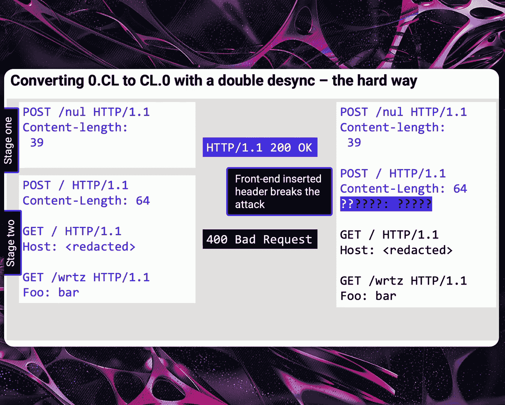

They tend to inject headers at the end of the header block。 So if our payload starts before that。

 our attack， although it now looks kind of ugly and confusing， will be much more reliable。

 In this particular example here， I am chaining that technique with the。

 with an input reflection in order to reveal the value of the injected header。

So by combining that with the classic head technique， which combines two responses into one。

 I was able to serve malicious ja to random live users and hija and hijack their accounts。😊。

There was some kind of race condition involved in this process。

 So it only worked if you sent at least a few hundred requests per second。 But other than that。

 it was pretty straight。So things got a bit involved there。

 But the good news is we've just published a Web security amy lab。

 so you can practice that entire attack chain yourself on a live system for free。😊。

Using that technique， we were able to exploit a decent number of targets。

 although we actually got distracted by something else。

 So we kind of phoned it in in terms of impact and reported them all as denial of service issues and didn't get paid very much。

 but we still got a good payoff。 I still got a good payout of X S。😊。

One notable thing here is most of those targets were vulnerable because they had a web application of firewall。

 and the firewall was the thing introducing the decent vulnerability。Now， at this point， I thought。

 great， we're done。 The decent threat is finally fully mapped。

 and any future issues or new techniques will be kind of weird niche problems rather than big class breaks。

This is a mistake that I make every single year。And it took the next discovery for me to finally realize the truth。

 which is that more decent attacks are always coming。Back in 2022。

 I tried out causing decent exploits with the expect header and。As it turns out。

 I did not look anywhere near closely enough。The first clue that the expect header is something special is that it instantly broke Trbo intruder。

 which is my H to B client。 And fixing that introduced a load of。

 of complexity to a sensitive part of the code。 And when something causes。

 causes complexity for a server or a client， you know， it's always going be worse for a proxy。😊。

Expect is supposed to break sending a request into a two- part process so that the client can bail early thereby saving bandwidth。

 That's how old this header is。 And what it does is it introduces stateness into an area of server and proxy code that previously didn't need it and therefore raises a whole load of edge cases。

 which basically make everything break in a spectacular array of waste。

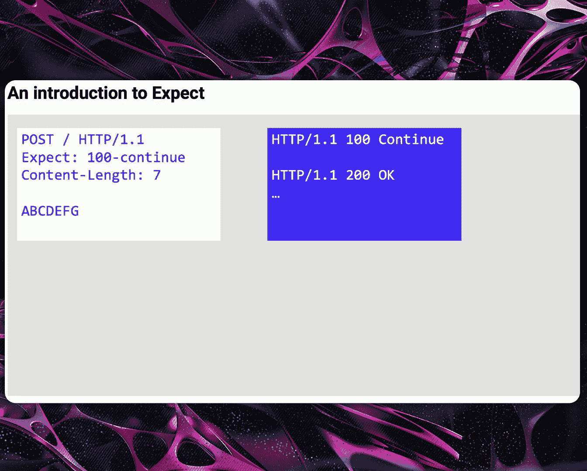

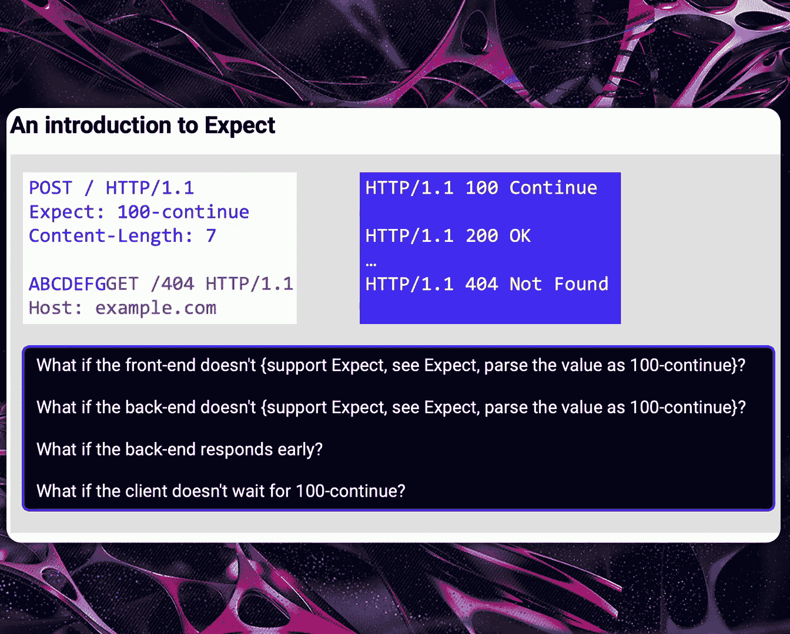

Here's a mild example on this site， the head request which is a special which is a special case。

 works fine and expect works fine， but if you combine the two。

 the server forgets it's a head request to meaning they try to read too many bytes from the back end causing a server site deadlock。

Now， that's the kind of flaw that you could predict。 But you will also find less predictable flaws。

 such as the fact that on multiple different servers。

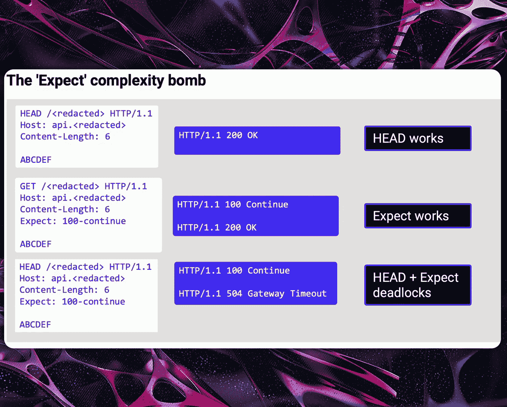

Sending the expect header simply makes them league memory， including secret keys。😊，Unfortunately。

 when I went to report that1， I found they recently shut down their bounty program。Now。

 because the expect header triggers two response header blocks。

 it often breaks attempts to remove sensitive。Sensitive response headers in order to hide them from and use it。

 So what it does is you send expect and you'll reveal a whole load of extra internal headers such as these which were available on every target using the nettlify C DN。

When I reported that to Nelify， I got a slightly unexpected response， which was。

 they said it's a feature but did pay for it anyway。 We're gonna see netlify again， shortly。

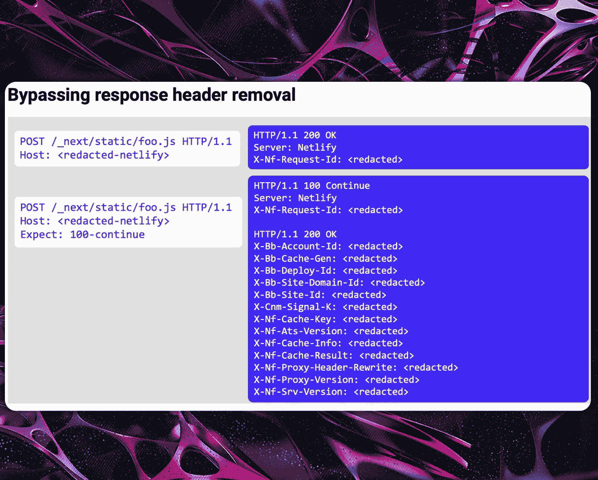

Around this time， I got a message from a small team of full time bounty hunters and。

They had also noticed that the expect header was making interesting things happen。In general。

 a research collision is not good news。 In fact， we had some really nice sample research。

 We were planning to pitch to black at USA that we basically had to can thanks to a research collision。

😊，But。😡，I'd already heard of these good guys because of their research on T 0。Request smuggling。

 And I figured， you know what， since they know what they're doing and they already know the technique。

 why don't we just team up。With their help， I'll probably get more case studies。 and with my help。

 they ought to make more money。

So。We teamed up and immediately found that simply sending a normal specator causes a zero CD sink on a lot of targets。

I think this is caused by a bug where when the front end server receives the response from the back end。

 it forgets it hasn't yet received the body from the client。

 And I chose this particular example because it was a nice inter interaction in that T mobile gave us a $12000 bounty。

 even though this only affected a single preproduction server。

 So I'll definitely be doing thorough testing on them in future。😊，I found many cases of this issue。

 but this one is particularly interesting， for two reasons。First。

 it only works if you obfuscate the expect header value。And secondly。

 this domain holds the attachments to the vulnerability reports sent to Gitlab's bugg Bounty program。

 Interesting stuff。😊，So on this target， we opted to go for response Q poisoning。

 This is a truly glorious attack where you smuggle two complete requests。

 causing an unexpected extra response， which makes the system lose track of which responses are meant to go to who and send random responses to everybody。

😊，It can be hard to do on low traffic servers like this one， but we persisted。

 And after 27000 requests， we got access to someone else's private vulnerability report and a respectable $7000 payout of Gitla and using similar technique on some other targets that I can't name。

 We took the total to over 100 K。

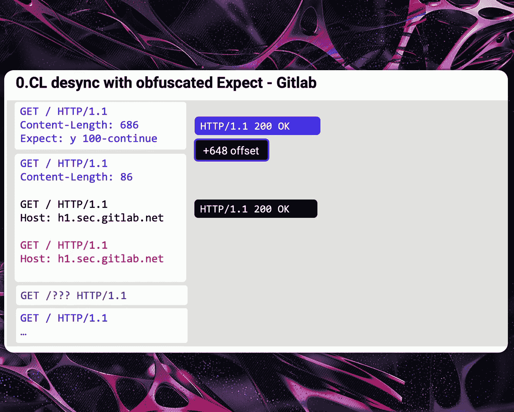

Now。Thanks。I wish I could name those targets。 but that's life。 The Exp header also causes C。

 L 0 de sinks。Such as this one。Which once again gave us response Q poisoning。 But this is on Netlify。

 It affects the entire Netlify CN。 So when we do this attack。

 it makes us hijack a stream of responses from over a million websites。😊，Now。

 we found this issue on a particular netlify。EWebs。

 but it didn't make sense to report it to that bounty program because we were hijacking responses from third party sites。

And also， shortly after we found it， the attack mysteriously stopped working。

So we reported it to nutlify directly。And they said。

We're not going to pay you because websites using Netlify are out of scope。

Which was a bit disappointing。 And normally， when I have a non ideal bounty experience。

 I don't mention it because it just distracts people from the technical content。

 But this one is useful context as to what I'm going show you next。

Here we have the last decent attack in this presentation and it's a special one。😊，As shown here。

 it gave us full control over author dotlastpass dot com。

 letting us serve content from entirely different websites on their domain and letting us their maximum bounty。

 But there was more to it than that。 This technique worked on a large number of websites。

 And for once， we could actually choose which websites got exploited。😊，There's a few select websites。

 So when you find you can hack them， you know you're on to something good。And with this technique。

 there was significant evidence that we could have used it to compromise example dot cot。

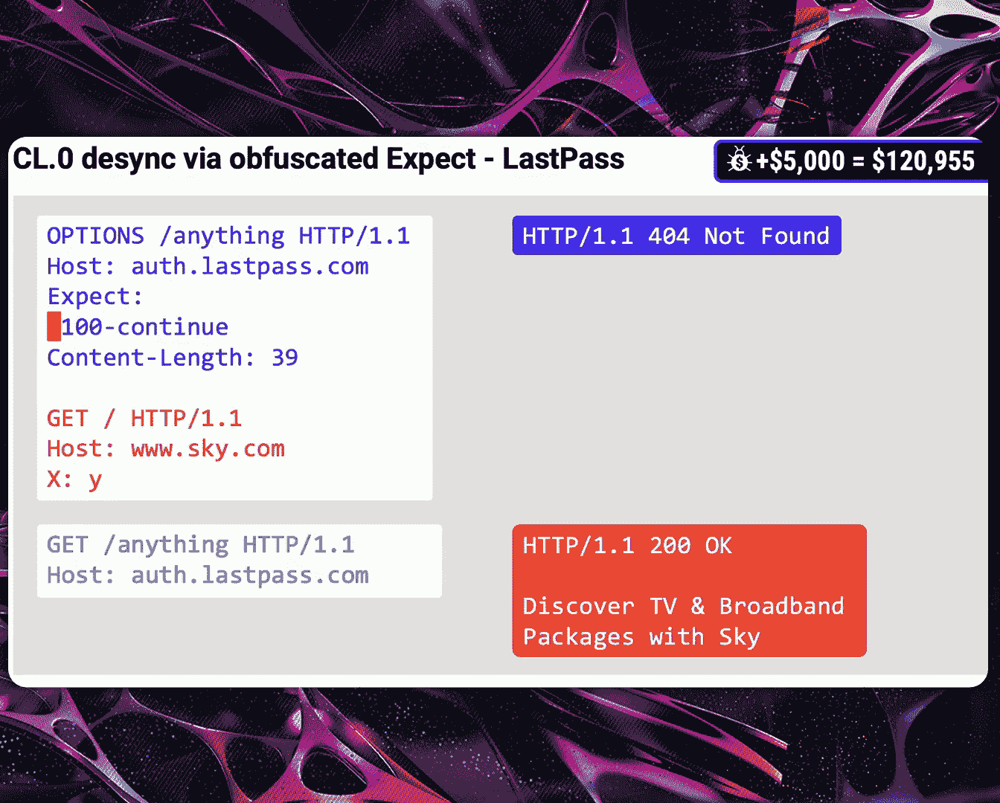

This would have been seriously cool because I bet they get a lot of interesting traffic。

 Unfortunately， they don't have any kind of VDP or bounty program。

 So it would have been illegal to prove it。 So we will never know for sure。

 I'm going try and reach out to them and get them to set one up in case we ever have this opportunity in future。

😊，Most of the vulnerable targets were using the akamai C D。 So we kind of had a choice about how to。

 how to report it。 We could send it to every company individually or we could send it to akamai only。

 And if akamai reacted the same way as Nelify， not get paid。So。

You can probably guess which option was more appealing。

It was actually a tricky decision for me because I really value having a good longterm relationship with C DNs。

 But when I collaborate with bounty hunters， I want them to make more money as a result of working with me not less。

 So so in the end， taking into account factors about that specific finding。 I said to them， well。

 you would have found this issue without me。 So I'll sit this one out。

 You you just report it to the targets， but don't put me on the rapport。

 and I won't take a cut of the bounties。 which is a decision that I still have mixed feelings about。

 because they went on to earn over $200000 from that issue。

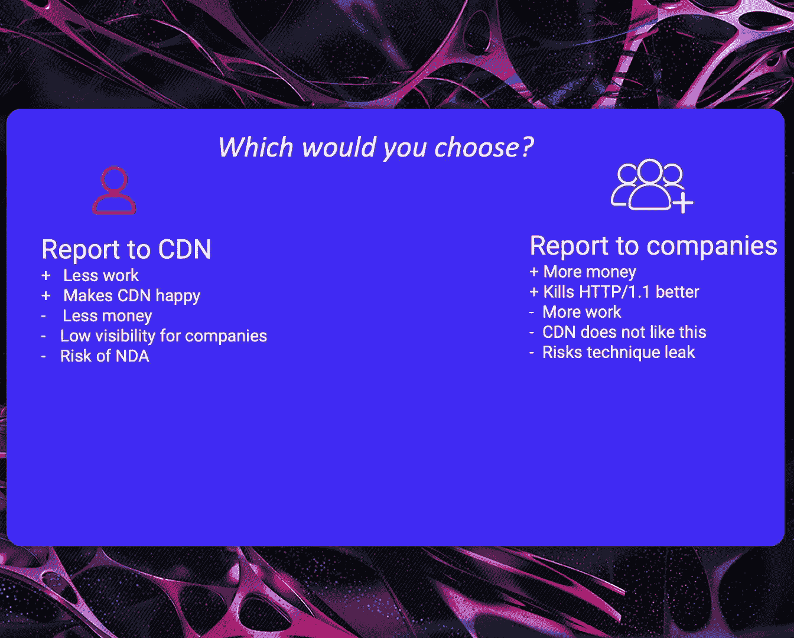

So。Overall， the reports were well received， but things didn't go entirely smoothly。

 It transpired that the vulnerability was actually fully inside akam infrastructure。

 So they just got hammered with support tickets from their clients。😊，And。

They seemed to be taking a while to patch it。 And I started to get concerned that because it had been reported to so many different programs。

 the technique might get leaked。Which would be really bad。

So I reached out directly to Akamite to help them fix it faster and ended up getting a $9000 bounty in the process。

 And they got a hot fix out to some of their clients。

 But it still took 65 days from that point to fully resolve the vulnerability。😊，Overall。

 it was really quite stressful。 but at least I got some good US dollar back evidence of the harm posed by H T P 1。

1 as it took the total bounties earned to over 350 k。😊。

So all the attacks in this session have been exploiting implementation bug。

 So it might seem a bit weird to say， we need to delete the protocol。

But they all come from the same root cause， which is that。

Ht P1 has really poor isolation between requests。 And this is， compounded by two key factors。

 which is that H T P1 is not at all simple if you're proxying it。And also。

 we really struggle to patch hasty to be won the right way。

 which is via normalization on the front end because it breaks legacy。Legacy clients。

All of that basically combines to mean exactly one thing which is that more decent attacks are always coming。

To escape， we need to use HTP2 or three。It's not the perfect protocol。 By any means。

 It is excessively complex， but it has zero length ambiguity。So although it is even more complex。

 the implementation bugs that are inevitable are mostly much lower impacts。Just to though。

 this is about H B2 between the front end and the back end， not between the client and the front end。

 So to kill the quest smuggling， you need to do two things。

 Make sure your origin server supports H2 and then turn on H upstream H2 on the front end server。

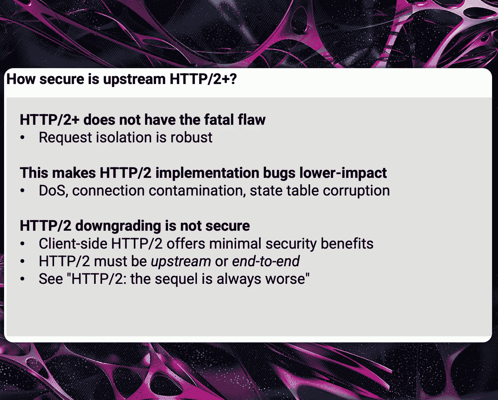

And the protocol will just take care of everything else for you。

Note that you don't really need to turn off H1。For， for clients on the front end， because。

 because those connections are not usually shared， they're just significantly less dangerous。

Unfortunately， on some major players， such as En X， Akam Cloudfrontron and Fastly。

 they don't support upstream H2。 So that means you're stuck on H1 for the time bit。

Now， the only way to use H1 and be completely safe from decentync attacks is just not to have a front end server。

 But if you do need one， I would recommend trying these options as mitigations that will reduce the chance that you're exposed in the short term while you wait to be able to use H2 in particular。

 I would recommend doing regular scans with H to request smgler version 3 because we will be updating it with more techniques as they become no。

If you work in the offensive space， I need your help because the number one problem that we've got is that people think upstream H1 is secure。

 So together， we need to show the world that the truth， that more decent attacks are always coming。

 And， and we can do that by finding those attacks， breaking things and sharing are finding。Right now。

 we are in the decent end game， which means nothing is ever completely straightforward。

 And although I've just released those fresh tools。

 there will be a second wave of regular ex expressions determined to break those tools。

 So what I would recommend， if possible， is take those tools and adapt them。 Just change them。

 Even subtle changes can make a massive difference to how effective these are over the long term。😊。

There's a load more further reading and references available。 But basically。

 you can find everything you need linked from hasty B1 mustai dot com。

And the three things to take away。

A that this is not the end。 More decent attacks are always coming。 So if we want a secure web。

 Ha needs to die。 and together， we can kill it。

Thank you for listening。Thanks， I'm going take some questions at the back here just for a few minutes。

 and and， and after that， I'll be in the community lounge in the business hall for the next hour if you want to chat。

 or you can just send me an email。Thanks。