# 课程 01: 潜入你的日志，欺骗分析师，致盲你的EDR 🕵️♂️

在本课程中，我们将学习 Windows 事件追踪（ETW）的基础知识，探讨安全产品为何依赖它，并深入研究如何通过伪造和滥用 ETW 事件来欺骗安全分析师和端点检测与响应（EDR）系统。我们将从攻击者和防御者的双重角度来审视这一技术。

---

## ETW 简介 🏗️

首先，我们来了解什么是 ETW。ETW 本质上是 Windows 操作系统的一种机制，用于生成遥测数据。它主要设计用于用户模式或内核模式的性能监控和调试。从微软的官方描述中，你找不到任何关于“安全”的字眼，这本身就很有趣。

ETW 是 Windows 的内核级组件，设计目标是高速和可靠。从高层次看，其架构包含三个主要组件：
*   **事件提供程序**：生成事件的源头。
*   **跟踪会话**：也称为记录器会话，用于组织和缓冲事件流。
*   **事件消费者**：接收并处理事件的应用程序。

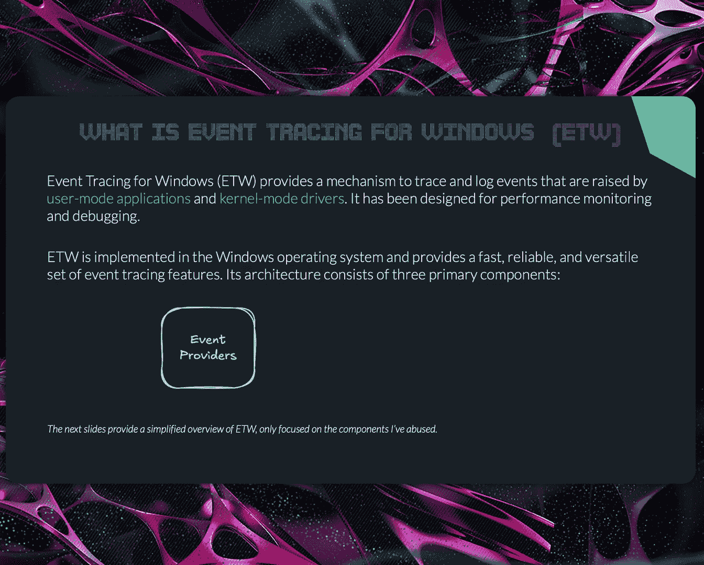

这种架构在用户模式和内核模式下都适用。ETW 内核位于中间，充当会话控制器，协调消息的流转。

---

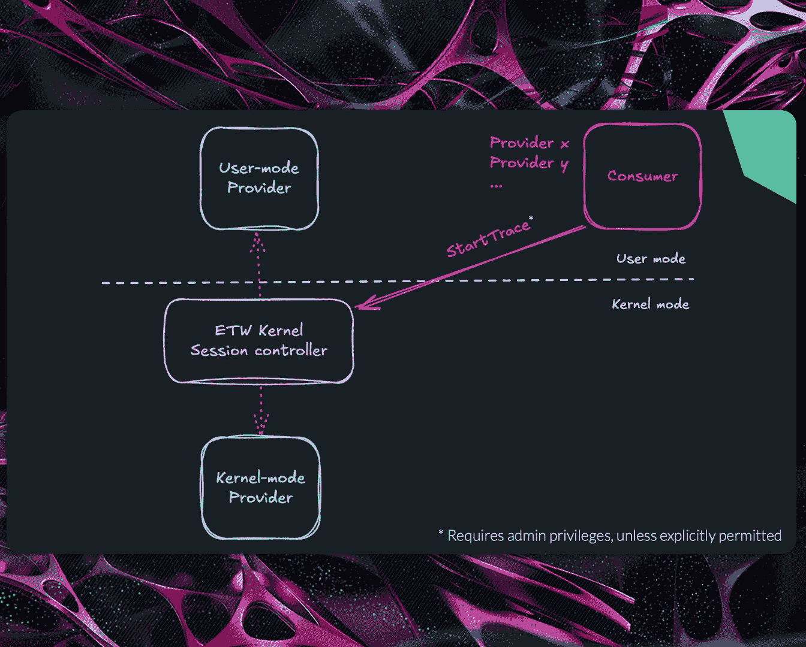

## 跟踪会话类型 📊

上一节我们介绍了 ETW 的基本架构，本节中我们来看看不同类型的跟踪会话。要监听提供程序，你需要启动一个跟踪会话。ETW 内核会实例化一个会话。主要有四种类型的跟踪会话：

以下是四种主要的跟踪会话类型：
1.  **自动记录器会话**：在系统启动时自动启动，并将事件写入磁盘。
2.  **实时会话**：实时流式传输遥测数据，数据会缓冲在一个临时文件中，供消费者实时处理。EDR 系统通常使用这种会话。
3.  **文件记录会话**：将所有生成的事件写入一个文件。
4.  **私有会话**：主要用于应用程序内部调试，其事件无法被外部程序消费。

当你启动一个跟踪会话（例如实时会话）时，ETW 内核会通知你订阅的提供程序开始向该会话发送事件。每个会话都有一个缓冲区池，用于暂存事件，直到消费者将其取走。这个缓冲区机制在后续讨论中非常重要。

---

## 常见的 ETW 规避技术 🛡️

当然，我不是第一个研究 ETW 的人。安全社区已经发现了多种规避技术。

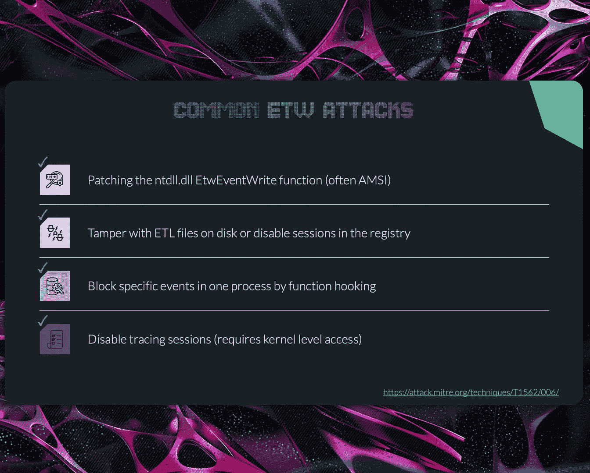

以下是几种常见的 ETW 干扰或规避方法：
*   **修补函数**：在程序中修补 `ntdll!EtwEventWrite` 等函数，阻止其发出事件。这常用于绕过反恶意软件扫描接口（AMSI），但不仅限于此。
*   **篡改文件**：篡改写入磁盘的 `.etl` 日志文件。
*   **修改注册表**：如果拥有足够权限，可以通过修改注册表来禁用某些会话。
*   **函数挂钩**：向进程注入代码，挂钩特定函数以阻止某些事件发出。但这需要向所有目标进程进行注入，容易被 EDR 发现。
*   **内核驱动**：如果能够加载恶意内核驱动程序，可以禁用整个跟踪会话，但这需要很高的权限。

对我来说，这些技术还不够有趣。

---

## 安全产品为何使用 ETW？🤔

上一节我们看到了攻击者如何干扰 ETW，本节中我们来看看防御方——安全产品为何如此依赖 ETW。这主要有几个原因。

以下是安全产品使用 ETW 的主要优势：
*   **稳定性**：需要更少的内核代码，降低了因内核驱动错误导致系统不稳定的风险。
*   **过滤能力**：可以在会话级别定义需要收集哪些事件及其属性，而基于内核回调则需要接收全部数据流后再在进程中过滤，性能开销更大。
*   **缓冲机制**：ETW 的缓冲设计使得在进程繁忙时不易丢失事件。
*   **灵活性**：可以动态启用或禁用新的提供程序来增强遥测收集，而使用内核驱动则可能需要重新加载驱动甚至重启系统。
*   **低侵入性**：无需挂钩函数或向进程注入代码，进一步提升了稳定性。

此外，内核回调能收集的信息类型有限，很多时候仍需从其他来源获取数据。

---

## EDR 对 ETW 的依赖实例 🔍

本课程中的示例主要基于 Microsoft Defender for Endpoint，因为我最熟悉它。但请放心，大多数其他 EDR 供应商也存在类似甚至相同的问题。

下图展示了 Defender for Endpoint 使用的内核回调（左侧）与 ETW 提供程序（右侧）的对比，可以看出其信息广度很大程度上依赖于 ETW。

CrowdStrike 等产品的情况也类似。虽然我不完全清楚它们的所有信息源，但机制通常是相同的，因为它们也必须从这些地方获取信息。

---

## ETW 提供程序与事件上限 ⚖️

作为示例，我们深入看一下 Defender for Endpoint 所依赖的一个 ETW 提供程序。在配置中，有一些关键信息。

以下是配置中的关键部分：
*   **提供程序 GUID 和名称**：在顶部，可以看到提供程序的唯一标识符（GUID）、名称和一些关键字。
*   **事件上限**：许多云端 EDR 会对可上传到云端的事件数量设置上限，原因包括性能、存储成本和带宽考虑。
    *   **全局上限**：例如，在 24 小时内，每台机器只能记录 1000 个唯一事件。
    *   **本地上限**：例如，对于“LDAP 首次查询”事件，每个进程每 24 小时对完全相同的搜索查询只记录一次。如果重复 50 次，也只会产生一个事件。

这种上限机制在某些情况下可以接受，但也让我思考：如果存在多个这样的事件，我能否自己开始发送它们呢？

---

## 欺骗 ETW 事件的动机 🎯

这就是我想要尝试的。我这么做的动机有几个方面。

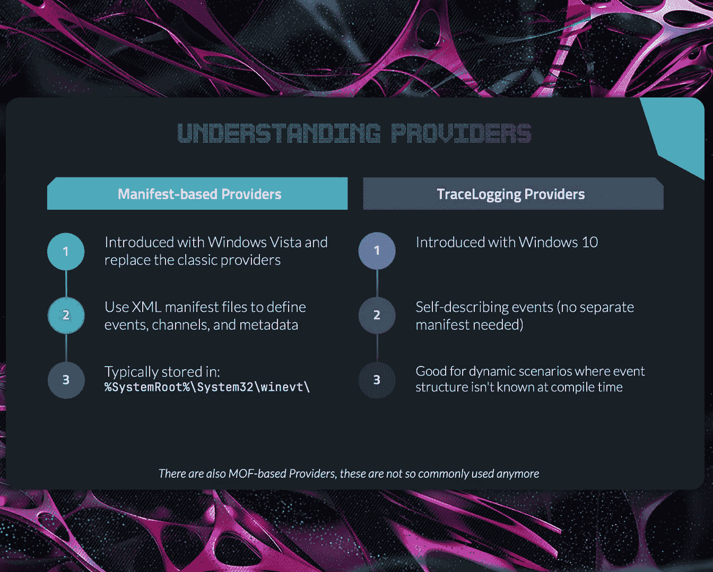

以下是研究此技术的主要动机：
*   **防御方验证**：作为一名检测工程师，我希望能够通过发出 ETW 事件来模拟攻击，以验证我的检测规则是否仍然有效，而无需在机器上真正运行恶意代码。
*   **攻击方干扰**：当然，也可用于攻击目的。例如，制造虚假警报分散分析师注意力，或者伪造从未发生的事件。
*   **淹没上限**：由于大多数云端 EDR 存在事件上限，我可以尝试用我的进程发出大量事件，超过上限，从而使其他进程的真实事件无法被记录。

为了实现这些，我们需要理解提供程序的工作原理。

---

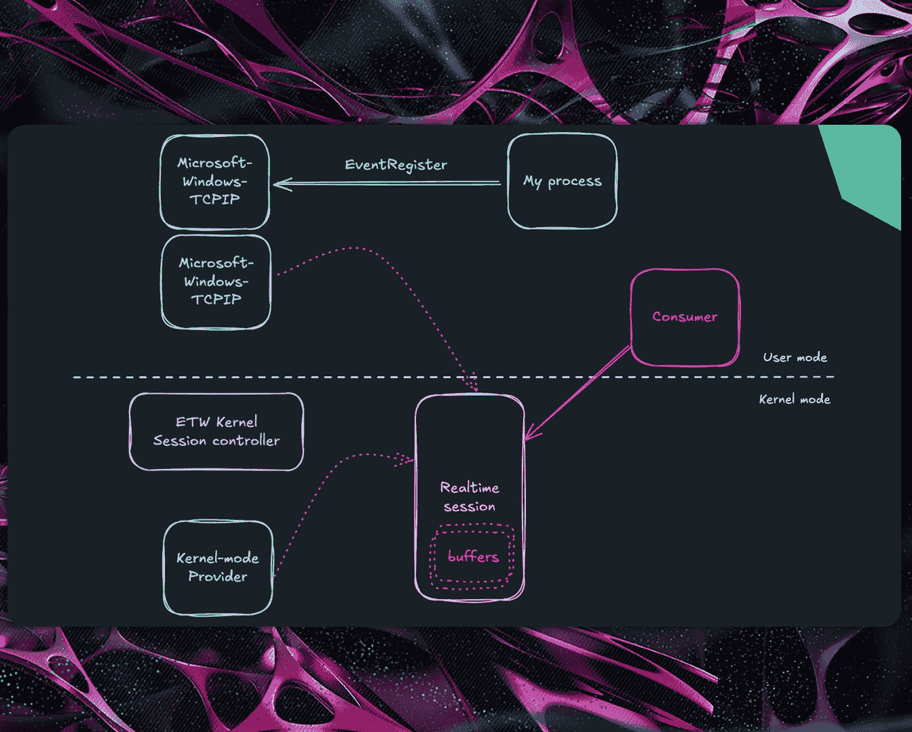

## ETW 提供程序的工作原理 🔧

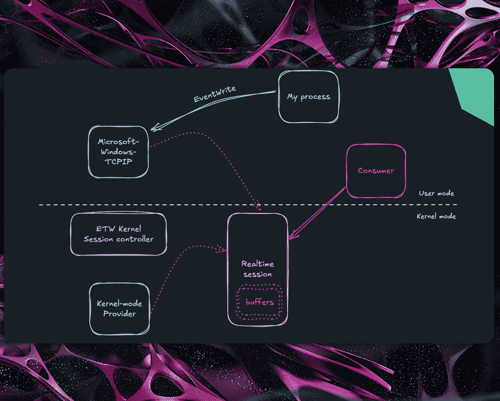

ETW 提供程序有一个 GUID。只要拥有适当的安全权限，机器上的任何进程都可以使用相同的 GUID 注册一个提供程序，**这包括已经存在于机器上的提供程序**。这听起来有点奇怪，但事实如此。

每个进程的注册是独立的。当你使用一个已存在的 GUID 调用 `EventRegister` 函数时，你会获得一个指向该现有 GUID 的句柄，然后你就可以开始发出事件了。对于操作系统来说，看起来就像只有一个提供程序在输出数据。

在提供程序类型方面，主要有三种：
*   **基于清单的提供程序**：目前最常用的类型，在 Windows Vista 中引入。清单是 XML 文件，通常存储在 `System32` 目录下。
*   **MOF 基于的提供程序**：现在已不常见，主要来自 WMI 时代。
*   **跟踪日志提供程序**：在 Windows 10 中引入，没有硬编码的清单，可以发出各种类型的事件，更多用于应用程序调试，而非安全日志记录。

---

## 可视化欺骗过程 🎨

那么，从逻辑上看会发生什么呢？任何进程都可以注册一个提供程序。在这个例子中，我注册了机器上已经存在的 TCP/IP 提供程序，它已经在向某些会话（比如 EDR 的会话）发送事件了。

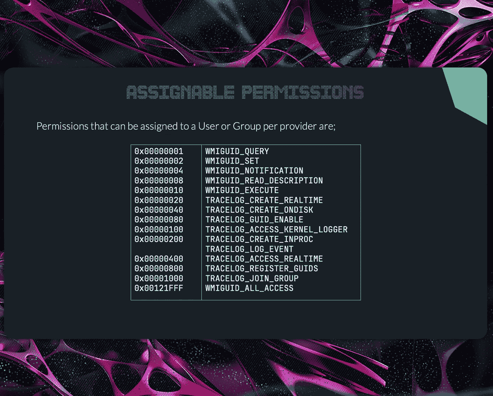

由于它已经存在，ETW 内核会给我一个该提供程序的句柄。

利用这个句柄，我就可以开始发出事件了。

现在，我向 TCP 提供程序写入事件，而该提供程序已经连接到一个跟踪会话（例如实时会话），我的事件也会到达那里并被消费进程（如 EDR）接收。

这很有趣，对吧？基本上，只要你有权限（大多数情况下你都有），你就可以注册这些提供程序之一，并开始发出各种事件，它们会被当作真实进程产生的事件一样对待。

ETW 通常不记录是哪个进程发出了遥测数据。事件中会包含一个进程 ID，但那不一定是生成该事件的进程。例如，真实的网络连接事件可能来自 Windows 的某个子进程，而不是发起连接的用户进程。遗憾的是，这个 ID 无法被欺骗，因为它由 ETW 内核处理。否则，我就能让 EDR 以为自己在做坏事然后自杀，可惜没能实现。

---

## 内核模式与安全模型 🔐

在内核模式下，工作原理类似。但更大的缺点是，你需要一个经过签名的驱动程序才能实现同样的事情。不过，你仍然可以注册提供程序并进行事件发送。

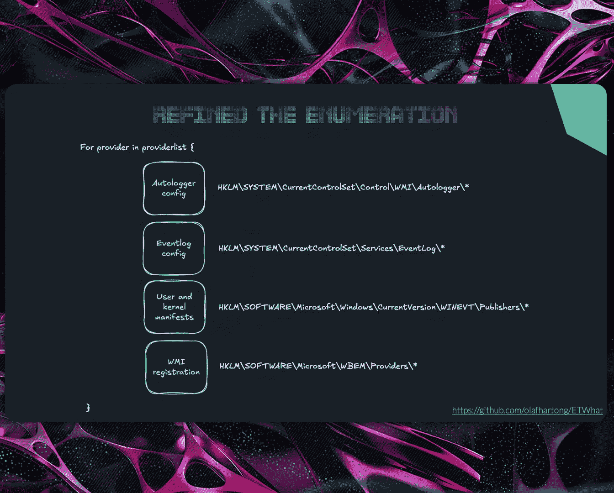

ETW 有一个源自 WMI 的安全模型，并做了一些小补充。大多数 ETW 提供程序在注册表中存储了一个安全描述符。如果没有，则会获得一组默认权限。

安全描述符主要控制哪些主体可以将提供程序添加到跟踪会话、创建跟踪会话等。默认的安全权限是，`Everyone` 组对“启用提供程序”的权限非常有限，但也没有关于“发出事件”的明确限制。有趣的是，如果你安装了 Visual Studio 等开发工具，会自动被添加到“Performance Log Users”组，这会显著增加你的权限。

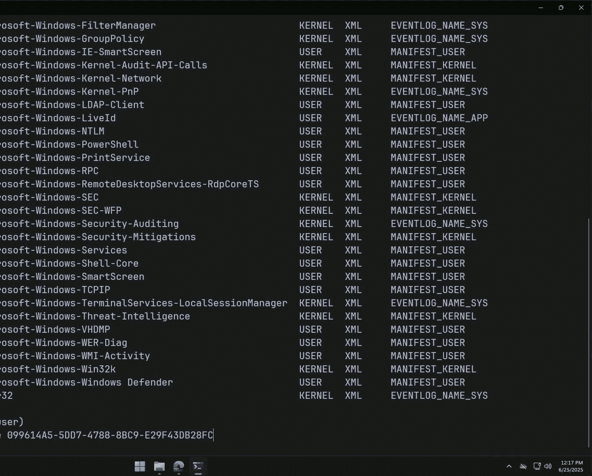

---

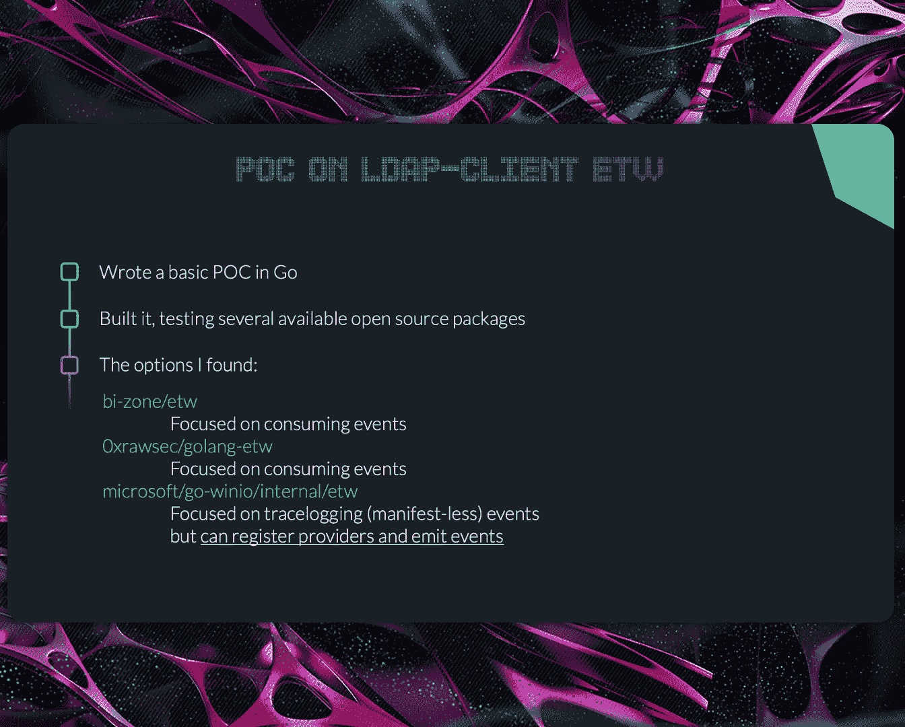

## 枚举提供程序与权限测试 🧪

我曾有兴趣找出我关心的所有提供程序的权限情况，于是编写了一个小工具来枚举它们。你可以看到，有些提供程序在注册表中注册了安全描述符（SD），有些则没有。

例如，对于“Microsoft Antimalware Service”提供程序，所有组都有相当多的权限。而对于“Microsoft-Windows-Windows Defender”AV 组件提供程序，则没有注册特定的安全权限，因此任何人都可以执行操作系统允许的基本操作。

我收集了 Defender for Endpoint 依赖的所有提供程序，并开始枚举。我写了一个简单的工具，尝试注册每个提供程序，获取句柄，写入一个事件，然后查看输出。

看起来我拥有大量权限，很多都返回了成功。但深入研究后，我发现了一些误报。你可以从用户空间注册许多实际上是内核模式的提供程序的 GUID 并发送事件，但这不一定是真的有效。同样，跟踪会话的处理方式也略有不同。从用户模式无法欺骗任何内核模式事件，这至少说明两者是隔离和受保护的。

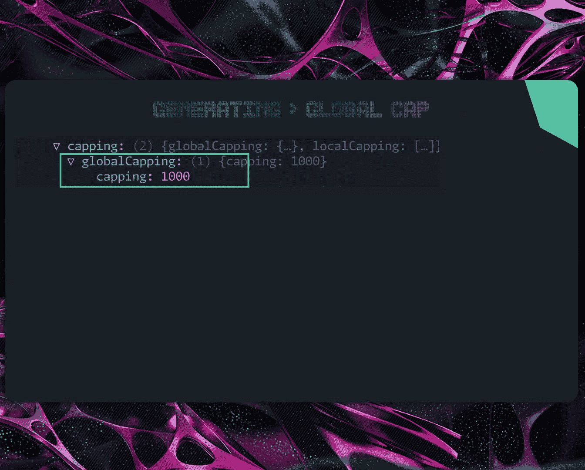

---

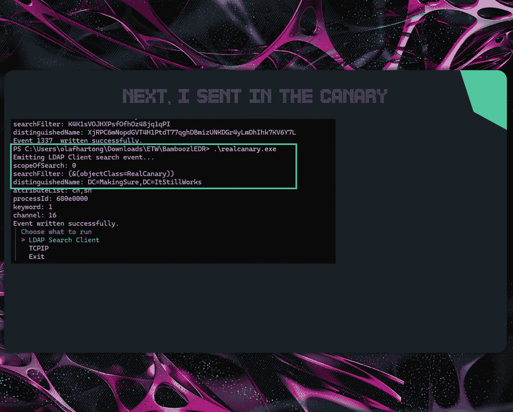

## 概念验证与事件上限测试 🧪

我选择 LDAP 客户端作为测试对象。我用 Go 语言编写了一个基本的 PoC，基于现有的开源包（主要是用于消费事件的）。我找到了一个允许注册提供程序和发出事件的包，并写了一个简单的程序。

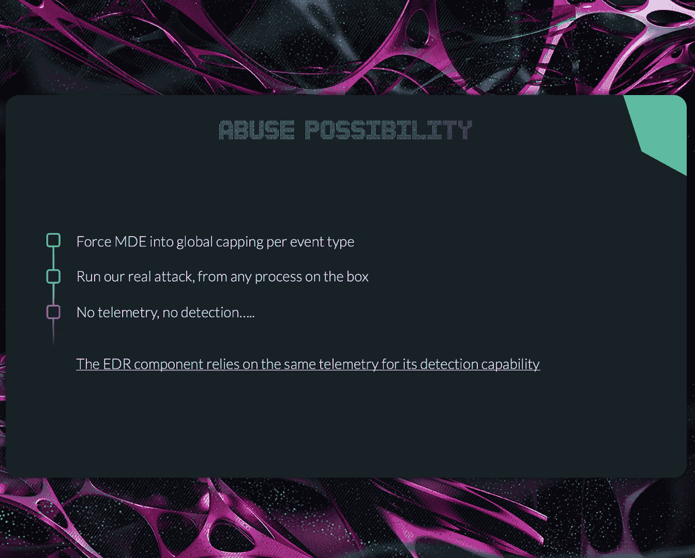

在左侧，你可以看到它以一种特定模式运行。在右侧，我启动了一个小型跟踪会话，可以看到事件流过。

我很高兴，但查看 Defender for Endpoint 时，却没有收到任何遥测数据。经过长时间调试和解码真实的 LDAP 搜索事件后，我发现字节序（Endianness）在 Windows 中非常重要，而且很多包不允许我控制正确的头部信息（如关键字）。于是我采用了新方法，直接进行系统调用，用新的 PoC 发出事件。这次，事件成功出现在云端 Defender for Endpoint 中。

---

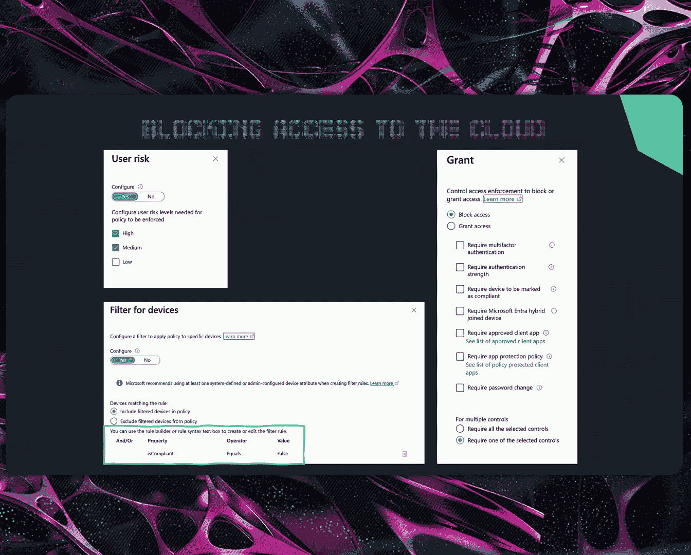

## 测试事件上限 🧪

现在，我觉得这很有趣。我能用它做什么呢？我再次查看了那些上限。我发现，发出一个事件后，就没事了。我们之前提到过全局上限。我运行我的工具，将其重命名为 `canary.exe`，再次运行，发出相同的事件。

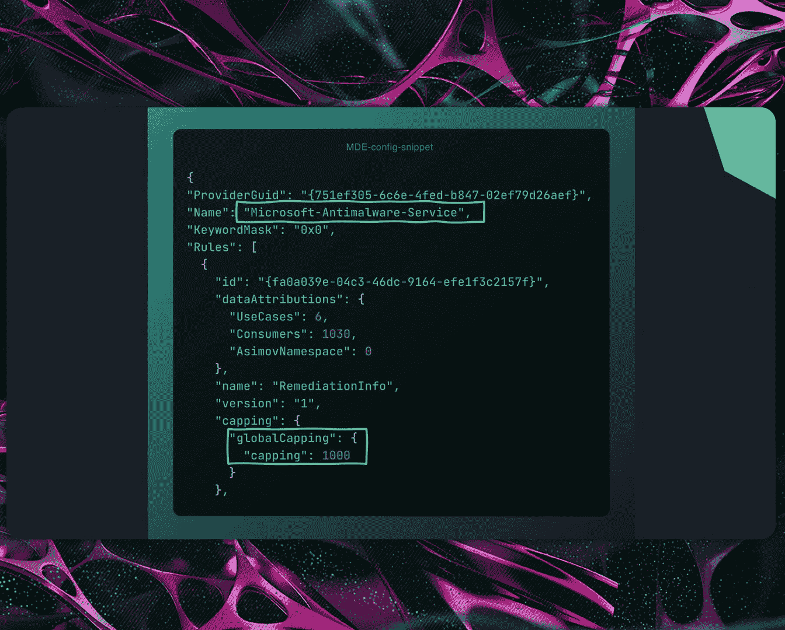

结果两个事件都出现在了云端！这证明了“首次查询”事件的理论：如果进程不同，就会被视为不同事件。

然后，我生成了 10 个垃圾事件（随机创建搜索过滤器），这 10 个也都出现在了云端，这仍然符合预期。接着，我想测试那个全局上限（1000 个事件）。我发出了略多于 1000 个事件，过了一段时间（需要时间摄取），在云端只看到了 1000 条记录。这很有效！我找到了一种可靠地超过上限的方法。

但这都是来自同一个进程。为了确保，我用真实的 `canary.exe` 发出了一个稍有不同的搜索查询，所有内容都不同，以确保它仍按预期工作。但我再也没有收到日志。这证明了我的理论：我可以超过事件数量上限，从而永远看不到真实数据。

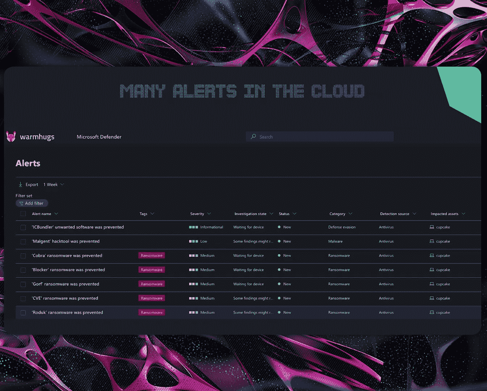

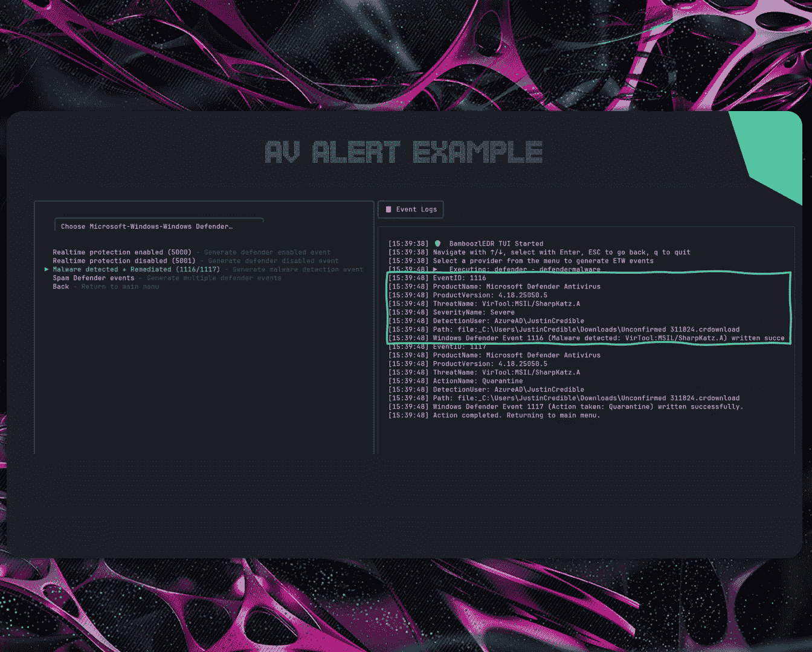

因此，我可以强制 Defender for Endpoint 对每种事件类型进入全局上限模式。当然，你需要对你关心的每个提供程序都这样做，但这仍然有用。然后，你可以运行真正的攻击而不会被检测到。只要杀毒软件没有因为某种原因识别出你的二进制文件，这确实可靠有效。

---

## 其他攻击场景与应用 🎭

我还在一个 DLL 中测试了这一点，将其注入并查看目标跟踪会话，仍然能看到事件发出。你也可以用相同的事件进行淹没，这些信息仍然会进入 Defender for Endpoint。

根据条件访问策略在组织中的实施方式，还可以做其他事情。如果用户达到特定风险级别，可能会被策略阻止访问资源。作为攻击者，我可以为该用户生成警报，提高其风险级别，导致他无法再访问某些资源。这可以作为红队干扰蓝队的一种方式。同样，对于设备，如果基于 Intune 的设备有合规性检查，生成过多警报可能导致设备被标记为不合规并被阻止访问。

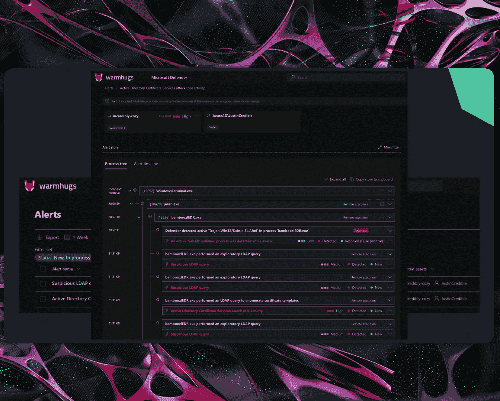

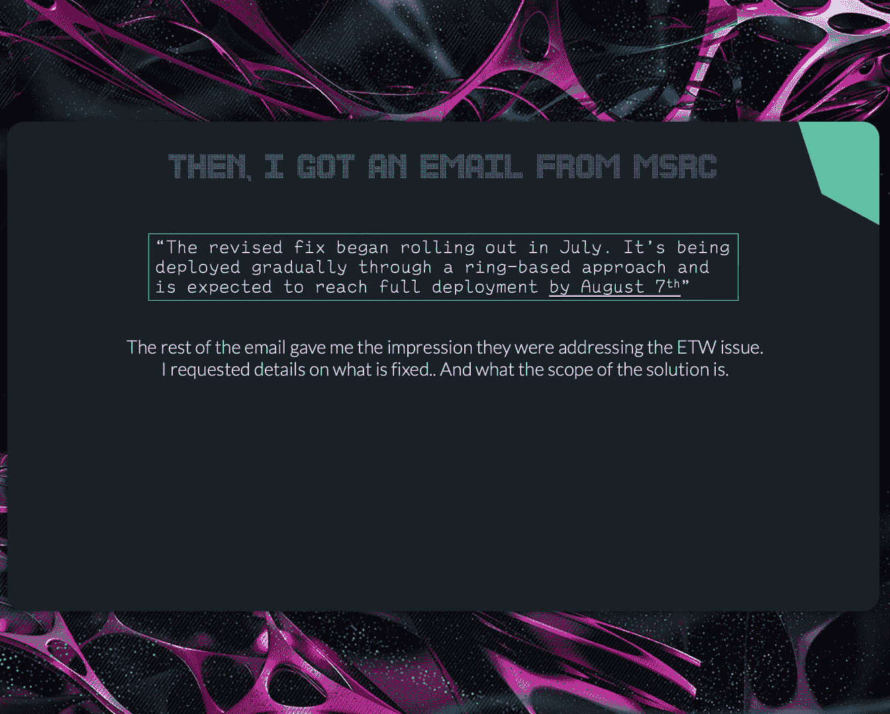

---

## 反恶意软件提供程序测试 🦠

另一个我感兴趣的提供程序是“反恶意软件服务提供程序”，因为它是 Defender for Endpoint 反病毒和恶意软件检测引擎的固有提供程序。我写了另一个工具，发出一堆随机的恶意软件事件，使用真实的名称和检测 ID，但对应系统中不存在的虚假文件。同样，由于配置的上限，只有 1000 个事件被记录。

这意味着，如果我发出 1000 个事件，然后投放真正的恶意软件（即使可能被检测到），也不会再被分析师看到。攻击者甚至可以伪装成勒索软件操作者，在机器上伪造大量勒索软件检测警报，分散分析师对真正受攻击机器的调查注意力。你还可以伪造各种 AV 检测、缓解事件等，它们甚至会出现在普通事件日志中。

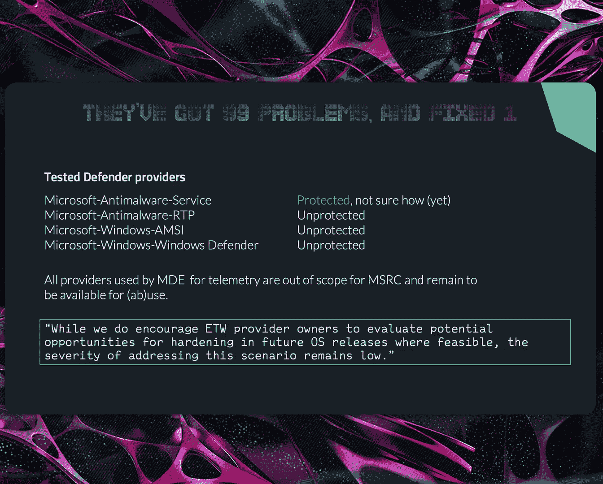

---

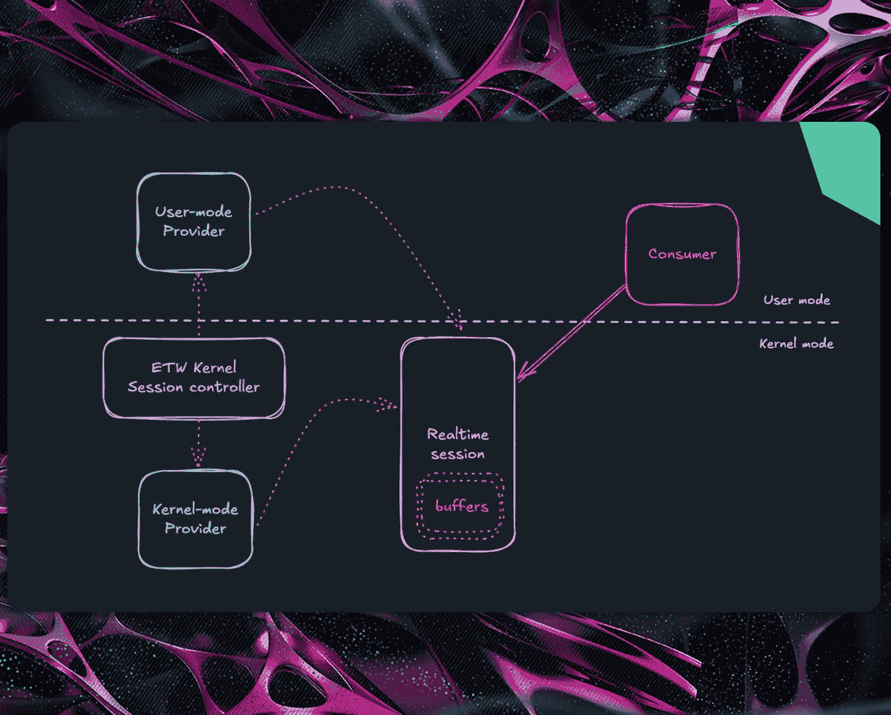

## 向微软报告与“修复” 📨

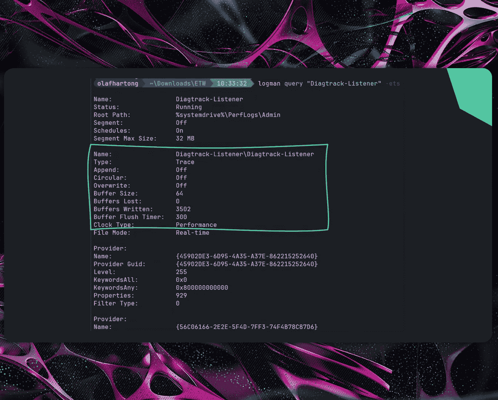

我认为这很严重，于是给微软写了一封信。我报告了这个问题，附上了 PoC 工具和一份我能滥用的 ETW 提供程序列表。几周后，他们回复很快，但认为这不重要，不是需要立即修复的障碍，因此案例关闭了。

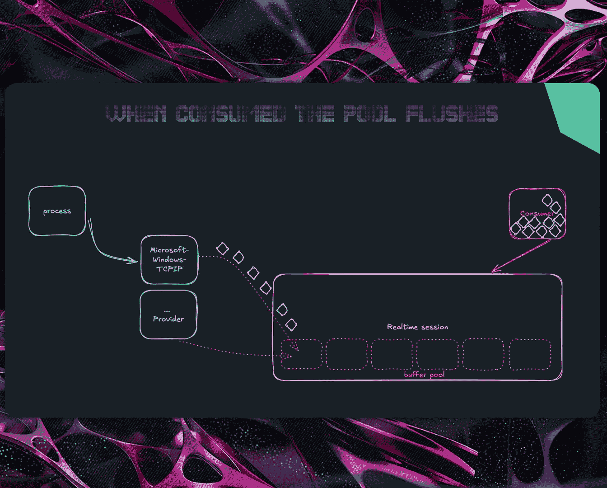

或许并没有。几周前，我想为演示准备一些录制内容。我尝试发出各种勒索软件事件，但它们不再可见了。事件仍然出现在我的日志中，但警报再也没有出现。这让我感到惊讶，但也很高兴，以为他们修复了。

但深入研究后，我发现我仍然可以生成各种其他警报，模拟 SharpHound 扫描或各种 AD Explorer 克隆工具等。基本上除了“反恶意软件”提供程序外，其他都还能触发警报。他们甚至为我的二进制文件中的一些字符串构建了签名，我不得不通过混淆字符串来绕过安全检测。

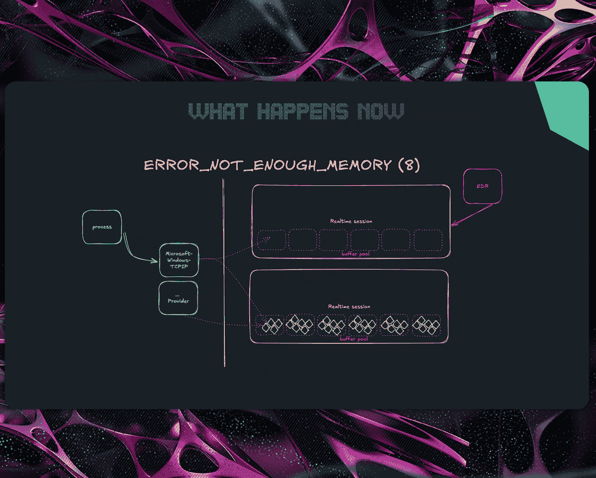

在将演示文稿提交给会议方后，他们回复说也在构建修复程序，将于 8 月 7 日（第二天）可用。这个时间点很巧合。他们后来解释说，重点是加固 Defender 产品的提供程序，防止非特权用户滥用。我很好奇，于是在一台 Windows Insider 机器上测试，发现针对 Windows Defender 和 MC 提供程序仍然成功，但针对“反恶意软件”提供程序（即我 PoC 中的那个）不再工作了。他们确实修复了这一点，但只修复了这一个问题。我报告了超过 100 个项目，他们只迈出了一小步。他们表示鼓励 Windows 生态中的其他提供程序也开始采取措施，但攻击者通常已具备代码执行能力，所以这并非完全修复。

---

## 缓冲区淹没攻击 💥

后来，我也开始研究之前提到的缓冲区。每个 ETW 提供程序都有一个缓冲区池，可以由实例化跟踪会话的人配置大小和数量。这些缓冲区被分配在非分页内核内存中。

从逻辑上讲，缓冲区池会被提供程序发出的事件逐渐填充。当池满时，如果消费者还没有取走数据，ETW 内核会告诉提供程序“内存不足”，并停止接收。**关键是，这会影响到该提供程序连接的所有会话**。

这意味着，如果我用自己的会话淹没 TCP 提供程序，导致其缓冲区满，那么 TCP 提供程序也将无法向 EDR 的会话发送事件。这很可怕，但这是设计如此。

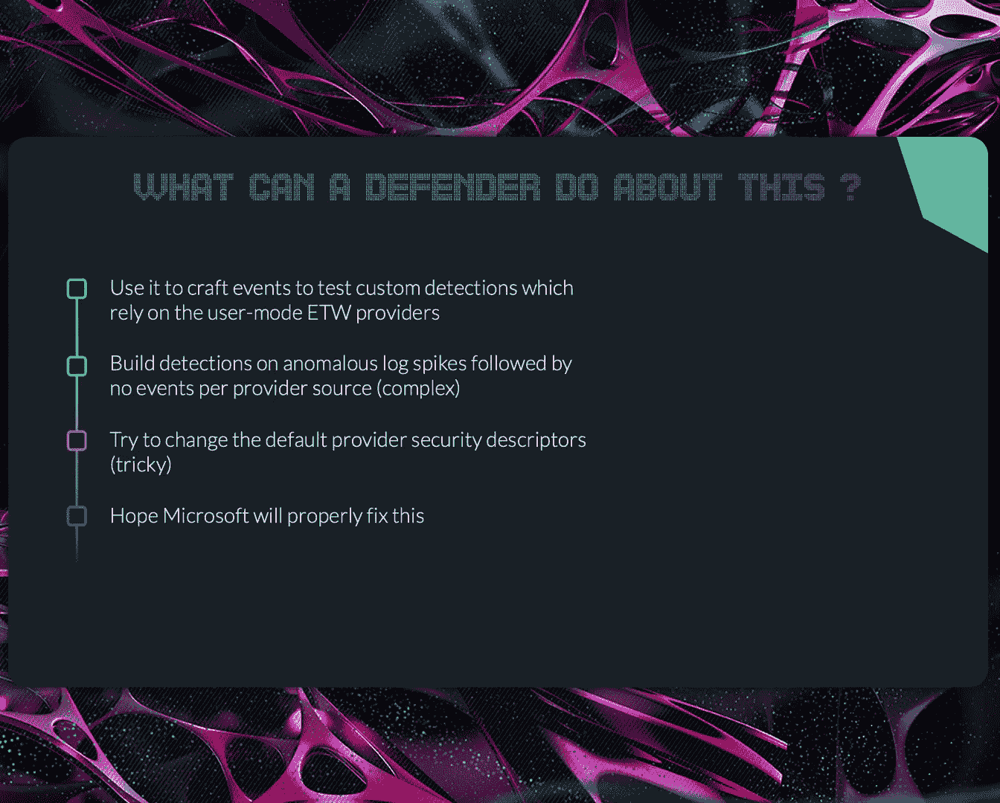

我写了一个简单的工具来尽可能快地发出大量事件，并为一个测试提供程序启动了一个真实的跟踪会话（但忘了连接消费者）。你可以看到，左侧的 LDAP 客户端 ETW 提供程序出现了大量失败，右侧则显示所有事件都在底部丢失了。

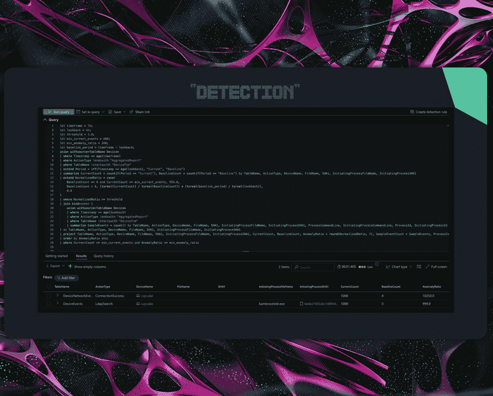

右侧显示的工具 `etwtop` 是我将在演讲后发布的，用于监控这类情况。我发布的主要工具是 `bambu_edr`，它可以用来做我前面提到的所有事情：发出事件、针对许多 EDR 触发上限、模拟真实攻击工具（如 SharpHound）以测试检测规则，以及启动跟踪会话但不连接消费者，从而淹没缓冲区并使依赖这些提供程序的进程“失明”。

---

## 防御者与攻击者的视角 ⚖️

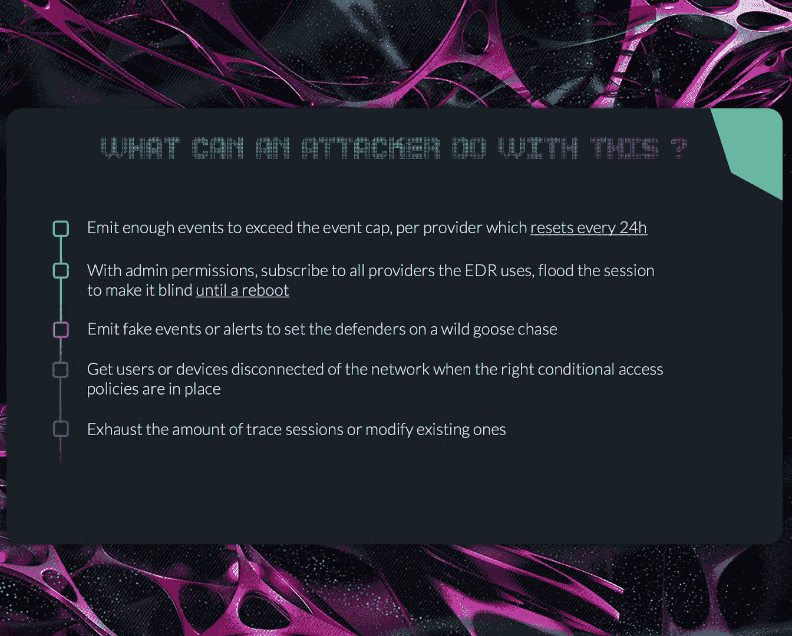

接近尾声了。防御者能做什么？我们至少可以用它来测试我们的自定义检测规则。我们可以尝试基于日志峰值构建检测，但可能很复杂。我们可以尝试修改安全描述符来阻止此类事情发生，但这可能很棘手，因为你不知道会破坏什么。本质上，我们只能希望微软最终能意识到需要在这方面做更多工作。

对于攻击者来说，这实际上更有趣。我们可以为一个提供程序发出足够多的事件，使其在至少 24 小时内因全局上限而“失明”。我们还可以注册一个跟踪会话并淹没缓冲区，这将使其在机器重启前一直“失明”。我们仍然可以伪造事件，分散分析师注意力。如果条件访问策略允许，我们甚至可以将用户或设备踢出网络。此外，跟踪会话在机器上也有数量限制（通常是 64 个），因此你也可以通过注册大量会话来阻止 EDR 添加新的会话。

---

## 总结与思考 🤔

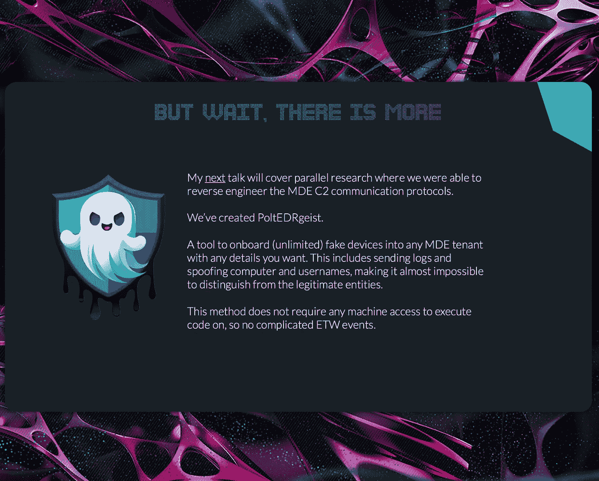

现在，核心问题是：你不能再完全信任你的日志了。我与 ETW 专家确认过，情况确实如此。我们陷入了一个有点奇怪的境地：我们想