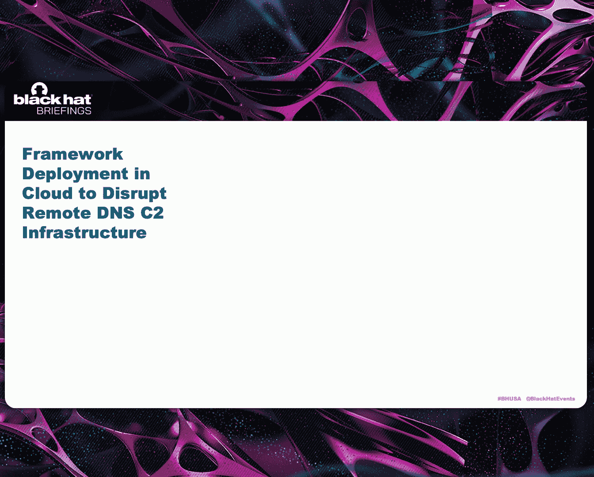
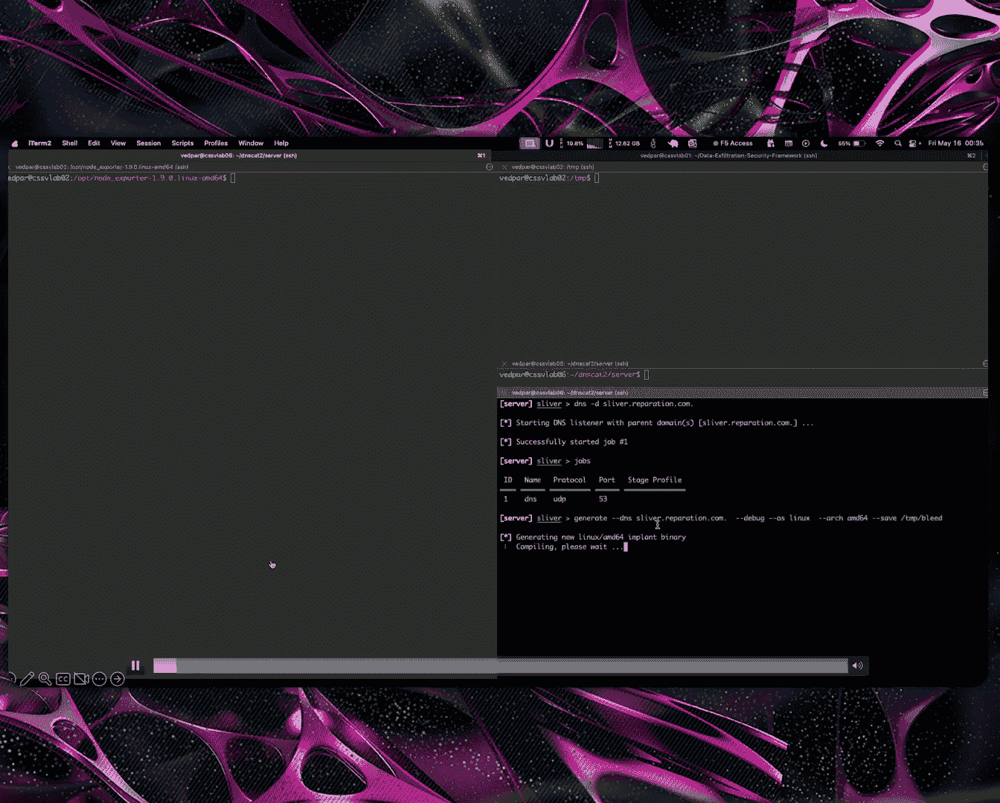
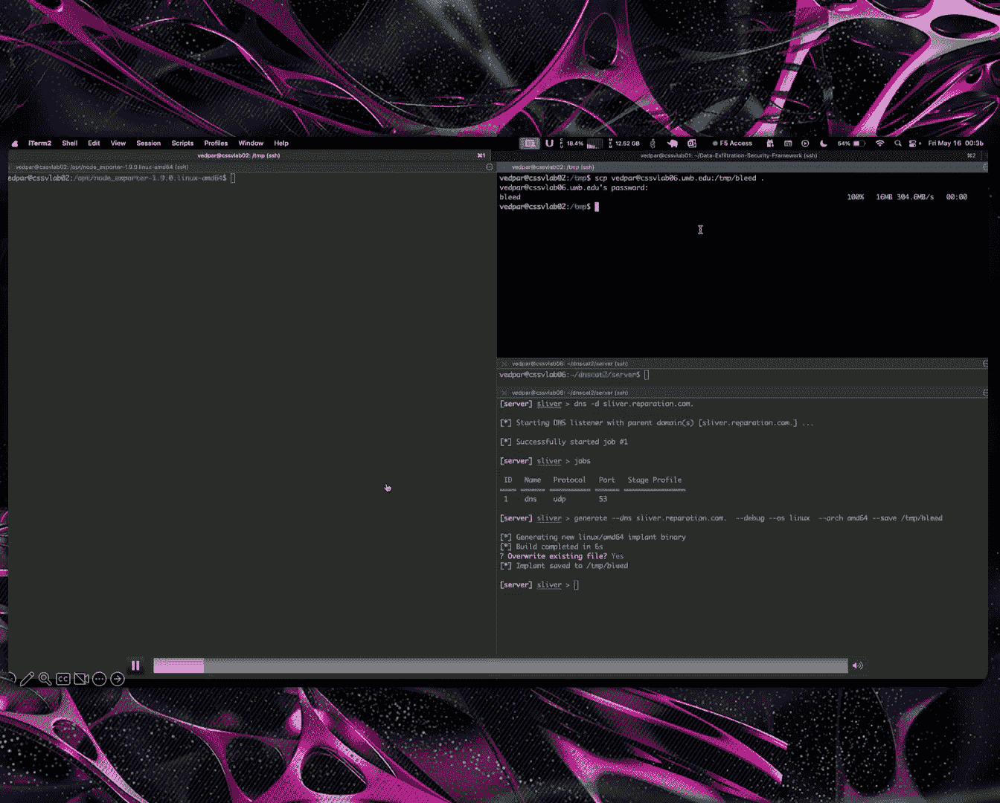
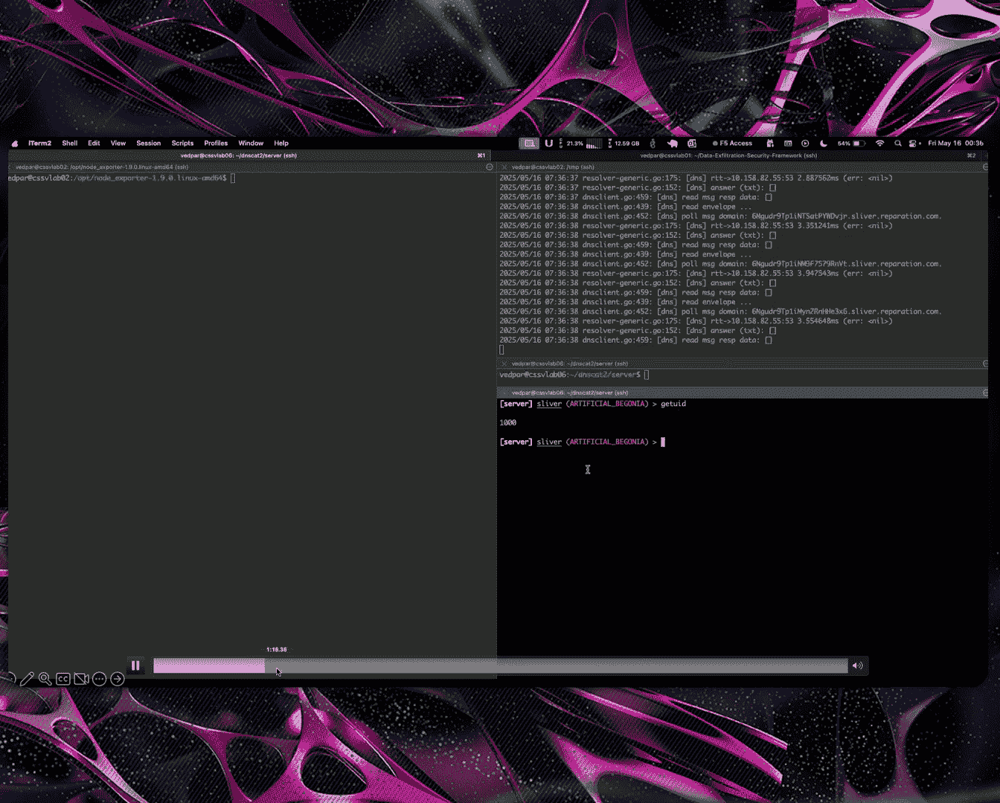
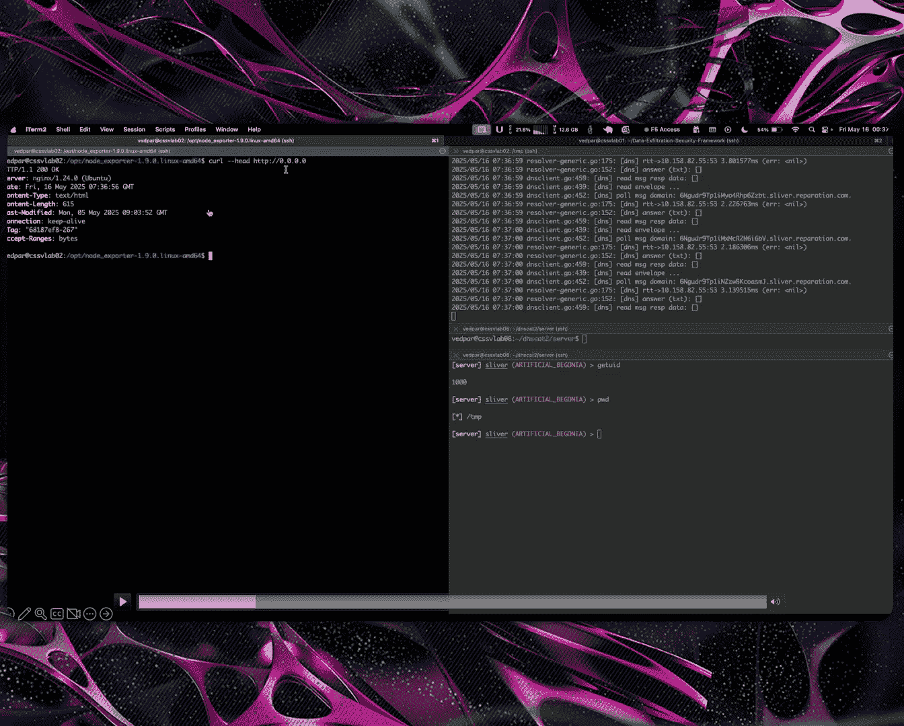
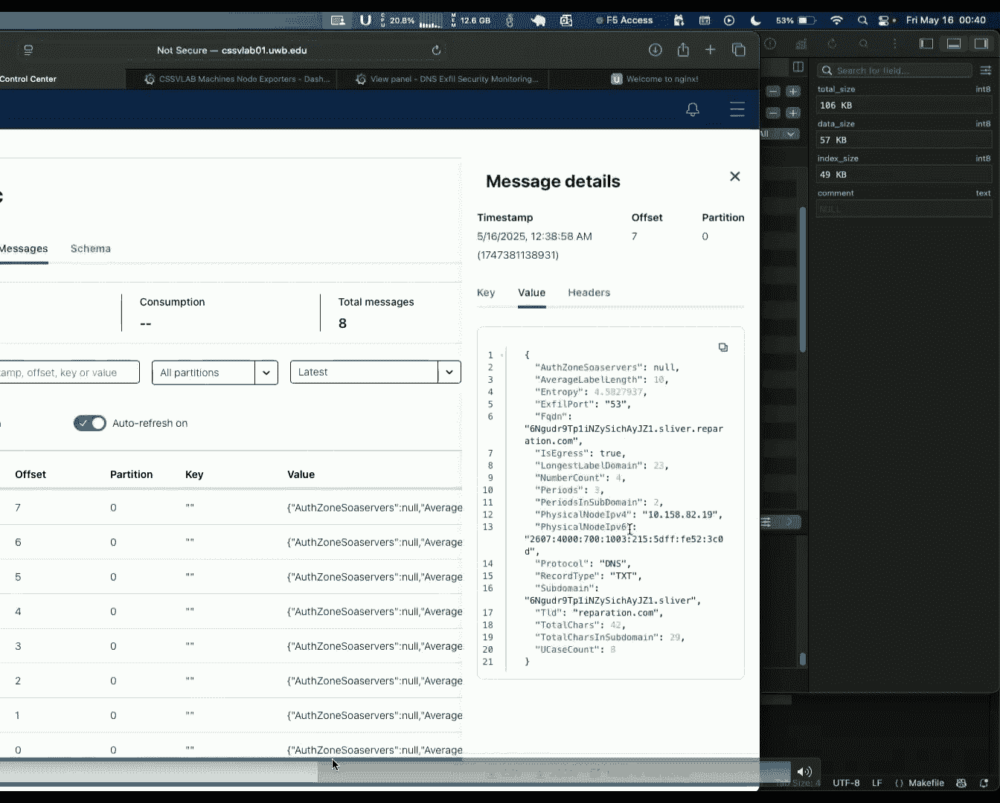
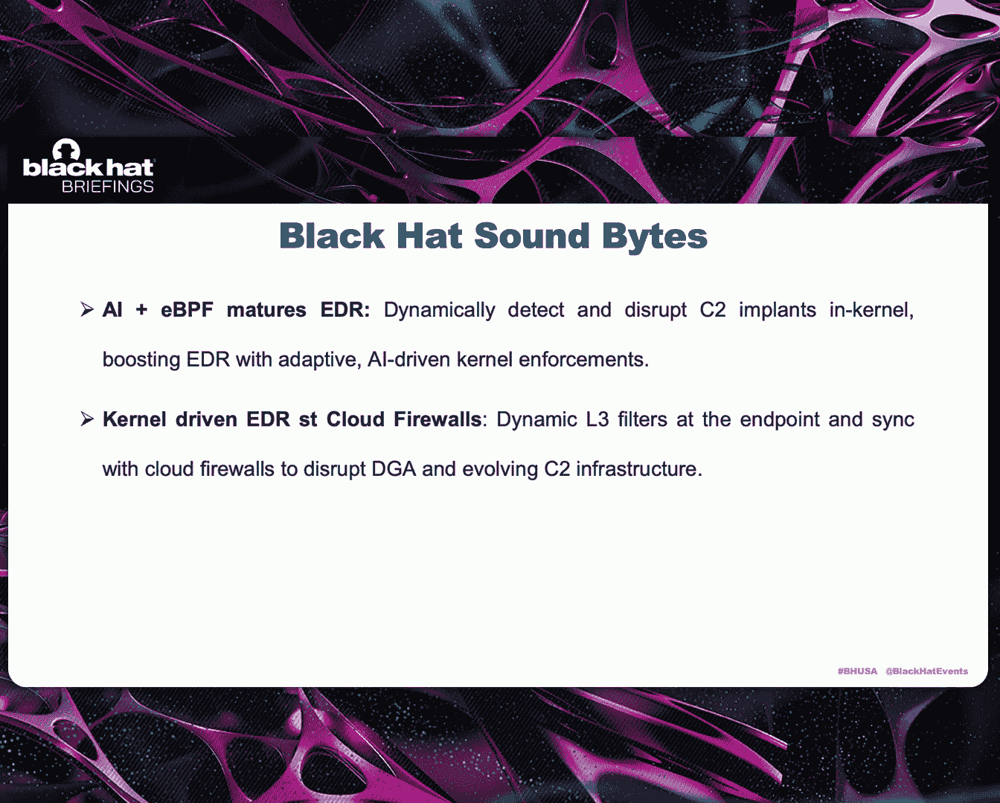

# 课程 1：内核强制的 DNS 数据外泄安全 🔐

在本课程中，我们将学习如何利用 Linux 内核和 eBPF 技术来主动检测和阻断基于 DNS 的命令与控制攻击，保护云环境中的端点安全。

## 概述：为什么 DNS 是关键的 C2 后门

大多数高级持续性威胁在利用云环境时，更倾向于将 DNS 作为其通信通道。DNS 协议是互联网的基础和骨干，但作为命令与控制的隐蔽通信通道时，它变得极具破坏性。它默认不加密，防火墙日志很少被监控，并且由于其基于 UDP 的无状态特性，攻击者可以轻松地从投掷基础设施进行控制。

## 攻击向量与 C2 基础设施

以下是三种主要的 DNS 攻击向量：

1.  **DNS C2**：最具破坏性。攻击者将命令嵌入 DNS 子域名中，主要目的是持久性和高级驻留。
2.  **DNS 隧道**：通过 DNS 隧道传输被防火墙阻止的协议。
3.  **原始数据外泄**：最简单的形式，通常是一次性的大量数据外泄。

攻击者不会只注册单个域名。他们会部署服务器舰队以实现最大化的规避。**域名生成算法** 与 **IP 地址突变** 相结合，使得静态黑名单难以应对。

## 现有方法的挑战

现有的方法主要分为两类：

*   **半被动分析**：较少使用，通常通过可编程软件交换机进行深度包检测。
*   **被动分析**：主流方法，依赖于异常检测、流量威胁签名和域名信誉。

这些方法面临的主要挑战是**检测和响应速度慢**，难以跟上不断演变的 C2 植入程序的规避手段。它们本质上是主动的，而非反应性的。

## 内核强制的端点安全解决方案

上一节我们讨论了现有方法的局限性，本节中我们来看看我们提出的解决方案：一种反应性的、基于内核的端点安全方法。

核心思想是：与其在网络层面被动地追捕 C2 活动，不如让端点引擎在**内核层面**主动追捕正在发生的事件。这确保了无论恶意软件在用户空间如何隐藏，都无法逃避检测。

### eBPF：内核可编程性的关键

**eBPF** 是一种安全地重新编程 Linux 内核的现代方式。可以将其视为运行在内核中的虚拟机，允许你注入运行时程序并将其附加到内核子系统。

```c
// eBPF 程序示例结构（概念性）
SEC("kprobe/tcp_connect")
int handle_tcp_connect(struct pt_regs *ctx) {
    // 在内核中执行安全检查逻辑
    bpf_printk("TCP connect event detected!\\n");
    return 0;
}
```

eBPF 程序通过验证器确保安全，并可以附加到网络栈、LSM 等关键子系统。它们通过 **eBPF 映射** 和 **环形缓冲区** 与用户空间代理通信，传递威胁情报。

### 系统架构与工作流程

我们的解决方案是一个多层安全代理：

1.  **用户空间**：包含 eBPF 代理加载器、信誉域名缓存、用于数据混淆检测的量化深度学习模型以及指标导出器。
2.  **内核空间**：由代理注入的多个 eBPF 程序，分别负责进程追踪、网络包深度检测等。

以下是其工作流程：

*   当受感染的 C2 植入程序发送恶意 DNS 数据包时，数据包首先到达内核的流量控制层。
*   eBPF 程序会追踪与此数据包关联的进程及其父进程。
*   在网络栈中，程序检查进程是否在黑名单中。如果不是，则对数据包进行深度检测。
*   检测可能涉及将数据包**重定向**或**克隆**到用户空间代理进行更复杂的分析（如模型推理）。
*   如果用户空间代理判定为恶意，它会更新内核 eBPF 映射，将相关进程加入黑名单。
*   此后，内核会丢弃该进程的后续数据包，打乱其心跳模式，同时继续收集其行为遥测数据。
*   最终，代理根据收集到的足够行为分析，终止恶意进程。

### 两种运行模式

1.  **主动进程安全执行模式**：适用于可容忍一定延迟但不能接受任何命令执行的端点。它通过重定向数据包进行实时深度检测。
2.  **被动深度包检测与行为分析模式**：适用于不能接受重定向带来延迟的场景（如 TCP）。它通过克隆数据包在用户空间进行分析和跟踪，积累足够证据后在内核层面实施拦截。

### 检测模型

检测的核心是一个经过量化的深度学习模型，用于识别 DNS 查询中的恶意模式。

**模型输入特征**包括：
*   **内核特征**：查询长度、标签数量、标签长度等（基于 DNS 协议规范的限制）。
*   **用户空间特征**：查询模式、词汇特征、**熵值**（用于测量子域名字符串的随机性）。

该模型使用约 6000 万个合成域名数据集进行训练，这些数据模拟了正常和恶意流量。模型被转换为 **ONNX** 格式以实现高效推理，其架构是一个用于二分类的密集神经网络。

## 云环境部署架构



为了在云环境中大规模对抗 C2 基础设施，我们需要一个协同的防御体系。

部署架构包含以下组件：

*   **数据平面**：每个端点（如虚拟机、容器）都运行着 eBPF 安全代理。
*   **控制平面**：由控制器节点组成，消费来自各代理的遥测数据流。
*   **消息总线**：用于传输遥测数据和命令（如 Kafka）。
*   **DNS 基础设施**：本地权威 DNS 服务器、解析器等。

工作流程如下：
1.  某个端点被感染并发送恶意 DNS 查询。
2.  该端点的 eBPF 代理检测并阻断攻击，同时将攻击详情（如恶意域名）发送到消息总线。
3.  控制器节点消费这些信息，动态地在全网 DNS 层（如通过响应策略区）黑名单该域名。
4.  控制器还可能进行反向溯源分析，了解 C2 重定向器网络。
5.  更新后的黑名单和防护策略通过消息总线下发到所有数据平面的 eBPF 代理，实现全网同步防护。



这种架构提供了**双重防御层**：即使某个端点操作系统不支持 eBPF，受保护的 DNS 基础设施也能作为一道防线。







## 演示与效果

通过演示可以看到，当启动 C2 植入程序（如 Sliver）并执行远程命令、端口转发时，会产生大量 DNS 流量。一旦启动 eBPF 安全代理，代理会立即注入程序并开始检测。恶意进程的 DNS 查询开始出现错误并被丢弃，其行为遥测（如进程ID、存活时间、外泄尝试次数）被实时导出到仪表板。最终，代理收集到足够证据后终止了恶意进程。整个响应时间在微秒级，模型精度高达约 99.89%。


## 未来方向




1.  **TLS 指纹识别**：将 eBPF 附着于内核 TLS/加密隧道组件，实现进程关联的 TLS 流量分析。
2.  **持续模型进化**：采用持续学习机制，使模型能适应新的数据混淆技术。
3.  **行为分析增强**：利用 LSTM 等模型对内核收集的进程行为序列进行更深入的分析。
4.  **DDoS 防护**：利用 eBPF 在网络驱动层的支持，实现内生的 DDoS 攻击防护能力。

## 关键要点与总结

本节课中我们一起学习了如何利用 eBPF 和 AI 增强端点安全。

*   **eBPF 成熟了 EDR**：它允许重新编程内核，获取更深层的系统遥测数据。
*   **AI 与 eBPF 的结合**：使得 EDR 代理能够基于丰富的行为指标实施动态的内核级强制策略，更具弹性。
*   **自底向上的全面防护**：通过加固操作系统内核（eBPF EDR）→ 提升安全信息和事件管理系统的质量 → 实现智能的云防火墙（动态 L3/L7 过滤），从而构建一个能够抵御大规模、多变 C2 基础设施的弹性云网络。



即使未来 DNS 普遍加密，这种基于内核深度遥测和行为分析的方法，仍然是应对加密隧道攻击的有效途径。

**感谢你的关注。**